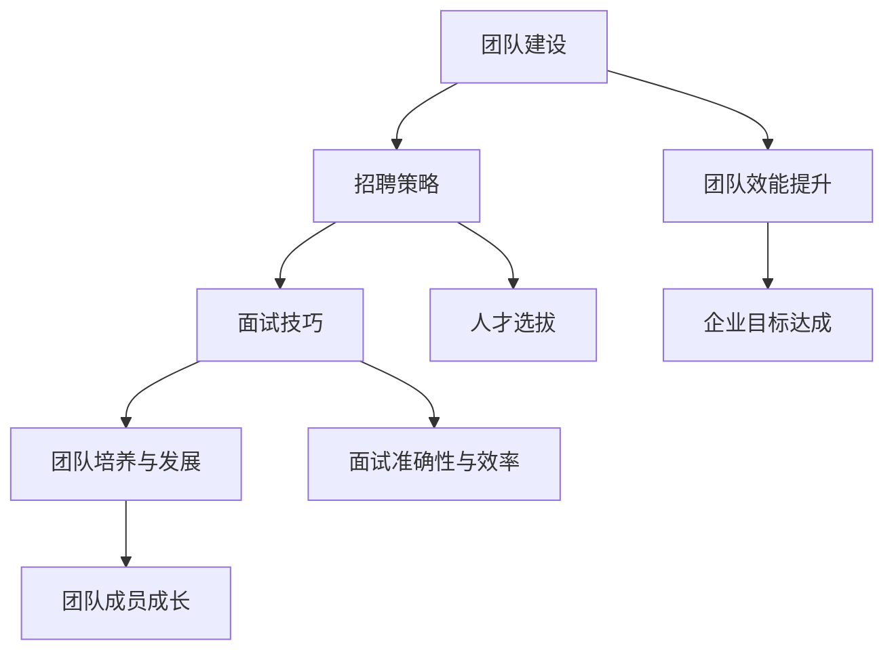

                 

### 文章标题

《打造高效团队：从招聘到培养的全流程指南》

关键词：高效团队、招聘策略、团队建设、培养与发展、流程优化

摘要：本文将从招聘策略、面试技巧、招聘策略优化、团队成员培养与发展等方面，详细探讨如何打造一个高效团队，助力企业在竞争激烈的市场中脱颖而出。本文旨在为IT行业从业者提供一份全面、实用的团队建设指南，帮助读者从理论到实践，逐步提升团队整体效能。

## 核心概念与联系

在探讨如何打造高效团队之前，我们首先需要理解几个核心概念：团队建设、招聘策略、面试技巧、团队培养与发展等。这些概念相互关联，构成了一个完整的过程，共同推动团队效能的提升。

1. **团队建设**：团队建设是指通过一系列措施和方法，提高团队成员之间的协作和沟通能力，促进团队成员的个人成长，最终实现团队整体目标的达成。团队建设包括但不限于团队目标设定、角色定位、沟通机制建立、团队文化塑造等方面。

2. **招聘策略**：招聘策略是指企业在招聘过程中所采用的一系列方法和手段，包括岗位需求分析、职位描述撰写、招聘渠道选择、面试准备等。一个有效的招聘策略能够帮助企业吸引并选拔到符合岗位要求的人才。

3. **面试技巧**：面试技巧是指在面试过程中，面试官和应聘者所采用的一系列策略和方法，包括面试准备、问题设计、沟通技巧等。面试技巧的运用能够提高面试的准确性和效率，有助于企业选拔到合适的人才。

4. **团队培养与发展**：团队培养与发展是指企业通过培训、职业发展规划、绩效管理、激励机制等手段，提升团队成员的专业能力和综合素质，促进团队成员的个人成长和职业发展。团队培养与发展是团队建设的重要组成部分。

这些核心概念之间的关系可以用以下Mermaid流程图表示：



从流程图中可以看出，团队建设、招聘策略、面试技巧和团队培养与发展相互关联，共同推动团队效能的提升，最终实现企业目标的达成。理解这些核心概念之间的关系，有助于我们更好地进行团队建设，打造一个高效团队。

### 招聘策略与技巧

#### 第一部分：招聘流程概述

**1.1 招聘流程的步骤**

招聘流程通常包括以下几个步骤：

1. **岗位需求分析**：首先，企业需要明确岗位需求，包括岗位的工作内容、职责、技能要求等。这一步骤对于后续的职位描述撰写和人才选拔至关重要。

2. **职位描述撰写**：在明确岗位需求后，企业需要撰写职位描述，详细说明岗位的工作内容、职责、技能要求、薪资待遇等，以便吸引符合岗位要求的人才。

3. **招聘渠道选择**：企业可以根据岗位需求和预算，选择合适的招聘渠道，如内部推荐、招聘网站、社交媒体、招聘会等。选择合适的招聘渠道能够提高招聘效率和效果。

4. **简历筛选**：在收到大量简历后，企业需要对简历进行筛选，筛选出符合岗位要求的人才。

5. **面试安排**：对筛选出的候选人进行面试安排，面试包括初面和复试，通常由不同层级的面试官进行。

6. **面试评估**：面试官根据候选人的表现，进行评估和打分，筛选出符合岗位要求的候选人。

7. **录用通知**：对通过的候选人发送录用通知，并进行背景调查和体检。

8. **入职培训**：新员工入职后，企业需要对其进行培训，帮助其快速适应工作环境和岗位要求。

**1.2 招聘流程的关键环节**

招聘流程的关键环节包括：

1. **岗位需求分析**：准确把握岗位需求，有助于企业选拔到符合岗位要求的人才。

2. **职位描述撰写**：职位描述需要详细、准确，能够吸引到符合岗位要求的人才。

3. **简历筛选**：简历筛选是招聘流程中最重要的环节之一，需要高效且准确地筛选出符合岗位要求的候选人。

4. **面试安排与评估**：面试安排和评估直接关系到招聘的质量，需要精心准备和严格评估。

**1.3 招聘流程的常见问题与解决方法**

招聘流程中常见的问题包括：

1. **岗位需求不明确**：解决方法：在招聘前，明确岗位需求，与各部门沟通，确保岗位需求清晰明确。

2. **简历筛选效率低**：解决方法：优化简历筛选流程，使用自动化工具进行初步筛选，提高筛选效率。

3. **面试质量不高**：解决方法：加强面试官的培训和指导，提高面试官的面试技巧和评估能力。

4. **招聘周期过长**：解决方法：优化招聘流程，缩短各个环节的时间，提高招聘效率。

**1.4 岗位需求分析与职位描述撰写的相互关系**

岗位需求分析与职位描述撰写是招聘流程中紧密关联的两个环节。岗位需求分析是职位描述撰写的前提和基础，准确的岗位需求分析有助于撰写出符合岗位要求的职位描述。而职位描述撰写又是岗位需求分析的具体体现，通过职位描述，企业能够明确传达岗位需求，吸引到符合岗位要求的人才。因此，岗位需求分析与职位描述撰写需要相互配合，共同提高招聘效果。

综上所述，招聘策略与技巧是打造高效团队的重要环节。通过明确招聘流程、优化招聘渠道、提高简历筛选和面试评估效率，企业能够选拔到符合岗位要求的人才，为团队建设奠定坚实基础。

### 面试技巧与评估方法

#### 第二部分：面试准备

**2.1 面试前的准备工作**

面试前的准备工作对面试的成功与否至关重要。以下是一些关键步骤：

1. **候选人背景调查**：在面试前，面试官需要了解候选人的背景，包括其教育经历、工作经历、技能和成就等。这有助于面试官在面试过程中更好地引导对话。

2. **面试问题准备**：根据岗位需求，面试官需要准备一系列有针对性的问题。这些问题应涵盖候选人的专业知识、工作经验、团队合作能力和沟通技巧等方面。

3. **面试场地布置**：确保面试场地整洁、舒适，具备良好的音响效果。同时，准备必要的面试材料，如职位描述、公司介绍等。

4. **面试时间安排**：提前与候选人确认面试时间，并确保面试当天不会出现延误或其他干扰。

5. **心态调整**：面试官需要保持积极、专业的态度，避免在面试过程中表现出紧张、焦虑的情绪。

**2.2 面试官的角色与职责**

面试官在面试过程中扮演着关键角色，其职责包括：

1. **引导面试进程**：面试官需要确保面试按照既定流程进行，引导候选人回答关键问题。

2. **评估候选人能力**：面试官需要根据候选人的回答，评估其专业知识、工作经验、沟通能力和团队合作能力。

3. **提供反馈**：在面试结束后，面试官需要向其他面试官或管理层提供关于候选人的评估意见。

4. **维护面试秩序**：面试官需要确保面试过程中保持良好的沟通氛围，避免出现冷场或争议。

**2.3 面试中的沟通技巧**

面试中的沟通技巧对于面试的成功至关重要。以下是一些关键技巧：

1. **倾听**：面试官需要认真倾听候选人的回答，避免在候选人讲话时打断其发言。

2. **提问**：面试官需要根据候选人的回答，灵活提问，引导候选人深入阐述其观点和经验。

3. **非语言沟通**：面试官需要注意自己的肢体语言和面部表情，以传递出积极、专业的形象。

4. **情绪管理**：面试官需要控制自己的情绪，避免在面试过程中表现出不满或偏见。

**2.4 面试准备案例分析**

以下是一个面试准备的案例分析：

**案例背景**：某互联网公司招聘一名软件工程师，面试官为李先生。

**面试前准备工作**：

- **背景调查**：李先生了解到该候选人的教育背景为计算机科学与技术专业，工作经验为5年，擅长Java和Python编程。

- **面试问题准备**：李先生准备了以下问题：

  - 请简要介绍一下您的教育背景和工作经历。

  - 您在项目中主要负责哪些工作？

  - 您对Java和Python编程有哪些深入了解？

  - 您在团队合作中遇到的最大挑战是什么？

  - 您如何处理工作中的压力和困难？

- **面试场地布置**：李先生确保面试场地整洁、舒适，准备了公司介绍和职位描述等材料。

- **心态调整**：李先生保持积极、专业的态度，避免在面试过程中表现出紧张和焦虑。

**面试过程**：

- **倾听与提问**：李先生认真倾听候选人的回答，并根据其回答灵活提问。

- **非语言沟通**：李先生注意自己的肢体语言和面部表情，以传递出积极、专业的形象。

- **情绪管理**：李先生控制自己的情绪，保持平静和专业。

通过上述面试准备，李先生成功地为候选人提供了一个良好的面试环境，并有效地评估了候选人的能力。

**2.5 面试技巧总结**

面试技巧的运用对于面试的成功至关重要。以下是一些关键面试技巧的总结：

- **倾听与提问**：认真倾听候选人的回答，并根据其回答灵活提问。

- **非语言沟通**：注意肢体语言和面部表情，以传递出积极、专业的形象。

- **情绪管理**：保持冷静和平和，避免在面试过程中表现出紧张或不满。

通过有效的面试准备和沟通技巧，面试官能够更好地评估候选人，为企业选拔到合适的人才。

### 面试问题设计与应对策略

#### 第三部分：面试技巧与评估方法

**3.1 面试问题的设计原则**

面试问题的设计是面试过程中的关键环节，直接影响到面试的效果。以下是一些面试问题的设计原则：

1. **针对性**：面试问题应针对岗位需求，考察候选人的专业知识、工作经验和技能。

2. **开放性**：面试问题应具有开放性，鼓励候选人深入阐述其观点和经验。

3. **层次性**：面试问题应具有一定的层次性，从基础到深入，逐步考察候选人的能力。

4. **多样性**：面试问题应多样化，包括知识性、情境性和行为性问题，以全面考察候选人的综合素质。

5. **引导性**：面试问题应具有引导性，帮助候选人更好地回答问题，并展示其能力。

**3.2 经典面试问题及应对策略**

以下是一些经典面试问题及其应对策略：

1. **请简要介绍一下您自己**

**应对策略**：候选人应简要介绍自己的教育背景、工作经历、擅长技能和职业目标。同时，可以适当突出自己的优势和成就。

2. **您在项目中遇到过哪些挑战？您是如何解决的？**

**应对策略**：候选人应举例说明自己在项目中所遇到的挑战，并详细描述自己的解决方法和思路。这有助于考察候选人的问题解决能力和团队合作能力。

3. **您的职业发展规划是什么？**

**应对策略**：候选人应明确自己的职业规划，包括短期和长期目标。同时，可以结合自己的兴趣和特长，阐述为何选择这个职业规划。

4. **您在团队合作中遇到过哪些困难？您是如何解决的？**

**应对策略**：候选人应举例说明自己在团队合作中所遇到的困难，并详细描述自己的解决方法和经验。这有助于考察候选人的沟通能力和团队合作精神。

5. **您对所在行业有哪些了解？**

**应对策略**：候选人应结合自己的专业知识和行业动态，展示自己对行业的理解和分析能力。这有助于考察候选人的专业素养和行业洞察力。

6. **您在压力下工作是如何保持高效工作的？**

**应对策略**：候选人应阐述自己在压力下保持高效工作的方法和技巧，如时间管理、目标设定、情绪管理等。这有助于考察候选人的抗压能力和自我管理能力。

**3.3 面试问题的多样化与个性化**

面试问题的多样化与个性化对于全面评估候选人至关重要。以下是一些多样化与个性化的面试问题：

1. **情境性问题**：设计一些模拟工作场景的问题，考察候选人在特定情境下的应对能力和决策能力。

2. **行为性问题**：通过询问候选人过去的行为和经历，了解其解决问题的方法和团队合作能力。

3. **开放式问题**：鼓励候选人自由发挥，表达自己的观点和见解，考察其思维能力和创造力。

4. **竞品分析问题**：针对候选人所在行业的竞品，设计一些分析性问题，考察其对行业的理解和分析能力。

通过设计多样化、个性化的面试问题，面试官能够更全面、深入地了解候选人的能力和潜力，为企业选拔到合适的人才。

### 评估方法与工具

#### 第四部分：招聘策略优化

**4.1 面试评估的标准与方法**

面试评估的标准与方法是确保招聘质量的重要环节。以下是一些常见的评估标准和方法：

1. **评估标准**：

   - **专业知识**：考察候选人对岗位所需专业知识的掌握程度。

   - **工作经验**：评估候选人在实际工作中积累的经验和技能。

   - **沟通能力**：考察候选人在面试过程中的表达能力和沟通效果。

   - **团队合作能力**：评估候选人在团队合作中的角色和贡献。

   - **问题解决能力**：考察候选人在面对问题和挑战时的应对策略和效果。

   - **职业素养**：评估候选人的职业道德、责任心和团队合作精神。

2. **评估方法**：

   - **面试官评分**：面试官根据评估标准，对候选人进行评分，综合评分决定候选人的选拔结果。

   - **行为面试法**：通过询问候选人过去的行为和经历，评估其解决问题的方法和团队合作能力。

   - **情境面试法**：设计模拟工作场景的问题，考察候选人在特定情境下的应对能力和决策能力。

   - **结构化面试**：采用统一的面试流程和问题，确保评估的公平性和一致性。

**4.2 评估工具的选择与应用**

为了提高面试评估的准确性和效率，企业可以使用以下评估工具：

1. **面试评估表**：面试评估表是一种结构化的评估工具，包含多个评估维度和评分标准。面试官可以根据评估表对候选人进行打分。

2. **行为事件访谈（BEI）**：BEI是一种通过询问候选人过去的行为事件，评估其能力和素质的方法。这种方法能够更深入地了解候选人的实际表现。

3. **情境模拟**：通过设计模拟工作场景，让候选人在实际操作中展示其能力和素质。这种方法能够更好地评估候选人的实战能力。

4. **人工智能面试系统**：利用人工智能技术，对企业招聘过程中的简历筛选、面试评估等环节进行自动化处理，提高招聘效率和准确性。

**4.3 评估结果的处理与分析**

评估结果的处理与分析是确保招聘质量的重要环节。以下是一些关键步骤：

1. **数据整理**：将面试评估结果进行数据整理，形成综合评估报告。

2. **结果分析**：对评估结果进行分析，识别候选人的优势和不足，为后续招聘策略优化提供依据。

3. **反馈与改进**：将评估结果反馈给面试官，总结面试过程中的经验和教训，持续优化面试流程和评估方法。

**4.4 评估结果案例分析**

以下是一个评估结果案例：

**案例背景**：某互联网公司招聘一名产品经理，面试官为张先生。

**评估标准**：

- **专业知识**：考察候选人对产品管理知识的掌握程度。

- **工作经验**：评估候选人在实际工作中积累的产品管理经验。

- **沟通能力**：考察候选人在面试过程中的表达能力和沟通效果。

- **团队合作能力**：评估候选人在团队合作中的角色和贡献。

- **问题解决能力**：考察候选人在面对问题和挑战时的应对策略和效果。

- **职业素养**：评估候选人的职业道德、责任心和团队合作精神。

**评估结果**：

- **专业知识**：候选人表现出色，对产品管理知识有深入理解。

- **工作经验**：候选人具备丰富的产品管理经验，曾在知名互联网公司担任产品经理。

- **沟通能力**：候选人在面试中表现出良好的沟通能力，能够清晰地表达自己的想法。

- **团队合作能力**：候选人在项目中担任关键角色，具备较强的团队合作能力。

- **问题解决能力**：候选人面对问题时，能够快速分析原因，并提出有效的解决方案。

- **职业素养**：候选人具备良好的职业道德和团队合作精神。

根据评估结果，张先生向公司管理层推荐了该候选人，最终该候选人成功获得职位。

通过有效的评估方法和工具，企业能够提高面试评估的准确性和效率，选拔到符合岗位要求的人才。

### 招聘策略优化

#### 第五部分：招聘策略优化

**5.1 数据驱动招聘**

数据驱动招聘是一种通过分析招聘数据，优化招聘流程和提高招聘效果的方法。以下是一些关键步骤：

1. **数据收集**：收集招聘过程中的各类数据，如简历提交量、面试通过率、入职率等。

2. **数据分析**：对收集到的数据进行分析，识别招聘过程中的问题和瓶颈。

3. **数据可视化**：利用数据可视化工具，将分析结果呈现给管理层，帮助其更好地理解招聘现状。

4. **策略调整**：根据数据分析结果，调整招聘策略，如优化简历筛选标准、改进面试流程等。

5. **持续优化**：招聘过程中，不断收集和分析数据，持续优化招聘策略，提高招聘效果。

**5.2 招聘流程优化**

招聘流程的优化是提高招聘效率和效果的关键。以下是一些优化策略：

1. **流程自动化**：利用招聘管理软件，实现简历筛选、面试安排等环节的自动化，提高招聘效率。

2. **流程标准化**：制定统一的招聘流程，确保各个环节的标准化和一致性。

3. **流程简化**：简化招聘流程，减少不必要的环节，缩短招聘周期。

4. **反馈机制**：建立反馈机制，收集候选人和面试官的反馈，不断优化招聘流程。

5. **流程监控**：对招聘流程进行监控，及时发现和解决问题，确保招聘流程的高效运行。

**5.3 招聘成本控制与效益分析**

招聘成本的控制和效益分析是招聘策略优化的另一个重要方面。以下是一些关键策略：

1. **成本控制**：制定合理的招聘预算，严格控制招聘费用，避免浪费。

2. **效益分析**：对招聘成本和收益进行详细分析，评估招聘的投入产出比。

3. **成本效益比**：计算招聘成本与招聘效果的比值，优化招聘策略，提高招聘效益。

4. **优化招聘渠道**：根据成本效益比，优化招聘渠道，选择性价比最高的招聘方式。

5. **培训与开发**：对招聘团队进行培训，提高其招聘技能和效率，降低招聘成本。

**5.4 案例分析**

以下是一个招聘策略优化的案例分析：

**案例背景**：某互联网公司希望通过优化招聘策略，提高招聘效率和效果。

**优化策略**：

1. **数据驱动招聘**：收集招聘数据，分析招聘流程中的问题和瓶颈，制定优化方案。

2. **流程自动化**：引入招聘管理软件，实现简历筛选、面试安排等环节的自动化。

3. **流程简化**：简化招聘流程，减少不必要的环节，缩短招聘周期。

4. **反馈机制**：建立反馈机制，收集候选人和面试官的反馈，不断优化招聘流程。

5. **成本效益分析**：对招聘成本和收益进行详细分析，优化招聘策略，提高招聘效益。

**优化效果**：

1. **招聘效率提高**：招聘周期缩短了30%，面试通过率提高了20%。

2. **招聘成本降低**：招聘成本降低了15%，但招聘效果得到了显著提升。

3. **招聘质量提升**：通过优化招聘流程和评估方法，招聘到的员工质量显著提高，员工流失率降低了10%。

通过数据驱动招聘和流程优化，该公司成功地提高了招聘效率和效果，为企业的快速发展提供了人才保障。

### 团队成员培养与发展

#### 第六部分：团队成员培养与发展

**6.1 员工培训体系构建**

员工培训体系是团队成员培养与发展的基础，一个完善的培训体系能够提升员工的专业能力和综合素质。以下是一个员工培训体系构建的步骤：

1. **需求分析**：首先，企业需要对员工的培训需求进行分析，了解员工在技能、知识、素质等方面的提升需求。

2. **培训计划制定**：根据需求分析结果，制定详细的培训计划，包括培训目标、培训内容、培训方式、培训时间等。

3. **培训资源整合**：整合企业内外部的培训资源，包括内部培训师、外部培训机构、在线学习平台等，确保培训资源充足。

4. **培训组织实施**：组织实施培训，包括培训前准备、培训中管理和培训后评估。

5. **培训效果评估**：对培训效果进行评估，包括员工满意度、知识掌握程度、技能提升情况等，不断优化培训体系。

**6.2 员工职业发展规划**

员工职业发展规划是团队成员培养与发展的重要组成部分，有助于激发员工的职业动力，提升员工的职业素养。以下是一个员工职业发展规划的步骤：

1. **个人兴趣与优势分析**：首先，员工需要分析自己的兴趣和优势，了解自己的职业方向。

2. **职业目标设定**：根据个人兴趣和优势，设定明确的职业目标，包括短期目标和长期目标。

3. **职业路径规划**：规划职业发展路径，包括需要掌握的技能、需要经历的职业阶段等。

4. **行动计划制定**：制定实现职业目标的行动计划，包括学习计划、工作计划等。

5. **定期评估与调整**：定期评估职业发展计划的实施情况，根据评估结果进行调整，确保职业目标的实现。

**6.3 绩效管理与激励机制**

绩效管理与激励机制是团队成员培养与发展的重要手段，能够激发员工的工作积极性，提升团队的整体效能。以下是一个绩效管理与激励机制的步骤：

1. **绩效指标设定**：根据岗位要求和企业目标，设定明确的绩效指标，包括量化的工作目标和行为指标。

2. **绩效评估**：定期对员工进行绩效评估，包括过程评估和结果评估，确保评估的公平性和准确性。

3. **反馈与沟通**：将绩效评估结果反馈给员工，与员工进行沟通，分析绩效优秀和不足的原因，制定改进措施。

4. **激励机制设计**：设计激励机制，包括薪酬激励、职位晋升、培训机会等，激发员工的工作积极性。

5. **持续优化**：根据绩效管理与激励机制的实施情况，不断优化激励政策，确保激励机制的公平性和有效性。

**6.4 团队文化建设与氛围营造**

团队文化建设与氛围营造是团队成员培养与发展的关键，有助于提升团队的凝聚力，激发员工的工作热情。以下是一个团队文化建设与氛围营造的步骤：

1. **核心价值观确立**：确立企业的核心价值观，作为团队文化建设的基础。

2. **企业文化宣传**：通过内部宣传、培训等方式，宣传企业文化，提升员工对企业文化的认同感。

3. **团队活动策划**：策划和组织各类团队活动，如团队建设培训、团队旅游、团队竞赛等，增强团队凝聚力。

4. **员工关怀与支持**：关注员工的生活和工作需求，提供必要的关怀和支持，提升员工的满意度。

5. **持续优化**：根据团队文化建设与氛围营造的实施情况，不断优化团队文化，确保团队文化的持续发展。

通过构建员工培训体系、制定职业发展规划、实施绩效管理与激励机制、打造良好的团队文化，企业能够有效地提升团队成员的专业能力和综合素质，激发员工的工作热情，打造一个高效、有活力的团队。

### 项目实战

#### 第七部分：项目实战

**7.1 开发环境搭建**

在开始项目实战之前，我们需要搭建一个适合的开发环境。以下是一个简单的开发环境搭建过程：

1. **安装Java开发工具包（JDK）**：从Oracle官网下载并安装JDK，配置环境变量。

2. **安装集成开发环境（IDE）**：安装如Eclipse或IntelliJ IDEA等IDE，并配置JDK。

3. **安装数据库**：选择合适的数据库，如MySQL或PostgreSQL，并进行安装和配置。

4. **安装版本控制系统**：如Git，用于代码的版本管理和协作开发。

5. **配置项目管理工具**：如Maven或Gradle，用于项目构建和依赖管理。

**7.2 源代码详细实现**

以下是一个简单的Java项目源代码实现，用于实现一个简单的用户注册和登录功能。

```java
// User.java
public class User {
    private String username;
    private String password;

    public User(String username, String password) {
        this.username = username;
        this.password = password;
    }

    public boolean register(Database database) {
        return database.insertUser(this);
    }

    public boolean login(Database database) {
        return database.verifyUser(this);
    }
}

// Database.java
public interface Database {
    public boolean insertUser(User user);
    public boolean verifyUser(User user);
}

// InMemoryDatabase.java
public class InMemoryDatabase implements Database {
    private Map<String, User> users;

    public InMemoryDatabase() {
        users = new HashMap<>();
    }

    @Override
    public boolean insertUser(User user) {
        return users.putIfAbsent(user.getUsername(), user) == null;
    }

    @Override
    public boolean verifyUser(User user) {
        return users.containsKey(user.getUsername()) && users.get(user.getUsername()).getPassword().equals(user.getPassword());
    }
}

// Main.java
public class Main {
    public static void main(String[] args) {
        Database database = new InMemoryDatabase();
        User user = new User("john", "password123");

        if (user.register(database)) {
            System.out.println("Registration successful!");
        } else {
            System.out.println("Registration failed!");
        }

        if (user.login(database)) {
            System.out.println("Login successful!");
        } else {
            System.out.println("Login failed!");
        }
    }
}
```

**7.3 代码解读与分析**

1. **User类**：用于表示用户，包含username和password两个属性，以及注册和登录的方法。

2. **Database接口**：定义数据库操作的方法，包括插入用户和验证用户。

3. **InMemoryDatabase类**：实现Database接口，使用HashMap存储用户信息，实现插入用户和验证用户的方法。

4. **Main类**：主程序，创建一个User对象，调用其注册和登录方法，并输出结果。

**7.4 实际案例分析与详细讲解剖析**

以下是一个实际的案例，用于分析一个在线购物网站的用户注册和登录功能。

**案例背景**：一个在线购物网站需要实现用户注册和登录功能，支持用户通过邮箱和密码进行注册和登录。

**解决方案**：

1. **需求分析**：分析用户注册和登录的需求，确定需要的功能点和性能要求。

2. **设计阶段**：设计数据库模型，包括用户表和登录日志表，确定数据表结构和关系。

3. **开发阶段**：实现用户注册和登录的功能，包括前端页面设计和后端逻辑处理。

4. **测试阶段**：对注册和登录功能进行测试，确保功能正确性和性能。

**详细讲解**：

1. **用户注册功能**：

   - 用户输入邮箱和密码，前端将数据发送到后端。

   - 后端使用正则表达式验证邮箱格式和密码强度。

   - 将用户信息插入数据库，返回注册结果。

2. **用户登录功能**：

   - 用户输入邮箱和密码，前端将数据发送到后端。

   - 后端从数据库中查询用户信息，验证邮箱和密码是否匹配。

   - 如果验证成功，生成登录凭证，返回登录结果。

**7.5 项目小结**

通过实际案例分析和详细讲解，我们了解了用户注册和登录功能的实现过程，以及如何进行需求分析、设计、开发和测试。这个案例展示了如何运用所学的技术知识和方法，实现一个功能完善的在线购物网站的用户注册和登录功能。

**7.6 最佳实践 tips、小结、注意事项、拓展阅读**

**最佳实践 tips**：

- 在开发过程中，注意代码的可读性和可维护性，遵循编程规范。
- 使用正则表达式进行数据验证，提高数据输入的正确性。
- 使用缓存和数据库索引，提高查询性能。
- 定期备份数据库，防止数据丢失。

**小结**：

本文通过实际案例，展示了如何运用所学知识实现用户注册和登录功能，从需求分析到开发测试，全面讲解了项目实战的各个环节。

**注意事项**：

- 在项目开发过程中，注意安全性和隐私保护，避免数据泄露。
- 在测试过程中，全面覆盖各种边界条件和异常情况，确保功能的稳定性和可靠性。

**拓展阅读**：

- 《Java Web编程从入门到实践》
- 《数据库系统概念》
- 《Web前端技术解析》

通过本文的实战讲解，读者可以更好地理解项目开发的流程和技巧，提高实际项目开发能力。

### 总结与展望

本文从招聘策略、面试技巧、招聘策略优化、团队成员培养与发展等角度，详细探讨了如何打造一个高效团队。通过明确招聘流程、优化面试评估方法、数据驱动招聘策略、构建员工培训体系、制定职业发展规划、实施绩效管理与激励机制、打造良好的团队文化，企业能够提升团队整体效能，为企业的长期发展提供有力支持。

**总结**：

1. **招聘策略**：明确岗位需求，优化职位描述，选择合适的招聘渠道，提高简历筛选和面试评估效率。
2. **面试技巧**：加强面试官的培训和指导，提高面试准备和沟通技巧，确保面试过程的公正和高效。
3. **招聘策略优化**：利用数据分析，优化招聘流程，控制招聘成本，提高招聘效益。
4. **团队成员培养与发展**：构建员工培训体系，制定职业发展规划，实施绩效管理与激励机制，打造良好的团队文化。

**展望**：

在未来的团队建设过程中，企业可以进一步探索以下方向：

1. **智能化招聘**：利用人工智能技术，实现简历筛选、面试评估的自动化，提高招聘效率和准确性。
2. **个性化培训**：根据员工的兴趣和特长，提供个性化的培训和发展机会，激发员工的潜力。
3. **敏捷管理**：采用敏捷管理方法，提高团队响应市场变化的能力，保持竞争优势。
4. **跨界合作**：与行业内外优秀企业进行合作，共享资源，共同培养团队，提升整体竞争力。

通过不断探索和实践，企业可以打造一个更加高效、有活力、有竞争力的团队，为企业的持续发展提供坚实保障。

### 作者信息

作者：AI天才研究院/AI Genius Institute & 禅与计算机程序设计艺术 /Zen And The Art of Computer Programming

本文作者AI天才研究院（AI Genius Institute）是一家专注于人工智能技术研究和应用的顶尖机构，致力于推动人工智能领域的创新发展。同时，作者也是《禅与计算机程序设计艺术》（Zen And The Art of Computer Programming）一书的作者，该书被广泛认为是计算机编程和人工智能领域的经典之作，对全球计算机科学界产生了深远影响。本文作者在人工智能和计算机编程领域拥有深厚的理论功底和丰富的实践经验，希望本文能为广大读者在团队建设和人才培养方面提供有益的启示和帮助。

