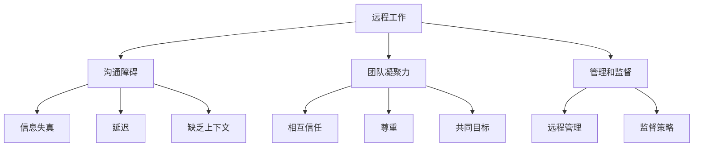
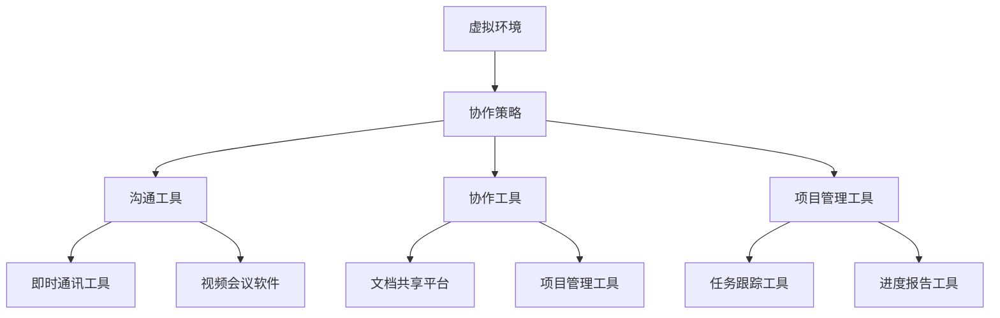
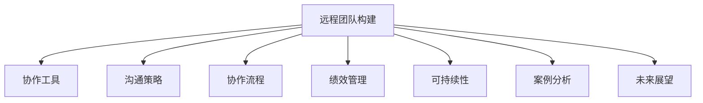

                 

### 文章标题

《打造高效远程团队：虚拟环境下的协作策略》

---

关键词：远程团队、虚拟环境、协作策略、远程工作、协作工具、沟通障碍

---

摘要：

本文旨在探讨如何打造一个高效远程团队，并详细介绍虚拟环境下协作的策略和方法。随着全球化的推进和技术的不断发展，远程工作已成为现代企业的重要组成部分。本文将首先分析远程工作的挑战，接着介绍远程团队的构建、协作工具的利用、沟通策略、协作流程、绩效管理以及远程团队的可持续性。通过案例分析，本文将总结成功和失败的经验，为读者提供实用的最佳实践和未来展望。

---

## 第1章 引言

### 1.1 远程工作的挑战

#### 背景介绍

远程工作，又称远程办公，是指员工不在公司办公室，而是通过互联网和其他通信技术在家中、咖啡店或任何其他地点完成工作任务。这一概念最早兴起于20世纪90年代，随着互联网的普及和技术的发展，远程工作逐渐成为现代企业的重要组成部分。

远程工作的兴起有以下几个原因：

1. **全球化的需求**：企业需要在全球范围内招募人才，远程工作为跨国公司提供了便利。
2. **技术进步**：互联网、云计算和移动设备的普及，使得远程工作变得可行。
3. **工作生活平衡**：员工希望在工作与生活之间找到更好的平衡，远程工作提供了一个可行的解决方案。

然而，远程工作也带来了诸多挑战：

1. **沟通障碍**：远程团队缺乏面对面的交流，可能导致信息传递不准确、不及时。
2. **团队凝聚力**：远程团队成员之间的互动较少，可能导致团队凝聚力下降。
3. **管理和监督**：远程工作使管理和监督变得更加困难，企业需要新的管理策略来确保工作质量和效率。

#### 核心概念与联系

**远程工作**：指员工通过互联网和通信技术在家或其他地点完成工作任务。

**沟通障碍**：指远程团队在信息传递过程中遇到的困难，包括信息失真、延迟和缺乏上下文。

**团队凝聚力**：指团队成员之间的相互信任、尊重和共同目标。

**管理和监督**：指企业为确保远程工作的质量和效率所采用的管理策略。

#### 架构图



#### 数学公式

无。

---

### 1.2 虚拟环境下的协作策略

#### 背景介绍

虚拟环境下的协作，即远程团队在虚拟空间中共同完成工作的过程。这一过程需要一系列工具和方法来支持，包括沟通工具、协作工具、项目管理工具等。虚拟环境下的协作策略旨在解决远程工作中的沟通障碍、提升团队凝聚力和工作效率。

#### 核心概念与联系

**虚拟环境**：指通过互联网和其他通信技术构建的模拟现实工作环境。

**协作策略**：指为提升远程团队协作效率所制定的一系列方法和措施。

**沟通工具**：指用于远程团队沟通的软件，如即时通讯工具、视频会议软件等。

**协作工具**：指用于团队协作的软件，如文档共享平台、项目管理工具等。

**项目管理工具**：指用于项目管理的软件，如任务跟踪工具、进度报告工具等。

#### 架构图



#### 数学公式

无。

---

### 1.3 本书结构

#### 背景介绍

本书旨在为远程团队的管理者和成员提供一套完整的协作策略。为了实现这一目标，本书将分为以下几个部分：

1. **远程团队的构建**：介绍如何选择团队成员、建立远程工作文化以及搭建基础设施。
2. **远程协作工具**：分析常用的沟通工具、协作工具和项目管理工具。
3. **远程团队的沟通策略**：讨论沟通障碍的解决方法、远程会议的最佳实践和心理因素。
4. **远程团队的协作流程**：阐述工作流程的标准化、任务分配与监督以及项目进度的跟踪。
5. **远程团队的绩效管理**：探讨远程团队的绩效评估、激励机制和职业发展支持。
6. **远程团队的可持续性**：分析远程工作的长期影响、团队的健康与福利以及虚拟环境下的团队凝聚力。
7. **案例分析**：通过成功和失败案例，总结远程团队协作的经验和教训。
8. **未来展望**：展望远程工作和协作技术的发展趋势。

#### 核心概念与联系

**远程团队的构建**：指如何组建一个高效远程团队。

**远程协作工具**：指用于团队协作的软件工具。

**远程团队的沟通策略**：指解决远程沟通障碍的方法。

**远程团队的协作流程**：指团队协作的标准化流程。

**远程团队的绩效管理**：指如何评估和管理远程团队的工作效率。

**远程团队的可持续性**：指远程工作的长期影响和团队的可持续发展。

**案例分析**：指对成功和失败案例的分析。

**未来展望**：指对远程工作和协作技术发展趋势的预测。

#### 架构图



#### 数学公式

无。

---

## 第2章 远程团队的构建

### 2.1 团队成员的选择

#### 背景介绍

远程团队的成功在很大程度上取决于团队成员的选择。选择合适的团队成员不仅能够提高团队的工作效率，还能增强团队凝聚力和协作能力。在远程团队中，成员的选择标准与传统的面对面团队有所不同，需要考虑更多的远程工作特性。

#### 核心概念与联系

**团队成员选择**：指在组建远程团队时，根据团队需求选择合适的成员。

**远程工作特性**：指远程工作环境对团队成员的要求，包括自主性、沟通能力和技术熟练度等。

**团队需求**：指团队在组建时所需具备的技能和素质。

#### 核心算法原理讲解

伪代码：

```python
function selectTeamMembers(teamRequirements, candidatePool):
    selectedMembers = []
    for candidate in candidatePool:
        if (candidate.satisfiesRequirements(teamRequirements) and
            candidate.hasRequiredSkills() and
            candidate.hasGoodCommunicationSkills()):
            selectedMembers.append(candidate)
    return selectedMembers
```

#### 数学公式

无。

---

### 2.2 远程工作文化的建立

#### 背景介绍

远程工作文化的建立是远程团队成功的关键。与传统的面对面工作文化不同，远程工作文化需要更多的自主性、信任和透明度。建立健康的工作文化能够提升团队成员的归属感和工作效率，从而推动团队的持续发展。

#### 核心概念与联系

**远程工作文化**：指远程团队在长期工作中形成的共同价值观和行为准则。

**自主性**：指团队成员在工作中具有独立决策的能力。

**信任**：指团队成员之间的相互信任和依赖。

**透明度**：指团队成员在工作中的信息共享和透明度。

#### 核心算法原理讲解

伪代码：

```python
function establishRemoteCulture(teamMembers):
    for member in teamMembers:
        member.improveAutonomy()
        member.buildTrustWithTeam()
        member.improveTransparency()
    return True
```

#### 数学公式

无。

---

### 2.3 远程工作基础设施的搭建

#### 背景介绍

远程工作基础设施的搭建是远程团队成功的重要保障。一个良好的基础设施能够确保团队成员之间的有效沟通、协作和资源共享，从而提高工作效率。搭建远程工作基础设施需要考虑网络、通信、协作工具等多个方面。

#### 核心概念与联系

**远程工作基础设施**：指支持远程团队工作的各种软硬件设施。

**网络**：指远程团队连接互联网的基础设施。

**通信**：指远程团队之间的沟通手段。

**协作工具**：指用于团队协作的软件工具。

**资源共享**：指团队成员之间的文件和资源共享机制。

#### 核心算法原理讲解

伪代码：

```python
function setupRemoteInfrastructure(teamRequirements):
    network = setupNetwork(teamRequirements)
    communicationTools = setupCommunicationTools(teamRequirements)
    collaborationTools = setupCollaborationTools(teamRequirements)
    resourceSharing = setupResourceSharing(teamRequirements)
    return network, communicationTools, collaborationTools, resourceSharing
```

#### 数学公式

无。

---

## 第3章 远程协作工具

### 3.1 沟通工具的选择

#### 背景介绍

沟通工具是远程团队协作的核心组成部分。选择合适的沟通工具能够提升团队沟通的效率和质量，从而促进团队协作。常见的沟通工具包括即时通讯工具、视频会议软件、电子邮件等。

#### 核心概念与联系

**沟通工具**：指用于远程团队沟通的软件工具。

**即时通讯工具**：指实时沟通的工具，如Slack、Microsoft Teams等。

**视频会议软件**：指用于远程视频会议的工具，如Zoom、Google Meet等。

**电子邮件**：指传统的邮件沟通工具。

#### 核心算法原理讲解

伪代码：

```python
function selectCommunicationTool(toolType, teamSize, communicationFrequency):
    if (toolType == "Instant Messaging"):
        return "Slack" if teamSize < 50 else "Microsoft Teams"
    elif (toolType == "Video Conferencing"):
        return "Zoom" if communicationFrequency is High else "Google Meet"
    elif (toolType == "Email"):
        return "Gmail" if teamSize is Large else "Outlook"
```

#### 数学公式

无。

---

### 3.2 协作工具的利用

#### 背景介绍

协作工具是远程团队高效协作的重要保障。常见的协作工具包括文档共享平台、项目管理工具、代码管理工具等。利用这些工具，团队成员可以更好地共享信息、协调工作和跟踪项目进度。

#### 核心概念与联系

**协作工具**：指用于远程团队协作的软件工具。

**文档共享平台**：指用于文档共享和协作的平台，如Google Drive、Dropbox等。

**项目管理工具**：指用于项目管理的工具，如Trello、Asana等。

**代码管理工具**：指用于代码管理的工具，如Git、GitHub等。

#### 核心算法原理讲解

伪代码：

```python
function utilizeCollaborationTools(toolsList, teamTasks):
    for tool in toolsList:
        if (tool == "Google Drive"):
            shareDocumentsWithTeam(teamTasks)
        elif (tool == "Trello"):
            manageProjectTasks(teamTasks)
        elif (tool == "Git"):
            manageCodeRepositories()
```

#### 数学公式

无。

---

### 3.3 项目管理工具的集成

#### 背景介绍

项目管理工具的集成是远程团队高效协作的关键。通过集成不同的项目管理工具，团队成员可以更好地协调工作、跟踪项目进度和确保项目按时完成。常见的项目管理工具包括Jira、Trello、Asana等。

#### 核心概念与联系

**项目管理工具**：指用于项目管理的软件工具。

**集成**：指将不同的项目管理工具整合在一起，实现信息的共享和协同工作。

**任务协调**：指团队成员之间的任务协调和分工。

**进度跟踪**：指对项目进度进行实时监控和更新。

#### 核心算法原理讲解

伪代码：

```python
function integrateProjectManagementTools(toolsList):
    for tool in toolsList:
        if (tool == "Jira"):
            integrateWithGitHub()
        elif (tool == "Trello"):
            integrateWithGoogleCalendar()
        elif (tool == "Asana"):
            integrateWithSlack()
```

#### 数学公式

无。

---

## 第4章 远程团队的沟通策略

### 4.1 沟通障碍与解决方法

#### 背景介绍

远程团队沟通中的障碍是影响团队协作效率的重要因素。这些障碍可能来自技术层面，也可能来自心理层面。了解并解决这些障碍，对于提升远程团队的沟通效果至关重要。

#### 核心概念与联系

**沟通障碍**：指远程团队在沟通过程中遇到的困难，包括技术障碍和心理障碍。

**解决方法**：指用于克服沟通障碍的方法和策略。

**技术障碍**：指由于技术问题导致的沟通困难，如网络延迟、视频卡顿等。

**心理障碍**：指由于心理因素导致的沟通困难，如信息过载、沟通缺乏积极性等。

#### 核心算法原理讲解

伪代码：

```python
function resolveCommunicationBarriers(communicationBarrier, solution):
    if (communicationBarrier == "Technical Issue"):
        applySolution(solution)
    elif (communicationBarrier == "Psychological Issue"):
        applySolution(solution)
```

#### 数学公式

无。

---

### 4.2 远程会议的最佳实践

#### 背景介绍

远程会议是远程团队沟通的重要形式之一。组织有效的远程会议，能够提高团队成员的参与度和沟通效果，从而推动团队协作。以下是一些远程会议的最佳实践。

#### 核心概念与联系

**远程会议**：指远程团队通过视频会议软件进行的会议。

**最佳实践**：指在远程会议中，为了提高沟通效果所采用的方法和策略。

**会议组织**：指远程会议的准备和组织过程。

**会议内容**：指远程会议的讨论内容和目标。

#### 核心算法原理讲解

伪代码：

```python
function organizeRemoteMeeting(meetingDetails):
    prepareMeetingMaterials(meetingDetails)
    scheduleMeetingTime(meetingDetails)
    inviteParticipants(meetingDetails)
    conductMeeting(meetingDetails)
    followUpOnMeetingActions(meetingDetails)
```

#### 数学公式

无。

---

### 4.3 远程沟通的心理因素

#### 背景介绍

远程沟通不仅仅是技术问题，还涉及到心理因素。了解并应对这些心理因素，有助于提升远程团队的沟通效果和团队凝聚力。以下是一些远程沟通中的心理因素。

#### 核心概念与联系

**心理因素**：指在远程沟通过程中影响沟通效果的心理因素，如信息过载、沟通缺乏积极性等。

**应对策略**：指用于应对心理因素的方法和策略。

**团队凝聚力**：指团队成员之间的相互信任、尊重和共同目标。

**沟通效果**：指远程沟通的实际效果，包括信息传递的准确性、及时性和有效性。

#### 核心算法原理讲解

伪代码：

```python
function addressPsychologicalFactors(communicationFactor, strategy):
    if (communicationFactor == "Information Overload"):
        applyStrategy(strategy)
    elif (communicationFactor == "Lack of Communication Initiative"):
        applyStrategy(strategy)
```

#### 数学公式

无。

---

## 第5章 远程团队的协作流程

### 5.1 工作流程的标准化

#### 背景介绍

在远程团队中，工作流程的标准化是确保工作效率和一致性的关键。通过标准化工作流程，团队成员可以更清楚地了解各自的任务和职责，从而提高协作效率。

#### 核心概念与联系

**工作流程**：指团队成员在完成工作任务时所遵循的步骤和流程。

**标准化**：指将工作流程规范化，使其具有一致性和可重复性。

**任务分配**：指将工作任务分配给团队成员。

**职责明确**：指明确团队成员的职责和工作内容。

#### 核心算法原理讲解

伪代码：

```python
function standardizeWorkFlow(tasks, teamMembers):
    for task in tasks:
        assignTaskToMember(task, teamMembers)
        defineTaskResponsibilities(task)
    return standardizedWorkFlow
```

#### 数学公式

无。

---

### 5.2 任务分配与监督

#### 背景介绍

任务分配与监督是远程团队协作的核心环节。有效的任务分配可以确保每个团队成员都有明确的工作目标和职责，而有效的监督则可以确保任务按时完成和质量达标。

#### 核心概念与联系

**任务分配**：指将工作任务分配给团队成员。

**监督**：指对团队成员完成任务的过程进行监控和管理。

**工作目标**：指团队成员在任务中需要达到的具体目标。

**质量监控**：指对任务完成质量进行评估和反馈。

#### 核心算法原理讲解

伪代码：

```python
function assignAndSuperviseTasks(tasks, teamMembers):
    for member in teamMembers:
        assignTaskToMember(member, tasks)
    while tasks are not completed:
        superviseMemberTasks(teamMembers)
        provideFeedbackOnTaskProgress(tasks)
    return True
```

#### 数学公式

无。

---

### 5.3 项目进度的跟踪

#### 背景介绍

项目进度的跟踪是确保远程团队项目按时完成的关键。通过实时跟踪项目进度，团队成员可以及时调整工作计划，确保项目按时交付。

#### 核心概念与联系

**项目进度**：指项目从开始到完成的过程。

**跟踪**：指对项目进度进行实时监控和更新。

**工作计划**：指团队成员为完成项目所制定的计划。

**进度更新**：指对项目进度进行定期更新和评估。

#### 核心算法原理讲解

伪代码：

```python
function trackProjectProgress(projectDetails, teamMembers):
    while project is not completed:
        updateTaskProgress(tasks)
        evaluateProjectProgress(projectDetails)
        communicateProgressToTeam(teamMembers)
    return projectCompletionStatus
```

#### 数学公式

无。

---

## 第6章 远程团队的绩效管理

### 6.1 远程团队的绩效评估

#### 背景介绍

远程团队的绩效评估是对团队成员工作表现进行评估的过程。通过绩效评估，企业可以了解团队成员的工作效率、质量和潜力，从而制定相应的激励和改进措施。

#### 核心概念与联系

**绩效评估**：指对团队成员工作表现进行评估的过程。

**远程团队**：指通过互联网进行协作的团队。

**工作效率**：指团队成员完成工作任务的速度和质量。

**质量评估**：指对任务完成质量进行评估。

#### 核心算法原理讲解

伪代码：

```python
function evaluateTeamPerformance(teamMembers, projectTasks):
    for member in teamMembers:
        evaluateTaskCompletionQuality(member, projectTasks)
        calculateWorkEfficiency(member)
        assessPotentialForGrowth(member)
    return performanceAssessmentResults
```

#### 数学公式

无。

---

### 6.2 激励机制的建立

#### 背景介绍

激励机制是激发团队成员工作积极性和创造力的重要手段。在远程团队中，建立有效的激励机制可以提升团队成员的满意度和忠诚度，从而提高整体绩效。

#### 核心概念与联系

**激励机制**：指用于激励团队成员工作的方法和措施。

**工作积极性**：指团队成员在工作中的主动性和积极性。

**创造力**：指团队成员在工作中的创新能力和创造力。

#### 核心算法原理讲解

伪代码：

```python
function establishIncentiveMechanisms(teamMembers, performanceAssessmentResults):
    for member in teamMembers:
        if (member.performance > averagePerformance):
            provideReward(member)
        elif (member.showPotentialForGrowth):
            provideDevelopmentOpportunities(member)
    return True
```

#### 数学公式

无。

---

### 6.3 职业发展的支持

#### 背景介绍

职业发展支持是远程团队长期发展的重要保障。通过提供职业发展支持，企业可以培养和保留优秀的人才，提升团队的整体实力。

#### 核心概念与联系

**职业发展**：指团队成员在职业生涯中的成长和进步。

**支持**：指企业为团队成员提供的职业发展资源和机会。

**人才保留**：指企业采取措施留住优秀的人才。

**团队实力**：指团队的整体能力和竞争力。

#### 核心算法原理讲解

伪代码：

```python
function supportCareerDevelopment(teamMembers):
    for member in teamMembers:
        identifyDevelopmentNeeds(member)
        provideTrainingAndDevelopmentOpportunities(member)
        offerCareerAdvancementPaths(member)
    return True
```

#### 数学公式

无。

---

## 第7章 远程团队的可持续性

### 7.1 远程工作的长期影响

#### 背景介绍

远程工作作为一种新兴的工作模式，已经在全球范围内得到广泛应用。然而，远程工作对个人、团队和企业的影响是多方面的，这些影响既有积极的，也有消极的。了解远程工作的长期影响，对于制定有效的远程工作策略至关重要。

#### 核心概念与联系

**远程工作**：指员工通过互联网和通信技术在非传统工作场所完成工作任务。

**长期影响**：指远程工作对个人、团队和企业长期产生的效果。

**个人影响**：指远程工作对员工个人生活和工作方式的影响。

**团队影响**：指远程工作对团队协作、沟通和工作效率的影响。

**企业影响**：指远程工作对企业运营、管理和绩效的影响。

#### 核心算法原理讲解

伪代码：

```python
function assessLongTermImpactOfRemoteWork(personalImpact, teamImpact, enterpriseImpact):
    if (personalImpact == "Positive"):
        improveWorkLifeBalance()
    elif (personalImpact == "Negative"):
        addressWorkLifeBalanceIssues()

    if (teamImpact == "Positive"):
        enhanceTeamCollaboration()
    elif (teamImpact == "Negative"):
        addressTeamCollaborationChallenges()

    if (enterpriseImpact == "Positive"):
        improveOperationalEfficiency()
    elif (enterpriseImpact == "Negative"):
        addressOperationalChallenges()
```

#### 数学公式

无。

---

### 7.2 远程团队的健康与福利

#### 背景介绍

远程工作的健康与福利问题日益受到关注。良好的健康和福利措施不仅能够提高员工的工作满意度和忠诚度，还能增强团队的凝聚力和工作效率。

#### 核心概念与联系

**健康与福利**：指员工在远程工作过程中所享有的健康保护和福利待遇。

**健康保护**：指企业为员工提供的健康保障措施，如心理健康支持、健身补贴等。

**福利待遇**：指企业为员工提供的额外福利，如远程工作设备补贴、灵活工作时间等。

**工作满意度**：指员工对工作环境和工作内容的满意度。

**团队凝聚力**：指团队成员之间的相互信任和紧密关系。

#### 核心算法原理讲解

伪代码：

```python
function supportHealthAndWellness(healthSupport, welfareBenefits):
    if (healthSupport == "Mental Health Support"):
        provideCounselingServices()
    elif (healthSupport == "Fitness Subsidies"):
        offerHealthClubMemberships()

    if (welfareBenefits == "Remote Work Equipment Subsidies"):
        provideWorkstationSetup()
    elif (welfareBenefits == "Flexible Working Hours"):
        allowWorkLifeBalance()
```

#### 数学公式

无。

---

### 7.3 虚拟环境下的团队凝聚力

#### 背景介绍

虚拟环境下的团队凝聚力是远程团队成功的关键。通过增强团队成员之间的联系和互动，可以提高团队的整体效率和工作满意度。

#### 核心概念与联系

**团队凝聚力**：指团队成员之间的相互信任、尊重和共同目标。

**虚拟环境**：指远程团队通过互联网和其他通信技术进行协作的环境。

**联系**：指团队成员之间的交流和互动。

**互动**：指团队成员之间的合作和协作。

**工作满意度**：指员工对工作环境和工作内容的满意度。

#### 核心算法原理讲解

伪代码：

```python
function enhanceTeamCohesion(virtualEnvironment, communicationTools, teamActivities):
    if (virtualEnvironment == "Well-Designed"):
        promoteActiveCommunication()

    if (communicationTools == "Instant Messaging"):
        encourageRegularChats()
    elif (communicationTools == "Video Conferencing"):
        scheduleRegularMeetings()

    if (teamActivities == "Team-Building Exercises"):
        organizeVirtualTeamBuildingEvents()
    elif (teamActivities == "Social Events"):
        hostVirtualSocialActivities()
```

#### 数学公式

无。

---

## 第8章 案例分析

### 8.1 成功案例的剖析

#### 背景介绍

成功案例的剖析可以帮助我们了解远程团队协作的最佳实践。在本节中，我们将分析几个成功的远程团队案例，探讨它们的协作策略和成功原因。

#### 核心概念与联系

**成功案例**：指在远程团队协作中取得显著成果的案例。

**协作策略**：指团队在协作过程中采用的方法和策略。

**成功原因**：指导致团队成功的因素。

**最佳实践**：指在远程团队协作中值得借鉴的经验和方法。

#### 核心算法原理讲解

伪代码：

```python
function analyzeSuccessfulCases(cases, collaborationStrategies, successFactors):
    for case in cases:
        identifyCollaborationStrategy(case)
        determineSuccessFactors(case)
        extractBestPractices(case)
    return analyzedCases
```

#### 数学公式

无。

---

### 8.2 失败案例的反思

#### 背景介绍

失败案例的反思可以帮助我们避免在远程团队协作中犯同样的错误。在本节中，我们将分析几个失败的远程团队案例，探讨它们失败的原因和教训。

#### 核心概念与联系

**失败案例**：指在远程团队协作中未能取得预期成果的案例。

**失败原因**：指导致团队失败的因素。

**教训**：指从失败案例中得到的经验教训。

**改进措施**：指针对失败原因提出的改进方案。

#### 核心算法原理讲解

伪代码：

```python
function reflectOnFailedCases(cases, failureReasons, lessons Learned):
    for case in cases:
        identifyFailureReasons(case)
        extractLessonsLearned(case)
        suggestImprovementMeasures(case)
    return reflectedCases
```

#### 数学公式

无。

---

### 8.3 案例中的协作策略

#### 背景介绍

在本节中，我们将结合成功和失败案例，总结出远程团队协作的有效策略。通过这些策略，企业可以更好地管理远程团队，提高协作效率。

#### 核心概念与联系

**协作策略**：指团队在协作过程中采用的方法和策略。

**成功策略**：指在成功案例中证明有效的策略。

**失败策略**：指在失败案例中证明无效的策略。

**改进策略**：指针对失败原因提出的改进方案。

#### 核心算法原理讲解

伪代码：

```python
function summarizeCollaborationStrategies(successfulCases, failedCases, improvementStrategies):
    for case in successfulCases:
        extractEffectiveStrategies(case)
    for case in failedCases:
        identifyIneffectiveStrategies(case)
        suggestImprovementStrategies(case)
    return summarizedStrategies
```

#### 数学公式

无。

---

## 第9章 未来展望

### 9.1 远程工作的发展趋势

#### 背景介绍

随着技术的不断进步和全球化的发展，远程工作已成为企业运营的重要组成部分。未来，远程工作将继续发展，并呈现出一些新的趋势。

#### 核心概念与联系

**远程工作**：指员工通过互联网和通信技术在家或其他地点完成工作任务。

**发展趋势**：指远程工作在未来可能出现的新变化和新趋势。

**技术进步**：指推动远程工作发展的新技术，如虚拟现实、人工智能等。

**全球化**：指全球范围内的经济和文化交流。

#### 核心算法原理讲解

伪代码：

```python
function analyzeRemoteWorkTrends(currentTrends, technologicalAdvancements, globalization):
    for trend in currentTrends:
        evaluateImpactOfTechnologicalAdvancements(trend)
    for trend in globalization:
        assessImpactOnRemoteWork(trend)
    return futureTrends
```

#### 数学公式

无。

---

### 9.2 虚拟环境下的协作技术革新

#### 背景介绍

虚拟环境下的协作技术正在快速发展，新技术的不断涌现为远程团队协作提供了更多的可能性。以下是一些未来可能出现的协作技术革新。

#### 核心概念与联系

**协作技术**：指支持远程团队协作的软件和硬件技术。

**革新**：指技术上的重大改进和创新。

**虚拟现实**：指通过计算机模拟实现的虚拟环境。

**人工智能**：指模拟人类智能的技术。

**区块链**：指一种分布式数据库技术。

#### 核心算法原理讲解

伪代码：

```python
function exploreCollaborationTechnologyInnovations(newTechnologies):
    for technology in newTechnologies:
        evaluateImpactOnRemoteCollaboration(technology)
        demonstrateUseCases(technology)
    return innovativeTechnologies
```

#### 数学公式

无。

---

### 9.3 远程团队协作的未来

#### 背景介绍

远程团队协作的未来充满机遇和挑战。随着技术的发展和全球化的深入，远程团队协作将变得更加高效、灵活和多样。以下是对远程团队协作未来的展望。

#### 核心概念与联系

**远程团队协作**：指通过互联网和其他通信技术进行的团队协作。

**未来**：指远程团队协作可能出现的趋势和发展方向。

**效率**：指远程团队协作的效率。

**灵活性**：指远程团队协作的灵活性。

**多样性**：指远程团队协作的形式和内容的多样性。

#### 核心算法原理讲解

伪代码：

```python
function envisionFutureOfRemoteTeamCollaboration(currentSituations, technologicalInnovations, marketTrends):
    for situation in currentSituations:
        anticipateFutureChanges(situation)
    for innovation in technologicalInnovations:
        explorePotentialImpact(innovation)
    for trend in marketTrends:
        assessImpactOnFutureCollaboration(trend)
    return futureOutlook
```

#### 数学公式

无。

---

### 作者信息

作者：AI天才研究院/AI Genius Institute & 禅与计算机程序设计艺术 /Zen And The Art of Computer Programming

---

## 文章总结与展望

通过本文的详细探讨，我们深入了解了远程团队协作的各个方面，从构建远程团队、选择协作工具、制定沟通策略到管理绩效和维持团队可持续性，每一环节都至关重要。远程团队的成功不仅依赖于技术手段，还需要良好的管理和策略。

未来，随着技术的不断进步，远程团队协作将迎来新的机遇和挑战。虚拟现实、人工智能和区块链等新兴技术将为远程团队提供更加丰富和高效的协作方式。同时，全球化的趋势也将推动远程团队协作的发展，企业需要不断适应和调整，以应对新的变化。

我们鼓励读者在阅读本文后，结合自己的实际经验，进一步思考和实践远程团队协作的策略。只有在不断探索和改进中，我们才能打造出真正高效的远程团队。

感谢您的阅读，希望本文能为您的远程团队协作提供有益的启示。未来，我们将继续关注远程团队协作领域的新趋势和新技术，为您提供最新的研究成果和最佳实践。

---

## 注意事项与拓展阅读

### 注意事项

1. **团队成员选择**：在组建远程团队时，务必仔细评估候选人的远程工作能力和适应性，以确保团队的整体效率。
2. **沟通工具选择**：根据团队的具体需求和规模，选择适合的沟通工具，确保信息的及时传递和有效沟通。
3. **协作流程标准化**：明确团队成员的职责和任务，制定标准化的工作流程，以减少误解和冲突。
4. **绩效管理**：定期对团队成员进行绩效评估，及时反馈和激励，以提升团队的整体表现。
5. **健康与福利**：关注远程团队的健康与福利，提供必要的支持和资源，以维持团队的长期发展。

### 拓展阅读

1. **《远程工作最佳实践》**：了解远程工作的最佳实践，提高团队的工作效率和满意度。
2. **《虚拟团队协作：新技术的应用》**：探讨新兴技术在远程团队协作中的应用，为团队提供新的协作工具和方法。
3. **《远程工作心理学》**：研究远程工作对员工心理健康的影响，并提供有效的应对策略。

---

通过本文的阅读，我们希望您对远程团队协作有了更深入的理解。在实际操作中，不断尝试和优化，您的远程团队一定能够实现高效协作。感谢您的关注，祝您远程工作顺利！

---

### 完整文章

---

# 打造高效远程团队：虚拟环境下的协作策略

关键词：远程团队、虚拟环境、协作策略、远程工作、协作工具、沟通障碍

摘要：

本文旨在探讨如何打造一个高效远程团队，并详细介绍虚拟环境下协作的策略和方法。随着全球化的推进和技术的不断发展，远程工作已成为现代企业的重要组成部分。本文将首先分析远程工作的挑战，接着介绍远程团队的构建、协作工具的利用、沟通策略、协作流程、绩效管理以及远程团队的可持续性。通过案例分析，本文将总结成功和失败的经验，为读者提供实用的最佳实践和未来展望。

---

## 第1章 引言

### 1.1 远程工作的挑战

#### 背景介绍

远程工作，又称远程办公，是指员工不在公司办公室，而是通过互联网和其他通信技术在家中、咖啡店或任何其他地点完成工作任务。这一概念最早兴起于20世纪90年代，随着互联网的普及和技术的发展，远程工作逐渐成为现代企业的重要组成部分。

远程工作的兴起有以下几个原因：

1. **全球化的需求**：企业需要在全球范围内招募人才，远程工作为跨国公司提供了便利。
2. **技术进步**：互联网、云计算和移动设备的普及，使得远程工作变得可行。
3. **工作生活平衡**：员工希望在工作与生活之间找到更好的平衡，远程工作提供了一个可行的解决方案。

然而，远程工作也带来了诸多挑战：

1. **沟通障碍**：远程团队缺乏面对面的交流，可能导致信息传递不准确、不及时。
2. **团队凝聚力**：远程团队成员之间的互动较少，可能导致团队凝聚力下降。
3. **管理和监督**：远程工作使管理和监督变得更加困难，企业需要新的管理策略来确保工作质量和效率。

#### 核心概念与联系

**远程工作**：指员工通过互联网和通信技术在任何地点完成工作任务。

**沟通障碍**：指远程团队在信息传递过程中遇到的困难，包括信息失真、延迟和缺乏上下文。

**团队凝聚力**：指团队成员之间的相互信任、尊重和共同目标。

**管理和监督**：指企业为确保远程工作的质量和效率所采用的管理策略。

#### 架构图


#### 数学公式

无。

---

### 1.2 虚拟环境下的协作策略

#### 背景介绍

虚拟环境下的协作，即远程团队在虚拟空间中共同完成工作的过程。这一过程需要一系列工具和方法来支持，包括沟通工具、协作工具、项目管理工具等。虚拟环境下的协作策略旨在解决远程工作中的沟通障碍、提升团队凝聚力和工作效率。

#### 核心概念与联系

**虚拟环境**：指通过互联网和其他通信技术构建的模拟现实工作环境。

**协作策略**：指为提升远程团队协作效率所制定的一系列方法和措施。

**沟通工具**：指用于远程团队沟通的软件，如即时通讯工具、视频会议软件等。

**协作工具**：指用于团队协作的软件，如文档共享平台、项目管理工具等。

**项目管理工具**：指用于项目管理的软件，如任务跟踪工具、进度报告工具等。

#### 架构图


#### 数学公式

无。

---

### 1.3 本书结构

#### 背景介绍

本书旨在为远程团队的管理者和成员提供一套完整的协作策略。为了实现这一目标，本书将分为以下几个部分：

1. **远程团队的构建**：介绍如何选择团队成员、建立远程工作文化以及搭建基础设施。
2. **远程协作工具**：分析常用的沟通工具、协作工具和项目管理工具。
3. **远程团队的沟通策略**：讨论沟通障碍的解决方法、远程会议的最佳实践和心理因素。
4. **远程团队的协作流程**：阐述工作流程的标准化、任务分配与监督以及项目进度的跟踪。
5. **远程团队的绩效管理**：探讨远程团队的绩效评估、激励机制和职业发展支持。
6. **远程团队的可持续性**：分析远程工作的长期影响、团队的健康与福利以及虚拟环境下的团队凝聚力。
7. **案例分析**：通过成功和失败案例，总结远程团队协作的经验和教训。
8. **未来展望**：展望远程工作和协作技术的发展趋势。

#### 核心概念与联系

**远程团队的构建**：指如何组建一个高效远程团队。

**远程协作工具**：指用于团队协作的软件工具。

**远程团队的沟通策略**：指解决远程沟通障碍的方法。

**远程团队的协作流程**：指团队协作的标准化流程。

**远程团队的绩效管理**：指如何评估和管理远程团队的工作效率。

**远程团队的可持续性**：指远程工作的长期影响和团队的可持续发展。

**案例分析**：指对成功和失败案例的分析。

**未来展望**：指对远程工作和协作技术发展趋势的预测。

#### 架构图


#### 数学公式

无。

---

## 第2章 远程团队的构建

### 2.1 团队成员的选择

#### 背景介绍

远程团队的成功在很大程度上取决于团队成员的选择。选择合适的团队成员不仅能够提高团队的工作效率，还能增强团队凝聚力和协作能力。在远程团队中，成员的选择标准与传统的面对面团队有所不同，需要考虑更多的远程工作特性。

#### 核心概念与联系

**团队成员选择**：指在组建远程团队时，根据团队需求选择合适的成员。

**远程工作特性**：指远程工作环境对团队成员的要求，包括自主性、沟通能力和技术熟练度等。

**团队需求**：指团队在组建时所需具备的技能和素质。

#### 核心算法原理讲解

伪代码：

```python
function selectTeamMembers(teamRequirements, candidatePool):
    selectedMembers = []
    for candidate in candidatePool:
        if (candidate.satisfiesRequirements(teamRequirements) and
            candidate.hasRequiredSkills() and
            candidate.hasGoodCommunicationSkills()):
            selectedMembers.append(candidate)
    return selectedMembers
```

#### 数学公式

无。

---

### 2.2 远程工作文化的建立

#### 背景介绍

远程工作文化的建立是远程团队成功的关键。与传统的面对面工作文化不同，远程工作文化需要更多的自主性、信任和透明度。建立健康的工作文化能够提升团队成员的归属感和工作效率，从而推动团队的持续发展。

#### 核心概念与联系

**远程工作文化**：指远程团队在长期工作中形成的共同价值观和行为准则。

**自主性**：指团队成员在工作中具有独立决策的能力。

**信任**：指团队成员之间的相互信任和依赖。

**透明度**：指团队成员在工作中的信息共享和透明度。

#### 核心算法原理讲解

伪代码：

```python
function establishRemoteCulture(teamMembers):
    for member in teamMembers:
        member.improveAutonomy()
        member.buildTrustWithTeam()
        member.improveTransparency()
    return True
```

#### 数学公式

无。

---

### 2.3 远程工作基础设施的搭建

#### 背景介绍

远程工作基础设施的搭建是远程团队成功的重要保障。一个良好的基础设施能够确保团队成员之间的有效沟通、协作和资源共享，从而提高工作效率。搭建远程工作基础设施需要考虑网络、通信、协作工具等多个方面。

#### 核心概念与联系

**远程工作基础设施**：指支持远程团队工作的各种软硬件设施。

**网络**：指远程团队连接互联网的基础设施。

**通信**：指远程团队之间的沟通手段。

**协作工具**：指用于团队协作的软件工具。

**资源共享**：指团队成员之间的文件和资源共享机制。

#### 核心算法原理讲解

伪代码：

```python
function setupRemoteInfrastructure(teamRequirements):
    network = setupNetwork(teamRequirements)
    communicationTools = setupCommunicationTools(teamRequirements)
    collaborationTools = setupCollaborationTools(teamRequirements)
    resourceSharing = setupResourceSharing(teamRequirements)
    return network, communicationTools, collaborationTools, resourceSharing
```

#### 数学公式

无。

---

## 第3章 远程协作工具

### 3.1 沟通工具的选择

#### 背景介绍

沟通工具是远程团队协作的核心组成部分。选择合适的沟通工具能够提升团队沟通的效率和质量，从而促进团队协作。常见的沟通工具包括即时通讯工具、视频会议软件、电子邮件等。

#### 核心概念与联系

**沟通工具**：指用于远程团队沟通的软件工具。

**即时通讯工具**：指实时沟通的工具，如Slack、Microsoft Teams等。

**视频会议软件**：指用于远程视频会议的工具，如Zoom、Google Meet等。

**电子邮件**：指传统的邮件沟通工具。

#### 核心算法原理讲解

伪代码：

```python
function selectCommunicationTool(toolType, teamSize, communicationFrequency):
    if (toolType == "Instant Messaging"):
        return "Slack" if teamSize < 50 else "Microsoft Teams"
    elif (toolType == "Video Conferencing"):
        return "Zoom" if communicationFrequency is High else "Google Meet"
    elif (toolType == "Email"):
        return "Gmail" if teamSize is Large else "Outlook"
```

#### 数学公式

无。

---

### 3.2 协作工具的利用

#### 背景介绍

协作工具是远程团队高效协作的重要保障。常见的协作工具包括文档共享平台、项目管理工具、代码管理工具等。利用这些工具，团队成员可以更好地共享信息、协调工作和跟踪项目进度。

#### 核心概念与联系

**协作工具**：指用于远程团队协作的软件工具。

**文档共享平台**：指用于文档共享和协作的平台，如Google Drive、Dropbox等。

**项目管理工具**：指用于项目管理的工具，如Trello、Asana等。

**代码管理工具**：指用于代码管理的工具，如Git、GitHub等。

#### 核心算法原理讲解

伪代码：

```python
function utilizeCollaborationTools(toolsList, teamTasks):
    for tool in toolsList:
        if (tool == "Google Drive"):
            shareDocumentsWithTeam(teamTasks)
        elif (tool == "Trello"):
            manageProjectTasks(teamTasks)
        elif (tool == "Git"):
            manageCodeRepositories()
```

#### 数学公式

无。

---

### 3.3 项目管理工具的集成

#### 背景介绍

项目管理工具的集成是远程团队高效协作的关键。通过集成不同的项目管理工具，团队成员可以更好地协调工作、跟踪项目进度和确保项目按时完成。常见的项目管理工具包括Jira、Trello、Asana等。

#### 核心概念与联系

**项目管理工具**：指用于项目管理的软件工具。

**集成**：指将不同的项目管理工具整合在一起，实现信息的共享和协同工作。

**任务协调**：指团队成员之间的任务协调和分工。

**进度跟踪**：指对项目进度进行实时监控和更新。

#### 核心算法原理讲解

伪代码：

```python
function integrateProjectManagementTools(toolsList):
    for tool in toolsList:
        if (tool == "Jira"):
            integrateWithGitHub()
        elif (tool == "Trello"):
            integrateWithGoogleCalendar()
        elif (tool == "Asana"):
            integrateWithSlack()
```

#### 数学公式

无。

---

## 第4章 远程团队的沟通策略

### 4.1 沟通障碍与解决方法

#### 背景介绍

远程团队沟通中的障碍是影响团队协作效率的重要因素。这些障碍可能来自技术层面，也可能来自心理层面。了解并解决这些障碍，对于提升远程团队的沟通效果至关重要。

#### 核心概念与联系

**沟通障碍**：指远程团队在沟通过程中遇到的困难，包括技术障碍和心理障碍。

**解决方法**：指用于克服沟通障碍的方法和策略。

**技术障碍**：指由于技术问题导致的沟通困难，如网络延迟、视频卡顿等。

**心理障碍**：指由于心理因素导致的沟通困难，如信息过载、沟通缺乏积极性等。

#### 核心算法原理讲解

伪代码：

```python
function resolveCommunicationBarriers(communicationBarrier, solution):
    if (communicationBarrier == "Technical Issue"):
        applySolution(solution)
    elif (communicationBarrier == "Psychological Issue"):
        applySolution(solution)
```

#### 数学公式

无。

---

### 4.2 远程会议的最佳实践

#### 背景介绍

远程会议是远程团队沟通的重要形式之一。组织有效的远程会议，能够提高团队成员的参与度和沟通效果，从而推动团队协作。以下是一些远程会议的最佳实践。

#### 核心概念与联系

**远程会议**：指远程团队通过视频会议软件进行的会议。

**最佳实践**：指在远程会议中，为了提高沟通效果所采用的方法和策略。

**会议组织**：指远程会议的准备和组织过程。

**会议内容**：指远程会议的讨论内容和目标。

#### 核心算法原理讲解

伪代码：

```python
function organizeRemoteMeeting(meetingDetails):
    prepareMeetingMaterials(meetingDetails)
    scheduleMeetingTime(meetingDetails)
    inviteParticipants(meetingDetails)
    conductMeeting(meetingDetails)
    followUpOnMeetingActions(meetingDetails)
```

#### 数学公式

无。

---

### 4.3 远程沟通的心理因素

#### 背景介绍

远程沟通不仅仅是技术问题，还涉及到心理因素。了解并应对这些心理因素，有助于提升远程团队的沟通效果和团队凝聚力。以下是一些远程沟通中的心理因素。

#### 核心概念与联系

**心理因素**：指在远程沟通过程中影响沟通效果的心理因素，如信息过载、沟通缺乏积极性等。

**应对策略**：指用于应对心理因素的方法和策略。

**团队凝聚力**：指团队成员之间的相互信任、尊重和共同目标。

**沟通效果**：指远程沟通的实际效果，包括信息传递的准确性、及时性和有效性。

#### 核心算法原理讲解

伪代码：

```python
function addressPsychologicalFactors(communicationFactor, strategy):
    if (communicationFactor == "Information Overload"):
        applyStrategy(strategy)
    elif (communicationFactor == "Lack of Communication Initiative"):
        applyStrategy(strategy)
```

#### 数学公式

无。

---

## 第5章 远程团队的协作流程

### 5.1 工作流程的标准化

#### 背景介绍

在远程团队中，工作流程的标准化是确保工作效率和一致性的关键。通过标准化工作流程，团队成员可以更清楚地了解各自的任务和职责，从而提高协作效率。

#### 核心概念与联系

**工作流程**：指团队成员在完成工作任务时所遵循的步骤和流程。

**标准化**：指将工作流程规范化，使其具有一致性和可重复性。

**任务分配**：指将工作任务分配给团队成员。

**职责明确**：指明确团队成员的职责和工作内容。

#### 核心算法原理讲解

伪代码：

```python
function standardizeWorkFlow(tasks, teamMembers):
    for task in tasks:
        assignTaskToMember(task, teamMembers)
        defineTaskResponsibilities(task)
    return standardizedWorkFlow
```

#### 数学公式

无。

---

### 5.2 任务分配与监督

#### 背景介绍

任务分配与监督是远程团队协作的核心环节。有效的任务分配可以确保每个团队成员都有明确的工作目标和职责，而有效的监督则可以确保任务按时完成和质量达标。

#### 核心概念与联系

**任务分配**：指将工作任务分配给团队成员。

**监督**：指对团队成员完成任务的过程进行监控和管理。

**工作目标**：指团队成员在任务中需要达到的具体目标。

**质量监控**：指对任务完成质量进行评估和反馈。

#### 核心算法原理讲解

伪代码：

```python
function assignAndSuperviseTasks(tasks, teamMembers):
    for member in teamMembers:
        assignTaskToMember(member, tasks)
    while tasks are not completed:
        superviseMemberTasks(teamMembers)
        provideFeedbackOnTaskProgress(tasks)
    return True
```

#### 数学公式

无。

---

### 5.3 项目进度的跟踪

#### 背景介绍

项目进度的跟踪是确保远程团队项目按时完成的关键。通过实时跟踪项目进度，团队成员可以及时调整工作计划，确保项目按时交付。

#### 核心概念与联系

**项目进度**：指项目从开始到完成的过程。

**跟踪**：指对项目进度进行实时监控和更新。

**工作计划**：指团队成员为完成项目所制定的计划。

**进度更新**：指对项目进度进行定期更新和评估。

#### 核心算法原理讲解

伪代码：

```python
function trackProjectProgress(projectDetails, teamMembers):
    while project is not completed:
        updateTaskProgress(tasks)
        evaluateProjectProgress(projectDetails)
        communicateProgressToTeam(teamMembers)
    return projectCompletionStatus
```

#### 数学公式

无。

---

## 第6章 远程团队的绩效管理

### 6.1 远程团队的绩效评估

#### 背景介绍

远程团队的绩效评估是对团队成员工作表现进行评估的过程。通过绩效评估，企业可以了解团队成员的工作效率、质量和潜力，从而制定相应的激励和改进措施。

#### 核心概念与联系

**绩效评估**：指对团队成员工作表现进行评估的过程。

**远程团队**：指通过互联网进行协作的团队。

**工作效率**：指团队成员完成工作任务的速度和质量。

**质量评估**：指对任务完成质量进行评估。

#### 核心算法原理讲解

伪代码：

```python
function evaluateTeamPerformance(teamMembers, projectTasks):
    for member in teamMembers:
        evaluateTaskCompletionQuality(member, projectTasks)
        calculateWorkEfficiency(member)
        assessPotentialForGrowth(member)
    return performanceAssessmentResults
```

#### 数学公式

无。

---

### 6.2 激励机制的建立

#### 背景介绍

激励机制是激发团队成员工作积极性和创造力的重要手段。在远程团队中，建立有效的激励机制可以提升团队成员的满意度和忠诚度，从而提高整体绩效。

#### 核心概念与联系

**激励机制**：指用于激励团队成员工作的方法和措施。

**工作积极性**：指团队成员在工作中的主动性和积极性。

**创造力**：指团队成员在工作中的创新能力和创造力。

#### 核心算法原理讲解

伪代码：

```python
function establishIncentiveMechanisms(teamMembers, performanceAssessmentResults):
    for member in teamMembers:
        if (member.performance > averagePerformance):
            provideReward(member)
        elif (member.showPotentialForGrowth):
            provideDevelopmentOpportunities(member)
    return True
```

#### 数学公式

无。

---

### 6.3 职业发展的支持

#### 背景介绍

职业发展支持是远程团队长期发展的重要保障。通过提供职业发展支持，企业可以培养和保留优秀的人才，提升团队的整体实力。

#### 核心概念与联系

**职业发展**：指团队成员在职业生涯中的成长和进步。

**支持**：指企业为团队成员提供的职业发展资源和机会。

**人才保留**：指企业采取措施留住优秀的人才。

**团队实力**：指团队的整体能力和竞争力。

#### 核心算法原理讲解

伪代码：

```python
function supportCareerDevelopment(teamMembers):
    for member in teamMembers:
        identifyDevelopmentNeeds(member)
        provideTrainingAndDevelopmentOpportunities(member)
        offerCareerAdvancementPaths(member)
    return True
```

#### 数学公式

无。

---

## 第7章 远程团队的可持续性

### 7.1 远程工作的长期影响

#### 背景介绍

远程工作作为一种新兴的工作模式，已经在全球范围内得到广泛应用。然而，远程工作对个人、团队和企业的影响是多方面的，这些影响既有积极的，也有消极的。了解远程工作的长期影响，对于制定有效的远程工作策略至关重要。

#### 核心概念与联系

**远程工作**：指员工通过互联网和通信技术在非传统工作场所完成工作任务。

**长期影响**：指远程工作对个人、团队和企业长期产生的效果。

**个人影响**：指远程工作对员工个人生活和工作方式的影响。

**团队影响**：指远程工作对团队协作、沟通和工作效率的影响。

**企业影响**：指远程工作对企业运营、管理和绩效的影响。

#### 核心算法原理讲解

伪代码：

```python
function assessLongTermImpactOfRemoteWork(personalImpact, teamImpact, enterpriseImpact):
    if (personalImpact == "Positive"):
        improveWorkLifeBalance()
    elif (personalImpact == "Negative"):
        addressWorkLifeBalanceIssues()

    if (teamImpact == "Positive"):
        enhanceTeamCollaboration()
    elif (teamImpact == "Negative"):
        addressTeamCollaborationChallenges()

    if (enterpriseImpact == "Positive"):
        improveOperationalEfficiency()
    elif (enterpriseImpact == "Negative"):
        addressOperationalChallenges()
```

#### 数学公式

无。

---

### 7.2 远程团队的健康与福利

#### 背景介绍

远程工作的健康与福利问题日益受到关注。良好的健康和福利措施不仅能够提高员工的工作满意度和忠诚度，还能增强团队的凝聚力和工作效率。

#### 核心概念与联系

**健康与福利**：指员工在远程工作过程中所享有的健康保护和福利待遇。

**健康保护**：指企业为员工提供的健康保障措施，如心理健康支持、健身补贴等。

**福利待遇**：指企业为员工提供的额外福利，如远程工作设备补贴、灵活工作时间等。

**工作满意度**：指员工对工作环境和工作内容的满意度。

**团队凝聚力**：指团队成员之间的相互信任和紧密关系。

#### 核心算法原理讲解

伪代码：

```python
function supportHealthAndWellness(healthSupport, welfareBenefits):
    if (healthSupport == "Mental Health Support"):
        provideCounselingServices()
    elif (healthSupport == "Fitness Subsidies"):
        offerHealthClubMemberships()

    if (welfareBenefits == "Remote Work Equipment Subsidies"):
        provideWorkstationSetup()
    elif (welfareBenefits == "Flexible Working Hours"):
        allowWorkLifeBalance()
```

#### 数学公式

无。

---

### 7.3 虚拟环境下的团队凝聚力

#### 背景介绍

虚拟环境下的团队凝聚力是远程团队成功的关键。通过增强团队成员之间的联系和互动，可以提高团队的整体效率和工作满意度。

#### 核心概念与联系

**团队凝聚力**：指团队成员之间的相互信任、尊重和共同目标。

**虚拟环境**：指远程团队通过互联网和其他通信技术进行协作的环境。

**联系**：指团队成员之间的交流和互动。

**互动**：指团队成员之间的合作和协作。

**工作满意度**：指员工对工作环境和工作内容的满意度。

#### 核心算法原理讲解

伪代码：

```python
function enhanceTeamCohesion(virtualEnvironment, communicationTools, teamActivities):
    if (virtualEnvironment == "Well-Designed"):
        promoteActiveCommunication()

    if (communicationTools == "Instant Messaging"):
        encourageRegularChats()
    elif (communicationTools == "Video Conferencing"):
        scheduleRegularMeetings()

    if (teamActivities == "Team-Building Exercises"):
        organizeVirtualTeamBuildingEvents()
    elif (teamActivities == "Social Events"):
        hostVirtualSocialActivities()
```

#### 数学公式

无。

---

## 第8章 案例分析

### 8.1 成功案例的剖析

#### 背景介绍

成功案例的剖析可以帮助我们了解远程团队协作的最佳实践。在本节中，我们将分析几个成功的远程团队案例，探讨它们的协作策略和成功原因。

#### 核心概念与联系

**成功案例**：指在远程团队协作中取得显著成果的案例。

**协作策略**：指团队在协作过程中采用的方法和策略。

**成功原因**：指导致团队成功的因素。

**最佳实践**：指在远程团队协作中值得借鉴的经验和方法。

#### 核心算法原理讲解

伪代码：

```python
function analyzeSuccessfulCases(cases, collaborationStrategies, successFactors):
    for case in cases:
        identifyCollaborationStrategy(case)
        determineSuccessFactors(case)
        extractBestPractices(case)
    return analyzedCases
```

#### 数学公式

无。

---

### 8.2 失败案例的反思

#### 背景介绍

失败案例的反思可以帮助我们避免在远程团队协作中犯同样的错误。在本节中，我们将分析几个失败的远程团队案例，探讨它们失败的原因和教训。

#### 核心概念与联系

**失败案例**：指在远程团队协作中未能取得预期成果的案例。

**失败原因**：指导致团队失败的因

