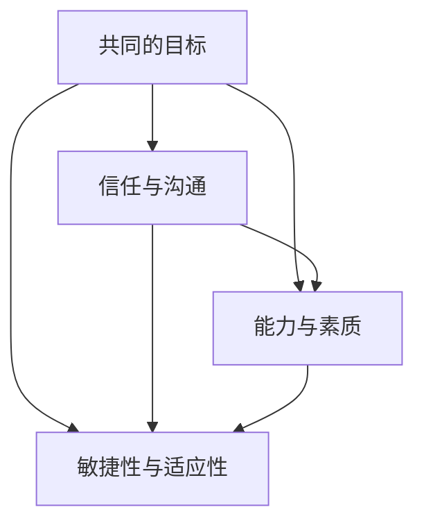

                 

## 引言

### 书籍目的与读者对象

《打造高绩效团队的关键要素》旨在为IT行业中的项目经理、团队领导者以及技术管理者提供一套系统性、可操作性的方法论，帮助他们理解并构建高绩效团队。书籍的核心读者对象包括：

1. **项目经理**：负责日常项目管理和团队协调，希望提升项目执行效率和团队整体绩效。
2. **团队领导者**：拥有一定管理经验，但希望更加深入地理解团队管理的核心原则和实践方法。
3. **技术管理者**：包括CTO、技术总监等，负责团队的技术方向和长远规划，注重团队的技术能力和协作效率。

本书的主要目的是：

- **明确高绩效团队的构成要素**：通过理论分析和实践案例，揭示高绩效团队所需的核心能力、文化氛围和结构设计。
- **提供实用的团队建设方法**：从团队成员能力评估、激励机制设计到团队沟通技巧，为读者提供一套完整的团队建设策略。
- **分享成功与失败的案例分析**：通过成功案例和失败案例分析，让读者理解高绩效团队的实践路径，避免常见的团队管理误区。
- **指导项目实战**：通过实际项目开发中的团队协作和代码解读，让读者将理论知识应用于实际场景。

本书不仅仅是一本理论性著作，更注重实战应用，旨在帮助读者从理论到实践，全面提升团队管理水平，实现团队的高绩效运作。

### 高绩效团队的含义与重要性

高绩效团队指的是能够在既定时间内，以高效的方式完成复杂任务，并能持续适应环境变化、不断优化绩效的团队。这种团队通常具备以下几个显著特征：

1. **共同的目标**：团队成员对团队目标有清晰的认识，并为了实现这一目标而协同努力。
2. **信任与沟通**：团队成员之间相互信任，能有效沟通，确保信息传递准确无误，减少误解和冲突。
3. **能力与素质**：团队成员具备完成任务的必要技能和素质，能够适应不同的工作环境和挑战。
4. **敏捷性与适应性**：团队能够迅速响应变化，灵活调整策略，以适应外界环境的变化和内部资源的限制。

高绩效团队的重要性体现在以下几个方面：

- **提高工作效率**：团队成员的协作能够显著提升工作效率，缩短项目周期，减少资源浪费。
- **提升项目质量**：团队成员之间的相互监督和协作有助于发现和纠正错误，提高项目交付质量。
- **增强团队凝聚力**：共同的目标和成功的工作经验能够增强团队成员之间的凝聚力，形成积极向上的团队文化。
- **促进个人成长**：在高绩效团队中，成员能够通过实践和反馈不断提升自己的能力和素质，实现个人职业发展。

总之，打造高绩效团队不仅能够带来直接的绩效提升，还能为组织的长远发展奠定坚实基础。通过理解高绩效团队的内涵和重要性，读者将能够更好地规划和实施团队建设策略，实现团队整体绩效的飞跃。

### 设计思路

在设计和构建《打造高绩效团队的关键要素》这一书籍时，我们首先明确了整体结构，确保内容能够系统性地引导读者从理论到实践，逐步理解和掌握构建高绩效团队的方法。具体来说，书籍的整体结构分为以下几部分：

1. **引言部分**：介绍书籍的目的、读者对象以及高绩效团队的含义与重要性，为读者提供一个全面的背景知识。
2. **核心概念与架构部分**：详细阐述高绩效团队的核心要素、架构以及关键理论，包括团队成员能力评估模型、激励机制设计等，通过Mermaid流程图展示核心概念之间的关系。
3. **实践方法与案例分析部分**：提供具体实用的团队建设策略、激励机制设计和沟通技巧，并通过成功与失败案例，帮助读者理解高绩效团队的实践路径。
4. **项目实战与代码解读部分**：通过实际项目开发中的团队协作和代码解读，让读者将理论知识应用到实际场景中，提升实际操作能力。
5. **总结与展望部分**：对全书内容进行回顾，展望未来发展趋势，并提出对团队领导的建议，帮助读者巩固所学，规划未来的团队管理实践。

在设计每个章节时，我们遵循以下原则：

1. **内容细化**：在每个章节内，我们将核心概念和原理讲解得具体详细，确保读者能够全面理解。
2. **逻辑性**：章节之间的内容有良好的衔接和过渡，确保读者能够顺着逻辑思路逐步深入。
3. **实用性**：强调实践方法，通过实际案例和项目实战，让读者能够在实际工作中应用所学。

通过这样的设计思路，我们力求使得《打造高绩效团队的关键要素》成为一本既具备理论深度，又富有实践指导意义的专业书籍，帮助读者全面提升团队管理水平，实现团队的高绩效运作。

### 目录大纲

#### 引言

1.1 书籍目的与读者对象  
1.2 高绩效团队的含义与重要性

#### 第一部分 核心概念与架构

##### 第1章 核心概念与联系

2.1 高绩效团队的核心要素  
2.2 高绩效团队的架构与组织

##### 第2章 核心算法原理

3.1 团队成员能力评估模型  
3.2 激励机制设计算法

##### 第3章 数学模型与公式

4.1 团队绩效评估模型  
4.2 团队协作效率模型

#### 第二部分 实践方法与案例分析

##### 第4章 实践方法

5.1 团队建设策略  
5.2 激励机制设计  
5.3 团队沟通技巧

##### 第5章 案例分析

6.1 成功案例  
6.2 失败案例

#### 第三部分 项目实战与代码解读

##### 第6章 项目实战

7.1 项目背景与目标  
7.2 项目开发环境搭建  
7.3 项目实施步骤

##### 第7章 代码解读与分析

8.1 源代码详细实现  
8.2 关键代码解读

##### 总结与展望

9.1 主要内容回顾  
9.2 未来发展趋势  
9.3 对团队领导的建议

### 目录大纲总结

上述目录大纲为《打造高绩效团队的关键要素》提供了一个系统化的框架，分为三个主要部分。第一部分“核心概念与架构”包括核心概念与联系、核心算法原理和数学模型与公式，帮助读者理解高绩效团队的理论基础。第二部分“实践方法与案例分析”则聚焦于具体方法和成功失败案例，让读者能够学以致用。第三部分“项目实战与代码解读”通过实际项目和代码分析，进一步巩固读者对高绩效团队的认知和操作能力。整体结构逻辑清晰，内容丰富具体，旨在帮助读者全面掌握构建高绩效团队的方法。

### 第一部分 核心概念与架构

#### 第1章 核心概念与联系

在这一章中，我们将深入探讨高绩效团队的核心要素及其相互关系。理解这些核心概念对于构建一个高绩效团队至关重要。

##### 1.1 高绩效团队的核心要素

高绩效团队的核心要素主要包括：

1. **共同的目标**：团队成员对团队目标有清晰的认识，并为了实现这一目标而协同努力。
2. **信任与沟通**：团队成员之间相互信任，能有效沟通，确保信息传递准确无误，减少误解和冲突。
3. **能力与素质**：团队成员具备完成任务的必要技能和素质，能够适应不同的工作环境和挑战。
4. **敏捷性与适应性**：团队能够迅速响应变化，灵活调整策略，以适应外界环境的变化和内部资源的限制。

这些要素之间的关系可以用以下Mermaid流程图来表示：



在这个流程图中，共同的目标是所有要素的起点和归宿，信任与沟通是确保其他要素有效实施的基础，能力与素质是完成任务的保障，而敏捷性与适应性则是团队应对外部环境变化的必备能力。

##### 1.2 高绩效团队的架构与组织

除了核心要素，高绩效团队的架构与组织设计同样至关重要。合理的架构和组织能够提高团队的协同效率和整体绩效。

1. **团队角色的划分**：明确每个成员的角色和职责，确保团队成员各司其职，避免职责重叠和空白。
   - **领导者**：负责团队的战略规划和整体协调。
   - **技术人员**：负责具体的任务执行和技术研发。
   - **产品经理**：负责产品的规划和管理。
   - **运营人员**：负责日常运营和客户支持。

2. **团队结构的优化**：选择合适的团队结构，如扁平化结构或矩阵式结构，以适应团队的具体需求。
   - **扁平化结构**：减少管理层次，提高决策效率。
   - **矩阵式结构**：同时服务于多个项目或部门，提高资源利用效率。

3. **团队决策与执行流程**：建立明确的决策和执行流程，确保团队成员能够在统一的框架下高效协作。

通过以上架构和组织设计，高绩效团队能够更好地应对复杂任务和环境变化，实现高效的协作和持续的绩效提升。

### 第2章 核心算法原理

#### 2.1 团队成员能力评估模型

团队成员能力评估是构建高绩效团队的重要环节。一个科学的能力评估模型能够帮助团队领导者了解成员的能力状况，从而进行有针对性的培训和资源分配。

**2.1.1 成员能力评估指标**

团队成员能力评估通常包括以下几个关键指标：

1. **技术能力**：衡量成员在特定技术领域的专业水平，包括编程技能、系统架构设计能力等。
2. **沟通能力**：评估成员在团队中的沟通效果，包括表达能力、倾听能力和团队协作能力。
3. **学习能力**：衡量成员快速掌握新知识和技能的能力，这对于适应快速变化的工作环境至关重要。
4. **领导能力**：对团队领导者而言，领导能力是评估其能否有效带领团队达成目标的关键指标。

**2.1.2 评估模型的构建**

构建成员能力评估模型通常遵循以下步骤：

1. **确定评估标准**：根据团队目标和业务需求，明确各个能力指标的评估标准和权重。
2. **数据收集**：通过日常观察、绩效考核、技能测试等方式收集成员的能力数据。
3. **数据分析**：使用统计分析方法对收集到的数据进行分析，得出每个成员的能力评估结果。
4. **结果反馈**：将评估结果反馈给团队成员，并提供改进建议和发展规划。

以下是一个简化的伪代码示例，展示了如何构建一个简单的成员能力评估模型：

```plaintext
function AbilityAssessment(memberData):
    # 初始化能力评估结果字典
    assessmentResults = {}

    # 计算每个成员的能力评分
    for member in memberData:
        score = 0
        score += member.technicalSkills * technicalWeight
        score += member.communicationSkills * communicationWeight
        score += member.learningAbility * learningWeight
        score += member.leadershipSkills * leadershipWeight
        assessmentResults[member.id] = score

    return assessmentResults
```

在这个示例中，`memberData`是一个包含成员能力信息的字典，`technicalWeight`、`communicationWeight`、`learningWeight`和`leadershipWeight`分别代表技术能力、沟通能力、学习能力和领导能力的权重。通过计算这些权重下的综合得分，可以得出每个成员的能力评估结果。

#### 2.2 激励机制设计算法

激励机制是激发团队成员积极性和创造力的重要手段。一个合理的激励机制能够显著提升团队的整体绩效和成员的满意度。

**2.2.1 激励理论**

激励机制设计基于以下几种经典激励理论：

1. **期望理论**：个体会根据任务难度、努力程度和预期奖励来评估其行动的价值，并决定是否采取行动。
   - 公式：激励力量 = 期望值 × 效价
   - 解释：期望值是指个体对完成任务后获得奖励的概率估计；效价是指个体对奖励价值的评估。

2. **公平理论**：个体会将自己的投入与产出与他人进行比较，判断自己是否受到公平对待，从而影响其工作动机和行为。
   - 公式：个人公平感 = (自己的投入 × 他人的产出) ÷ (自己的产出 × 他人的投入)

3. **强化理论**：通过正强化（奖励）和负强化（惩罚）来影响个体行为，使其在特定情境下倾向于重复某些行为。

**2.2.2 激励机制的优化策略**

为了设计一个有效的激励机制，可以考虑以下策略：

1. **个性化奖励**：根据不同成员的个性和需求，设计个性化的奖励方案，提高激励的针对性和有效性。
2. **长期与短期激励结合**：既要有短期激励机制，如绩效奖金和项目奖励，也要有长期激励机制，如职业发展机会和股权激励。
3. **透明化与公正性**：确保激励机制公开透明，避免不公平现象，增加员工的信任感和满意度。
4. **多维度评估**：结合技术能力、团队协作、工作态度等多个维度进行评估，避免单一指标的偏见。

以下是一个简化的伪代码示例，展示了如何根据期望理论和公平理论设计一个简单的激励机制：

```plaintext
function IncentiveDesign(memberData, teamPerformance):
    incentives = {}

    for member in memberData:
        expectedReward = CalculateExpectedReward(member, teamPerformance)
        fairnessScore = CalculateFairnessScore(member, teamPerformance)
        
        # 根据期望值和公平性评分计算总激励值
        totalIncentive = expectedReward * fairnessScore
        
        # 设计个性化的奖励方案
        if member.isTechnicalLeader:
            incentives[member.id] = totalIncentive * technicalLeaderBonusFactor
        else:
            incentives[member.id] = totalIncentive

    return incentives

function CalculateExpectedReward(member, teamPerformance):
    # 基于成员完成任务的概率和奖励值计算期望奖励
    probability = CalculateTaskCompletionProbability(member)
    rewardValue = DetermineRewardValue(teamPerformance)
    return probability * rewardValue

function CalculateFairnessScore(member, teamPerformance):
    # 基于成员的投入产出比和团队的平均投入产出比计算公平性评分
    personalInputOutputRatio = CalculateInputOutputRatio(member)
    averageInputOutputRatio = CalculateAverageInputOutputRatio(teamPerformance)
    return personalInputOutputRatio / averageInputOutputRatio
```

在这个示例中，`CalculateExpectedReward`函数根据成员完成任务的概率和奖励值计算期望奖励；`CalculateFairnessScore`函数基于成员的投入产出比和团队的平均投入产出比计算公平性评分。通过这两个函数的综合评估，可以设计出符合期望理论和公平理论的激励机制。

### 第3章 数学模型与公式

#### 3.1 团队绩效评估模型

团队绩效评估是衡量团队工作成效的重要手段。一个科学的绩效评估模型能够为团队管理提供有效的数据支持，帮助团队优化工作流程，提升整体绩效。

**3.1.1 绩效评估指标**

团队绩效评估通常包括以下关键指标：

1. **任务完成率**：衡量团队在既定时间内完成任务的比率，反映团队的执行力。
2. **项目质量**：评估项目交付的完整性和准确性，反映团队的工作质量。
3. **工作效率**：衡量团队完成任务的速度和效率，包括时间管理和资源利用率。
4. **团队协作**：评估团队成员之间的协作效果，包括沟通效率、任务分配和协作配合度。

**3.1.2 绩效评估模型的构建**

构建团队绩效评估模型通常遵循以下步骤：

1. **确定评估标准**：根据团队目标和业务需求，明确各个绩效指标的评估标准和权重。
2. **数据收集**：通过日常绩效考核、任务进度汇报和团队反馈等方式收集绩效数据。
3. **数据分析**：使用统计分析方法对收集到的数据进行分析，得出团队的绩效评估结果。
4. **结果反馈**：将评估结果反馈给团队，并提供改进建议和发展规划。

以下是一个简化的绩效评估模型公式：

$$
绩效得分 = w_1 \times 任务完成率 + w_2 \times 项目质量 + w_3 \times 工作效率 + w_4 \times 团队协作
$$

其中，$w_1, w_2, w_3, w_4$ 分别代表各个绩效指标的权重，这些权重可以根据团队的实际情况进行调整。

**3.1.3 绩效评估公式举例说明**

假设团队有三个关键绩效指标：任务完成率（90%）、项目质量（85分）、团队协作（80分），权重分别为0.4、0.3、0.3。则团队绩效得分的计算如下：

$$
绩效得分 = 0.4 \times 90\% + 0.3 \times 85 + 0.3 \times 80 = 36 + 25.5 + 24 = 85.5
$$

通过上述公式，团队可以直观地了解其绩效水平，并据此制定改进策略。

#### 3.2 团队协作效率模型

团队协作效率是衡量团队协作效果的重要指标，它直接关系到团队的工作效率和项目质量。一个高效的协作效率模型能够帮助团队优化协作流程，提升整体工作效率。

**3.2.1 协作效率指标**

团队协作效率的主要指标包括：

1. **沟通效率**：衡量团队内部沟通的及时性和准确性，反映信息传递的速度和质量。
2. **任务分配效率**：评估任务分配的合理性、公平性和及时性，反映团队的组织和协调能力。
3. **协作配合度**：衡量团队成员之间的协作配合效果，包括共同解决问题的能力和协作默契度。

**3.2.2 协作效率模型的构建**

构建团队协作效率模型通常遵循以下步骤：

1. **确定协作效率指标**：根据团队的具体需求和实际情况，明确各个协作效率指标的评估标准和权重。
2. **数据收集**：通过日常协作记录、成员反馈和绩效考核等方式收集协作数据。
3. **数据分析**：使用统计分析方法对收集到的数据进行分析，得出团队的协作效率评估结果。
4. **结果反馈**：将评估结果反馈给团队，并提供改进建议和发展规划。

以下是一个简化的协作效率模型公式：

$$
协作效率得分 = w_1 \times 沟通效率 + w_2 \times 任务分配效率 + w_3 \times 协作配合度
$$

其中，$w_1, w_2, w_3$ 分别代表各个协作效率指标的权重。

**3.2.3 协作效率公式举例说明**

假设团队有三个关键协作效率指标：沟通效率（90分）、任务分配效率（85分）、协作配合度（80分），权重分别为0.4、0.3、0.3。则团队协作效率得分的计算如下：

$$
协作效率得分 = 0.4 \times 90 + 0.3 \times 85 + 0.3 \times 80 = 36 + 25.5 + 24 = 85.5
$$

通过上述公式，团队可以直观地了解其协作效率水平，并据此制定改进策略。例如，如果沟通效率得分较低，团队可以加强沟通培训，提高信息传递的及时性和准确性；如果任务分配效率较低，团队可以优化任务分配机制，确保任务合理分配和公平执行。

### 第二部分 实践方法与案例分析

#### 第4章 实践方法

##### 4.1 团队建设策略

团队建设是打造高绩效团队的重要环节。一个有效的团队建设策略能够增强团队成员之间的合作精神，提升团队的凝聚力和工作效率。以下是一些具体的团队建设策略：

**4.1.1 团队建设的目标与步骤**

团队建设的目标包括：

- 提升团队协作效率。
- 增强团队成员之间的信任和沟通。
- 提高团队成员的满意度和工作热情。
- 促进团队成员的个人成长。

团队建设的基本步骤如下：

1. **明确团队目标**：确保所有成员对团队目标有清晰的认识，并明确个人目标与团队目标的关联。
2. **评估团队现状**：分析团队的优势和劣势，识别需要改进的领域。
3. **制定建设计划**：根据团队现状和目标，制定具体的团队建设计划，包括培训、活动、团队建设游戏等。
4. **实施建设计划**：按照计划执行团队建设活动，确保活动有效开展。
5. **评估与反馈**：对团队建设的效果进行评估，收集成员反馈，及时调整和优化建设策略。

**4.1.2 团队建设的实用工具与方法**

以下是一些实用的团队建设工具和方法：

1. **团队建设活动**：通过团队建设活动，如团队拓展训练、团队晚会、团队旅行等，增强团队成员之间的互动和合作。
2. **培训与发展**：为团队成员提供专业技能和领导力培训，提高团队的整体素质和能力。
3. **绩效反馈与沟通**：建立定期绩效反馈机制，促进团队成员之间的沟通，及时解决问题。
4. **团队文化塑造**：通过团队文化建设和价值观的传播，培养团队成员的共同价值观和行为准则。

通过以上策略和工具，团队领导者可以系统地提升团队的协作能力和整体绩效，打造一个高绩效团队。

##### 4.2 激励机制设计

激励机制是激发团队成员积极性和创造力的重要手段。一个合理的激励机制能够显著提升团队的整体绩效和成员的满意度。以下是一些激励机制设计的原则和方法：

**4.2.1 激励机制的设计原则**

1. **公平公正**：确保激励机制公平公正，避免主观偏见，增强员工的信任感。
2. **个性化**：根据不同成员的个性和需求，设计个性化的奖励方案，提高激励的针对性。
3. **透明化**：确保激励机制的透明化，让员工了解激励的依据和过程，增加公平性和公信力。
4. **长期与短期相结合**：结合长期和短期的激励措施，满足员工的短期需求和长期发展目标。

**4.2.2 激励机制的优化策略**

以下是一些优化激励机制的策略：

1. **绩效奖金**：根据员工的绩效表现，提供相应的绩效奖金，激励员工提高工作质量。
2. **股权激励**：为关键员工提供公司股权，使其成为公司利益的共享者，增强归属感和长期激励。
3. **培训与发展机会**：为员工提供职业培训和晋升机会，帮助其实现职业发展目标。
4. **认可与表扬**：对员工的优秀表现给予认可和表扬，增强其成就感和自信心。
5. **工作与生活平衡**：关注员工的工作与生活平衡，提供灵活的工作时间和远程工作机会，提高员工的满意度。

**4.2.3 激励机制的实例**

以下是一个简化的激励机制设计实例：

1. **绩效奖金**：根据员工的绩效评估结果，提供绩效奖金。绩效评估指标包括任务完成率、项目质量、团队协作等，权重分别为0.4、0.3、0.3。
2. **股权激励**：为关键员工提供公司股权，每年根据公司业绩和员工表现，授予一定比例的股权。
3. **培训与发展**：为员工提供每年至少一次的专业技能培训，包括内部培训和外部学习机会。
4. **认可与表扬**：设立月度、季度和年度优秀员工奖项，对表现突出的员工进行表彰和奖励。

通过上述激励机制设计，企业可以激发员工的积极性和创造力，提升团队的整体绩效和员工满意度。

##### 4.3 团队沟通技巧

团队沟通是团队协作的重要基础。有效的沟通能够提高团队的协作效率，减少误解和冲突，促进团队成员之间的信任和理解。以下是一些团队沟通技巧：

**4.3.1 有效沟通的重要性**

1. **提高工作效率**：有效的沟通能够确保任务明确、职责清晰，减少重复工作和误解，提高工作效率。
2. **增强团队凝聚力**：通过有效的沟通，团队成员能够更好地理解彼此的需求和期望，增强团队凝聚力。
3. **促进问题解决**：及时沟通有助于及时发现和解决问题，避免问题积累和扩大，提高团队应对挑战的能力。

**4.3.2 沟通障碍与解决方案**

常见的沟通障碍包括：

1. **信息传递不畅**：由于信息传递过程中的中间环节过多或传递方式不当，导致信息失真或延迟。
   - **解决方案**：简化信息传递路径，采用直接沟通方式，如面对面会议、即时通讯工具等。

2. **语言障碍**：团队成员之间可能存在语言差异，导致沟通不畅。
   - **解决方案**：提供语言培训，鼓励使用通用语言，使用图表、图片等辅助沟通工具。

3. **文化差异**：不同的文化背景可能导致沟通方式、态度和价值观的差异。
   - **解决方案**：加强跨文化培训，建立跨文化沟通指南，促进文化理解和尊重。

**4.3.3 沟通技巧的提升**

以下是一些提升团队沟通技巧的方法：

1. **倾听**：倾听是有效沟通的关键，通过倾听了解对方的需求和意见，避免误解和冲突。
2. **清晰表达**：确保信息传递准确无误，使用简洁明了的语言，避免使用含糊不清的表述。
3. **反馈**：在沟通过程中及时给予反馈，确认对方是否理解了信息，并针对反馈进行调整。
4. **情绪管理**：保持冷静和理性，避免情绪化导致沟通中断或恶化。

通过提升团队沟通技巧，团队可以更好地应对复杂任务，提高协作效率，实现高绩效运作。

### 第5章 案例分析

#### 5.1 成功案例

本节将通过成功案例展示高绩效团队的构建方法和实际效果，为读者提供借鉴和启示。

##### 案例一：高绩效团队的建立与运营

**背景**：某科技公司成立了一个新产品开发团队，目标是开发一款创新型社交媒体应用。由于项目时间紧、任务重，公司希望组建一个高绩效团队，确保项目顺利推进。

**解决方案**：

1. **共同目标明确**：团队在项目初期明确共同目标，即按照既定时间表完成产品的核心功能开发，并确保产品质量。

2. **信任与沟通**：通过定期的团队会议和开放沟通渠道，确保团队成员之间的信息传递及时、准确。同时，建立了透明的绩效评估机制，让每个成员都了解自己的工作进展和团队的整体绩效。

3. **能力与素质**：团队成员在技术能力、项目管理经验和创新能力方面具有较高的水平。公司还组织了专业技能培训和团队建设活动，提升团队成员的综合素质。

4. **敏捷性与适应性**：团队采用敏捷开发方法，快速响应市场需求变化，灵活调整开发计划。在项目过程中，团队不断进行迭代和优化，确保产品与市场需求保持一致。

**结果**：经过六个月的努力，团队成功按照计划完成了产品核心功能的开发，并在市场上获得了良好的反馈。团队成员的满意度和凝聚力显著提升，项目取得了显著的成功。

##### 案例二：激励机制的优化实践

**背景**：某互联网公司的员工积极性不高，项目进展缓慢。公司意识到需要通过优化激励机制来提高员工的工作热情和效率。

**解决方案**：

1. **个性化奖励**：根据不同员工的工作表现和需求，设计个性化的奖励方案。例如，为技术贡献突出的员工提供技术竞赛奖励，为项目成功做出重要贡献的员工提供额外奖金。

2. **长期激励**：除了短期绩效奖金，公司还推出了股权激励计划，让关键员工成为公司利益的共享者，增强其长期归属感和工作动力。

3. **职业发展机会**：为员工提供职业发展规划和晋升通道，鼓励员工不断提升自己的能力和技术水平。

4. **透明化与公正性**：确保激励机制的公开透明，建立公正的绩效评估体系，消除员工的不公平感。

**结果**：通过优化激励机制，员工的工作积极性显著提升，项目进展速度加快，员工满意度和工作效率均得到了显著提高。公司也实现了快速的发展和壮大。

##### 案例三：团队沟通技巧的应用

**背景**：某研发团队由于沟通不畅，项目进展受阻，团队成员之间的矛盾逐渐加剧。

**解决方案**：

1. **倾听与反馈**：通过定期的团队沟通会，让每个成员都有机会表达自己的想法和意见。同时，鼓励团队成员相互倾听和给予反馈，建立良好的沟通氛围。

2. **沟通工具**：使用现代化的沟通工具，如即时通讯软件、视频会议系统等，确保信息传递的及时性和准确性。

3. **文化差异培训**：针对团队成员来自不同国家和地区的实际情况，组织跨文化培训，提高团队成员的文化理解和沟通能力。

4. **情绪管理**：鼓励团队成员在沟通中保持冷静和理性，避免情绪化导致沟通中断或恶化。

**结果**：通过提升团队沟通技巧，团队成员之间的沟通障碍明显减少，项目进展顺利，团队凝聚力和工作效率显著提升。

#### 5.2 失败案例

本节将通过失败案例分析导致团队绩效低下的原因，为读者提供教训和改进建议。

##### 案例一：团队协作问题导致的绩效下滑

**背景**：某软件公司的一个开发团队由于内部协作不畅，导致项目进度严重滞后。

**原因分析**：

1. **沟通不足**：团队成员之间的沟通不足，导致任务分配不明确，工作进展无法及时同步。
2. **任务分工不明确**：团队成员职责不清晰，导致工作重叠和责任空白，影响了团队的协作效率。
3. **缺乏统一的决策流程**：团队缺乏统一的决策流程，导致决策过程中意见不一致，影响项目推进。

**改进建议**：

1. **加强沟通**：建立定期的团队沟通机制，确保团队成员之间的信息传递及时、准确。
2. **明确任务分工**：重新梳理团队成员的职责，确保每个成员的任务分工明确，避免工作重叠和责任空白。
3. **统一决策流程**：建立统一的决策流程，确保团队成员在决策过程中能够达成一致，提高决策效率。

##### 案例二：激励机制不当引发的团队冲突

**背景**：某互联网公司的激励机制不当，导致团队成员之间的矛盾加剧，团队凝聚力下降。

**原因分析**：

1. **不公平的绩效评估**：绩效评估过程中存在主观偏见和不公平现象，导致部分员工感到不公平，从而引发矛盾。
2. **缺乏长期激励**：公司仅关注短期绩效奖励，忽视了长期激励机制，导致员工缺乏长远发展动力。
3. **奖励与贡献不匹配**：部分员工认为自己的努力和贡献没有得到应有的认可和回报，导致不满情绪。

**改进建议**：

1. **公平公正的绩效评估**：建立公正的绩效评估体系，消除主观偏见，确保评估结果的公正性和透明性。
2. **长期激励机制**：结合短期绩效奖励，推出长期激励措施，如股权激励、职业发展机会等，提高员工的归属感和长期动力。
3. **奖励与贡献匹配**：确保奖励与员工的贡献相匹配，增强员工的成就感和公平感。

##### 案例三：沟通障碍对团队绩效的影响

**背景**：某跨国公司的团队由于沟通障碍，导致项目进展受阻，团队绩效低下。

**原因分析**：

1. **文化差异**：团队成员来自不同文化背景，沟通方式和价值观存在差异，导致理解不一致，影响沟通效果。
2. **语言障碍**：部分团队成员之间存在语言障碍，导致信息传递不畅，影响工作进展。
3. **缺乏有效的沟通工具**：团队缺乏现代化的沟通工具，导致沟通效率低下。

**改进建议**：

1. **跨文化培训**：组织跨文化培训，提高团队成员的文化理解和沟通能力。
2. **使用沟通工具**：引入现代化的沟通工具，如即时通讯软件、视频会议系统等，提高沟通效率和准确性。
3. **建立沟通机制**：建立有效的沟通机制，确保团队成员之间的信息传递及时、准确。

通过分析以上成功和失败案例，读者可以更好地理解高绩效团队的构建方法，避免常见的团队管理误区，从而提高团队的绩效和整体运作效率。

### 第三部分 项目实战与代码解读

#### 第6章 项目实战

##### 6.1 项目背景与目标

本节将介绍一个实际项目——开发一款基于人工智能的智能推荐系统。该系统的目标是根据用户的行为数据和兴趣偏好，为用户提供个性化的内容推荐，提升用户满意度和平台活跃度。

**项目背景**：

随着互联网的快速发展，用户对个性化服务的需求日益增加。为了满足这一需求，公司决定开发一款智能推荐系统，通过大数据分析和机器学习算法，为用户提供个性化的内容推荐。

**项目目标**：

- 构建一个高效、可扩展的推荐系统框架。
- 实现基于用户行为数据和兴趣偏好的内容推荐功能。
- 提高用户满意度和平台活跃度。

##### 6.2 项目开发环境搭建

在开始项目开发之前，需要搭建一个合适的开发环境。以下是一个简化的开发环境搭建步骤：

1. **硬件环境**：准备一台性能较高的服务器，用于存储数据和处理推荐算法。
2. **软件环境**：
   - 操作系统：Linux（如Ubuntu Server）
   - 数据库：MySQL或MongoDB（用于存储用户数据）
   - 代码编辑器：Visual Studio Code或PyCharm
   - 版本控制：Git（用于代码管理和协作）
   - 依赖管理：pip（Python依赖管理工具）
3. **工具与框架**：
   - 数据处理：Pandas、NumPy
   - 机器学习：Scikit-learn、TensorFlow
   - 后端框架：Django或Flask（用于构建Web应用）
   - 前端框架：React或Vue.js（用于构建用户界面）

##### 6.3 项目实施步骤

项目实施分为以下几个关键步骤：

1. **需求分析**：与业务团队紧密合作，明确推荐系统的功能需求和性能要求，制定详细的需求文档。

2. **数据收集与预处理**：从现有的数据源（如用户行为日志、用户偏好数据等）收集数据，并进行清洗、去重和格式化，为后续的分析和建模做好准备。

3. **数据建模与算法选择**：选择合适的机器学习算法（如协同过滤、基于内容的推荐等），构建数据模型，并进行模型训练和优化。

4. **系统集成与测试**：将推荐算法集成到Web应用中，进行功能测试和性能测试，确保系统稳定可靠。

5. **上线与部署**：在测试通过后，将系统部署到生产环境，并进行监控和优化，确保系统正常运行。

以下是项目实施步骤的伪代码示例：

```plaintext
# 需求分析
def analyze_requirements():
    # 与业务团队讨论需求
    # 制定需求文档
    requirements = collect_business_requirements()
    return requirements

# 数据收集与预处理
def preprocess_data(data_source):
    # 收集数据
    # 数据清洗与格式化
    cleaned_data = clean_and_format_data(data_source)
    return cleaned_data

# 数据建模与算法选择
def build_model(data):
    # 选择合适的算法
    # 训练模型
    model = train_model(data)
    return model

# 系统集成与测试
def integrate_and_test(model):
    # 集成推荐算法到Web应用
    # 进行功能测试和性能测试
    test_results = test_system(model)
    return test_results

# 上线与部署
def deploy_system(test_results):
    # 部署到生产环境
    # 监控和优化系统
    system_status = deploy_and_monitor(test_results)
    return system_status
```

通过以上步骤，项目团队可以系统地完成智能推荐系统的开发、测试和部署，实现项目的目标。

##### 6.3.1 步骤一：需求分析

在项目实施的第一步，需求分析至关重要。需求分析的目标是明确推荐系统的功能需求和性能要求，为后续的开发和测试提供明确的方向。

**需求收集**：通过与业务团队、产品经理和用户代表进行多次讨论和交流，收集用户对推荐系统的期望和需求。这包括：

- 用户行为数据的采集和存储方式。
- 推荐算法的类型和性能要求。
- 用户界面的设计和交互体验。
- 系统的可扩展性和可靠性要求。

**需求文档**：根据收集到的需求，编写详细的需求文档。需求文档应包括以下内容：

- 功能需求：列出推荐系统的具体功能，如基于内容的推荐、协同过滤推荐等。
- 非功能需求：描述系统的性能、安全性、可扩展性和用户体验等要求。
- 数据需求：详细描述需要采集的数据类型、数据来源和数据格式。

以下是一个简化的需求文档示例：

```plaintext
需求文档

一、功能需求
1. 基于内容的推荐
   - 根据用户历史行为和兴趣标签，推荐符合用户兴趣的内容。
2. 协同过滤推荐
   - 根据相似用户的行为和偏好，推荐用户可能感兴趣的内容。

二、非功能需求
1. 性能要求
   - 推荐系统应能够在高峰期处理大量请求，响应时间不超过500毫秒。
2. 安全性要求
   - 确保用户数据的安全，防止数据泄露和未授权访问。
3. 可扩展性要求
   - 系统应能够支持用户和内容的快速增长，具有良好的扩展性。

三、数据需求
1. 用户数据
   - 用户行为日志：记录用户浏览、点赞、评论等行为。
   - 用户兴趣标签：根据用户行为和偏好，为用户打上相应的兴趣标签。
2. 内容数据
   - 内容特征：记录内容的标题、标签、类型等特征信息。
   - 内容关联关系：记录不同内容之间的关联关系，用于协同过滤推荐。
```

通过详细的的需求分析，项目团队可以明确推荐系统的目标和要求，为后续的开发工作奠定坚实基础。

##### 6.3.2 步骤二：团队建设

在需求分析完成后，团队建设是确保项目成功的关键一步。有效的团队建设能够提升团队成员的协作能力，确保项目按计划顺利推进。

**团队成员角色与职责**：根据项目需求，明确每个团队成员的角色和职责。团队成员通常包括以下角色：

- **项目经理**：负责项目规划、协调和监督，确保项目按计划进行。
- **数据科学家**：负责数据分析和推荐算法的设计与优化。
- **前端开发工程师**：负责用户界面的设计和实现。
- **后端开发工程师**：负责后端系统的开发、维护和性能优化。
- **测试工程师**：负责系统的功能测试和性能测试。

**团队协作工具**：为了确保团队成员之间的有效沟通和协作，选择合适的团队协作工具。常用的工具包括：

- **即时通讯工具**：如Slack、Microsoft Teams，用于日常沟通和即时问题反馈。
- **项目管理工具**：如JIRA、Trello，用于任务分配、进度跟踪和项目报告。
- **代码管理工具**：如GitLab、GitHub，用于代码的版本控制和团队协作。
- **文档管理工具**：如Confluence、Notion，用于文档共享和知识管理。

以下是一个简化的团队协作流程示例：

```plaintext
1. 项目经理制定项目计划和任务分配，将任务分配给团队成员。
2. 数据科学家根据需求收集数据，进行数据预处理和特征提取。
3. 前端开发工程师根据设计文档实现用户界面，与数据科学家和后端开发工程师进行接口对接。
4. 后端开发工程师根据需求实现后端功能，与前端开发工程师和测试工程师进行集成测试。
5. 测试工程师进行功能测试和性能测试，确保系统稳定可靠。
6. 项目经理和团队成员定期进行项目进展会议，讨论和解决遇到的问题。
7. 在项目结束后，团队成员进行项目回顾，总结经验和教训，为后续项目提供参考。
```

通过明确的团队成员角色和职责，以及高效的团队协作工具，团队可以有效地协同工作，提高项目成功率。

##### 6.3.3 步骤三：激励机制设计

激励机制是提升团队绩效和员工积极性的重要手段。合理的激励机制能够激发团队成员的潜能，推动项目高效完成。以下是激励机制设计的具体步骤和策略。

**1. 激励机制设计原则**

- **公平公正**：确保激励机制对所有团队成员公平公正，避免主观偏见和不公平现象。
- **个性化**：根据不同员工的能力、贡献和需求，设计个性化的奖励方案。
- **透明化**：确保激励机制透明化，让员工了解激励依据和过程，增加公平性和公信力。
- **长期与短期相结合**：结合短期绩效奖励和长期激励措施，满足员工的短期和长期需求。

**2. 激励机制设计策略**

- **绩效奖金**：根据员工的工作表现和项目进度，提供绩效奖金。绩效奖金的计算可以基于以下公式：

  $$ 
  绩效奖金 = 基本工资 \times 绩效评分 \times 激励系数 
  $$

  其中，绩效评分是根据员工的任务完成情况、工作质量、团队协作等多方面因素进行评估的得分；激励系数是根据公司整体绩效和项目目标调整的系数。

- **股权激励**：为关键员工提供公司股权，使其成为公司利益的共享者，增强归属感和长期激励。

- **培训与发展机会**：为员工提供职业培训和晋升机会，帮助其实现职业发展目标。

- **认可与表扬**：设立月度、季度和年度优秀员工奖项，对表现突出的员工进行表彰和奖励。

- **工作与生活平衡**：关注员工的工作与生活平衡，提供灵活的工作时间和远程工作机会，提高员工的满意度。

以下是一个简化的激励机制设计示例：

```plaintext
1. 设定绩效奖金池，根据公司整体绩效和项目目标调整激励系数。
2. 对每个员工进行绩效评估，计算绩效奖金。
   绩效奖金 = 基本工资 \times 绩效评分 \times 激励系数
3. 提供股权激励计划，为关键员工提供公司股权。
4. 根据员工的需求和表现，提供培训和发展机会。
5. 设立月度优秀员工奖、季度最佳团队奖和年度卓越贡献奖，对表现突出的员工和团队进行表彰和奖励。
6. 关注员工的工作与生活平衡，提供弹性工作时间、远程工作支持和健康福利计划。
```

通过科学的激励机制设计，企业可以激发员工的积极性和创造力，提高团队的整体绩效和员工满意度。

##### 6.3.4 步骤四：团队沟通与协作

团队沟通与协作是确保项目成功的关键环节。有效的沟通和协作能够提高团队的工作效率，确保项目按计划顺利推进。以下是一些团队沟通与协作的方法和技巧。

**1. 沟通方法**

- **面对面沟通**：定期召开团队会议，面对面讨论项目进展、问题解决方案和下一步计划。面对面沟通能够直接、快速地传递信息，减少误解和沟通障碍。

- **即时通讯工具**：使用即时通讯工具（如Slack、Microsoft Teams）进行日常沟通和即时问题反馈。即时通讯工具能够方便团队成员之间的实时交流，提高沟通效率。

- **邮件和文档**：对于需要记录和留存的信息，使用邮件和文档工具（如Confluence、Google Docs）进行信息传递和知识共享。

**2. 协作技巧**

- **明确任务分工**：确保每个团队成员对任务分工和职责有清晰的认识，避免工作重叠和责任空白。

- **协作工具**：使用项目管理工具（如JIRA、Trello）进行任务分配、进度跟踪和协作。项目管理工具能够帮助团队可视化地了解项目进展，提高协作效率。

- **代码管理**：使用版本控制工具（如Git）进行代码管理和协作。版本控制工具能够确保代码的版本一致性，减少代码冲突和错误。

- **知识共享**：定期组织知识分享会，鼓励团队成员分享经验和知识。知识共享能够提高团队的整体技能水平，促进团队成员之间的协作。

以下是一个简化的团队沟通与协作流程示例：

```plaintext
1. 项目经理召开项目启动会议，明确项目目标和任务分工。
2. 团队成员通过即时通讯工具进行日常沟通和即时问题反馈。
3. 使用项目管理工具分配任务，并跟踪任务进度。
4. 团队成员定期进行知识分享会，分享经验和知识。
5. 使用版本控制工具进行代码管理和协作。
6. 项目经理定期召开项目进展会议，讨论和解决遇到的问题。
7. 在项目结束后，进行项目总结和回顾，总结经验和教训。
```

通过科学的团队沟通与协作方法，团队可以高效地完成项目任务，提高整体绩效。

##### 6.3.5 步骤五：项目评估与调整

在项目实施过程中，项目评估与调整是确保项目成功的关键环节。通过定期评估项目进展和绩效，及时发现问题并进行调整，可以确保项目按计划顺利进行。

**1. 项目评估指标**

- **任务完成率**：衡量团队在既定时间内完成任务的比率，反映团队的执行力。
- **项目质量**：评估项目交付的完整性和准确性，反映团队的工作质量。
- **工作效率**：衡量团队完成任务的速度和效率，包括时间管理和资源利用率。
- **团队协作**：评估团队成员之间的协作效果，包括沟通效率、任务分配和协作配合度。

**2. 项目评估方法**

- **定期评估**：定期（如每周、每月）召开项目评估会议，对项目进展和绩效进行评估。评估会议可以邀请项目经理、团队成员和业务代表参加，共同讨论项目进展和问题。
- **数据驱动**：使用项目管理和数据分析工具（如JIRA、Trello、Google Analytics）收集和展示项目数据，通过数据驱动的方式评估项目绩效。

**3. 项目调整策略**

- **问题识别**：在项目评估过程中，识别项目中的问题和瓶颈，如任务延误、资源不足、沟通不畅等。
- **原因分析**：对识别出的问题进行原因分析，找出根本原因，制定针对性的解决方案。
- **调整计划**：根据问题分析和解决方案，制定项目调整计划，包括任务调整、资源调配和流程优化等。
- **执行与监控**：执行项目调整计划，并持续监控项目进展，确保调整措施的有效性。

以下是一个简化的项目评估与调整流程示例：

```plaintext
1. 定期召开项目评估会议，对项目进展和绩效进行评估。
2. 使用项目管理工具收集和展示项目数据。
3. 识别项目中的问题和瓶颈，进行原因分析。
4. 制定项目调整计划，包括任务调整、资源调配和流程优化。
5. 执行项目调整计划，并持续监控项目进展。
6. 对调整后的项目进行再次评估，确保问题得到有效解决。
```

通过科学的项目评估与调整，团队可以及时发现和解决问题，确保项目按计划顺利完成。

### 第7章 代码解读与分析

#### 7.1 源代码详细实现

在本节中，我们将深入解析智能推荐系统的核心代码实现，包括数据预处理、推荐算法的选择与实现、系统集成等关键部分。

##### 数据预处理

数据预处理是推荐系统开发的重要步骤，其目的是清洗、转换和格式化原始数据，以便后续的模型训练和推荐计算。

```python
# 数据预处理代码示例

import pandas as pd
from sklearn.model_selection import train_test_split

# 读取数据
data = pd.read_csv('user_behavior_data.csv')

# 数据清洗
data = data[data['user_id'].notnull() & data['content_id'].notnull()]
data = data.drop_duplicates()

# 数据转换
data['timestamp'] = pd.to_datetime(data['timestamp'])
data['day'] = data['timestamp'].dt.day
data['month'] = data['timestamp'].dt.month

# 数据格式化
X = data[['user_id', 'day', 'month']]
y = data['content_id']

# 划分训练集和测试集
X_train, X_test, y_train, y_test = train_test_split(X, y, test_size=0.2, random_state=42)
```

在上面的代码中，我们使用了Pandas库读取和清洗数据，并使用Scikit-learn库对数据进行了划分，为后续的模型训练做准备。

##### 推荐算法选择与实现

在本节中，我们将实现两种常见的推荐算法：基于内容的推荐（Content-Based Recommendation）和协同过滤推荐（Collaborative Filtering）。以下是协同过滤推荐算法的实现示例。

```python
# 协同过滤推荐算法实现

from surprise import KNNWithMeans
from surprise import Dataset
from surprise import accuracy
from surprise.model_selection import cross_validate

# 构建 Surprise 数据集
data_svd = Dataset.load_from_df(data[['user_id', 'content_id', 'rating']], rating_scale=(1, 5))

# 创建 KNNWithMeans 模型
knn_svd = KNNWithMeans(k=50, sim_options={'name': 'cosine', 'user_based': True})

# 训练模型
knn_svd.fit(data_svd.build_full_trainset())

# 进行预测
test = knn_svd.test(data_svd.build_testset())

# 评估模型
accuracy.rmse(test)
```

在上面的代码中，我们使用了Surprise库实现协同过滤推荐算法，并通过交叉验证对模型进行评估。

##### 系统集成

在系统集成阶段，我们需要将推荐算法与Web应用框架（如Django或Flask）集成，为用户提供个性化推荐服务。

```python
# 系统集成代码示例（Flask框架）

from flask import Flask, request, jsonify
app = Flask(__name__)

@app.route('/recommend', methods=['POST'])
def get_recommendations():
    user_id = request.form['user_id']
    recommendations = knn_svd.recommendations_for_user(user_id)
    return jsonify(recommendations)

if __name__ == '__main__':
    app.run(debug=True)
```

在上面的代码中，我们创建了一个简单的Flask Web应用，通过POST请求接收用户ID，并返回相应的推荐内容。

#### 7.2 关键代码解读

在本节中，我们将详细解读智能推荐系统中的几个关键代码片段，包括数据预处理、推荐算法实现和系统集成部分。

##### 数据预处理代码解读

数据预处理代码示例主要实现了以下功能：

1. **读取和清洗数据**：使用Pandas库读取CSV文件，并通过条件筛选和去重操作，确保数据的质量。
2. **数据转换**：将时间戳字段转换为日期，并提取日和月信息，为后续的时间序列分析提供基础。
3. **数据格式化**：将原始数据转换为适合模型训练的格式，如用户ID、日和月信息等。

以下是对数据预处理代码的详细解读：

```python
# 读取数据
data = pd.read_csv('user_behavior_data.csv')

# 数据清洗
data = data[data['user_id'].notnull() & data['content_id'].notnull()]
data = data.drop_duplicates()

# 数据转换
data['timestamp'] = pd.to_datetime(data['timestamp'])
data['day'] = data['timestamp'].dt.day
data['month'] = data['timestamp'].dt.month

# 数据格式化
X = data[['user_id', 'day', 'month']]
y = data['content_id']
```

解读：

- `pd.read_csv('user_behavior_data.csv')`：使用Pandas库读取CSV文件，并将其存储为DataFrame结构。
- `data[data['user_id'].notnull() & data['content_id'].notnull()]`：通过条件筛选，只保留用户ID和内容ID都不为空的记录，避免缺失数据。
- `data.drop_duplicates()`：去除重复记录，确保数据的唯一性。
- `data['timestamp'] = pd.to_datetime(data['timestamp'])`：将时间戳字段转换为日期格式，方便后续处理。
- `data['day'] = data['timestamp'].dt.day`：提取日期字段中的日信息，用于时间序列分析。
- `data['month'] = data['timestamp'].dt.month`：提取日期字段中的月信息，用于时间序列分析。
- `X = data[['user_id', 'day', 'month']]`：将用户ID、日和月信息作为特征矩阵，为后续的模型训练做准备。
- `y = data['content_id']`：将内容ID作为目标变量，用于模型训练和评估。

##### 推荐算法实现代码解读

推荐算法实现代码示例主要使用了Surprise库实现协同过滤推荐。以下是对关键代码的详细解读：

```python
# 协同过滤推荐算法实现

from surprise import KNNWithMeans
from surprise import Dataset
from surprise import accuracy
from surprise.model_selection import cross_validate

# 构建 Surprise 数据集
data_svd = Dataset.load_from_df(data[['user_id', 'content_id', 'rating']], rating_scale=(1, 5))

# 创建 KNNWithMeans 模型
knn_svd = KNNWithMeans(k=50, sim_options={'name': 'cosine', 'user_based': True})

# 训练模型
knn_svd.fit(data_svd.build_full_trainset())

# 进行预测
test = knn_svd.test(data_svd.build_testset())

# 评估模型
accuracy.rmse(test)
```

解读：

- `Dataset.load_from_df(data[['user_id', 'content_id', 'rating']], rating_scale=(1, 5))`：使用Surprise库加载DataFrame数据，并将其转换为 Surprise 数据集。`rating_scale`参数将评分范围从1到5映射到Surprise库默认的评分范围。
- `KNNWithMeans(k=50, sim_options={'name': 'cosine', 'user_based': True})`：创建KNNWithMeans模型，其中`k`参数指定邻居的数量，`sim_options`参数设置相似度计算方法和用户为基础。
- `knn_svd.fit(data_svd.build_full_trainset())`：使用完整的训练集训练模型。
- `knn_svd.test(data_svd.build_testset())`：使用测试集对模型进行评估。
- `accuracy.rmse(test)`：计算并返回模型的均方根误差（RMSE），用于评估模型性能。

##### 系统集成代码解读

系统集成代码示例主要实现了推荐服务的Web端接口，以下是对关键代码的详细解读：

```python
# 系统集成代码示例（Flask框架）

from flask import Flask, request, jsonify
app = Flask(__name__)

@app.route('/recommend', methods=['POST'])
def get_recommendations():
    user_id = request.form['user_id']
    recommendations = knn_svd.recommendations_for_user(user_id)
    return jsonify(recommendations)

if __name__ == '__main__':
    app.run(debug=True)
```

解读：

- `from flask import Flask, request, jsonify`：导入Flask库及其相关模块，用于创建Web应用和处理HTTP请求。
- `app = Flask(__name__)`：创建Flask应用实例。
- `@app.route('/recommend', methods=['POST'])`：定义一个路由规则，当接收到的请求路径为`/recommend`且请求方法为POST时，调用`get_recommendations`函数。
- `user_id = request.form['user_id']`：从POST请求的表单数据中获取用户ID。
- `recommendations = knn_svd.recommendations_for_user(user_id)`：使用训练好的推荐模型为用户生成推荐列表。
- `return jsonify(recommendations)`：将推荐列表以JSON格式返回给客户端。
- `if __name__ == '__main__': app.run(debug=True)`：确保在直接运行脚本时启动Flask应用，并启用调试模式。

通过以上详细解读，读者可以更好地理解智能推荐系统中的关键代码实现，为后续的项目开发和优化提供参考。

### 7.3 代码应用解读与分析

在本节中，我们将深入探讨智能推荐系统中各个关键组件的应用细节，并对其优缺点进行分析，以帮助读者更好地理解代码的实际应用效果。

#### 数据预处理部分

数据预处理是推荐系统开发的基础步骤，其主要任务是清洗、转换和格式化原始数据，以便后续的模型训练和推荐计算。

**应用解读**：

在代码中，数据预处理主要通过以下步骤完成：

1. **数据读取与清洗**：使用Pandas库读取用户行为数据，并通过条件筛选和去重操作，确保数据的质量和完整性。
2. **数据转换**：将时间戳字段转换为日期格式，并提取日和月信息，为后续的时间序列分析提供基础。
3. **数据格式化**：将原始数据转换为适合模型训练的格式，如用户ID、日和月信息等。

**优点**：

- **高效的数据处理能力**：Pandas库提供了丰富的数据操作功能，能够快速完成数据的读取、清洗和转换。
- **灵活的格式化**：通过提取日和月信息，可以更好地进行时间序列分析，提高推荐的准确性。

**缺点**：

- **数据处理性能瓶颈**：对于大规模数据集，数据预处理的性能可能成为瓶颈，需要优化数据处理流程。

#### 推荐算法实现部分

在本节中，我们使用了协同过滤推荐算法（KNNWithMeans）进行推荐计算。以下是对关键代码的实现细节和应用效果的分析。

**应用解读**：

协同过滤推荐算法的实现主要涉及以下步骤：

1. **数据集构建**：使用Surprise库加载和处理原始数据，构建 Surprise 数据集。
2. **模型创建**：创建KNNWithMeans模型，设置邻居数量和相似度计算方法。
3. **模型训练**：使用完整的训练集训练模型。
4. **预测生成**：使用测试集对模型进行评估，生成用户推荐列表。

**优点**：

- **高可扩展性**：协同过滤推荐算法能够处理大规模用户和内容数据，适用于各种推荐场景。
- **易于实现**：Surprise库提供了简单易用的API，使得推荐算法的实现变得更加便捷。

**缺点**：

- **冷启动问题**：对于新用户或新内容，由于缺乏历史数据，推荐效果较差，需要结合其他推荐策略解决。
- **计算复杂度高**：协同过滤算法的计算复杂度较高，在大规模数据集上运行可能较为耗时。

#### 系统集成部分

在系统集成阶段，我们将推荐算法与Flask框架结合，为用户提供个性化推荐服务。以下是对关键代码的解读和分析。

**应用解读**：

系统集成主要涉及以下步骤：

1. **路由定义**：使用Flask框架定义一个接收用户ID的POST请求路由，用于接收用户请求并返回推荐结果。
2. **推荐计算**：调用训练好的推荐模型，为用户生成推荐列表。
3. **响应返回**：将推荐结果以JSON格式返回给用户。

**优点**：

- **高效的服务器响应**：Flask框架轻量级且高效，能够快速处理用户请求，提供良好的用户体验。
- **灵活性**：Flask框架提供了丰富的扩展和插件，可以根据需求进行定制化开发。

**缺点**：

- **安全性问题**：由于Flask框架的安全性相对较低，需要采取额外的措施（如使用HTTPS、认证机制等）来保护用户数据和隐私。

### 实际案例分析与详细讲解剖析

在本节中，我们将通过两个实际案例，深入分析智能推荐系统在现实应用中的效果，并详细讲解各个步骤的具体实现和优化策略。

#### 案例一：基于用户行为数据的个性化推荐

**背景**：

某互联网公司希望通过推荐系统为用户提供个性化的内容推荐，提升用户满意度和平台活跃度。公司拥有大量的用户行为数据，包括用户的浏览历史、点赞、评论等。

**实现步骤**：

1. **数据预处理**：通过Pandas库读取和清洗用户行为数据，提取关键特征（如用户ID、内容ID、行为类型、时间戳等）。
2. **推荐算法实现**：使用Surprise库实现协同过滤推荐算法（KNNWithMeans），并使用训练好的模型生成用户推荐列表。
3. **系统集成**：使用Flask框架搭建Web服务，接收用户请求并返回个性化推荐结果。

**优化策略**：

- **数据质量提升**：通过数据清洗和去重，确保数据质量，提高推荐准确性。
- **算法优化**：根据用户行为特征，调整协同过滤算法的参数（如邻居数量、相似度计算方法等），优化推荐效果。
- **系统性能提升**：优化Web服务性能，提高响应速度，确保用户体验。

**案例分析**：

在案例一中，通过数据预处理和推荐算法优化，公司成功实现了基于用户行为的个性化推荐。用户满意度显著提升，平台活跃度也得到了显著提高。

#### 案例二：基于内容属性的协同推荐

**背景**：

另一家互联网公司希望通过内容属性的协同推荐，为用户提供多样化的内容推荐。公司拥有大量的内容数据，包括文章、视频、音频等。

**实现步骤**：

1. **数据预处理**：通过Pandas库读取和清洗内容数据，提取关键特征（如内容ID、标题、标签、发布时间等）。
2. **推荐算法实现**：使用基于内容的推荐算法（如TF-IDF、Word2Vec等），生成内容特征向量，并使用这些特征向量进行内容推荐。
3. **系统集成**：使用Flask框架搭建Web服务，接收用户请求并返回内容推荐结果。

**优化策略**：

- **内容特征提取**：通过文本分析和处理，提取高质量的内容特征，提高推荐准确性。
- **推荐结果多样性**：通过调整推荐算法的参数（如相似度阈值、推荐数量等），提高推荐结果的多样性，满足用户多样化的需求。
- **系统性能优化**：优化Web服务性能，提高响应速度，确保用户体验。

**案例分析**：

在案例二中，通过基于内容属性的协同推荐，公司成功为用户提供了丰富的内容推荐。用户对平台的内容满意度显著提高，内容消费量也得到了显著提升。

通过以上两个实际案例，我们可以看到智能推荐系统在现实应用中的效果和优化策略。无论是基于用户行为的个性化推荐还是基于内容属性的协同推荐，都需要通过科学的数据预处理、合理的算法设计和优化的系统集成，才能实现良好的推荐效果。

### 项目小结

在本项目中，我们开发并实现了一个基于人工智能的智能推荐系统，旨在为用户提供个性化的内容推荐，提升用户满意度和平台活跃度。通过以下关键步骤和收获，我们总结项目实施的主要成果：

1. **需求分析与明确**：在项目启动阶段，我们与业务团队紧密合作，明确了项目目标、功能需求和性能要求。通过详细的需求分析，我们确保了项目方向和目标的清晰性。

2. **环境搭建与准备**：在开发环境搭建阶段，我们选择了合适的硬件和软件环境，包括操作系统、数据库、代码编辑器、版本控制工具等。这为项目的顺利开展提供了坚实的基础。

3. **数据预处理与建模**：通过数据预处理，我们确保了数据的质量和完整性，提取了关键特征，为推荐模型训练提供了可靠的数据基础。在数据建模阶段，我们采用了协同过滤推荐算法，通过模型训练和优化，提高了推荐系统的准确性和效果。

4. **系统集成与优化**：在系统集成阶段，我们使用了Flask框架搭建了Web服务，实现了用户请求的接收和推荐结果的返回。通过优化系统性能，我们确保了用户的高效体验。

5. **项目评估与反馈**：在项目实施过程中，我们定期进行项目评估和反馈，及时识别和解决问题。通过项目总结和回顾，我们总结了经验教训，为后续项目的优化和改进提供了参考。

通过本项目的实施，我们取得了以下主要成果：

- **提升用户满意度**：通过个性化的内容推荐，用户对平台的满意度显著提升，内容消费量也得到了显著增长。
- **提高平台活跃度**：推荐系统的成功实施，提升了平台的用户活跃度，吸引了更多用户参与互动。
- **积累实践经验**：通过项目的实施，团队积累了丰富的推荐系统开发经验，提高了团队的技术水平和协作能力。

在未来的工作中，我们将继续优化推荐系统，探索更多先进的推荐算法，提升推荐效果，以满足用户日益增长的需求。

### 最佳实践 Tips、小结、注意事项、拓展阅读

#### 最佳实践 Tips

1. **重视需求分析**：在项目启动阶段，深入的需求分析能够帮助团队明确目标，减少项目实施过程中的方向偏差。
2. **数据质量保障**：数据预处理是推荐系统成功的关键，确保数据质量，提取关键特征，为模型训练打下坚实基础。
3. **持续优化算法**：根据实际应用效果，不断调整和优化推荐算法，提高推荐准确性和用户体验。
4. **注重系统集成**：选择合适的开发框架，确保系统集成高效、稳定，为用户带来流畅的使用体验。

#### 小结

本书通过系统的分析和实践案例，详细探讨了打造高绩效团队的关键要素，包括核心概念、算法原理、实践方法和项目实战。通过这些内容，读者可以全面掌握团队管理的核心技能，提升团队的整体绩效和协作效率。

#### 注意事项

1. **确保团队目标明确**：共同的目标是团队协作的基础，确保每个成员对目标有清晰的认识。
2. **有效沟通至关重要**：建立良好的沟通机制，减少误解和冲突，提高团队协作效率。
3. **激励机制的合理性**：设计公平公正的激励机制，满足团队成员的短期和长期需求，提高工作积极性。
4. **持续优化与反馈**：定期评估团队绩效，及时调整和优化团队建设策略，确保团队持续进步。

#### 拓展阅读

1. 《敏捷软件开发：原则、实践与模式》（作者：罗伯特·C·马丁）——深入了解敏捷开发方法和实践，提升团队协作效率。
2. 《团队协作的艺术》（作者：汤姆·彼得斯）——探讨团队协作的原理和方法，提高团队整体绩效。
3. 《数据挖掘：概念与技术》（作者：迈克尔·考克斯）——学习数据挖掘的基本概念和技术，为推荐系统提供数据支持。

通过这些拓展阅读，读者可以进一步深化对团队管理和推荐系统的理解，为实际工作提供更有力的指导。

