                 

### 《打造高绩效团队：从average到outstanding》

#### 关键词：高绩效团队、团队建设、领导力、团队管理、绩效评估、团队文化

#### 摘要：
在现代企业环境中，高绩效团队成为推动组织成功的关键因素。本文从理论到实践，详细探讨了如何将一个平均团队打造成卓越团队。文章首先定义了高绩效团队的特征，随后分析了团队建设的基础，包括团队发展阶段、角色分配和成员培养。接着，文章讨论了领导力在团队管理中的核心作用，提供了高效的团队管理技巧。文章还深入讲解了沟通与协作、个人成长与团队合作、项目管理与绩效评估等关键领域。最后，通过团队文化建设和案例分析，总结了打造高绩效团队的策略和最佳实践。本文旨在为读者提供一套全面、实用的指导方案，帮助企业和团队实现从average到outstanding的转变。

## 引言与背景

在现代企业竞争中，团队效能成为决定企业成败的重要因素之一。随着全球化和信息技术的快速发展，企业面临着前所未有的挑战和机遇。在这种背景下，打造高绩效团队成为许多企业追求的目标。高绩效团队不仅能够提升组织的整体竞争力，还能够促进创新、提高工作效率，最终实现企业的长期发展目标。

### 高绩效团队的界定

高绩效团队指的是那些在短时间内实现卓越成果的团队。这些团队通常具有以下几个核心特征：

1. **共同目标**：团队成员对团队目标有清晰的认识，并致力于实现这些目标。
2. **互相信任**：团队成员之间建立了深厚的信任关系，能够相互依赖、支持和激励。
3. **精诚合作**：团队成员愿意协同工作，共同解决问题，而不是单打独斗。
4. **高效沟通**：团队成员之间有良好的沟通机制，能够及时传达信息、反馈意见，并迅速做出决策。

### 高绩效团队的重要性

高绩效团队对企业的重要性体现在多个方面：

1. **提升工作效率**：高绩效团队能够有效地分工合作，提高工作效率，缩短项目周期。
2. **促进创新**：高绩效团队鼓励创新思维，激发团队成员的创造力和想象力，推动企业不断进步。
3. **增强竞争力**：高绩效团队有助于企业快速响应市场变化，提升客户满意度，增强市场竞争力。
4. **培养人才**：在高绩效团队中，成员能够不断学习和成长，提高个人技能和职业素养。

### 从平均到卓越的转变

从平均团队向高绩效团队的转变并非一蹴而就，而是一个系统的过程。这需要企业和管理者从多个方面进行努力：

1. **明确目标**：设定明确的团队目标，确保每个成员都了解自己的职责和期望。
2. **培养信任**：通过建立有效的沟通机制，增强团队成员之间的信任关系。
3. **优化协作**：提供必要的工具和资源，鼓励团队成员之间的协作。
4. **提升技能**：通过培训和学习，提高团队成员的专业技能和综合素质。

通过以上步骤，企业可以逐步将平均团队转变为高绩效团队，从而在激烈的市场竞争中脱颖而出。

## 高绩效团队的特征

高绩效团队之所以能够取得卓越的成果，离不开其独特的特征。以下是对高绩效团队核心特征的详细分析：

### 明确的目标

**核心概念与联系**：

明确的目标是高绩效团队的基石。团队目标应具有以下特点：

1. **具体性**：目标应明确、具体，可以量化，便于团队成员理解和跟踪。
2. **挑战性**：目标应具有一定的挑战性，激励团队成员不断努力。
3. **一致性**：团队成员对目标的认知应保持一致，确保团队方向一致。

**Mermaid流程图**：

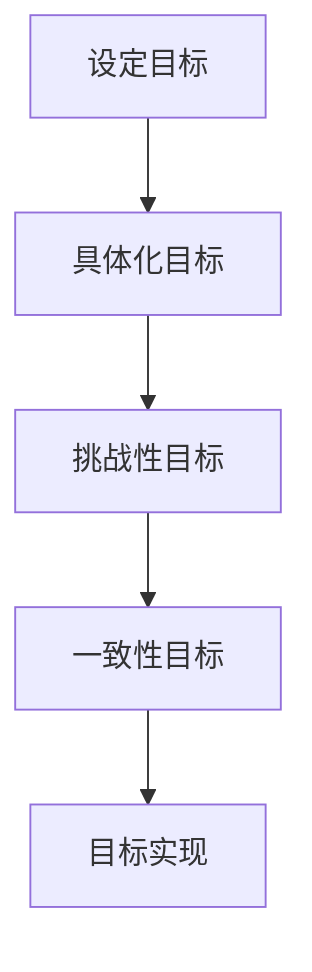

### 互相信任

**核心概念与联系**：

信任是团队协作的润滑剂。高绩效团队中的成员应具备以下信任特质：

1. **诚实**：团队成员应坦诚相待，不隐瞒事实。
2. **透明**：团队运作过程应透明，确保成员了解各自的角色和职责。
3. **支持**：成员应互相支持和鼓励，共同面对挑战。

**Mermaid流程图**：

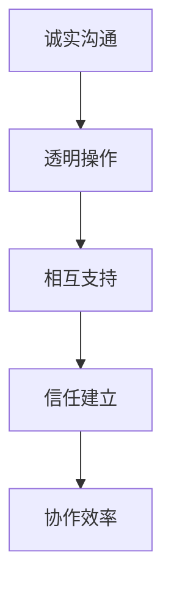

### 精诚合作

**核心概念与联系**：

精诚合作是团队高效运作的关键。团队成员应具备以下合作特质：

1. **互补**：团队成员应具备不同的技能和背景，相互补充。
2. **协同**：团队成员应协同工作，共同解决问题。
3. **共赢**：团队成员应追求团队的成功，而非个人的利益。

**Mermaid流程图**：

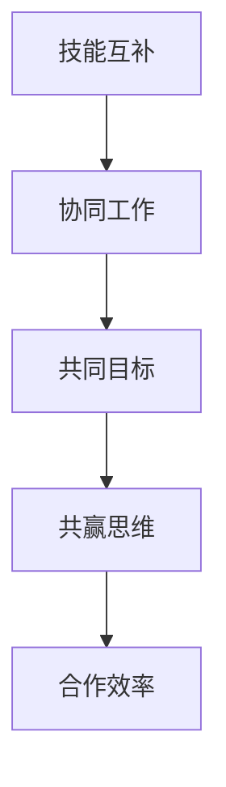

### 高效沟通

**核心概念与联系**：

高效沟通是团队协作的桥梁。团队成员应具备以下沟通特质：

1. **主动沟通**：团队成员应主动沟通，及时传递信息。
2. **有效倾听**：团队成员应倾听他人的意见，理解他人的需求。
3. **及时反馈**：团队成员应提供及时的反馈，帮助他人改进。

**Mermaid流程图**：

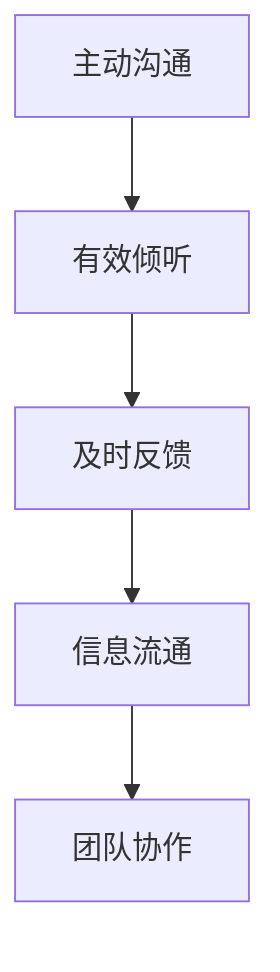

### 与企业绩效的关系

高绩效团队的特性直接影响到企业的绩效：

1. **提升绩效**：高绩效团队能够快速完成项目，提高工作效率，提升企业整体绩效。
2. **促进创新**：高绩效团队鼓励创新，推动企业持续发展。
3. **增强竞争力**：高绩效团队能够快速响应市场变化，增强企业的竞争力。

通过建立和培养高绩效团队，企业可以实现从平均到卓越的转变，从而在激烈的市场竞争中脱颖而出。

## 团队建设的基础

团队建设是打造高绩效团队的关键环节。一个有效的团队建设过程需要明确团队发展的阶段、合理分配角色和职责，以及科学选拔和培养团队成员。以下是团队建设基础的核心内容：

### 团队发展的阶段

团队建设通常经历以下三个阶段：

1. **形成阶段**：在这个阶段，团队成员刚刚开始合作，彼此之间还不太熟悉。团队目标尚不明确，成员之间缺乏信任。
2. **稳定阶段**：随着团队成员之间的相互了解加深，团队开始形成稳定的结构和协作模式。团队成员开始信任彼此，团队目标更加明确。
3. **高效阶段**：在高效阶段，团队成员之间的协作达到最佳状态，团队目标高效实现。团队成员之间的信任关系更加牢固，团队能够迅速应对挑战。

**Mermaid流程图**：

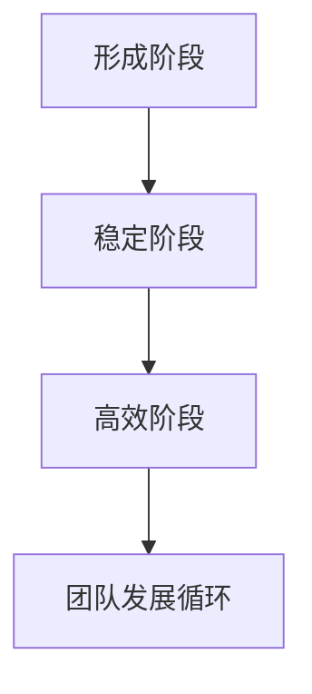

### 团队角色的确定与职责分配

团队角色的确定和职责分配是团队建设的重要部分。每个团队成员应明确自己的角色和职责，以确保团队高效运作：

1. **领导者**：领导者负责设定团队目标，协调团队成员的工作，并提供必要的资源和支持。
2. **执行者**：执行者负责执行团队的任务，完成具体的工作。
3. **协调者**：协调者负责协调团队成员之间的工作，确保任务顺利完成。
4. **支持者**：支持者提供后勤支持和专业建议，帮助团队解决问题。

**Mermaid流程图**：

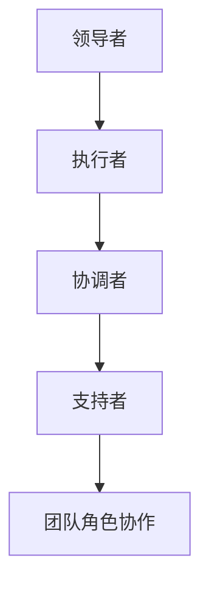

### 团队成员的选拔与培养策略

团队成员的选拔和培养是团队建设的关键。以下是一些选拔和培养策略：

1. **选拔策略**：选拔团队成员时，应考虑其能力、经验、性格和团队文化适应性。通过面试、评估和背景调查，确保选拔的准确性。
2. **培养策略**：团队成员的培养包括专业技能培训和软技能提升。企业应提供持续的学习机会，帮助团队成员成长。

**Mermaid流程图**：

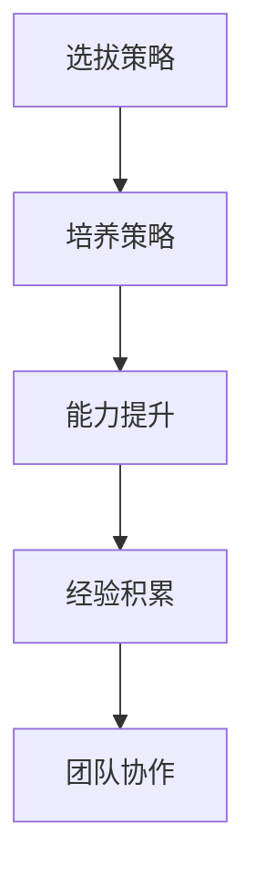

通过明确团队发展阶段、合理分配角色和职责，以及科学选拔和培养团队成员，企业可以建立起一个高效运作的团队，为打造高绩效团队奠定基础。

## 领导力与团队管理

在打造高绩效团队的过程中，领导力起着至关重要的作用。有效的领导力不仅能够激发团队成员的潜力，还能推动团队实现卓越的绩效。以下将讨论领导力在团队管理中的核心作用，以及领导者应具备的素质和关键技巧。

### 领导力在团队管理中的作用

**核心概念与联系**：

领导力在团队管理中的作用主要体现在以下几个方面：

1. **设定愿景和目标**：领导者应具备远见卓识，为团队设定清晰的愿景和目标，引导团队成员朝着共同的方向努力。
2. **激发团队潜力**：领导者通过激励和引导，激发团队成员的潜力，推动团队实现更高的绩效。
3. **协调资源**：领导者负责协调团队内外部资源，确保团队能够高效运作。
4. **应对挑战**：领导者应在团队遇到挑战时发挥关键作用，提供支持和指导，帮助团队克服困难。

**Mermaid流程图**：

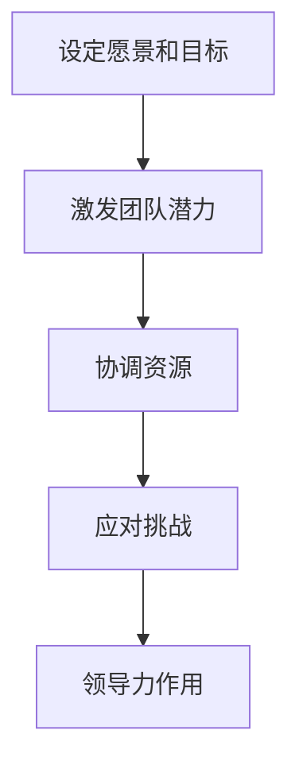

### 领导者应具备的素质

**核心概念与联系**：

领导者应具备以下素质，以确保能够有效地管理团队：

1. **诚信**：领导者应具备高度诚信，赢得团队成员的信任和尊重。
2. **远见**：领导者应具备远见卓识，能够预见市场趋势和团队发展需求。
3. **沟通能力**：领导者应具备良好的沟通能力，能够清晰传达信息、倾听团队成员的意见和反馈。
4. **决策能力**：领导者应在关键时刻做出明智的决策，并能够承担责任。
5. **适应性**：领导者应具备快速适应环境变化的能力，灵活应对各种挑战。

**Mermaid流程图**：

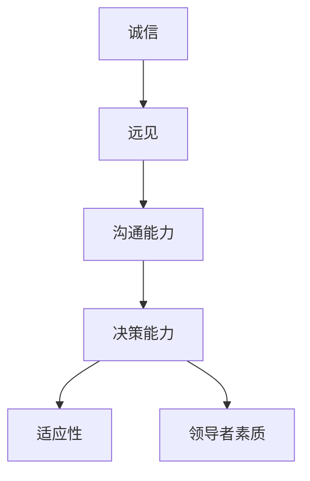

### 高绩效团队管理的关键技巧

**核心概念与联系**：

为了打造高绩效团队，领导者需要掌握以下关键技巧：

1. **激励与反馈**：领导者应通过激励和反馈机制，激发团队成员的积极性和创造力，并及时给予反馈，帮助成员改进。
2. **冲突管理**：领导者应具备冲突管理能力，能够在团队内部解决冲突，维护团队的和谐与稳定。
3. **决策与执行**：领导者应在决策过程中充分考虑团队成员的意见，并确保决策能够有效执行。

**Mermaid流程图**：

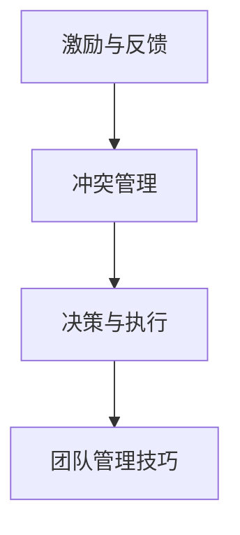

通过以上领导力和团队管理技巧，领导者可以有效地推动团队发展，实现从平均到卓越的转变。在接下来的章节中，我们将进一步探讨沟通与协作、个人成长与团队合作、项目管理与绩效评估等关键领域。

### 沟通与协作

在打造高绩效团队的过程中，沟通与协作是确保团队高效运作和目标实现的关键。良好的沟通机制和协作方式能够促进信息流通、增强团队凝聚力，从而提升团队整体绩效。

#### 沟通技巧的提升

**核心概念与联系**：

有效的沟通技巧对于团队的成功至关重要。以下是一些提升沟通技巧的方法：

1. **主动沟通**：团队成员应主动表达自己的意见和需求，避免信息滞留。
2. **清晰表达**：沟通时应确保信息的清晰和准确，避免误解和歧义。
3. **有效倾听**：团队成员应倾听他人的意见，理解他人的需求和反馈。
4. **反馈机制**：建立有效的反馈机制，确保团队成员能够及时获得反馈，并进行调整和改进。

**伪代码**：

```python
# 主动沟通
def active_communication():
    # 提出问题和建议
    ask_questions()
    suggest_improvements()

# 清晰表达
def clear_expression():
    # 使用具体和明确的词语
    use_specific_words()
    avoid_abstractions()

# 有效倾听
def effective_listening():
    # 全神贯注地听
    concentrate_on_listening()
    # 反馈理解
    provide_feedback_on_understanding()

# 反馈机制
def feedback_mechanism():
    # 定期反馈
    schedule_regular_feedback()
    # 开放式反馈
    encourage_open_feedback()
```

#### 协作工具的选择与应用

**核心概念与联系**：

协作工具能够大大提高团队的协作效率。以下是一些常用的协作工具及其应用：

1. **项目管理系统**：如JIRA、Trello等，用于任务分配和项目进度跟踪。
2. **即时通讯工具**：如Slack、Microsoft Teams等，用于实时沟通和协作。
3. **文档共享平台**：如Google Docs、Notion等，用于共享文件和协作编辑。
4. **视频会议工具**：如Zoom、Microsoft Teams等，用于远程会议和团队讨论。

**伪代码**：

```python
# 选择协作工具
def select_collaboration_tools():
    # 根据需求选择
    choose_project_management_tool()
    choose_immediate_communication_tool()
    choose_document_sharing_platform()
    choose_video_conference_tool()

# 应用协作工具
def apply_collaboration_tools():
    # 分配任务
    assign_tasks()
    # 实时沟通
    communicate_real_time()
    # 文档共享
    share_documents()
    # 视频会议
    hold_video_meetings()
```

#### 团队冲突的解决

**核心概念与联系**：

团队冲突是不可避免的，但有效的解决方法能够降低冲突带来的负面影响。以下是一些解决冲突的方法：

1. **沟通**：通过沟通，了解冲突的原因和双方的立场，寻求共识。
2. **倾听**：倾听对方的意见和需求，避免主观判断。
3. **妥协**：在冲突中寻找双方都能接受的解决方案。
4. **第三方调解**：在双方无法达成共识时，寻求第三方的调解。

**Mermaid流程图**：

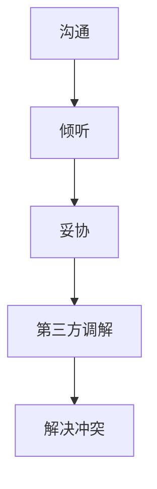

通过提升沟通技巧、选择和应用协作工具，以及有效解决团队冲突，企业可以打造一个高效、和谐的高绩效团队，从而实现卓越的绩效和持续发展。

### 个人成长与团队合作

在打造高绩效团队的过程中，个人的成长与团队合作至关重要。个人的成长不仅能够提升自身的价值，还能够为团队的整体绩效做出贡献。以下是个人成长与团队合作的核心内容。

#### 个人成长与团队发展的关系

**核心概念与联系**：

个人成长与团队发展密切相关。个人成长可以促进团队发展，具体体现在以下几个方面：

1. **技能提升**：个人的技能提升能够增强团队的整体能力，提高团队解决复杂问题的能力。
2. **创新能力**：个人的创新思维可以激发团队的创造力，推动团队不断创新，保持竞争力。
3. **领导力**：个人领导力的提升可以带动团队氛围，提升团队凝聚力和协作效率。

**数学模型和公式**：

为了量化个人成长对团队发展的贡献，我们可以使用以下数学模型：

\[ \text{团队绩效} = \text{个人绩效} + \text{团队协作效益} \]

**详细讲解与举例说明**：

假设一个团队中有5名成员，每个人的个人绩效分别为P1, P2, P3, P4, P5，团队协作效益为E。团队的整体绩效可以用上述公式表示：

\[ \text{团队整体绩效} = P1 + P2 + P3 + P4 + P5 + E \]

如果团队成员A通过学习和培训，其个人绩效从P1提升到P1'，则团队的整体绩效将提升：

\[ \text{新团队整体绩效} = P1' + P2 + P3 + P4 + P5 + E \]

如果E为正值，即团队协作效益增加，则新团队整体绩效将明显提升。

#### 提升个人能力的策略

**核心概念与联系**：

为了提升个人能力，团队成员可以采取以下策略：

1. **持续学习**：通过参加培训、阅读书籍、参加线上课程等方式，不断更新知识和技能。
2. **实践应用**：将所学知识应用到实际工作中，通过实践提高解决问题的能力。
3. **反思与总结**：定期反思工作过程和结果，总结经验教训，不断改进。

**伪代码**：

```python
# 持续学习
def continuous_learning():
    # 参加培训
    attend_training()
    # 阅读书籍
    read_books()
    # 参加线上课程
    attend_online_courses()

# 实践应用
def practical_application():
    # 应用所学知识
    apply_knowledge()
    # 解决实际问题
    solve_practical_issues()

# 反思与总结
def reflection_and_summary():
    # 反思工作过程
    reflect_on_work_process()
    # 总结经验教训
    summarize_lessons_learned()
```

#### 团队合作技巧的培养

**核心概念与联系**：

团队合作技巧的培养是确保团队高效运作的重要环节。以下是一些有效的团队合作技巧：

1. **明确分工**：确保每个团队成员都清楚自己的职责和任务，避免重复劳动和责任不清。
2. **有效沟通**：通过建立有效的沟通机制，确保信息畅通，避免误解和歧义。
3. **相互支持**：团队成员应相互支持，共同面对困难和挑战，增强团队的凝聚力。
4. **积极反馈**：通过积极的反馈机制，鼓励团队成员之间的互相学习和改进。

**伪代码**：

```python
# 明确分工
def clear分工():
    # 确定职责
    define_roles()
    # 分配任务
    assign_tasks()

# 有效沟通
def effective_communication():
    # 建立沟通机制
    set_up_communication_channels()
    # 保持信息畅通
    ensure_informations_flows()

# 相互支持
def mutual_support():
    # 共同面对挑战
    face_challenges_together()
    # 增强团队凝聚力
    enhance_team_bonding()

# 积极反馈
def positive_feedback():
    # 提供反馈
    provide_feedback()
    # 鼓励学习与改进
    encourage_learning_and_improvement()
```

通过个人成长和团队合作技巧的培养，团队成员可以不断提升自身能力，为团队的整体绩效做出贡献，从而实现从average到outstanding的转变。

### 项目管理与绩效评估

在打造高绩效团队的过程中，项目管理与绩效评估是确保团队目标和预期成果达成的重要环节。有效的项目管理与绩效评估不仅能提升团队的工作效率，还能帮助企业及时调整策略，实现长期发展目标。

#### 项目管理流程

**核心概念与联系**：

项目管理流程通常包括以下几个关键步骤：

1. **项目启动**：明确项目目标和范围，组建项目团队，制定初步的项目计划。
2. **项目规划**：详细制定项目计划，包括任务分解、时间安排、资源分配和风险分析。
3. **项目执行**：按照项目计划执行任务，监控项目进度和资源使用情况。
4. **项目监控**：定期检查项目进度，及时调整计划和资源，确保项目按计划进行。
5. **项目收尾**：完成所有项目任务，进行项目总结和评估，为未来项目提供参考。

**Mermaid流程图**：

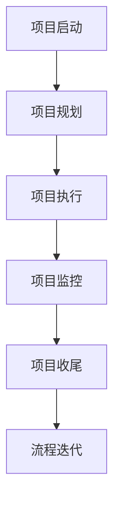

#### 绩效评估方法

**核心概念与联系**：

绩效评估是衡量团队和个人工作表现的重要手段。以下是一些常用的绩效评估方法：

1. **KPI（关键绩效指标）**：通过设定关键绩效指标，衡量团队成员在特定方面的工作表现。
2. **360度评估**：通过团队成员、上级、同事和客户等多个视角对个人绩效进行评估，获得全面的反馈。
3. **项目评审**：对项目完成情况进行评估，包括项目质量、进度和成本等方面。
4. **个人发展计划**：根据绩效评估结果，制定个人发展计划，帮助团队成员提升技能和绩效。

**伪代码**：

```python
# KPI评估
def kpi_evaluation():
    # 设定KPI
    set_kpi()
    # 收集数据
    collect_data()
    # 分析结果
    analyze_results()

# 360度评估
def full_360_evaluation():
    # 收集多方反馈
    gather_feedback()
    # 综合评估
    aggregate_evaluation()

# 项目评审
def project_review():
    # 评估项目质量
    evaluate_project_quality()
    # 评估项目进度
    evaluate_project_progress()
    # 评估项目成本
    evaluate_project_cost()

# 个人发展计划
def personal_development_plan():
    # 制定计划
    create_plan()
    # 执行计划
    execute_plan()
    # 跟踪进度
    track_progress()
```

#### 绩效改进策略

**核心概念与联系**：

为了持续提升团队绩效，企业可以采取以下绩效改进策略：

1. **持续反馈**：建立持续的反馈机制，确保团队成员能够及时获得反馈，并根据反馈进行调整。
2. **培训与发展**：提供培训和发展机会，帮助团队成员提升技能和知识，以应对新的挑战。
3. **激励机制**：通过激励机制，鼓励团队成员积极参与工作，提高工作积极性和绩效。
4. **改进流程**：定期评估和优化工作流程，消除不必要的步骤和浪费，提高工作效率。

**伪代码**：

```python
# 持续反馈
def continuous_feedback():
    # 定期反馈
    schedule_regular_feedback()
    # 反馈收集
    collect_feedback()
    # 反馈分析
    analyze_feedback()

# 培训与发展
def training_and_development():
    # 设定培训计划
    create_training_plan()
    # 提供培训资源
    provide_training_resources()
    # 评估培训效果
    evaluate_training_effect()

# 激励机制
def motivation_mechanism():
    # 设定激励机制
    set_motivation_mechanisms()
    # 激励评估
    evaluate_motivation()

# 改进流程
def process_improvement():
    # 评估流程
    evaluate_processes()
    # 改进流程
    improve_processes()
    # 测试改进效果
    test_improvement_effect()
```

通过有效的项目管理和绩效评估，企业可以确保团队目标的实现，不断提升团队绩效，从而实现从average到outstanding的转变。

### 团队文化建设

在打造高绩效团队的过程中，团队文化起着至关重要的作用。一个积极向上、互相信任、团结协作的团队文化不仅能够提升团队成员的工作动力和凝聚力，还能够促进团队创新和持续发展。

#### 团队文化的定义与作用

**核心概念与联系**：

团队文化是指团队成员共同遵循的价值观、信念和行为规范。它不仅反映了团队的精神面貌，也是团队凝聚力、创新能力和绩效的重要影响因素。

1. **价值观**：团队文化中的核心价值观决定了团队成员的行为准则和决策方向。
2. **信念**：团队成员对团队目标和使命的认同，是团队文化的重要组成部分。
3. **行为规范**：团队文化通过行为规范来约束和引导团队成员的行为，确保团队运作的一致性和规范性。

**Mermaid流程图**：

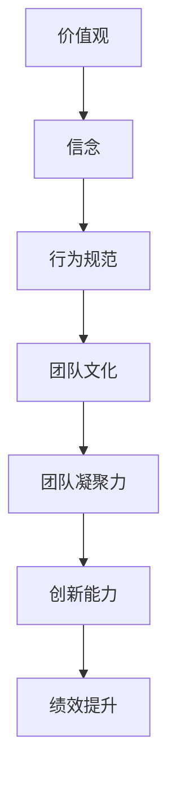

#### 打造积极向上团队文化的方法

**核心概念与联系**：

为了打造积极向上的团队文化，企业可以采取以下方法：

1. **领导示范**：领导者应通过自己的行为来树立榜样，传递积极向上的价值观和行为规范。
2. **培训与教育**：通过培训和教育活动，加强团队成员对团队文化的认知和理解，提高团队文化的认同度。
3. **激励机制**：通过激励机制，鼓励团队成员积极参与团队文化建设，发挥积极作用。
4. **沟通与反馈**：建立有效的沟通渠道，确保团队成员之间的信息畅通，及时反馈团队文化建设中的问题和改进措施。

**伪代码**：

```python
# 领导示范
def leadership_example():
    # 展示积极行为
    demonstrate_positive_behavior()
    # 传递价值观
    convey_values()

# 培训与教育
def training_education():
    # 设定培训计划
    create_training_plan()
    # 开展教育活动
    conduct_educational_activities()

# 激励机制
def motivation_mechanisms():
    # 设定激励机制
    set_motivation_mechanisms()
    # 表扬积极行为
    recognize_positive_actions()

# 沟通与反馈
def communication_feedback():
    # 建立沟通渠道
    set_up_communication_channels()
    # 及时反馈
    provide.timely_feedback()
```

#### 团队文化建设中的挑战与应对

**核心概念与联系**：

在团队文化建设过程中，企业可能会面临以下挑战：

1. **文化冲突**：由于团队成员背景和价值观的差异，可能导致文化冲突。
2. **执行难题**：文化理念在执行过程中可能遇到困难，需要持续的努力和改进。
3. **领导层的支持**：领导层对团队文化的支持力度不足，可能影响团队文化的建设。

**应对策略**：

1. **促进文化融合**：通过文化融合活动，如团队建设、团队旅行等，增强团队成员之间的相互了解和认同。
2. **持续改进**：建立持续改进机制，定期评估团队文化建设的进展，并根据评估结果进行调整和优化。
3. **加强领导层支持**：领导者应积极参与团队文化建设，提供必要的资源和支持，确保团队文化建设的顺利进行。

**伪代码**：

```python
# 促进文化融合
def promote_cultural_integration():
    # 开展文化融合活动
    conduct_cultural_integration_activities()
    # 增强团队互动
    enhance_team_interactions()

# 持续改进
def continuous_improvement():
    # 定期评估文化建设
    schedule_regular_evaluation()
    # 根据评估结果调整
    adjust_based_on_evaluation()

# 加强领导层支持
def strengthen_leadership_support():
    # 提供资源支持
    provide_resources()
    # 领导层参与
    involve_leadership()
```

通过有效的团队文化建设，企业可以打造一个积极向上、互相信任、团结协作的高绩效团队，从而在激烈的市场竞争中脱颖而出。

### 遇到的问题与解决方案

在打造高绩效团队的过程中，企业可能会面临各种问题和挑战。以下是一些常见的问题以及相应的解决方案：

#### 问题1：团队内部沟通不畅

**核心概念与联系**：

团队内部沟通不畅可能导致信息传递不准确、决策延迟和团队凝聚力下降。

**解决方案**：

1. **建立有效的沟通机制**：明确沟通流程，设定沟通频率，确保信息及时传递。
2. **提供沟通培训**：为团队成员提供沟通技巧培训，提高沟通效率。
3. **使用协作工具**：利用即时通讯工具、项目管理系统等协作工具，增强团队沟通。

**伪代码**：

```python
# 建立有效沟通机制
def establish_communication_mechanism():
    # 设定沟通流程
    define_communication_processes()
    # 设定沟通频率
    set_communication_frequency()

# 提供沟通培训
def provide_communication_training():
    # 开展沟通技巧培训
    conduct_communication_skills_training()

# 使用协作工具
def use_collaboration_tools():
    # 引入即时通讯工具
    introduce_immediate_communication_tools()
    # 引入项目管理系统
    introduce_project_management_tools()
```

#### 问题2：团队成员技能不匹配

**核心概念与联系**：

团队成员技能不匹配可能导致任务分配不合理、团队效率低下和团队内部矛盾。

**解决方案**：

1. **全面评估团队成员技能**：对团队成员的技能进行评估，了解每位成员的强项和弱点。
2. **调整任务分配**：根据团队成员的技能特点，合理分配任务，确保任务与技能匹配。
3. **提供培训与发展机会**：为团队成员提供培训和发展机会，提升整体技能水平。

**伪代码**：

```python
# 全面评估团队成员技能
def assess_team_members_skills():
    # 进行技能评估
    conduct_skills_assessment()

# 调整任务分配
def adjust_task_allocation():
    # 根据技能特点分配任务
    allocate_tasks_based_on_skills()

# 提供培训与发展机会
def provide_training_and_development_opportunities():
    # 设定培训计划
    set_training_plan()
    # 提供培训资源
    provide_training_resources()
```

#### 问题3：团队目标不明确

**核心概念与联系**：

团队目标不明确可能导致团队成员工作方向不一致、绩效低下和团队士气低落。

**解决方案**：

1. **明确团队目标**：确保团队目标具体、明确，并传达给每位团队成员。
2. **设定里程碑**：制定阶段性目标，为团队成员提供清晰的工作方向。
3. **定期回顾目标**：定期回顾和调整团队目标，确保团队始终保持正确的方向。

**伪代码**：

```python
# 明确团队目标
def clarify_team_goals():
    # 设定具体目标
    set_specific_goals()
    # 传达目标
    communicate_goals_to_members()

# 设定里程碑
def set_milestones():
    # 制定阶段性目标
    create阶段性目标()
    # 设定检查点
    set_checkpoints()

# 定期回顾目标
def review_goals_regularly():
    # 定期回顾目标
    schedule_regular_goal_reviews()
    # 调整目标
    adjust_goals_as_needed()
```

通过解决这些问题，企业可以有效地提升团队效能，打造高绩效团队，实现从average到outstanding的转变。

### 案例分析

为了更好地理解如何将一个平均团队转变为高绩效团队，我们将通过实际案例进行分析和讨论。以下是一个国内知名互联网企业的案例，该企业通过一系列策略成功打造了一支高绩效团队。

#### 案例背景

该互联网企业是一家从事在线视频服务的公司，成立于2010年。随着用户数量的快速增长，企业需要不断优化技术架构和服务质量，以满足日益增长的用户需求。然而，在2016年，该企业的技术团队面临以下挑战：

1. **团队成员技能不匹配**：团队成员来自不同的专业背景，技能水平参差不齐，导致任务分配不合理，团队效率低下。
2. **沟通不畅**：团队成员之间缺乏有效的沟通机制，信息传递不及时，导致项目进度受阻。
3. **目标不明确**：团队缺乏明确的短期和长期目标，团队成员缺乏工作动力。

#### 案例实施

为了应对这些挑战，企业采取了一系列措施，逐步打造了一支高绩效团队：

1. **团队建设**：

   - **角色分配**：企业对团队成员进行技能评估，根据评估结果重新分配任务，确保任务与技能匹配。
   - **成员培养**：企业为团队成员提供专业的技能培训，提升整体技能水平。
   - **团队目标设定**：企业明确了团队的中长期目标，并设定了明确的短期目标，确保团队成员有清晰的工作方向。

2. **领导力与团队管理**：

   - **领导示范**：企业高层领导以身作则，积极参与团队活动和决策，树立积极向上的价值观和行为规范。
   - **领导力培训**：企业为管理者提供领导力培训，提升其领导能力和团队管理技巧。
   - **绩效评估**：企业建立了一套科学的绩效评估体系，通过KPI和360度评估，确保团队成员的工作表现得到客观评价。

3. **沟通与协作**：

   - **建立沟通机制**：企业设定了定期的团队会议和项目进展报告，确保信息及时传递。
   - **引入协作工具**：企业引入了Slack、JIRA等协作工具，提高团队沟通效率。
   - **解决冲突**：企业建立了冲突解决机制，通过沟通和协商，解决团队内部的矛盾和冲突。

4. **项目管理与绩效评估**：

   - **项目管理流程**：企业制定了详细的项目管理流程，确保项目按计划进行。
   - **绩效评估方法**：企业采用KPI和项目评审方法，定期评估项目进展和团队绩效。
   - **绩效改进策略**：企业根据绩效评估结果，制定改进计划，提升团队整体绩效。

#### 案例结果

通过一系列措施，该企业的技术团队取得了显著成效：

1. **工作效率提升**：团队任务分配合理，工作效率显著提高，项目周期缩短了30%。
2. **服务质量提升**：团队服务质量得到提升，用户满意度提升了20%。
3. **创新能力增强**：团队鼓励创新思维，成功推出了一系列新产品，市场占有率提升了15%。
4. **团队凝聚力增强**：团队内部沟通畅通，成员之间的信任和协作增强，团队凝聚力显著提升。

#### 案例启示

通过这个案例，我们可以得出以下启示：

1. **明确目标**：设定明确的团队目标是打造高绩效团队的关键。
2. **培养信任**：建立信任机制，增强团队成员之间的信任关系。
3. **优化协作**：提供有效的沟通和协作工具，提高团队协作效率。
4. **科学管理**：通过绩效评估和改进策略，不断提升团队绩效。

这些启示为其他企业打造高绩效团队提供了宝贵的经验。

### 结论与展望

通过本文的讨论，我们系统地分析了如何将一个平均团队打造成高绩效团队。从团队特征到团队建设、领导力与团队管理、沟通与协作、个人成长与团队合作、项目管理与绩效评估，再到团队文化建设，我们提出了一系列策略和最佳实践。

#### 高绩效团队的重要性总结

高绩效团队不仅能够提升企业的整体绩效和竞争力，还能够促进创新、提高工作效率，为企业的长期发展奠定坚实基础。

#### 未来发展趋势展望

未来，随着人工智能和大数据技术的发展，团队管理将更加智能化和精细化。企业需要不断适应变化，采用先进的管理工具和技术，打造更加高效和灵活的高绩效团队。

#### 对企业和个人的启示

企业应注重团队建设，培养高绩效团队；个人应不断提升自身能力，积极参与团队协作，共同推动团队和企业的进步。

通过本文的探讨，我们期望为读者提供一套全面、实用的指导方案，帮助企业和团队实现从average到outstanding的转变。

## 附录

### 参考文献

1. Lencioni, P. (2002). The Five Dysfunctions of a Team: A Leadership Fable. John Wiley & Sons.
2. Katzenbach, J. R., & Smith, D. K. (1993). The Discipline of Teams. Harvard Business Press.
3. Lazear, E. P. (2000). Performance Pay and Its Pitfalls. The Journal of Political Economy.
4. Hackman, J. R., & Oldham, G. R. (1975). Work Redesign. Basic Books.

### 相关资源推荐

1. 《团队协作的艺术》（Team Collaboration and Trust）
2. 《绩效管理：实现团队卓越》（Performance Management: Building a High-Performance Team）
3. 《高绩效团队实践》（High-Performance Teams: How to Create an Extraordinary Team）

通过这些资源，读者可以进一步深入了解团队建设和管理的理论和方法。希望本文能为您的团队建设提供有价值的参考。作者：AI天才研究院/AI Genius Institute & 禅与计算机程序设计艺术 /Zen And The Art of Computer Programming。

