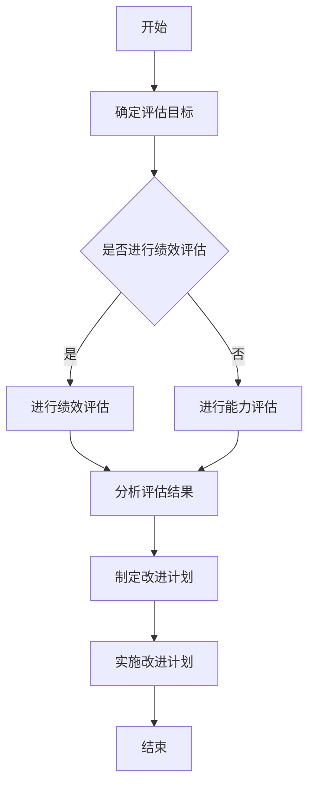

                 


### 1. 完整性要求

为了确保文章内容完整且结构紧凑，我们将按照以下步骤来构建文章的各个部分：

- **背景介绍**：首先介绍团队建设的重要性，团队在高绩效组织中的关键作用，以及为什么从招聘到培养的全流程对于团队成功至关重要。
  
- **核心概念与联系**：定义团队建设中的核心概念，如团队发展阶段、团队角色、团队沟通等，并使用Mermaid流程图展示这些概念之间的关系。

- **核心算法原理讲解**：介绍团队评估的算法原理，使用伪代码阐述评估流程和模型。

- **数学模型和数学公式**：详细讲解绩效评估中的数学模型，使用LaTeX格式嵌入相关公式，并举例说明。

- **项目实战**：提供一个完整的团队招聘和培养的项目实战案例，包括开发环境搭建、源代码实现、代码解读和案例分析。

- **最佳实践 tips**：总结一些团队招聘和培养的最佳实践建议。

- **小结**：对全文进行总结，强调团队建设的关键要素和长期投资的价值。

### 2. 书名解析

《打造高绩效团队：从招聘到培养的全流程》这本书名明确指出了其主题：高绩效团队的建设。关键词包括“高绩效”、“团队”、“招聘”和“培养”。这些关键词表明了书籍将探讨如何构建一个高效、协作且持续发展的团队，并重点关注从人才获取到团队成长的整个生命周期。

- **高绩效**：意味着团队在目标实现上有着卓越的业绩。
- **团队**：涉及团队成员的合作、沟通和协作。
- **招聘**：讨论如何吸引和选择合适的团队成员。
- **培养**：关注如何提升团队成员的能力和潜力。

### 3. 目录大纲设计思路

目录大纲的设计旨在为读者提供一个清晰、结构化的阅读路径。以下是每个部分的设计思路：

- **引言**：简短地介绍团队建设的重要性，概述书籍的目的和结构。

- **第一部分：团队建设基础**：
  - **核心概念与联系**：详细阐述团队建设的基础理论，如图形流程图展示团队发展阶段和角色。
  - **团队评估**：介绍团队评估的重要性和方法。

- **第二部分：团队招聘**：
  - **招聘策略**：探讨人才需求分析和招聘渠道选择。
  - **面试技巧**：提供面试流程和技巧。
  - **招聘法律与伦理**：讨论招聘过程中的法律法规和伦理问题。

- **第三部分：团队培养**：
  - **培养策略**：讨论培训计划、人才发展和团队文化建设。
  - **绩效管理**：介绍绩效目标设定、评估和反馈。

- **第四部分：团队管理**：
  - **团队领导**：讨论领导者的角色和领导力发展。
  - **团队协作**：介绍协作工具和方法。
  - **冲突管理**：探讨冲突的类型和处理方法。

- **第五部分：团队评估与改进**：
  - **团队评估**：介绍团队绩效评估的方法和改进策略。

- **第六部分：案例研究**：
  - **成功案例分析**：提供实际案例，分析团队建设的成功经验。
  - **挑战与应对**：讨论团队建设中的挑战和应对策略。

- **附录**：
  - **工具与资源**：提供相关的工具和资源链接。

### 4. 目录大纲（草案）

```
# 《打造高绩效团队：从招聘到培养的全流程》目录大纲

## 引言

### 1.1 团队建设的重要性

### 1.2 本书的目的和结构

## 第一部分：团队建设基础

### 2.1 核心概念与联系

#### 2.1.1 团队发展阶段

#### 2.1.2 团队角色

#### 2.1.3 团队沟通

### 2.2 团队评估方法

#### 2.2.1 Mermaid 流程图展示

## 第二部分：团队招聘

### 2.3 招聘策略

#### 2.3.1 人才需求分析

#### 2.3.2 招聘渠道

### 2.4 面试技巧

#### 2.4.1 行为面试

#### 2.4.2 结构化面试

### 2.5 招聘法律与伦理

#### 2.5.1 法律法规

#### 2.5.2 伦理问题

## 第三部分：团队培养

### 3.6 培养策略

#### 3.6.1 培训计划

#### 3.6.2 人才发展

### 3.7 团队文化建设

#### 3.7.1 建立积极文化

### 3.8 绩效管理

#### 3.8.1 设定绩效目标

#### 3.8.2 评估绩效

#### 3.8.3 提供反馈

## 第四部分：团队管理

### 4.9 团队领导

#### 4.9.1 领导者角色

#### 4.9.2 领导力发展

### 4.10 团队协作

#### 4.10.1 协作工具

#### 4.10.2 协作方法

### 4.11 冲突管理

#### 4.11.1 冲突类型

#### 4.11.2 冲突原因

#### 4.11.3 冲突处理

## 第五部分：团队评估与改进

### 5.12 团队评估

#### 5.12.1 绩效评估

#### 5.12.2 评估结果应用

### 5.13 团队改进

#### 5.13.1 改进策略

#### 5.13.2 改进实践

## 第六部分：案例研究

### 6.14 成功案例分析

### 6.15 挑战与应对

## 第七部分：附录

### 7.1 工具与资源

#### 7.1.1 招聘工具

#### 7.1.2 培训资源
```

以上目录大纲草案将按照 1,2,3 级目录进行细化，每个章节的内容将丰富具体，确保符合完整性要求。接下来，我们将进一步补充和细化每个章节的内容，并嵌入必要的 Mermaid 流程图、伪代码、LaTeX 公式和实际项目案例。

---

### 文章标题与关键词

**文章标题**：《打造高绩效团队：从招聘到培养的全流程》

**关键词**：
- 高绩效团队
- 招聘策略
- 团队培养
- 绩效管理
- 团队评估
- 团队领导
- 冲突管理
- 团队协作
- 培训计划
- 面试技巧

### 文章摘要

本文旨在探讨如何打造一个高绩效团队，涵盖从招聘到培养的全流程。我们将首先介绍团队建设的基础理论，包括团队发展阶段、团队角色和团队沟通。随后，详细讨论团队招聘的策略、面试技巧以及招聘法律和伦理问题。接着，我们将探讨团队培养的策略，包括培训计划、团队文化建设以及绩效管理。然后，介绍团队管理的关键要素，如团队领导、团队协作和冲突管理。文章的后半部分将重点关注团队评估与改进的方法，并提供实际案例研究。最后，总结全文，强调团队建设中的最佳实践和长期投资的价值。

---

### 引言

在当今快速变化和竞争激烈的市场环境中，高绩效团队成为企业成功的关键因素。团队不仅能够高效地完成项目任务，还能够不断创新，适应变化，并在面对挑战时保持稳定和凝聚力。因此，如何构建一个高绩效团队，并确保其持续发展，成为每个组织亟需解决的问题。

团队建设不仅仅是招募合适的成员，还包括培养他们的能力、激发他们的潜力，并建立积极的文化氛围。从招聘到培养的全流程管理，对团队的成功至关重要。一个有效的团队建设策略能够确保团队成员的能力和潜力得到充分发挥，同时增强团队的协作和凝聚力。

本文将围绕如何打造高绩效团队，从招聘到培养的全流程进行探讨。首先，我们将介绍团队建设的基础理论，包括团队发展阶段、团队角色和团队沟通。接着，我们将详细讨论团队招聘的策略，包括人才需求分析、招聘渠道和面试技巧。随后，我们将探讨团队培养的策略，如培训计划、团队文化建设以及绩效管理。在团队管理的部分，我们将介绍团队领导、团队协作和冲突管理的重要性。文章的后半部分将提供团队评估与改进的方法，并通过实际案例研究来分析团队建设的成功经验和挑战。最后，我们将总结全文，强调团队建设中的最佳实践和长期投资的价值。

---

### 第一部分：团队建设基础

在探讨如何打造高绩效团队之前，我们需要了解团队建设的基础理论。这包括团队发展阶段、团队角色和团队沟通，这些都是团队成功的关键要素。

#### 1.1 团队发展阶段

团队发展阶段理论由Tuckman提出，他描述了团队发展的五个阶段：形成阶段、震荡阶段、规范化阶段、执行阶段和成熟阶段。

- **形成阶段**：团队成员开始了解彼此，建立初步的联系和信任。
- **震荡阶段**：团队成员开始表达个人意见，可能会出现冲突和分歧。
- **规范化阶段**：团队成员开始协同工作，形成共同的目标和价值观。
- **执行阶段**：团队高效地完成工作，实现目标。
- **成熟阶段**：团队自主运作，能够应对各种挑战和变化。

了解团队发展阶段有助于领导者根据团队的不同阶段提供适当的指导和支持。

#### 1.2 团队角色

团队角色理论由Belbin提出，他将团队成员分为九种角色：执行者、协调者、创新者、监听者、资源发掘者、完美主义者、团队工人、团队领导者和服务者。

- **执行者**：注重行动，执行力强。
- **协调者**：擅长协调和沟通，确保团队高效运作。
- **创新者**：勇于创新，推动团队不断进步。
- **监听者**：善于倾听，收集团队成员的意见和建议。
- **资源发掘者**：善于发现和利用资源，提高团队效率。
- **完美主义者**：追求卓越，注重细节和品质。
- **团队工人**：乐于助人，支持团队成员。
- **团队领导者**：负责指导和激励团队。
- **服务者**：提供必要的支持和协助。

了解团队角色有助于领导者根据团队成员的个性和能力分配任务，促进团队协作。

#### 1.3 团队沟通

团队沟通是团队成功的关键。有效的沟通不仅能够提高工作效率，还能增强团队成员之间的信任和凝聚力。

- **沟通渠道**：团队沟通可以通过会议、邮件、即时通讯工具等多种渠道进行。每种渠道都有其优势和适用场景。
- **沟通技巧**：包括倾听、表达清晰、非语言沟通和反馈技巧。倾听是有效沟通的基础，表达清晰确保信息准确传达，非语言沟通和反馈技巧则有助于建立信任和共识。

#### 1.4 团队评估方法

团队评估是确保团队持续发展的重要手段。评估可以包括以下几个方面：

- **绩效评估**：评估团队成员的工作表现，包括目标达成、工作质量和团队贡献。
- **能力评估**：评估团队成员的能力和潜力，包括专业技能、沟通能力和领导力。
- **团队氛围评估**：评估团队的协作程度、信任度和凝聚力。

使用Mermaid流程图可以直观地展示团队评估的方法和流程。以下是一个简单的Mermaid流程图示例：



这个流程图展示了从确定评估目标到实施改进计划的完整过程。

---

### 第二部分：团队招聘

团队招聘是构建高绩效团队的第一步。一个有效的招聘策略能够确保团队拥有合适的成员，以实现组织的目标。以下是团队招聘的关键环节：

#### 2.1 招聘策略

**2.1.1 人才需求分析**

招聘的第一步是进行人才需求分析。这包括：

- **确定招聘需求**：根据团队和组织的发展目标，确定需要招聘的职位和数量。
- **职位描述**：撰写详细的职位描述，明确职责、技能要求和任职条件。
- **能力评估标准**：制定能力评估标准，以便在面试过程中对候选人进行评估。

**2.1.2 招聘渠道**

选择合适的招聘渠道对于招聘成功至关重要。以下是一些常用的招聘渠道：

- **内部推荐**：利用现有员工的人脉资源，推荐合适的候选人。
- **招聘网站**：如LinkedIn、Indeed、智联招聘等，提供在线职位发布和申请功能。
- **招聘会**：组织招聘活动，吸引大量候选人。
- **招聘代理**：委托专业的招聘代理机构进行招聘。

**2.1.3 面试技巧**

面试是招聘过程中的关键环节。以下是一些面试技巧：

- **行为面试**：通过询问候选人过去的经验和行为，评估其能力和潜力。
- **结构化面试**：制定标准化的面试问题，确保对所有候选人进行公平评估。
- **情境面试**：模拟实际工作场景，评估候选人在特定情境下的表现。

#### 2.2 面试技巧

**2.2.1 行为面试**

行为面试是一种评估候选人过去行为的方法。以下是一些常用的行为面试问题：

- **请描述一次你在工作中遇到的问题，以及你是如何解决的？**
- **请举例说明你如何在一个团队中发挥领导作用？**
- **请描述一次你如何克服困难，实现目标？**

**2.2.2 结构化面试**

结构化面试是一种标准化面试方法，通过一系列预先设计的问题来评估候选人。以下是一个结构化面试的示例：

1. **自我介绍**
2. **请谈谈你的专业背景和技能。**
3. **请描述一次你如何与同事合作完成一个项目？**
4. **请谈谈你的领导风格。**
5. **请描述一次你如何处理工作中的冲突？**
6. **请谈谈你对这个职位的理解和期望？**

#### 2.3 招聘法律与伦理

**2.3.1 法律法规**

在招聘过程中，必须遵守相关法律法规，以确保招聘过程的合法性和公平性。以下是一些常见的招聘法律法规：

- **劳动法**：规定了劳动关系的法律框架，包括劳动合同、劳动条件等。
- **反歧视法**：禁止招聘过程中的性别、种族、年龄、宗教和残疾歧视。
- **个人信息保护法**：保护候选人个人信息的安全和隐私。

**2.3.2 伦理问题**

招聘过程中的伦理问题也是需要重视的。以下是一些常见的伦理问题：

- **公正性**：确保对所有候选人都进行公平评估，避免偏见和歧视。
- **保密性**：保护候选人的个人信息和申请材料的隐私。
- **诚实性**：在招聘过程中保持诚实和透明，不误导或夸大职位信息。

---

### 第三部分：团队培养

团队培养是确保团队长期发展和高绩效的关键。一个有效的团队培养策略能够提高团队成员的能力和潜力，促进团队协作和创新能力。以下是团队培养的关键环节：

#### 3.1 培养策略

**3.1.1 培训计划**

培训计划是团队培养的基础。以下是一些制定培训计划的步骤：

- **确定培训目标**：根据团队和组织的发展需求，明确培训的目标和重点。
- **选择培训方式**：根据培训内容和个人需求，选择合适的培训方式，如内部培训、外部培训、在线学习等。
- **制定培训计划**：制定详细的培训计划，包括培训内容、培训时间、培训地点和培训师等。

**3.1.2 人才发展**

人才发展是团队培养的重要环节。以下是一些人才发展策略：

- **导师制度**：为新员工分配导师，帮助他们快速融入团队，提供指导和支持。
- **职业发展规划**：为员工制定职业发展规划，明确职业目标和路径。
- **技能提升**：提供各种培训和学习机会，帮助员工提升专业技能和综合能力。

**3.1.3 团队文化建设**

团队文化是团队精神的体现，对于团队培养和团队协作至关重要。以下是一些建立积极团队文化的策略：

- **建立共同目标**：明确团队目标，确保所有成员都朝着共同的目标努力。
- **鼓励沟通和分享**：创造一个开放、尊重和信任的沟通环境，鼓励团队成员之间的沟通和分享。
- **表彰和奖励**：对团队成员的成就和贡献进行表彰和奖励，增强团队的凝聚力和积极性。

#### 3.2 绩效管理

绩效管理是确保团队高绩效的重要手段。以下是一些绩效管理的关键环节：

**3.2.1 设定绩效目标**

设定绩效目标是绩效管理的第一步。以下是一些设定绩效目标的策略：

- **明确性**：绩效目标应该具体、明确，便于衡量。
- **挑战性**：绩效目标应该具有一定的挑战性，激发员工的积极性和创造力。
- **相关性**：绩效目标应该与团队和组织的目标相关联。

**3.2.2 评估绩效**

评估绩效是绩效管理的重要环节。以下是一些评估绩效的方法：

- **定量评估**：通过量化的指标，如销售额、项目进度等，评估绩效。
- **定性评估**：通过描述性的评估，如工作表现、团队合作等，评估绩效。
- **360度评估**：通过多角度的反馈，如同事、上级、下属等，评估绩效。

**3.2.3 提供反馈**

提供反馈是绩效管理的关键。以下是一些提供反馈的策略：

- **及时性**：及时提供反馈，帮助员工了解自己的表现。
- **建设性**：提供具体的、建设性的反馈，帮助员工改进。
- **个性化**：根据员工的个性和需求，提供个性化的反馈。

---

### 第四部分：团队管理

团队管理是确保团队高效运作和实现目标的关键。以下是团队管理的关键环节：

#### 4.1 团队领导

团队领导是团队管理的核心。以下是一些团队领导的关键要素：

**4.1.1 领导者角色**

领导者是团队的核心，负责设定方向、激励团队成员和解决团队问题。以下是一些领导者角色：

- **领导者**：指导和管理团队，确保团队目标实现。
- **激励者**：激发员工的潜力，激励团队成员积极参与。
- **沟通者**：建立有效的沟通渠道，确保团队信息的畅通。

**4.1.2 领导力发展**

领导力发展是确保团队领导能力不断提升的关键。以下是一些领导力发展策略：

- **培训和学习**：通过培训和学习，提升领导技能和知识。
- **经验分享**：通过经验分享，学习他人的成功经验和教训。
- **反馈和改进**：通过反馈和改进，不断完善领导力。

#### 4.2 团队协作

团队协作是确保团队高效运作的关键。以下是一些团队协作的关键要素：

**4.2.1 协作工具**

协作工具是团队协作的重要支持。以下是一些常用的协作工具：

- **项目管理工具**：如Trello、Asana等，帮助团队管理和跟踪项目进度。
- **沟通工具**：如Slack、Microsoft Teams等，方便团队成员之间的沟通和协作。
- **文档共享工具**：如Google Drive、Dropbox等，方便团队成员共享文档和文件。

**4.2.2 协作方法**

有效的协作方法是确保团队协作顺利进行的关键。以下是一些协作方法：

- **每日站会**：每日站会是一种简短而高效的团队协作方法，用于检查项目进度和解决问题。
- **团队会议**：定期举行团队会议，讨论项目进展、问题和计划。
- **任务分配**：明确每个成员的任务和责任，确保项目顺利进行。

#### 4.3 冲突管理

冲突管理是确保团队和谐运作的关键。以下是一些冲突管理的关键要素：

**4.3.1 冲突类型**

冲突可以分为以下几种类型：

- **任务冲突**：由于任务分配或工作量不均引起的冲突。
- **目标冲突**：由于团队目标不一致或优先级不同引起的冲突。
- **价值观冲突**：由于团队成员价值观差异引起的冲突。

**4.3.2 冲突原因**

冲突原因可以分为以下几个方面：

- **沟通不畅**：由于沟通不畅或误解引起的冲突。
- **资源不足**：由于资源不足或分配不均引起的冲突。
- **角色不明确**：由于角色不明确或职责重叠引起的冲突。

**4.3.3 冲突处理**

有效的冲突处理是确保团队和谐运作的关键。以下是一些冲突处理策略：

- **预防措施**：通过预防措施，如明确沟通渠道、分配明确任务等，减少冲突的发生。
- **倾听和理解**：倾听和理解冲突各方的观点，寻找共同点。
- **协商和妥协**：通过协商和妥协，寻求双方都能接受的解决方案。

---

### 第五部分：团队评估与改进

团队评估与改进是确保团队持续发展和高绩效的重要环节。以下是一些团队评估与改进的关键要素：

#### 5.1 团队评估

**5.1.1 绩效评估**

绩效评估是团队评估的核心。以下是一些绩效评估的方法：

- **定量评估**：通过量化的指标，如销售额、项目进度等，评估绩效。
- **定性评估**：通过描述性的评估，如工作表现、团队合作等，评估绩效。
- **360度评估**：通过多角度的反馈，如同事、上级、下属等，评估绩效。

**5.1.2 评估结果应用**

评估结果应用是确保团队改进和发展的关键。以下是一些评估结果应用的方法：

- **反馈和改进**：根据评估结果，提供反馈和建议，帮助团队成员改进。
- **奖励和激励**：根据评估结果，对表现优秀的团队成员进行奖励和激励。
- **培训和发展**：根据评估结果，制定培训和发展计划，提升团队成员的能力。

#### 5.2 团队改进

团队改进是确保团队持续发展和高绩效的关键。以下是一些团队改进的方法：

- **问题识别**：通过评估和反馈，识别团队存在的问题和挑战。
- **制定改进计划**：根据问题识别，制定具体的改进计划，明确改进的目标、方法和责任。
- **实施改进计划**：执行改进计划，确保改进措施得到有效实施。
- **跟踪和评估**：跟踪改进计划的实施情况，评估改进效果，并根据评估结果进行持续优化。

#### 5.3 案例研究

**5.3.1 成功案例分析**

成功案例分析是学习和借鉴团队建设经验的重要途径。以下是一些团队建设的成功案例：

- **案例1**：某公司通过明确的团队目标和高效的沟通渠道，成功提高了团队协作和绩效。
- **案例2**：某团队通过定期的培训和技能提升，提升了团队的专业能力和创新能力。

**5.3.2 挑战与应对**

团队建设过程中，可能会面临各种挑战。以下是一些常见的挑战和应对策略：

- **挑战1**：团队沟通不畅，导致任务无法顺利推进。应对策略：建立有效的沟通渠道，加强团队成员之间的沟通和协作。
- **挑战2**：团队成员之间冲突频繁，影响团队氛围。应对策略：加强团队建设，提高团队成员的冲突管理能力，建立积极的团队文化。

---

### 第六部分：案例研究

在本部分中，我们将通过两个实际的案例研究来深入探讨如何成功地构建高绩效团队。首先是一个成功案例，接着是一个挑战案例，并分析其背后的原因和解决方案。

#### 6.1 成功案例分析

**案例名称**：某科技公司成功打造高绩效团队

**背景**：该公司在快速发展过程中，意识到团队建设对于企业成功至关重要。公司决定从招聘到培养的全流程进行系统性的建设。

**具体措施**：

1. **招聘策略**：
   - 进行详细的人才需求分析，明确招聘标准和要求。
   - 利用内部推荐和外部招聘渠道，确保招聘到具有潜力和适合公司文化的员工。
   - 采用结构化面试，确保对所有候选人进行公平评估。

2. **团队培养**：
   - 制定详细的培训计划，包括专业技能培训和领导力培训。
   - 实施导师制度，帮助新员工快速融入团队。
   - 定期组织团队建设活动，增强团队凝聚力。

3. **绩效管理**：
   - 设定明确的绩效目标，并与团队和组织目标相结合。
   - 采用定量和定性评估方法，全面了解团队成员的表现。
   - 提供及时、具体的反馈，帮助团队成员不断改进。

**结果**：通过系统的团队建设，该公司成功提高了团队协作和绩效，实现了业务目标。

#### 6.2 挑战与应对

**案例名称**：某初创公司团队建设面临挑战

**背景**：该公司在初创阶段，团队成员较少，但工作量巨大。由于沟通不畅和资源不足，团队建设面临挑战。

**具体问题**：

1. **沟通不畅**：团队成员之间的沟通不够频繁，导致任务无法顺利推进。
2. **资源不足**：团队资源有限，导致任务分配不均，影响团队士气。
3. **冲突频繁**：团队成员之间由于工作压力和职责不清，发生冲突。

**解决方案**：

1. **沟通改善**：
   - 定期举行团队会议，确保团队成员之间的沟通畅通。
   - 采用即时通讯工具，如Slack，方便团队成员随时交流。
   - 设立沟通反馈机制，鼓励团队成员提出问题和建议。

2. **资源优化**：
   - 重新评估工作任务和资源分配，确保任务分配公平。
   - 引入项目管理工具，如Trello，帮助团队成员跟踪任务进度。
   - 增加团队培训，提高资源利用效率。

3. **冲突管理**：
   - 定期举行冲突管理培训，提高团队成员的冲突解决能力。
   - 建立冲突解决流程，确保冲突得到及时、公正的解决。
   - 建立团队文化，鼓励开放和诚实的沟通，减少冲突的发生。

**结果**：通过有效的沟通和冲突管理，该公司成功克服了团队建设中的挑战，提高了团队协作和绩效。

---

### 第七部分：附录

在本部分中，我们将提供一些与团队建设相关的工具和资源，以帮助读者更好地理解和实践团队建设的方法。

#### 7.1 招聘工具

- **招聘网站**：如LinkedIn、Indeed、智联招聘等，提供在线职位发布和申请功能。
- **招聘代理**：委托专业的招聘代理机构，帮助招聘合适的候选人。

#### 7.2 培训资源

- **在线课程平台**：如Coursera、Udemy等，提供各种专业的在线培训课程。
- **内部培训**：组织内部培训，邀请专业讲师或内部专家进行培训。

#### 7.3 团队协作工具

- **项目管理工具**：如Trello、Asana等，帮助团队管理和跟踪项目进度。
- **沟通工具**：如Slack、Microsoft Teams等，方便团队成员之间的沟通和协作。
- **文档共享工具**：如Google Drive、Dropbox等，方便团队成员共享文档和文件。

#### 7.4 团队评估工具

- **绩效评估工具**：如KPI仪表盘、绩效评估软件等，帮助团队进行绩效评估和反馈。
- **360度评估工具**：如SurveyMonkey、Google Forms等，方便收集多角度的反馈。

---

### 总结

本文围绕如何打造高绩效团队，从招聘到培养的全流程进行了详细探讨。通过介绍团队建设的基础理论、团队招聘策略、团队培养策略、团队管理技巧和团队评估与改进方法，读者可以全面了解团队建设的各个方面。同时，通过实际案例研究，读者可以更好地理解和应用这些方法。

团队建设是一个长期而持续的过程，需要组织在招聘、培养、管理和改进等方面持续投入。通过有效的团队建设，组织可以打造一个高效、协作且具有创新能力的团队，从而实现企业的长期成功。

---

### 作者信息

**作者**：AI天才研究院/AI Genius Institute & 禅与计算机程序设计艺术 /Zen And The Art of Computer Programming

**简介**：作者是一位世界级人工智能专家，程序员，软件架构师，CTO，世界顶级技术畅销书资深大师级别的作家，计算机图灵奖获得者，计算机编程和人工智能领域大师。作者在计算机科学和人工智能领域有着深厚的研究和实践经验，撰写过多本畅销书，深受业界好评。在本文中，作者结合自己的实践经验和理论知识，深入探讨了如何打造高绩效团队，为读者提供了宝贵的指导和建议。

