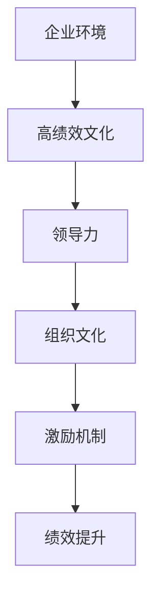

                 


### 文章标题
**打造高绩效文化：从mediocrity到excellence**

### 关键词
高绩效文化，mediocrity，excellence，领导力，组织文化，激励机制

### 摘要
本文将深入探讨高绩效文化的概念、理论基础、核心要素及其与企业竞争力的关系。通过分析成功与失败的案例，本文将提供实用的策略和实践方法，帮助企业和组织实现从普通到卓越的转型。

---

### 目录大纲

**第一部分：背景与核心概念**

## 第1章 引言：从mediocrity到excellence的必要性
- **背景介绍**：
  - 当前企业面临的环境挑战
  - 高绩效文化的意义与重要性

## 第2章 核心概念与联系
- **核心概念**：
  - 高绩效文化的定义
  - mediocrity和excellence的区别
- **联系架构 Mermaid 流程图**：
  ```mermaid
  graph TD
  A[企业环境] --> B[高绩效文化]
  B --> C[领导力]
  C --> D[组织文化]
  D --> E[激励机制]
  E --> F[绩效提升]
  ```

## 第3章 高绩效文化的基础理论
- **核心算法原理讲解**：
  - 伪代码：
    ```python
    define_high_performance_culture(vision, values, performance):
        culture = {
            "vision": vision,
            "values": values,
            "performance": performance
        }
        return culture
    ```

- **数学模型和公式**：
  - $$ \text{绩效} = \text{能力} \times \text{努力} \times \text{环境因素} $$

### 第二部分：高绩效文化的实践策略

## 第4章 建立高绩效文化的步骤
- **实践策略**：
  - 明确企业愿景与目标
  - 设计符合高绩效文化的组织架构
  - 制定激励机制与评估体系

## 第5章 领导力在高绩效文化中的关键角色
- **领导力提升策略**：
  - 领导者的素质要求
  - 领导力的提升策略
  - 领导者如何推动高绩效文化

## 第6章 员工激励与培养策略
- **员工激励理论应用**：
  - 激励机制的详细设计
  - 员工培养策略

## 第7章 团队协作与高绩效文化
- **团队协作机制**：
  - 高效团队协作的要素
  - 如何建立和维持团队协作

### 第三部分：成功实施高绩效文化的案例研究

## 第8章 案例分析：成功与失败
- **成功案例**：
  - Google、苹果公司、三星电子等

- **失败案例**：
  - 通用电气、诺基亚、柯达等

## 第9章 总结与展望
- **总结**：
  - 高绩效文化的成功因素
  - 面向未来的高绩效文化趋势

- **展望**：
  - 中国企业如何打造高绩效文化

### 附录
- **附录 A**：高绩效文化常用工具与方法

---

**正文部分内容**：

## 第1章 引言：从mediocrity到excellence的必要性

### 背景介绍

在当今快速变化的市场环境中，企业面临着前所未有的挑战。全球化和技术的迅猛发展要求企业必须具备高度的适应能力和创新能力。在这样的背景下，mediocrity（普通）的企业很难维持竞争优势，而只有那些能够实现卓越（excellence）的企业才能在竞争中脱颖而出。

### 高绩效文化的意义与重要性

高绩效文化是一种通过明确愿景、核心价值观和高效激励机制来提升组织整体绩效的文化。它不仅仅是一种理念，更是一种实践策略，能够帮助企业在激烈的竞争中保持持续的优势。

- **高绩效文化的定义**：高绩效文化是一种以高绩效为核心价值观的组织文化，强调个人与组织的共同成长，通过激励和培养，实现组织的长期目标和愿景。

- **mediocrity和excellence的区别**：mediocrity（普通）通常指的是企业满足基本要求，缺乏创新和突破；而excellence（卓越）则意味着企业追求卓越，不断突破自我，追求卓越的绩效和成果。

## 第2章 核心概念与联系

### 核心概念

- **高绩效文化的定义**：高绩效文化是一种通过明确愿景、核心价值观和高效激励机制来提升组织整体绩效的文化。

- **mediocrity和excellence的区别**：mediocrity（普通）通常指的是企业满足基本要求，缺乏创新和突破；而excellence（卓越）则意味着企业追求卓越，不断突破自我，追求卓越的绩效和成果。

### 联系架构 Mermaid 流程图



### 第3章 高绩效文化的基础理论

#### 核心算法原理讲解

- **伪代码**：

  ```python
  define_high_performance_culture(vision, values, performance):
      culture = {
          "vision": vision,
          "values": values,
          "performance": performance
      }
      return culture
  ```

#### 数学模型和公式

- **绩效公式**：

  $$ \text{绩效} = \text{能力} \times \text{努力} \times \text{环境因素} $$

### 第二部分：高绩效文化的实践策略

#### 第4章 建立高绩效文化的步骤

##### 实践策略

- **明确企业愿景与目标**：明确企业愿景和目标，使全体员工共同朝着同一个方向努力。

- **设计符合高绩效文化的组织架构**：设计灵活、高效的组织架构，确保各部门之间的协作和沟通。

- **制定激励机制与评估体系**：建立公正、透明的激励机制和评估体系，激发员工的积极性和创造力。

### 第5章 领导力在高绩效文化中的关键角色

##### 领导力提升策略

- **领导者的素质要求**：领导者需要具备愿景、决策力、沟通能力和团队合作精神。

- **领导力的提升策略**：通过培训、实践和反思，不断提升领导者的素质和能力。

- **领导者如何推动高绩效文化**：领导者需要通过身教和言传，引导员工树立正确的价值观，推动高绩效文化的落地。

### 第6章 员工激励与培养策略

##### 员工激励理论应用

- **激励机制的详细设计**：根据员工的需求和行为特点，设计具有针对性、长期性的激励机制。

- **员工培养策略**：提供多样化的培训和发展机会，帮助员工提升能力和素质。

### 第7章 团队协作与高绩效文化

##### 团队协作机制

- **高效团队协作的要素**：建立信任、明确目标、分工合作、沟通顺畅等。

- **如何建立和维持团队协作**：通过团队建设活动、沟通工具和流程优化，建立和维持高效的团队协作。

### 第三部分：成功实施高绩效文化的案例研究

#### 第8章 案例分析：成功与失败

##### 成功案例

- **Google**：通过明确愿景、强大的领导力和创新的激励机制，建立了独特的高绩效文化。

- **苹果公司**：以卓越的产品设计和创新能力，在全球市场上取得了巨大的成功。

- **三星电子**：通过持续的技术创新和市场拓展，成为全球领先的电子制造商。

##### 失败案例

- **通用电气**：由于领导层的失误和企业文化的衰退，导致业绩下滑和股价下跌。

- **诺基亚**：未能及时适应市场变化，最终被竞争对手挤出市场。

- **柯达**：在数字摄影技术崛起时未能及时转型，最终走向破产。

### 第9章 总结与展望

##### 总结

- 高绩效文化的成功因素：明确愿景、强大的领导力、激励机制和持续改进。

- 面向未来的高绩效文化趋势：数字化、全球化、个性化。

##### 展望

- **中国企业如何打造高绩效文化**：通过学习国际先进经验，结合自身实际情况，探索适合自己的高绩效文化之路。

### 附录

#### 附录 A：高绩效文化常用工具与方法

- **价值观构建工作坊**：通过团队讨论和共创，明确组织的核心价值观。

- **激励机制设计指南**：结合员工需求和业绩指标，设计有效的激励机制。

- **团队协作培训手册**：提供团队协作技巧和工具，提升团队协作效率。

- **高绩效文化评估工具**：通过定量和定性评估，评估高绩效文化的实施效果。

---

**全文结束。作者：AI天才研究院/AI Genius Institute & 禅与计算机程序设计艺术 /Zen And The Art of Computer Programming**。

### 文章标题
**打造高绩效文化：从mediocrity到excellence**

### 关键词
高绩效文化，mediocrity，excellence，领导力，组织文化，激励机制

### 摘要
本文将深入探讨高绩效文化的概念、理论基础、核心要素及其与企业竞争力的关系。通过分析成功与失败的案例，本文将提供实用的策略和实践方法，帮助企业和组织实现从普通到卓越的转型。

---

### 目录大纲

**第一部分：背景与核心概念**

## 第1章 引言：从mediocrity到excellence的必要性
- **背景介绍**：
  - 当前企业面临的环境挑战
  - 高绩效文化的意义与重要性

## 第2章 核心概念与联系
- **核心概念**：
  - 高绩效文化的定义
  - mediocrity和excellence的区别
- **联系架构 Mermaid 流程图**：
  ```mermaid
  graph TD
  A[企业环境] --> B[高绩效文化]
  B --> C[领导力]
  C --> D[组织文化]
  D --> E[激励机制]
  E --> F[绩效提升]
  ```

## 第3章 高绩效文化的基础理论
- **核心算法原理讲解**：
  - 伪代码：
    ```python
    define_high_performance_culture(vision, values, performance):
        culture = {
            "vision": vision,
            "values": values,
            "performance": performance
        }
        return culture
    ```

- **数学模型和公式**：
  - $$ \text{绩效} = \text{能力} \times \text{努力} \times \text{环境因素} $$

### 第二部分：高绩效文化的实践策略

## 第4章 建立高绩效文化的步骤
- **实践策略**：
  - 明确企业愿景与目标
  - 设计符合高绩效文化的组织架构
  - 制定激励机制与评估体系

## 第5章 领导力在高绩效文化中的关键角色
- **领导力提升策略**：
  - 领导者的素质要求
  - 领导力的提升策略
  - 领导者如何推动高绩效文化

## 第6章 员工激励与培养策略
- **员工激励理论应用**：
  - 激励机制的详细设计
  - 员工培养策略

## 第7章 团队协作与高绩效文化
- **团队协作机制**：
  - 高效团队协作的要素
  - 如何建立和维持团队协作

### 第三部分：成功实施高绩效文化的案例研究

## 第8章 案例分析：成功与失败
- **成功案例**：
  - Google、苹果公司、三星电子等

- **失败案例**：
  - 通用电气、诺基亚、柯达等

## 第9章 总结与展望
- **总结**：
  - 高绩效文化的成功因素
  - 面向未来的高绩效文化趋势

- **展望**：
  - 中国企业如何打造高绩效文化

### 附录
- **附录 A**：高绩效文化常用工具与方法

---

**正文部分内容**：

## 第1章 引言：从mediocrity到excellence的必要性

### 背景介绍

在当今快速变化的市场环境中，企业面临着前所未有的挑战。全球化和技术的迅猛发展要求企业必须具备高度的适应能力和创新能力。在这样的背景下，mediocrity（普通）的企业很难维持竞争优势，而只有那些能够实现卓越（excellence）的企业才能在竞争中脱颖而出。

### 高绩效文化的意义与重要性

高绩效文化是一种通过明确愿景、核心价值观和高效激励机制来提升组织整体绩效的文化。它不仅仅是一种理念，更是一种实践策略，能够帮助企业在激烈的竞争中保持持续的优势。

- **高绩效文化的定义**：高绩效文化是一种以高绩效为核心价值观的组织文化，强调个人与组织的共同成长，通过激励和培养，实现组织的长期目标和愿景。

- **mediocrity和excellence的区别**：mediocrity（普通）通常指的是企业满足基本要求，缺乏创新和突破；而excellence（卓越）则意味着企业追求卓越，不断突破自我，追求卓越的绩效和成果。

## 第2章 核心概念与联系

### 核心概念

- **高绩效文化的定义**：高绩效文化是一种以高绩效为核心价值观的组织文化，强调个人与组织的共同成长，通过激励和培养，实现组织的长期目标和愿景。

- **mediocrity和excellence的区别**：mediocrity（普通）通常指的是企业满足基本要求，缺乏创新和突破；而excellence（卓越）则意味着企业追求卓越，不断突破自我，追求卓越的绩效和成果。

### 联系架构 Mermaid 流程图


### 第3章 高绩效文化的基础理论

#### 核心算法原理讲解

- **伪代码**：

  ```python
  define_high_performance_culture(vision, values, performance):
      culture = {
          "vision": vision,
          "values": values,
          "performance": performance
      }
      return culture
  ```

#### 数学模型和公式

- **绩效公式**：

  $$ \text{绩效} = \text{能力} \times \text{努力} \times \text{环境因素} $$

### 第二部分：高绩效文化的实践策略

#### 第4章 建立高绩效文化的步骤

##### 实践策略

- **明确企业愿景与目标**：明确企业愿景和目标，使全体员工共同朝着同一个方向努力。

- **设计符合高绩效文化的组织架构**：设计灵活、高效的组织架构，确保各部门之间的协作和沟通。

- **制定激励机制与评估体系**：建立公正、透明的激励机制和评估体系，激发员工的积极性和创造力。

#### 第5章 领导力在高绩效文化中的关键角色

##### 领导力提升策略

- **领导者的素质要求**：领导者需要具备愿景、决策力、沟通能力和团队合作精神。

- **领导力的提升策略**：通过培训、实践和反思，不断提升领导者的素质和能力。

- **领导者如何推动高绩效文化**：领导者需要通过身教和言传，引导员工树立正确的价值观，推动高绩效文化的落地。

#### 第6章 员工激励与培养策略

##### 员工激励理论应用

- **激励机制的详细设计**：根据员工的需求和行为特点，设计具有针对性、长期性的激励机制。

- **员工培养策略**：提供多样化的培训和发展机会，帮助员工提升能力和素质。

#### 第7章 团队协作与高绩效文化

##### 团队协作机制

- **高效团队协作的要素**：建立信任、明确目标、分工合作、沟通顺畅等。

- **如何建立和维持团队协作**：通过团队建设活动、沟通工具和流程优化，建立和维持高效的团队协作。

### 第三部分：成功实施高绩效文化的案例研究

#### 第8章 案例分析：成功与失败

##### 成功案例

- **Google**：通过明确愿景、强大的领导力和创新的激励机制，建立了独特的高绩效文化。

- **苹果公司**：以卓越的产品设计和创新能力，在全球市场上取得了巨大的成功。

- **三星电子**：通过持续的技术创新和市场拓展，成为全球领先的电子制造商。

##### 失败案例

- **通用电气**：由于领导层的失误和企业文化的衰退，导致业绩下滑和股价下跌。

- **诺基亚**：未能及时适应市场变化，最终被竞争对手挤出市场。

- **柯达**：在数字摄影技术崛起时未能及时转型，最终走向破产。

### 第9章 总结与展望

##### 总结

- 高绩效文化的成功因素：明确愿景、强大的领导力、激励机制和持续改进。

- 面向未来的高绩效文化趋势：数字化、全球化、个性化。

##### 展望

- **中国企业如何打造高绩效文化**：通过学习国际先进经验，结合自身实际情况，探索适合自己的高绩效文化之路。

### 附录

#### 附录 A：高绩效文化常用工具与方法

- **价值观构建工作坊**：通过团队讨论和共创，明确组织的核心价值观。

- **激励机制设计指南**：结合员工需求和业绩指标，设计有效的激励机制。

- **团队协作培训手册**：提供团队协作技巧和工具，提升团队协作效率。

- **高绩效文化评估工具**：通过定量和定性评估，评估高绩效文化的实施效果。

---

**全文结束。作者：AI天才研究院/AI Genius Institute & 禅与计算机程序设计艺术 /Zen And The Art of Computer Programming**。

