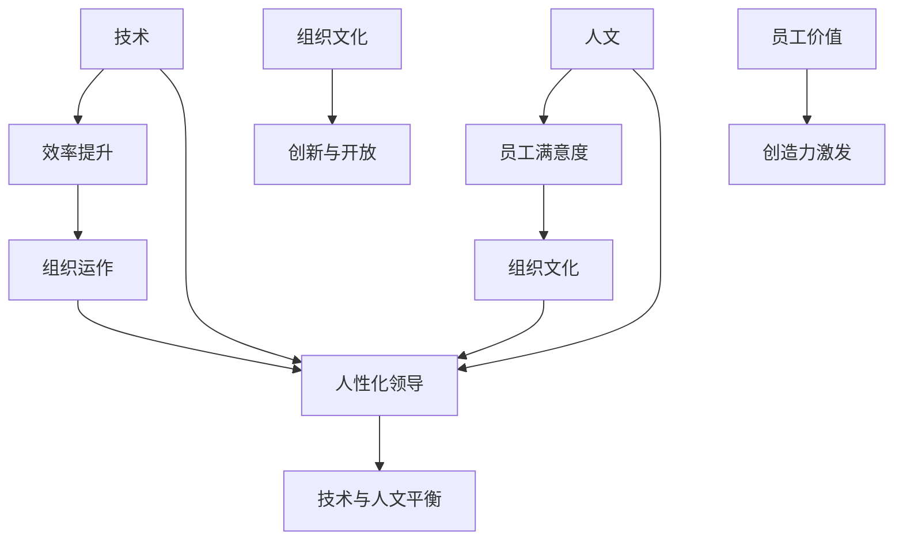

                 

### 1.2 核心概念与联系

在探讨技术与人文的平衡之前，我们首先需要明确几个核心概念，并分析它们之间的关系。

**技术**：技术是指应用科学知识解决实际问题的手段和方法。在数字化时代，技术主要包括信息技术、人工智能、大数据、物联网等。技术的进步不仅改变了我们的生活方式，也在很大程度上影响了组织的管理模式和员工的工作方式。

**人文**：人文则是指人类文化、价值观、情感、道德等方面的内容。它强调人的精神世界和人际关系的和谐。在组织管理中，人文注重员工的情感需求、工作满意度以及组织文化的建设。

**人性化领导**：人性化领导是一种将技术与人文相结合的领导方式，它不仅关注组织的目标和效率，更重视员工的心理需求和幸福感。人性化领导强调以人为中心，尊重员工的个性和多样性，通过建立良好的组织氛围，激发员工的潜能和创造力。

**核心概念之间的关系**：

- **技术与人文的平衡**：技术与人文的平衡是指在一个组织中，技术工具的运用与人文关怀相辅相成，相互促进。技术的有效运用可以提升工作效率，而人文关怀则能增强员工的归属感和工作满意度。

- **人性化领导与技术与人文的平衡**：人性化领导是实现技术与人文平衡的关键。它要求领导者既要有扎实的专业知识，又要有对员工的深刻理解，能够在技术应用和人文关怀之间找到最佳的结合点。

- **组织文化**：组织文化是技术与人文平衡的重要保障。一个健康的组织文化能够鼓励创新和开放，同时注重员工的个人价值和职业发展。

**Mermaid 流程图**：

为了更直观地展示核心概念之间的关系，我们可以使用 Mermaid 语法绘制一个流程图：

在这个流程图中，技术通过提升效率直接影响组织运作，而人文关怀则通过提高员工满意度促进组织文化的建设。人性化领导作为桥梁，将技术与人文有机结合，推动组织向更加健康和可持续的方向发展。

通过理解这些核心概念和它们之间的关系，我们可以为后续章节的深入探讨奠定基础。在接下来的章节中，我们将进一步分析数字化时代的特点，探讨人性化领导的核心原则和实践方法，并通过具体案例展示如何在组织管理中实现技术与人文的平衡。这些内容将为读者提供更全面的指导，帮助他们在数字化时代的领导岗位上取得成功。### 2.1 数字化时代的特点

数字化时代是一个技术驱动、数据为核心、变革频繁的时代。以下是一些数字化时代的主要特点：

**1. 技术应用深度广泛**：信息技术、人工智能、大数据、物联网等技术在各行各业中得到广泛应用，极大地提升了工作效率和生产力。例如，通过人工智能技术，企业可以实现自动化生产、智能客服，从而降低成本、提高服务质量。

**2. 数据驱动决策**：数据成为企业决策的重要依据。大数据分析可以帮助企业洞察市场趋势、消费者行为，从而制定更加精准的营销策略和产品开发计划。通过数据驱动的决策，企业可以更加灵活地应对市场变化。

**3. 变革速度加快**：数字化技术的快速发展使得组织需要不断适应新的技术变化，这要求领导者具备快速学习、灵活调整的能力。例如，云计算、区块链等新技术的出现，要求企业重新审视其业务模式和组织架构。

**4. 灵活性与创新性增强**：数字化时代鼓励灵活办公、远程协作，使得组织能够更快速地响应市场变化。同时，技术的广泛应用也激发了员工的创新潜能，推动了组织的创新和发展。

**5. 人才竞争加剧**：数字化时代对人才的需求更加多样化和专业化。企业需要吸引和培养具备技术能力和创新思维的人才，以保持竞争优势。人才竞争的加剧也对领导者的招聘、培训和激励机制提出了更高的要求。

**6. 风险管理挑战加大**：数字化时代的数据安全、隐私保护等问题日益突出，组织需要建立完善的风险管理机制，以应对潜在的安全威胁。

**7. 消费者需求多样化**：数字化时代消费者需求更加个性化和多元化，企业需要通过数据分析、个性化推荐等技术手段，提供更加精准的服务和产品。

这些特点对领导力提出了新的挑战：

**1. 对领导者技术能力的需求增加**：领导者不仅需要具备丰富的管理经验，还需要具备一定的技术背景，能够理解并运用新技术，推动组织的数字化转型。

**2. 对领导者应变能力的要求提高**：数字化时代的快速变革要求领导者具备快速学习和适应的能力，能够及时调整策略，应对市场变化。

**3. 对领导者人文关怀的重视增加**：数字化时代虽然技术蓬勃发展，但同时也带来了工作压力、心理健康等问题。领导者需要关注员工的情感需求，提供人文关怀，以增强员工的幸福感和归属感。

**4. 对领导力多样性的要求**：数字化时代要求领导者具备多元化的领导能力，能够处理复杂多变的管理问题，同时注重团队协作和创新。

总之，数字化时代对领导力提出了更高的要求，领导者需要在技术能力和人文关怀之间找到平衡，以适应不断变化的环境，并推动组织的可持续发展。在接下来的章节中，我们将深入探讨人性化领导的核心原则，以期为数字化时代的领导者提供有效的指导。### 3. 数字时代领导力的挑战

在数字时代，领导力面临着前所未有的挑战，这些挑战既来自技术层面的变革，也源于组织内部和社会环境的复杂变化。

**1. 技术变革的挑战**：

- **技术迭代速度快**：技术的快速发展使得传统领导者的知识和技术能力难以跟上时代步伐。领导者需要不断学习新知识、掌握新技术，以保持竞争力。
- **数据依赖性增强**：在数据驱动的时代，领导者需要依赖数据分析来做出决策。然而，数据分析的能力和准确性要求领导者具备较高的数据分析素养和判断力。
- **数字化转型的压力**：许多企业面临着数字化转型的压力，需要调整业务模式、组织架构，以适应数字化时代的要求。这要求领导者具备变革思维，能够推动组织向数字化方向转型。

**2. 组织内部的挑战**：

- **团队协作的新要求**：数字化时代强调远程协作和跨部门合作，领导者需要培养员工的跨职能合作能力，构建高效协作的团队。
- **人才管理的复杂性**：数字化时代对人才的需求更加多样化和专业化，领导者需要具备吸引、培养和留住人才的能力。
- **员工心理健康问题**：数字化时代的工作压力和心理健康问题日益突出，领导者需要关注员工的情感需求，提供心理支持，以增强员工的幸福感和归属感。

**3. 社会环境的变化**：

- **全球化竞争**：全球化使得企业面临更加激烈的国际竞争，领导者需要具备全球视野，能够应对国际市场的挑战。
- **社会价值观的多元化**：数字化时代的社会价值观更加多元化，领导者需要尊重员工的个性和多样性，构建包容性组织文化。
- **法律法规的复杂性**：数字化时代带来了新的法律法规挑战，如数据保护、隐私保护等，领导者需要了解并遵守相关法律法规，确保企业运营合法合规。

**4. 人性化领导的重要性**：

- **员工满意度**：人性化领导强调关注员工的情感需求，提供人文关怀，有助于提高员工的满意度，减少员工流失。
- **团队凝聚力**：人性化领导能够增强团队成员之间的信任和合作，提高团队凝聚力，推动团队目标的实现。
- **创新与创造力**：人性化领导鼓励员工发挥个人创造力和创新精神，有助于推动组织的创新和发展。
- **组织文化**：人性化领导有助于构建积极向上的组织文化，提升组织的整体氛围和形象。

总之，数字时代对领导力提出了更高的要求。领导者不仅需要具备技术能力和创新思维，还需要关注员工的情感需求，提供人性化领导。只有这样，领导者才能在数字时代中保持竞争力，推动组织的可持续发展。在接下来的章节中，我们将深入探讨人性化领导的核心原则和实践方法，帮助领导者应对数字时代的挑战。### 4. 人性化领导原则

人性化领导是一种以人为中心、注重员工情感和心理需求的领导方式。在数字时代，人性化领导尤为重要，因为它能够帮助组织应对快速变化的环境，提高员工满意度和团队凝聚力。以下是人性化领导的核心原则和理论，以及这些原则在实际工作中的应用场景。

#### 4.1 人性化领导的基础理论

**1. 人本主义管理理论**：

人本主义管理理论强调员工的自我实现和成长，认为员工是组织最宝贵的资源。人本主义管理理论的核心观点包括：

- **员工中心论**：将员工视为组织发展的核心，尊重员工的个性和需求，鼓励员工积极参与决策过程。
- **自主管理**：鼓励员工自主管理，提高员工的自我管理和自我控制能力，促进员工的成长和发展。
- **团队协作**：强调团队合作，通过建立信任和协作关系，提高团队的凝聚力和工作效率。

**2. 双因素理论**：

双因素理论，又称激励-保健理论，由赫茨伯格提出。该理论认为，员工的工作满意度受到两种因素的影响：激励因素和保健因素。

- **激励因素**：与工作内容相关，如成就、认可、工作本身的意义等。激励因素能够激发员工的工作积极性和创造力。
- **保健因素**：与工作环境相关，如薪酬、工作条件、人际关系等。保健因素能够预防员工的不满，但并不能直接提高员工的工作满意度。

**3. 心理契约理论**：

心理契约理论认为，员工和雇主之间存在一种非正式的、隐含的契约关系。这种关系不仅包括薪酬和福利等显性契约，还包括信任、尊重、支持等隐性契约。

- **信任**：建立信任关系是人性化领导的基础。领导者需要信任员工，给予员工足够的自主权和信任空间，以激发员工的积极性和创造力。
- **尊重**：尊重员工的人格和价值观，关心员工的成长和发展，提高员工的归属感和满意度。
- **支持**：为员工提供必要的资源和支持，帮助员工克服工作中的困难和挑战，提高员工的工作效率和成就感。

#### 4.2 人性化领导的核心原则

**1. 以人为本**：

以人为本是人性化领导的核心原则。领导者需要将员工的利益放在首位，关心员工的生活和工作，为员工提供良好的工作环境和职业发展机会。

**2. 尊重个体**：

尊重个体是指领导者要尊重员工的个性和差异，鼓励员工发挥自己的优势，实现个人价值。

**3. 激励创新**：

激励创新是指领导者要激发员工的创新意识，鼓励员工尝试新思路、新方法，推动组织的创新和发展。

**4. 信任与合作**：

信任与合作是指领导者要建立信任关系，鼓励团队合作，通过有效的沟通和协作，提高团队的凝聚力和工作效率。

**5. 环境友好**：

环境友好是指领导者要关注员工的心理健康和工作压力，提供良好的工作环境和心理支持，促进员工的身心健康。

#### 4.3 人性化领导的应用场景

**1. 企业内部沟通**：

在企业内部沟通中，人性化领导要求领导者重视员工的反馈和建议，建立开放和透明的沟通渠道，鼓励员工积极参与决策和讨论。

**2. 项目管理**：

在项目管理中，人性化领导要求领导者关注团队成员的需求和情感，提供必要的支持和资源，促进项目的顺利进行。

**3. 团队建设**：

在团队建设中，人性化领导要求领导者营造积极的团队氛围，建立信任和合作关系，激发团队成员的创造力和创新能力。

**4. 人才培养**：

在人才培养中，人性化领导要求领导者关注员工的成长和发展，提供培训和学习机会，帮助员工提升技能和职业素养。

**5. 员工关怀**：

在员工关怀中，人性化领导要求领导者关心员工的生活和心理状况，提供心理支持和帮助，增强员工的幸福感和归属感。

总之，人性化领导是一种以人为中心的领导方式，它强调尊重员工的个性和需求，激发员工的积极性和创造力，促进组织的可持续发展。在数字时代，领导者需要具备人性化领导的意识和能力，以应对快速变化的环境，推动组织的成功。在接下来的章节中，我们将通过技术工具的运用，进一步探讨如何在实践中实现人性化领导。### 5. 技术工具在人性化领导中的应用

在现代组织管理中，技术工具的应用已成为提高效率、促进协作和创新的重要手段。然而，技术工具的运用不仅要遵循科学原理，还需遵循人性化领导的原则，以确保技术的应用能够真正为员工和组织的可持续发展带来价值。以下将探讨技术工具的选择、运用原则以及具体应用案例。

#### 5.1 技术工具的选择

选择合适的技术工具是实现人性化领导的关键步骤。以下是一些关键因素：

**1. 功能性**：技术工具需要具备满足实际工作需求的功能，如项目管理工具、协作平台、学习管理系统等。

**2. 易用性**：技术工具应易于使用，以便员工能够快速上手，减少学习成本和培训时间。

**3. 兼容性**：技术工具应具备良好的兼容性，能够与现有的系统和服务无缝集成。

**4. 可定制性**：技术工具应具备较高的可定制性，以适应不同组织和团队的具体需求。

**5. 安全性**：技术工具必须保证数据的安全性和隐私保护，以防止数据泄露和滥用。

**6. 支持与维护**：技术工具应提供良好的技术支持和维护服务，确保工具的稳定运行和持续更新。

**案例**：在选择协作平台时，可以考虑钉钉、Slack、微软Teams等。这些平台都具有强大的功能，如即时通讯、文件共享、项目管理、日历同步等，同时具备良好的易用性和兼容性。

#### 5.2 技术工具的运用原则

在技术工具的应用过程中，以下原则至关重要：

**1. 以人为本**：技术工具的应用应围绕提升员工的工作效率和满意度，而非单纯追求技术上的创新和先进。

**2. 平衡效率与人文关怀**：技术工具的应用应在提高工作效率的同时，注重员工的情感和心理需求，避免因过度依赖技术而忽视员工的实际感受。

**3. 尊重员工的个性化需求**：技术工具的应用应尊重员工的个性化需求，提供灵活的设置和功能，以满足不同员工的工作习惯和偏好。

**4. 促进协作与创新**：技术工具的应用应鼓励员工之间的协作，促进知识共享和创新，提升组织的整体竞争力。

**5. 简化而非复杂化**：技术工具的应用应简化工作流程，避免增加不必要的复杂性，以降低员工的压力和负担。

#### 5.3 技术工具的具体应用案例

以下是一些实际应用案例，展示技术工具在人性化领导中的具体运用：

**1. 项目管理工具**：

使用项目管理工具（如Jira、Trello）可以帮助团队成员更好地协同工作。项目经理可以通过这些工具创建任务、分配任务、跟踪进度，确保项目按时完成。同时，这些工具还提供了丰富的报告和分析功能，帮助团队了解项目的整体进展和潜在问题。

**2. 协作平台**：

协作平台（如Slack、钉钉）为团队提供了一个集中的沟通和协作空间。团队成员可以在这里讨论项目进展、分享文件、发起讨论，甚至进行视频会议。这种高效的沟通方式不仅提高了工作效率，还增强了团队成员之间的信任和协作。

**3. 学习管理系统**：

学习管理系统（如Sakai、Canvas）可以帮助组织提供在线培训和知识分享。员工可以通过这些平台学习新技能、参加培训课程，并通过在线测试验证学习效果。这种自主学习的模式不仅提高了员工的能力，还增强了组织的知识积累。

**4. 心理健康支持工具**：

随着工作压力的增加，心理健康支持工具（如Headspace、Talkspace）越来越受到重视。这些工具提供了一系列心理健康的资源和咨询服务，帮助员工应对压力、提升心理健康水平。领导者可以鼓励员工使用这些工具，以提高员工的幸福感和工作效率。

**5. 智能员工助手**：

智能员工助手（如RPA机器人、虚拟助手）可以自动化一些重复性和规则性的工作，如数据录入、报告生成等。这些工具不仅提高了工作效率，还减少了员工的重复劳动，使得员工能够将更多的时间和精力投入到更有价值的工作中。

通过上述案例可以看出，技术工具在人性化领导中的应用不仅提高了工作效率，还增强了员工的满意度和团队凝聚力。在数字时代，领导者需要善于利用技术工具，结合人性化领导的原则，实现技术与人文的有机结合，推动组织的可持续发展。### 6. 实战案例分析

在数字时代，人性化领导不仅是一种理念，更需要在实际工作中得到有效应用。以下我们将通过三个具体案例，展示人性化领导在数字化环境中的成功实践，并提供项目小结和最佳实践建议。

#### 6.1 案例一：企业内部沟通

**背景**：某大型企业在数字化转型的过程中，发现内部沟通不畅严重影响了项目进展和员工满意度。团队成员经常因为信息传递不及时、沟通渠道不统一而出现误解和矛盾。

**解决方案**：

1. **引入协作平台**：企业引入了Slack作为内部沟通工具，将各个项目团队集中到一个平台上。Slack提供了即时消息、文件共享、讨论组等功能，使得团队成员能够随时随地进行沟通。

2. **建立透明沟通机制**：通过Slack，企业建立了透明的沟通机制，项目进展和重要决策都会在平台上公布，确保所有团队成员都能及时了解情况。

3. **定期的团队反馈**：企业每月举行团队反馈会议，鼓励员工提出意见和建议，通过Slack收集并整理这些反馈，反馈给管理层，以便进行改进。

**成效**：通过协作平台的应用，企业内部沟通效率显著提高，团队成员之间的误解减少，项目进展更加顺利。员工的参与感和满意度也得到了提升。

**项目小结**：

- **协作平台**的有效使用可以显著提高内部沟通效率。
- **透明沟通机制**有助于增强团队成员的信任感和参与感。
- **定期的团队反馈**可以帮助企业及时发现问题并进行改进。

**最佳实践建议**：

- 选择适合企业需求的协作平台，确保其功能丰富且易于使用。
- 建立明确的沟通规范，确保信息传递的及时性和准确性。
- 定期收集员工反馈，鼓励开放性和建设性的沟通。

#### 6.2 案例二：项目管理

**背景**：某科技公司在一个大型软件开发项目中遇到了进度滞后和质量问题。团队内部沟通不畅、任务分配不明确，导致项目进展缓慢。

**解决方案**：

1. **引入项目管理工具**：公司引入了Jira进行项目管理。Jira可以帮助团队创建任务、跟踪进度、分配责任，并通过仪表板实时监控项目状态。

2. **制定详细的项目计划**：项目经理使用Jira制定了详细的项目计划，包括任务分解、时间节点和责任人，确保每个成员都知道自己的任务和职责。

3. **定期项目会议**：项目经理每周召开项目会议，评估项目进度，讨论问题解决方案，并调整计划。

**成效**：通过Jira的使用，项目进度得到有效跟踪和管理，任务分配更加明确，团队成员的工作效率和质量显著提升。

**项目小结**：

- **项目管理工具**可以提高项目的透明度和可控性。
- **详细的计划和责任分配**有助于确保项目按时完成。
- **定期的项目会议**有助于及时发现和解决问题。

**最佳实践建议**：

- 选择功能强大且易于使用的项目管理工具。
- 制定详细的项目计划和任务分配，确保每个成员明确自己的职责。
- 定期召开项目会议，确保项目进度可控。

#### 6.3 案例三：团队建设

**背景**：某互联网公司在快速发展的过程中，面临着团队凝聚力不足、员工流失率高的挑战。

**解决方案**：

1. **组织团队活动**：公司定期组织团队建设活动，如团队拓展训练、团队聚餐、主题晚会等，增强团队成员之间的交流和合作。

2. **设立员工关怀机制**：公司设立了员工关怀机制，为员工提供心理咨询服务、健康体检、员工福利等，关注员工的身心健康。

3. **提供职业发展机会**：公司为员工提供丰富的职业发展机会，包括培训、晋升通道、内部轮岗等，激发员工的职业发展动力。

**成效**：通过一系列团队建设措施，公司的团队凝聚力显著提升，员工流失率降低，员工的幸福感和满意度显著提高。

**项目小结**：

- **团队活动**有助于增强团队凝聚力和员工归属感。
- **员工关怀机制**关注员工的实际需求，提高员工的幸福感和满意度。
- **职业发展机会**激发员工的积极性和创造力。

**最佳实践建议**：

- 定期组织团队活动，促进团队成员之间的交流和合作。
- 建立员工关怀机制，关注员工的身心健康和职业发展。
- 提供多样化的职业发展机会，激发员工的潜力和动力。

通过以上三个案例，我们可以看到人性化领导在数字化环境中的成功实践。在技术应用的同时，领导者需要注重员工的情感需求，通过有效的沟通、管理和关怀，提升团队的凝聚力和工作效率，实现组织的可持续发展。### 7. 未来展望

在数字时代，技术与人文的平衡已经成为组织管理的关键。展望未来，技术与人文的平衡将继续成为领导者关注的重点，同时也将带来一系列新的趋势和挑战。

**1. 技术与人文融合的深化**：

随着人工智能、大数据、物联网等技术的不断进步，它们将在更多领域与人文相结合。例如，智能客服系统将更加理解和满足用户需求，而数据分析将更加关注人类情感和行为模式。这种融合将进一步提升组织的工作效率，同时提高员工的幸福感和满意度。

**2. 领导力的多元化**：

未来的领导者不仅需要具备扎实的技术背景，还需要深入了解人文和社会科学，能够处理复杂的跨文化管理问题。领导力将更加多元化，包括技术领导力、情感领导力、变革领导力等，以适应不断变化的环境。

**3. 人性化技术的应用**：

未来的人性化技术将更加智能和个性化，能够更好地理解和满足员工的需求。例如，智能健康管理系统将能够实时监测员工的健康状况，提供个性化的健康建议；虚拟现实和增强现实技术将为员工提供沉浸式的学习体验。

**4. 社会责任与可持续发展**：

随着社会对环境保护和可持续发展的关注日益增加，未来的组织将更加注重社会责任。领导者需要平衡技术进步与社会责任，推动组织在追求经济效益的同时，关注环境保护和社会福祉。

**5. 新型工作模式**：

未来，远程工作、灵活工作制等新型工作模式将更加普及。领导者需要适应这些变化，建立适应新型工作模式的管理机制，确保员工的沟通协作和团队凝聚力。

**6. 法律法规的完善**：

随着数字化技术的发展，相关的法律法规也将不断完善。领导者需要了解并遵守这些法律法规，确保组织的合法运营和数据安全。

**7. 持续学习与创新**：

未来的领导者需要具备持续学习的能力，不断更新知识和技能，以适应快速变化的环境。同时，创新将成为组织持续发展的重要动力，领导者需要鼓励员工创新，推动组织不断突破。

总之，技术与人文的平衡在数字时代的重要性将日益凸显。未来的领导者需要具备全面的领导能力，能够在技术与人文之间找到最佳平衡点，推动组织的可持续发展。通过持续的学习和创新，领导者将能够应对未来挑战，引领组织走向成功。### 附录A：相关资源与参考文献

为了进一步深入理解本文讨论的主题，以下是关于技术与人文平衡、数字化时代领导力以及人性化领导的相关资源与参考文献：

1. **书籍**：
   - 《人类简史：从动物到上帝》[尤瓦尔·赫拉利（Yuval Noah Harari）著]，中信出版社，2012年。
   - 《人工智能：一种现代的方法》[Stuart J. Russell 和 Peter Norvig 著]，机械工业出版社，2012年。
   - 《管理的实践》[彼得·德鲁克（Peter F. Drucker）著]，机械工业出版社，2006年。

2. **论文与报告**：
   - “The Future of Humanity: Terraforming Mars, Interstellar Travel, and Our Destiny Beyond Earth”[Max Tegmark 著]，arXiv:1806.03549，2017年。
   - “Digital Transformation: The People Side of Change”[IBM Corporation 著]，2018年。
   - “The Rise of Human-Centered AI”[Microsoft Research 著]，2019年。

3. **在线资源**：
   - 《数字化时代领导力》（Digital Age Leadership）课程，edX平台。
   - 《人性化管理》（Human-Centered Management）课程，Coursera平台。
   - 《人工智能伦理》（Ethics of Artificial Intelligence）课程，Udacity平台。

4. **学术期刊**：
   - 《哈佛商业评论》（Harvard Business Review）。
   - 《管理科学季刊》（Management Science）。
   - 《计算机与人类行为》（Computers in Human Behavior）。

通过这些资源，读者可以进一步探索技术与人文平衡的理论与实践，掌握数字化时代领导力和人性化领导的关键原则，为自身的领导实践提供更加丰富的理论基础和实践指导。### 附录B：实用工具推荐

为了帮助读者在实际工作中更好地实现技术与人文的平衡，以下是几款推荐的工具，它们可以帮助提升团队协作效率、支持人性化领导。

**1. 协作平台**：

- **钉钉**：一款集即时通讯、日程管理、项目管理于一体的协作平台，适用于企业内部沟通和协作。
- **Slack**：提供丰富的第三方应用集成，支持文件共享、团队讨论、任务跟踪等，适合跨部门、跨地区的远程协作。
- **微软Teams**：与Office 365集成，支持视频会议、即时消息、文档协作等功能，适合大型企业使用。

**2. 项目管理工具**：

- **Jira**：功能强大的敏捷项目管理工具，适合软件开发团队使用，提供任务跟踪、进度监控、报告生成等功能。
- **Trello**：简单直观的看板式项目管理工具，适合小型项目和团队成员协作。
- **Asana**：提供任务分配、进度跟踪、时间管理等功能，适合多项目、多团队协同工作。

**3. 学习管理系统**：

- **Sakai**：开放源代码的学习管理系统，提供课程管理、学生互动、作业提交等功能，适用于在线教育和培训。
- **Canvas**：功能全面的在线学习平台，支持课程创建、内容管理、互动讨论等，适合教育机构和企业的培训需求。
- **Moodle**：开源的学习管理系统，支持多种学习活动和评估工具，适合创建灵活的在线学习环境。

**4. 心理健康支持工具**：

- **Headspace**：提供冥想和放松训练的应用程序，帮助用户管理压力和改善心理健康。
- **Talkspace**：在线心理咨询平台，提供隐私保护的心理咨询和心理健康支持服务。
- **BetterUp**：提供个人成长和心理支持的服务，帮助员工提升自我认知和应对压力的能力。

通过使用这些实用工具，领导者可以在日常工作中更好地实现技术与人文的平衡，提高团队的协作效率，增强员工的幸福感和满意度。### 总结与最佳实践

本文围绕《技术与人文的平衡：在数字时代保持人性化领导》这一主题，探讨了数字化时代领导力面临的挑战和人性化领导的核心原则。通过详细的分析和实际案例，我们展示了如何在实际工作中运用技术工具来实现技术与人文的有机结合。

**总结**：

- **数字化时代的领导挑战**：技术变革、数据依赖、组织内部复杂性和社会环境变化给领导力带来了新的挑战。
- **人性化领导原则**：以人为本、尊重个体、激励创新、信任与合作、环境友好等原则是实现人性化领导的基础。
- **技术工具的应用**：通过协作平台、项目管理工具、学习管理系统和心理健康支持工具等，可以提升工作效率和员工满意度。

**最佳实践**：

- **选择适合的工具**：根据企业需求和团队特点选择合适的协作平台和项目管理工具。
- **以人为本**：关注员工的情感需求，建立信任和开放的沟通机制，尊重员工的个性。
- **持续学习与创新**：鼓励员工学习和创新，提供职业发展机会，提升组织整体竞争力。

**注意事项**：

- **数据安全与隐私保护**：在技术应用中，确保数据安全与隐私保护，遵守相关法律法规。
- **平衡效率与人文关怀**：在追求效率的同时，注重员工的情感和心理需求，避免技术滥用。
- **团队反馈与改进**：定期收集团队反馈，及时解决问题，持续改进管理实践。

**拓展阅读**：

- 《人本主义管理》[道格拉斯·麦格雷戈（Douglas McGregor）著]，探索人本主义管理理论对数字化时代的启示。
- 《智能时代的管理》[丹尼尔·平克（Daniel H. Pink）著]，探讨人工智能时代的管理变革。
- 《数字化转型：如何实现技术与人文的融合》[詹姆斯·麦克雷恩（James Manyika）等著]，提供数字化转型的策略和实践指南。通过这些拓展阅读，读者可以进一步深入了解数字化时代的人性化领导。### 结语

本文旨在探讨如何在数字时代保持人性化领导，实现技术与人文的平衡。通过深入分析数字化时代的领导力挑战，我们提出了人性化领导的核心原则和实际应用案例。在技术应用的同时，领导者需要关注员工的情感需求，建立信任和开放的沟通机制，推动组织的可持续发展。

人性化领导不仅是一种理念，更需要在实际工作中得到有效应用。通过选择适合的技术工具、关注员工的个性和需求、激励创新，领导者可以提升团队协作效率和员工满意度，实现技术与人文的有机结合。

未来的领导者需要具备全面的领导能力，能够在技术与人文之间找到最佳平衡点。通过持续的学习和创新，领导者将能够应对未来挑战，引领组织走向成功。

让我们共同努力，在数字时代中保持人性化领导，为构建一个更加和谐、高效、有温度的组织贡献力量。感谢您的阅读，希望本文对您的领导实践有所启发。作者：AI天才研究院/AI Genius Institute & 禅与计算机程序设计艺术 /Zen And The Art of Computer Programming。

