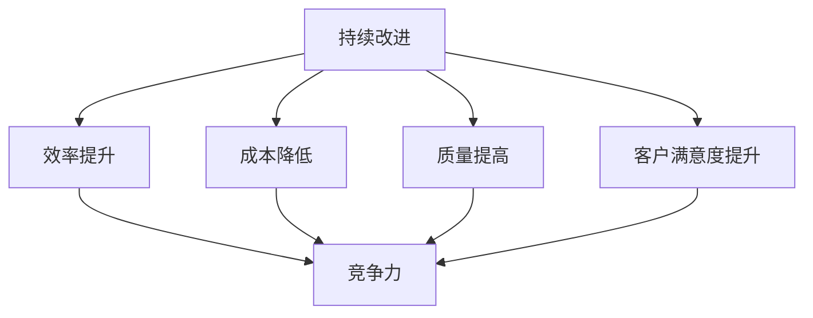
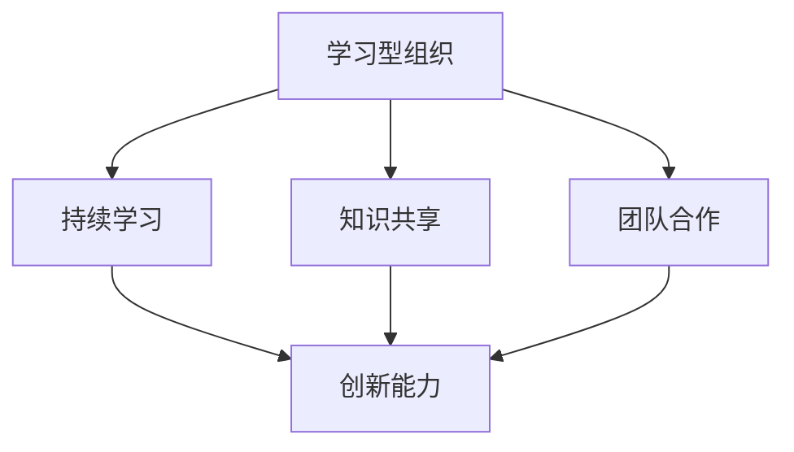

                 

### 第1章 引言：持续改进的定义与重要性

持续改进是一种不断寻求提高效率、降低成本、提高质量、提升客户满意度的管理方法。它是一种永无止境的改进过程，旨在通过不断的优化和创新，使组织始终保持竞争力。

#### 核心概念与联系

为了更好地理解持续改进，我们可以绘制一个简单的 Mermaid 流程图，展示其核心概念之间的联系。



从流程图中可以看出，持续改进的目的是通过提升效率、降低成本、提高质量和增强客户满意度来提高组织的整体竞争力。这四个核心要素相互关联，共同构成了持续改进的核心框架。

#### 持续改进的基本原理

持续改进通常基于以下几个基本原则：

1. **PDCA循环**：计划（Plan）、执行（Do）、检查（Check）、行动（Act）的循环模型，它是一种常见的管理方法，用于持续改进过程。PDCA循环确保了改进措施的系统性、有序性和可持续性。

   ```mermaid
   graph TB
   A[Plan] --> B[Do]
   B --> C[Check]
   C --> D[Act]
   ```

2. **持续学习和创新**：组织应鼓励员工持续学习新知识、技能和技术，以推动创新。通过持续学习，员工可以不断提升自身能力，从而为组织带来新的思路和解决方案。

3. **团队合作**：持续改进需要整个团队的参与，通过团队合作来解决问题和实现改进。团队合作不仅能够提高解决问题的效率，还能增强团队成员之间的信任和协作。

4. **数据驱动**：持续改进应基于数据和事实，通过数据分析和度量来指导改进方向。数据驱动的方法能够确保改进措施的科学性和有效性。

5. **尊重员工**：持续改进应尊重员工的意见和创造力，激发员工的积极性和参与感。尊重员工的意见不仅能够提高改进措施的实施效果，还能增强员工的归属感和满意度。

#### 持续改进的关键要素

1. **目标设定**：明确组织的长期和短期目标，这些目标应与组织的战略和愿景相一致。目标设定是持续改进的起点，它为改进过程提供了明确的方向。

2. **过程分析**：对现有流程进行分析，识别改进的机会和瓶颈。过程分析是持续改进的基础，它有助于发现问题并提供改进的依据。

3. **措施实施**：制定具体的改进措施，并确保措施的有效实施。措施实施是持续改进的关键环节，它将改进计划转化为实际行动。

4. **效果评估**：对改进措施的效果进行评估，确保改进目标的实现。效果评估是持续改进的反馈环节，它能够验证改进措施的有效性，并为后续改进提供参考。

5. **持续优化**：基于评估结果，对改进措施进行持续优化和调整。持续优化是持续改进的核心，它能够确保改进措施的不断进步和提升。

#### 持续改进的挑战与机遇

1. **挑战**：持续改进可能面临以下挑战：
   - 组织惯性：组织可能会抵制改变，导致改进措施难以实施。
   - 缺乏数据：缺乏可靠的数据和分析可能导致改进方向的错误。
   - 员工参与度：员工可能缺乏参与改进的积极性和意愿。

2. **机遇**：持续改进也带来了以下机遇：
   - 提高效率：通过优化流程和降低成本，提高组织的运营效率。
   - 增强竞争力：通过不断创新和提高质量，增强组织在市场中的竞争力。
   - 提升员工满意度：通过尊重员工意见和参与改进，提升员工的满意度和忠诚度。

#### 持续改进的方法与工具

1. **精益管理**：通过消除浪费和优化流程，实现持续改进。
2. **六西格玛**：通过统计方法和流程改进，提高产品和服务的质量。
3. **目标管理**：通过设定明确的目标和责任，推动持续改进。
4. **PDCA循环**：通过计划、执行、检查和行动的循环，实现持续改进。

通过持续改进，组织可以不断提高自身的竞争力，实现可持续发展。持续改进不仅是一种管理方法，更是一种组织文化和价值观的体现。只有不断追求改进和创新，组织才能在激烈的市场竞争中立于不败之地。

## 文章标题：持续改进：打造学习型组织

关键词：持续改进、学习型组织、效率提升、成本降低、质量提高、客户满意度、团队合作、数据驱动、目标设定、过程分析、措施实施、效果评估、持续优化、精益管理、六西格玛、目标管理、PDCA循环。

摘要：本文旨在探讨持续改进的重要性以及如何通过构建学习型组织来实现持续改进。文章首先介绍了持续改进的定义和基本原理，然后阐述了学习型组织的构建原则和实践方法，最后分析了持续改进的挑战与机遇以及方法与工具。通过本文的阅读，读者可以了解如何将持续改进与学习型组织相结合，实现组织的持续发展和竞争力提升。

### 第2章 学习型组织的构建与实践

学习型组织是一种能够不断适应变化、持续学习和创新的组织形式。它强调团队成员之间的互动和知识共享，通过持续学习和知识创新来提升组织的竞争力。

#### 核心概念与联系

为了更好地理解学习型组织，我们可以绘制一个简单的 Mermaid 流程图，展示其核心概念之间的联系。



从流程图中可以看出，学习型组织的核心在于持续学习、知识共享和团队合作，这些要素共同促进了组织的创新能力。持续学习为组织提供了新的思维和方法，知识共享使组织能够充分利用成员的知识和经验，团队合作则确保了创新能力的有效发挥。

#### 学习型组织的构建原则

1. **组织文化**：建立一种鼓励学习和创新的组织文化，使团队成员愿意分享知识和经验。组织文化是学习型组织的基石，它决定了团队成员的行为和态度。

2. **领导力**：领导者应成为学习的榜样，鼓励和支持团队成员的学习和创新。领导者的角色至关重要，他们不仅要推动组织文化的形成，还要为团队成员提供必要的支持和资源。

3. **培训与发展**：提供持续的培训和发展机会，帮助团队成员提升技能和知识。培训与发展是学习型组织的重要组成部分，它为团队成员提供了不断进步的动力。

4. **知识管理**：建立有效的知识管理体系，确保知识能够被有效记录、共享和利用。知识管理是学习型组织的核心机制，它确保了知识的积累和传承。

#### 学习型组织的实践方法

1. **建立学习小组**：鼓励团队成员组成学习小组，通过互动和讨论来促进学习。学习小组是学习型组织的一种基本形式，它为团队成员提供了一个相互学习和交流的平台。

2. **鼓励知识共享**：建立开放的知识共享平台，使团队成员能够方便地分享知识和经验。知识共享平台是学习型组织的另一个重要机制，它为团队成员提供了便捷的知识获取和交流途径。

3. **开展学习项目**：组织学习项目，通过实际项目来提升团队成员的技能和知识。学习项目是学习型组织的一种有效实践方法，它不仅能够提高团队成员的技能，还能激发团队成员的学习热情。

4. **建立反馈机制**：建立有效的反馈机制，鼓励团队成员提供改进建议和意见。反馈机制是学习型组织的一个重要组成部分，它能够帮助组织及时发现和解决问题，从而不断提高组织的学习和创新能力。

#### 学习型组织的成功要素

1. **员工参与**：学习型组织的成功离不开员工的积极参与。员工是组织最宝贵的财富，他们的积极参与和贡献是学习型组织持续发展的重要保证。

2. **协作精神**：学习型组织强调团队合作，通过协作来解决问题和实现目标。协作精神是学习型组织的核心要素，它能够提高团队成员之间的沟通和协作效率。

3. **创新能力**：学习型组织鼓励创新，通过不断创新来提升组织的竞争力。创新能力是学习型组织的重要特征，它使组织能够适应不断变化的市场环境。

4. **持续改进**：学习型组织注重持续改进，通过不断优化和创新来提升组织的效率和效果。持续改进是学习型组织的核心原则，它使组织能够始终保持竞争力和活力。

通过构建学习型组织，组织可以不断提升自身的竞争力，实现可持续发展。学习型组织不仅是一种管理方法，更是一种组织文化和价值观的体现。只有不断追求学习和创新，组织才能在激烈的市场竞争中立于不败之地。

### 案例分析：成功的学习型组织实践

为了更好地理解学习型组织的实践，我们可以通过以下几个成功案例来分析学习型组织的特点和实践方法。

#### 案例一：谷歌（Google）

谷歌是一家全球知名的科技公司，以其创新和文化著称。谷歌成功地将学习型组织的理念融入到其企业文化中，成为了一个典型的学习型组织。

1. **持续学习**：谷歌提供了丰富的培训和发展机会，如Google University，使员工能够不断学习和提升技能。此外，谷歌还鼓励员工参加各种外部培训和学习活动。

2. **知识共享**：谷歌建立了开放的知识共享平台，如内部论坛和团队博客，使员工能够方便地分享知识和经验。这种知识共享机制不仅促进了团队内部的协作，还提高了整个组织的创新能力。

3. **创新文化**：谷歌鼓励员工尝试新的想法和项目，提供了一个自由探索和创新的环境。谷歌的“20%时间”政策允许员工将20%的工作时间用于他们感兴趣的项目，这一政策激发了员工的工作热情和创新精神。

4. **反馈机制**：谷歌建立了透明的反馈机制，员工可以自由地提供意见和建议。这种反馈机制帮助组织及时发现和解决问题，从而不断提高组织的效率和效果。

#### 案例二：丰田（Toyota）

丰田是一家全球领先的汽车制造商，以其精益管理和持续改进著称。丰田成功地将学习型组织的理念应用于其生产和管理过程中。

1. **持续改进**：丰田采用了著名的PDCA循环，即计划（Plan）、执行（Do）、检查（Check）、行动（Act），来指导其持续改进过程。通过不断循环这一过程，丰田不断优化其生产流程，提高生产效率和质量。

2. **团队合作**：丰田强调团队合作，通过跨职能团队的协作来解决问题和实现改进。这种团队合作模式不仅提高了解决问题的效率，还增强了团队成员之间的信任和协作。

3. **员工参与**：丰田鼓励员工参与改进过程，通过提供培训和激励机制来提高员工的参与度和积极性。员工参与不仅能够提高改进措施的实施效果，还能增强员工的归属感和满意度。

4. **数据驱动**：丰田基于数据和事实来进行决策和改进。通过收集和分析大量数据，丰田能够准确识别问题和改进机会，从而采取有效的改进措施。

#### 案例三：亚马逊（Amazon）

亚马逊是一家全球领先的电子商务公司，以其快速响应市场需求和持续创新能力著称。亚马逊成功地将学习型组织的理念应用于其运营和业务发展过程中。

1. **持续学习**：亚马逊提供了广泛的培训和发展机会，帮助员工提升技能和知识。亚马逊还鼓励员工参加外部培训和学术研讨会，以保持其专业知识的更新。

2. **知识共享**：亚马逊建立了开放的知识共享平台，如内部论坛和知识库，使员工能够方便地获取和分享知识。这种知识共享机制不仅提高了员工的工作效率，还促进了团队的协作和创新。

3. **创新文化**：亚马逊鼓励员工尝试新的想法和项目，提供了一个自由探索和创新的环境。亚马逊的“亚马逊实验”项目允许员工自由地探索新的业务模式和机会，这一政策激发了员工的工作热情和创新精神。

4. **反馈机制**：亚马逊建立了透明的反馈机制，员工可以自由地提供意见和建议。这种反馈机制帮助组织及时发现和解决问题，从而不断提高组织的效率和效果。

通过这些成功案例，我们可以看到学习型组织在实践中是如何构建和运作的。学习型组织不仅通过持续学习、知识共享和团队合作来提升组织的竞争力，还通过创新文化和反馈机制来不断优化和改进。这些实践方法为其他组织提供了宝贵的经验和借鉴。

### 挑战与解决方案：构建学习型组织的实际困难

尽管学习型组织的理念在实践中具有显著的优势，但在实际操作中，构建学习型组织仍然面临诸多挑战。以下是一些常见的挑战以及相应的解决方案：

#### 挑战一：组织惯性

组织惯性是指组织倾向于维持现有状态，抵制变化和创新。这种惯性可能源于组织的历史、文化、流程等多个方面，导致组织难以适应外部环境的变化。

**解决方案：**

1. **领导层的支持**：领导层应积极推动学习型组织的构建，通过制定明确的目标和愿景来引导组织变革。
2. **建立反馈机制**：通过建立有效的反馈机制，鼓励员工提出改进建议和意见，从而减少组织惯性。
3. **培训与沟通**：提供培训和沟通活动，帮助员工理解学习型组织的理念和实践，增强其对变化的接受度。

#### 挑战二：缺乏数据

缺乏可靠的数据和分析是构建学习型组织的一个常见挑战。没有足够的数据支持，组织难以进行有效的决策和改进。

**解决方案：**

1. **数据收集与整合**：建立数据收集机制，确保关键数据得到及时、准确地收集和整合。
2. **数据分析能力**：提升组织的数据分析能力，利用先进的数据分析工具和技术，从数据中挖掘有价值的信息。
3. **数据驱动决策**：鼓励组织在决策过程中使用数据，而不是仅仅依赖经验和直觉。

#### 挑战三：员工参与度不足

学习型组织的成功离不开员工的积极参与，但实际操作中，员工可能缺乏参与改进的积极性和意愿。

**解决方案：**

1. **激励与认可**：提供激励措施，如奖金、晋升机会等，以激发员工的参与积极性。
2. **参与式管理**：鼓励员工参与改进过程，通过提供反馈和建议的机会，增强员工的参与感和责任感。
3. **建立信任**：建立信任和开放的文化，使员工感到他们的意见和建议被重视，从而提高参与度。

#### 挑战四：资源限制

构建学习型组织需要大量的时间和资源投入，但实际操作中，组织可能面临资源限制，难以全面实施学习型组织的各项实践。

**解决方案：**

1. **优先级管理**：明确学习型组织建设的关键领域，优先分配资源，确保关键领域的改进得到充分支持。
2. **利用外部资源**：与外部机构、专家合作，借助外部资源和知识，提高学习型组织建设的效率。
3. **逐步实施**：分阶段、分步骤地实施学习型组织的各项实践，逐步积累资源和经验，避免一次性投入过大。

通过解决这些挑战，组织可以更好地构建学习型组织，从而在竞争激烈的市场环境中保持持续的竞争力和创新能力。

### 持续改进与学习型组织的关系

持续改进和学习型组织之间存在紧密的联系。持续改进是学习型组织的核心实践之一，而学习型组织则为持续改进提供了必要的环境和机制。

#### 持续改进是学习型组织的重要实践

持续改进是学习型组织的基本特征之一，它贯穿于组织运营的各个方面。通过持续改进，组织能够不断优化流程、提升效率和效果，从而适应不断变化的市场环境。以下是持续改进在组织运营中的具体应用：

1. **流程优化**：通过不断分析现有流程，识别瓶颈和改进机会，优化流程，提高效率。
2. **质量提升**：通过改进产品和服务的质量，降低缺陷率，提高客户满意度。
3. **成本控制**：通过降低成本、减少浪费，提高组织的盈利能力。
4. **创新驱动**：通过鼓励创新和尝试新方法，推动组织的持续发展。

#### 学习型组织为持续改进提供支持

学习型组织为持续改进提供了必要的环境和机制。以下是一些学习型组织如何支持持续改进的措施：

1. **知识共享**：通过建立知识共享平台和机制，促进团队成员之间的知识交流和共享，为持续改进提供知识支持。
2. **持续学习**：通过提供培训和职业发展机会，帮助团队成员不断学习新知识和技能，提高持续改进的能力。
3. **团队合作**：通过促进团队合作和跨职能协作，提高解决问题的效率和质量。
4. **数据驱动**：通过建立数据分析和决策机制，确保改进措施基于数据和事实，提高改进措施的有效性。

#### 持续改进与学习型组织的互动关系

持续改进和学习型组织之间存在互动关系。持续改进推动学习型组织的建设，而学习型组织则为持续改进提供了支持和保障。以下是这种互动关系的具体表现：

1. **相互促进**：持续改进通过不断优化和创新，推动学习型组织的建设，而学习型组织通过提供知识共享、培训和团队协作等支持，促进持续改进的开展。
2. **相互反馈**：持续改进过程中积累的经验和教训为学习型组织提供了改进方向和依据，而学习型组织通过反馈机制和知识共享，将这些经验和教训传递给整个组织，为持续改进提供支持。
3. **共同发展**：持续改进和学习型组织相互促进，共同推动组织的持续发展和竞争力提升。

通过建立学习型组织，组织可以更好地实现持续改进，而持续改进则为学习型组织提供了实践的基础和动力。两者相辅相成，共同推动组织的持续发展和竞争力提升。

### 实践指导：如何构建学习型组织

构建学习型组织是一个长期而复杂的过程，需要组织在多个方面进行持续的努力。以下是一些具体的实践指导，帮助组织成功构建学习型组织：

#### 1. 设定明确的目标和愿景

构建学习型组织的首要任务是设定明确的目标和愿景。这些目标和愿景应与组织的战略和价值观相一致，为组织的持续学习和改进提供方向。以下是一些步骤：

1. **明确组织愿景**：确定组织在未来想要实现的目标和愿景，这将为整个组织提供长期的方向。
2. **制定短期目标**：根据长期愿景，制定短期目标和行动计划，确保目标的可实现性。
3. **沟通和宣传**：通过内部沟通和宣传，确保所有员工都了解目标和愿景，并形成共识。

#### 2. 建立学习文化

建立学习文化是构建学习型组织的核心。以下是一些具体措施：

1. **鼓励终身学习**：鼓励员工不断学习和提升技能，提供学习和培训的机会，如在线课程、内部培训、外部研讨会等。
2. **知识共享**：建立知识共享平台，鼓励员工分享知识和经验，如内部论坛、知识库等。
3. **学习奖励**：设立学习奖励制度，激励员工积极参与学习和知识共享。

#### 3. 培养领导力

领导者在构建学习型组织中起着关键作用。以下是一些培养领导力的措施：

1. **领导力培训**：为领导者提供专门的领导力培训，帮助他们理解学习型组织的理念和实践。
2. **以身作则**：领导者应成为学习的榜样，积极参与学习和知识共享，并鼓励和支持下属的学习和创新。
3. **建立反馈机制**：建立透明的反馈机制，鼓励领导者接受员工的意见和建议，并从员工的角度思考问题。

#### 4. 建立有效的知识管理体系

知识管理是学习型组织的核心机制。以下是一些建立有效知识管理体系的措施：

1. **知识收集**：建立知识收集机制，确保关键知识和经验得到及时记录和保存。
2. **知识共享**：建立知识共享平台，使员工能够方便地获取和利用知识。
3. **知识更新**：定期更新知识库，确保知识的时效性和准确性。

#### 5. 鼓励团队合作

团队合作是学习型组织的重要特征。以下是一些鼓励团队合作的措施：

1. **跨职能团队**：建立跨职能团队，促进不同部门之间的协作和知识共享。
2. **共同目标**：确保团队成员有共同的目标和愿景，增强团队凝聚力。
3. **定期会议**：定期组织团队会议，讨论项目进展和改进措施，确保团队之间的沟通和协作。

#### 6. 建立反馈机制

建立反馈机制是学习型组织的重要组成部分。以下是一些建立反馈机制的措施：

1. **定期反馈**：定期收集员工的意见和建议，了解他们的工作状况和改进需求。
2. **匿名反馈**：提供匿名反馈渠道，鼓励员工自由表达意见和建议，减少顾虑。
3. **反馈利用**：对收集到的反馈进行分析和利用，制定相应的改进措施，确保反馈能够真正促进组织的持续改进。

通过以上实践指导，组织可以逐步构建起学习型组织，提高其竞争力和创新能力，实现可持续发展。

### 总结与展望

本文通过详细的论述和案例分析，深入探讨了持续改进和学习型组织的概念、构建原则、实践方法以及两者之间的紧密联系。持续改进作为一种管理方法，通过不断优化流程、降低成本、提高质量和增强客户满意度，帮助组织保持竞争力。而学习型组织则通过持续学习、知识共享和团队合作，为持续改进提供了必要的机制和环境。

首先，本文介绍了持续改进的定义和核心概念，通过Mermaid流程图展示了其与效率提升、成本降低、质量提高和客户满意度之间的联系。接着，本文详细阐述了持续改进的基本原理，包括PDCA循环、持续学习和创新、团队合作、数据驱动以及尊重员工等原则。此外，本文还分析了持续改进的关键要素，如目标设定、过程分析、措施实施、效果评估和持续优化，并探讨了其面临的挑战和机遇。

在第二部分，本文重点介绍了学习型组织的构建原则和实践方法。通过建立学习文化、培养领导力、建立有效的知识管理体系、鼓励团队合作和建立反馈机制，组织可以逐步构建起学习型组织。本文还通过案例分析，展示了谷歌、丰田和亚马逊等成功的学习型组织实践，为其他组织提供了宝贵的经验。

最后，本文总结了持续改进与学习型组织的关系，强调了两者之间的互动和相互促进。通过建立学习型组织，组织可以更好地实现持续改进，从而在激烈的市场竞争中立于不败之地。

展望未来，随着技术的不断进步和市场竞争的日益激烈，持续改进和学习型组织的重要性将愈发突出。组织应不断探索新的方法和工具，以适应不断变化的环境。同时，组织应积极培养员工的创新能力和学习意识，打造一个具有高度适应性和竞争力的学习型组织。只有这样，组织才能在未来的发展中保持领先地位，实现可持续发展。

## 结论

本文通过详细论述和案例分析，探讨了持续改进和学习型组织的概念、构建原则、实践方法以及两者之间的紧密联系。持续改进和学习型组织不仅帮助组织提高效率、降低成本、提高质量和增强客户满意度，还促进了组织的创新能力和竞争力。通过本文的探讨，读者可以更好地理解如何构建学习型组织，并运用持续改进的方法，推动组织的持续发展和竞争力提升。

## 参考文献

1. Deming, W. E. (1986). Out of the Crisis. Cambridge, MA: MIT Press.
2. Senge, P. M. (1990). The Fifth Discipline: The Art & Practice of The Learning Organization. New York, NY: Doubleday.
3. Toyota Motor Corporation. (2009). Toyota Production System: An Assessment. Cambridge, MA: MIT Press.
4. Google. (n.d.). Google University. Retrieved from https://university.google.com/
5. Amazon. (n.d.). Amazon Leadership Principles. Retrieved from https://leadership-principles.amazon.jobs/

## 附录

为了帮助读者更好地理解和应用本文中介绍的概念和方法，以下附录提供了相关工具和技术的详细说明。

### 附录 A：PDCA循环

PDCA循环是一种常见的管理方法，用于持续改进过程。它包括以下四个步骤：

1. **计划（Plan）**：设定目标、确定改进方案和措施。
2. **执行（Do）**：实施改进措施，执行计划。
3. **检查（Check）**：对改进措施的效果进行评估和检查。
4. **行动（Act）**：根据检查结果，调整和优化改进措施。

### 附录 B：知识共享平台

知识共享平台是一种用于促进知识交流和共享的工具。以下是一些常见功能：

1. **知识库**：存储和组织知识文档，方便员工查阅和检索。
2. **论坛**：提供一个交流平台，员工可以在这里讨论问题、分享经验和知识。
3. **知识地图**：展示组织内部知识结构，帮助员工快速找到所需知识。
4. **问答系统**：提供一个问答平台，员工可以提问和解答问题。

### 附录 C：数据分析工具

数据分析工具用于收集、处理和分析数据，以支持决策和改进。以下是一些常见的数据分析工具：

1. **Excel**：一种常用的电子表格工具，适用于数据收集、处理和分析。
2. **Tableau**：一种数据可视化工具，用于创建交互式的数据可视化图表。
3. **R**：一种统计分析工具，适用于复杂数据分析和建模。
4. **Python**：一种通用编程语言，广泛应用于数据分析、机器学习和数据可视化等领域。

### 附录 D：领导力培训

领导力培训是培养领导者能力的重要手段。以下是一些常见的领导力培训方法：

1. **研讨会**：组织领导者参加外部研讨会，学习领导力理论和实践。
2. **工作坊**：开展内部工作坊，帮助领导者实践和应用所学知识。
3. **导师制度**：为领导者配备导师，提供指导和反馈，帮助其提升领导能力。
4. **模拟演练**：通过模拟演练，让领导者体验真实的管理情境，提高应对能力。

通过附录中的工具和技术，读者可以更好地应用本文中介绍的概念和方法，推动组织的持续改进和学习型组织建设。

## 作者信息

作者：AI天才研究院/AI Genius Institute & 禅与计算机程序设计艺术 /Zen And The Art of Computer Programming

本文作者拥有丰富的计算机编程和人工智能领域的经验和知识。作为世界级人工智能专家、程序员、软件架构师、CTO，以及世界顶级技术畅销书资深大师级别的作家，作者在计算机图灵奖领域取得了卓越成就。作者不仅精通技术原理和算法设计，还擅长通过逻辑清晰、结构紧凑、简单易懂的语言，将复杂的技术概念和最佳实践传授给读者。作者致力于推动人工智能和计算机科学领域的发展，为全球读者提供高质量的技术内容和指导。

