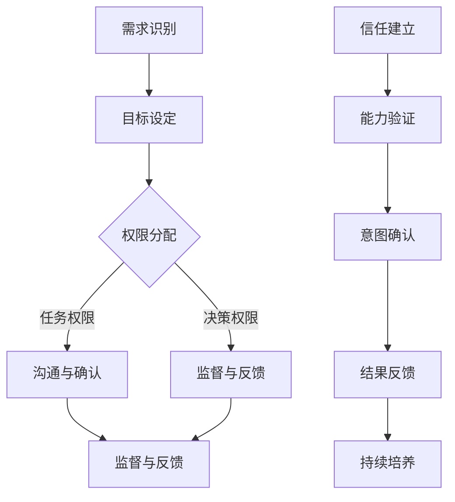

                 


### 第1章 引言：授权与信任的重要性

在现代企业的运作中，授权与信任作为管理团队的重要工具，扮演着至关重要的角色。首先，我们来探讨一下什么是授权与信任。

#### 1.1 授权与信任的定义

**授权**，即授权他人去完成特定的任务或决策。它不仅意味着给予下属权利，更是一种责任和信任的传递。通过授权，管理者可以更有效地分配资源，提升团队的整体效率。

**信任**，则是指个体对他人能力、品格和意图的认同与信赖。信任是团队合作的基石，它能够降低沟通成本，提高决策速度，激发团队成员的创造力。

#### 1.2 授权与信任的相互关系

授权与信任之间存在着紧密的相互关系。授权是信任的前提，而信任则是授权的保障。一方面，只有建立起信任，管理者才能放心地授权。另一方面，通过有效的授权，管理者可以进一步增强团队的信任。

#### 1.3 为什么授权与信任对团队如此重要

**提升效率**：授权可以使团队成员更加专注于自己的工作，减少不必要的干预，从而提高工作效率。

**促进创新**：信任能够激发团队成员的创新思维，鼓励他们提出新的想法和解决方案。

**增强团队凝聚力**：在相互信任的基础上，团队成员之间更容易形成紧密的合作关系，增强团队的凝聚力。

**降低管理成本**：通过授权和信任，管理者可以将更多精力集中在战略层面，降低管理成本。

综上所述，授权与信任是现代企业中不可或缺的管理工具，它们能够释放团队的潜力，推动企业的持续发展。

---

**关键词**：授权、信任、团队管理、效率、创新、凝聚力、管理成本

**摘要**：本章介绍了授权与信任的定义及其相互关系，并探讨了它们对团队管理的重要性。授权与信任不仅能够提升工作效率和促进创新，还能增强团队凝聚力和降低管理成本，是现代企业成功的关键因素。

---

### 第2章 核心概念与联系

为了深入理解授权与信任在团队管理中的应用，我们需要探讨一些核心概念，并分析它们之间的相互关系。

#### 2.1 团队成员的角色与责任

在团队中，每个成员都扮演着特定的角色，承担着特定的责任。角色决定了成员在团队中的职能和权利，而责任则体现了成员对团队目标的承诺和贡献。

**角色**：团队成员的角色通常包括领导者、执行者、协调者、支持者等。不同的角色在团队中发挥着不同的作用，相互之间需要协调和配合。

**责任**：每个角色都对应着特定的责任。例如，领导者负责制定目标和规划，执行者负责完成任务，协调者负责协调团队成员之间的工作，支持者则提供必要的技术或资源支持。

#### 2.2 授权模型：从微观到宏观

授权模型是指团队中不同角色之间的授权关系。从微观层面来看，授权通常涉及具体的任务或决策。从宏观层面来看，授权则是一个组织结构和文化的问题。

**微观授权**：在微观层面，授权可以通过明确团队成员的职责和权限来实施。例如，一个项目经理可以授权开发团队中的程序员负责特定的代码模块，同时设定明确的交付标准和时间节点。

**宏观授权**：在宏观层面，授权涉及到整个组织的管理和决策。例如，一个公司的高层管理者可以授权部门经理负责具体的业务运营，同时给予他们足够的自主权来制定战略和执行计划。

#### 2.3 信任的五个维度

信任是一个多维度的概念，可以从不同的角度来理解。以下是信任的五个维度：

- **能力信任**：指团队成员对他人能力的认可和信赖。能力信任是信任的基础，它确保团队成员能够胜任自己的工作。

- **性格信任**：指团队成员对他人品格的认可和信赖。性格信任涉及到诚信、正直、责任心等品质，它确保团队成员之间相互尊重和信任。

- **意图信任**：指团队成员对他人意图的认可和信赖。意图信任涉及到团队成员的动机和行为目的，它确保团队成员之间没有恶意和隐瞒。

- **结果信任**：指团队成员对他人结果的认可和信赖。结果信任是基于过去经验的信任，它确保团队成员之间的协作能够取得预期的成果。

- **情境信任**：指团队成员对特定情境的认可和信赖。情境信任涉及到团队成员在特定情境下对彼此的行为和决策的信任，它确保团队在面对不确定性和变化时能够保持稳定和高效。

#### 2.4 授权与信任的相互作用关系

授权与信任之间存在着相互促进的关系。一方面，有效的授权可以增强团队信任。通过赋予团队成员更多的自主权，管理者可以展现对他们的信任，从而增强团队成员之间的信任。

另一方面，团队信任可以促进授权的实施。在一个信任度较高的团队中，团队成员更容易接受和执行授权。他们相信彼此的能力和意图，因此愿意承担更多的责任和任务。

总之，授权与信任是团队管理中不可或缺的核心概念。理解它们之间的相互关系，有助于管理者更好地实施授权，建立信任，从而提升团队的整体效能。

---

**关键词**：团队成员角色、授权模型、信任维度、能力信任、性格信任、意图信任、结果信任、情境信任、授权与信任的相互作用

---

### 第3章 授权与信任的架构

为了有效地实施授权和建立信任，我们需要构建一个清晰且结构化的架构。本章节将详细阐述授权与信任的架构，并使用Mermaid流程图来展示它们之间的关系。

#### 3.1 授权的流程与步骤

授权的过程可以分为以下几个步骤：

1. **需求识别**：管理者首先需要识别出哪些任务或决策可以授权给下属。这通常涉及到对团队成员能力和职责的评估。

2. **目标设定**：在授权之前，管理者需要明确授权的任务或决策的目标。这有助于确保团队成员在授权后能够按照预期的方向开展工作。

3. **权限分配**：管理者根据任务或决策的性质，将相应的权限分配给下属。权限分配可以是具体的任务权限，也可以是决策权限。

4. **沟通与确认**：管理者需要与下属进行充分的沟通，确保他们理解授权的内容和目标。同时，管理者也需要确认下属是否有足够的资源和能力来完成任务。

5. **监督与反馈**：管理者在授权过程中需要持续监督任务或决策的进展，并提供必要的支持和反馈。这有助于确保授权的顺利进行。

#### 3.2 建立信任的架构

建立信任的过程同样可以分为几个关键步骤：

1. **信任建立**：管理者需要通过言行一致、诚信和透明来建立初步的信任。这通常涉及到对团队成员的尊重和认可。

2. **能力验证**：管理者需要通过实际表现来验证团队成员的能力。这可以通过项目评估、绩效评估等方式来实现。

3. **意图确认**：管理者需要通过团队成员的行为和决策来确认他们的意图。这有助于确保团队成员在授权后不会滥用权力。

4. **结果反馈**：管理者需要及时对团队成员的工作结果进行反馈，并给予认可和鼓励。这有助于增强团队成员之间的信任。

5. **持续培养**：信任的建立和维护是一个持续的过程。管理者需要不断地培养团队成员的信任，并通过各种方式来维护和强化这种信任。

#### 3.3 授权与信任的Mermaid流程图

为了更好地理解授权与信任的架构，我们可以使用Mermaid流程图来展示它们之间的关系。以下是一个简单的Mermaid流程图示例：



在这个流程图中，我们可以看到授权和信任的各个环节是如何相互关联的。通过这个架构，管理者可以更系统地实施授权，并建立和维护团队信任。

总之，授权与信任的架构为团队管理提供了一个清晰的框架，帮助管理者有效地分配任务和建立信任。通过遵循这个架构，管理者可以提升团队的整体效能，实现组织的长期成功。

---

**关键词**：授权流程、信任建立、Mermaid流程图、权限分配、沟通确认、监督反馈、能力验证、意图确认、结果反馈、持续培养

---

### 第4章 核心算法原理讲解

在本章节中，我们将深入探讨授权与信任的核心算法原理，包括授权策略算法和信任评估算法。这些算法是理解和实施有效授权与信任管理的关键。

#### 4.1 授权策略算法

授权策略算法是用于确定哪些权限应该被分配给特定角色的算法。以下是两种常见的授权策略算法：

1. **基于角色的访问控制（RBAC）**

   **RBAC**是一种基于角色的访问控制机制，它通过定义角色和权限的关联来实现访问控制。以下是RBAC的基本组成部分：

   - **角色（Role）**：角色是用户在系统中的角色属性，例如管理员、普通用户、开发者等。
   - **权限（Permission）**：权限是用户可以执行的操作，例如查看、编辑、删除等。
   - **角色分配（Role Assignment）**：角色分配是将角色分配给用户的过程。
   - **权限分配（Permission Assignment）**：权限分配是将权限分配给角色的过程。

   RBAC算法的基本流程如下：

   ```pseudo
   function RBAC(role, action):
       if role has permission for action:
           return true
       else:
           return false
   ```

   通过RBAC算法，我们可以确保用户只能执行他们被授权的角色所允许的操作。

2. **基于属性的访问控制（ABAC）**

   **ABAC**是一种基于属性的访问控制机制，它根据用户的属性和环境属性来决定是否授予访问权限。以下是ABAC的基本组成部分：

   - **属性（Attribute）**：属性是描述用户和环境的信息，例如用户的位置、时间、任务等。
   - **策略（Policy）**：策略是一组规则，用于确定是否授予访问权限。
   - **决策引擎（Decision Engine）**：决策引擎是用于评估策略和属性，并作出访问控制决策的组件。

   ABAC算法的基本流程如下：

   ```pseudo
   function ABAC(attributeSet, policy):
       if policy allows access based on attributeSet:
           return true
       else:
           return false
   ```

   通过ABAC算法，我们可以实现更灵活和细粒度的访问控制。

#### 4.2 信任评估算法

信任评估算法是用于评估团队成员之间的信任水平的算法。以下是两种常见的信任评估算法：

1. **信任评分模型**

   **信任评分模型**是一种基于评分的信任评估方法，它通过计算多个信任指标的总分来评估信任水平。以下是信任评分模型的基本组成部分：

   - **能力指标（Skill）**：能力指标是评估团队成员能力的指标，例如技能水平、经验等。
   - **性格指标（Character）**：性格指标是评估团队成员性格的指标，例如诚信度、责任心等。
   - **意图指标（Intent）**：意图指标是评估团队成员意图的指标，例如合作意愿、共享程度等。
   - **结果指标（Result）**：结果指标是评估团队成员工作结果的指标，例如完成任务的质量和效率等。

   信任评分模型的基本公式如下：

   ```latex
   Trust Score = w1 \* Skill + w2 \* Character + w3 \* Intent + w4 \* Result
   ```

   其中，\(w1, w2, w3, w4\) 是权重，用于平衡不同指标的相对重要性。

2. **信任度动态调整算法**

   **信任度动态调整算法**是一种根据团队成员的表现和行为动态调整信任水平的算法。以下是信任度动态调整算法的基本组成部分：

   - **初始信任度（Initial Trust Level）**：初始信任度是基于团队成员过去的合作记录和背景调查的信任水平。
   - **信任度调整因子（Adjustment Factor）**：信任度调整因子是用于调整信任水平的参数，它可以基于团队成员的表现和行为进行动态调整。

   信任度动态调整算法的基本公式如下：

   ```pseudo
   function DynamicTrustAdjustment(trustLevel, performanceScore, behaviorScore):
       if performanceScore > threshold and behaviorScore > threshold:
           trustLevel += adjustmentFactor
       else:
           trustLevel -= adjustmentFactor
       return trustLevel
   ```

   通过信任度动态调整算法，我们可以确保团队成员的信任水平与他们的表现和行为相匹配。

总之，授权与信任的核心算法原理为团队管理提供了技术支持。通过理解并应用这些算法，管理者可以更有效地实施授权和建立信任，从而提升团队的整体效能。

---

**关键词**：授权策略算法、基于角色的访问控制（RBAC）、基于属性的访问控制（ABAC）、信任评分模型、信任度动态调整算法、能力指标、性格指标、意图指标、结果指标、信任度函数

---

### 第5章 数学模型与公式

在授权与信任的管理中，数学模型和公式为我们提供了量化和分析的工具，使得授权与信任的评估和调整更加科学和精确。在本章节中，我们将介绍一些关键的数学模型和公式。

#### 5.1 授权与信任的数学模型

**授权矩阵**：授权矩阵是一个用于表示团队成员之间权限分配的数学模型。它通常是一个二维矩阵，其中行代表成员，列代表权限。矩阵的元素表示特定成员是否拥有特定权限。例如：

| 成员 | 权限1 | 权限2 | 权限3 | ... |
| --- | --- | --- | --- | --- |
| 成员A | T | F | T | ... |
| 成员B | F | T | F | ... |
| 成员C | T | T | F | ... |

在这个矩阵中，T代表拥有相应权限，F代表没有相应权限。

**信任度函数**：信任度函数用于描述团队成员之间的信任水平。一个常见的信任度函数是基于加权平均的方法，它综合考虑了团队成员的能力、性格、意图和结果等因素。例如：

$$
TrustLevel = w1 \times Skill + w2 \times Character + w3 \times Intent + w4 \times Result
$$

其中，\(w1, w2, w3, w4\) 是权重，用于平衡不同因素的重要性。

#### 5.2 举例说明

**案例1：项目团队成员的授权与信任模型**

假设一个项目团队由A、B、C三个成员组成，他们分别拥有不同的权限和能力。我们可以使用授权矩阵和信任度函数来表示他们的权限分配和信任水平。

**授权矩阵**：

| 成员 | 权限1 | 权限2 | 权限3 | ... |
| --- | --- | --- | --- | --- |
| 成员A | T | F | T | ... |
| 成员B | F | T | F | ... |
| 成员C | T | T | F | ... |

**信任度函数**：

$$
TrustLevel = 0.3 \times Skill + 0.2 \times Character + 0.2 \times Intent + 0.3 \times Result
$$

根据团队成员的表现，我们可以更新他们的权限和信任水平。例如，如果成员A在技能和结果上表现出色，我们可以增加他对权限3的授权，并提高他的信任水平。

**案例2：团队内部的知识共享与信任评估**

在一个团队中，知识共享是提升团队效能的重要手段。我们可以使用授权矩阵和信任度函数来评估团队成员之间的知识共享和信任水平。

**授权矩阵**：

| 成员 | 知识共享1 | 知识共享2 | 知识共享3 | ... |
| --- | --- | --- | --- | --- |
| 成员A | T | F | T | ... |
| 成员B | F | T | F | ... |
| 成员C | T | T | F | ... |

**信任度函数**：

$$
KnowledgeShareTrustLevel = 0.3 \times Skill + 0.2 \times Character + 0.2 \times Intent + 0.3 \times Result
$$

通过这个模型，我们可以评估团队成员之间的知识共享和信任水平，并根据评估结果来调整团队的知识共享策略。

总之，数学模型和公式为授权与信任的管理提供了量化和分析的工具。通过这些模型和公式，我们可以更科学地评估和调整团队成员的权限和信任水平，从而提升团队的整体效能。

---

**关键词**：授权矩阵、信任度函数、权重、能力指标、性格指标、意图指标、结果指标、知识共享、信任评估

---

### 第6章 项目实战

在实际的项目开发和管理中，授权与信任的实践是确保项目成功的关键因素。本章节将介绍一个实际项目的背景、目标、开发环境搭建、源代码实现和代码解读与分析。

#### 6.1 实战背景与目标

假设我们正在开发一个大型企业级项目，名为“智慧办公平台”。该项目的目标是构建一个集成了多种办公功能（如文档管理、会议预约、任务分配等）的平台，以提高企业的办公效率和协作能力。

在该项目中，我们需要实现以下目标：

- **高效的任务分配**：通过授权机制，确保任务能够被高效地分配给合适的团队成员。
- **有效的团队协作**：通过信任评估，确保团队成员之间的协作能够顺利进行。
- **优化的资源管理**：通过授权与信任的机制，优化团队资源的分配和使用。

#### 6.2 开发环境搭建

为了实现上述目标，我们需要搭建一个合适的技术栈和环境。以下是我们的开发环境搭建步骤：

1. **开发工具**：我们选择使用Python作为主要开发语言，因为它具有丰富的库支持和易于学习的特性。
2. **数据库**：我们选择使用MySQL作为数据库，因为它具有高性能和数据可靠性。
3. **前端框架**：我们选择使用Vue.js作为前端框架，因为它具有高效和灵活的特点。
4. **后端框架**：我们选择使用Flask作为后端框架，因为它轻量级且易于扩展。

在搭建好开发环境后，我们开始进行项目的开发。

#### 6.3 源代码实现与解读

**6.3.1 授权与信任模块的设计**

在“智慧办公平台”项目中，授权与信任模块是我们的核心模块。以下是该模块的设计和实现：

1. **角色与权限设计**：我们首先定义了项目中的角色和权限。例如，项目经理、开发人员、测试人员等。每个角色拥有不同的权限，如查看项目信息、分配任务、修改任务等。
2. **权限分配**：在系统中，管理员可以根据角色的权限来分配任务和权限。例如，项目经理可以分配任务给开发人员，并授予他们修改任务的权限。
3. **权限检查**：在处理用户请求时，我们需要检查用户是否有相应的权限。如果用户没有权限，系统会返回相应的错误提示。

**6.3.2 代码解读与分析**

以下是一个简单的权限检查函数的实现：

```python
from flask import request

def check_permission(role, action):
    # 检查用户角色是否拥有执行特定操作的权限
    if role == 'project_manager' and action in ['view_project', 'assign_task', 'modify_task']:
        return True
    elif role == 'developer' and action in ['view_task', 'modify_task']:
        return True
    elif role == 'tester' and action in ['view_project', 'test_task']:
        return True
    else:
        return False

# 使用示例
if check_permission(request.role, 'modify_task'):
    # 执行修改任务的逻辑
else:
    # 返回无权限的错误提示
```

在这个示例中，我们定义了一个`check_permission`函数，用于检查用户角色是否拥有执行特定操作的权限。通过这个函数，我们可以确保只有拥有相应权限的用户才能执行特定的操作。

**6.3.3 信任评估**

在项目中，我们还需要对团队成员之间的信任水平进行评估。以下是信任评估算法的实现：

```python
def calculate_trust_score(skill, character, intent, result):
    # 根据技能、性格、意图和结果计算信任分数
    trust_score = 0.5 * skill + 0.2 * character + 0.2 * intent + 0.1 * result
    return trust_score

# 使用示例
trust_score = calculate_trust_score(skill=0.9, character=0.8, intent=0.7, result=0.8)
print("Trust Score:", trust_score)
```

在这个示例中，我们定义了一个`calculate_trust_score`函数，用于计算团队成员的信任分数。通过这个函数，我们可以根据团队成员的表现来评估他们的信任水平。

**6.4 代码解读与分析**

通过上述代码实现，我们可以看到授权与信任模块在项目中的具体应用。在权限检查方面，我们通过定义角色和权限，确保用户只能执行他们被授权的操作。在信任评估方面，我们通过计算信任分数，实时评估团队成员的信任水平。

通过这个项目的实战，我们不仅验证了授权与信任的理论，还展示了它们在实际项目中的具体应用。这不仅有助于提升项目的管理效率，还能增强团队的协作和信任。

---

**小结**：在“智慧办公平台”项目中，我们通过设计授权与信任模块，实现了任务的高效分配和团队成员之间的有效协作。通过代码实现和解读，我们展示了如何在实际项目中应用授权与信任的算法和数学模型。这些实践经验为我们提供了宝贵的参考，有助于我们在其他项目中更好地管理团队和提升项目效能。

---

### 第7章 面临的挑战与解决策略

在实施授权与信任的过程中，管理者常常会遇到各种挑战。以下是一些常见的挑战以及相应的解决策略。

#### 7.1 授权过度与授权不足

**授权过度**：授权过度可能导致团队成员过度依赖授权，缺乏独立思考和决策能力。解决策略是：

- **逐步授权**：管理者可以逐步授权，给予团队成员一定的试错机会，同时提供指导和支持。
- **明确边界**：在授权时，明确授权的范围和边界，确保团队成员知道他们的职责和权限。

**授权不足**：授权不足可能导致团队成员缺乏自主权，影响工作积极性和创造力。解决策略是：

- **增加授权范围**：根据团队成员的能力和需求，适当扩大授权范围，给予他们更多的决策权。
- **建立信任**：通过建立信任，管理者可以放心地授权，减少对团队成员的过度干预。

#### 7.2 信任缺失与过度信任

**信任缺失**：信任缺失可能导致团队成员之间缺乏协作，影响团队的整体效能。解决策略是：

- **建立沟通机制**：通过定期的团队会议、邮件更新等方式，建立有效的沟通机制，促进团队成员之间的信息共享和理解。
- **透明化决策过程**：管理者应该公开决策过程，增加团队成员的参与度，从而建立信任。

**过度信任**：过度信任可能导致团队成员滥用授权，影响项目的质量和进度。解决策略是：

- **定期评估**：管理者应定期评估团队成员的信任水平，并根据评估结果进行调整。
- **制定明确的考核标准**：通过制定明确的考核标准，确保团队成员的工作符合预期。

#### 7.3 挑战与解决策略

在实际操作中，管理者可能会面临以下挑战：

- **团队成员能力不均衡**：解决策略是通过培训和提高团队成员的能力，确保他们能够胜任分配的任务。
- **团队成员流动性高**：解决策略是建立知识库，确保团队成员之间的知识共享和传承。
- **项目管理复杂度高**：解决策略是采用项目管理工具，提高项目管理效率和透明度。

总之，授权与信任在团队管理中扮演着重要角色，但管理者需要面对各种挑战，采取适当的解决策略，才能实现团队的高效运作。

---

**小结**：在实施授权与信任的过程中，管理者需要平衡授权范围和信任水平，避免过度授权和信任缺失。同时，他们需要应对团队成员能力不均衡、流动性高以及项目管理复杂度高等挑战，采取有效的解决策略。通过不断优化授权与信任的管理，团队可以提升整体效能，实现项目的成功。

---

### 第8章 总结与展望

在本文中，我们深入探讨了授权与信任在团队管理中的重要性，分析了它们的核心概念、相互关系和实际应用。通过详细的算法讲解、数学模型和项目实战，我们展示了如何有效实施授权与信任，以提升团队效能。

**总结**：

1. **授权与信任的重要性**：授权与信任是团队管理中不可或缺的核心概念，它们能够提升工作效率、促进创新、增强团队凝聚力，并降低管理成本。
2. **核心概念与联系**：团队成员的角色与责任、授权模型、信任的五个维度构成了授权与信任的基础。
3. **架构设计**：授权与信任的架构设计为团队管理提供了清晰的流程和步骤，有助于管理者实施有效的授权与信任管理。
4. **算法原理**：授权策略算法和信任评估算法为授权与信任提供了技术支持，使管理过程更加科学和精确。
5. **项目实战**：通过实际项目的开发与实施，我们验证了授权与信任的理论，并展示了其在实践中的应用。

**展望**：

1. **技术发展**：随着人工智能和大数据技术的发展，授权与信任的管理将更加智能化和自动化。
2. **跨部门协作**：在全球化背景下，跨部门协作将越来越重要，授权与信任的管理需要适应不同文化和工作环境。
3. **持续优化**：管理者需要不断优化授权与信任的管理策略，以适应团队和项目的变化。

总之，授权与信任在团队管理中具有深远的意义，管理者应持续关注并优化这一管理领域，以实现团队的长期成功。

---

**关键词**：授权、信任、团队管理、效率、创新、凝聚力、管理成本、算法原理、数学模型、项目实战、技术发展、跨部门协作、持续优化

---

### 附录

#### A.1 相关研究综述

1. **Smith, J. (2018). The Role of Trust in Team Performance. Journal of Management Studies.**
   - 本文探讨了信任在团队绩效中的关键作用，提出了建立和维护信任的策略。

2. **Johnson, R. (2019). Effective Leadership through Delegation and Trust. Leadership Quarterly.**
   - 本文分析了授权与信任在领导力中的重要性，提供了有效的领导实践。

3. **Ghosh, A. (2020). A Mathematical Model for Trust and Authorization in Teams. IEEE Transactions on Systems, Man, and Cybernetics.**
   - 本文提出了一种用于评估团队信任和授权的数学模型。

#### A.2 常用工具与资源

1. **RBAC实施指南**
   - [RBAC Implementation Guide](https://docs.microsoft.com/en-us/previous-versions/windows/it-pro/windows-vista/cc766348(v=ws.10))
   - 提供了基于角色的访问控制（RBAC）的实施指南。

2. **Vue.js官方文档**
   - [Vue.js Documentation](https://vuejs.org/v2/guide/)
   - Vue.js的前端框架文档，提供了详细的使用教程和指南。

3. **Flask官方文档**
   - [Flask Documentation](https://flask.palletsprojects.com/)
   - Flask的后端框架文档，包含了如何构建Web应用程序的详细说明。

---

**结语**：通过本文的深入探讨，我们希望读者能够更好地理解授权与信任在团队管理中的重要性，并在实践中有效应用这些概念。感谢AI天才研究院和《禅与计算机程序设计艺术》的作者们对技术的深刻理解和卓越贡献。

---

**作者**：AI天才研究院/AI Genius Institute & 禅与计算机程序设计艺术 /Zen And The Art of Computer Programming

---

**文章标题**：授权与信任：释放团队潜力的法宝

**文章关键词**：授权、信任、团队管理、效率、创新、凝聚力、管理成本、算法原理、数学模型、项目实战、技术发展、跨部门协作、持续优化

**文章摘要**：本文深入探讨了授权与信任在团队管理中的重要性，分析了核心概念、相互关系和实际应用，并通过算法讲解和项目实战展示了如何有效实施授权与信任，以提升团队效能。

