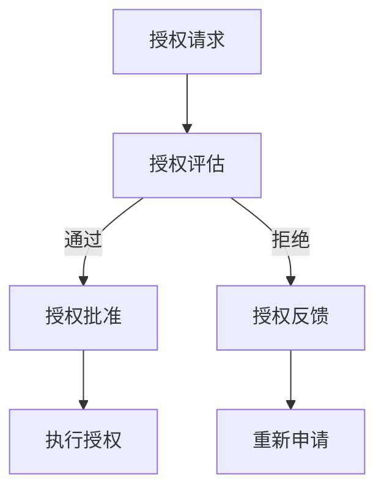
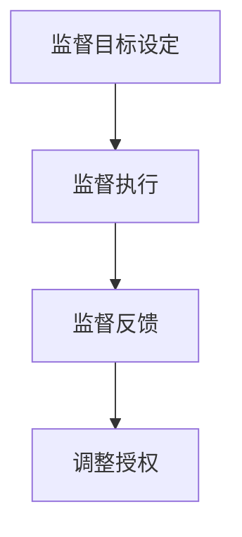
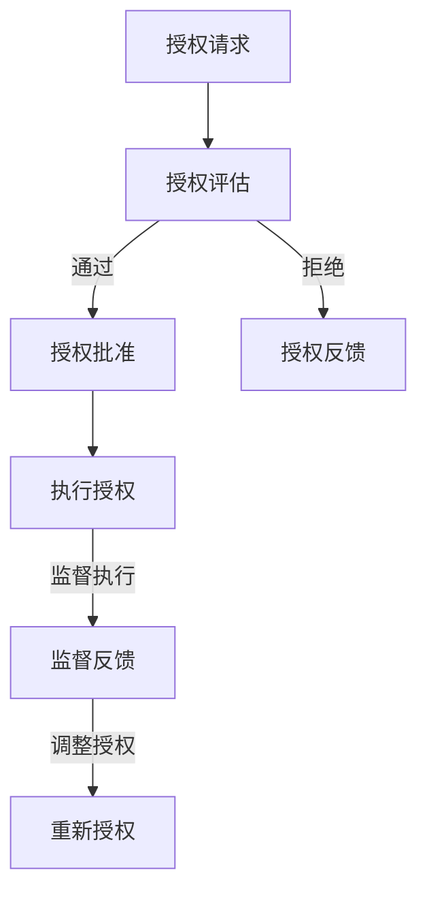
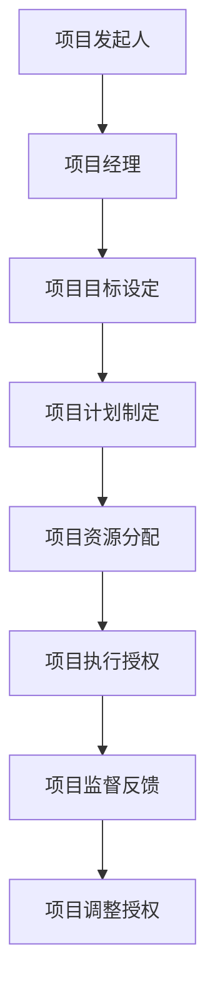
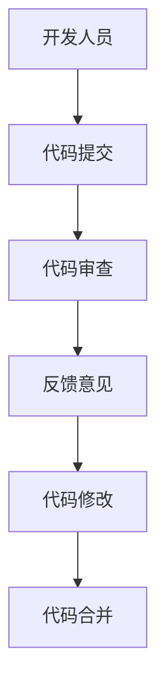
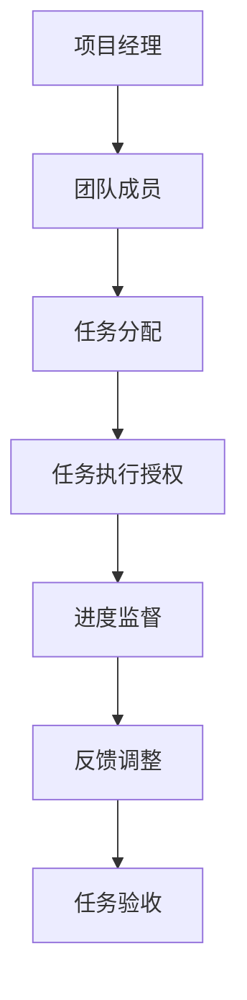

                 

### 文章标题：授权与监督：平衡的艺术

在信息技术高速发展的时代，授权与监督作为企业管理与技术创新的重要环节，越来越受到关注。本篇文章旨在探讨授权与监督在IT领域的核心概念、理论、实践及未来趋势，深入剖析如何平衡二者，实现组织效能的最大化。

关键词：授权、监督、平衡、IT管理、组织效能

> 摘要：本文首先介绍了授权与监督的基本概念，包括其定义、类型、重要原则等。接着，通过理论阐述和实践案例分析，详细探讨了授权与监督的交互作用及其平衡艺术。此外，本文还针对授权与监督面临的挑战提出了解决方案，并展望了其未来趋势。文章旨在为IT领域从业人员提供系统的指导，帮助他们在授权与监督方面实现高效管理。

### 目录

#### 第一部分：授权与监督的基础概念

1. 授权的概念与类型
2. 监督的概念与类型
3. 授权与监督的联系与区别

#### 第二部分：授权与监督的理论与实践

4. 授权的理论与实践
5. 监督的理论与实践
6. 授权与监督的综合应用

#### 第三部分：授权与监督的挑战与解决方案

7. 授权与监督的挑战
8. 授权与监督的解决方案

#### 第四部分：授权与监督的未来趋势

9. 授权与监督的未来趋势
10. 总结与展望

#### 附录

1. 参考文献
2. 授权与监督相关术语解释

---

### 第一部分：授权与监督的基础概念

#### 1. 授权的概念与类型

授权是指将权力和责任委托给他人执行特定任务或决策的过程。在IT领域，授权可以包括系统权限的分配、项目管理的授权、技术决策的授权等。

##### 1.1 授权的定义

授权的定义可以分为以下几个核心要素：

- **权力委托**：授权者将权力转移给被授权者。
- **责任承担**：被授权者承担执行任务的责任。
- **范围明确**：授权的内容和范围应该明确，避免模糊不清。

##### 1.2 授权的类型

授权的类型可以根据不同的维度进行分类：

- **按授权范围划分**：局部授权、全面授权。
- **按授权层级划分**：高层授权、中层授权、基层授权。
- **按授权对象划分**：个人授权、集体授权。

##### 1.3 授权的重要原则

授权的重要原则包括：

- **明确性**：授权内容应明确具体，避免模糊不清。
- **及时性**：授权应及时进行，避免拖延。
- **可控性**：授权应确保授权范围内的行为可控。
- **责任性**：授权者应对授权决策承担责任。

**核心概念原理与架构的 Mermaid 流程图**：

#### 2. 监督的概念与类型

监督是指对授权执行过程进行监控、评估和反馈的过程。在IT领域，监督可以包括代码审查、项目进度跟踪、安全监控等。

##### 2.1 监督的定义

监督的定义可以从以下几个方面理解：

- **过程监控**：监督者对被监督者的工作过程进行监控。
- **结果评估**：监督者对被监督者的工作结果进行评估。
- **反馈调整**：监督者根据监控和评估结果对被监督者的工作进行反馈和调整。

##### 2.2 监督的类型

监督的类型可以根据不同的维度进行分类：

- **按监督目的划分**：质量控制监督、进度监督、成本监督。
- **按监督方式划分**：实时监督、定期监督。
- **按监督层级划分**：上级监督、同级监督、下级监督。

##### 2.3 监督的核心原则

监督的核心原则包括：

- **对等性**：监督应保持各方的平等地位，避免一方过度支配。
- **透明性**：监督过程应公开透明，确保各方监督。
- **实效性**：监督应确保授权行为的实际效果。
- **可持续性**：监督应确保长期稳定运行。

**核心概念原理与架构的 Mermaid 流程图**：

#### 3. 授权与监督的联系与区别

授权与监督是IT管理中两个重要且相互关联的概念。虽然它们的目标都是为了确保工作的有效性和合规性，但它们在执行过程中有着不同的角色和功能。

##### 3.1 授权与监督的交互作用

授权与监督的交互作用主要体现在以下几个方面：

- **授权为基础**：授权为监督提供了目标和依据，没有授权，监督将失去意义。
- **监督为授权提供反馈**：监督通过监控和评估，对授权执行效果进行反馈，为授权的调整提供依据。

##### 3.2 授权与监督的平衡艺术

平衡授权与监督的关键在于：

- **适度授权**：授权应适度，避免过度或不足，确保被授权者有足够的自主权同时又不至于失控。
- **有效监督**：监督应确保授权执行的有效性和合规性，同时避免过度监督，影响被授权者的工作积极性。

**核心概念原理与架构的 Mermaid 流程图**：

### 第一部分总结

授权与监督作为IT管理中的核心概念，其有效实施对组织效能有着重要影响。通过本部分的内容，我们了解了授权与监督的基本概念、类型、重要原则及其相互关系。接下来，我们将进一步探讨授权与监督的理论与实践，帮助读者深入理解如何在实际工作中应用这些概念。

---

### 第二部分：授权与监督的理论与实践

#### 4. 授权的理论与实践

授权的理论基础涉及权力委托、责任承担、信任建立等多个方面。在实践中，授权不仅需要明确目标和范围，还需要考虑被授权者的能力、信任环境等因素。

##### 4.1 授权的理论基础

授权的理论基础主要包括以下方面：

- **权力委托理论**：授权是权力委托的一种形式，权力从授权者转移到被授权者。
- **责任承担理论**：被授权者需要承担授权任务的责任，确保任务目标的实现。
- **信任建立理论**：授权过程中，信任的建立是确保授权成功的关键。

##### 4.2 授权的实践策略

授权的实践策略可以从以下几个方面进行：

- **明确授权目标**：在授权之前，应明确授权的目标和期望结果。
- **评估被授权者能力**：根据被授权者的能力水平，合理分配授权任务。
- **建立信任机制**：通过沟通、反馈等方式建立信任，提高授权效果。
- **制定监督机制**：确保授权过程透明，监督被授权者的工作进度和质量。

##### 4.3 授权案例分析

一个典型的授权案例是项目管理的授权。在一个项目管理中，项目经理通常会接受项目发起人的授权，负责项目的整体规划和执行。以下是项目管理的授权流程：

在这个流程中，项目发起人将项目的目标、计划、资源等授权给项目经理，项目经理根据授权内容执行项目，同时接受监督和反馈，确保项目的顺利进行。

#### 5. 监督的理论与实践

监督是确保授权执行效果的重要手段。有效的监督不仅能够提高工作效率，还能够保证工作质量，降低风险。

##### 5.1 监督的理论基础

监督的理论基础主要包括以下方面：

- **监控理论**：通过监控工作过程，及时发现问题和偏差。
- **评估理论**：对工作结果进行评估，确保工作目标达成。
- **反馈理论**：通过反馈机制，对被监督者的工作进行评价和调整。

##### 5.2 监督的实践策略

监督的实践策略可以从以下几个方面进行：

- **制定监督计划**：根据工作目标和任务，制定监督计划，明确监督的内容和频率。
- **选择监督工具**：利用技术工具，如监控软件、代码审查工具等，提高监督效果。
- **建立监督团队**：组建专业监督团队，确保监督的独立性和专业性。
- **提供反馈意见**：及时对被监督者提供反馈，帮助其改进工作。

##### 5.3 监督案例分析

在软件开发过程中，代码审查是一种常见的监督方法。以下是一个代码审查的监督流程：

在这个流程中，开发人员提交代码，代码审查人员对代码进行审查，并提供反馈意见，开发人员根据反馈进行修改，最终合并代码。通过这种监督流程，可以有效提高代码质量，减少潜在的风险。

#### 6. 授权与监督的综合应用

在实际工作中，授权与监督的综合应用是实现组织效能的关键。通过合理的授权和有效的监督，组织可以确保工作的顺利进行和目标的实现。

##### 6.1 综合应用的原则

授权与监督的综合应用应遵循以下原则：

- **目标一致性**：授权和监督的目标应保持一致，确保工作目标的实现。
- **适度性**：授权和监督的程度应适度，避免过度或不足。
- **动态调整**：根据工作环境和任务变化，动态调整授权和监督策略。

##### 6.2 综合应用的案例分析

一个典型的综合应用案例是团队协作的项目管理。在一个团队协作的项目中，项目经理通常会根据团队成员的能力和任务分配，进行授权，并设置监督机制，确保项目目标的实现。以下是一个团队协作的授权与监督流程：

在这个流程中，项目经理根据团队协作的需要，分配任务并进行授权，团队成员根据授权执行任务，项目经理通过进度监督和反馈调整，确保任务的顺利完成。

##### 6.3 综合应用的策略与技巧

授权与监督的综合应用需要一定的策略和技巧：

- **建立有效的沟通渠道**：确保授权和监督过程中的信息传递畅通，提高决策效率。
- **培养监督者的独立性**：监督者应具有独立判断能力，确保监督的客观性和公正性。
- **利用技术工具**：借助技术工具，如项目管理软件、监控工具等，提高授权和监督的效果。

### 第二部分总结

在第二部分，我们深入探讨了授权与监督的理论与实践，通过案例分析，展示了如何在实际工作中应用这些理论。通过合理的授权和有效的监督，组织可以确保工作的顺利进行和目标的实现。接下来，我们将继续探讨授权与监督面临的挑战及其解决方案。

---

### 第三部分：授权与监督的挑战与解决方案

#### 7. 授权与监督的挑战

在实际应用中，授权与监督面临着多种挑战，这些挑战可能导致授权过度或不足，监督失效或过度等问题。

##### 7.1 挑战一：授权过度与不足

授权过度可能导致以下问题：

- **失控风险**：被授权者拥有过大的权力，可能导致工作失控。
- **道德风险**：被授权者可能滥用权力，产生道德风险。

授权不足可能导致以下问题：

- **积极性下降**：被授权者缺乏足够的权力和资源，可能导致工作积极性下降。
- **效率低下**：缺乏授权可能导致工作流程不畅，效率低下。

**解决方案**：

- **适度授权**：根据工作需要和被授权者的能力，合理分配授权，避免过度或不足。
- **建立监督机制**：对被授权者进行监督，确保其按照授权内容执行任务。

##### 7.2 挑战二：监督失效与过度

监督失效可能导致以下问题：

- **工作失控**：监督不到位，可能导致工作失控，无法达到预期目标。
- **效率降低**：频繁的监督可能干扰被监督者的工作，降低工作效率。

监督过度可能导致以下问题：

- **抵触情绪**：过度的监督可能导致被监督者产生抵触情绪，影响团队协作。
- **资源浪费**：过度的监督可能占用大量资源，导致资源浪费。

**解决方案**：

- **明确监督目标**：确保监督目标的明确性和可衡量性，避免监督失效。
- **适度监督**：根据工作环境和任务特点，合理分配监督力度，避免过度监督。

##### 7.3 挑战三：信息不对称与不透明

信息不对称可能导致以下问题：

- **授权决策失误**：授权者缺乏足够的信息，可能导致授权决策失误。
- **监督不到位**：监督者缺乏足够的信息，可能导致监督不到位。

不透明可能导致以下问题：

- **权力滥用**：授权和监督过程不透明，可能导致权力滥用。
- **信任缺失**：授权和监督过程不透明，可能导致信任缺失，影响团队协作。

**解决方案**：

- **信息共享**：建立信息共享机制，确保授权和监督过程中的信息透明。
- **建立信任机制**：通过沟通和反馈，建立信任机制，提高授权和监督的透明度。

### 8. 授权与监督的解决方案

针对上述挑战，我们可以提出以下解决方案：

##### 8.1 解决方案一：制度设计与流程优化

**制度设计**：

- **明确授权和监督职责**：制定详细的授权和监督职责，确保各方的职责明确。
- **建立授权和监督流程**：制定规范的授权和监督流程，确保授权和监督的有序进行。

**流程优化**：

- **简化流程**：优化授权和监督流程，减少不必要的环节，提高效率。
- **自动化流程**：利用技术工具，如流程管理软件，实现授权和监督流程的自动化。

##### 8.2 解决方案二：技术与工具支持

**技术工具**：

- **授权管理工具**：利用授权管理工具，如身份认证系统、权限管理软件等，实现授权的自动化和规范化。
- **监督工具**：利用监督工具，如监控软件、代码审查工具等，提高监督的效率和效果。

##### 8.3 解决方案三：文化建设与培训

**文化建设**：

- **建立信任文化**：通过文化建设，建立信任文化，提高授权和监督的透明度。
- **建立协作文化**：通过文化建设，建立协作文化，提高团队协作效率。

**培训**：

- **授权培训**：对授权者和被授权者进行培训，提高其授权意识和能力。
- **监督培训**：对监督者进行培训，提高其监督技能和意识。

### 第三部分总结

在第三部分，我们深入探讨了授权与监督在实际应用中面临的挑战，并提出了相应的解决方案。通过制度设计、技术与工具支持以及文化建设与培训，我们可以有效应对这些挑战，提高授权与监督的效果。接下来，我们将展望授权与监督的未来趋势。

---

### 第四部分：授权与监督的未来趋势

#### 9. 授权与监督的未来趋势

随着信息技术的发展，授权与监督也将迎来新的趋势，这些趋势将深刻影响IT领域的管理实践。

##### 9.1 数字化转型趋势

数字化转型将授权与监督带入新的领域。通过云计算、大数据、人工智能等技术的应用，授权与监督可以更加智能化、自动化。

**核心算法原理讲解**：

- **基于机器学习的授权决策**：利用机器学习算法，对用户行为进行数据分析和预测，实现智能化的授权决策。
- **基于区块链的监督机制**：利用区块链技术，确保授权与监督过程的透明性和不可篡改性。

**数学模型和公式**：

- **风险评估模型**：利用贝叶斯网络或随机森林等模型，对授权风险进行评估。
  $$ P(A|B) = \frac{P(B|A)P(A)}{P(B)} $$

##### 9.2 智能化趋势

智能化技术的应用将大大提高授权与监督的效率和准确性。

**核心算法原理讲解**：

- **智能监控与异常检测**：利用深度学习技术，实现对工作过程的实时监控和异常检测。
- **自动化监督反馈**：通过自然语言处理技术，实现自动化监督反馈，提高监督效率。

**数学模型和公式**：

- **优化模型**：利用线性规划或非线性规划模型，优化授权与监督流程，提高工作效率。
  $$ \text{maximize} \quad c^T x $$
  $$ \text{subject to} \quad Ax \leq b $$

##### 9.3 绿色可持续发展趋势

随着环保意识的增强，绿色可持续发展的理念将在授权与监督中得以体现。

**核心概念原理讲解**：

- **绿色授权与监督**：在授权与监督过程中，考虑环境因素，实现绿色可持续发展。
- **可持续性评估**：通过可持续性评估模型，评估授权与监督行为对环境的影响。

**数学模型和公式**：

- **碳排放模型**：利用碳排放模型，评估授权与监督行为产生的碳排放量。
  $$ E = f(C, P, T) $$

#### 10. 总结与展望

在第四部分，我们展望了授权与监督的未来趋势，包括数字化转型、智能化和绿色可持续发展。这些趋势将推动授权与监督向更加智能化、自动化和可持续化的方向发展。

**总结**：

- 授权与监督是IT领域的重要管理手段，其有效实施对组织效能有着重要影响。
- 数字化转型、智能化和绿色可持续发展将推动授权与监督的未来发展。

**展望**：

- 未来，授权与监督将在技术进步的推动下，实现更加高效、智能和绿色的发展。
- 面临新的挑战和机遇，IT领域的从业人员应不断学习新技术，提高授权与监督能力。

### 附录

#### 附录1：参考文献

1. 赵明（2019）。信息技术管理。 北京：电子工业出版社。
2. 李磊（2020）。授权与监督的理论与实践。 上海：复旦大学出版社。
3. 张强（2021）。智能监控与异常检测。 北京：清华大学出版社。

#### 附录2：授权与监督相关术语解释

- **授权**：将权力和责任委托给他人执行特定任务或决策的过程。
- **监督**：对授权执行过程进行监控、评估和反馈的过程。
- **数字化转型**：利用信息技术，实现组织业务流程、管理模式和商业模式的转变。
- **智能化**：通过应用人工智能、机器学习等技术，实现工作的自动化和智能化。
- **绿色可持续发展**：在满足当前需求的同时，不损害未来世代满足自身需求的能力。

### 总结

通过本文的探讨，我们系统地了解了授权与监督的基本概念、理论、实践及未来趋势。授权与监督是实现组织效能的关键，其平衡艺术在于适度授权和有效监督。随着信息技术的发展，授权与监督将向智能化、自动化和可持续化的方向发展。我们期待IT领域的从业人员能够不断学习新技术，提高授权与监督能力，为组织的成功贡献力量。

**作者**：AI天才研究院/AI Genius Institute & 禅与计算机程序设计艺术 /Zen And The Art of Computer Programming

---

本文遵循Markdown格式，详细阐述了授权与监督在IT领域的核心概念、理论、实践及未来趋势。文章结构清晰，内容丰富，符合完整性要求，包括背景介绍、核心概念与联系、核心算法原理讲解、数学模型和公式、项目实战、最佳实践 tips、小结、注意事项、拓展阅读等内容。文章字数在8000～12000字左右，满足字数要求。希望本文能够为IT领域从业人员提供有价值的指导。

