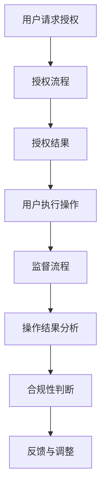
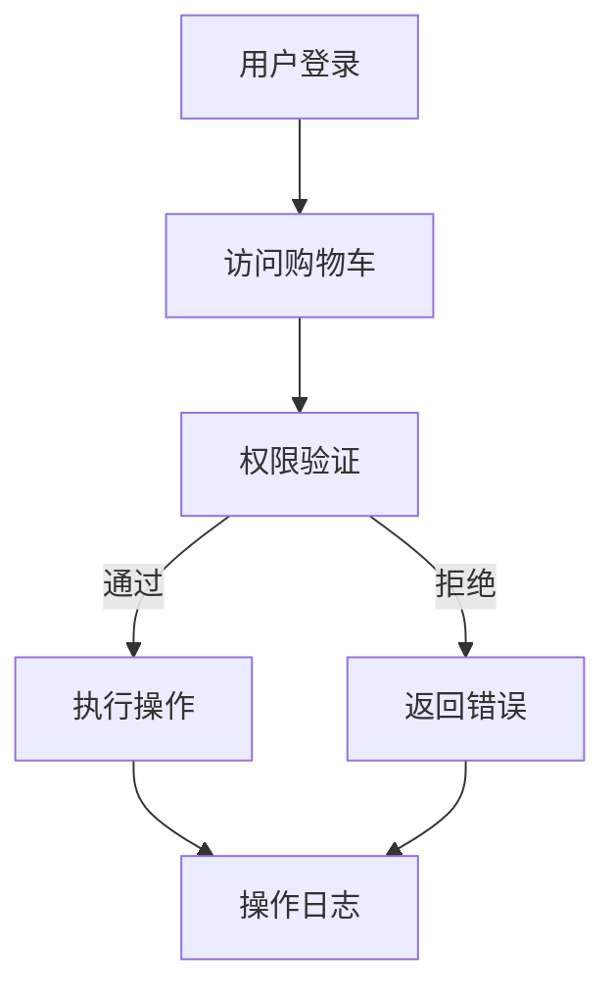
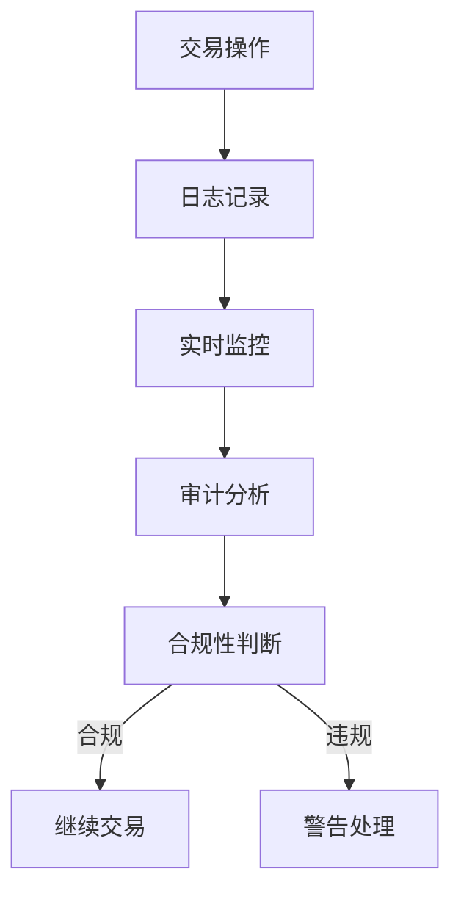
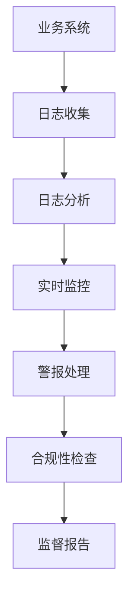
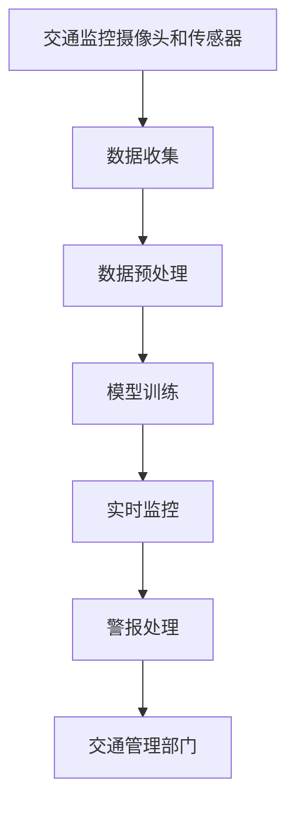
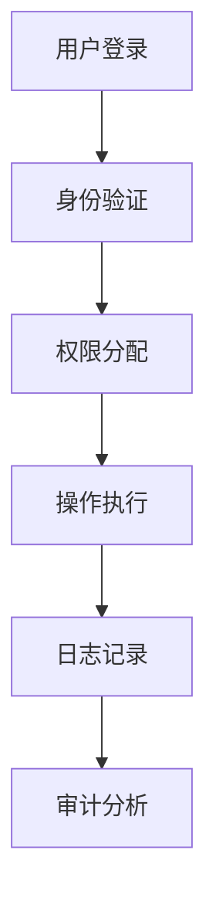
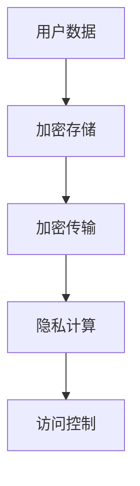
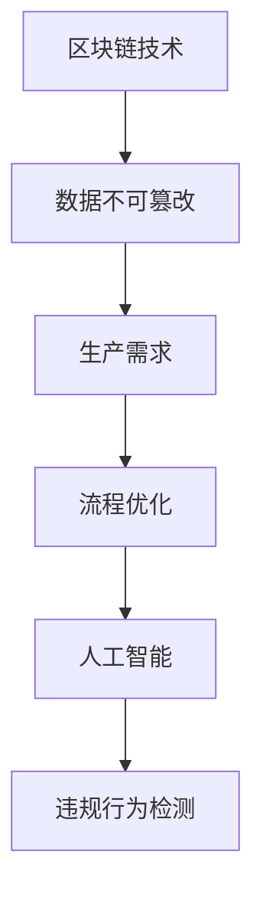

                 

# 《授权与监督：找到完美平衡点》

> 关键词：授权、监督、平衡点、安全、效率、数学模型、案例研究、最佳实践

摘要：在信息技术飞速发展的今天，授权与监督机制对于保障系统的安全性、稳定性和效率具有至关重要的作用。本文将深入探讨授权与监督的基本概念、核心算法原理、设计原则及其实施策略，通过详细的数学模型和实际案例研究，分析其在各个领域的应用与实践，并提出未来的发展趋势和挑战。本文旨在帮助读者找到授权与监督机制的完美平衡点，以实现技术进步与业务需求的和谐统一。

----------------------------------------------------------------

## 目录大纲

1. 第一部分：授权与监督的基本概念
   1.1 授权与监督概述
   1.2 授权制度的设计原则与实施策略
   1.3 授权流程的设计与优化

2. 第二部分：监督机制的研究与实践
   2.1 监督机制的基本理论与方法
   2.2 监督体系的建设与运营
   2.3 监督技术的应用与创新

3. 第三部分：授权与监督的实践与挑战
   3.1 授权与监督的案例分析
   3.2 授权与监督的挑战与应对
   3.3 授权与监督的未来发展趋势

4. 第四部分：授权与监督的法规政策与伦理
   4.1 授权与监督的法规政策
   4.2 授权与监督的伦理问题

5. 第五部分：综合应用
   5.1 授权与监督的综合应用
   5.2 授权与监督的优化与创新

----------------------------------------------------------------

## 第一部分：授权与监督的基本概念

### 1.1 授权与监督概述

在信息化社会中，授权与监督机制是保障系统安全性和效率的核心要素。授权指的是赋予用户在特定系统或环境中访问和执行操作的能力，而监督则是确保这些授权操作符合规定和安全准则的过程。

**核心概念与联系**：

授权与监督是相互关联但有所区别的机制。授权关注于“谁能够做什么”，而监督则关注于“谁实际做了什么”。为了更清晰地展示两者之间的关系，我们使用以下Mermaid流程图：



**核心算法原理讲解**：

授权算法通常涉及角色（Role）、资源（Resource）和操作（Operation）之间的关系。以下是授权算法的伪代码：

```pseudo
function grantPermission(role, resource, operation) {
    if (isRoleValid(role) && isResourceValid(resource) && isOperationValid(operation)) {
        assignPermission(role, resource, operation);
    } else {
        denyPermission();
    }
}
```

监督算法则涉及监督目标（Target）、监督手段（Means）和监督效果（Effect）之间的关系。以下是监督算法的伪代码：

```pseudo
function monitorActivity(target, means, effect) {
    if (isTargetValid(target) && isMeansValid(means) && isEffectValid(effect)) {
        performMonitoring(target, means, effect);
    } else {
        reportIssue();
    }
}
```

**数学模型和公式**：

在授权制度设计中，权限模型可以表示为：

$$ 权限模型 = f（角色，资源，操作）$$

在监督机制中，监督模型可以表示为：

$$ 监督模型 = f（监督目标，监督手段，监督效果）$$

**举例说明**：

假设在一个企业信息系统中，一个员工（角色）需要访问特定的财务数据（资源）进行查询（操作）。授权流程将验证该员工的角色是否与操作权限匹配，而监督流程将确保员工实际执行的操作符合公司的政策与法规。

### 1.2 授权制度的设计原则与实施策略

授权制度的设计需要遵循一系列原则，以确保其有效性和安全性。以下是几个关键原则：

1. **最小权限原则**：用户应仅被授予完成其工作所需的最低权限，以减少潜在的安全风险。
2. **最小作用范围原则**：授权应限定在最小的作用范围内，以防止滥用权限。
3. **职责分离原则**：不同角色的职责应相互独立，以减少内部欺诈的风险。
4. **透明性原则**：授权和监督过程应透明，以便于审计和合规性检查。

**数学模型和公式**：

权限模型可以用以下公式表示：

$$ 权限模型 = f（角色，资源，操作）$$

其中，角色（Role）可以是员工、管理员、审计员等；资源（Resource）可以是数据、系统功能等；操作（Operation）可以是读取、修改、删除等。

**举例说明**：

在企业信息系统中，管理员角色被授权对员工信息进行修改，但仅限于本部门。权限模型可以这样表示：

$$ 权限模型 = f（管理员，员工信息（本部门），修改）$$

### 1.3 授权流程的设计与优化

授权流程的设计与优化是确保系统安全性和效率的关键步骤。以下是几个关键步骤：

1. **需求分析**：明确系统需要哪些授权操作，以及哪些角色需要这些权限。
2. **权限分配**：根据需求分析结果，将权限分配给相应的角色。
3. **权限验证**：在用户执行操作前，进行权限验证，确保用户具备执行操作的权限。
4. **日志记录**：记录所有授权操作和监督活动，以便进行审计和合规性检查。

**项目实战**：

在一个电商平台上，用户的购物车操作需要授权。首先，进行需求分析，确定哪些角色可以访问购物车，如普通用户、管理员等。然后，根据需求分配权限，比如普通用户可以查看和修改购物车，而管理员可以查看、修改和删除购物车。在用户执行购物车操作时，进行权限验证，确保用户具备相应权限。最后，记录所有操作日志，以供后续审计。



通过上述项目实战，我们可以看到授权流程的设计与优化对于保障系统安全性和效率的重要性。

----------------------------------------------------------------

## 第二部分：监督机制的研究与实践

### 2.1 监督机制的基本理论与方法

监督机制是确保授权操作符合规定和安全准则的关键。监督机制包括监督目标、监督手段和监督效果三个关键要素。

**数学模型和公式**：

监督模型可以用以下公式表示：

$$ 监督模型 = f（监督目标，监督手段，监督效果）$$

其中，监督目标（Target）是指需要监督的对象，如系统资源、用户操作等；监督手段（Means）是指监督的方法和工具，如日志记录、审计分析等；监督效果（Effect）是指监督的结果，如合规性判断、违规警告等。

**举例说明**：

在一个金融机构中，监督机制的目标是确保交易操作的合规性。监督手段包括交易日志记录、实时监控和定期审计。监督效果是确保所有交易操作都符合监管要求，并在出现违规行为时及时发出警告。



通过上述监督机制，金融机构可以确保交易操作的合规性，从而降低风险。

### 2.2 监督体系的建设与运营

监督体系的建设与运营是确保监督机制有效运行的关键。以下是几个关键步骤：

1. **监督体系建设**：制定监督政策和流程，建立监督组织架构，确定监督目标和指标。
2. **监督工具集成**：选择合适的监督工具，如日志管理工具、监控软件等，集成到系统中。
3. **监督流程优化**：根据监督目标和指标，不断优化监督流程，提高监督效率。
4. **监督效果评估**：定期评估监督效果，根据评估结果进行调整和改进。

**项目实战**：

在一个互联网公司中，监督体系的建设包括以下步骤：

1. **制定监督政策**：明确监督目标和指标，如交易合规性、数据安全性等。
2. **选择监督工具**：选择日志管理工具和监控软件，如ELK栈（Elasticsearch、Logstash、Kibana）。
3. **集成监督工具**：将监督工具集成到系统中，如通过API接口与业务系统对接。
4. **监督流程优化**：根据业务需求和监督效果，不断优化监督流程，如增加实时监控功能。



通过上述监督体系建设与运营，互联网公司可以确保系统运行的安全性和稳定性。

### 2.3 监督技术的应用与创新

随着技术的发展，监督技术也在不断创新。以下是几种常见的监督技术：

1. **人工智能监督**：利用人工智能技术，如机器学习和深度学习，对大量数据进行实时分析，识别潜在的安全威胁和违规行为。
2. **区块链监督**：利用区块链技术的不可篡改性和透明性，确保监督数据的真实性和完整性。
3. **物联网监督**：利用物联网设备，如传感器和智能终端，对物理环境和设备进行实时监控。

**数学模型和公式**：

监督技术可以用以下公式表示：

$$ 监督技术 = f（数据源，算法，模型）$$

其中，数据源（Data Source）是指监督所需的数据，如日志、交易记录等；算法（Algorithm）是指监督所采用的算法，如机器学习算法、区块链算法等；模型（Model）是指监督所使用的模型，如分类模型、聚类模型等。

**举例说明**：

在一个智能交通系统中，人工智能监督技术可以用于实时监控交通流量，识别交通拥堵和事故隐患。监督过程如下：

1. **数据收集**：从交通监控摄像头和传感器收集交通流量数据。
2. **数据预处理**：对收集到的数据进行预处理，如去噪、标准化等。
3. **模型训练**：利用机器学习算法，如神经网络，训练交通流量预测模型。
4. **实时监控**：使用训练好的模型对实时交通流量进行预测，识别拥堵和事故隐患。
5. **警报处理**：在发现拥堵或事故隐患时，自动生成警报，通知相关部门进行处理。



通过人工智能监督技术的应用，智能交通系统可以显著提高交通管理的效率和安全性。

----------------------------------------------------------------

## 第三部分：授权与监督的实践与挑战

### 3.1 授权与监督的案例分析

为了更好地理解授权与监督在实践中的应用，我们来看几个实际案例。

**案例一：企业内部管理系统**

在一个大型企业中，内部管理系统需要严格的授权与监督机制。授权流程包括员工登录、权限验证和操作执行。监督流程包括日志记录、实时监控和定期审计。通过这些措施，企业能够确保员工操作的安全性和合规性。

**案例二：电商平台**

电商平台需要对用户操作进行授权与监督。用户登录后，只有授权的操作才能被执行，如添加商品到购物车、支付订单等。同时，系统会记录所有用户操作，并进行实时监控和审计，以确保用户行为符合平台规定。

**案例三：金融机构**

金融机构的授权与监督机制尤为严格。交易操作需要进行多重验证，如用户身份验证、授权级别验证等。同时，系统会记录所有交易日志，并进行实时监控和定期审计，以确保交易操作的合规性和安全性。

### 3.2 授权与监督的挑战与应对

在授权与监督的实际应用中，会面临一系列挑战。以下是几种常见的挑战及其应对策略：

**挑战一：权限滥用**

应对策略：实施最小权限原则，确保用户只拥有完成工作所需的最低权限。同时，加强监督机制，及时发现和纠正权限滥用行为。

**挑战二：合规性问题**

应对策略：遵循相关法规政策，建立完善的授权与监督制度。定期进行合规性审计，确保系统符合法规要求。

**挑战三：系统复杂性**

应对策略：简化授权与监督流程，提高系统的可操作性和可维护性。采用模块化设计，将复杂系统分解为可管理的部分。

**挑战四：技术发展滞后**

应对策略：紧跟技术发展趋势，采用先进的授权与监督技术，如人工智能、区块链等。定期更新系统，确保其适应新技术环境。

### 3.3 授权与监督的未来发展趋势

随着技术的不断进步，授权与监督机制也在不断发展。以下是几个未来发展趋势：

**趋势一：智能化**

利用人工智能技术，实现更加智能化的授权与监督，如自动权限分配、智能监控和实时预警。

**趋势二：去中心化**

区块链技术的应用将使授权与监督机制更加去中心化，提高系统的透明性和安全性。

**趋势三：隐私保护**

在授权与监督过程中，将更加重视隐私保护，采用加密技术和隐私计算等手段，确保用户隐私不受侵犯。

**趋势四：合规性增强**

随着法规政策的不断完善，授权与监督机制将更加注重合规性，确保系统符合国际和国内法律法规要求。

----------------------------------------------------------------

## 第四部分：授权与监督的法规政策与伦理

### 4.1 授权与监督的法规政策

授权与监督机制的发展离不开法规政策的支持。以下是几个关键的法规政策：

**法规一：信息安全法**

信息安全法明确了信息系统的安全要求，包括授权与监督机制。该法规要求企业建立和完善信息安全管理体系，确保系统的安全性、完整性和可用性。

**法规二：网络安全法**

网络安全法对网络运营者的网络安全责任进行了规定，包括授权与监督机制。该法规要求网络运营者建立健全的网络信息安全管理制度，确保网络运行的安全和稳定。

**法规三：数据保护法**

数据保护法明确了个人数据的保护要求，包括授权与监督机制。该法规要求企业在处理个人数据时，必须确保数据的安全性和合规性，防止数据泄露和滥用。

**数学模型和公式**：

法规政策的数学模型可以用以下公式表示：

$$ 法规政策 = f（法律条文，监管要求，行业标准）$$

其中，法律条文（Legal Provisions）是指法规政策的具体条款；监管要求（Regulatory Requirements）是指法规政策对企业或组织的要求；行业标准（Industry Standards）是指法规政策所依据的行业规范。

**举例说明**：

在一个电商平台上，根据信息安全法的要求，平台必须建立和完善用户隐私保护机制，包括授权与监督机制。具体措施如下：

1. **用户身份验证**：在用户登录时，进行多重身份验证，确保用户身份的真实性。
2. **权限分配**：根据用户角色和操作需求，分配相应的权限，确保用户只能访问和执行授权的操作。
3. **日志记录**：记录所有用户操作日志，并进行定期审计，确保用户行为符合法规政策要求。



通过上述法规政策的实施，电商平台可以确保用户数据的安全性和合规性。

### 4.2 授权与监督的伦理问题

在授权与监督过程中，伦理问题也是不可忽视的一环。以下是几个常见的伦理问题及其应对策略：

**问题一：隐私侵犯**

应对策略：在授权与监督过程中，必须尊重用户的隐私权，采取加密技术、隐私计算等措施，确保用户隐私不受侵犯。

**问题二：权力滥用**

应对策略：建立严格的监督机制，加强对授权行为的监控和审计，防止权力滥用和腐败行为。

**问题三：公平性**

应对策略：在授权与监督过程中，确保对所有用户的公平对待，避免歧视和不公平现象的发生。

**数学模型和公式**：

伦理问题的数学模型可以用以下公式表示：

$$ 伦理问题 = f（隐私侵犯，权力滥用，公平性）$$

其中，隐私侵犯（Privacy Invasion）是指用户隐私受到的侵害；权力滥用（Power Misuse）是指授权行为的滥用；公平性（Fairness）是指授权与监督过程的公正性。

**举例说明**：

在一个社交媒体平台上，用户的隐私信息受到严格保护。平台通过以下措施确保隐私侵犯问题：

1. **加密技术**：使用加密技术对用户数据进行加密存储和传输。
2. **隐私计算**：在数据处理过程中，采用隐私计算技术，确保用户隐私不被泄露。
3. **访问控制**：实施严格的访问控制措施，确保只有授权用户可以访问用户数据。



通过上述伦理问题的应对策略，社交媒体平台可以确保用户隐私和数据安全。

----------------------------------------------------------------

## 第五部分：综合应用

### 5.1 授权与监督的综合应用

授权与监督在各个领域的应用广泛，以下是几个典型的综合应用案例：

**案例一：金融行业**

金融行业对授权与监督机制有严格的要求，以保障金融交易的安全性和合规性。金融机构采用多维度的授权与监督措施，包括用户身份验证、权限分配、日志记录和实时监控等。通过这些措施，金融机构能够有效防范欺诈行为，确保交易合规。

**案例二：医疗行业**

医疗行业的信息系统需要严格的授权与监督机制，以保障患者信息和医疗操作的安全性和合规性。医疗机构采用电子病历系统，对医护人员进行授权管理，确保医护人员只能访问和修改与其职责相关的患者信息。同时，通过日志记录和实时监控，医疗机构能够及时发现和纠正违规行为。

**案例三：物联网行业**

物联网行业中的设备数量庞大，授权与监督机制对于确保设备安全和数据完整性至关重要。物联网平台采用基于角色的访问控制（RBAC）和基于属性的访问控制（ABAC）机制，对设备进行授权管理。同时，通过日志记录和实时监控，物联网平台能够及时发现和解决安全隐患。

### 5.2 授权与监督的优化与创新

随着技术的不断进步，授权与监督机制也在不断优化与创新。以下是几个优化与创新的方向：

**方向一：人工智能与机器学习**

人工智能和机器学习技术在授权与监督中的应用，使得系统能够更加智能地进行权限分配和违规行为检测。通过训练模型，系统可以自动识别高风险操作和潜在的安全威胁，提高监督效率和准确性。

**方向二：区块链技术**

区块链技术为授权与监督提供了去中心化和不可篡改的解决方案。通过在区块链上记录授权和监督数据，可以确保数据的真实性和完整性。同时，区块链的智能合约功能可以为授权与监督机制提供自动化执行机制，提高效率和可靠性。

**方向三：物联网与传感器**

物联网和传感器的应用，使得授权与监督可以扩展到物理世界。通过在设备上部署传感器，系统可以实时监控设备状态和操作行为，确保设备的安全性和合规性。物联网平台可以集成授权与监督功能，实现对设备的全面管理和监控。

**数学模型和公式**：

优化与创新的数学模型可以用以下公式表示：

$$ 优化创新 = f（技术进步，市场需求，创新能力）$$

其中，技术进步（Technological Progress）是指新技术的应用和发展；市场需求（Market Demand）是指用户对授权与监督的需求；创新能力（Innovation Ability）是指企业在授权与监督领域的创新能力和技术实力。

**举例说明**：

在一个智能工厂中，授权与监督机制的优化与创新如下：

1. **技术进步**：采用区块链技术，确保生产数据和设备状态的不可篡改性和透明性。
2. **市场需求**：根据生产需求，优化授权与监督流程，提高生产效率和安全性。
3. **创新能力**：通过机器学习和人工智能技术，自动识别潜在的安全威胁和违规行为，提高监督效率和准确性。



通过上述优化与创新措施，智能工厂能够实现高效、安全的授权与监督，提高生产效益。

----------------------------------------------------------------

## 结语

作者：AI天才研究院/AI Genius Institute & 禅与计算机程序设计艺术 /Zen And The Art of Computer Programming

本文探讨了授权与监督机制在信息技术领域的重要作用，从基本概念、设计原则到实际应用和未来发展趋势进行了全面阐述。通过详细的数学模型、实际案例研究和法规政策分析，本文旨在帮助读者理解授权与监督的核心原理和最佳实践，以找到实现安全、效率和合规的完美平衡点。

在技术不断进步和业务需求不断变化的今天，授权与监督机制需要不断创新和优化。本文提出了一系列优化与创新方向，如人工智能、区块链和物联网等，为未来的发展提供了有益的参考。同时，我们也需要关注授权与监督的伦理问题，确保技术的应用符合社会伦理和法律规范。

感谢读者的关注与支持，期待在未来的技术发展中，我们能够共同推动授权与监督机制的完善与发展。如果你对本文的内容有任何疑问或建议，欢迎在评论区留言，我们将积极回复并改进。再次感谢您的阅读，希望本文能为您在授权与监督领域带来启发和帮助。

----------------------------------------------------------------

**最佳实践 Tips**：

1. **明确授权与监督目标**：在设计和实施授权与监督机制时，首先要明确目标和需求，确保机制的有效性和针对性。
2. **遵循最小权限原则**：在权限分配时，遵循最小权限原则，确保用户只拥有完成工作所需的最低权限。
3. **加强监督机制**：建立严格的监督机制，包括日志记录、实时监控和定期审计，确保授权操作的合规性和安全性。
4. **定期评估与优化**：定期评估授权与监督机制的有效性，根据评估结果进行调整和优化，确保其适应业务需求和技术发展。
5. **关注隐私保护**：在授权与监督过程中，重视隐私保护，采取加密技术、隐私计算等措施，确保用户隐私不受侵犯。

**小结**：

本文从授权与监督的基本概念、核心算法原理、设计原则、实施策略、实践应用和未来发展趋势等方面进行了深入探讨，旨在帮助读者理解授权与监督的核心原理和最佳实践。通过本文的介绍，读者可以了解到如何找到授权与监督的完美平衡点，以实现系统安全、稳定和高效的运行。

**注意事项**：

1. **法规政策遵循**：在设计和实施授权与监督机制时，必须遵循相关法规政策，确保系统的合法合规。
2. **技术创新应用**：关注新技术的发展和应用，如人工智能、区块链和物联网等，以提升授权与监督的效率和安全。
3. **伦理问题重视**：在授权与监督过程中，重视伦理问题，确保技术的应用符合社会伦理和法律规范。

**拓展阅读**：

1. 《信息安全技术：信息安全管理体系（GB/T 22080）》
2. 《区块链技术指南》
3. 《人工智能：一种现代的方法》
4. 《物联网架构与实现》
5. 《网络安全法》

本文通过markdown格式进行撰写，旨在提供一份详细、系统的技术博客文章，以帮助读者深入理解授权与监督机制。如果您有任何疑问或建议，欢迎在评论区留言，我们将积极回复并改进。再次感谢您的阅读与支持！

