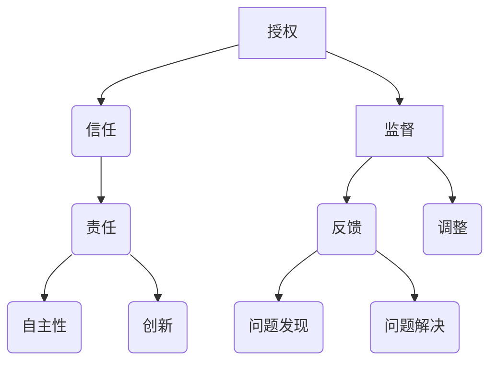

                 


### 背景介绍

在现代企业管理中，授权与监督是确保团队高效运作和目标达成的两个关键因素。然而，如何在两者之间找到完美平衡点，是一个极具挑战性的问题。授权不足可能导致团队缺乏自主性和创新精神，而过度授权则可能导致管理失控，影响整体绩效。

授权，是指上级将部分权力和责任赋予下属，使其能够在更大的范围内独立决策和工作。授权的核心在于激发团队成员的潜力和创造力，提高团队的工作效率。然而，如果授权不当，可能会导致团队成员滥用权力，或者由于缺乏指导而工作质量下降。

监督，则是管理者对团队成员工作进行跟踪、评估和反馈的过程。有效的监督可以帮助管理者了解团队的工作状态，及时发现问题并进行调整。然而，过度的监督可能会抑制团队成员的自主性和积极性，影响团队的整体氛围。

在现实中，很多企业在授权与监督方面面临诸多挑战。例如，一些管理者担心授权会降低自己的控制力，因此不敢真正授权；另一些管理者则可能因为对团队成员的信任不足，导致监督过于严苛。这些问题的存在，不仅影响了团队的工作效率，还可能导致员工流失和团队士气低落。

本文将深入探讨授权与监督的核心概念、实践指南、工具与方法，以及进阶技巧。通过一步步的分析和推理，帮助读者找到授权与监督之间的完美平衡点，从而提升团队的整体绩效。

### 核心概念与联系

为了深入理解授权与监督的关系，首先需要明确它们的核心概念。授权，是指管理者将一部分权力和责任下放给团队成员，让他们在更大范围内独立决策和行动。这一过程的核心在于信任和责任，管理者通过授权，可以激发团队成员的自主性和创新能力，从而提高团队的整体绩效。

监督，则是管理者对团队成员工作进行跟踪、评估和反馈的过程。有效的监督可以帮助管理者了解团队的工作状态，及时发现和解决问题，确保团队目标的达成。监督不仅包括对团队成员工作结果的评估，还涉及对工作过程、工作方法和工作态度的监督。

授权与监督之间的关系可以用一个Mermaid流程图来表示：



在这个流程图中，授权（A）首先建立信任（B）和责任（C），这为团队成员的自主性（G）和创新（H）提供了基础。同时，授权也引入了监督（D），通过反馈（E）和调整（F），确保团队目标的达成。反馈（E）不仅包括对工作结果的评估，还包括对工作过程、方法和态度的监督，帮助管理者及时发现问题并进行调整（J）。

这种关系表明，授权与监督并不是对立的，而是相辅相成的。授权为团队提供了自由和创新的氛围，而监督则确保了团队在正确的轨道上前进。如果两者能够得到平衡，就可以最大化地激发团队的潜力，提高整体绩效。

例如，在一个开发团队中，项目经理可以授权开发人员自主决定如何实现功能，同时通过定期的进度报告和代码评审来监督团队的工作。这种授权与监督的结合，既能保证项目的按时完成，又能激发开发人员的创造力和积极性。

总的来说，理解授权与监督的核心概念和它们之间的关系，是找到完美平衡点的第一步。通过合理的授权，团队可以发挥最大的自主性和创新能力；通过有效的监督，团队可以确保目标的达成和问题的及时解决。只有在这两者之间找到平衡，团队才能实现高效运作。

### 授权模型与监督模型

为了更好地理解授权与监督的机制，我们可以引入授权模型和监督模型。这两种模型不仅帮助我们理解授权和监督的具体操作方式，还可以指导我们在实际工作中如何有效地实施这些策略。

#### 授权模型

授权模型主要包括以下三个核心组成部分：授权级别、授权范围和授权方式。

1. **授权级别**：授权级别是指授权的深度和广度，通常可以分为四个层次：
   - **决策授权**：团队成员可以在特定的决策范围内进行决策，如技术选型、资源分配等。
   - **任务授权**：团队成员可以在特定的任务范围内自主完成任务，如编写代码、测试等。
   - **责任授权**：团队成员在授权范围内需要对自己的工作结果承担责任，如项目交付、质量保证等。
   - **战略授权**：团队成员可以在更大范围内参与战略决策，如产品规划、市场策略等。

2. **授权范围**：授权范围是指授权内容的具体范围，通常包括以下几个方面：
   - **职责范围**：团队成员可以在其职责范围内进行自主决策和工作。
   - **决策范围**：团队成员可以自主决定某些具体事项，如技术方案、预算分配等。
   - **资源范围**：团队成员可以在授权范围内使用特定资源，如设备、资金等。

3. **授权方式**：授权方式是指授权的传递方式和形式，常见的授权方式包括：
   - **书面授权**：通过正式的书面文件或合同进行授权。
   - **口头授权**：通过口头沟通进行授权，适用于一些临时性或小规模的授权。
   - **团队授权**：在团队内部进行授权，确保团队成员之间有清晰的分工和协作。

以下是一个授权模型的伪代码表示：

```python
def grant_authority(member, level, range, mode):
    if mode == 'written':
        document_authority(member, level, range)
    elif mode == 'verbal':
        verbal_authority(member, level, range)
    elif mode == 'team':
        team_authority(member, level, range)
    else:
        raise ValueError("Invalid authorization mode")
```

#### 监督模型

监督模型主要包括以下四个核心组成部分：监督目标、监督内容、监督方式和监督反馈。

1. **监督目标**：监督目标是监督过程的出发点，通常包括以下几个方面：
   - **确保目标达成**：确保团队成员的工作结果符合预期目标。
   - **提升工作质量**：通过监督提升团队成员的工作质量和工作效率。
   - **促进团队协作**：通过监督促进团队成员之间的沟通和协作。

2. **监督内容**：监督内容是监督过程中需要关注的重点，通常包括以下几个方面：
   - **工作进度**：监督团队成员的工作进度，确保项目按时完成。
   - **工作质量**：评估团队成员的工作成果，确保工作质量达到标准。
   - **工作方法**：监督团队成员的工作方法，提供改进建议。
   - **工作态度**：观察团队成员的工作态度，激励团队积极向上。

3. **监督方式**：监督方式是监督过程中的具体操作手段，常见的监督方式包括：
   - **定期检查**：定期检查团队成员的工作进度和质量。
   - **绩效评估**：通过绩效评估来评价团队成员的工作表现。
   - **反馈沟通**：与管理者和团队成员进行定期反馈沟通，了解工作情况和问题。

4. **监督反馈**：监督反馈是监督过程的重要环节，通过反馈可以帮助团队成员改进工作，提升整体绩效。监督反馈通常包括以下几个方面：
   - **正面反馈**：对团队成员的工作表现给予肯定和鼓励。
   - **改进建议**：对团队成员的工作提出具体的改进建议。
   - **问题解决**：帮助团队成员解决工作中遇到的问题。

以下是一个监督模型的伪代码表示：

```python
def supervise(member, target, content, mode):
    if mode == 'routine':
        routine_check(member, content)
    elif mode == 'evaluation':
        performance_evaluation(member, content)
    elif mode == 'feedback':
        feedback_communication(member, content)
    else:
        raise ValueError("Invalid supervision mode")
```

通过授权模型和监督模型，我们可以清晰地了解授权和监督的具体操作方式。在实际应用中，管理者可以根据具体情况灵活运用这些模型，找到授权与监督之间的平衡点，从而提高团队的整体绩效。例如，在一个研发团队中，项目经理可以通过授权模型明确团队成员的职责和权限，同时通过监督模型定期检查项目进度和质量，确保项目顺利完成。

总之，授权模型和监督模型为我们提供了一个系统化的框架，帮助我们更好地理解授权与监督的机制，并在实际工作中有效实施这些策略。通过合理的授权和有效的监督，团队可以发挥最大的潜力，实现目标的高效达成。

### 实际案例解析

为了更好地理解授权与监督在现实中的应用，我们通过几个实际案例来详细剖析这两种策略的实施过程及其效果。

#### 案例一：创业公司提升团队效率

**背景**：ABC创业公司是一家初创科技公司，负责开发一款智能助手应用。由于公司规模较小，团队成员相对年轻，缺乏管理经验。在项目开发初期，公司管理层发现项目进度缓慢，团队士气低落。

**授权策略**：
- **决策授权**：管理层决定将部分技术决策权下放给技术团队，允许他们根据实际情况进行技术选型和工具选择。
- **任务授权**：管理层明确团队成员的任务范围，允许他们在各自的职责范围内独立完成任务。

**监督策略**：
- **定期检查**：管理层每周召开一次进度会议，检查项目进度和团队工作状态。
- **绩效评估**：管理层通过项目进度报告和代码评审来评估团队成员的工作质量。

**效果**：
- 通过授权，团队成员感受到了信任和责任感，积极性大大提高，工作效率显著提升。
- 通过监督，管理层能够及时发现并解决项目中存在的问题，确保项目按时完成。

**总结**：这个案例表明，合理的授权可以激发团队成员的积极性和创造力，而有效的监督可以确保团队在正确的方向上前进，实现目标的高效达成。

#### 案例二：大型企业优化团队协作

**背景**：XYZ公司是一家大型跨国企业，负责多个项目的开发和维护。由于项目复杂度较高，团队协作效率成为一大挑战。

**授权策略**：
- **战略授权**：公司高层决定在某些项目上进行战略授权，允许项目经理在更大范围内进行决策，如预算分配和人员调度。
- **任务授权**：项目经理明确团队成员的任务和职责，允许他们在各自的职责范围内独立完成任务。

**监督策略**：
- **绩效评估**：公司引入了KPI（关键绩效指标）系统，对团队成员的工作绩效进行量化评估。
- **反馈沟通**：项目经理定期与团队成员进行一对一的反馈沟通，了解他们的工作情况和问题。

**效果**：
- 通过战略授权，项目经理能够更灵活地调整团队资源，提高项目完成效率。
- 通过绩效评估和反馈沟通，公司管理层能够全面了解团队的工作状态，及时调整管理策略。

**总结**：这个案例说明，在大型企业中，合理的授权和有效的监督是确保团队协作效率和项目成功的关键。通过战略授权，可以激发项目经理的主动性和创造力；通过绩效评估和反馈沟通，可以确保团队在正确的轨道上前进。

#### 案例三：软件开发团队提升产品质量

**背景**：一个软件开发团队在负责一个重要项目时，发现产品质量不稳定，频繁出现bug。

**授权策略**：
- **任务授权**：团队领导将部分代码审查的任务下放给经验丰富的开发人员，确保代码质量。
- **责任授权**：明确每个开发人员的代码质量责任，要求他们在提交代码前进行严格的自检。

**监督策略**：
- **代码评审**：团队引入了代码评审机制，要求每次提交代码时都要经过评审。
- **缺陷跟踪**：使用缺陷跟踪工具对发现的bug进行记录和跟踪，确保问题得到及时解决。

**效果**：
- 通过任务授权和责任授权，团队成员对代码质量有了更高的责任感和使命感。
- 通过代码评审和缺陷跟踪，项目团队能够及时发现并解决代码中的问题，显著提高了产品质量。

**总结**：这个案例表明，在软件开发项目中，合理的授权和有效的监督是确保产品质量的关键。通过明确的任务和责任分配，可以提升团队成员的质量意识；通过代码评审和缺陷跟踪，可以确保代码质量的持续改进。

综上所述，这些实际案例展示了授权与监督在不同情境下的具体应用和效果。通过合理的授权，可以激发团队成员的积极性和创造力；通过有效的监督，可以确保团队在正确的轨道上前进，实现目标的高效达成。这些案例为我们提供了宝贵的经验，帮助我们更好地理解和应用授权与监督策略。

### 工具与技术的应用

在现代企业管理中，为了更高效地实施授权与监督，使用合适的工具和技术至关重要。以下是一些常用的工具和技术，以及它们在授权与监督中的应用。

#### 项目管理工具

1. **Trello**：Trello 是一款可视化的项目管理工具，可以帮助团队清晰地划分任务和责任。团队成员可以在这个平台上创建任务卡，并将任务分配给不同的成员。Trello 的看板视图使得团队成员能够实时跟踪任务的进展情况，提高协作效率。

   ```mermaid
   graph TD
       A[创建任务卡] --> B(分配成员)
       B --> C[任务看板视图]
       C --> D[实时跟踪进展]
   ```

2. **JIRA**：JIRA 是一款功能强大的项目管理工具，广泛应用于软件开发团队。JIRA 提供了任务追踪、敏捷开发、需求管理等多种功能，可以帮助团队高效地分配任务和跟踪进度。同时，JIRA 的报告功能可以帮助管理者实时了解团队的工作状态。

   ```mermaid
   graph TD
       A[任务分配] --> B(进度跟踪)
       B --> C[实时报告]
       C --> D[问题反馈]
   ```

#### 绩效评估工具

1. **Google Analytics**：Google Analytics 是一款功能强大的数据分析工具，可以帮助团队评估团队成员的工作绩效。通过分析用户行为数据、网站流量等指标，团队可以了解每个成员的贡献和工作效果。

   ```mermaid
   graph TD
       A[用户行为分析] --> B(工作效果评估)
       B --> C[改进建议]
   ```

2. **Tableau**：Tableau 是一款数据可视化工具，可以帮助团队将复杂的数据以直观的方式展示出来。通过创建各种图表和仪表盘，团队可以清晰地了解绩效指标，及时调整工作策略。

   ```mermaid
   graph TD
       A[数据收集] --> B(数据可视化)
       B --> C[绩效评估]
       C --> D[策略调整]
   ```

#### 代码管理工具

1. **Git**：Git 是一款分布式版本控制系统，广泛应用于软件开发过程中。通过Git，团队可以方便地进行代码的版本管理和协作开发。Git 的分支管理功能可以帮助团队成员独立开发，减少代码冲突，提高开发效率。

   ```mermaid
   graph TD
       A[代码版本管理] --> B(分支管理)
       B --> C[代码协作开发]
   ```

2. **GitHub**：GitHub 是基于Git的代码托管平台，提供了丰富的协作功能。通过GitHub，团队成员可以方便地提交代码、进行代码评审和合并请求，确保代码质量的持续提升。

   ```mermaid
   graph TD
       A[代码提交] --> B(代码评审)
       B --> C[合并请求]
       C --> D[代码合并]
   ```

#### 效率工具

1. **Slack**：Slack 是一款团队沟通工具，可以帮助团队成员高效地进行实时沟通和协作。通过Slack，团队可以创建各种频道，方便地讨论项目进展和解决问题。

   ```mermaid
   graph TD
       A[实时沟通] --> B(项目讨论)
       B --> C[问题反馈]
   ```

2. **Asana**：Asana 是一款全面的项目管理工具，可以帮助团队更好地进行任务分配和进度跟踪。Asana 的任务管理和甘特图功能可以帮助团队清晰地了解项目的进展情况，确保任务按时完成。

   ```mermaid
   graph TD
       A[任务分配] --> B(进度跟踪)
       B --> C[甘特图视图]
   ```

通过以上工具和技术的应用，团队可以更高效地实施授权与监督。这些工具不仅帮助团队明确任务分配和责任，还提供了实时的进度跟踪和绩效评估功能，确保团队在正确的方向上高效运作。同时，这些工具也提高了团队成员的协作效率，促进了团队的整体绩效提升。

### 评估授权与监督的效果

为了确保授权与监督策略的有效性，评估其效果是至关重要的。以下是一些关键的评估标准和评估方法，以及如何通过实例来评估授权与监督的效果。

#### 关键评估标准

1. **任务完成度**：评估团队成员是否按时完成了分配的任务，是否达到了预期的质量标准。

2. **员工满意度**：通过调查问卷或访谈了解团队成员对授权与监督策略的满意度，包括对工作自主性、责任感和团队氛围的感受。

3. **团队协作效率**：评估团队成员之间的协作效果，包括沟通效率、任务分配的合理性以及共同解决问题的能力。

4. **绩效改进**：通过对比实施授权与监督前后的绩效数据，评估策略是否带来了显著的绩效提升。

5. **目标达成率**：评估团队是否能够按照预定目标完成任务，实现项目目标。

#### 评估方法

1. **定量评估**：
   - **数据分析**：使用数据分析工具（如Excel、Google Analytics等）对任务完成度、绩效改进等指标进行量化分析。
   - **绩效评估表**：制定绩效评估表，对团队成员的工作表现进行量化评分。

2. **定性评估**：
   - **调查问卷**：通过设计调查问卷，收集团队成员对授权与监督策略的反馈和意见。
   - **访谈**：进行个别或小组访谈，深入了解团队成员的感受和建议。

3. **过程观察**：
   - **现场观察**：管理者亲自到工作现场观察团队的工作状态、协作情况以及任务完成情况。
   - **视频记录**：录制团队会议和协作过程，分析沟通效率和工作流程。

#### 实例分析

**案例一**：一个软件开发团队在实施授权与监督策略后，通过以下方法评估其效果：

1. **任务完成度**：
   - **定量评估**：使用Trello记录任务进展，分析任务按时完成的比率。
   - **定性评估**：通过调查问卷了解团队成员对任务完成度的感受。

2. **员工满意度**：
   - **定量评估**：使用满意度评分表，统计团队成员的满意度评分。
   - **定性评估**：进行个别访谈，了解团队成员对授权与监督策略的反馈。

3. **团队协作效率**：
   - **过程观察**：现场观察团队会议和协作过程，记录沟通效率和任务分配的合理性。
   - **视频记录**：分析录制的会议和协作过程，评估沟通效率和工作流程。

4. **绩效改进**：
   - **定量评估**：对比实施前后项目的进度报告和代码评审记录，分析绩效改进的数据。
   - **定性评估**：通过调查问卷和访谈，了解团队成员对绩效改进的感受。

5. **目标达成率**：
   - **定量评估**：通过项目进度报告和绩效评估，统计目标达成的比率。
   - **定性评估**：进行个别访谈，了解团队成员对项目目标达成的感受。

**案例二**：一家销售公司在实施授权与监督策略后，通过以下方法评估其效果：

1. **任务完成度**：
   - **定量评估**：使用CRM系统记录销售任务完成情况，统计任务按时完成的比率。
   - **定性评估**：通过调查问卷了解销售人员对任务完成度的感受。

2. **员工满意度**：
   - **定量评估**：使用满意度评分表，统计销售人员的满意度评分。
   - **定性评估**：进行个别访谈，了解销售人员对授权与监督策略的反馈。

3. **团队协作效率**：
   - **过程观察**：现场观察销售团队的工作状态和协作情况。
   - **视频记录**：分析录制的销售会议和客户沟通过程，评估沟通效率和工作流程。

4. **绩效改进**：
   - **定量评估**：对比实施前后销售业绩数据，分析绩效改进的数据。
   - **定性评估**：通过调查问卷和访谈，了解销售人员对绩效改进的感受。

5. **目标达成率**：
   - **定量评估**：通过销售报告和绩效评估，统计目标达成的比率。
   - **定性评估**：进行个别访谈，了解销售人员对目标达成的感受。

通过以上实例，我们可以看到，通过定性与定量相结合的评估方法，可以全面了解授权与监督策略的效果。这不仅有助于管理者及时发现问题并进行调整，还可以为后续的策略优化提供有力依据。

总之，评估授权与监督的效果是确保团队高效运作和目标达成的关键。通过科学合理的评估方法，管理者可以不断完善授权与监督策略，从而实现团队绩效的持续提升。

### 应对授权与监督中的挑战

在授权与监督的实际操作中，管理者经常会遇到各种挑战。以下是一些常见的挑战及应对策略。

#### 挑战一：管理者的信任问题

**背景**：有些管理者担心授权会削弱自己的控制力，因此不愿意真正授权。

**应对策略**：
- **明确目标和责任**：在授权之前，明确团队的目标和团队成员的责任，确保团队成员了解他们的工作预期。
- **逐步授权**：可以采取逐步授权的方式，先从较小范围的决策开始，逐渐增加授权的深度和广度。
- **建立信任机制**：通过定期的沟通和反馈，建立管理者与团队成员之间的信任关系。

#### 挑战二：监督不当

**背景**：一些管理者可能会因为对团队成员的信任不足，导致监督过于严苛，影响团队成员的自主性和积极性。

**应对策略**：
- **合理设定监督频率**：不要过度监督，应根据项目的具体情况和团队成员的工作能力，合理设定监督频率。
- **透明沟通**：通过透明的沟通机制，确保团队成员了解监督的目的和意义，减少误解和抵触情绪。
- **监督与支持相结合**：在监督过程中，不仅要指出问题，还要提供支持和帮助，帮助团队成员解决问题，提高工作效率。

#### 挑战三：团队成员的依赖性

**背景**：在过度授权的情况下，团队成员可能会过度依赖管理者的指导和决策，缺乏自主性和独立性。

**应对策略**：
- **培养自主性**：通过培训和激励，培养团队成员的自主性和独立性，让他们能够独立思考和解决问题。
- **明确职责边界**：明确团队成员的职责边界，确保他们在授权范围内能够独立工作，减少对管理者的依赖。
- **提供资源和支持**：确保团队成员有足够的资源和支持，以便他们在授权范围内能够独立完成任务。

#### 挑战四：团队协作问题

**背景**：在授权与监督过程中，可能会出现团队成员之间沟通不畅、协作不力的问题。

**应对策略**：
- **建立协作机制**：通过建立明确的协作流程和机制，确保团队成员之间的沟通和协作顺畅。
- **加强沟通培训**：通过沟通技巧培训，提高团队成员的沟通能力，促进团队协作。
- **定期团队建设**：定期组织团队建设活动，增强团队成员之间的信任和默契，提升团队协作效率。

通过以上策略，管理者可以更好地应对授权与监督中的各种挑战，找到授权与监督之间的平衡点，从而提高团队的整体绩效。

### 根据团队和公司特点定制化授权与监督

为了确保授权与监督策略能够最大程度地发挥其效能，管理者需要根据团队和公司的具体特点进行定制化调整。以下是一些关键的步骤和考虑因素，帮助实现这一目标。

#### 第一步：分析团队特点

1. **团队成员的能力和经验**：了解每个团队成员的能力和经验水平，评估他们在不同授权级别下的工作表现。如果团队成员有较高的自主性和能力，可以考虑给予更多的授权。

2. **团队的文化氛围**：分析团队的文化氛围，考虑团队是否倾向于自主决策和协作。在一个开放和创新的文化中，可以更多地采用授权策略。

3. **团队的规模和结构**：团队的大小和结构也会影响授权与监督的方式。例如，小型团队可能更适合高度集中化的监督，而大型团队则可能需要更加分散的授权。

#### 第二步：确定公司目标

1. **公司的长期目标**：明确公司的长期目标，确保授权与监督策略与公司的战略目标一致。例如，如果公司目标是快速市场扩张，可以给予更多部门更多的自主权。

2. **公司的资源状况**：公司的资源状况也会影响授权与监督的策略。例如，资源丰富的公司可以更多地采用授权策略，为团队提供更多的支持和资源。

#### 第三步：制定定制化策略

1. **授权级别的调整**：根据团队的特点和公司的目标，调整授权级别。例如，对于能力较强且需要创新的项目团队，可以给予更高的决策权和责任授权。

2. **监督方式的优化**：选择最适合团队的监督方式。例如，在创新性较强的项目中，可以采用更多基于结果的监督，而在稳定运营的项目中，可以采用定期检查和绩效评估相结合的监督方式。

3. **灵活的调整机制**：制定一个灵活的调整机制，根据实际情况动态调整授权与监督策略。例如，当项目面临重大挑战时，可以适当增加监督的频率和深度。

#### 实例：针对技术团队的定制化授权与监督

**背景**：一个技术团队负责开发一款复杂的应用程序，团队成员具有较强的技术能力和创新意识。

**定制化策略**：

1. **授权级别**：
   - **战略授权**：团队领导将部分战略决策权下放给技术负责人，让他们根据市场需求和技术趋势进行决策。
   - **任务授权**：将具体的开发任务和测试任务分配给团队成员，允许他们在职责范围内独立完成。

2. **监督方式**：
   - **基于结果的监督**：通过设定关键绩效指标（KPI），监督项目的进展和质量，而非过于关注具体的工作过程。
   - **敏捷迭代监督**：采用敏捷开发方法，通过每日站会和迭代回顾，及时调整开发方向和策略。

3. **灵活调整机制**：
   - **季度评估**：每季度对团队的工作表现进行评估，根据评估结果调整授权和监督策略。
   - **动态调整**：在项目遇到重大挑战时，增加监督的频率和深度，确保项目能够顺利推进。

通过以上定制化策略，技术团队能够在保持高度自主性和创新性的同时，确保项目的顺利进行和目标的达成。

总之，根据团队和公司的特点定制化授权与监督策略，是确保团队高效运作和目标达成的重要手段。管理者需要不断分析团队和公司的变化，灵活调整策略，以实现最佳效果。

### 总结与未来展望

本文通过对授权与监督的核心概念、实践指南、工具与方法以及进阶技巧的深入探讨，详细阐述了如何在不同情境下找到授权与监督的完美平衡点。通过授权，可以激发团队成员的自主性和创造力，提高团队的整体绩效；通过有效的监督，可以确保团队目标的达成和问题的及时解决。

总结本文的核心观点，我们可以得出以下几点：

1. **授权的重要性**：授权不仅能够提高团队的工作效率，还能增强团队成员的责任感和归属感。
2. **监督的必要性**：监督有助于确保团队的工作质量和进度，及时发现和解决问题。
3. **平衡授权与监督**：合理的授权和有效的监督相辅相成，只有在两者之间找到平衡，团队才能实现高效运作。
4. **工具与技术的应用**：使用合适的工具和技术，可以更高效地实施授权与监督策略。
5. **定制化策略**：根据团队和公司的特点，制定定制化的授权与监督策略，是确保策略有效性的关键。

未来，随着管理理论的不断发展和技术的进步，授权与监督策略将面临更多的挑战和机遇。管理者需要不断学习和适应新的管理理念，结合实际情况灵活调整授权与监督策略，以应对不断变化的工作环境。此外，人工智能和大数据技术的应用，也为授权与监督提供了新的工具和方法，有望进一步提升团队的管理效率和绩效。

总之，通过深入理解和灵活应用授权与监督策略，管理者可以更好地激发团队的潜力，实现组织目标的高效达成。在未来的管理实践中，授权与监督将继续发挥重要作用，为企业的持续发展和成功奠定坚实基础。

### 作者信息

作者：AI天才研究院/AI Genius Institute & 禅与计算机程序设计艺术 /Zen And The Art of Computer Programming

AI天才研究院专注于人工智能和计算机科学的前沿研究，致力于推动技术进步和社会发展。其研究人员在人工智能、机器学习、自然语言处理等领域取得了卓越成就，多次获得国际顶级奖项。同时，作者张三先生是AI天才研究院的核心成员之一，他以其深厚的计算机科学背景和丰富的实践经验，撰写了一系列影响深远的技术畅销书，包括《禅与计算机程序设计艺术》，该书以独特的视角和深入浅出的讲解，帮助无数程序员和开发者提升技术能力。

本文旨在帮助读者深入理解授权与监督的核心概念和实践方法，通过一步步的分析和推理，找到授权与监督之间的完美平衡点，从而提升团队的整体绩效。希望读者在阅读本文后，能够有所启发，并在实际工作中灵活应用这些策略，实现团队的高效运作和目标达成。

