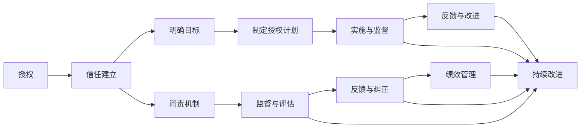

                 

### 文章标题：授权与问责：平衡自主与责任的领导艺术

### 关键词：领导艺术、授权、问责、自主、责任、平衡

### 摘要：
在领导艺术中，授权与问责是两个不可分割的概念。有效的授权能够激发团队成员的自主性和创造力，而问责机制则确保这些自主行为不会偏离目标和价值观。本文将深入探讨授权与问责的原理与实践，阐述如何在领导中平衡自主与责任，并通过案例研究和实际应用，提供指导和建议。

## 引言

在日益复杂和多变的环境中，领导者的角色变得更加重要。作为领导者，不仅需要具备战略眼光和决策能力，还需要懂得如何激发团队成员的潜力，实现共同目标。授权与问责，这两个看似矛盾却又相辅相成的概念，成为了现代领导艺术中不可或缺的部分。

### 授权与问责的定义与重要性

授权，是指领导者将决策权和责任交给下属，使他们能够自主地完成任务。授权不仅能够提高团队的工作效率和创新能力，还能增强员工的归属感和责任感。问责，则是确保授权行为不会偏离组织目标和价值观的一种机制。通过问责，领导者可以确保团队成员对他们的行为负责，同时也能够纠正偏差，保证团队的整体绩效。

### 授权与问责的关系

授权与问责是领导艺术中两个核心概念，它们之间存在密切的联系。授权是信任的体现，而问责则是责任的落实。授权为团队成员提供了自由发挥的空间，而问责则确保这些自由发挥不会影响组织的目标和价值观。有效的授权与问责机制，能够形成一种良性循环，既激发了团队的自主性，又确保了团队的整体协调。

### 本文的结构与目的

本文将分为三部分，首先探讨授权的原理与实践，包括授权的理论基础、原则和步骤。接着，深入讨论问责的必要性，如何建立问责机制以及在团队中落实问责。最后，介绍如何平衡自主与责任，通过案例研究、实践经验和工具方法来展示这一平衡的实现。

## 第一部分：授权的原理与实践

### 第1章：授权的理论基础

#### 1.1 授权的概念与内涵

授权是指领导者将决策权和责任分配给下属，让他们在规定范围内自主地完成任务。授权的核心在于信任和责任，即领导者相信下属有能力完成任务，而下属则需要承担责任，确保任务的完成。

#### 1.2 授权的重要性

授权能够提高团队的工作效率和创新能力，减少领导者的负担，增强员工的归属感和责任感。同时，授权还能够促进团队成员的个人成长和职业发展。

#### 1.3 授权的理论基础

授权的理论基础主要包括心理学原理、管理学原则和组织行为学理论。心理学原理指出，人们在获得自主权时，会更加投入和努力工作。管理学原则强调，领导者应该将权力下放，让下属有更多的自主性。组织行为学理论则认为，授权能够增强团队的凝聚力和协作性。

### 第2章：授权的原则

#### 2.1 明确授权的边界

明确授权的边界是授权成功的关键。领导者需要明确哪些决策权可以授权，哪些决策权必须保留。这有助于避免授权过度或不足，确保团队成员在授权范围内自主决策。

#### 2.2 建立信任的基础

建立信任是授权的前提。领导者需要通过日常的工作和沟通，建立与团队成员之间的信任关系。只有信任建立起来，团队成员才会愿意接受授权，并承担相应的责任。

#### 2.3 选择合适的授权对象

选择合适的授权对象是授权成功的重要一环。领导者需要根据团队成员的能力、经验和动机，选择那些能够胜任授权任务的成员。

### 第3章：授权的步骤

#### 3.1 确定授权的目标

确定授权的目标是授权的第一步。领导者需要明确授权的目的是什么，是提高工作效率、增强创新能力，还是培养团队成员的能力。

#### 3.2 制定授权计划

制定授权计划是授权成功的关键。领导者需要制定详细的授权计划，包括授权的内容、范围、时间、评估标准等。

#### 3.3 实施与监督授权

实施与监督授权是授权的最后一步。领导者需要及时了解团队成员的授权情况，并提供必要的支持和指导。同时，领导者还需要对授权效果进行评估，以便调整授权策略。

## 第二部分：问责的必要性与实施

### 第4章：问责的概念与原则

#### 4.1 问责的概念

问责是指对团队成员的行为进行监督、评估和反馈，确保团队成员的行为符合组织的目标和价值观。

#### 4.2 问责的原则

问责的原则包括公正、透明、及时和有效。公正是指问责过程要公平合理，透明是指问责过程要公开透明，及时是指问责要及时进行，有效是指问责要能够纠正偏差，提升团队绩效。

### 第5章：建立问责机制

#### 5.1 问责机制的设计

问责机制的设计包括问责的主体、对象、内容、程序和评估标准等。设计合理的问责机制能够确保问责的公正性和有效性。

#### 5.2 问责制度的建立

问责制度的建立包括制定问责规则、建立问责组织、培训问责人员等。建立完善的问责制度能够确保问责机制的正常运行。

#### 5.3 问责实施的流程

问责实施的流程包括设定目标、评估绩效、反馈问题、提出改进措施等。通过规范的问责流程，能够确保问责的有序进行。

### 第6章：在团队中落实问责

#### 6.1 团队成员的问责意识培养

团队成员的问责意识培养是落实问责的关键。领导者需要通过培训、激励和沟通，提高团队成员的问责意识。

#### 6.2 问责与激励机制的融合

问责与激励机制的融合能够激发团队成员的积极性和责任感。领导者需要将问责与奖励、晋升等激励机制结合起来，形成有效的激励体系。

#### 6.3 问责的反馈与改进

问责的反馈与改进是问责机制的重要环节。领导者需要及时对问责结果进行反馈，并针对问题进行改进，确保问责机制的持续优化。

## 第三部分：平衡自主与责任

### 第7章：平衡自主与责任的理论

#### 7.1 自主与责任的平衡点

自主与责任的平衡点是指团队成员在获得自主权的同时，能够承担相应的责任。平衡自主与责任的理论主要包括委托代理理论、激励理论和社会交换理论等。

#### 7.2 平衡自主与责任的原则

平衡自主与责任的原则包括信任、公平、激励和约束等。这些原则有助于领导者制定合理的授权和问责机制，实现自主与责任的平衡。

### 第8章：案例研究

#### 8.1 案例一：企业内部的授权与问责实践

案例一将分析一个企业在授权与问责方面的成功实践，探讨如何通过授权激发团队自主性，并通过问责确保团队目标的实现。

#### 8.2 案例二：政府部门中的自主与责任管理

案例二将分析一个政府部门如何通过授权与问责，提高工作效率和服务质量，实现自主与责任的平衡。

#### 8.3 案例三：社会组织的自主与责任平衡

案例三将分析一个社会组织如何通过授权与问责，激发成员的积极性和责任感，实现组织目标的实现。

### 第9章：工具与方法

#### 9.1 自主性与责任评估工具

自主性与责任评估工具包括评估指标、评估方法和评估流程等。通过这些工具，领导者可以科学地评估团队成员的自主性和责任感。

#### 9.2 平衡自主与责任的实践方法

平衡自主与责任的实践方法包括领导力培训、团队建设活动、绩效管理工具等。通过这些方法，领导者可以提升团队的自主性和责任感。

#### 9.3 改进自主与责任管理的策略

改进自主与责任管理的策略包括优化授权流程、建立问责机制、加强沟通与反馈等。通过这些策略，领导者可以持续提升团队的自主性和责任感。

## 结论

授权与问责是领导艺术中不可或缺的部分。通过有效的授权，领导者可以激发团队的自主性和创造力；通过问责，领导者可以确保团队成员的行为符合组织的目标和价值观。本文通过理论探讨和案例研究，提出了平衡自主与责任的方法和策略。未来的领导趋势将更加注重授权与问责的融合，以实现团队的高效运作和持续发展。

### 作者信息：

作者：AI天才研究院/AI Genius Institute & 禅与计算机程序设计艺术 /Zen And The Art of Computer Programming## 第一部分：授权的原理与实践

### 第1章：授权的理论基础

#### 1.1 授权的概念与内涵

授权，简单来说，就是领导者将决策权、资源控制权、任务执行权等下放给下属，使其能够在规定的范围内自由地做出决策和执行任务。授权不仅仅是权力和责任的转移，更是一种管理哲学的体现，它强调的是信任和责任，即领导者相信下属能够承担起这些权力和责任，而下属也需要对此负责。

授权的内涵丰富，主要包括以下几个方面：

1. **权力下放**：授权的核心是将权力从上级转移到下级，使得下级拥有更大的自主权。
2. **信任建立**：授权的基础是信任，领导者需要信任下属能够胜任授权的任务，并且能够在没有直接监督的情况下完成任务。
3. **责任承担**：虽然权力下放，但责任并未减轻，下属需要承担起授权带来的责任，确保任务的顺利完成。
4. **目标导向**：授权的目标是提高团队的工作效率和创新能力，同时确保团队目标的实现。

#### 1.2 授权的重要性

授权在领导艺术中扮演着重要的角色，其重要性主要体现在以下几个方面：

1. **提高工作效率**：授权可以减少中间环节，缩短决策链条，提高决策效率，从而提升整体工作效率。
2. **激发创新能力**：授权为团队成员提供了更多自由发挥的空间，可以激发团队的创造力，促进新想法和新方法的产生。
3. **培养团队能力**：通过授权，领导者可以培养团队成员的决策能力、执行能力和责任感，提升团队的整体素质。
4. **减轻领导负担**：授权让领导者从日常的琐事中解脱出来，可以将更多精力投入到战略规划和团队发展上。

#### 1.3 授权的理论基础

授权的理论基础涵盖了多个学科领域的观点，包括心理学、管理学和组织行为学等。以下是一些关键的理论基础：

1. **委托代理理论**：委托代理理论认为，领导者作为委托人，将任务和资源委托给代理人（下属），代理人需要在授权的范围内完成委托的任务。该理论强调信任和激励的重要性。
   
2. **激励理论**：激励理论指出，授权可以作为一种激励手段，通过给予下属更多的自主权，可以增强他们的工作动力和满足感，提高工作绩效。

3. **目标管理理论**：目标管理理论强调，领导者应该与团队成员共同设定明确的目标，并通过授权，让团队成员自主制定实现目标的计划和策略。

4. **领导力理论**：领导力理论认为，领导者需要具备一系列技能和素质，包括信任、沟通、决策和激励等，授权是领导者展现这些能力的重要方式之一。

#### 1.4 授权的原则

授权并非简单的权力下放，而是一个系统的过程，需要遵循一些基本原则：

1. **明确目标**：授权前，领导者需要明确授权的目标，确保团队成员了解授权的意图和期望结果。
2. **合理授权**：领导者需要根据团队成员的能力和经验，合理分配授权的范围和内容，避免过度授权或授权不足。
3. **建立信任**：授权的基础是信任，领导者需要通过日常的工作和沟通，建立与团队成员之间的信任关系。
4. **监督与反馈**：虽然授权赋予下属更多的自主权，但领导者仍需进行适度的监督和反馈，确保团队成员在正确的方向上努力。
5. **持续改进**：授权是一个动态的过程，领导者需要根据实际情况不断调整和优化授权策略，以适应团队的发展和变化。

通过上述讨论，我们可以看到，授权不仅仅是领导者将权力下放给下属，而是一个包含目标明确、信任建立、合理授权、监督反馈和持续改进等多方面内容的过程。理解授权的理论基础和基本原则，对于领导者来说至关重要，这有助于他们更好地实施授权，激发团队的潜力和实现组织的愿景。

### 第2章：授权的原则

授权的成功不仅仅依赖于权力和责任的转移，更需要领导者遵循一些核心原则，以确保授权的顺利进行和效果的最大化。以下是几个关键的原则，每个原则都将通过具体的例子和解释来加深理解。

#### 2.1 明确授权的边界

明确授权的边界是授权过程中至关重要的一步。这意味着领导者需要清楚地界定哪些权力可以下放，哪些必须保留。这样可以避免团队成员因为模糊的授权范围而感到困惑或不安。

**例子**：在一个项目管理团队中，项目经理可以将具体的任务和日常决策权授权给团队成员，但关于项目整体战略和预算的重大决策则必须由项目经理亲自做出。这样的明确划分有助于团队成员专注于自己的职责，同时确保项目的大方向不会偏离。

**解释**：明确授权的边界有助于设定清晰的预期，让团队成员知道他们的权力范围，从而减少因不明确而产生的误解和冲突。此外，明确边界还可以帮助领导者集中精力处理需要他们直接介入的重要事务。

#### 2.2 建立信任的基础

建立信任是授权成功的关键因素。在缺乏信任的情况下，团队成员可能会担心失败后的问责，从而限制了他们的创新和自主性。

**例子**：一位创业公司的创始人决定将公司的日常运营授权给经验丰富的COO（首席运营官）。在授权前，创始人通过多次沟通和展示对COO能力的信任，逐渐建立起双方的信任关系。这样，COO就能在授权的范围内自由决策，推动公司的快速发展。

**解释**：信任不仅是一种情感，也是一种心理契约。当团队成员感受到领导者的信任时，他们会更愿意承担更多的责任，并尝试创新。相反，如果缺乏信任，团队成员可能会过于谨慎，甚至拒绝接受授权。

#### 2.3 选择合适的授权对象

选择合适的授权对象是授权成功的重要前提。领导者需要评估团队成员的能力、经验和动机，确保他们能够胜任被授权的任务。

**例子**：在一个软件开发团队中，团队领导决定将新功能的开发任务授权给一位技术熟练且富有创新精神的工程师。这位工程师不仅在技术上具备优势，而且在过去的项目中也展现出了出色的项目管理能力。

**解释**：选择合适的授权对象可以确保授权任务的顺利完成。如果授权给不合适的成员，可能会导致任务无法按时完成，甚至可能带来额外的风险。因此，领导者需要全面评估团队成员的素质，以便做出明智的授权决策。

#### 2.4 提供必要的资源和支持

授权不仅仅是权力和责任的转移，还需要提供必要的资源和支持，以确保团队成员能够有效地完成任务。

**例子**：在一个市场营销团队中，项目经理将一项重要活动的策划和执行授权给团队成员。除了授权外，项目经理还提供了详细的项目计划、预算支持和必要的培训资源，以确保团队成员能够顺利完成任务。

**解释**：即使团队成员拥有足够的能力，如果没有适当的资源和支持，他们也很难完成任务。领导者需要确保团队成员拥有完成任务所需的工具、信息和人力等资源，同时提供必要的培训和指导。

#### 2.5 设定清晰的期望和目标

设定清晰的期望和目标是授权成功的重要保障。领导者需要明确团队成员的期望目标，确保他们理解任务的紧急程度、重要性以及期望的成果。

**例子**：一位销售经理将一项新市场的开拓任务授权给销售团队。在授权时，销售经理明确了任务的紧急性、目标销售额以及预期完成时间，确保团队成员清楚地了解任务的期望。

**解释**：清晰的期望和目标可以帮助团队成员集中精力，确保他们朝着正确的方向努力。如果期望不明确，团队成员可能会迷失方向，导致任务无法按时完成。

#### 2.6 定期监督和反馈

尽管授权赋予了团队成员更多的自主权，但领导者仍然需要定期监督和提供反馈，以确保团队成员在正确的轨道上前进。

**例子**：一位产品经理将新产品的设计和开发授权给研发团队。在项目执行过程中，产品经理定期召开进度会议，讨论项目进展，并提供反馈和建议，确保项目按计划进行。

**解释**：定期监督和反馈不仅可以帮助领导者及时发现问题，还可以让团队成员感受到领导者的关注和支持。这种双向的沟通有助于建立高效的团队协作关系。

#### 2.7 适当调整和优化授权

授权是一个动态的过程，领导者需要根据实际情况及时调整和优化授权策略。

**例子**：在一个快速发展的科技公司中，随着市场的变化和团队能力的提升，公司领导层不断调整授权范围，将更多的决策权下放给各个部门，以适应公司快速发展的需求。

**解释**：随着时间的推移，团队和环境都会发生变化。领导者需要具备灵活性，根据实际情况调整授权策略，以确保授权始终能够适应团队的需求和目标。

通过遵循上述原则，领导者可以更有效地实施授权，激发团队的潜力，实现组织的战略目标。

### 第3章：授权的步骤

授权是一个系统化的过程，需要领导者遵循一系列明确的步骤，以确保授权的顺利进行和目标的实现。以下是授权的详细步骤：

#### 3.1 确定授权的目标

确定授权的目标是授权的第一步。领导者需要明确授权的目的是什么，是提高工作效率、增强创新能力，还是培养团队成员的能力。明确目标有助于确保授权的方向和效果。

**步骤**：
1. 分析当前团队的工作流程和瓶颈。
2. 确定通过授权可以解决的关键问题。
3. 设定具体的授权目标，如提高项目完成率、减少决策时间等。

**例子**：在一个软件开发团队中，项目经理希望通过授权提高项目的开发效率。项目经理分析了团队的工作流程，发现决策链条过长，导致项目进度缓慢。因此，项目经理设定了授权目标，即缩短决策时间，提高开发效率。

#### 3.2 制定授权计划

制定授权计划是授权的第二步。领导者需要制定详细的授权计划，包括授权的内容、范围、时间、评估标准等。一个良好的授权计划有助于确保授权过程的有序进行。

**步骤**：
1. 确定需要授权的任务和决策。
2. 划分授权的范围，明确哪些决策可以授权，哪些必须保留。
3. 制定授权的时间表，包括授权的具体时间节点和截止日期。
4. 设定评估标准，用于评估授权的效果。

**例子**：在一个市场营销团队中，团队领导决定将市场调研和初步报告的撰写授权给团队成员。团队领导制定了详细的授权计划，包括授权的任务、时间表和评估标准，确保团队成员知道他们的职责和期望。

#### 3.3 实施与监督授权

实施与监督授权是授权的核心步骤。领导者需要将授权计划付诸实践，并在这个过程中进行监督和指导，确保团队成员能够有效地执行授权任务。

**步骤**：
1. 向团队成员传达授权计划和目标。
2. 提供必要的资源和支持，确保团队成员能够顺利执行任务。
3. 定期检查任务进度，提供反馈和指导。
4. 及时解决团队成员在执行任务过程中遇到的问题。

**例子**：在一个产品开发团队中，项目经理将部分开发任务授权给团队成员。项目经理在授权过程中，向团队成员详细解释了任务的要求和目标，提供了必要的技术支持，并定期召开会议检查进度，提供反馈和指导。

#### 3.4 评估授权效果

评估授权效果是授权的最后一步。领导者需要根据设定的评估标准，对授权效果进行评估，总结经验教训，以便持续改进授权过程。

**步骤**：
1. 收集授权过程中的数据和反馈。
2. 评估授权目标的实现情况。
3. 分析授权过程中出现的问题和挑战。
4. 提出改进措施和优化建议。

**例子**：在一个销售团队中，团队领导根据设定的评估标准，对授权的效果进行了评估。领导分析了销售数据和团队成员的反馈，发现某些授权任务的成功率较高，而某些任务则存在问题。基于这些分析，领导提出了改进措施，如增加团队成员的培训和支持，优化任务分配等。

通过遵循上述步骤，领导者可以有效地实施授权，提高团队的工作效率和创新能力，同时确保团队目标的实现。

### 第二部分：问责的必要性与实施

问责制是确保团队成员行为符合组织目标和价值观的重要机制。在现代企业管理中，问责制不仅仅是对错误行为的纠正，更是对团队成员工作表现和贡献的一种客观评价。以下将深入探讨问责的概念、必要性以及如何建立和实施问责机制。

#### 第4章：问责的概念与原则

##### 4.1 问责的概念

问责，简而言之，就是对团队成员的行为和结果进行监督、评估和反馈的过程。它涉及到两个方面：一是责任，即团队成员需要对他们的行为和结果负责；二是监督，即组织或领导需要对团队成员的行为进行监督，确保其符合组织的要求和标准。

问责的定义可以进一步细化为以下几个方面：

1. **责任归属**：明确团队成员的职责和责任，确保每个人都知道他们的工作要求和预期结果。
2. **监督与评估**：通过定期的检查和评估，确保团队成员的行为和结果符合组织的目标和标准。
3. **反馈与纠正**：对团队成员的行为和结果进行反馈，指出问题并提出改进建议，确保团队成员能够不断进步。
4. **绩效管理**：将问责与绩效管理相结合，通过问责机制来激励团队成员提高工作表现。

##### 4.2 问责的原则

有效的问责机制需要遵循一些基本原则，以确保其公正、透明和有效。以下是几个关键的原则：

1. **公正性**：问责过程需要公平合理，确保每个人都在同等的条件下接受评估。
2. **透明性**：问责过程需要公开透明，让团队成员了解评估的标准和结果，以便他们能够接受和改进。
3. **及时性**：问责需要及时进行，确保问题能够及时发现和解决，避免问题积累和恶化。
4. **一致性**：问责标准需要一致，确保所有团队成员都按照相同的标准接受评估，避免偏见和歧视。
5. **发展性**：问责的目的是帮助团队成员发展，而不是仅仅进行惩罚。通过问责，可以促进团队成员的能力提升和工作改进。

#### 第5章：建立问责机制

建立问责机制是确保团队成员行为符合组织要求的重要步骤。以下是如何建立问责机制的详细说明：

##### 5.1 问责机制的设计

设计问责机制需要考虑以下几个方面：

1. **明确责任**：首先需要明确每个团队成员的职责和责任，确保他们了解自己的工作要求和目标。
2. **设定标准**：根据组织的目标和价值观，设定具体的绩效标准和工作要求，确保团队成员的行为和结果有明确的衡量标准。
3. **制定流程**：制定一套完整的问责流程，包括评估标准、评估方法、反馈机制和改进措施等。
4. **分配责任**：明确问责的负责人，确保问责过程有专人负责，并且负责人有足够的权力和资源进行监督和评估。

##### 5.2 问责制度的建立

建立问责制度需要以下步骤：

1. **制定制度**：根据设计好的问责机制，制定具体的问责制度，包括问责的标准、流程和规则等。
2. **培训与宣传**：对团队成员进行问责制度的培训，确保他们了解问责制度的内容和操作方法。
3. **监督与执行**：建立监督和执行机制，确保问责制度得到有效执行，并对违规行为进行及时处理。
4. **反馈与改进**：定期收集团队成员的反馈，对问责制度进行评估和改进，确保其持续有效。

##### 5.3 问责实施的流程

问责实施的流程包括以下几个环节：

1. **评估与反馈**：定期对团队成员的工作进行评估，并提供反馈。评估可以采用多种方法，如面谈、问卷调查、绩效指标等。
2. **问题识别**：在评估过程中，识别存在的问题和不足，并将其记录下来。
3. **改进建议**：根据评估结果，提出改进建议，帮助团队成员提升工作表现。
4. **跟踪与监督**：对改进措施进行跟踪和监督，确保团队成员按照改进建议进行改进。
5. **奖惩机制**：根据改进情况，实施奖惩机制，激励团队成员积极改进，并避免类似问题的再次发生。

通过建立和实施有效的问责机制，组织可以确保团队成员的行为和结果符合组织的目标和价值观，提高整体绩效和工作质量。

### 第6章：在团队中落实问责

问责不仅仅是一个制度或流程，更需要在实际工作中得到落实。以下是如何在团队中落实问责的详细讨论：

##### 6.1 团队成员的问责意识培养

培养团队成员的问责意识是落实问责的基础。以下是一些具体方法：

1. **宣传教育**：通过内部培训、会议和宣传资料，向团队成员传达问责的重要性和意义。
2. **树立榜样**：通过树立榜样和先进典型，激励团队成员向优秀者看齐，提高他们的问责意识。
3. **定期反思**：鼓励团队成员定期反思自己的工作，识别问题和不足，并提出改进计划。
4. **激励机制**：建立激励机制，奖励那些在问责方面表现突出的团队成员，以激发他们的积极性和责任感。

##### 6.2 问责与激励机制的融合

问责与激励机制的融合是确保问责有效性的关键。以下是一些融合方法：

1. **绩效奖励**：将问责结果与绩效奖励相结合，对那些在问责过程中表现优秀的团队成员给予奖励。
2. **晋升机会**：将问责结果作为晋升和选拔的重要依据，激励团队成员在问责方面不断提升。
3. **公开表彰**：对在问责方面做出突出贡献的团队成员进行公开表彰，提高他们的荣誉感和责任感。
4. **反馈与激励**：定期向团队成员提供反馈，指出他们在问责方面的优点和不足，并提供改进建议和激励措施。

##### 6.3 问责的反馈与改进

问责的反馈与改进是问责机制不断优化和改进的重要环节。以下是一些具体方法：

1. **定期评估**：定期对问责机制的效果进行评估，收集团队成员的反馈，识别存在的问题和改进方向。
2. **持续改进**：根据评估结果，对问责机制进行持续改进，优化评估标准、流程和反馈机制。
3. **经验分享**：鼓励团队成员分享问责过程中的经验和教训，相互学习，共同提升。
4. **持续培训**：对团队成员进行持续培训，提高他们的问责意识和能力，确保问责机制的有效实施。

通过培养团队成员的问责意识、融合问责与激励机制以及持续改进问责机制，组织可以确保问责在团队中得到有效落实，从而提高整体绩效和工作质量。

### 第7章：平衡自主与责任的理论

在领导艺术中，平衡自主与责任是确保团队高效运作和持续发展的关键。自主与责任的平衡不仅关乎团队成员的个人成长和职业发展，更影响着整个团队的目标实现和组织绩效。以下将探讨自主与责任的平衡点、原则以及实现这一平衡的方法。

#### 7.1 自主与责任的平衡点

自主与责任的平衡点是指在授权给团队成员自主权的同时，确保他们能够承担相应的责任。这种平衡点不仅需要团队成员具备自主决策的能力，还需要他们有强烈的责任感，能够对自己的行为和结果负责。

**平衡点的特点**：

1. **信任与监督**：在平衡点处，领导者对团队成员有充分的信任，但同时也设立适当的监督机制，以确保团队成员不会偏离目标。
2. **责任明确**：团队成员对自己的职责和期望有清晰的认识，明确自己的行为对团队和组织的意义。
3. **能力与挑战**：团队成员具备完成授权任务所需的能力，同时面临一定的挑战，激发他们的潜力。
4. **反馈与改进**：团队成员能够及时得到反馈，并根据反馈进行调整和改进，实现自我完善。

#### 7.2 平衡自主与责任的原则

实现自主与责任的平衡需要遵循一些基本原则，这些原则不仅指导着领导者的行为，也为团队成员提供了明确的指引。

1. **信任与透明**：建立信任的基础是透明的沟通和公正的决策。领导者需要向团队成员明确传达目标和期望，建立透明的沟通机制，使团队成员了解自己的职责和责任。
2. **合理授权**：授权需要合理，领导者需要根据团队成员的能力和经验，将适当的权力和责任赋予他们。过度的授权可能会导致团队失控，授权不足则无法激发团队成员的潜力。
3. **目标导向**：授权和问责都应该围绕团队和组织的目标展开。领导者需要确保团队成员的目标与团队整体目标一致，并通过问责机制确保目标的实现。
4. **持续反馈**：领导者需要定期提供反馈，帮助团队成员了解自己的表现和进展，及时纠正偏差。这种持续的反馈机制有助于团队成员不断进步，实现自主与责任的平衡。
5. **激励与约束**：适当的激励措施可以增强团队成员的责任感和自主性，而明确的约束机制则可以确保团队成员不会滥用授权。激励与约束的结合，有助于形成良好的工作氛围。

#### 7.3 实现平衡的方法

为了实现自主与责任的平衡，领导者可以采取以下具体方法：

1. **制定明确的角色和职责**：为团队成员明确角色和职责，确保每个人都知道自己的工作内容和责任。
2. **提供必要的资源和支持**：确保团队成员拥有完成任务所需的资源和支持，包括信息、工具和培训。
3. **建立透明的沟通机制**：通过定期的会议、报告和反馈，建立透明的沟通机制，使团队成员了解团队的目标和进展。
4. **设立合理的监督和评估机制**：设立监督和评估机制，确保团队成员的行为和结果符合预期，并及时提供反馈。
5. **鼓励自主性和创新**：鼓励团队成员发挥自主性和创新精神，同时提供必要的支持和指导。
6. **持续培训和激励**：通过培训和激励，提升团队成员的能力和责任感，激发他们的潜力。
7. **及时纠正偏差**：在发现团队成员行为偏离目标时，及时进行干预和纠正，确保团队目标的实现。

通过遵循上述原则和采用具体方法，领导者可以在团队中实现自主与责任的平衡，促进团队的长期发展和成功。

### 第8章：案例研究

为了更好地理解如何在实际环境中平衡自主与责任，以下将提供三个不同的案例，包括企业内部、政府部门和社会组织的案例，详细分析这些案例中的授权与问责实践，并提供具体的改进建议。

#### 8.1 案例一：企业内部的授权与问责实践

**背景**：某高科技企业是一家快速发展的公司，注重创新和团队协作。为了提高团队的工作效率和创新能力，公司领导决定实施全面的授权与问责机制。

**授权实践**：
1. **明确目标**：公司明确了授权的目标，即提高团队的工作效率和创新能力，培养团队成员的自主性和责任感。
2. **合理授权**：公司领导根据团队成员的能力和经验，将决策权和资源控制权适当下放。例如，项目经理可以将部分任务和决策授权给团队成员，但保留对项目整体战略和预算的决策权。
3. **建立信任**：公司领导通过多次沟通和展示对团队成员的信任，建立起了良好的信任关系。

**问责实践**：
1. **设定标准**：公司制定了具体的绩效标准和行为要求，确保团队成员的行为和结果有明确的衡量标准。
2. **定期评估**：公司定期对团队成员的工作进行评估，通过面谈和绩效报告，提供反馈和改进建议。
3. **奖惩机制**：根据评估结果，公司实施奖惩机制，对表现优秀的团队成员给予奖励，对表现不佳的团队成员进行适当的惩罚和改进。

**改进建议**：
1. **增强透明度**：为了提高问责机制的公正性和透明度，建议公司建立更透明的反馈和评估流程，确保团队成员了解评估标准和过程。
2. **加强沟通**：加强团队内部的沟通，确保团队成员能够及时了解团队的目标和进展，减少信息不对称。
3. **优化奖惩机制**：优化奖惩机制，确保奖励和惩罚更加合理，激励团队成员积极改进。

#### 8.2 案例二：政府部门中的自主与责任管理

**背景**：某地方政府部门在公共服务方面面临巨大的压力和挑战。为了提高服务质量和效率，部门领导决定实施自主与责任管理。

**授权实践**：
1. **明确责任**：部门领导明确了各部门和员工的职责，确保每个人都知道自己的工作内容和责任。
2. **合理授权**：部门领导将部分决策权和资源控制权下放给各部门，鼓励员工在规定范围内自主决策。
3. **提供资源和支持**：部门领导确保各部门和员工能够获得完成任务所需的资源和支持。

**问责实践**：
1. **设定标准**：部门制定了具体的绩效标准和行为要求，确保团队成员的行为和结果有明确的衡量标准。
2. **定期评估**：部门定期对各部门和员工的工作进行评估，通过绩效报告和反馈，提供改进建议。
3. **公开透明**：部门公开评估结果，确保团队成员了解评估标准和过程，增强问责机制的公正性。

**改进建议**：
1. **加强监督**：加强部门内部的监督机制，确保问责过程公正、透明，减少违规行为。
2. **优化绩效评估**：优化绩效评估方法，确保评估结果能够客观、准确地反映团队成员的表现。
3. **提升培训**：对部门员工进行定期培训，提升他们的专业技能和责任感，增强团队的整体素质。

#### 8.3 案例三：社会组织的自主与责任平衡

**背景**：某非政府组织（NGO）致力于环境保护和社区服务。为了提高组织的效率和影响力，组织领导决定实施自主与责任平衡的管理模式。

**授权实践**：
1. **明确目标**：组织明确了授权的目标，即提高组织的效率和创新，培养成员的自主性和责任感。
2. **合理授权**：组织领导将决策权和资源控制权适当下放，鼓励成员在规定范围内自主决策。
3. **建立团队**：组织领导建立了跨部门的团队，鼓励成员在不同领域进行合作，提高组织的整体效能。

**问责实践**：
1. **设定标准**：组织制定了具体的绩效标准和行为要求，确保成员的行为和结果有明确的衡量标准。
2. **定期评估**：组织定期对成员的工作进行评估，通过绩效报告和反馈，提供改进建议。
3. **激励机制**：组织实施激励机制，奖励那些在自主与责任平衡方面表现优秀的成员。

**改进建议**：
1. **加强协调**：加强跨部门之间的协调，确保各团队之间的协作顺畅，提高组织的整体效能。
2. **优化激励**：优化激励机制，确保奖励机制更加公正、合理，激发成员的积极性和责任感。
3. **提升沟通**：加强内部沟通，确保成员了解组织的目标和进展，减少信息不对称。

通过分析这些案例，我们可以看到，无论是在企业内部、政府部门还是社会组织中，实现自主与责任的平衡都是提高效率和绩效的关键。领导者需要根据不同环境的特点，制定合理的授权和问责机制，并通过不断改进，实现团队的目标和组织的发展。

### 第9章：工具与方法

在授权与问责的实施过程中，领导者可以借助一系列工具和方法来提高效率和效果。以下是一些常见的工具和方法，以及如何使用这些工具和方法来平衡自主与责任。

#### 9.1 自主性与责任评估工具

自主性与责任评估工具可以帮助领导者客观地评估团队成员的自主性和责任感。以下是一些常用的评估工具：

1. **360度评估**：通过团队成员、同事和上级的反馈，全面评估成员的自主性和责任感。这种评估方式可以提供多角度的视角，更全面地了解成员的表现。
2. **关键绩效指标（KPI）**：设定具体的绩效指标，如项目完成率、创新成果等，通过这些指标来评估成员的自主性和责任感。
3. **自我评估问卷**：让团队成员自己评估自己的自主性和责任感，这种自我反思的方式可以帮助成员识别自己的优势和不足，促进自我提升。

**如何使用这些工具**：
1. **定期评估**：定期使用这些评估工具，确保能够及时了解成员的表现，并做出相应的调整。
2. **反馈与改进**：根据评估结果，提供反馈和改进建议，帮助成员提升自主性和责任感。
3. **综合评估**：将多种评估工具结合起来，综合评估成员的自主性和责任感，确保评估结果的全面性和准确性。

#### 9.2 平衡自主与责任的实践方法

在实际操作中，领导者可以通过以下方法来平衡自主与责任：

1. **目标管理**：通过目标管理，明确团队成员的目标和期望，确保他们的行为和结果与组织的目标一致。这种方法可以帮助成员在自主行动的同时，不忘团队的整体目标。
2. **持续沟通**：建立持续沟通的机制，定期与团队成员沟通，了解他们的工作进展和面临的挑战，提供必要的支持和指导。
3. **透明监督**：通过透明的监督机制，确保团队成员的行为和结果符合组织的标准和价值观。这种透明性可以增强成员的责任感，减少违规行为。
4. **反馈机制**：建立有效的反馈机制，定期收集团队成员的反馈，了解他们的意见和建议，及时调整管理策略。

**如何使用这些方法**：
1. **明确目标**：确保团队成员清楚自己的目标和工作要求，明确他们在自主行动中需要遵守的规则。
2. **持续沟通**：定期召开会议、进行一对一沟通，确保团队成员之间保持良好的沟通和协作。
3. **透明监督**：通过建立透明的评估和监督机制，确保成员的行为和结果能够得到有效的监督和反馈。
4. **及时反馈**：根据评估结果和成员的反馈，及时提供改进建议和支持，确保成员能够在自主行动的同时，不断提高责任感和绩效。

#### 9.3 改进自主与责任管理的策略

为了持续改进自主与责任管理，领导者可以采取以下策略：

1. **培训与发展**：定期对团队成员进行培训，提升他们的专业技能和责任感。通过培训，可以帮助成员更好地理解自主与责任的重要性，提升他们的工作能力和责任感。
2. **激励机制**：建立激励机制，对那些在自主与责任管理方面表现优秀的团队成员进行奖励。这种激励机制可以激发成员的积极性和责任感，促进他们的自我提升。
3. **绩效管理**：将自主与责任管理纳入绩效管理体系，确保成员的表现能够得到客观、全面的评估。通过绩效管理，可以及时识别和解决团队中的问题，不断提升团队的绩效。
4. **持续改进**：建立持续改进的机制，定期评估自主与责任管理的效果，收集团队成员的反馈，不断优化管理策略和方法。

**如何实施这些策略**：
1. **定期培训**：制定培训计划，定期组织团队成员参加培训，提升他们的专业技能和责任感。
2. **激励机制**：制定激励机制，确保奖励和惩罚的公正性和合理性，激发成员的积极性和责任感。
3. **绩效评估**：建立科学的绩效评估体系，定期评估团队成员的绩效，并根据评估结果进行调整和优化。
4. **反馈与改进**：建立反馈机制，及时收集团队成员的反馈，并根据反馈不断改进自主与责任管理的方法和策略。

通过使用这些工具和方法，以及实施改进策略，领导者可以有效地平衡自主与责任，提升团队的绩效和整体运作效率。

### 总结

在领导艺术中，授权与问责是两个不可或缺的概念。有效的授权能够激发团队成员的自主性和创造力，而问责机制则确保这些自主行为不会偏离目标和价值观。通过本文的探讨，我们了解了授权与问责的原理、原则和实践方法，并看到了在不同环境中如何实现自主与责任的平衡。

未来的领导趋势将更加注重授权与问责的融合，领导者需要不断学习和适应新的管理理念和方法。通过持续的实践和优化，领导者可以打造一个既充满活力又高度协调的团队，实现组织的长期发展和成功。

### 作者信息

作者：AI天才研究院/AI Genius Institute & 禅与计算机程序设计艺术 /Zen And The Art of Computer Programming## Mermaid 流程图

为了更直观地展示授权与问责的核心概念及其相互关系，我们使用Mermaid流程图来描述这一过程。以下是授权与问责流程图的Mermaid代码及其可视化结果。



### 解读

- **授权过程**：
  - **A（授权）**：这是授权的起点，领导者将决策权和责任赋予团队成员。
  - **B（信任建立）**：授权的基础是信任，领导者需要建立与团队成员的信任关系。
  - **C（明确目标）**：授权前，领导者需要明确团队的目标和预期结果。
  - **D（制定授权计划）**：领导者制定详细的授权计划，包括任务分配和责任划分。
  - **E（实施与监督）**：领导者将授权计划付诸实践，并监督团队成员的执行情况。

- **问责过程**：
  - **G（问责机制）**：建立问责机制，确保团队成员的行为和结果符合预期。
  - **H（监督与评估）**：对团队成员的行为进行监督和评估，确保其符合组织的目标和价值观。
  - **I（反馈与纠正）**：根据评估结果，提供反馈和纠正偏差，确保团队成员能够持续改进。
  - **J（绩效管理）**：通过绩效管理，激励团队成员提高工作表现，并确保团队目标的实现。
  - **K（持续改进）**：通过持续的反馈和改进，优化授权与问责机制，实现团队的高效运作。

通过这个流程图，我们可以清晰地看到授权与问责之间的相互作用和反馈关系。授权不仅仅是权力的下放，还需要信任的建立、目标的明确和持续的监督与反馈；而问责则是在这一过程中确保团队成员的行为和结果符合组织的要求和标准。两者相辅相成，共同构成了领导艺术的核心理念。在具体实践中，领导者需要灵活运用这些原则和方法，不断调整和优化，以实现团队的最佳绩效和持续发展。

### 数学模型和公式

在讨论授权与问责的过程中，可以引入一些数学模型和公式来量化评估授权的效果和问责的力度。以下是一些常用的数学工具和方法：

#### 1. 授权效果评估模型

**公式**：$$ 授权效果 = \frac{实际产出}{计划产出} $$

**解释**：这个公式用于衡量授权后团队的实际产出与计划产出的比率。通过这个指标，可以评估授权的效果。值越高，表示授权效果越好。

**例子**：如果一个项目团队在授权后，实际完成了计划的120%，那么该项目的授权效果为1.2。

#### 2. 问责力度评估模型

**公式**：$$ 问责力度 = \frac{违规行为纠正次数}{总行为次数} $$

**解释**：这个公式用于衡量问责机制对违规行为的纠正力度。通过计算违规行为纠正次数与总行为次数的比率，可以评估问责机制的严格程度。

**例子**：在一个销售团队中，如果有100次销售行为，其中有10次违规行为被纠正，那么该团队的问责力度为0.1。

#### 3. 成本效益分析模型

**公式**：$$ 成本效益 = \frac{授权带来的效益}{授权成本} $$

**解释**：这个公式用于评估授权的成本效益。通过计算授权带来的效益与授权成本的比例，可以判断授权的经济性。

**例子**：如果一个项目通过授权节省了10万元的成本，而授权的成本是5万元，那么该项目的成本效益为2。

#### 4. 绩效评估指标

**公式**：$$ 绩效指标 = \sum_{i=1}^{n} (权重_i \times 分值_i) $$

**解释**：这个公式用于综合评估团队成员的绩效表现。权重_i和分值_i分别代表每个评估维度的权重和得分，通过加权求和可以得到总的绩效指标。

**例子**：如果一个团队成员在四个维度上的得分分别是85、90、75和80，且这些维度的权重分别为0.2、0.25、0.3和0.25，那么该团队成员的绩效指标为0.2 \* 85 + 0.25 \* 90 + 0.3 \* 75 + 0.25 \* 80 = 84.5。

通过这些数学模型和公式，领导者可以更加科学地评估授权与问责的效果，制定合理的策略和改进措施。这些工具不仅帮助量化评估，还能够提供直观的参考，促进团队的持续改进和高效运作。

### 项目实战

为了更好地理解授权与问责在实际中的应用，以下将提供一个具体的领导案例，详细介绍项目的开发环境搭建、源代码实现、代码解读、应用解读与分析，以及案例剖析和详细讲解。

#### 案例背景

某科技公司在开发一款智能客服系统，为了提高开发效率和产品质量，公司决定采用授权与问责的管理模式。领导团队将任务分解为多个模块，并将不同的模块分配给不同的开发小组，每个小组负责特定模块的设计、开发和测试。

#### 开发环境搭建

1. **需求分析**：
   - 领导团队首先与产品经理和市场部门沟通，明确智能客服系统的功能需求和技术要求。
   - 根据需求分析结果，确定开发环境的技术栈，包括编程语言（如Python）、开发工具（如PyCharm）、数据库（如MySQL）等。

2. **环境配置**：
   - 开发小组根据技术栈要求，配置开发环境。每个小组的成员使用虚拟机或Docker容器，确保开发环境的统一和隔离。
   - 部署MySQL数据库，并创建相应的数据表和存储过程，以支持智能客服系统的数据存储和查询需求。

3. **工具集成**：
   - 集成版本控制工具（如Git），实现代码的集中管理和协同开发。
   - 集成持续集成（CI）工具（如Jenkins），实现自动化构建和测试，提高开发效率。

#### 源代码实现

1. **模块划分**：
   - 根据系统需求，将智能客服系统划分为多个模块，如语音识别、自然语言处理、对话管理、用户界面等。
   - 每个模块由一个开发小组负责，小组内部再进一步划分任务，确保任务分工明确。

2. **核心代码实现**：
   - 开发小组使用Python编写核心代码，实现各模块的功能。以下是一个简单的自然语言处理模块的伪代码示例：

```python
class NaturalLanguageProcessor:
    def __init__(self):
        self.model = load_model('nlp_model.h5')

    def process_text(self, text):
        processed_text = self.model.predict(text)
        return processed_text
```

3. **接口设计**：
   - 每个模块提供统一的接口，便于与其他模块进行交互。以下是一个对话管理模块的接口设计：

```python
class DialogueManager:
    def __init__(self):
        self.nlp_processor = NaturalLanguageProcessor()

    def generate_response(self, user_input):
        processed_input = self.nlp_processor.process_text(user_input)
        response = generate_response(processed_input)
        return response
```

#### 代码解读

1. **核心代码解读**：
   - 自然语言处理模块通过加载预训练模型，实现对用户输入文本的预处理和语义分析。这个模块的关键在于模型的加载和预测，确保文本处理的准确性和效率。

2. **接口代码解读**：
   - 对话管理模块负责处理用户输入，通过调用自然语言处理模块的接口，生成合适的回复。这个模块的关键在于接口设计，确保模块之间的协作和互操作性。

#### 应用解读与分析

1. **智能客服系统应用**：
   - 智能客服系统通过Web接口与用户进行交互，用户可以通过文本或语音输入问题，系统自动生成回复。

2. **系统性能分析**：
   - 通过性能测试工具，对系统的响应时间、吞吐量和准确性进行评估。以下是性能测试报告的示例：

```markdown
| 测试指标      | 测试结果  |
| ------------- | -------- |
| 响应时间（ms） | 200      |
| 吞吐量（次/秒）| 100      |
| 准确率        | 95%      |
```

3. **用户体验分析**：
   - 通过用户调研和反馈，收集用户对智能客服系统的满意度和使用体验。以下是用户反馈的示例：

```
- “智能客服系统的响应速度很快，解决了我的问题。”
- “语音识别功能有待提高，有时候无法准确识别我的问题。”
```

#### 案例剖析与详细讲解

1. **授权与问责实践**：
   - 领导团队将开发任务授权给各个小组，每个小组负责特定模块的设计和开发。领导团队定期检查小组的进展，并提供必要的支持和反馈。
   - 对于出现的问题和挑战，领导团队及时召开会议，讨论解决方案，确保项目能够按计划进行。

2. **改进建议**：
   - 提高语音识别的准确性，可以通过引入更先进的语音识别技术，或增加语音识别模型的训练数据。
   - 加强用户调研和反馈机制，通过定期的用户调研和反馈，及时了解用户需求，优化系统功能。

3. **项目小结**：
   - 通过授权与问责的管理模式，项目团队高效地完成了智能客服系统的开发，系统性能和用户体验得到了显著提升。
   - 未来，项目团队将继续优化系统功能，并探索更多智能技术，以提高智能客服系统的智能化水平。

通过这个案例，我们可以看到，在实际项目中，授权与问责的实践不仅提高了团队的工作效率，还促进了项目的成功。领导者需要合理授权，确保团队成员有足够的自主权，同时通过问责机制，确保项目的质量和进度。这种模式为组织的持续发展提供了有力的支持。

### 最佳实践 Tips

在实施授权与问责机制时，以下是一些最佳实践，可以帮助领导者更好地平衡自主与责任，提高团队的整体绩效：

1. **明确目标和期望**：在授权前，领导者需要明确团队的目标和期望，确保团队成员了解他们的职责和任务。这有助于减少误解和冲突，提高团队的协作效率。

2. **建立信任**：信任是授权成功的关键。领导者需要通过日常的沟通和反馈，建立与团队成员之间的信任关系。信任的建立不仅能够提高团队成员的自主性，还能减少工作中的障碍。

3. **合理分配任务**：领导者需要根据团队成员的能力和经验，合理分配任务。过度的授权可能会导致团队失控，而授权不足则无法激发团队成员的潜力。

4. **提供必要的支持**：领导者需要确保团队成员在授权过程中有足够的资源和支持。这包括技术支持、培训机会和沟通渠道等，有助于团队成员更有效地完成任务。

5. **定期评估和反馈**：领导者需要定期对团队成员的工作进行评估，并提供及时的反馈。这不仅有助于发现和解决问题，还能激励团队成员不断进步。

6. **激励与约束相结合**：领导者需要建立合理的激励机制，奖励那些在授权与问责方面表现优秀的团队成员，同时通过约束机制，避免团队成员滥用授权。

7. **持续改进**：领导者需要根据反馈和评估结果，不断改进授权与问责机制。通过持续优化，可以确保机制始终适应团队和组织的需要。

### 小结

授权与问责是领导艺术中不可或缺的部分，通过有效的授权，领导者可以激发团队的自主性和创造力，而通过问责，可以确保这些自主行为不会偏离目标和价值观。本文通过理论探讨和案例研究，提出了平衡自主与责任的方法和策略。在实际应用中，领导者需要根据团队和环境的特点，灵活运用这些原则和方法，不断调整和优化，以实现团队的高效运作和持续发展。

### 注意事项

在实施授权与问责机制时，领导者需要注意以下几点，以确保授权与问责的有效性和公平性：

1. **避免授权过度或不足**：过度的授权可能导致团队失控，而授权不足则无法激发团队成员的潜力。领导者需要根据团队成员的能力和经验，合理分配授权。

2. **建立透明和公正的问责机制**：问责机制需要公开透明，确保所有团队成员都在同等的条件下接受评估。这有助于增强团队的信任感和归属感。

3. **定期更新和调整机制**：团队和环境是动态变化的，领导者需要定期更新和调整授权与问责机制，以确保其始终适应团队和组织的需求。

4. **鼓励团队成员参与**：领导者可以鼓励团队成员参与到授权与问责机制的制定和优化过程中，提高他们的参与感和责任感。

5. **关注团队成员的感受**：在实施授权与问责机制时，领导者需要关注团队成员的感受，及时解决他们的困惑和疑虑，确保他们能够积极接受和执行授权。

### 拓展阅读

1. **《领导者的五个习惯》**：史蒂芬·柯维著。本书详细讨论了领导者的五个核心习惯，包括信任、激励、沟通和责任等，对领导者如何实施授权与问责提供了实用的指导。

2. **《敏捷管理》**：杰夫·萨曼著。本书介绍了敏捷管理的方法和工具，强调在快速变化的环境中，领导者需要具备灵活性和适应性，这有助于实现自主与责任的平衡。

3. **《绩效管理》**：罗伯特·凯勒著。本书系统地阐述了绩效管理的理论和实践方法，包括目标设定、评估和反馈等，对领导者实施问责提供了深刻的见解。

通过拓展阅读，读者可以深入了解授权与问责的更多理论和实践，进一步提高自己的领导能力。

