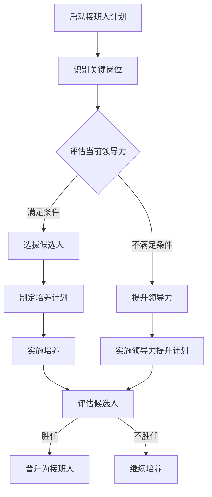

                 


### 文章标题
《接班人计划：为组织未来培养领导力》

### 文章关键词
接班人计划、领导力培养、组织发展、核心算法、数学模型、项目实战

### 文章摘要
本文深入探讨了接班人计划在组织中的重要性，并详细阐述了接班人培养的核心算法原理、数学模型及项目实战。通过构建完整的接班人计划框架，本文为组织未来领导力的培养提供了科学的方法和实用的指导。

### 目录大纲

**第1章 接班人计划概述**
- 1.1 接班人计划的定义
- 1.2 接班人计划的重要性
- 1.3 接班人计划的挑战与机遇
- 1.4 接班人计划的架构

**第2章 核心概念与联系**
- 2.1 接班人计划的基本概念
- 2.2 接班人计划与领导力培养
- 2.3 接班人计划与组织发展
- 2.4 接班人计划Mermaid流程图

**第3章 核心算法原理讲解**
- 3.1 接班人选拔算法
- 3.2 接班人培养模型
- 3.3 接班人评价体系

**第4章 数学模型和数学公式**
- 4.1 人才梯队建设模型
- 4.2 培养成本模型

**第5章 项目实战**
- 5.1 项目规划
- 5.2 项目实施
- 5.3 项目监控
- 5.4 项目评估

**第6章 案例研究**
- 6.1 案例背景
- 6.2 案例实施
- 6.3 案例效果评估
- 6.4 案例启示

**第7章 结论与展望**
- 7.1 研究结论
- 7.2 存在问题与挑战
- 7.3 未来发展趋势

### 文章正文

**第1章 接班人计划概述**

接班人计划是组织为应对未来领导层更迭而制定的一系列策略和措施。在快速变化的市场环境中，接班人计划不仅关系到组织的稳定发展，更关系到其长远战略的实施和竞争力的保持。因此，理解接班人计划的定义、重要性以及面临的挑战与机遇，是实施这一计划的基础。

**1.1 接班人计划的定义**

接班人计划（Succession Planning）是指组织为了确保在关键领导岗位出现空缺时，能够迅速找到合适的人选来填补，从而保持组织运营的连续性和稳定性而进行的一系列规划和准备。这个计划涵盖了从选拔、培养到评价的全过程，旨在打造一支强大的领导团队。

**1.2 接班人计划的重要性**

接班人计划在组织中扮演着至关重要的角色。首先，它有助于避免因领导层空缺导致的管理断档，保证组织的正常运营。其次，通过系统的选拔和培养，接班人计划可以提升未来领导者的能力，增强组织的核心竞争力。最后，接班人计划还能够为组织提供长期的人才储备，为未来的发展奠定基础。

**1.3 接班人计划的挑战与机遇**

接班人计划面临着诸多挑战。首先，人才选拔的不确定性是一个难题，如何在众多候选人中找到最适合的接班人，需要科学的方法和严格的评价标准。其次，培养接班人的过程中，如何确保他们具备必要的领导力和管理能力，是一个长期而复杂的任务。此外，接班人计划还需要克服组织内部的文化和观念障碍。

然而，挑战中也蕴含着机遇。通过接班人计划，组织可以提前识别和培养未来的领导人才，提升整体的人才储备质量。同时，接班人计划还可以推动组织文化的变革，鼓励创新和开放的心态，从而增强组织的活力和竞争力。

**1.4 接班人计划的架构**

接班人计划的架构包括选拔、培养、评价三个核心环节。选拔环节主要通过评估候选人的能力和潜力，确定接班人候选人。培养环节则是通过系统的培训和指导，提升接班人的领导力和管理能力。评价环节则是对接班人的表现进行评估，确保他们能够胜任未来的领导岗位。

接下来，我们将详细探讨接班人计划的核心概念与联系，包括基本概念、领导力培养、组织发展以及接班人计划Mermaid流程图。

### 第2章 核心概念与联系

在接班人计划中，核心概念和联系的理解至关重要。本章节将详细探讨接班人计划的基本概念，以及接班人计划与领导力培养、组织发展之间的关系。此外，还将通过Mermaid流程图展示接班人计划的整体流程，以便读者更好地理解这一计划的全貌。

**2.1 接班人计划的基本概念**

接班人计划的基本概念包括接班人、候选人和培养路径。接班人（Successor）是指在组织内担任关键领导岗位的人员，他们的职责是确保组织的持续运营和发展。候选人（Candidate）则是潜在接班人，他们在选拔过程中被评估和培养，以备未来可能出现的领导岗位空缺。培养路径（Development Path）是指组织为候选人提供的成长和发展机会，包括培训、轮岗、导师指导等。

**2.2 接班人计划与领导力培养**

接班人计划与领导力培养密不可分。领导力培养的目标是提升候选人的领导能力和管理技能，确保他们能够胜任未来的领导岗位。领导力培养包括以下几个方面：

1. **领导技能培训**：通过培训课程和研讨会，提升候选人的沟通能力、决策能力、团队管理能力等。

2. **实践经验**：通过实际项目参与和轮岗，让候选人积累实际工作经验，提升实战能力。

3. **导师指导**：为候选人安排经验丰富的导师，提供个性化指导和支持，帮助他们快速成长。

4. **心理素质训练**：通过心理测试和训练，提升候选人的抗压能力、应变能力和情绪管理能力。

**2.3 接班人计划与组织发展**

接班人计划是组织发展的重要组成部分。通过接班人计划，组织可以确保领导层的人才储备，为未来的发展提供坚实的人才基础。接班人计划与组织发展之间的关系体现在以下几个方面：

1. **战略规划**：接班人计划需要与组织的长期战略规划相结合，确保培养的接班人符合组织的发展方向和目标。

2. **人才梯队建设**：接班人计划通过系统化的培养和选拔，打造一支具有梯队结构的领导团队，为组织提供持续的人才支持。

3. **文化传承**：接班人计划有助于传承组织的核心价值观和文化，确保组织在领导层更迭过程中，依然能够保持一致的发展方向和目标。

**2.4 接班人计划Mermaid流程图**

为了更好地理解接班人计划的整体流程，我们使用Mermaid流程图展示接班人计划的各个关键步骤。以下是接班人计划的Mermaid流程图：



在Mermaid流程图中，我们首先启动接班人计划，识别关键岗位，并评估当前领导力。如果当前领导力满足条件，则进入选拔候选人的步骤；如果不满足条件，则进行领导力提升。选拔出候选人后，制定培养计划并实施培养。在培养过程中，对候选人进行评估，如果胜任则晋升为接班人，否则继续培养。

通过上述Mermaid流程图，我们可以清晰地看到接班人计划从启动到实施再到评估的全过程，有助于读者更好地理解接班人计划的运作机制。

接下来，我们将详细讲解接班人计划的核心算法原理，包括选拔、培养和评价三个核心环节。

### 第3章 核心算法原理讲解

接班人计划的核心在于选拔、培养和评价三个环节。这三个环节相互关联，共同构建了一个完整的接班人培养体系。在本章节中，我们将详细阐述接班人选拔算法、培养模型和评价体系的原理，并使用伪代码进行说明。

**3.1 接班人选拔算法**

接班人选拔算法是接班人计划中的第一步，目标是识别出具备领导潜力的候选人。选拔算法通常包括以下步骤：

1. **岗位分析**：对关键岗位进行详细分析，确定岗位所需的技能、经验和素质。
2. **候选人评估**：通过绩效评估、能力测试、面试等方式，评估候选人的综合素质。
3. **选拔标准**：制定选拔标准，确定候选人的选拔条件。

以下是一个简化的接班人选拔算法的伪代码示例：

```plaintext
函数 SelectSuccessor(Candidates, JobRequirements):
    SelectedCandidate = 空列表
    For 每个Candidate in Candidates:
        If Candidate满足JobRequirements:
            Add Candidate to SelectedCandidate
        Else:
            Remove Candidate from Candidates
    Return SelectedCandidate
```

在这个算法中，我们首先定义了一个函数SelectSuccessor，它接受两个参数：候选人列表Candidates和关键岗位的要求JobRequirements。然后，我们遍历候选人列表，根据岗位要求筛选出符合条件的候选人，并返回这个候选人列表。

**3.2 接班人培养模型**

接班人培养模型是接班人计划中的核心环节，目标是提升候选人的领导能力和管理技能。培养模型通常包括以下步骤：

1. **确定培养目标**：根据岗位要求和发展需求，确定候选人的培养目标。
2. **制定培养计划**：制定个性化的培养计划，包括培训课程、轮岗、导师指导等。
3. **实施培养**：按照培养计划实施培养活动。

以下是一个简化的接班人培养模型的伪代码示例：

```plaintext
函数 DevelopSuccessor(Candidate, DevelopmentGoals):
    TrainingPlan = 创建TrainingPlan(DevelopmentGoals)
    For 每个TrainingModule in TrainingPlan:
        ExecuteTrainingModule(Candidate)
    Return Candidate
```

在这个算法中，我们定义了一个函数DevelopSuccessor，它接受两个参数：候选人Candidate和培养目标DevelopmentGoals。函数首先创建一个包含培养目标的培训计划TrainingPlan，然后执行每个培训模块，最后返回培养后的候选人。

**3.3 接班人评价体系**

接班人评价体系是接班人计划中的最后一个环节，目标是评估候选人的培养效果和胜任能力。评价体系通常包括以下步骤：

1. **制定评价标准**：根据岗位要求和培养目标，制定评价标准。
2. **评估候选人**：通过绩效评估、360度评估等方式，评估候选人的表现。
3. **反馈与改进**：根据评估结果，给予候选人反馈，并根据反馈进行改进。

以下是一个简化的接班人评价体系的伪代码示例：

```plaintext
函数 EvaluateSuccessor(Candidate, EvaluationCriteria):
    Score = 0
    For 每个EvaluationCriteria in EvaluationCriteria:
        If Candidate满足EvaluationCriteria:
            Score += 1
        Else:
            Score -= 1
    Return Score
```

在这个算法中，我们定义了一个函数EvaluateSuccessor，它接受两个参数：候选人Candidate和评价标准EvaluationCriteria。函数遍历评价标准，根据候选人的表现计算得分，并返回这个得分。

通过上述伪代码示例，我们可以看到接班人计划的核心算法原理是如何运作的。选拔算法确保我们能够找到合适的候选人，培养模型帮助我们提升候选人的能力，评价体系则确保我们能够准确评估候选人的表现。这三个核心环节共同构成了一个完整的接班人培养体系，为组织的未来发展提供了坚实的人才保障。

接下来，我们将介绍接班人计划中的关键数学模型，并使用latex格式给出相应的公式和详细讲解。

### 第4章 数学模型和数学公式

在接班人计划中，数学模型和数学公式起到了至关重要的作用。这些模型和公式可以帮助组织更好地理解和评估接班人培养的效果，从而制定出更加科学和有效的培养策略。本章节将详细介绍两个关键数学模型：人才梯队建设模型和培养成本模型，并使用latex格式给出相应的公式和详细讲解。

**4.1 人才梯队建设模型**

人才梯队建设模型用于描述组织在培养接班人过程中，如何构建和优化人才梯队。该模型的主要目标是确保组织在各个层级都有足够的人才储备，以应对未来可能出现的人才需求。人才梯队建设模型包括以下三个关键因素：人才储备量、培养进度和胜任力评估。

**4.1.1 模型构建**

人才梯队建设模型可以表示为以下公式：

$$
\text{人才梯队建设模型} = \text{人才储备量} \times \text{培养进度} \times \text{胜任力评估}
$$

其中：
- **人才储备量**（Human Resource Reserve）是指组织中现有的人才储备情况，包括中层管理、高层管理和其他关键岗位的候选人。
- **培养进度**（Development Progress）是指候选人当前的培养进度，包括培训课程完成情况、轮岗经验积累等。
- **胜任力评估**（Competence Assessment）是指候选人的胜任力水平，包括领导能力、管理能力、专业知识等方面的评估结果。

**4.1.2 模型应用**

在应用人才梯队建设模型时，组织可以通过以下步骤进行：

1. **评估人才储备量**：根据现有人才情况，评估组织在各个层级的人才储备情况。
2. **制定培养计划**：根据人才储备量和组织发展需求，制定个性化的培养计划，确保培养进度与组织目标一致。
3. **评估胜任力**：对候选人进行定期评估，了解他们的胜任力水平，并根据评估结果调整培养策略。

**4.2 培养成本模型**

培养成本模型用于描述组织在培养接班人过程中所需的成本。培养成本模型可以帮助组织更好地控制培养成本，确保培养资源的有效利用。培养成本模型包括以下三个关键因素：培训费用、人力成本和其他成本。

**4.2.1 模型构建**

培养成本模型可以表示为以下公式：

$$
\text{培养成本} = \text{培训费用} + \text{人力成本} + \text{其他成本}
$$

其中：
- **培训费用**（Training Costs）是指组织为候选人提供的培训课程和外部培训的费用。
- **人力成本**（Human Resource Costs）是指候选人参与培养活动期间的组织人力成本，包括工资、福利等。
- **其他成本**（Other Costs）是指与培养活动相关的其他费用，如导师指导费用、评估费用等。

**4.2.2 模型应用**

在应用培养成本模型时，组织可以通过以下步骤进行：

1. **估算培训费用**：根据培训计划和候选人的数量，估算培训费用。
2. **估算人力成本**：根据候选人的工资水平和参与培养活动的时间，估算人力成本。
3. **估算其他成本**：根据培养活动的实际情况，估算其他成本。
4. **总成本计算**：将培训费用、人力成本和其他成本相加，得出总培养成本。

通过应用这两个关键数学模型，组织可以更好地理解和评估接班人培养的过程和效果，从而制定出更加科学和有效的培养策略。人才梯队建设模型帮助组织优化人才储备，培养成本模型帮助组织控制培养成本，两者共同为组织未来的发展提供坚实的人才保障。

### 第5章 项目实战

在了解了接班人计划的理论基础和核心算法之后，我们将通过一个实际的接班人培养项目来深入探讨如何实施和监控这一计划。本章节将详细介绍项目的各个阶段，包括项目规划、实施、监控和评估。

**5.1 项目规划**

项目规划是接班人培养项目成功的关键一步。在这个阶段，我们需要明确项目的目标、范围、资源需求和风险。

**5.1.1 项目目标**

项目目标包括：
- 确保组织在关键岗位出现空缺时，能够迅速找到合适的接班人。
- 提升候选人的领导能力和管理技能，确保他们能够胜任未来的领导岗位。
- 建立一支具有梯队结构的领导团队，为组织的长期发展提供人才保障。

**5.1.2 项目范围**

项目范围包括：
- 接班人选拔：确定关键岗位的接班人候选人。
- 培养计划：制定个性化的培养计划，包括培训课程、轮岗、导师指导等。
- 评估体系：建立评估体系，定期对候选人进行评估。

**5.1.3 资源需求**

资源需求包括：
- 人力资源：确定项目团队成员，包括项目经理、选拔委员会成员、培养导师等。
- 财力：预算项目所需的资金，包括培训费用、人力成本、其他成本等。
- 物力：准备项目所需的工具和设备，如培训场地、培训材料、评估工具等。

**5.1.4 风险评估**

项目规划阶段还需要进行风险评估，识别潜在的风险并制定应对策略。常见风险包括：
- 候选人流失：候选人可能在培养过程中流失，导致培养计划中断。
- 培养效果不佳：培养计划可能无法达到预期效果，导致候选人无法胜任领导岗位。
- 资源不足：项目预算不足或资源分配不合理，可能导致项目无法顺利进行。

**5.2 项目实施**

项目实施阶段是接班人培养计划的执行过程。在这个阶段，我们需要按照项目规划逐步实施培养计划，确保候选人能够获得全面的培养。

**5.2.1 招聘选拔**

招聘选拔是项目实施的第一步，目标是确定接班人候选人。招聘选拔包括以下几个环节：

1. **岗位分析**：对关键岗位进行详细分析，确定岗位所需的技能、经验和素质。
2. **发布招聘信息**：在内部和外部发布招聘信息，吸引符合条件的候选人。
3. **筛选简历**：根据岗位要求，筛选符合条件的候选人简历。
4. **面试评估**：对候选人进行面试评估，包括能力测试、行为面试等。
5. **选拔决策**：根据评估结果，确定接班人候选人。

**5.2.2 培养计划**

选拔出候选人后，我们需要制定个性化的培养计划，确保候选人能够获得全面的培养。培养计划包括以下几个环节：

1. **确定培养目标**：根据岗位要求和候选人个人发展需求，确定培养目标。
2. **设计培养方案**：设计包含培训课程、轮岗、导师指导等内容的培养方案。
3. **实施培养**：按照培养方案，实施培养活动，确保候选人能够获得实践经验和理论知识。

**5.2.3 实施监控**

在培养过程中，我们需要对培养活动进行监控，确保培养计划能够按计划实施。实施监控包括以下几个环节：

1. **进度跟踪**：定期跟踪培养计划的进度，确保培养活动按计划进行。
2. **成本控制**：监控培养成本，确保项目预算合理使用。
3. **风险管理**：识别和应对培养过程中可能出现的风险，确保培养计划顺利进行。

**5.3 项目监控**

项目监控是确保接班人培养项目成功的关键。在这个阶段，我们需要对项目实施过程进行全面的监控和评估。

**5.3.1 进度跟踪**

进度跟踪包括以下几个方面：

1. **培养进度**：定期跟踪候选人的培养进度，确保培养计划按计划实施。
2. **培训完成情况**：监控候选人完成培训课程的情况，确保培训质量。
3. **轮岗安排**：监控候选人的轮岗安排，确保候选人能够获得丰富的实践经验。

**5.3.2 成本控制**

成本控制包括以下几个方面：

1. **预算执行**：监控项目预算的执行情况，确保项目成本控制在预算范围内。
2. **成本分析**：对项目成本进行分析，找出成本超支的原因，并提出改进措施。
3. **资源优化**：优化项目资源分配，确保培养资源得到充分利用。

**5.3.3 风险管理**

风险管理包括以下几个方面：

1. **风险识别**：识别项目实施过程中可能出现的风险，包括候选人流失、培养效果不佳等。
2. **风险应对**：制定应对策略，降低风险发生的概率和影响。
3. **风险监控**：定期监控风险状况，确保风险得到及时应对。

**5.4 项目评估**

项目评估是接班人培养项目的最后一步，目的是评估项目效果，并为未来项目提供改进建议。

**5.4.1 评估指标**

评估指标包括以下几个方面：

1. **培养效果**：评估候选人是否达到培养目标，是否具备领导能力和管理技能。
2. **培养满意度**：评估候选人对培养计划的满意度，包括培训内容、培训方式、导师指导等。
3. **组织绩效**：评估组织在领导力和管理能力方面的提升情况，包括绩效指标、员工满意度等。

**5.4.2 评估方法**

评估方法包括以下几个方面：

1. **绩效评估**：通过绩效评估，评估候选人的工作表现和能力提升情况。
2. **360度评估**：通过360度评估，收集来自上级、同事、下属的评估意见，全面了解候选人的表现。
3. **访谈调查**：通过访谈调查，了解候选人对培养计划的看法和改进建议。

**5.4.3 评估结果与应用**

评估结果包括以下几个方面：

1. **培养效果分析**：分析候选人的培养效果，找出成功经验和不足之处。
2. **满意度分析**：分析候选人对培养计划的满意度，找出改进空间。
3. **组织绩效分析**：分析组织在领导力和管理能力方面的提升情况，为未来培养项目提供改进建议。

通过以上评估结果，组织可以针对接班人培养项目的实施情况进行总结和反思，提出改进措施，确保接班人培养项目在未来能够取得更好的效果。

**5.5 项目小结**

接班人培养项目是一个长期而复杂的过程，需要组织各层级的高度重视和积极参与。通过项目规划、实施、监控和评估，组织可以确保接班人计划的有效实施，为组织的未来发展提供坚实的人才保障。同时，组织还需要不断总结经验，优化培养策略，提高接班人培养的质量和效果。

### 第6章 案例研究

为了更好地理解接班人计划在实际项目中的应用，本章节将分析一个具体的案例，包括案例背景、实施过程、效果评估和启示。

**6.1 案例背景**

某大型跨国公司（以下简称“公司”）在面临激烈的市场竞争和领导层老龄化问题时，决定实施接班人计划，以确保公司未来的稳定发展和持续竞争力。公司拥有数千名员工，分布在多个国家和地区，业务涉及多个行业领域。

**6.2 案例实施**

在实施接班人计划时，公司采取了以下步骤：

1. **项目规划**：公司成立了一个专门的接班人计划项目组，负责制定项目规划。项目组首先确定了关键岗位，如高管、部门经理等，并明确了岗位所需的技能和素质。

2. **选拔候选人**：公司通过内部推荐、公开招募等方式，选拔出了数十名符合条件的候选人。选拔过程包括简历筛选、面试评估等多个环节，确保候选人的综合素质符合岗位要求。

3. **制定培养计划**：根据候选人的个人特点和岗位需求，公司制定了个性化的培养计划。培养计划包括领导力培训、轮岗、导师指导等环节，旨在提升候选人的领导能力和管理技能。

4. **实施培养**：公司按照培养计划，逐步实施培养活动。候选人参加了多个领导力培训课程，参与了不同部门的轮岗，得到了导师的指导和支持。

5. **评估候选人**：在培养过程中，公司定期对候选人进行评估，了解他们的进步和问题。评估结果用于调整培养计划，确保候选人能够按计划提升能力。

**6.3 案例效果评估**

在培养计划完成后，公司对候选人的表现进行了全面评估，评估结果如下：

1. **培养效果**：大多数候选人达到了培养目标，具备了一定的领导能力和管理技能。他们在工作中能够更好地应对挑战，提高团队绩效。

2. **满意度**：候选人普遍对培养计划表示满意，认为培养计划有助于他们个人成长和职业发展。

3. **组织绩效**：通过接班人计划的实施，公司的领导层得到了优化，整体管理水平有所提升。公司绩效指标也有所改善，员工满意度提高。

**6.4 案例启示**

这个案例给我们的启示包括：

1. **重视接班人计划**：接班人计划是组织稳定发展的关键，公司应高度重视并投入资源。

2. **个性化培养**：培养计划应根据候选人的个人特点和岗位需求进行个性化设计，确保培养效果。

3. **定期评估**：定期评估候选人的培养效果，及时调整培养计划，确保培养目标的实现。

4. **全员参与**：接班人计划的实施需要全员参与，包括候选人、导师、项目经理等，形成良好的培养氛围。

通过这个案例，我们可以看到接班人计划在实际项目中的应用效果。公司通过科学的选拔、个性化的培养和定期的评估，成功培养了一批具有领导力的接班人，为公司的未来发展奠定了坚实基础。

### 第7章 结论与展望

通过对接班人计划的深入探讨，我们总结了接班人计划的核心内容、关键算法、数学模型以及实际项目中的成功案例。本文的研究不仅揭示了接班人计划在组织中的重要性，也为组织实施接班人计划提供了科学的方法和实用的指导。

**7.1 研究结论**

1. **接班人计划的重要性**：接班人计划是组织确保领导层连续性和稳定性的关键手段。通过系统的选拔、培养和评估，接班人计划能够提升未来领导者的能力，增强组织的核心竞争力。

2. **核心算法原理**：接班人计划的核心算法包括选拔、培养和评价。选拔算法确保找到合适的候选人，培养模型提升候选人的领导能力和管理技能，评价体系则确保培养效果的评估和反馈。

3. **数学模型的应用**：人才梯队建设模型和培养成本模型为组织提供了科学的评估工具，帮助组织优化人才储备和控制培养成本。

4. **项目实战**：通过实际案例研究，我们看到接班人计划在组织中的成功实施，为组织的未来发展提供了坚实的人才保障。

**7.2 存在问题与挑战**

1. **选拔难度**：在快速变化的市场环境中，找到合适的接班人候选人仍然是一个挑战。组织需要建立科学的人才评估体系，确保选拔过程的公正性和有效性。

2. **培养效果**：培养效果取决于培养计划的实施质量和候选人的参与度。组织需要持续关注培养过程，及时调整培养策略，确保培养目标的实现。

3. **文化适应**：接班人计划需要与组织文化相契合。在实施过程中，组织需要克服文化差异，确保接班人计划能够顺利推进。

**7.3 未来发展趋势**

1. **数字化与智能化**：随着数字化和智能化技术的发展，接班人计划将更加依赖于大数据分析和人工智能技术。组织可以通过数据分析，更精准地识别接班人候选人，并制定个性化的培养计划。

2. **跨界合作**：在全球化背景下，组织需要培养具备跨界思维的领导者。通过跨界合作和交流，组织可以培养具有全球视野的接班人。

3. **持续优化**：接班人计划需要持续优化和迭代。组织应不断总结经验，吸取成功案例的教训，提高接班人培养的质量和效果。

**结论**

接班人计划是组织未来领导力培养的关键。通过系统的选拔、培养和评估，组织可以确保领导层的连续性和稳定性，为组织的长期发展提供坚实的人才保障。本文的研究为组织实施接班人计划提供了理论指导和实践参考，希望对组织的发展有所帮助。

**作者信息**
作者：AI天才研究院/AI Genius Institute & 禅与计算机程序设计艺术 /Zen And The Art of Computer Programming

通过本文的探讨，我们不仅深化了对接班人计划的理解，也为组织未来的领导力培养提供了宝贵的经验。希望本文的研究能够为读者提供启示，帮助组织更好地实施接班人计划，打造一支强大的领导团队，迎接未来的挑战。

