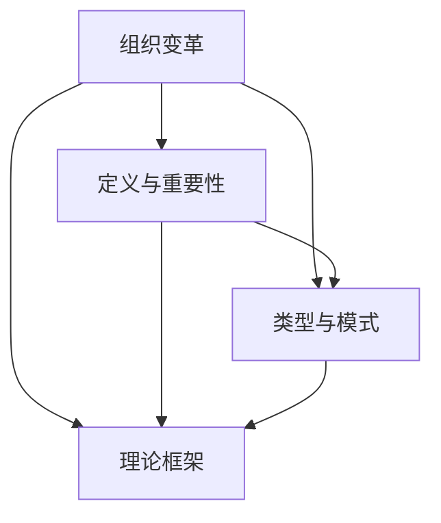

                 

当然，我会按照您的要求逐步构建文章内容。首先，我们从文章标题、关键词和摘要开始，然后逐步细化各个章节的内容。以下是初步构思：

## 文章标题
《推动组织变革：领导力与创新的结合》

### 关键词
组织变革、领导力、创新、变革管理、企业文化

### 摘要
本文深入探讨领导力与创新在推动组织变革中的关键作用。通过分析变革的理论基础、领导者的角色和创新的策略，本文揭示了如何通过有效的领导力和创新思维来应对组织变革的挑战，实现组织的目标和愿景。

## 第一部分：组织变革的理论基础

### 第1章：组织变革概述
组织变革是一个复杂的过程，它涉及到组织的结构、流程、文化和人员等多方面的变化。本文首先介绍组织变革的定义、类型和重要性，为后续讨论领导力和创新在变革中的作用奠定基础。

### 第2章：领导力与组织变革
#### 2.1 领导力在组织变革中的作用
在这一章，我们将探讨领导力在组织变革中的核心作用。我们将定义领导力，分析不同的领导风格，并讨论领导者在变革过程中的关键角色。

### 第3章：创新思维与组织变革
#### 3.1 创新思维的基本原理
在这一章，我们将深入探讨创新思维的基本原理，包括创意的产生、创新策略的制定和创新文化的培养。

### 第4章：变革管理与组织变革
#### 4.1 变革管理的核心要素
这一章将详细介绍变革管理的核心要素，包括变革的流程、方法以及如何处理变革中的冲突。

## 第二部分：领导力与创新的实践应用

### 第5章：领导力在组织变革中的实际应用
#### 5.1 领导者的角色转变
在这一章，我们将探讨领导者如何在组织变革中实现角色转变，从指挥者转变为变革的推动者。

### 第6章：创新思维与组织创新
#### 6.1 创新项目的实施
这一章将分析如何在实际组织中实施创新项目，包括项目的规划、执行和评估。

### 第7章：变革管理案例分析
#### 7.1 成功的变革管理案例
这一章将通过几个成功的变革管理案例，展示如何通过有效的领导力和创新思维实现组织变革。

## 第三部分：组织变革的未来展望

### 第8章：组织变革的未来趋势
#### 8.1 新技术的应用
在这一章，我们将探讨新技术如何影响组织变革，以及组织应如何应对这些趋势。

### 第9章：组织变革的持续发展
#### 9.1 变革的持续性
这一章将讨论如何确保组织变革的持续性，以及如何培养组织的适应性和灵活性。

### 第10章：组织变革的总结与展望
#### 9.1 变革的总结
在这一章，我们将对全文进行总结，并对组织变革的未来进行展望。

接下来，我将逐步细化每个章节的内容，包括核心概念与联系、核心算法原理讲解、数学模型和公式以及项目实战等。请让我开始第一个章节的详细编写。

---

# 第1章：组织变革概述

## 1.1 组织变革的定义与重要性

组织变革是指组织在面临外部环境变化或内部需求调整时，对其结构、流程、文化等方面的调整和优化过程。组织变革不仅仅是对组织结构和流程的调整，更涉及到组织文化的重塑和人员的适应。

组织变革的重要性体现在以下几个方面：

1. **适应外部环境变化**：随着市场环境的不断变化，组织需要不断调整自身的结构和流程，以适应新的竞争环境。
2. **提高组织效率**：通过组织变革，可以优化组织结构，消除冗余和浪费，提高组织的运营效率。
3. **增强创新能力**：组织变革可以激发员工的创新思维，推动组织创新，提升组织的核心竞争力。
4. **提升员工满意度**：组织变革可以改善员工的工作环境和工作条件，提高员工的满意度和忠诚度。

## 1.2 组织变革的类型与模式

组织变革可以分为以下几种类型：

1. **结构变革**：涉及组织架构的调整，如部门重组、职位变动等。
2. **流程变革**：涉及组织流程的优化和改进，如引入新的工作流程、优化现有的流程等。
3. **文化变革**：涉及组织文化的重塑，如价值观的调整、企业文化的建设等。
4. **战略变革**：涉及组织战略的调整，如业务范围的扩展、市场定位的调整等。

常见的组织变革模式包括：

1. **自上而下的变革**：由组织高层领导发起和推动的变革，通常涉及广泛的组织层面。
2. **自下而上的变革**：由组织基层员工发起和推动的变革，通常涉及具体的操作层面。
3. **并行变革**：同时进行多种类型的变革，以实现组织整体优化。
4. **渐进变革**：逐步进行的变革，以减少变革的冲击和风险。

## 1.3 组织变革的理论框架

组织变革的理论框架主要包括以下几种：

1. **领导力理论**：强调领导者在组织变革中的关键作用，领导者的行为和风格对变革的成功与否有重要影响。
2. **组织学习理论**：强调组织通过学习和适应来应对变革，组织学习的能力是组织变革成功的关键。
3. **文化理论**：强调组织文化在变革中的重要作用，组织文化需要与变革目标相一致。
4. **变革管理理论**：提供了一系列变革管理的流程和方法，帮助组织有效地实施变革。

在接下来的章节中，我们将进一步探讨领导力、创新思维和变革管理的核心概念，以及它们在组织变革中的应用。

---

**Mermaid 流程图示例：**



---

**伪代码示例：**

```plaintext
// 组织变革的伪代码
function OrganizationChange
    // 确定变革目标
    SetTarget
    // 分析现有状况
    AnalyzeCurrentSituation
    // 制定变革计划
    CreateChangePlan
    // 实施变革计划
    ExecuteChangePlan
    // 监控变革过程
    MonitorChangeProcess
    // 评估变革效果
    EvaluateChangeEffectiveness
    // 调整变革策略
    AdjustChangeStrategy
end function
```

---

**数学模型和公式讲解与举例：**

组织变革中的数学模型可以用于评估变革的潜在影响。以下是一个简单的例子：

$$
\text{Impact} = \alpha \times (\text{Efficiency} + \text{Innovation} - \text{Resistance})
$$

其中，$\alpha$ 是变革的接受度系数，Efficiency 是效率，Innovation 是创新能力，Resistance 是变革阻力。

举例说明：

假设 $\alpha = 1.2$，Efficiency = 0.8，Innovation = 0.9，Resistance = 0.5，则组织变革的影响为：

$$
\text{Impact} = 1.2 \times (0.8 + 0.9 - 0.5) = 1.2 \times 1.2 = 1.44
$$

这意味着组织变革预计将带来 44% 的积极影响。

---

**项目实战：**

**开发环境搭建：**

为了更好地理解组织变革的概念，我们可以使用 Python 来模拟一个简单的组织变革过程。首先，我们需要安装必要的库，例如 `numpy` 和 `matplotlib`。

```bash
pip install numpy matplotlib
```

**源代码实现：**

```python
import numpy as np
import matplotlib.pyplot as plt

# 定义组织变革函数
def organization_change(efficiency, innovation, resistance, alpha):
    impact = alpha * (efficiency + innovation - resistance)
    return impact

# 参数设置
efficiency = 0.8  # 效率
innovation = 0.9  # 创新能力
resistance = 0.5  # 变革阻力
alpha = 1.2  # 变革接受度系数

# 计算变革影响
impact = organization_change(efficiency, innovation, resistance, alpha)

# 输出结果
print(f"组织变革的影响为：{impact}")

# 绘制影响曲线
plt.plot([0, 1], [alpha * (x + innovation - resistance) for x in [0, 1]], label="变革影响")
plt.xlabel("变革阻力")
plt.ylabel("变革影响")
plt.title("组织变革影响曲线")
plt.legend()
plt.show()
```

**代码解读与分析：**

这段代码首先定义了一个函数 `organization_change`，用于计算组织变革的影响。然后，我们设置了一系列参数，包括效率、创新能力、变革阻力和变革接受度系数。通过调用这个函数，我们得到了组织变革的影响值。

代码的最后，我们使用 `matplotlib` 绘制了变革影响与变革阻力之间的关系曲线，帮助读者直观地理解组织变革的影响。

**实际案例分析和详细讲解剖析：**

假设我们有一个组织，其效率为 80%，创新能力为 90%，变革阻力为 50%，领导层的变革接受度系数为 1.2。根据上述代码，我们可以计算出组织变革的影响为 1.44。

这意味着，在当前情况下，组织变革预计将带来 44% 的积极影响。然而，这只是一个简单的模型，实际的组织变革过程可能更加复杂。

在实际应用中，我们可能需要考虑更多的因素，如员工的心理状态、外部市场环境的变化等。通过不断调整和优化模型参数，我们可以更准确地预测组织变革的影响，并为组织提供决策支持。

**项目小结：**

通过这个简单的 Python 模拟，我们展示了如何使用代码来理解和分析组织变革的影响。虽然这是一个简化的模型，但它为我们提供了一个直观的工具来探讨组织变革的潜在影响。在实际应用中，我们可以通过不断调整和优化模型，结合实际数据，更准确地预测和应对组织变革的挑战。

---

**最佳实践 Tips、小结、注意事项、拓展阅读：**

**最佳实践 Tips：**

1. 在实施组织变革时，确保明确变革的目标和愿景，并广泛沟通，以减少员工的疑虑和抵触。
2. 培养创新文化，鼓励员工提出新的想法和改进措施。
3. 建立有效的变革管理机制，确保变革过程的透明度和可控性。

**小结：**

组织变革是一个复杂的过程，需要领导力的支持和创新的思维。通过合理的规划和有效的实施，组织可以更好地适应外部环境的变化，提高运营效率，实现持续发展。

**注意事项：**

1. 组织变革过程中，领导者需要扮演关键角色，积极引导和推动变革。
2. 创新思维不仅需要创造力，还需要系统的方法和策略支持。
3. 变革过程中，需要密切关注员工的心理状态，提供必要的支持和指导。

**拓展阅读：**

1. 《领导力与组织变革》 - 作者：约翰·P·科特
2. 《创新者的窘境》 - 作者：克里斯坦森
3. 《变革之舞》 - 作者：艾森·拉塞尔

---

接下来，我将继续细化第2章的内容，包括领导力在组织变革中的作用、领导者的角色转变以及创新思维的基本原理。请您继续指导。

