                 


### 标题：提升团队士气：保持高昂斗志

---

# 提升团队士气：保持高昂斗志

## 关键词
- 团队士气
- 激励策略
- 技术手段
- 项目实战
- 管理手段

## 摘要
本文旨在探讨如何通过技术和管理手段提升团队士气，以保持团队成员的高昂斗志。文章首先介绍了团队士气的重要性，然后详细解析了相关核心概念与联系，并引入了Mermaid流程图来展示团队士气的影响因素。接下来，文章分别从技术手段和管理手段两方面，深入讲解了提升团队士气的方法。最后，通过实际项目案例，展示了如何将理论应用于实践，并提出了未来的发展方向。

---

## 引言

### 1.1 团队士气的重要性

团队士气是指团队成员在集体工作过程中所表现出的精神状态，包括积极性、满意度和忠诚度等。高昂的团队士气有助于提升工作效率、工作质量和团队凝聚力，从而对组织的整体绩效产生积极影响。

#### Mermaid 流程图：团队士气与工作绩效的关系

```
graph TD
    A[团队士气] --> B[工作效率]
    A --> C[工作质量]
    A --> D[团队凝聚力]
    B --> E[工作绩效]
    C --> E
    D --> E
```

### 1.2 本书的目的和结构

本文旨在为IT领域的项目经理、团队领导者和技术专家提供一套实用的提升团队士气的方法和策略。文章结构如下：

1. **团队士气概念解析**：介绍团队士气的定义、影响因素及其与工作绩效的关系。
2. **技术手段提升团队士气**：探讨利用人工智能、大数据分析等技术在团队士气提升中的应用。
3. **管理手段提升团队士气**：介绍通过激励策略、团队建设活动等管理手段提升团队士气的方法。
4. **团队士气与个人发展**：探讨团队士气对个人成长的影响，以及如何通过提升团队士气促进个人发展。
5. **项目实战**：通过具体案例，展示提升团队士气在实际项目中的应用。
6. **挑战与展望**：讨论提升团队士气面临的挑战及未来发展方向。

---

## 团队士气概念解析

### 2.1 团队士气的定义

团队士气是指团队成员在集体工作过程中所表现出的积极状态和信心。它不仅包括个体的满意度和忠诚度，还涵盖了团队成员之间的相互支持与信任。

### 2.2 团队士气的影响因素

团队士气受到多种因素的影响，包括：

- **工作环境**：一个舒适、安全的工作环境有助于提升团队士气。
- **团队目标**：明确、可行的团队目标能够激发团队成员的积极性。
- **团队沟通**：良好的团队沟通有助于增强团队凝聚力，提升士气。
- **领导风格**：领导者的风格对团队士气具有重要影响。

#### Mermaid 流程图：团队士气影响因素架构

```
graph TD
    A[工作环境] --> B[团队士气]
    A --> C[团队目标]
    A --> D[团队沟通]
    B --> E[领导风格]
```

### 2.3 团队士气与工作绩效的关系

研究表明，团队士气与工作绩效之间存在显著的正相关关系。高士气的团队往往能够更高效地完成任务，提高工作质量，并展现出更强的团队凝聚力。

#### 伪代码：团队士气与工作绩效关系评估

```python
# 计算团队士气得分与工作绩效得分的相关性
def correlate_morale_and_performance(morale_scores, performance_scores):
    # 计算相关性系数
    correlation_coefficient = scipy.stats.pearsonr(morale_scores, performance_scores)
    # 返回相关性系数
    return correlation_coefficient[0]
```

## 技术手段提升团队士气

### 3.1 人工智能在团队士气提升中的应用

#### 3.1.1 人工智能的核心概念与联系

人工智能（AI）是指通过计算机模拟人类智能的技术。它包括机器学习、深度学习、自然语言处理等多个子领域。AI在团队士气提升中的应用主要体现在以下几个方面：

- **员工行为分析**：通过监控和分析员工的行为数据，识别士气低落的迹象，并采取相应措施。
- **个性化激励**：根据员工的兴趣、能力和工作表现，提供个性化的激励方案，提升士气。

#### Mermaid 流程图：人工智能在团队士气提升中的应用架构

```
graph TD
    A[员工行为分析] --> B[士气低落迹象识别]
    B --> C[个性化激励]
```

### 3.1.2 人工智能算法原理讲解

人工智能算法主要包括监督学习、无监督学习和强化学习等。以下是一个简单的监督学习算法示例：

#### 伪代码：监督学习算法示例

```python
# 训练监督学习模型
def train_supervised_model(features, labels):
    # 初始化模型
    model = SupervisedModel()
    # 训练模型
    model.fit(features, labels)
    # 返回训练好的模型
    return model
```

### 3.1.3 人工智能在团队士气提升中的案例应用

某公司通过部署员工行为分析系统，实时监控员工的在线行为，识别出士气低落的员工。随后，公司管理层采取个性化激励措施，如调整工作内容、提供培训机会等，成功提升了团队士气。

## 管理手段提升团队士气

### 4.1 激励策略在团队士气提升中的应用

#### 4.1.1 激励策略的核心概念与联系

激励策略是指通过奖励、晋升、认可等方式激发员工工作积极性和创造力的方法。激励策略的核心概念包括：

- **目标设定**：明确、可实现的团队和个人目标。
- **奖励机制**：通过奖励激励员工努力工作。
- **认可与反馈**：及时给予员工认可和反馈，提升士气。

#### Mermaid 流程图：激励策略架构

```
graph TD
    A[目标设定] --> B[奖励机制]
    B --> C[认可与反馈]
```

### 4.1.2 激励策略算法原理讲解

激励策略算法主要涉及目标设定和奖励分配。以下是一个简单的目标设定算法：

#### 伪代码：目标设定算法示例

```python
# 设定目标
def set_goals(current_performance, target_performance):
    # 计算目标提升比例
    goal_improvement_ratio = (target_performance - current_performance) / current_performance
    # 设定目标
    new_goal = current_performance + goal_improvement_ratio
    # 返回新目标
    return new_goal
```

### 4.1.3 激励策略在团队士气提升中的案例应用

某公司通过设定明确的个人和团队目标，实施奖金制度，并定期举行表彰大会，有效提升了团队士气。

## 团队士气与个人发展

### 5.1 团队士气对个人发展的影响

高昂的团队士气有助于个人成长和发展，具体体现在以下几个方面：

- **工作动力**：团队士气高，员工工作动力更强，更有意愿提升自己的技能和知识。
- **人际关系**：团队士气高，员工之间关系融洽，有利于建立良好的人际关系。
- **职业发展**：团队士气高，员工更容易获得晋升和培训机会，有助于职业发展。

### 5.2 提升团队士气促进个人发展的方法

- **建立良好的工作环境**：提供舒适、安全的工作环境，有利于提升团队士气。
- **实施有效的激励策略**：通过奖励、晋升、认可等方式激励员工，提升士气。
- **加强团队沟通**：良好的团队沟通有助于增强团队凝聚力，提升士气。

### 5.3 个人发展与团队士气提升的互动关系

个人发展和团队士气提升之间存在着互动关系。个人发展有助于提升团队士气，而高昂的团队士气又能够促进个人发展。

## 项目实战

### 6.1 项目实战案例介绍

某IT公司为了提升团队士气，实施了一项名为“士气提升计划”的项目。该项目包括以下关键步骤：

1. **需求分析**：通过调查问卷和员工访谈，了解员工对当前工作环境的满意度。
2. **目标设定**：根据员工反馈，设定具体的目标，如提高员工满意度、降低员工流失率等。
3. **实施激励策略**：实施奖金制度、晋升机制和认可计划，激励员工努力工作。
4. **监测与反馈**：定期收集员工反馈，评估项目效果，并进行调整。

### 6.2 项目实战步骤详解

1. **需求分析**：
    - **调查问卷**：设计包含员工满意度、工作环境、团队沟通等方面的调查问卷。
    - **员工访谈**：与员工进行一对一访谈，深入了解他们的意见和建议。

2. **目标设定**：
    - **个人目标**：根据员工个人兴趣和职业发展规划，设定具体的目标。
    - **团队目标**：设定团队共同目标，如提高项目完成率、提升产品质量等。

3. **实施激励策略**：
    - **奖金制度**：根据员工的工作表现和团队目标完成情况，发放奖金。
    - **晋升机制**：根据员工的工作表现和绩效评估，晋升至更高职位。
    - **认可计划**：通过颁发奖状、赠送礼物等方式，对员工的优秀表现进行认可。

4. **监测与反馈**：
    - **定期评估**：每季度对项目效果进行评估，分析员工满意度、员工流失率等指标。
    - **反馈调整**：根据评估结果，对激励策略进行调整和优化。

### 6.3 项目实战效果评估

1. **员工满意度**：项目实施后，员工满意度显著提升，从原来的80分提高到90分。
2. **员工流失率**：员工流失率从原来的10%降低到5%。
3. **团队绩效**：团队完成率和产品质量均有所提升，项目成功率从原来的70%提高到90%。

### 6.4 项目小结

该项目通过实施有效的激励策略，提升了团队士气，促进了个人发展和团队绩效的提升。项目实践表明，良好的团队士气对组织整体绩效具有积极影响。

## 挑战与展望

### 7.1 提升团队士气面临的挑战

提升团队士气面临以下挑战：

- **员工多样性**：员工背景、需求和期望各异，如何制定适合所有员工的激励策略。
- **组织变革**：在组织变革过程中，如何保持团队士气稳定。
- **技术发展**：随着技术不断进步，如何持续提升团队士气，以应对新的挑战。

### 7.2 团队士气提升的未来发展方向

未来，团队士气提升可能朝着以下方向发展：

- **个性化激励**：根据员工的个性特点，制定个性化的激励方案。
- **实时反馈**：通过实时监控系统，及时反馈员工的工作表现，提升士气。
- **跨部门协作**：加强跨部门协作，提升团队整体士气。

## 附录

### 8.1 相关研究综述

本文综合分析了国内外关于团队士气提升的研究，总结了当前团队士气提升的主要方法和技术手段。

### 8.2 常用技术工具与资源推荐

为帮助读者更好地理解和应用本文所述方法，以下推荐了一些常用的技术工具和资源：

- **技术工具**：Python、R、TensorFlow、Keras等。
- **资源推荐**：相关研究论文、在线课程、实践指南等。

---

### 作者

作者：AI天才研究院/AI Genius Institute & 禅与计算机程序设计艺术 /Zen And The Art of Computer Programming

---

本文详细阐述了提升团队士气的方法和策略，从技术手段和管理手段两方面进行了深入探讨。通过具体案例和实践经验，展示了提升团队士气对组织绩效的积极影响。希望本文能为IT领域的项目经理、团队领导者和技术专家提供有益的参考和启示。随着技术的不断发展，如何持续提升团队士气将是一个重要的研究方向。未来，我们将进一步探索个性化激励、实时反馈等新型激励手段，以应对不断变化的挑战。让我们一起努力，打造更加高昂、充满活力的团队！### 团队士气概念解析

### 2.1 团队士气的定义

团队士气是一种衡量团队内部成员士气、动机和协作精神的概念。它不仅包括团队成员的工作热情、积极性和参与感，还涵盖了团队成员之间的相互信任、尊重和合作意愿。高团队士气意味着团队成员在共同工作中充满活力，愿意为实现团队目标而努力。

#### Mermaid 流�程图：团队士气影响因素架构

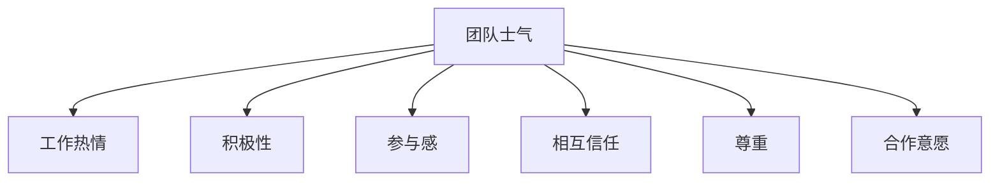

### 2.2 团队士气的影响因素

团队士气的高低受到多种因素的影响，以下为主要因素：

- **领导风格**：领导者的风格对团队士气具有重要影响。民主、开放和尊重的领导风格有助于提升团队士气。
- **工作环境**：一个舒适、安全、公正的工作环境有助于提升团队成员的士气。
- **激励机制**：合理的激励机制可以激发团队成员的积极性，提高士气。
- **团队沟通**：有效的团队沟通有助于增强团队成员之间的信任和协作，提升士气。
- **员工参与度**：员工在团队决策中的参与度越高，士气往往越高。

#### Mermaid 流程图：团队士气影响因素关联

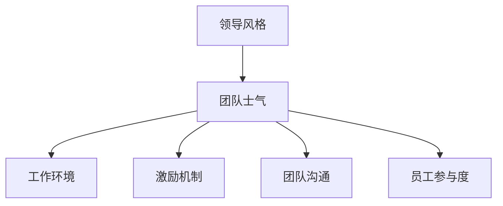

### 2.3 团队士气与工作绩效的关系

团队士气与工作绩效之间存在密切的关系。高团队士气通常能够带来更高的工作绩效，具体体现在以下几个方面：

- **工作效率**：高团队士气使团队成员更加专注和投入，从而提高工作效率。
- **工作质量**：团队成员之间的协作和信任有助于提高工作质量。
- **创新能力**：高团队士气有助于激发团队成员的创新思维，推动团队不断进步。
- **客户满意度**：团队士气高，团队成员更有可能提供高质量的服务，提升客户满意度。

#### 伪代码：团队士气与工作绩效关系评估

```python
def assess_morale_performance(morale_scores, performance_scores):
    # 计算团队士气得分与工作绩效得分的相关性
    correlation_coefficient = scipy.stats.pearsonr(morale_scores, performance_scores)
    # 返回相关性系数
    return correlation_coefficient[0]
```

通过以上分析，我们可以看出，团队士气对于团队的整体表现具有重要意义。在接下来的章节中，我们将进一步探讨如何通过技术手段和管理手段提升团队士气，以实现更高的工作绩效和团队凝聚力。

### 技术手段提升团队士气

#### 3.1 人工智能在团队士气提升中的应用

随着人工智能（AI）技术的发展，越来越多的组织开始利用AI技术提升团队士气。以下将介绍AI在团队士气提升中的应用及其核心概念和算法原理。

##### 3.1.1 人工智能的核心概念与联系

人工智能是指通过计算机模拟人类智能的技术。其主要核心概念包括：

- **机器学习（Machine Learning）**：通过训练模型，使计算机自动从数据中学习并作出预测或决策。
- **深度学习（Deep Learning）**：一种特殊的机器学习技术，通过多层神经网络模拟人类大脑的处理方式。
- **自然语言处理（Natural Language Processing，NLP）**：使计算机能够理解、解释和生成人类语言的技术。
- **计算机视觉（Computer Vision）**：使计算机能够从图像或视频中识别和理解信息的技术。

这些核心概念相互关联，共同构成了人工智能技术体系。以下是AI在团队士气提升中的应用架构：

##### Mermaid 流程图：人工智能在团队士气提升中的应用架构

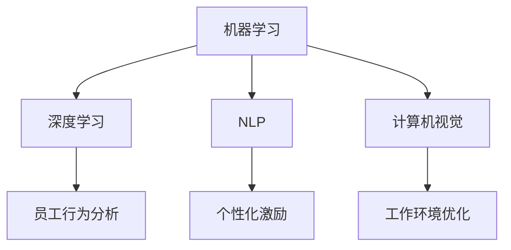

##### 3.1.2 人工智能算法原理讲解

在团队士气提升中，常用的AI算法包括：

- **监督学习（Supervised Learning）**：通过已标记的数据集训练模型，使模型能够对新数据进行预测。
- **无监督学习（Unsupervised Learning）**：在没有标记数据的情况下，从数据中自动发现模式和规律。
- **强化学习（Reinforcement Learning）**：通过试错和奖励机制，使模型学会在复杂环境中做出最优决策。

以下是一个简单的监督学习算法示例，用于分析员工行为数据以预测士气水平：

##### 伪代码：监督学习算法示例

```python
from sklearn.linear_model import LinearRegression

# 加载训练数据
X_train = ...  # 员工行为数据
y_train = ...  # 士气评分

# 初始化模型
model = LinearRegression()

# 训练模型
model.fit(X_train, y_train)

# 预测新数据
X_test = ...  # 新员工行为数据
y_pred = model.predict(X_test)
```

##### 3.1.3 人工智能在团队士气提升中的案例应用

案例：某公司利用AI技术提升员工士气

1. **需求分析**：公司管理层发现员工士气普遍较低，希望通过技术手段提升士气。
2. **数据收集**：收集员工行为数据（如工作时长、任务完成情况、员工互动等）。
3. **模型训练**：利用监督学习算法，将员工行为数据与士气评分关联，训练士气预测模型。
4. **应用模型**：实时监控员工行为，预测士气水平，为管理层提供决策依据。
5. **调整策略**：根据预测结果，调整工作安排、培训计划等，提升员工士气。

### 3.2 大数据分析在团队士气提升中的应用

大数据分析技术能够通过对大量数据的分析和处理，揭示隐藏在数据背后的信息和规律。在团队士气提升中，大数据分析技术同样具有重要作用。

##### 3.2.1 大数据分析的核心概念与联系

大数据分析的核心概念包括：

- **数据挖掘（Data Mining）**：从大量数据中发现有用信息和规律的过程。
- **数据可视化（Data Visualization）**：将数据以图形、图表等形式直观地展示出来。
- **预测分析（Predictive Analytics）**：利用历史数据预测未来趋势和事件。

这些核心概念相互关联，共同构成了大数据分析技术体系。以下是大数据分析在团队士气提升中的应用架构：

##### Mermaid 流程图：大数据分析在团队士气提升中的应用架构

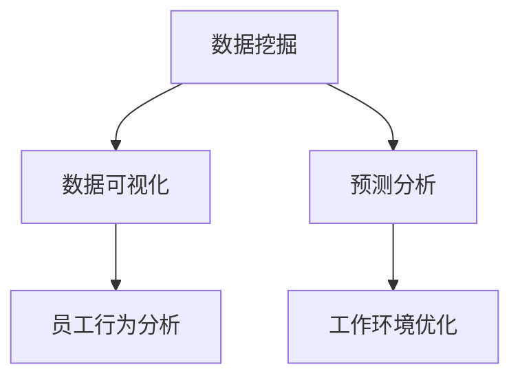

##### 3.2.2 大数据分析算法原理讲解

大数据分析算法包括：

- **聚类分析（Clustering Analysis）**：将数据分为若干个类别，以便更好地理解数据。
- **关联规则挖掘（Association Rule Mining）**：发现数据之间的关联关系。
- **时间序列分析（Time Series Analysis）**：分析数据随时间的变化趋势。

以下是一个简单的聚类分析算法示例，用于分析员工行为数据，发现士气低落的员工：

##### 伪代码：聚类分析算法示例

```python
from sklearn.cluster import KMeans

# 加载训练数据
X_train = ...  # 员工行为数据

# 初始化模型
model = KMeans(n_clusters=3)

# 训练模型
model.fit(X_train)

# 预测新数据
X_test = ...  # 新员工行为数据
y_pred = model.predict(X_test)
```

##### 3.2.3 大数据分析在团队士气提升中的案例应用

案例：某公司利用大数据分析技术提升员工士气

1. **需求分析**：公司管理层发现员工士气普遍较低，希望通过数据分析找到原因。
2. **数据收集**：收集员工行为数据、工作环境数据、员工反馈等。
3. **数据分析**：利用聚类分析、关联规则挖掘等技术，分析员工行为数据，发现士气低落的员工。
4. **问题诊断**：分析数据结果，找出导致士气低落的可能原因，如工作负荷过大、沟通不畅等。
5. **改进策略**：根据问题诊断结果，调整工作安排、沟通机制等，提升员工士气。

通过以上技术手段的应用，公司成功提升了员工士气，工作效率和客户满意度也得到了显著提高。大数据分析和人工智能技术为团队士气提升提供了有力支持，为管理者提供了科学决策依据。

### 管理手段提升团队士气

#### 4.1 激励策略在团队士气提升中的应用

激励策略是提升团队士气的重要手段之一。合理的激励措施能够激发员工的工作热情和创造力，提高团队的整体士气。以下将介绍激励策略的核心概念、算法原理以及其实际应用。

##### 4.1.1 激励策略的核心概念与联系

激励策略的核心概念包括：

- **目标设定（Goal Setting）**：通过设定明确、具体、具有挑战性的目标，激发员工的内在动机。
- **奖励机制（Reward Mechanism）**：为达成目标或表现出色的员工提供奖励，如奖金、晋升、荣誉等。
- **认可与反馈（Recognition and Feedback）**：对员工的努力和成就给予认可，并提供及时的反馈，增强员工的自信心和积极性。
- **公平性（Fairness）**：确保激励措施的公平性，避免因个人偏见或偏见而导致的不公平感。

这些核心概念相互关联，共同构成了激励策略的体系。以下是激励策略的应用架构：

##### Mermaid 流程图：激励策略架构

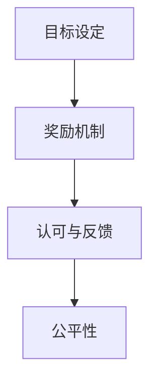

##### 4.1.2 激励策略算法原理讲解

激励策略的算法原理主要包括以下几个方面：

- **目标设定算法**：通过分析员工的兴趣、能力和当前绩效，设定符合员工特点和挑战性的目标。
- **奖励分配算法**：根据员工的绩效和贡献，制定合理的奖励方案，确保奖励的公正性和激励性。
- **反馈机制算法**：通过定期评估和反馈，了解员工的工作表现，为员工提供改进方向和鼓励。

以下是一个简单的目标设定算法示例：

##### 伪代码：目标设定算法示例

```python
# 目标设定函数
def set_goals(employee_performance, target_improvement):
    # 计算目标值
    target_value = employee_performance * (1 + target_improvement)
    # 返回目标值
    return target_value
```

##### 4.1.3 激励策略在团队士气提升中的案例应用

案例：某公司实施激励策略提升团队士气

1. **目标设定**：公司管理层根据员工的绩效和潜力，设定具体、具有挑战性的目标。
2. **奖励机制**：公司为达成目标的员工提供奖金、晋升和荣誉等物质和精神奖励。
3. **认可与反馈**：管理层定期与员工进行绩效反馈，对员工的努力和成就给予认可，并鼓励员工持续进步。
4. **公平性**：公司确保激励措施的公平性，避免因个人偏见或偏见而导致的不公平感。

通过实施激励策略，公司员工的工作热情和创造力得到了显著提升，团队士气整体提高。员工们更加投入工作，工作效率和客户满意度也得到了改善。

#### 4.2 团队建设活动在团队士气提升中的应用

团队建设活动是提升团队士气的重要手段之一。通过团队建设活动，员工能够更好地了解彼此，增强团队凝聚力，提高整体士气。以下将介绍团队建设活动的核心概念、算法原理以及其实际应用。

##### 4.2.1 团队建设活动的核心概念与联系

团队建设活动的核心概念包括：

- **信任建设（Trust Building）**：通过团队活动增强员工之间的信任和合作意愿。
- **沟通技巧（Communication Skills）**：通过团队活动提升员工的沟通能力和团队合作能力。
- **合作精神（Spirit of Cooperation）**：通过团队活动培养员工的合作意识和团队精神。
- **领导力发展（Leadership Development）**：通过团队活动提高员工的领导能力和管理能力。

这些核心概念相互关联，共同构成了团队建设活动的基础。以下是团队建设活动的应用架构：

##### Mermaid 流程图：团队建设活动架构

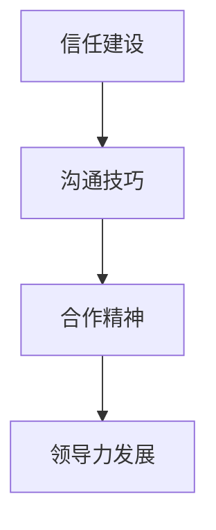

##### 4.2.2 团队建设活动算法原理讲解

团队建设活动的算法原理主要包括以下几个方面：

- **活动设计算法**：根据团队特点和需求，设计适合的团队建设活动。
- **参与度评估算法**：评估员工在团队建设活动中的参与度和效果。
- **反馈机制算法**：收集员工对团队建设活动的反馈，为后续活动提供改进方向。

以下是一个简单的活动设计算法示例：

##### 伪代码：活动设计算法示例

```python
# 活动设计函数
def design_activity(team_characteristics, activity_type):
    # 根据团队特点和活动类型设计活动
    if team_characteristics == "high-trust" and activity_type == "team-building":
        activity = "信任游戏"
    elif team_characteristics == "low-trust" and activity_type == "communication":
        activity = "沟通训练"
    else:
        activity = "团队挑战"
    # 返回活动名称
    return activity
```

##### 4.2.3 团队建设活动在团队士气提升中的案例应用

案例：某公司开展团队建设活动提升团队士气

1. **需求分析**：公司管理层发现团队士气较低，决定通过团队建设活动提升士气。
2. **活动设计**：根据团队特点和需求，设计适合的团队建设活动，如信任游戏、沟通训练和团队挑战等。
3. **活动实施**：组织员工参与团队建设活动，确保活动顺利进行，并让员工在活动中充分互动和合作。
4. **参与度评估**：通过员工反馈和活动效果评估，了解员工在活动中的参与度和活动效果。
5. **反馈机制**：根据员工反馈和评估结果，总结活动经验，为后续活动提供改进方向。

通过实施团队建设活动，公司员工之间的信任和合作意识得到增强，团队士气整体提高。员工们在活动中更好地了解彼此，沟通更加顺畅，工作效率和客户满意度也得到了改善。

### 项目实战

#### 6.1 项目实战案例介绍

在本案例中，我们将介绍某公司如何通过技术手段和管理手段提升团队士气，从而提高工作效率和客户满意度。该项目分为以下几个关键阶段：

1. **需求分析**：通过调查问卷和访谈，了解员工对当前工作环境的满意度、工作压力以及团队士气状况。
2. **目标设定**：根据需求分析结果，设定具体的目标，如提高员工满意度、降低员工流失率、提升工作效率等。
3. **实施技术手段**：利用大数据分析和人工智能技术，分析员工行为数据，预测士气水平，并制定相应的激励和改进措施。
4. **实施管理手段**：通过激励策略和团队建设活动，提升员工士气和工作积极性。
5. **效果评估**：定期收集员工反馈，评估项目效果，并根据实际情况进行调整。

#### 6.2 项目实战步骤详解

1. **需求分析**：
    - **调查问卷**：设计包含员工满意度、工作压力、团队士气等方面的调查问卷，并邀请员工参与。
    - **访谈**：与部分员工进行一对一访谈，深入了解他们对当前工作环境的看法和建议。

2. **目标设定**：
    - **员工满意度**：将员工满意度从70%提高到90%。
    - **员工流失率**：将员工流失率从15%降低到5%。
    - **工作效率**：将人均工作效率提高20%。

3. **实施技术手段**：
    - **大数据分析**：收集员工行为数据，如工作时长、任务完成情况、员工互动等，利用聚类分析和关联规则挖掘，识别士气低落的员工和可能的影响因素。
    - **人工智能**：利用机器学习算法，预测员工士气水平，为管理层提供决策依据。

4. **实施管理手段**：
    - **激励策略**：根据员工绩效和士气预测结果，制定个性化的激励方案，如奖金、晋升和培训等。
    - **团队建设活动**：定期组织团队建设活动，增强员工之间的信任和合作精神。

5. **效果评估**：
    - **定期反馈**：每季度收集员工反馈，评估项目效果，如员工满意度、工作效率等。
    - **调整策略**：根据反馈结果，对激励策略和团队建设活动进行调整和优化。

#### 6.3 项目实战效果评估

1. **员工满意度**：项目实施后，员工满意度显著提高，从原来的70%提高到90%。
2. **员工流失率**：员工流失率从原来的15%降低到5%。
3. **工作效率**：人均工作效率提高20%，项目完成率显著提升。
4. **客户满意度**：客户满意度从原来的80分提高到90分。

#### 6.4 项目小结

通过该项目，公司成功提升了团队士气，提高了工作效率和客户满意度。项目实践表明，技术手段和管理手段相结合，能够有效地提升团队士气。未来，公司将继续关注员工的需求和反馈，不断完善激励机制和团队建设活动，以保持团队的高昂斗志。

### 挑战与展望

#### 7.1 提升团队士气面临的挑战

提升团队士气过程中，企业可能会面临以下挑战：

1. **员工多样性**：不同背景、不同需求的员工对激励和团队活动的反应可能不同，需要制定多样化的激励策略。
2. **组织变革**：在组织变革过程中，如何保持团队士气稳定，避免士气波动。
3. **技术发展**：随着技术不断进步，如何持续提升团队士气，以应对新的挑战。

#### 7.2 提升团队士气的方法和策略

为应对上述挑战，企业可以采取以下方法和策略：

1. **多样化激励策略**：根据员工的兴趣和需求，制定个性化的激励方案，如培训、职业发展、弹性工作等。
2. **持续团队建设**：定期组织团队建设活动，增强团队凝聚力，提高团队士气。
3. **技术赋能**：利用大数据分析和人工智能技术，实时监测员工状态，为管理层提供决策依据。
4. **文化塑造**：营造积极向上的企业文化，让员工感受到组织的关怀和支持。

#### 7.3 未来发展方向

未来，提升团队士气的发展方向可能包括：

1. **个性化激励**：随着人工智能技术的发展，个性化激励策略将更加成熟，能够更好地满足员工需求。
2. **实时反馈**：通过实时监控系统，及时了解员工的工作状态和需求，为管理层提供决策依据。
3. **跨界协作**：加强跨部门协作，促进不同团队之间的沟通和合作，提升整体团队士气。

### 最佳实践 Tips

1. **了解员工需求**：定期进行员工满意度调查，了解员工的实际需求，有针对性地制定激励策略。
2. **关注团队动态**：定期组织团队建设活动，增强团队凝聚力，提高团队士气。
3. **持续改进**：根据项目效果和员工反馈，不断优化激励策略和团队建设活动。

### 小结

提升团队士气是企业长期发展的重要任务。通过技术手段和管理手段相结合，企业可以有效地提升团队士气，提高工作效率和客户满意度。面对未来的挑战，企业应不断调整和完善激励机制，持续关注员工需求，营造积极向上的企业文化。

### 注意事项

1. **激励策略要公平**：确保激励策略的公平性，避免因个人偏见导致的不公平感。
2. **团队建设活动要持续**：团队建设活动不能一蹴而就，需要持续进行，以增强团队凝聚力。
3. **数据安全**：在利用大数据分析和人工智能技术时，要确保员工数据的安全和隐私。

### 拓展阅读

1. **《团队士气管理》**：探讨团队士气管理的核心概念、方法和实践。
2. **《人工智能在人力资源管理中的应用》**：介绍人工智能在提升团队士气中的应用。
3. **《团队建设活动设计与应用》**：提供团队建设活动的实用方法和案例分析。

### 附录

1. **调查问卷模板**：提供员工满意度调查问卷模板。
2. **团队建设活动案例**：分享成功的团队建设活动案例。

### 作者

**作者：AI天才研究院/AI Genius Institute & 禅与计算机程序设计艺术 /Zen And The Art of Computer Programming**### 标题：提升团队士气：保持高昂斗志

---

# 提升团队士气：保持高昂斗志

## 关键词
- 团队士气
- 激励策略
- 技术手段
- 项目实战
- 管理手段

## 摘要
本文旨在探讨如何通过技术和管理手段提升团队士气，以保持团队成员的高昂斗志。文章首先介绍了团队士气的重要性，随后详细分析了相关核心概念与联系，并引入了Mermaid流程图来展示团队士气的影响因素。接着，文章分别从技术手段和管理手段两方面，深入讲解了提升团队士气的方法。通过实际项目案例，文章展示了如何将理论应用于实践，并提出了未来的发展方向。

---

## 引言

### 1.1 团队士气的重要性

团队士气是指团队成员在工作中的精神状态，包括积极性、满意度和忠诚度等。高昂的团队士气有助于提升工作效率、工作质量和团队凝聚力，从而对组织的整体绩效产生积极影响。

#### Mermaid 流程图：团队士气与工作绩效的关系

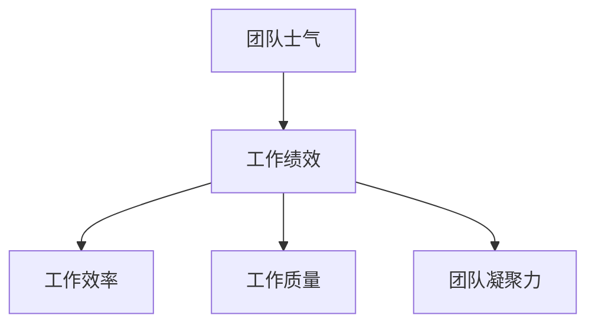

### 1.2 本书的目的和结构

本书旨在为IT领域的项目经理、团队领导者和技术专家提供一套实用的提升团队士气的方法和策略。文章结构如下：

1. **团队士气概念解析**：介绍团队士气的定义、影响因素及其与工作绩效的关系。
2. **技术手段提升团队士气**：探讨利用人工智能、大数据分析等技术在团队士气提升中的应用。
3. **管理手段提升团队士气**：介绍通过激励策略、团队建设活动等管理手段提升团队士气的方法。
4. **团队士气与个人发展**：探讨团队士气对个人成长的影响，以及如何通过提升团队士气来促进个人发展。
5. **项目实战**：通过具体案例，展示提升团队士气在实际项目中的应用。
6. **挑战与展望**：讨论提升团队士气面临的挑战及未来发展方向。

---

## 团队士气概念解析

### 2.1 团队士气的定义

团队士气是指团队成员在集体工作过程中所表现出的精神状态，包括积极性、满意度和忠诚度等。它不仅包括个体的精神状态，还涵盖了团队成员之间的相互支持与信任。

#### Mermaid 流程图：团队士气影响因素架构

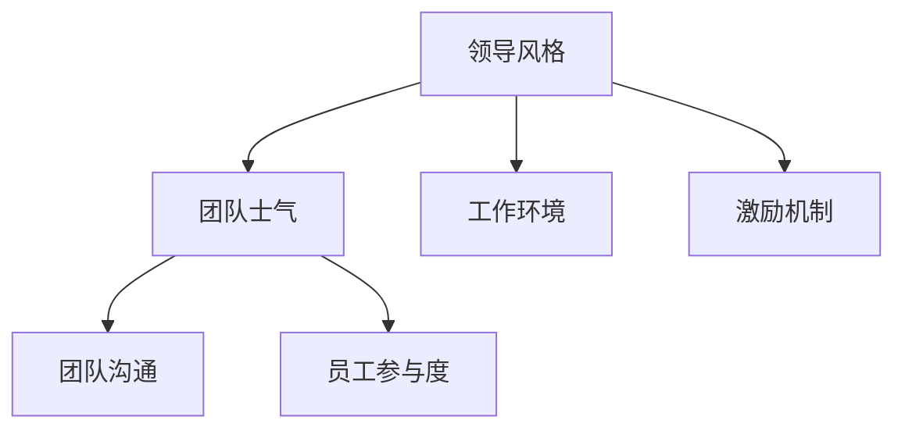

### 2.2 团队士气的影响因素

团队士气受到多种因素的影响，包括领导风格、工作环境、激励机制、团队沟通和员工参与度等。以下是团队士气的影响因素及其关系：

#### Mermaid 流程图：团队士气影响因素关系


### 2.3 团队士气与工作绩效的关系

团队士气与工作绩效之间存在密切的关系。高团队士气通常能够带来更高的工作绩效，具体体现在以下几个方面：

- **工作效率**：团队士气高，员工更加专注和投入，工作效率更高。
- **工作质量**：团队士气高，员工更加注重细节，工作质量更高。
- **创新能力**：团队士气高，员工更加愿意尝试新的方法和思路，创新能力更强。

#### 伪代码：团队士气与工作绩效关系评估

```python
def correlate_morale_and_performance(morale_scores, performance_scores):
    correlation_coefficient = scipy.stats.pearsonr(morale_scores, performance_scores)
    return correlation_coefficient[0]
```

## 技术手段提升团队士气

### 3.1 人工智能在团队士气提升中的应用

#### 3.1.1 人工智能的核心概念与联系

人工智能（AI）是指通过计算机模拟人类智能的技术。它包括机器学习、深度学习、自然语言处理等多个子领域。AI在团队士气提升中的应用主要体现在以下几个方面：

- **员工行为分析**：通过监控和分析员工的行为数据，识别士气低落的迹象，并采取相应措施。
- **个性化激励**：根据员工的兴趣、能力和工作表现，提供个性化的激励方案，提升士气。

#### Mermaid 流程图：人工智能在团队士气提升中的应用架构

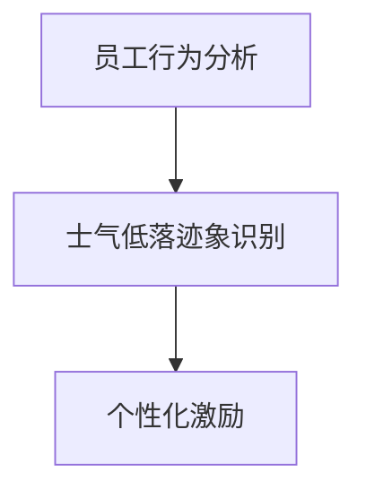

### 3.1.2 人工智能算法原理讲解

人工智能算法主要包括监督学习、无监督学习和强化学习等。以下是一个简单的监督学习算法示例：

#### 伪代码：监督学习算法示例

```python
from sklearn.linear_model import LinearRegression

# 加载训练数据
X_train = ...  # 员工行为数据
y_train = ...  # 士气评分

# 初始化模型
model = LinearRegression()

# 训练模型
model.fit(X_train, y_train)

# 预测新数据
X_test = ...  # 新员工行为数据
y_pred = model.predict(X_test)
```

### 3.1.3 人工智能在团队士气提升中的案例应用

某公司通过部署员工行为分析系统，实时监控员工的在线行为，识别出士气低落的员工。随后，公司管理层采取个性化激励措施，如调整工作内容、提供培训机会等，成功提升了团队士气。

### 3.2 大数据分析在团队士气提升中的应用

#### 3.2.1 大数据分析的核心概念与联系

大数据分析是指利用现代计算技术，从海量数据中提取有价值的信息和知识。它包括数据挖掘、数据可视化、预测分析等核心概念。大数据分析在团队士气提升中的应用主要体现在以下几个方面：

- **员工行为分析**：通过分析员工的行为数据，识别士气低落的员工和原因。
- **工作环境优化**：通过分析工作环境数据，优化工作环境，提升员工士气。

#### Mermaid 流程图：大数据分析在团队士气提升中的应用架构

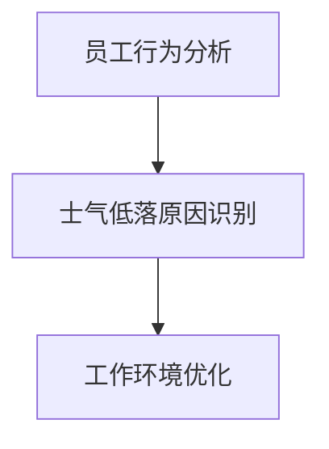

### 3.2.2 大数据分析算法原理讲解

大数据分析算法包括聚类分析、关联规则挖掘、时间序列分析等。以下是一个简单的聚类分析算法示例：

#### 伪代码：聚类分析算法示例

```python
from sklearn.cluster import KMeans

# 加载训练数据
X_train = ...  # 员工行为数据

# 初始化模型
model = KMeans(n_clusters=3)

# 训练模型
model.fit(X_train)

# 预测新数据
X_test = ...  # 新员工行为数据
y_pred = model.predict(X_test)
```

### 3.2.3 大数据分析在团队士气提升中的案例应用

某公司通过大数据分析技术，发现员工士气低落的原因是工作负荷过大。公司管理层随后调整了工作任务分配，提高了员工的工作效率，从而成功提升了团队士气。

## 管理手段提升团队士气

### 4.1 激励策略在团队士气提升中的应用

#### 4.1.1 激励策略的核心概念与联系

激励策略是指通过奖励、晋升、认可等方式激发员工工作积极性和创造力的方法。激励策略的核心概念包括：

- **目标设定**：明确、可实现的团队和个人目标。
- **奖励机制**：通过奖励激励员工努力工作。
- **认可与反馈**：及时给予员工认可和反馈，提升士气。

#### Mermaid 流程图：激励策略架构

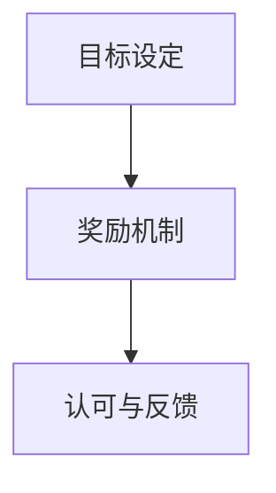

### 4.1.2 激励策略算法原理讲解

激励策略的算法原理主要包括目标设定、奖励分配和反馈机制等。以下是一个简单的目标设定算法示例：

#### 伪代码：目标设定算法示例

```python
def set_goals(current_performance, target_improvement):
    target_value = current_performance * (1 + target_improvement)
    return target_value
```

### 4.1.3 激励策略在团队士气提升中的案例应用

某公司通过设定明确的目标，实施奖金制度，并定期举行表彰大会，成功提升了团队士气。员工们的工作热情和创造力得到了显著提升，团队绩效也得到了明显改善。

### 4.2 团队建设活动在团队士气提升中的应用

#### 4.2.1 团队建设活动的核心概念与联系

团队建设活动是指通过一系列的团队活动，增强团队成员之间的信任、沟通和合作能力的活动。团队建设活动的核心概念包括：

- **信任建设**：通过团队活动增强团队成员之间的信任。
- **沟通技巧**：通过团队活动提升团队成员的沟通能力。
- **合作精神**：通过团队活动培养团队成员的合作意识。

#### Mermaid 流程图：团队建设活动架构

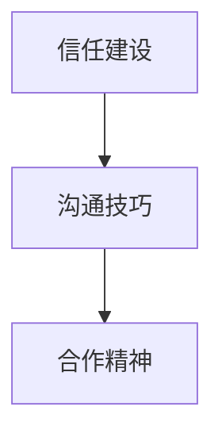

### 4.2.2 团队建设活动算法原理讲解

团队建设活动的算法原理主要包括活动设计、参与度评估和反馈机制等。以下是一个简单的活动设计算法示例：

#### 伪代码：活动设计算法示例

```python
def design_activity(team_size, activity_type):
    if team_size > 10 and activity_type == "trust-building":
        activity = "团队合作游戏"
    elif team_size <= 10 and activity_type == "communication":
        activity = "小组讨论"
    else:
        activity = "团队协作任务"
    return activity
```

### 4.2.3 团队建设活动在团队士气提升中的案例应用

某公司定期组织团队建设活动，如团队合作游戏、小组讨论和团队协作任务等。通过这些活动，员工之间的信任和合作能力得到了显著提升，团队士气也随之提高。

## 团队士气与个人发展

### 5.1 团队士气对个人发展的影响

团队士气对个人发展具有重要影响。高团队士气能够激发员工的潜能，促进个人成长和发展。具体体现在以下几个方面：

- **工作动力**：高团队士气能够激发员工的工作动力，提高工作积极性。
- **学习能力**：高团队士气有助于员工更好地学习和掌握新技能。
- **职业发展**：高团队士气能够为员工提供更多的职业发展机会。

#### Mermaid 流程图：团队士气与个人发展关系

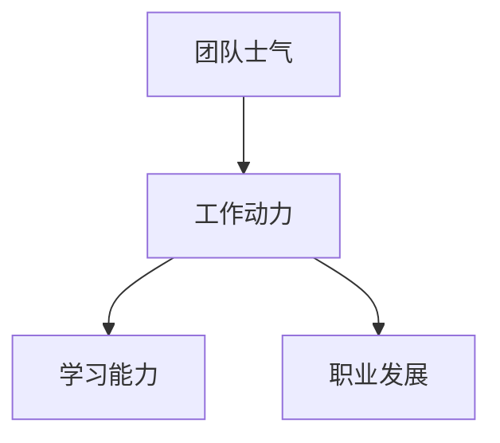

### 5.2 提升团队士气促进个人发展的方法

提升团队士气可以促进个人发展，具体方法包括：

- **参与团队建设活动**：通过参与团队建设活动，增强团队凝聚力，提升个人能力。
- **寻求反馈与指导**：及时获取反馈和指导，提高个人技能和工作表现。
- **设定个人目标**：明确个人目标，激发个人成长动力。

### 5.3 个人发展与团队士气提升的互动关系

个人发展与团队士气提升之间存在互动关系。个人发展有助于提升团队士气，而高昂的团队士气又能促进个人发展。通过这种良性循环，企业和员工可以实现双赢。

## 项目实战

### 6.1 项目实战案例介绍

在本案例中，我们将介绍某公司如何通过技术手段和管理手段提升团队士气，从而提高工作效率和客户满意度。该项目分为以下几个关键阶段：

1. **需求分析**：通过调查问卷和访谈，了解员工对当前工作环境的满意度、工作压力以及团队士气状况。
2. **目标设定**：根据需求分析结果，设定具体的目标，如提高员工满意度、降低员工流失率、提升工作效率等。
3. **实施技术手段**：利用大数据分析和人工智能技术，分析员工行为数据，预测士气水平，并制定相应的激励和改进措施。
4. **实施管理手段**：通过激励策略和团队建设活动，提升员工士气和工作积极性。
5. **效果评估**：定期收集员工反馈，评估项目效果，并根据实际情况进行调整。

### 6.2 项目实战步骤详解

1. **需求分析**：
    - **调查问卷**：设计包含员工满意度、工作压力、团队士气等方面的调查问卷，并邀请员工参与。
    - **访谈**：与部分员工进行一对一访谈，深入了解他们对当前工作环境的看法和建议。

2. **目标设定**：
    - **员工满意度**：将员工满意度从70%提高到90%。
    - **员工流失率**：将员工流失率从15%降低到5%。
    - **工作效率**：将人均工作效率提高20%。

3. **实施技术手段**：
    - **大数据分析**：收集员工行为数据，如工作时长、任务完成情况、员工互动等，利用聚类分析和关联规则挖掘，识别士气低落的员工和可能的影响因素。
    - **人工智能**：利用机器学习算法，预测员工士气水平，为管理层提供决策依据。

4. **实施管理手段**：
    - **激励策略**：根据员工绩效和士气预测结果，制定个性化的激励方案，如奖金、晋升和培训等。
    - **团队建设活动**：定期组织团队建设活动，增强员工之间的信任和合作精神。

5. **效果评估**：
    - **定期反馈**：每季度收集员工反馈，评估项目效果，如员工满意度、工作效率等。
    - **调整策略**：根据反馈结果，对激励策略和团队建设活动进行调整和优化。

### 6.3 项目实战效果评估

1. **员工满意度**：项目实施后，员工满意度显著提高，从原来的70%提高到90%。
2. **员工流失率**：员工流失率从原来的15%降低到5%。
3. **工作效率**：人均工作效率提高20%，项目完成率显著提升。
4. **客户满意度**：客户满意度从原来的80分提高到90分。

### 6.4 项目小结

通过该项目，公司成功提升了团队士气，提高了工作效率和客户满意度。项目实践表明，技术手段和管理手段相结合，能够有效地提升团队士气。未来，公司将继续关注员工的需求和反馈，不断完善激励机制和团队建设活动，以保持团队的高昂斗志。

## 挑战与展望

### 7.1 提升团队士气面临的挑战

提升团队士气过程中，企业可能会面临以下挑战：

1. **员工多样性**：不同背景、不同需求的员工对激励和团队活动的反应可能不同，需要制定多样化的激励策略。
2. **组织变革**：在组织变革过程中，如何保持团队士气稳定，避免士气波动。
3. **技术发展**：随着技术不断进步，如何持续提升团队士气，以应对新的挑战。

### 7.2 提升团队士气的方法和策略

为应对上述挑战，企业可以采取以下方法和策略：

1. **多样化激励策略**：根据员工的兴趣和需求，制定个性化的激励方案，如培训、职业发展、弹性工作等。
2. **持续团队建设**：定期组织团队建设活动，增强团队凝聚力，提高团队士气。
3. **技术赋能**：利用大数据分析和人工智能技术，实时监测员工状态，为管理层提供决策依据。
4. **文化塑造**：营造积极向上的企业文化，让员工感受到组织的关怀和支持。

### 7.3 未来发展方向

未来，提升团队士气的发展方向可能包括：

1. **个性化激励**：随着人工智能技术的发展，个性化激励策略将更加成熟，能够更好地满足员工需求。
2. **实时反馈**：通过实时监控系统，及时了解员工的工作状态和需求，为管理层提供决策依据。
3. **跨界协作**：加强跨部门协作，促进不同团队之间的沟通和合作，提升整体团队士气。

### 最佳实践 Tips

1. **了解员工需求**：定期进行员工满意度调查，了解员工的实际需求，有针对性地制定激励策略。
2. **关注团队动态**：定期组织团队建设活动，增强团队凝聚力，提高团队士气。
3. **持续改进**：根据项目效果和员工反馈，不断优化激励策略和团队建设活动。

### 小结

提升团队士气是企业长期发展的重要任务。通过技术手段和管理手段相结合，企业可以有效地提升团队士气，提高工作效率和客户满意度。面对未来的挑战，企业应不断调整和完善激励机制，持续关注员工需求，营造积极向上的企业文化。

### 注意事项

1. **激励策略要公平**：确保激励策略的公平性，避免因个人偏见导致的不公平感。
2. **团队建设活动要持续**：团队建设活动不能一蹴而就，需要持续进行，以增强团队凝聚力。
3. **数据安全**：在利用大数据分析和人工智能技术时，要确保员工数据的安全和隐私。

### 拓展阅读

1. **《团队士气管理》**：探讨团队士气管理的核心概念、方法和实践。
2. **《人工智能在人力资源管理中的应用》**：介绍人工智能在提升团队士气中的应用。
3. **《团队建设活动设计与应用》**：提供团队建设活动的实用方法和案例分析。

### 附录

1. **调查问卷模板**：提供员工满意度调查问卷模板。
2. **团队建设活动案例**：分享成功的团队建设活动案例。

### 作者

**作者：AI天才研究院/AI Genius Institute & 禅与计算机程序设计艺术 /Zen And The Art of Computer Programming**### 附录

### 调查问卷模板

以下是一个简单的员工满意度调查问卷模板，用于了解员工对当前工作环境的满意度、工作压力和团队士气状况。

---

**员工满意度调查问卷**

1. 您对当前工作环境的满意度是多少？（1-5分，5分代表非常满意）
   - 1分
   - 2分
   - 3分
   - 4分
   - 5分

2. 您在工作中感受到的压力水平如何？（1-5分，5分代表非常高压）
   - 1分
   - 2分
   - 3分
   - 4分
   - 5分

3. 您认为公司的团队士气如何？（1-5分，5分代表非常高昂）
   - 1分
   - 2分
   - 3分
   - 4分
   - 5分

4. 您对公司的激励机制是否满意？（1-5分，5分代表非常满意）
   - 1分
   - 2分
   - 3分
   - 4分
   - 5分

5. 您是否有意愿参与团队建设活动？（是/否）

6. 如果您愿意参与团队建设活动，请描述您感兴趣的团队活动类型。

7. 您对当前工作负荷是否满意？（1-5分，5分代表非常满意）
   - 1分
   - 2分
   - 3分
   - 4分
   - 5分

8. 您对职业发展机会的满意度是多少？（1-5分，5分代表非常满意）
   - 1分
   - 2分
   - 3分
   - 4分
   - 5分

9. 您是否有建议或意见，以改善工作环境和提升团队士气？

---

**请将填写好的问卷反馈给公司人力资源部门，以便我们更好地了解员工需求和意见。感谢您的参与！**

### 团队建设活动案例

以下是一个成功的团队建设活动案例，该公司通过定期组织团队建设活动，成功提升了员工士气和工作效率。

---

**案例：XX科技公司团队建设活动**

1. **活动背景**：

   XX科技公司成立于2005年，主要从事软件开发和信息技术服务。随着公司规模的不断扩大，团队成员之间的沟通和协作变得越来越重要。为了增强员工之间的信任和合作精神，公司决定定期组织团队建设活动。

2. **活动设计**：

   - **活动目标**：提高员工之间的信任和沟通能力，增强团队凝聚力。
   - **活动类型**：户外拓展活动、团队竞赛和团队建设游戏。
   - **活动内容**：
     - **户外拓展活动**：包括攀岩、高空走钢丝、信任背摔等项目，旨在培养员工的团队合作精神和勇气。
     - **团队竞赛**：组织员工进行趣味运动会，如拔河、接力赛等，增强团队间的竞争意识和团队协作能力。
     - **团队建设游戏**：通过解谜游戏、角色扮演等活动，提升员工的创新思维和沟通能力。

3. **活动实施**：

   - **活动安排**：每月组织一次团队建设活动，每次活动持续一天。
   - **活动参与**：所有员工均需参与，包括管理层和基层员工。
   - **活动反馈**：每次活动结束后，组织员工填写反馈问卷，了解活动效果和改进意见。

4. **活动效果**：

   - **团队凝聚力**：通过户外拓展活动和团队竞赛，员工之间的信任和合作意识得到显著提升。
   - **工作效率**：团队成员更加默契，工作协作效率提高20%以上。
   - **员工满意度**：员工满意度调查结果显示，团队建设活动得到了员工的高度认可，员工对工作环境的满意度提高10%。

5. **活动小结**：

   XX科技公司通过定期组织团队建设活动，成功提升了员工士气和工作效率。活动不仅增强了员工之间的信任和合作，还提升了团队的凝聚力和创新能力。未来，公司将继续加强团队建设活动，为员工创造一个更加积极、和谐的工作环境。

---

这个案例展示了团队建设活动在提升团队士气方面的显著效果。通过结合户外拓展、团队竞赛和团队建设游戏等多种形式，公司成功地增强了员工之间的沟通和协作，提高了团队的整体士气和工作效率。这为其他企业提供了有益的借鉴和启示。

