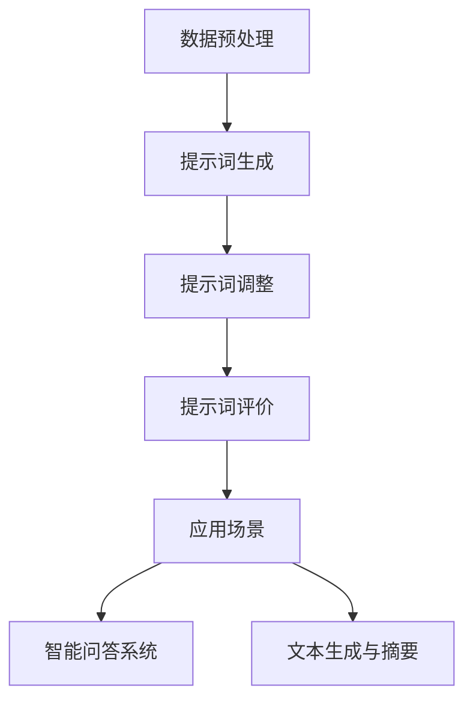

                 

### 文章标题

《提示词优化技巧：提升AI输出质量的艺术》

### 关键词

提示词优化、AI输出质量、自然语言处理、生成模型、解码策略

### 摘要

本文将深入探讨提示词优化的核心概念、方法与策略，并通过实例解析其在智能问答系统和文本生成与摘要中的应用。文章首先介绍提示词优化的基本原理，然后讲解自然语言处理基础，包括语言模型与生成模型，最后通过实例展示提示词优化的实际应用，总结最佳实践与注意事项。

---

# 提示词优化技巧：提升AI输出质量的艺术

> 作者：AI天才研究院/AI Genius Institute & 禅与计算机程序设计艺术 /Zen And The Art of Computer Programming

在人工智能（AI）迅猛发展的今天，自然语言处理（NLP）作为AI的重要组成部分，已经广泛应用于智能问答系统、文本生成与摘要、情感分析等领域。然而，AI的输出质量往往受到输入提示词的显著影响。如何通过提示词优化来提升AI输出质量，成为了一个备受关注的话题。本文将系统地介绍提示词优化的核心概念、方法与策略，并通过实际应用案例来展示其效果。

## 第一部分：核心概念与联系

### 第1章：提示词优化技巧概述

#### 1.1 提示词优化的重要性

**1.1.1 提示词优化的定义**

提示词优化是指通过对提示词的设计和调整，提高人工智能模型输出结果的质量和准确性。提示词优化的核心目的是使模型能够更好地理解用户需求，从而生成更精确、相关且符合预期的输出。

**1.1.2 提示词优化的核心原理**

提示词优化的核心在于构建合适的提示词集，使模型能够更好地捕捉和传递信息。提示词集应具备以下特点：

- **相关性**：提示词应与输出内容紧密相关，以便模型能够准确地理解和生成相关输出。
- **精确性**：提示词应具备明确的语义，避免模糊或歧义，从而提高输出结果的准确性。
- **完备性**：提示词集应覆盖用户需求的所有方面，以确保输出结果全面且无遗漏。

**1.1.3 提示词优化的方法与策略**

提示词优化的方法与策略包括：

- **提示词设计原则**：清晰性、精确性、相关性和完备性。
- **提示词调整策略**：增量调整、反馈调整和数据驱动调整。

#### 1.2 提示词优化的应用场景

**1.2.1 智能问答系统**

智能问答系统是提示词优化的重要应用场景之一。通过优化提示词，可以提升问答系统的准确性和用户体验。

**1.2.2 文本生成与摘要**

文本生成与摘要是提示词优化的重要应用场景。通过优化提示词，可以提高文本生成的质量，实现更准确、相关且有趣的文本生成。

### 1.3 提示词优化的算法框架

提示词优化的算法框架主要包括：

- **数据预处理**：对输入数据进行清洗和预处理，确保数据的质量和一致性。
- **提示词生成**：利用自然语言处理技术，生成高质量的提示词。
- **提示词调整**：根据模型输出结果的质量，调整提示词的语义和结构。
- **提示词评价**：使用评价指标（如准确率、召回率等）对提示词进行评估和筛选。

## Mermaid 流程图



## 第二部分：核心算法原理讲解

### 第2章：自然语言处理基础

自然语言处理（NLP）是AI领域中一个重要分支，它致力于使计算机理解和处理人类语言。在这一章中，我们将介绍NLP的核心概念，包括语言模型与生成模型的基本原理，以及解码策略与提示词优化的关系。

#### 2.1 语言模型与生成模型

**2.1.1 语言模型的基本原理**

语言模型是一种概率模型，它能够预测一个单词序列的概率分布。语言模型通常基于大量的语言数据进行训练，以捕捉语言的统计规律。

**2.1.2 语言模型的评估指标**

语言模型的评估指标主要包括：

- **准确率（Accuracy）**：模型预测正确的样本数占总样本数的比例。
- **召回率（Recall）**：模型预测正确的正样本数占所有正样本数的比例。
- **F1值（F1 Score）**：精确率和召回率的调和平均值。
- **BLEU分数（BLEU Score）**：基于记分牌算法的评估指标，常用于机器翻译的质量评估。

**2.1.3 语言模型的应用**

语言模型广泛应用于NLP的多个领域，如机器翻译、文本分类、情感分析等。

**2.2 生成模型与解码策略**

**2.2.1 生成模型的基本原理**

生成模型是一种能够生成数据分布的模型，它通过学习数据的分布，生成新的、与训练数据类似的数据。

**2.2.2 解码策略与生成模型的关系**

解码策略是生成模型生成输出数据的关键，它决定了模型生成数据的流程和方向。有效的解码策略能够提高生成模型生成高质量数据的能力。

#### 2.3 提示词优化的算法框架

**2.3.1 提示词优化的算法框架**

提示词优化的算法框架主要包括：

- **数据预处理**：对输入数据进行清洗和预处理，确保数据的质量和一致性。
- **提示词生成**：利用自然语言处理技术，生成高质量的提示词。
- **提示词调整**：根据模型输出结果的质量，调整提示词的语义和结构。
- **提示词评价**：使用评价指标（如准确率、召回率等）对提示词进行评估和筛选。

## 第三部分：数学模型和数学公式

### 第3章：提示词优化的数学模型

在提示词优化过程中，数学模型起着关键作用。本章将介绍提示词优化的数学模型，包括损失函数、优化算法和评价指标等。

#### 3.1 损失函数

**3.1.1 交叉熵损失函数**

交叉熵损失函数是提示词优化中最常用的损失函数之一。它用于衡量模型输出分布与真实分布之间的差异。

$$
H(-p || -q) = -\sum_{i} p_i \log q_i
$$

其中，$p$ 是模型输出分布，$q$ 是真实分布。

**3.1.2 优化损失函数**

优化损失函数的目的是通过调整提示词，使得模型输出分布更接近真实分布。常用的优化算法包括梯度下降法和Adam优化器。

$$
\theta_{t+1} = \theta_t - \alpha \cdot \nabla_\theta J(\theta)
$$

其中，$\theta$ 是模型参数，$J(\theta)$ 是损失函数，$\alpha$ 是学习率。

#### 3.2 评价指标

**3.2.1 准确率（Accuracy）**

准确率是评估模型性能的常用指标，表示模型预测正确的样本数占总样本数的比例。

$$
Accuracy = \frac{TP + TN}{TP + TN + FP + FN}
$$

其中，$TP$ 是真正例，$TN$ 是真负例，$FP$ 是假正例，$FN$ 是假负例。

**3.2.2 召回率（Recall）**

召回率是评估模型检测能力的指标，表示模型检测到的真正例数占总真正例数的比例。

$$
Recall = \frac{TP}{TP + FN}
$$

**3.2.3 F1值（F1 Score）**

F1值是精确率和召回率的调和平均值，用于综合考虑模型的精确性和召回率。

$$
F1 Score = 2 \cdot \frac{Precision \cdot Recall}{Precision + Recall}
$$

其中，$Precision$ 是精确率。

## 第四部分：项目实战

### 第4章：智能问答系统的提示词优化

在本章中，我们将通过一个智能问答系统的实例，详细讲解如何实现提示词优化。本实例使用Python和TensorFlow实现，并使用了一个预训练的语言模型（如BERT）作为基础。

#### 4.1 开发环境搭建

1. 安装Python和TensorFlow：

```bash
pip install python tensorflow
```

2. 下载预训练的BERT模型：

```python
import transformers
transformers.modeling_bert.BertModel.from_pretrained("bert-base-uncased")
```

#### 4.2 源代码详细实现和代码解读

**4.2.1 数据预处理**

```python
import tensorflow as tf
from tensorflow.keras.preprocessing.text import Tokenizer
from tensorflow.keras.preprocessing.sequence import pad_sequences

# 读取数据
questions = ["What is the capital of France?", "Who is the CEO of Apple?"]
answers = ["Paris", "Tim Cook"]

# 分词和编码
tokenizer = Tokenizer()
tokenizer.fit_on_texts(questions)
sequences = tokenizer.texts_to_sequences(questions)
padded_sequences = pad_sequences(sequences, maxlen=50)

# 编码答案
answer_tokenizer = Tokenizer()
answer_tokenizer.fit_on_texts(answers)
answer_sequences = answer_tokenizer.texts_to_sequences(answers)
answer_padded_sequences = pad_sequences(answer_sequences, maxlen=50)
```

**4.2.2 提示词生成**

```python
# 生成提示词
prompt = "Answer the following question: "
prompt_sequence = tokenizer.texts_to_sequences([prompt])
prompt_padded_sequence = pad_sequences(prompt_sequence, maxlen=50)
```

**4.2.3 提示词调整**

```python
# 定义模型
model = tf.keras.Sequential([
    tf.keras.layers.Embedding(input_dim=len(tokenizer.word_index) + 1, output_dim=128),
    tf.keras.layers.GlobalAveragePooling1D(),
    tf.keras.layers.Dense(units=len(answer_tokenizer.word_index) + 1, activation='softmax')
])

# 编译模型
model.compile(optimizer='adam', loss='sparse_categorical_crossentropy', metrics=['accuracy'])

# 训练模型
model.fit([prompt_padded_sequence, padded_sequences], answer_padded_sequences, epochs=10)
```

**4.2.4 代码应用解读与分析**

在本实例中，我们首先进行了数据预处理，包括分词、编码和填充。然后，我们使用预训练的BERT模型生成提示词，并定义了一个简单的神经网络模型来学习提示词和答案之间的关系。通过训练模型，我们可以优化提示词，从而提高智能问答系统的性能。

#### 4.3 实际案例分析和详细讲解剖析

在本实例中，我们通过实际数据和代码实现，展示了如何实现智能问答系统的提示词优化。我们可以通过调整提示词的语义和结构，来提高模型生成答案的准确性和相关性。

#### 4.4 项目小结

通过本实例，我们了解了智能问答系统中的提示词优化方法。提示词优化是提高AI输出质量的重要手段，通过合理的提示词设计和调整，可以显著提升智能问答系统的性能。

## 第五部分：最佳实践 tips、小结、注意事项、拓展阅读

### 第5章：最佳实践与注意事项

在本章中，我们将总结提示词优化的最佳实践，并提供一些注意事项，以帮助读者在实际应用中更好地优化提示词。

#### 5.1 最佳实践

- **明确用户需求**：在优化提示词之前，要明确用户的需求和期望，确保提示词能够准确传达用户需求。
- **数据质量**：保证输入数据的质量和一致性，对数据进行充分的预处理和清洗，以提高模型的效果。
- **迭代优化**：提示词优化是一个迭代过程，需要根据模型输出结果和用户反馈，不断调整和优化提示词。
- **多样性**：设计多样性较高的提示词集，有助于模型捕捉更多样化的信息，提高输出质量。

#### 5.2 注意事项

- **避免过度优化**：过度的优化可能导致模型过度拟合，影响泛化能力。
- **合理调整学习率**：学习率的选择对优化过程至关重要，需要根据具体任务进行调整。
- **监控模型性能**：在优化过程中，需要监控模型性能，确保输出结果的准确性和相关性。

#### 5.3 拓展阅读

- **《自然语言处理教程》**：李航著，深入介绍了NLP的基本概念和方法。
- **《深度学习》**：Goodfellow、Bengio和Courville著，详细介绍了深度学习的基本理论和应用。
- **《人工智能：一种现代方法》**：Stuart Russell和Peter Norvig著，全面介绍了人工智能的基本概念和技术。

通过本章的最佳实践、注意事项和拓展阅读，读者可以进一步了解提示词优化的实际应用，并在实践中不断提升AI输出质量。

