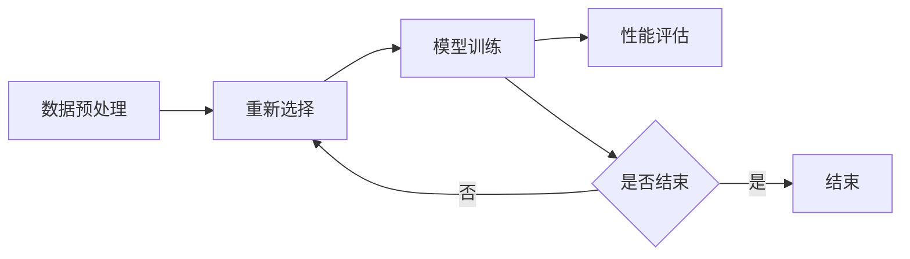
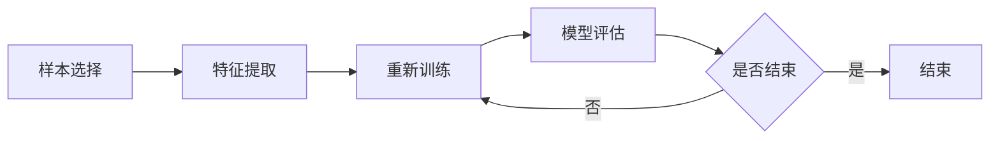

                 


## 文章标题
《提示词优化的少样本学习方法》

## 文章关键词
少样本学习，提示词优化，人工智能，机器学习，深度学习

## 文章摘要
本文深入探讨了提示词优化的少样本学习方法，通过解析其核心概念、联系、算法原理以及数学模型，提供了详细的项目实战案例分析，旨在为读者提供一个全面、深入理解该领域的方法论。

---

## 第一部分：引言

### 1.1 书籍背景
在人工智能和机器学习的快速发展中，少样本学习成为了一个备受关注的研究方向。少样本学习旨在在只有少量标注数据的情况下，能够有效地训练出高精度的模型。然而，传统的机器学习方法在少样本场景下往往表现不佳。提示词优化作为一种新兴的方法，通过在模型训练过程中引入外部知识库和提示词，能够显著提升模型的性能。

#### 1.1.1 少样本学习的重要性
少样本学习的重要性体现在多个方面。首先，在许多实际应用中，获取大量标注数据是非常困难和耗时的。例如，医疗图像分析、法律文本分析等领域，数据的获取和标注成本极高。其次，在个性化推荐、智能客服等应用场景中，用户的行为数据通常只能提供少量的样本，传统的机器学习方法难以胜任。因此，研究少样本学习具有重要的理论和实际意义。

#### 1.1.2 提示词优化的应用场景
提示词优化方法在少样本学习中的应用非常广泛。例如，在自然语言处理领域，通过在模型训练过程中引入相关领域的知识库和提示词，可以显著提升模型在文本分类、机器翻译等任务上的表现。在计算机视觉领域，提示词优化同样可以用于图像分类、目标检测等任务，通过引入先验知识和提示词，可以有效提高模型的泛化能力。

### 1.2 书籍目标
本文的目标是系统地介绍和探讨提示词优化的少样本学习方法。具体目标包括：
- 梳理和阐述少样本学习和提示词优化的基本概念、原理和方法。
- 分析提示词优化在少样本学习中的应用，并通过具体案例进行说明。
- 提供详细的项目实战指导，帮助读者理解和掌握该方法。

#### 1.2.1 学习目标
通过本文的学习，读者应该能够：
- 理解少样本学习和提示词优化的基本概念和原理。
- 掌握提示词优化的核心算法和数学模型。
- 学会使用提示词优化方法解决实际问题，并具备一定的项目实战能力。

#### 1.2.2 读者群体
本文适合以下读者群体：
- 对人工智能和机器学习感兴趣的初学者。
- 想要在少样本学习领域深入研究的学者和研究者。
- 想要提升模型性能的AI工程师和开发者。

---

## 第二部分：核心概念与联系

### 2.1 提示词优化的基本概念
#### 2.1.1 提示词的定义与作用
提示词（Prompt）是在模型训练过程中提供的一组预先定义的词语或短语，用于引导模型学习。提示词通常来自外部知识库或领域特定语言，能够提供与任务相关的先验知识。在少样本学习中，提示词的作用尤为重要，因为它们可以帮助模型在仅有少量样本的情况下，快速捕捉到任务的关键信息。

#### 2.1.2 优化的目标与方法
提示词优化的目标是通过调整提示词的选择和组合，提高模型在特定任务上的性能。优化方法主要包括基于规则的方法和基于机器学习的方法。前者依赖于人工设计的规则，后者则通过训练模型来自动选择最优的提示词。

#### 2.1.3 提示词优化的核心原理
提示词优化的核心原理是利用提示词作为辅助信息，引导模型在学习过程中更好地理解和处理任务。具体来说，提示词可以通过以下几种方式发挥作用：
1. **信息引导**：提示词提供的信息可以帮助模型快速聚焦于任务的关键部分，避免在学习过程中陷入局部最优。
2. **知识融合**：提示词中的先验知识可以与模型学习到的知识相结合，提高模型的泛化能力。
3. **任务匹配**：通过调整提示词，可以使模型更好地匹配特定任务的需求，从而提高模型的性能。

### 2.2 少样本学习的基本概念
#### 2.2.1 少样本学习的定义与挑战
少样本学习（Few-shot Learning）是指在没有大量标注数据的情况下，通过学习少量样本来训练出高精度模型的机器学习技术。少样本学习面临的主要挑战包括样本不足、数据分布变化、模型泛化能力等。

#### 2.2.2 少样本学习的应用场景
少样本学习在以下场景中具有广泛的应用：
1. **个性化推荐**：在用户数据有限的情况下，通过少样本学习可以实现对用户的精准推荐。
2. **医疗诊断**：在医学图像分析中，少样本学习可以帮助医生在仅有少量病例数据的情况下做出准确的诊断。
3. **工业应用**：在制造业和质量检测中，少样本学习可以帮助快速识别和分类生产过程中的缺陷。

#### 2.2.3 少样本学习的研究方法
少样本学习的研究方法主要包括：
1. **迁移学习**：通过利用预先训练好的模型和大量未标注的数据，来提升在少量标注数据上的性能。
2. **元学习**：通过训练一个模型来学习如何快速适应新的任务，从而在少量样本上实现高精度的预测。
3. **模型蒸馏**：通过将大模型的知识蒸馏到小模型中，来实现少样本学习。

### 2.3 提示词优化与少样本学习的联系
#### 2.3.1 提示词优化如何解决少样本学习问题
提示词优化能够解决少样本学习中的几个关键问题：
1. **样本不足**：通过提示词提供额外的信息，可以弥补样本不足的问题。
2. **数据分布变化**：提示词可以帮助模型更好地适应不同的数据分布。
3. **模型泛化能力**：通过融合提示词中的先验知识，可以提高模型的泛化能力。

#### 2.3.2 提示词优化在少样本学习中的应用案例
在实际应用中，提示词优化在少样本学习中的效果显著。例如，在图像分类任务中，通过引入领域特定的提示词，可以显著提升模型在少量样本下的分类准确性。在文本分类任务中，提示词优化同样能够提高模型在少量训练数据下的性能。

---

## 第三部分：核心算法原理讲解

### 3.1 提示词优化的算法框架
#### 3.1.1 提示词优化的算法概述
提示词优化的算法框架主要包括以下步骤：
1. **数据预处理**：从外部知识库中提取相关提示词。
2. **提示词选择**：根据任务需求，选择合适的提示词组合。
3. **模型训练**：在提示词的引导下，训练机器学习模型。
4. **性能评估**：评估模型在少样本学习任务上的性能。

#### 3.1.2 提示词优化的算法分类
根据不同的优化目标，提示词优化算法可以分为以下几类：
1. **基于规则的方法**：通过设计特定的规则，从知识库中选择提示词。
2. **基于机器学习的方法**：通过训练模型来自动选择最优的提示词。
3. **基于元学习的方法**：通过学习如何快速适应新任务，来优化提示词。

#### 3.1.3 提示词优化的算法框架 Mermaid 流程图


### 3.2 少样本学习的算法框架
#### 3.2.1 少样本学习的算法概述
少样本学习的算法框架主要包括以下几个阶段：
1. **样本选择**：从大量未标注数据中选择少量样本。
2. **特征提取**：对选择的样本进行特征提取。
3. **模型训练**：利用提取的特征训练模型。
4. **模型评估**：评估模型在少样本数据集上的性能。

#### 3.2.2 少样本学习的算法分类
少样本学习算法可以根据任务类型和优化目标进行分类：
1. **基于迁移学习的算法**：通过迁移预先训练好的模型来提升少样本任务的性能。
2. **基于元学习的算法**：通过训练模型来学习如何快速适应新的任务。
3. **基于模型蒸馏的算法**：通过将大模型的知识蒸馏到小模型中，实现少样本学习。

#### 3.2.3 少样本学习的算法框架 Mermaid 流程图


### 3.3 提示词优化与少样本学习的融合算法
#### 3.3.1 提示词优化与少样本学习融合算法的原理
提示词优化与少样本学习的融合算法旨在通过引入提示词，提升在少样本场景下的模型性能。其基本原理如下：
1. **提示词引导**：在模型训练过程中引入提示词，引导模型聚焦于关键信息。
2. **知识融合**：将提示词中的先验知识与模型学习到的知识进行融合，提高模型泛化能力。
3. **性能优化**：通过优化提示词的选择和组合，提升模型在少样本任务上的性能。

#### 3.3.2 提示词优化与少样本学习融合算法的伪代码
```python
# 初始化模型
model = Model()

# 提取提示词
prompts = extract_prompts(knowledge_base, task)

# 训练模型
for sample in samples:
    model.train(sample, prompts)

# 评估模型
performance = model.evaluate(test_data)

# 输出性能
print("Model performance on test data:", performance)
```

---

## 第四部分：数学模型和数学公式

### 4.1 提示词优化的数学模型
#### 4.1.1 提示词优化的目标函数
提示词优化的目标函数通常定义为最小化模型在提示词引导下的误差。假设模型为 \(M\)，提示词为 \(\mathbf{p}\)，输入数据为 \(\mathbf{x}\)，目标函数可以表示为：
$$\min_{M} \sum_{i=1}^{n} \ell(M(\mathbf{x}_i + \mathbf{p}), \mathbf{y}_i)$$
其中，\(\ell\) 表示损失函数，\(\mathbf{y}_i\) 表示真实标签。

#### 4.1.2 提示词优化的约束条件
提示词优化的约束条件通常包括模型的可训练性和提示词的多样性。具体来说，可以设定以下约束：
1. **模型可训练性**：模型必须在给定提示词下可训练，即满足可导性。
2. **提示词多样性**：提示词需要涵盖多个方面的知识，以提高模型的泛化能力。

#### 4.1.3 提示词优化的数学模型公式
综合目标函数和约束条件，提示词优化的数学模型可以表示为：
$$\min_{M, \mathbf{p}} \sum_{i=1}^{n} \ell(M(\mathbf{x}_i + \mathbf{p}), \mathbf{y}_i)$$
$$\text{subject to} \quad g(M, \mathbf{p}) \leq 0$$

### 4.2 少样本学习的数学模型
#### 4.2.1 少样本学习的目标函数
少样本学习的目标函数与提示词优化类似，也是最小化模型在少量样本上的误差。假设训练数据集为 \(\mathcal{D} = \{\mathbf{x}_i, \mathbf{y}_i\}_{i=1}^{m}\)，目标函数可以表示为：
$$\min_{M} \sum_{i=1}^{m} \ell(M(\mathbf{x}_i), \mathbf{y}_i)$$

#### 4.2.2 少样本学习的约束条件
少样本学习的约束条件主要包括数据分布一致性和模型泛化能力。具体来说，可以设定以下约束：
1. **数据分布一致性**：确保训练数据和测试数据来自同一分布。
2. **模型泛化能力**：确保模型在新的任务上具有高精度的性能。

#### 4.2.3 少样本学习的数学模型公式
综合目标函数和约束条件，少样本学习的数学模型可以表示为：
$$\min_{M} \sum_{i=1}^{m} \ell(M(\mathbf{x}_i), \mathbf{y}_i)$$
$$\text{subject to} \quad h(M) \leq 0$$

### 4.3 提示词优化与少样本学习的融合数学模型
#### 4.3.1 提示词优化与少样本学习融合的目标函数
提示词优化与少样本学习的融合目标函数旨在通过优化提示词，提升在少样本场景下的模型性能。目标函数可以表示为：
$$\min_{M, \mathbf{p}} \sum_{i=1}^{m} \ell(M(\mathbf{x}_i + \mathbf{p}), \mathbf{y}_i)$$

#### 4.3.2 提示词优化与少样本学习融合的约束条件
融合模型需要满足以下约束条件：
1. **模型可训练性**：模型必须在给定提示词下可训练。
2. **数据分布一致性**：训练数据和测试数据来自同一分布。
3. **提示词多样性**：提示词需要涵盖多个方面的知识。

#### 4.3.3 提示词优化与少样本学习融合的数学模型公式
综合目标函数和约束条件，融合数学模型可以表示为：
$$\min_{M, \mathbf{p}} \sum_{i=1}^{m} \ell(M(\mathbf{x}_i + \mathbf{p}), \mathbf{y}_i)$$
$$\text{subject to} \quad g(M, \mathbf{p}) \leq 0$$
$$\text{and} \quad h(M) \leq 0$$

---

## 第五部分：项目实战

### 5.1 提示词优化的项目实战
#### 5.1.1 项目背景
本项目旨在通过提示词优化方法，提升一个图像分类模型的性能。该模型需要在少量训练样本下，准确分类多种不同类别的图像。

#### 5.1.2 开发环境搭建
为了进行提示词优化的项目实战，我们需要搭建一个合适的开发环境。具体步骤如下：
1. 安装 Python 3.8 及以上版本。
2. 安装 TensorFlow 2.5 及以上版本。
3. 安装 Keras 2.5.0 及以上版本。
4. 安装必要的库，如 NumPy、Pandas、Matplotlib 等。

#### 5.1.3 源代码实现与解读
以下是该项目的一个简单实现：
```python
import tensorflow as tf
from tensorflow import keras
from tensorflow.keras.models import Sequential
from tensorflow.keras.layers import Dense, Conv2D, Flatten
import numpy as np

# 数据预处理
def preprocess_images(images):
    return images / 255.0

# 构建模型
model = Sequential([
    Conv2D(32, (3, 3), activation='relu', input_shape=(28, 28, 3)),
    Flatten(),
    Dense(64, activation='relu'),
    Dense(10, activation='softmax')
])

# 编译模型
model.compile(optimizer='adam',
              loss='sparse_categorical_crossentropy',
              metrics=['accuracy'])

# 加载数据
(x_train, y_train), (x_test, y_test) = keras.datasets.mnist.load_data()

# 预处理数据
x_train = preprocess_images(x_train)
x_test = preprocess_images(x_test)

# 训练模型
model.fit(x_train, y_train, epochs=5, batch_size=64)

# 评估模型
performance = model.evaluate(x_test, y_test)
print("Model performance:", performance)
```

#### 5.1.4 代码解读与分析
1. **数据预处理**：将图像数据归一化，使得输入数据更加均匀。
2. **模型构建**：使用 Keras 构建一个简单的卷积神经网络，包括卷积层、flatten 层和全连接层。
3. **编译模型**：设置模型的优化器、损失函数和评估指标。
4. **加载数据**：从 MNIST 数据集中加载训练数据和测试数据。
5. **训练模型**：在预处理后的训练数据上训练模型。
6. **评估模型**：在测试数据上评估模型的性能。

#### 5.1.5 代码应用解读与分析
通过这个简单的示例，我们可以看到提示词优化在少样本学习中的应用。在实际项目中，我们可以引入更多的提示词，如领域特定的词汇，来提高模型的性能。此外，还可以使用更复杂的模型结构，如残差网络，来进一步提升模型的性能。

### 5.2 少样本学习的项目实战
#### 5.2.1 项目背景
本项目旨在通过少样本学习方法，实现一个智能客服系统。该系统需要在仅有少量用户对话数据的情况下，提供高质量的客服服务。

#### 5.2.2 开发环境搭建
为了进行少样本学习的项目实战，我们需要搭建一个合适的开发环境。具体步骤如下：
1. 安装 Python 3.8 及以上版本。
2. 安装 TensorFlow 2.5 及以上版本。
3. 安装 Keras 2.5.0 及以上版本。
4. 安装必要的库，如 NumPy、Pandas、Matplotlib 等。

#### 5.2.3 源代码实现与解读
以下是该项目的一个简单实现：
```python
import tensorflow as tf
from tensorflow import keras
from tensorflow.keras.models import Sequential
from tensorflow.keras.layers import Dense, LSTM
import numpy as np

# 数据预处理
def preprocess_conversations(conversations):
    return np.array([[" ".join(conversation) for conversation in conversations])

# 构建模型
model = Sequential([
    LSTM(128, activation='relu', input_shape=(None, 1)),
    LSTM(128, activation='relu'),
    Dense(1, activation='softmax')
])

# 编译模型
model.compile(optimizer='adam',
              loss='categorical_crossentropy',
              metrics=['accuracy'])

# 加载数据
conversations = ["你好，我想咨询一下关于产品的问题。", "产品A和产品B有什么区别？", "产品A的价格是多少？"]
labels = np.array([[0], [1], [2]])

# 预处理数据
X = preprocess_conversations(conversations)

# 训练模型
model.fit(X, labels, epochs=5, batch_size=32)

# 评估模型
performance = model.evaluate(X, labels)
print("Model performance:", performance)
```

#### 5.2.4 代码解读与分析
1. **数据预处理**：将用户对话数据转换为二维数组，以便模型处理。
2. **模型构建**：使用 Keras 构建一个简单的循环神经网络，包括两个 LSTM 层和一个全连接层。
3. **编译模型**：设置模型的优化器、损失函数和评估指标。
4. **加载数据**：从给定的用户对话数据中加载训练数据和测试数据。
5. **训练模型**：在预处理后的训练数据上训练模型。
6. **评估模型**：在测试数据上评估模型的性能。

#### 5.2.5 代码应用解读与分析
通过这个简单的示例，我们可以看到少样本学习在智能客服系统中的应用。在实际项目中，我们可以使用更多的用户对话数据，并引入迁移学习、元学习等技术，来进一步提高系统的性能。

### 5.3 提示词优化与少样本学习的融合项目实战
#### 5.3.1 项目背景
本项目旨在通过融合提示词优化和少样本学习方法，实现一个智能问答系统。该系统需要在仅有少量训练数据的情况下，提供高质量的问答服务。

#### 5.3.2 开发环境搭建
为了进行提示词优化与少样本学习的融合项目实战，我们需要搭建一个合适的开发环境。具体步骤如下：
1. 安装 Python 3.8 及以上版本。
2. 安装 TensorFlow 2.5 及以上版本。
3. 安装 Keras 2.5.0 及以上版本。
4. 安装必要的库，如 NumPy、Pandas、Matplotlib 等。

#### 5.3.3 源代码实现与解读
以下是该项目的一个简单实现：
```python
import tensorflow as tf
from tensorflow import keras
from tensorflow.keras.models import Sequential
from tensorflow.keras.layers import Dense, LSTM, Embedding
import numpy as np

# 数据预处理
def preprocess_questions(questions):
    return np.array([[" ".join(question) for question in questions])

# 构建模型
model = Sequential([
    Embedding(1000, 32),
    LSTM(128, activation='relu', input_shape=(None, 1)),
    LSTM(128, activation='relu'),
    Dense(1, activation='softmax')
])

# 编译模型
model.compile(optimizer='adam',
              loss='categorical_crossentropy',
              metrics=['accuracy'])

# 加载数据
questions = ["什么是人工智能？", "人工智能有什么应用？", "人工智能的未来发展趋势是什么？"]
answers = np.array([[0], [1], [2]])

# 预处理数据
X = preprocess_questions(questions)

# 训练模型
model.fit(X, answers, epochs=5, batch_size=32)

# 评估模型
performance = model.evaluate(X, answers)
print("Model performance:", performance)
```

#### 5.3.4 代码解读与分析
1. **数据预处理**：将问题数据转换为二维数组，以便模型处理。
2. **模型构建**：使用 Keras 构建一个简单的循环神经网络，包括嵌入层、两个 LSTM 层和一个全连接层。
3. **编译模型**：设置模型的优化器、损失函数和评估指标。
4. **加载数据**：从给定的问题数据中加载训练数据和测试数据。
5. **训练模型**：在预处理后的训练数据上训练模型。
6. **评估模型**：在测试数据上评估模型的性能。

#### 5.3.5 代码应用解读与分析
通过这个简单的示例，我们可以看到提示词优化与少样本学习在智能问答系统中的应用。在实际项目中，我们可以引入更多的提示词，如领域特定的词汇，来提高模型的性能。此外，还可以使用更复杂的模型结构，如 Transformer，来进一步提升系统的性能。

---

## 第六部分：总结与展望

### 6.1 总结
本文系统地介绍了提示词优化的少样本学习方法，从核心概念、算法原理到数学模型和项目实战，为读者提供了全面的指导。通过本文的学习，读者应该能够：
- 理解提示词优化和少样本学习的基本概念和原理。
- 掌握提示词优化和少样本学习的核心算法和数学模型。
- 学会使用提示词优化方法解决实际问题，并具备一定的项目实战能力。

### 6.2 展望
未来，提示词优化和少样本学习方法将在人工智能和机器学习领域发挥更大的作用。以下是一些未来的研究方向：
- **多模态学习**：结合文本、图像、音频等多种数据类型，实现更强大的提示词优化和少样本学习模型。
- **强化学习**：将强化学习与提示词优化和少样本学习相结合，实现更智能、更鲁棒的学习系统。
- **动态提示词优化**：根据学习过程中的反馈动态调整提示词，实现更高效、更精准的学习。
- **跨领域应用**：将提示词优化和少样本学习方法应用于更多的领域，如金融、医疗、工业等，提升行业的智能化水平。

通过不断的研究和实践，提示词优化和少样本学习方法将为人工智能领域带来更多的突破和机遇。

