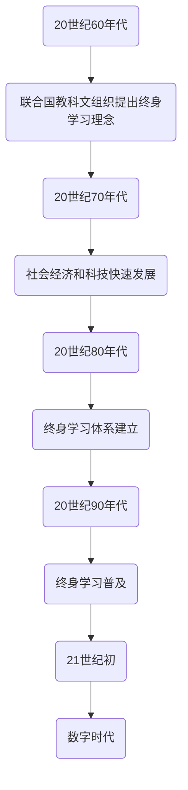

                 

### 文章标题

《提示词优化的终身学习与灾难性遗忘防御》

终身学习是现代社会中不可或缺的一部分，随着知识更新的速度不断加快，人们需要不断学习新知识和技能来适应快速变化的世界。然而，学习过程中常常会遇到灾难性遗忘，即重要信息在记忆过程中突然消失，给学习和应用带来极大困扰。本文旨在探讨如何通过提示词优化来增强终身学习效果，并防御灾难性遗忘。

> 关键词：**终身学习，提示词优化，灾难性遗忘，记忆强化，算法原理，数学模型**

**摘要：** 本文首先介绍了终身学习的概念和重要性，分析了当前终身学习面临的挑战。接着，深入探讨了提示词优化的基础理论，并详细阐述了提示词优化在终身学习中的应用。然后，本文探讨了灾难性遗忘的原理与机制，提出了基于提示词优化的记忆强化方法。最后，通过实际案例分析和策略评估，验证了提示词优化在终身学习和灾难性遗忘防御中的有效性。

## 目录

1. **终身学习的概念与重要性
   1.1 终身学习的定义与发展历程
   1.2 终身学习的意义与价值
   1.3 当代终身学习面临的挑战与机遇

2. **提示词优化的基础理论
   2.1 提示词优化的基本概念
   2.2 提示词优化的方法与技术
   2.3 提示词优化在终身学习中的应用场景

3. **灾难性遗忘的原理与机制
   3.1 记忆的形成与遗忘
   3.2 灾难性遗忘的定义与特点
   3.3 灾难性遗忘的影响与危害

4. **基于提示词优化的记忆强化方法
   4.1 提示词优化的记忆强化原理
   4.2 提示词优化的记忆强化技术
   4.3 提示词优化的记忆强化实践

5. **终身学习中的灾难性遗忘防御策略
   5.1 终身学习与灾难性遗忘的关系
   5.2 终身学习中的灾难性遗忘防御原则
   5.3 终身学习中的灾难性遗忘防御实践

6. **案例分析与策略评估
   6.1 终身学习与灾难性遗忘防御的案例分析
   6.2 灾难性遗忘防御策略的评估与优化

7. **技术实现与未来展望
   7.1 提示词优化的技术实现
   7.2 灾难性遗忘防御的未来发展
   7.3 提示词优化与灾难性遗忘防御的应用前景

## 第一部分：终身学习的理论基础

### 第1章：终身学习的概念与重要性

**1.1 终身学习的定义与发展历程**

终身学习，是指一个人在其一生中不断学习、更新知识和技能，以适应社会发展的需求。其概念源于20世纪60年代，由联合国教科文组织首次提出。终身学习的理念强调教育不仅仅是青少年时期的事情，而是贯穿人的一生。其核心在于不断学习、适应和自我完善。

**发展历程：**

- **20世纪60年代**：联合国教科文组织提出终身学习理念，标志着终身学习概念的诞生。
- **20世纪70年代**：随着社会经济和科技的快速发展，终身学习逐渐成为各国教育政策的重要内容。
- **20世纪80年代**：终身学习体系开始建立，各国纷纷制定相关政策，推动终身教育的发展。
- **20世纪90年代**：终身学习逐渐普及，成为社会共识，各类教育机构和培训项目层出不穷。
- **21世纪初**：随着互联网的普及和信息技术的发展，终身学习进入数字时代，在线教育和远程教育成为终身学习的重要形式。

**Mermaid流程图：**



**1.2 终身学习的意义与价值**

终身学习的意义在于，它能够帮助个人持续提升自身素质，适应社会发展的需求，实现个人价值。具体而言，终身学习具有以下价值：

1. **提高个人竞争力：** 在知识经济时代，个人竞争力的提升离不开持续的学习。终身学习能够帮助个人掌握新知识、新技能，提高职业竞争力。

2. **适应社会发展：** 社会发展迅速，新技术、新理念不断涌现。终身学习能够帮助个人适应社会变化，保持与社会的同步。

3. **实现个人成长：** 通过终身学习，个人可以不断拓展视野，提升自我认知，实现个人成长。

4. **促进社会进步：** 终身学习不仅能够提升个人素质，还能够推动社会进步。全民素质的提高有助于社会的发展。

**伪代码阐述终身学习在个人和社会层面上的价值：**

```python
# 个人层面
def personal_growth(learning):
    knowledge = learning("新知识")
    skill = learning("新技能")
    return knowledge + skill

# 社会层面
def social_progress(learning):
    individuals = learning("全民学习")
    knowledge = sum(individuals["知识"])
    skill = sum(individuals["技能"])
    return knowledge, skill
```

**1.3 当代终身学习面临的挑战与机遇**

当代终身学习面临着诸多挑战，同时也迎来了前所未有的机遇。

**挑战：**

1. **知识更新速度加快：** 知识更新速度不断加快，终身学习需要应对海量信息的处理和筛选。

2. **学习资源的分散：** 教育资源分布不均，城乡、区域之间存在着较大的差距。

3. **学习习惯的养成：** 人们的生活节奏加快，如何养成持续学习的习惯成为一大挑战。

**机遇：**

1. **互联网的普及：** 互联网的普及为终身学习提供了丰富的资源和便捷的方式。

2. **在线教育的兴起：** 在线教育平台的发展为终身学习提供了新的模式，人们可以随时随地进行学习。

3. **人工智能的应用：** 人工智能技术的应用可以辅助学习，提高学习效果。

**LaTeX格式列出终身学习面临的挑战和机遇的数学模型：**

```latex
\documentclass{article}
\usepackage{amsmath}
\begin{document}

\section{终身学习面临的挑战和机遇}

\subsection{挑战}

\begin{equation}
\text{知识更新速度} = f(\text{时间})
\end{equation}

\begin{equation}
\text{教育资源分布} = g(\text{地区})
\end{equation}

\begin{equation}
\text{学习习惯养成} = h(\text{习惯})
\end{equation}

\subsection{机遇}

\begin{equation}
\text{互联网普及} = i(\text{互联网})
\end{equation}

\begin{equation}
\text{在线教育兴起} = j(\text{在线教育})
\end{equation}

\begin{equation}
\text{人工智能应用} = k(\text{人工智能})
\end{equation}

\end{document}
```

通过以上分析，我们可以看到，终身学习在个人和社会层面上的重要性不容忽视。在当代，终身学习面临着诸多挑战，但同时也迎来了前所未有的机遇。通过科学的方法和技术，我们可以更好地应对这些挑战，实现终身学习的目标。下一章，我们将深入探讨提示词优化的基础理论，为终身学习提供新的思路和方法。

