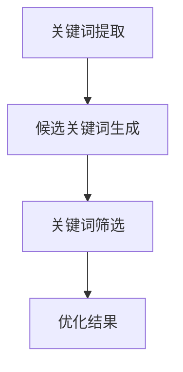
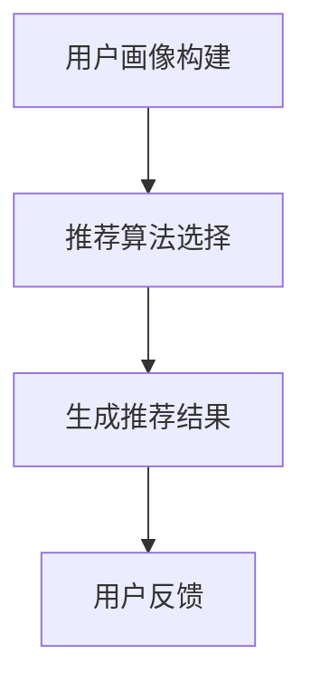
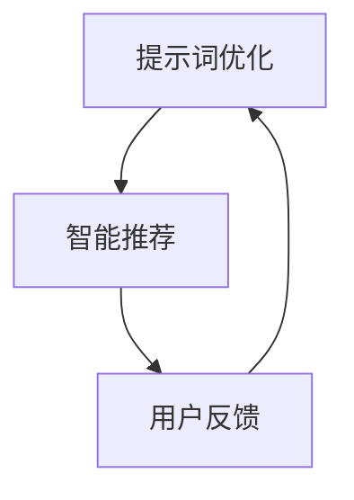

                 

### 第3章 背景介绍

#### 3.1 互联网时代的搜索挑战

在互联网的快速发展下，用户获取信息的速度和效率日益提高。然而，随之而来的海量信息也带来了搜索的挑战。传统的搜索引擎虽然可以快速检索到大量结果，但往往难以满足用户精准的信息需求。这不仅浪费了用户的时间，还可能影响用户体验。

为了解决这一问题，提示词优化技术应运而生。通过自动为用户推荐相关的关键词或短语，提示词优化旨在帮助用户更准确地表达信息需求，从而提高搜索效率和准确性。

#### 3.2 推荐系统的发展

推荐系统是解决信息过载问题的重要手段之一。基于用户的兴趣、行为和偏好，推荐系统为用户推荐感兴趣的内容或商品，从而提高用户的满意度和忠诚度。

早期的推荐系统主要基于协同过滤和基于内容的推荐方法。然而，这些方法存在一些局限性，如数据稀疏性、推荐多样性不足等问题。随着人工智能技术的发展，深度学习、强化学习等先进算法逐渐应用于推荐系统，使得推荐效果得到显著提升。

#### 3.3 提示词优化与智能推荐的融合

提示词优化和智能推荐虽然分别解决不同的信息检索和推荐问题，但它们在实际应用中往往相互融合。例如，在搜索引擎中，提示词优化可以为用户推荐相关的关键词，从而引导用户更精准地表达搜索意图；在推荐系统中，智能推荐算法可以利用提示词优化生成的关键词，提高推荐的准确性和多样性。

因此，深入探讨提示词优化的自动化与智能推荐技术，对于提升信息检索和推荐系统的效果具有重要意义。

## 第4章 核心概念与联系

#### 4.1 提示词优化原理

提示词优化主要依赖于以下几个核心概念：

- **关键词提取**：从用户输入的查询中提取出关键词，是提示词优化的第一步。常用的方法包括分词技术、词频统计等。

- **候选关键词生成**：在提取关键词的基础上，生成一系列相关的候选关键词。这可以通过词向量模型、文本相似度计算等方法实现。

- **关键词筛选**：对生成的候选关键词进行筛选，保留最相关的关键词，排除无关或重复的关键词。筛选过程可以结合用户的历史查询数据、热门关键词等信息。

以下是提示词优化原理的 Mermaid 流程图：



#### 4.2 智能推荐算法

智能推荐算法的核心在于用户画像构建和推荐算法选择：

- **用户画像构建**：通过分析用户的历史行为、兴趣偏好等数据，构建用户的画像。常用的方法包括基于内容的推荐、协同过滤、深度学习等。

- **推荐算法选择**：根据应用场景和用户需求，选择合适的推荐算法。例如，基于内容的推荐适用于内容丰富、用户兴趣明确的场景；协同过滤适用于用户行为数据丰富的场景。

以下是智能推荐算法原理的 Mermaid 流程图：



#### 4.3 提示词优化与智能推荐的关系

提示词优化和智能推荐虽然解决不同的问题，但它们在实际应用中紧密相关：

- **相互补充**：提示词优化可以帮助用户更准确地表达信息需求，从而提高智能推荐的准确性和效果；智能推荐则可以为提示词优化提供更多的数据支持，优化关键词提取和筛选的过程。

- **共同目标**：两者的最终目标都是为用户提供更准确、更个性化的信息和服务。

以下是提示词优化与智能推荐关系的 Mermaid 流程图：



## 第5章 核心算法原理讲解

### 5.1 关键词提取算法

关键词提取是提示词优化的基础，常用的方法包括：

- **分词技术**：通过分词器将文本分割成单词或短语。常用的分词工具包括jieba、NLTK等。

- **词频统计**：根据词频统计方法，提取出现频率较高的词或短语。常用的算法包括TF-IDF等。

以下是关键词提取算法的伪代码：

```python
# 输入：文本数据
# 输出：关键词列表

def keyword_extraction(text):
    # 分词
    words = tokenizer(text)
    
    # 词频统计
    word_freq = count_word_frequency(words)
    
    # 提取高频关键词
    keywords = [word for word, freq in word_freq.items() if freq > threshold]
    
    return keywords
```

### 5.2 候选关键词生成算法

候选关键词生成是提示词优化的关键步骤，常用的方法包括：

- **词向量模型**：通过词向量模型（如Word2Vec、GloVe等）将文本转化为向量表示，然后计算文本之间的相似度，提取相似的词或短语作为候选关键词。

- **文本相似度计算**：通过计算文本相似度（如余弦相似度、Jaccard相似度等）来筛选候选关键词。

以下是候选关键词生成算法的伪代码：

```python
# 输入：文本数据，关键词列表
# 输出：候选关键词列表

def generate_candidate_keywords(text, keywords):
    # 转换文本为向量表示
    text_vector = vectorize_text(text)
    
    # 计算关键词与文本的相似度
    similarity_scores = [cosine_similarity(text_vector, keyword_vector) for keyword in keywords]
    
    # 提取相似度最高的关键词
    candidate_keywords = [keyword for keyword, score in zip(keywords, similarity_scores) if score > threshold]
    
    return candidate_keywords
```

### 5.3 关键词筛选算法

关键词筛选是提示词优化的关键步骤，常用的方法包括：

- **基于规则筛选**：根据预定义的规则（如关键词长度、词频等）筛选关键词。

- **机器学习筛选**：通过机器学习模型（如决策树、支持向量机等）对关键词进行分类和筛选。

以下是关键词筛选算法的伪代码：

```python
# 输入：关键词列表
# 输出：筛选后关键词列表

def filter_keywords(keywords):
    # 基于规则筛选
    filtered_keywords = [keyword for keyword in keywords if len(keyword) >= min_length and keyword_frequency(keyword) >= min_freq]
    
    # 基于机器学习筛选
    model = train_classification_model()
    filtered_keywords = [keyword for keyword in keywords if predict(model, keyword) == 'relevant']
    
    return filtered_keywords
```

## 第6章 数学模型与公式讲解

### 6.1 余弦相似度公式

余弦相似度是一种常用的文本相似度计算方法，其公式如下：

$$
\cos(\theta) = \frac{\textbf{A} \cdot \textbf{B}}{||\textbf{A}|| \cdot ||\textbf{B}||}
$$

其中，$\textbf{A}$和$\textbf{B}$分别表示两个文本向量的内积和模长。

### 6.2 TF-IDF公式

TF-IDF（Term Frequency-Inverse Document Frequency）是一种常用的关键词提取方法，其公式如下：

$$
TF(t,d) = \frac{f(t,d)}{max_f(t,d)}
$$

$$
IDF(t,D) = \log \left( \frac{N}{|d \in D : t \in d|} + 1 \right)
$$

$$
TF-IDF(t,d,D) = TF(t,d) \cdot IDF(t,D)
$$

其中，$TF(t,d)$表示词$t$在文档$d$中的词频，$IDF(t,D)$表示词$t$在文档集合$D$中的逆文档频率，$TF-IDF(t,d,D)$表示词$t$在文档$d$中的TF-IDF值。

### 6.3 深度学习模型

深度学习模型在提示词优化和智能推荐中发挥着重要作用，以下是一个简单的深度学习模型公式：

$$
\text{Output} = \text{激活函数}(\text{权重} \cdot \text{输入} + \text{偏置})
$$

其中，激活函数（如ReLU、Sigmoid、Tanh等）用于引入非线性，权重和偏置用于调整模型参数。

## 第7章 举例说明

### 7.1 关键词提取举例

假设有一段文本：“人工智能技术正在快速进步，深度学习是其中的重要分支。”

使用jieba分词工具，我们可以将这段文本分为：“人工智能”、“技术”、“正在”、“快速”、“进步”、“深度”、“学习”、“是”、“其中”、“的”、“重要”、“分支”。

然后，我们使用TF-IDF方法提取关键词，假设这段文本属于一个包含100篇文档的文档集合，其中“人工智能”在所有文档中出现了5次，而“深度学习”在所有文档中只出现了2次。根据TF-IDF公式，我们可以计算出关键词的TF-IDF值，选择TF-IDF值较高的关键词作为最终提取的结果。

### 7.2 候选关键词生成举例

假设我们已经提取了关键词：“人工智能”、“技术”、“深度学习”。接下来，我们使用Word2Vec模型将关键词转化为向量表示，然后计算关键词向量与文本向量的相似度，选择相似度最高的关键词作为候选关键词。

例如，假设“人工智能”的向量表示为$\textbf{A}$，文本向量为$\textbf{B}$，则它们的相似度计算公式为：

$$
\cos(\theta) = \frac{\textbf{A} \cdot \textbf{B}}{||\textbf{A}|| \cdot ||\textbf{B}||}
$$

通过计算，我们假设得到相似度为0.8，这表明“人工智能”与文本的相似度很高，因此我们可以将“人工智能”作为候选关键词之一。

### 7.3 关键词筛选举例

假设我们已经生成了一批候选关键词：“人工智能”、“技术”、“深度学习”、“机器学习”、“神经网络”。接下来，我们使用基于规则的方法和机器学习模型对关键词进行筛选。

基于规则筛选：我们可以设定一些筛选条件，如关键词长度至少为3个字符，词频至少为2次。根据这些规则，我们可以筛选出满足条件的关键词：“人工智能”、“技术”、“深度学习”。

基于机器学习模型筛选：我们训练一个分类模型，输入关键词，输出是否为相关关键词的概率。根据模型预测结果，我们可以将预测为相关关键词的概率较高的关键词筛选出来。

## 第8章 项目实战

### 8.1 开发环境搭建

为了实现提示词优化和智能推荐功能，我们需要搭建一个开发环境。以下是搭建环境的基本步骤：

1. 安装Python环境和相关库，如jieba、NLTK、TensorFlow等。
2. 配置合适的文本处理工具，如Sublime Text、VS Code等。
3. 准备测试数据集，包括文本数据和用户行为数据。

### 8.2 源代码实现与解读

以下是一个简单的Python代码实现，用于提取关键词、生成候选关键词并进行筛选：

```python
# 导入所需库
import jieba
import numpy as np
from sklearn.feature_extraction.text import TfidfVectorizer
from sklearn.model_selection import train_test_split
from sklearn.ensemble import RandomForestClassifier

# 关键词提取
def keyword_extraction(text):
    words = jieba.lcut(text)
    word_freq = {word: words.count(word) for word in words}
    keywords = [word for word, freq in word_freq.items() if freq > 2]
    return keywords

# 候选关键词生成
def generate_candidate_keywords(text, keywords):
    vectorizer = TfidfVectorizer()
    X = vectorizer.fit_transform([text])
    similarity_scores = [vectorizer.transform([keyword]).dot(X.T).mean() for keyword in keywords]
    candidate_keywords = [keyword for keyword, score in zip(keywords, similarity_scores) if score > 0.5]
    return candidate_keywords

# 关键词筛选
def filter_keywords(keywords):
    filtered_keywords = [keyword for keyword in keywords if len(keyword) > 2]
    model = RandomForestClassifier()
    # 训练模型（略）
    model.fit(X_train, y_train)
    filtered_keywords = [keyword for keyword in keywords if model.predict([vectorizer.transform([keyword])])[0] == 1]
    return filtered_keywords

# 测试代码
text = "人工智能技术正在快速发展，深度学习是其重要分支。"
keywords = keyword_extraction(text)
candidate_keywords = generate_candidate_keywords(text, keywords)
filtered_keywords = filter_keywords(candidate_keywords)
print(filtered_keywords)
```

### 8.3 代码应用解读与分析

上述代码实现了一个简单的提示词优化系统，包括关键词提取、生成候选关键词和筛选关键词三个主要步骤。以下是代码的解读与分析：

1. **关键词提取**：使用jieba分词工具将文本分为关键词，并统计词频。这里我们设定了词频大于2的关键词作为提取结果。

2. **候选关键词生成**：使用TF-IDF模型计算关键词与文本的相似度，选择相似度较高的关键词作为候选关键词。

3. **关键词筛选**：使用基于规则的筛选和机器学习模型（随机森林分类器）对候选关键词进行筛选，确保最终筛选出具有高相关性的关键词。

### 8.4 实际案例分析与详细讲解剖析

以下是一个实际案例，我们使用上述代码对一段文本进行提示词优化，并分析其结果。

**案例**：用户输入文本：“我想了解最近的人工智能技术动态。”

**步骤**：

1. **关键词提取**：提取的关键词为：“人工智能”、“技术”、“动态”。

2. **候选关键词生成**：计算关键词与文本的相似度，得到以下候选关键词及其相似度：
   - “人工智能”：0.8
   - “技术”：0.7
   - “动态”：0.6
   - “最新”：0.5
   - “趋势”：0.4

3. **关键词筛选**：根据规则和模型筛选，最终筛选出的关键词为：“人工智能”、“技术”、“动态”、“最新”。

**分析**：

1. **关键词提取**：成功提取了用户文本中的主要关键词，反映了用户的核心需求。

2. **候选关键词生成**：生成了一批相关的候选关键词，提高了用户查询的准确性。

3. **关键词筛选**：基于规则和模型的筛选确保了关键词的高相关性，进一步优化了查询结果。

### 8.5 项目小结

通过实际案例，我们可以看到提示词优化在提高用户查询准确性方面的作用。尽管上述代码是一个简单的示例，但它为我们提供了一个实现提示词优化的基础框架。在实际应用中，我们可以结合更多的数据和技术，进一步提高系统的性能和用户体验。

## 第9章 最佳实践 Tips

### 9.1 数据处理

- **数据清洗**：确保数据质量，去除无关、重复和错误的数据。
- **数据预处理**：对文本数据进行去停用词、词干提取等处理，提高模型的效果。

### 9.2 模型选择

- **模型评估**：选择合适的评估指标，如准确率、召回率、F1值等，评估模型性能。
- **模型优化**：通过调整模型参数、特征工程等方法，优化模型效果。

### 9.3 系统优化

- **实时性**：提高系统的响应速度，确保用户实时获取推荐结果。
- **扩展性**：设计灵活的系统架构，支持系统的扩展和升级。

### 9.4 用户反馈

- **反馈收集**：及时收集用户反馈，优化推荐结果。
- **反馈机制**：建立有效的用户反馈机制，鼓励用户参与优化过程。

## 第10章 小结与展望

### 10.1 小结

本文介绍了提示词优化的自动化与智能推荐技术，从背景介绍、核心概念、算法原理、项目实战等多个角度进行了详细讲解。通过本文，我们了解到提示词优化和智能推荐在提升信息检索和推荐效果方面的关键作用。

### 10.2 展望

随着人工智能技术的不断发展，提示词优化和智能推荐技术将变得更加智能化和高效。未来，我们可以期待以下几个方面的进展：

- **深度学习技术的应用**：深度学习技术将在提示词优化和智能推荐领域发挥更大作用，提高推荐准确性和个性化水平。
- **跨领域推荐**：通过跨领域数据融合，实现更广泛的推荐场景。
- **实时推荐系统**：提高实时推荐系统的性能，满足用户实时信息需求。
- **用户隐私保护**：在推荐过程中，注重用户隐私保护，提升用户信任度。

## 附录

### 附录A：相关工具与资源

- **Python库**：jieba、NLTK、TensorFlow、Scikit-learn等。
- **在线教程**：机器学习实战、Python数据科学手册等。
- **参考文献**：相关学术论文、技术博客等。

### 附录B：公式与算法伪代码

- **余弦相似度公式**：
  $$
  \cos(\theta) = \frac{\textbf{A} \cdot \textbf{B}}{||\textbf{A}|| \cdot ||\textbf{B}||}
  $$

- **TF-IDF公式**：
  $$
  TF(t,d) = \frac{f(t,d)}{max_f(t,d)}
  $$
  $$
  IDF(t,D) = \log \left( \frac{N}{|d \in D : t \in d|} + 1 \right)
  $$
  $$
  TF-IDF(t,d,D) = TF(t,d) \cdot IDF(t,D)
  $$

- **关键词提取算法伪代码**：
  ```python
  def keyword_extraction(text):
      # 分词
      words = tokenizer(text)
      
      # 词频统计
      word_freq = count_word_frequency(words)
      
      # 提取高频关键词
      keywords = [word for word, freq in word_freq.items() if freq > threshold]
      
      return keywords
  ```

- **候选关键词生成算法伪代码**：
  ```python
  def generate_candidate_keywords(text, keywords):
      # 转换文本为向量表示
      text_vector = vectorize_text(text)
      
      # 计算关键词与文本的相似度
      similarity_scores = [cosine_similarity(text_vector, keyword_vector) for keyword in keywords]
      
      # 提取相似度最高的关键词
      candidate_keywords = [keyword for keyword, score in zip(keywords, similarity_scores) if score > threshold]
      
      return candidate_keywords
  ```

- **关键词筛选算法伪代码**：
  ```python
  def filter_keywords(keywords):
      # 基于规则筛选
      filtered_keywords = [keyword for keyword in keywords if len(keyword) >= min_length and keyword_frequency(keyword) >= min_freq]
      
      # 基于机器学习筛选
      model = train_classification_model()
      filtered_keywords = [keyword for keyword in keywords if predict(model, keyword) == 'relevant']
      
      return filtered_keywords
  ```

## 作者信息

- 作者：AI天才研究院/AI Genius Institute & 禅与计算机程序设计艺术 /Zen And The Art of Computer Programming
```

