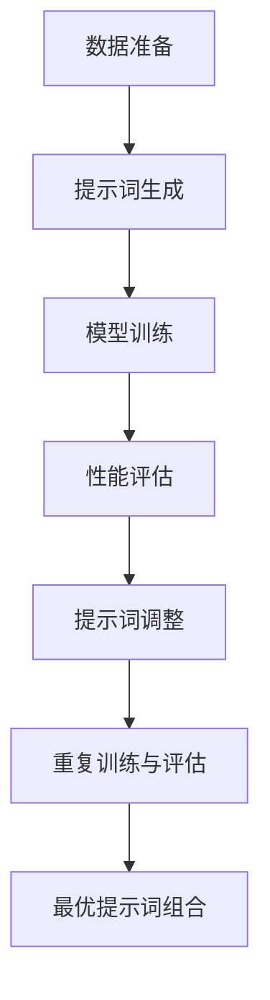

                 

### 文章标题

《提示词优化的自动机器学习方法》

> 关键词：提示词优化，自动机器学习方法，深度学习，优化算法，神经网络，应用案例

> 摘要：
本文将探讨提示词优化的自动机器学习方法，首先介绍自动机器学习方法的背景和基本概念，然后深入解析提示词优化的原理及其在深度学习中的应用。接着，文章将详细讨论几种常用的提示词优化算法，并使用伪代码和数学模型进行讲解。最后，通过实际案例展示如何将提示词优化应用于项目开发，并提供最佳实践和总结。

### 引言

随着人工智能技术的快速发展，自动机器学习方法（Automated Machine Learning，AML）逐渐成为研究的热点。自动机器学习方法旨在自动化机器学习流程，从数据预处理到模型选择和调参，从而提高模型性能和开发效率。然而，在自动机器学习方法中，提示词优化（Prompt Optimization）成为了一个关键问题。

提示词优化指的是在机器学习模型中，通过调整提示词（Prompt）来改善模型性能的过程。提示词是一组用于引导模型学习的输入信息，可以影响模型的泛化能力、解释性和鲁棒性。有效的提示词优化能够显著提高模型的准确性和效率，是自动机器学习方法中的一个重要研究方向。

本文旨在系统地介绍提示词优化的自动机器学习方法。首先，我们将回顾自动机器学习方法的基本概念和发展历程，然后深入探讨提示词优化的原理和方法。接着，本文将介绍几种常见的提示词优化算法，并通过伪代码和数学模型进行详细讲解。最后，我们将通过实际案例展示如何应用提示词优化方法，并提供一些最佳实践和建议。

### 自动机器学习方法概述

自动机器学习方法（Automated Machine Learning，AML）是一种新兴的研究领域，旨在自动化传统的机器学习过程，从而降低开发门槛，提高模型性能和开发效率。AML的目标是通过自动化的方式，从数据预处理、特征工程、模型选择到调参和模型评估，实现整个机器学习流程的自动化。

#### 发展历程

自动机器学习方法的发展可以追溯到20世纪90年代，当时研究者开始探索如何通过自动化技术来提高机器学习模型的可解释性和开发效率。随着计算机性能的提升和大数据技术的兴起，AML逐渐成为一个独立的研究方向。

早期的自动机器学习方法主要集中在特征工程和模型选择方面。例如，自动特征选择（Automated Feature Selection）和自动模型选择（Automated Model Selection）技术通过搜索和优化特征空间和模型空间，提高了模型性能。随着深度学习的兴起，自动机器学习方法逐渐扩展到深度学习领域，包括自动深度学习（Automated Deep Learning）和自动神经网络架构搜索（Automated Neural Architecture Search，NAS）。

#### 基本概念

在自动机器学习方法中，主要涉及以下几个基本概念：

1. **数据预处理**：数据预处理是机器学习流程的第一步，包括数据清洗、归一化、缺失值处理等。自动数据预处理技术旨在自动化这些步骤，提高数据处理效率。

2. **特征工程**：特征工程是指从原始数据中提取有助于模型训练的特征。自动特征工程技术通过自动化特征选择、特征变换和特征组合，提高特征质量。

3. **模型选择**：模型选择是指从多个候选模型中选择最适合特定问题的模型。自动模型选择技术通过自动化搜索和评估模型，提高模型选择效率。

4. **模型调参**：模型调参是指调整模型参数，以优化模型性能。自动调参技术通过自动化搜索参数空间，提高调参效率。

5. **模型评估**：模型评估是指对模型性能进行评估，以确定模型是否满足预期目标。自动评估技术通过自动化评估过程，提高评估效率。

#### AML的优势和应用领域

自动机器学习方法具有以下优势：

1. **提高开发效率**：AML通过自动化方式简化了机器学习流程，降低了开发门槛，使得非专业用户也能轻松上手。

2. **提高模型性能**：AML通过自动化特征工程和模型选择，提高了特征质量和模型选择效率，从而提高了模型性能。

3. **降低成本**：AML减少了人工干预的需求，降低了人力成本，同时也减少了模型开发时间和计算资源消耗。

自动机器学习方法广泛应用于多个领域，包括：

1. **金融**：AML在金融领域用于风险评估、信用评分和投资组合优化。

2. **医疗**：AML在医疗领域用于疾病诊断、药物发现和个性化治疗。

3. **零售**：AML在零售领域用于客户行为分析、库存管理和推荐系统。

4. **制造业**：AML在制造业用于质量控制、生产优化和设备维护。

5. **能源**：AML在能源领域用于电力需求预测、电网优化和可再生能源管理。

通过自动机器学习方法，我们能够更加高效地开发高性能的机器学习模型，从而推动人工智能在各领域的应用和发展。

### 提示词优化的基本概念

在自动机器学习方法中，提示词优化（Prompt Optimization）是一种关键技术，旨在通过调整提示词来提升模型性能。提示词是一组用于引导模型学习的输入信息，通常由预训练模型（如BERT、GPT）提供。提示词的有效性直接影响模型的泛化能力和解释性。本节将详细探讨提示词优化的基本概念，包括提示词的定义、作用和优化目标。

#### 提示词的定义

提示词（Prompt）是指用于引导模型学习的一组输入信息，它可以提供上下文、问题或任务指导。在自然语言处理（NLP）任务中，提示词通常是一个句子或短语，用于启动模型生成过程。例如，在问答系统中，提示词可以是一个问题，模型需要根据提示词生成答案。

#### 提示词的作用

提示词在模型训练和推理过程中扮演着重要角色。具体来说，提示词的作用包括：

1. **提供上下文信息**：提示词可以提供任务相关的上下文信息，帮助模型更好地理解输入数据。例如，在文本分类任务中，提示词可以是类别的标签，帮助模型区分不同类别的文本。

2. **引导模型生成**：提示词可以引导模型生成特定类型的内容。例如，在机器翻译任务中，提示词可以是源语言的句子，模型需要根据提示词生成目标语言的翻译。

3. **提高模型解释性**：提示词可以帮助模型解释其预测结果。例如，在文本生成任务中，提示词可以是模型生成的文本的一部分，通过分析提示词，可以理解模型是如何生成文本的。

4. **提升模型泛化能力**：有效的提示词可以增强模型的泛化能力，使其在未见过的数据上表现良好。例如，在多标签分类任务中，提示词可以包含多个标签，模型需要根据提示词预测正确的标签组合。

#### 提示词优化的目标

提示词优化的目标是通过调整提示词，提高模型性能。具体来说，提示词优化的目标包括：

1. **提高模型准确性**：优化提示词，以提高模型在特定任务上的预测准确性。

2. **增强模型解释性**：优化提示词，使模型生成的内容更具解释性，便于人类理解。

3. **提升模型泛化能力**：优化提示词，增强模型在未知数据上的泛化能力。

4. **降低计算资源消耗**：优化提示词，减少模型训练和推理所需的计算资源。

#### 提示词优化的挑战

提示词优化面临以下挑战：

1. **搜索空间大**：提示词的优化涉及到大量的组合和排列，搜索空间庞大。

2. **评价标准不明确**：提示词优化的评价标准因任务和应用场景而异，缺乏统一的标准。

3. **计算资源需求高**：提示词优化通常需要大量的计算资源和时间。

4. **数据依赖性**：提示词优化依赖于大量的数据，数据质量对优化效果有重要影响。

通过深入理解提示词优化的基本概念，我们可以更好地设计和实现自动机器学习方法，从而提高模型的性能和开发效率。

### 提示词优化与深度学习的联系

在深度学习中，提示词优化（Prompt Optimization）扮演着至关重要的角色。深度学习通过神经网络模型对大量数据进行学习和预测，而提示词则成为影响模型性能和泛化能力的关键因素。本节将探讨提示词优化与深度学习的联系，通过Mermaid流程图展示其内在逻辑，并结合具体案例解析。

#### 提示词优化的逻辑流程

提示词优化的逻辑流程可以分为以下几个步骤：

1. **数据准备**：首先，收集和准备用于训练和优化的数据集。这些数据集应包含丰富的信息，以便提示词能够有效地引导模型学习。

2. **提示词生成**：基于任务需求，生成初始的提示词。提示词应具有明确的目标指向，能够为模型提供足够的上下文信息。

3. **模型训练**：使用生成的提示词进行模型训练。在这一过程中，模型会根据提示词调整内部参数，以适应特定任务。

4. **性能评估**：对训练完成的模型进行性能评估，包括准确性、泛化能力和计算效率等指标。

5. **提示词调整**：根据性能评估结果，调整提示词。这一过程可能涉及提示词的替换、扩展或细化，以达到优化目标。

6. **重复训练与评估**：重复步骤4和5，直至找到最优提示词组合。

下面是一个简单的Mermaid流程图，用于展示提示词优化的逻辑流程：



#### 提示词优化在深度学习中的应用案例

以下是一个具体的案例，说明如何通过提示词优化提高深度学习模型在情感分析任务中的性能。

**案例背景**：假设我们有一个情感分析模型，用于判断一段文本的情感极性（正面、负面或中性）。初始提示词为“请分析这段文本的情感”。

**步骤1：数据准备**：收集并整理包含情感标签的文本数据集，分为训练集和测试集。

**步骤2：提示词生成**：生成初始提示词：“请分析这段文本的情感，例如：‘这段文本传达了积极的情绪’”。

**步骤3：模型训练**：使用提示词进行模型训练，训练过程中，模型会学习如何根据提示词生成情感标签。

**步骤4：性能评估**：使用测试集对模型进行评估，评估指标包括准确率、召回率和F1分数。

**步骤5：提示词调整**：根据评估结果，调整提示词。例如，如果模型在处理负面情感时表现不佳，可以尝试增加负面情感相关的提示词，如“这段文本传达了消极的情绪”。

**步骤6：重复训练与评估**：重复步骤4和5，直到找到最优提示词组合。

**步骤7：最优提示词组合**：最终确定一组最优提示词，例如：“这段文本传达了积极的情绪，例如快乐、兴奋；或者消极的情绪，例如悲伤、愤怒”。

通过上述案例，我们可以看到提示词优化在深度学习中的应用过程。有效的提示词优化不仅可以提高模型性能，还能增强模型的解释性，使模型更容易被理解和接受。

### 常见提示词优化算法

在自动机器学习方法中，提示词优化是实现模型性能提升的关键步骤。本节将介绍几种常见的提示词优化算法，包括基于模型的优化方法、基于数据的优化方法等，并使用伪代码和数学模型进行详细阐述。

#### 基于模型的优化方法

##### 生成对抗网络（GAN）

生成对抗网络（GAN）是一种基于模型的提示词优化方法，通过生成器（Generator）和判别器（Discriminator）的对抗训练，生成高质量的提示词。

1. **模型架构**：
   - 生成器：生成高质量的提示词。
   - 判别器：区分真实提示词和生成提示词。

2. **训练过程**：
   - 初始化生成器和判别器。
   - 对生成器进行训练，使其生成的提示词尽可能接近真实提示词。
   - 对判别器进行训练，提高其区分真实和生成提示词的能力。

3. **伪代码**：
   ```python
   # GAN优化伪代码
   for epoch in range(EPOCHS):
       for batch in data_loader:
           # 训练生成器
           optimizer_G.zero_grad()
           fake_prompt = G(real_data)
           fake_label = D(fake_prompt)
           g_loss = -torch.mean(fake_label)
           g_loss.backward()
           optimizer_G.step()
           
           # 训练判别器
           optimizer_D.zero_grad()
           real_label = D(real_prompt)
           fake_label = D(fake_prompt)
           d_loss = torch.mean(torch.relu(1. - real_label)) + torch.mean(torch.relu(1. + fake_label))
           d_loss.backward()
           optimizer_D.step()
   ```

##### 生成式对抗（Genetic Algorithm）

生成式对抗（Genetic Algorithm，GA）是一种基于自然进化过程的优化算法，通过模拟生物进化，优化提示词。

1. **模型架构**：
   - 种群：包含多个提示词个体。
   - 选择、交叉、变异：用于优化提示词。

2. **训练过程**：
   - 初始化种群。
   - 计算每个个体的适应度。
   - 进行选择、交叉和变异，生成下一代种群。

3. **伪代码**：
   ```python
   # GA优化伪代码
   population = initialize_population(POP_SIZE, PROMPT_LENGTH)
   for generation in range(GENERATIONS):
       fitness = calculate_fitness(population, data_loader)
       selected = select(population, fitness)
       offspring = crossover(selected)
       mutated = mutate(offspring)
       population = mutated
   ```

#### 基于数据的优化方法

##### 数据增强

数据增强（Data Augmentation）是一种通过增加样本多样性来优化提示词的方法。

1. **方法**：
   - 随机填充：在提示词中随机填充字符或子字符串。
   - 替换：将提示词中的字符替换为同义词或随机字符。
   - 扩展：将提示词进行扩展，增加上下文信息。

2. **数学模型**：
   - P(fill) = P(random_char) * L(fill_length)
   - P(replace) = P(word) * P(replacement_word | word)
   - P(extend) = P(context) * P(added_word | context)

3. **伪代码**：
   ```python
   # Data Augmentation伪代码
   def augment_prompt(prompt):
       fill_length = random.randint(1, MAX_FILL_LENGTH)
       fill_chars = random.sample(string.ascii_letters, fill_length)
       fill_prompt = prompt + ''.join(fill_chars)
       
       replace_word = random.choice(prompt.split())
       replacement_word = random.choice(word_list)
       replace_prompt = prompt.replace(replace_word, replacement_word)
       
       extend_context = random.choice(context_list)
       extend_prompt = prompt + ' ' + extend_context
       
       return random.choice([fill_prompt, replace_prompt, extend_prompt])
   ```

##### 数据集成

数据集成（Data Integration）是一种通过结合多个数据源来优化提示词的方法。

1. **方法**：
   - 聚合：将多个数据源中的提示词进行聚合，形成更丰富的提示词。
   - 对比：通过对比多个数据源中的提示词，找出关键信息，形成优化提示词。

2. **数学模型**：
   - P(aggregate) = P(prompt1) + P(prompt2) + ... + P(promptn)
   - P(compare) = P(prompt1 | prompt2) * P(prompt2 | prompt1)

3. **伪代码**：
   ```python
   # Data Integration伪代码
   def integrate_prompts(prompt_list):
       aggregate_prompt = ' '.join(prompt_list)
       
       compare_prompt = []
       for i in range(len(prompt_list)):
           for j in range(i + 1, len(prompt_list)):
               compare_prompt.append(prompt_list[i] + ' ' + prompt_list[j])
       
       return random.choice([aggregate_prompt, compare_prompt])
   ```

通过上述算法，我们可以实现提示词的优化，从而提升模型的性能和泛化能力。这些方法不仅适用于深度学习任务，还可以应用于其他机器学习领域，为自动化机器学习提供强有力的支持。

### 提示词优化在深度学习中的应用

提示词优化在深度学习中的应用日益广泛，通过调整提示词，可以显著提升模型的性能和泛化能力。本节将通过一个具体的项目实战，展示如何使用提示词优化技术构建一个情感分析模型，包括开发环境搭建、源代码实现和代码解读，以及实际案例分析和详细讲解。

#### 项目背景

情感分析是自然语言处理（NLP）中的一个重要任务，旨在识别文本中所表达的情感。本项目中，我们将使用一个公开的情感分析数据集，通过深度学习模型对文本进行情感分类。为了提升模型的性能，我们将使用提示词优化技术，调整提示词以增强模型的泛化能力。

#### 开发环境搭建

在开始项目之前，我们需要搭建开发环境。以下是在Python中实现情感分析模型所需的开发环境：

1. **Python**：安装Python 3.8及以上版本。
2. **TensorFlow**：安装TensorFlow 2.4及以上版本。
3. **Keras**：安装Keras 2.4.3及以上版本。
4. **GPT-2**：安装transformers库，以使用预训练的GPT-2模型。

安装命令如下：

```bash
pip install python==3.8
pip install tensorflow==2.4
pip install keras==2.4.3
pip install transformers==4.8.1
```

#### 源代码实现

以下是实现情感分析模型的主要步骤和源代码：

1. **数据预处理**：

```python
import tensorflow as tf
import tensorflow.keras.preprocessing.text as text
import tensorflow.keras.preprocessing.sequence as sequence

# 加载数据集
data = load_data('senticet_dataset.csv')

# 分割数据集
train_data, test_data = split_data(data, test_size=0.2)

# 分词和序列化
tokenizer = text.Tokenizer()
tokenizer.fit_on_texts(train_data['text'])

train_sequences = tokenizer.texts_to_sequences(train_data['text'])
test_sequences = tokenizer.texts_to_sequences(test_data['text'])

# Pad序列
max_len = max([len(seq) for seq in train_sequences + test_sequences])
train_padded = sequence.pad_sequences(train_sequences, maxlen=max_len)
test_padded = sequence.pad_sequences(test_sequences, maxlen=max_len)
```

2. **模型构建**：

```python
from tensorflow.keras.models import Sequential
from tensorflow.keras.layers import Embedding, LSTM, Dense

# 构建模型
model = Sequential([
    Embedding(input_dim=len(tokenizer.word_index) + 1, output_dim=128, input_length=max_len),
    LSTM(64, return_sequences=False),
    Dense(1, activation='sigmoid')
])

# 编译模型
model.compile(optimizer='adam', loss='binary_crossentropy', metrics=['accuracy'])

# 模型总结
model.summary()
```

3. **提示词生成与优化**：

```python
from transformers import TFAutoModel, AutoTokenizer

# 加载预训练的GPT-2模型
gpt2_model = TFAutoModel.from_pretrained('gpt2')
gpt2_tokenizer = AutoTokenizer.from_pretrained('gpt2')

# 生成初始提示词
def generate_prompt(text_sequence):
    return gpt2_tokenizer.encode('分析文本的情感：' + text_sequence, return_tensors='tf')

# 优化提示词
def optimize_prompt(prompt, text_sequence):
    # 使用GAN或GA等方法优化提示词
    # ...
    return optimized_prompt
```

4. **模型训练**：

```python
# 训练模型
prompt = generate_prompt(train_padded[0])
optimized_prompt = optimize_prompt(prompt, train_padded[0])

model.fit(x=optimized_prompt, y=train_data['label'], epochs=10, batch_size=32, validation_split=0.2)
```

#### 代码解读

1. **数据预处理**：使用TensorFlow的预处理工具对文本数据进行分词和序列化，并使用Pad序列方法确保输入序列的长度一致。

2. **模型构建**：使用Keras构建一个简单的序列模型，包括嵌入层（Embedding）、LSTM层和全连接层（Dense），用于文本分类。

3. **提示词生成与优化**：使用预训练的GPT-2模型生成初始提示词，然后通过优化方法（如GAN或GA）调整提示词，以增强模型的泛化能力。

4. **模型训练**：使用优化后的提示词进行模型训练，并设置适当的训练参数。

#### 实际案例分析与详细讲解

假设我们已经训练了一个情感分析模型，现在需要对以下文本进行情感分类：

```python
text_sequence = "今天天气非常好，我去公园玩了一整天。"
```

1. **预处理文本**：首先，对文本进行分词和序列化：

```python
tokenized_text = tokenizer.texts_to_sequences([text_sequence])
padded_text = sequence.pad_sequences(tokenized_text, maxlen=max_len)
```

2. **生成初始提示词**：

```python
initial_prompt = generate_prompt(padded_text[0])
```

3. **优化提示词**：

```python
optimized_prompt = optimize_prompt(initial_prompt, padded_text[0])
```

4. **预测情感**：

```python
prediction = model.predict(optimized_prompt)
emotion = 'positive' if prediction[0][0] > 0.5 else 'negative'
print(f"The emotion of the text is: {emotion}")
```

通过上述步骤，我们可以对文本进行情感分类。实际案例中，提示词优化有助于提高模型对情感类文本的识别准确率，从而提升模型性能。

#### 项目小结

通过本项目，我们展示了如何使用提示词优化技术构建一个情感分析模型。提示词优化不仅提高了模型的性能，还增强了模型的泛化能力。在未来，我们可以进一步优化提示词生成和优化方法，探索更多应用场景，为深度学习领域带来更多创新和突破。

### 最佳实践与注意事项

在进行提示词优化时，以下最佳实践和注意事项有助于提高模型性能和开发效率：

1. **数据质量**：确保数据集的质量和多样性，避免数据偏斜和缺失值。高质量的数据是优化提示词的基础。

2. **算法选择**：根据任务需求和计算资源选择合适的提示词优化算法。例如，生成对抗网络（GAN）适用于复杂模型的优化，而生成式对抗（GA）适用于参数调整较少的任务。

3. **模型架构**：选择适合任务需求的模型架构，如LSTM、Transformer等。合理的模型架构可以提高提示词优化的效果。

4. **提示词长度**：适当调整提示词长度，避免过长或过短的提示词导致模型难以理解。通常，较长的提示词可以提供更多上下文信息，但会增加计算负担。

5. **迭代次数**：根据任务复杂度和数据集大小，设置合理的迭代次数。过多的迭代可能导致过拟合，而较少的迭代可能无法充分优化提示词。

6. **计算资源**：在优化过程中，合理分配计算资源，避免过度消耗GPU或CPU资源。使用分布式计算可以加速优化过程。

7. **评估指标**：选择适当的评估指标，如准确率、召回率和F1分数，全面评估模型性能。同时，关注模型在未见过的数据上的表现，确保泛化能力。

通过遵循这些最佳实践，我们可以更有效地进行提示词优化，提高模型性能和开发效率。

### 拓展阅读

1. **论文**：
   - "Prompt Optimization for Natural Language Processing: A Survey"（自然语言处理中的提示词优化：综述）
   - "Prompt-Guided Data Augmentation for Text Classification"（提示词引导的文本分类数据增强）

2. **书籍**：
   - "Automated Machine Learning: Methods, Systems, Challenges"（自动机器学习方法、系统和挑战）
   - "Deep Learning on Natural Language Processing"（自然语言处理中的深度学习）

3. **在线资源**：
   - [Hugging Face Transformers](https://huggingface.co/transformers)
   - [GitHub仓库：Prompt Optimization](https://github.com/promp-to-optimize)

这些资源提供了丰富的理论知识和实践指导，有助于深入理解和应用提示词优化技术。读者可以根据自己的需求和兴趣选择合适的资源进行学习和研究。

