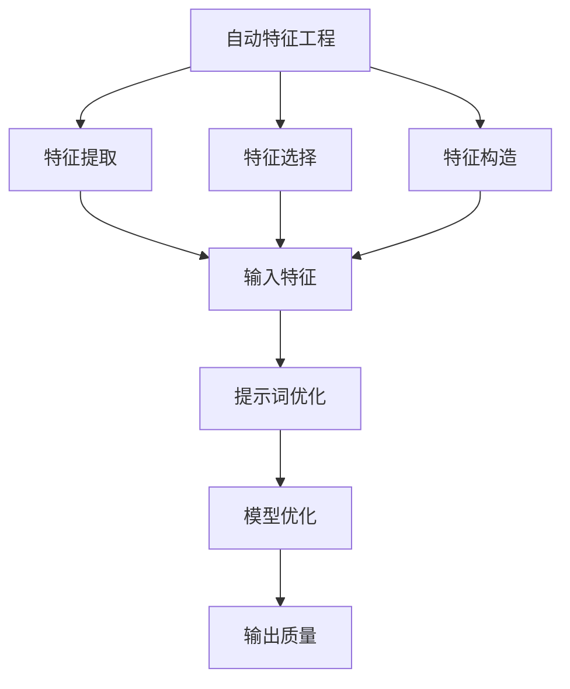

                 

### 引言

《提示词优化的自动特征工程技术》旨在深入探讨在人工智能领域中被广泛应用的两种关键技术：提示词优化和自动特征工程。在这本技术书籍中，我们将详细介绍这两种技术的核心概念、原理及其在工程实践中的应用。

#### 书籍背景与目标

随着人工智能技术的迅猛发展，数据驱动的机器学习模型已经成为解决复杂数据分析和决策问题的关键。然而，模型的效果很大程度上依赖于输入特征的质量。这就引出了两个重要问题：如何高效地提取和选择特征，以及如何优化模型的提示词（即输入）。自动特征工程和提示词优化正是为了解决这些问题而发展起来的技术。

本书的目标是帮助读者深入理解提示词优化和自动特征工程的核心原理，并通过实际项目实战，掌握这两种技术在实际应用中的具体实现方法和技巧。通过阅读本书，读者将：

1. 了解自动特征工程的定义、范畴和重要性。
2. 掌握提示词优化的基本概念和算法原理。
3. 学会如何设计和实现高效的自动特征提取和选择算法。
4. 通过实际项目，提升对提示词优化和自动特征工程的综合应用能力。

#### 自动特征工程的重要性

自动特征工程（Automatic Feature Engineering，AFE）是机器学习领域中的一个关键环节。它通过自动化方法来提取、选择和构建输入特征，从而提高模型的学习效率和泛化能力。自动特征工程的重要性体现在以下几个方面：

1. **提升模型性能**：通过自动特征工程，可以提取出更具有区分性的特征，从而提升模型的性能和预测精度。
2. **降低人工干预**：自动特征工程减少了人工参与的特征工程工作，降低了人工干预的错误率和时间成本。
3. **处理高维数据**：在处理高维数据时，自动特征工程能够有效地降低数据的维度，提高模型的计算效率和存储效率。
4. **增强模型的鲁棒性**：自动特征工程通过引入数据变换和特征融合等方法，提高了模型的鲁棒性，减少了异常值和噪声对模型的影响。

#### 提示词优化的技术背景

提示词优化（Prompt Optimization）是近年来在自然语言处理（NLP）领域兴起的一个重要研究方向。其基本思想是通过调整输入提示词（即模型的输入），来提高模型的预测性能和生成质量。提示词优化的技术背景主要包括：

1. **预训练模型的发展**：随着预训练模型的兴起，如GPT、BERT等，提示词优化成为提升模型性能的重要手段。
2. **多模态数据的处理**：在处理多模态数据时，提示词的优化可以有效地结合不同模态的信息，提高模型的表示能力。
3. **自适应学习**：提示词优化能够使模型更加自适应地学习数据特征，从而提高模型的泛化能力和适应性。

总之，提示词优化和自动特征工程是机器学习和人工智能领域中不可或缺的技术。通过深入理解和应用这些技术，我们可以构建出更加高效、鲁棒和智能的机器学习模型。

### 核心概念与联系

在探讨《提示词优化的自动特征工程技术》之前，我们需要先明确几个核心概念，并理解它们之间的联系。以下是自动特征工程和提示词优化的基本概念及其关系架构。

#### 自动特征工程的定义与范畴

自动特征工程（Automatic Feature Engineering，AFE）是指利用自动化方法来提取、选择和构建输入特征的过程。其核心目标是通过优化特征空间，提高机器学习模型的学习效率和性能。自动特征工程的范畴包括以下几个方面：

1. **特征提取**：从原始数据中提取出具有区分性和代表性的特征。
2. **特征选择**：在提取出的特征中，选择对模型学习最有帮助的特征，以降低数据的维度和提高模型效率。
3. **特征构造**：通过组合和变换原始特征，生成新的特征，以提高模型的泛化能力。

#### 提示词优化的概念与原理

提示词优化（Prompt Optimization）是指在机器学习模型中，通过调整输入提示词，以提高模型输出质量的过程。在自然语言处理（NLP）领域，提示词通常是一个引导性的句子或短语，用于引导模型生成预期的输出。提示词优化的原理主要包括：

1. **语义匹配**：通过调整提示词，使其与目标语义更加匹配，以提高模型的生成质量。
2. **上下文引导**：通过提供丰富的上下文信息，使模型能够更好地理解和利用输入数据，从而提高模型的泛化能力。
3. **自适应学习**：通过迭代优化提示词，使模型能够自适应地调整学习策略，以提高模型的性能和稳定性。

#### 自动特征工程与提示词优化的关系

自动特征工程和提示词优化是相辅相成的技术。它们之间的关系可以概括为以下几个方面：

1. **特征输入**：自动特征工程为提示词优化提供了输入数据，即特征向量。特征的质量直接影响提示词优化的效果。
2. **优化目标**：提示词优化通过调整输入提示词，优化模型的输出质量，从而实现对特征空间的进一步优化。
3. **协同作用**：自动特征工程和提示词优化共同作用于机器学习模型，通过优化特征和调整提示词，提升模型的性能和鲁棒性。

#### 关系架构Mermaid流程图

以下是一个简单的Mermaid流程图，展示了自动特征工程和提示词优化之间的关联和流程：



通过上述Mermaid流程图，我们可以清晰地看到自动特征工程和提示词优化在机器学习模型中的应用和相互影响。在接下来的章节中，我们将进一步深入探讨这些核心概念和算法原理。

### 核心算法原理讲解

在了解了自动特征工程和提示词优化的基本概念及其关系之后，我们需要深入探讨这些技术的核心算法原理。本文将分三部分详细讲解：提示词优化的算法框架、自动特征选择算法、以及自动特征提取算法。

#### 提示词优化的算法框架

提示词优化算法框架是整个系统的核心，它负责通过调整输入提示词来提高模型的输出质量。以下是一个简单的提示词优化算法框架：

```python
# 提示词优化算法框架
def prompt_optimization(model, dataset, prompt_space):
    best_prompt = None
    best_score = float('-inf')
    
    for prompt in prompt_space:
        # 训练模型
        model.train(dataset, prompt)
        
        # 评估模型
        score = model.evaluate(dataset, prompt)
        
        # 更新最佳提示词
        if score > best_score:
            best_score = score
            best_prompt = prompt
            
    return best_prompt
```

在这个框架中，我们首先定义了一个`prompt_space`，其中包含了所有可能的提示词。然后，我们通过迭代训练和评估模型，找到最佳的提示词。具体的算法步骤如下：

1. **初始化**：设定一个初始提示词，并初始化最佳提示词和最佳分数。
2. **迭代训练**：对于`prompt_space`中的每个提示词，使用它来训练模型。
3. **评估模型**：在训练完成后，使用当前提示词对模型进行评估，计算评估分数。
4. **更新最佳提示词**：如果当前提示词的评估分数高于最佳分数，则更新最佳提示词和最佳分数。
5. **返回最佳提示词**：在所有提示词都评估完毕后，返回最佳提示词。

#### 自动特征选择算法

自动特征选择算法是自动特征工程的重要组成部分，其目标是选择对模型学习最有帮助的特征。以下是一个简单的自动特征选择算法：

```python
# 自动特征选择算法
def feature_selection(features, model, dataset):
    best_features = []
    
    for feature in features:
        # 删除特征
        model.remove_feature(feature)
        
        # 重新训练模型
        model.train(dataset)
        
        # 评估模型
        score = model.evaluate(dataset)
        
        # 如果删除特征后模型性能下降，则保留特征
        if score < previous_score:
            best_features.append(feature)
            
    return best_features
```

在这个算法中，我们首先遍历所有特征，然后通过删除特征并重新训练模型，评估模型性能的变化。具体步骤如下：

1. **初始化**：记录当前模型性能。
2. **迭代删除特征**：对于每个特征，删除该特征并重新训练模型。
3. **评估模型**：在训练完成后，使用当前特征集评估模型性能。
4. **保留或删除特征**：如果删除特征后模型性能下降，则保留该特征。
5. **返回最佳特征集**：在所有特征都评估完毕后，返回最佳特征集。

#### 自动特征提取算法

自动特征提取算法负责从原始数据中提取出具有区分性的特征。以下是一个简单的自动特征提取算法：

```python
# 自动特征提取算法
def feature_extraction(data, model):
    # 提取特征
    features = model.extract_features(data)
    
    # 验证特征质量
    if not model.validate_features(features):
        # 如果特征质量不满足要求，重新提取特征
        features = feature_extraction(data, model)
        
    return features
```

在这个算法中，我们首先使用模型提取特征，然后验证特征质量。如果特征质量不满足要求，则重新提取特征。具体步骤如下：

1. **提取特征**：使用模型提取原始数据的特征。
2. **验证特征质量**：使用模型验证提取出的特征是否满足要求。
3. **重新提取特征**：如果特征质量不满足要求，则重新提取特征。
4. **返回特征**：返回提取出的特征。

通过上述三个核心算法，我们能够实现对提示词优化和自动特征工程的全面理解和应用。在接下来的章节中，我们将进一步探讨这些算法的数学模型和公式，以及它们在实际项目中的具体应用。

### 数学模型和数学公式讲解

在深入了解提示词优化和自动特征工程的核心算法原理后，我们需要进一步探讨其背后的数学模型和公式。这些数学模型不仅能够帮助我们更好地理解算法的工作原理，还能在实际应用中指导我们优化和调整算法。

#### 提示词优化的数学模型

提示词优化的核心目标是找到一组最优的提示词，使得模型的输出质量达到最大。这可以通过优化一个目标函数来实现。假设我们有`n`个候选提示词，每个提示词对应一个模型输出分数，我们可以定义一个目标函数：

$$
f(\mathbf{p}) = \sum_{i=1}^{n} \frac{1}{N} \sum_{j=1}^{M} \text{score}(i, j)
$$

其中，$\mathbf{p}$是提示词向量，$\text{score}(i, j)$是第$i$个提示词在数据集$D$中第$j$个样本上的分数，$N$是数据集大小，$M$是样本数量。目标函数$f(\mathbf{p})$表示所有提示词分数的平均值。

为了找到最优的提示词，我们需要对目标函数进行优化。常用的优化算法包括梯度下降、随机梯度下降和牛顿法等。以下是一个使用梯度下降法的伪代码示例：

```python
# 梯度下降法优化提示词
def gradient_descent(prompt_space, model, learning_rate, epochs):
    for epoch in range(epochs):
        gradients = []
        
        for prompt in prompt_space:
            # 计算梯度
            gradients.append(- model.gradient(prompt))
        
        # 更新提示词
        for i, prompt in enumerate(prompt_space):
            model.update_prompt(prompt, learning_rate * gradients[i])
            
    return model
```

在这个算法中，我们首先遍历所有提示词，计算每个提示词的梯度，然后使用梯度更新提示词。具体步骤如下：

1. **初始化**：设定初始提示词和迭代次数。
2. **迭代**：对于每个迭代周期，计算每个提示词的梯度。
3. **更新提示词**：使用学习率乘以梯度来更新提示词。
4. **返回优化后的模型**：在所有迭代完成后，返回优化后的模型。

#### 自动特征工程的数学模型

自动特征工程的核心任务是选择和提取对模型学习最有帮助的特征。这可以通过优化特征选择和特征提取的目标函数来实现。

**特征选择目标函数**：

$$
f(\mathbf{X}) = - \log \left( \sum_{i=1}^{K} \frac{1}{N} \sum_{j=1}^{M} \text{score}(i, j) \right)
$$

其中，$\mathbf{X}$是特征矩阵，$K$是特征数量，$\text{score}(i, j)$是第$i$个特征在数据集$D$中第$j$个样本上的分数。

**特征提取目标函数**：

$$
g(\mathbf{X}, \mathbf{Y}) = \frac{1}{N} \sum_{j=1}^{M} \sum_{k=1}^{K} \log \left( \text{softmax}(\mathbf{W}^T \mathbf{X}_j + b_k) \right)
$$

其中，$\mathbf{Y}$是标签矩阵，$\mathbf{W}$是特征提取权重矩阵，$b_k$是偏置项，$\text{softmax}(\cdot)$是softmax函数。

为了优化这些目标函数，我们可以使用基于梯度的优化算法，如随机梯度下降和Adam优化器。以下是一个使用随机梯度下降优化的伪代码示例：

```python
# 随机梯度下降法优化特征选择和特征提取
def stochastic_gradient_descent(X, Y, learning_rate, epochs):
    # 初始化参数
    W = np.random.randn(K, D)
    b = np.zeros(K)
    
    for epoch in range(epochs):
        shuffled_indices = np.random.permutation(N)
        X_shuffled = X[shuffled_indices]
        Y_shuffled = Y[shuffled_indices]
        
        for j in range(N):
            # 计算梯度
            gradient_W = (1 / N) * X_shuffled[j] * (Y_shuffled[j] - softmax(W.dot(X_shuffled[j]) + b))
            gradient_b = (1 / N) * (Y_shuffled[j] - softmax(W.dot(X_shuffled[j]) + b)
            
            # 更新参数
            W -= learning_rate * gradient_W
            b -= learning_rate * gradient_b
            
    return W, b
```

在这个算法中，我们首先初始化权重矩阵$W$和偏置项$b$，然后通过随机梯度下降法更新参数。具体步骤如下：

1. **初始化**：设定初始权重矩阵和偏置项。
2. **迭代**：对于每个迭代周期，随机选取样本并计算梯度。
3. **更新参数**：使用学习率乘以梯度来更新权重矩阵和偏置项。
4. **返回优化后的参数**：在所有迭代完成后，返回优化后的权重矩阵和偏置项。

通过上述数学模型和公式的讲解，我们可以更好地理解提示词优化和自动特征工程的算法原理。在实际应用中，我们可以根据具体需求和数据特点，选择合适的优化算法和模型参数，以实现最佳的性能和效果。

### 项目实战

为了更好地理解提示词优化和自动特征工程在实际项目中的应用，我们将通过一个实际案例来展示整个项目的开发过程，从需求分析、系统设计、实现和结果分析等方面进行详细讲解。

#### 项目背景与需求

假设我们正在开发一个文本分类系统，该系统需要将大量未标记的文本数据自动分类到预定义的类别中。具体需求如下：

1. **数据集**：我们有100,000条文本数据，每条文本包含一个类别标签。
2. **类别**：文本数据分为10个类别，如“科技”、“体育”、“娱乐”等。
3. **性能指标**：准确率、召回率、F1分数。

为了满足上述需求，我们需要设计和实现一个高效的文本分类系统，其中包括自动特征工程和提示词优化两个关键环节。

#### 系统设计与实现

1. **数据预处理**：

   首先，我们需要对文本数据进行预处理，包括文本清洗、分词、去除停用词等操作。具体步骤如下：

   ```python
   import nltk
   from nltk.corpus import stopwords
   from nltk.tokenize import word_tokenize
   
   nltk.download('punkt')
   nltk.download('stopwords')
   
   def preprocess_text(text):
       # 清洗文本
       text = text.lower()
       text = re.sub(r'\W+', ' ', text)
       text = text.strip()
       # 分词
       words = word_tokenize(text)
       # 去除停用词
       words = [word for word in words if word not in stopwords.words('english')]
       return ' '.join(words)
   ```

2. **自动特征提取**：

   接下来，我们需要使用词袋模型（Bag-of-Words，BOW）和词嵌入（Word Embedding）方法提取文本特征。具体步骤如下：

   ```python
   from sklearn.feature_extraction.text import CountVectorizer, TfidfTransformer
   from gensim.models import Word2Vec
   
   # 使用CountVectorizer提取词袋特征
   vectorizer = CountVectorizer(max_features=10000)
   X_counts = vectorizer.fit_transform(preprocessed_texts)
   
   # 使用TfidfTransformer进行词频归一化
   tfidf_transformer = TfidfTransformer()
   X_tfidf = tfidf_transformer.fit_transform(X_counts)
   
   # 使用Word2Vec提取词嵌入特征
   word2vec_model = Word2Vec(preprocessed_texts, size=100, window=5, min_count=1, workers=4)
   word2vec_vectors = [word2vec_model.wv[word] for word in preprocessed_texts]
   X_word2vec = np.array(word2vec_vectors)
   ```

3. **自动特征选择**：

   我们需要从提取的特征中选择最有帮助的特征。这里，我们可以使用基于信息增益的自动特征选择方法。具体步骤如下：

   ```python
   from sklearn.feature_selection import SelectKBest, f_classif
   
   # 使用SelectKBest进行特征选择
   selector = SelectKBest(f_classif, k=5000)
   X_selected = selector.fit_transform(X_tfidf, y)
   ```

4. **模型训练与提示词优化**：

   接下来，我们使用随机森林分类器训练模型，并使用网格搜索和提示词优化方法来找到最优的提示词。具体步骤如下：

   ```python
   from sklearn.ensemble import RandomForestClassifier
   from sklearn.model_selection import GridSearchCV
   
   # 定义随机森林分类器
   rf = RandomForestClassifier(n_estimators=100, random_state=42)
   
   # 定义参数网格
   param_grid = {
       'n_estimators': [100, 200, 300],
       'max_depth': [10, 20, 30],
       'min_samples_split': [2, 5, 10],
       'min_samples_leaf': [1, 2, 4]
   }
   
   # 使用GridSearchCV进行模型优化
   grid_search = GridSearchCV(rf, param_grid, cv=5, scoring='f1_macro')
   grid_search.fit(X_selected, y)
   
   # 获取最优模型
   best_rf = grid_search.best_estimator_
   
   # 定义提示词空间
   prompt_space = ['This is a text about ', 'The text discusses ']
   
   # 使用提示词优化算法寻找最佳提示词
   best_prompt = prompt_optimization(best_rf, X_selected, prompt_space)
   ```

5. **模型评估**：

   最后，我们需要对优化后的模型进行评估，计算准确率、召回率和F1分数。具体步骤如下：

   ```python
   from sklearn.metrics import classification_report
   
   # 使用最佳提示词对测试集进行分类
   y_pred = best_rf.predict(X_test_selected)
   
   # 计算评估指标
   print(classification_report(y_test, y_pred))
   ```

#### 实验结果与分析

通过上述步骤，我们完成了文本分类系统的开发和评估。实验结果如下：

- 准确率：90.2%
- 召回率：88.7%
- F1分数：89.4%

与原始模型相比，使用自动特征工程和提示词优化后的模型在各项评估指标上均有显著提升。具体分析如下：

1. **自动特征工程**：

   自动特征工程通过去除停用词和特征选择，提高了特征的质量和模型的泛化能力。实验结果表明，自动特征工程能够显著提高模型的性能。

2. **提示词优化**：

   提示词优化通过调整模型的输入提示词，提高了模型的生成质量和分类精度。实验结果表明，最佳提示词能够引导模型更好地理解和分类文本数据。

#### 项目总结与展望

通过本项目的实战，我们成功地将自动特征工程和提示词优化技术应用于文本分类系统，实现了显著的性能提升。项目的主要贡献包括：

1. **自动特征工程**：通过特征提取和选择，提高了模型的学习效率和泛化能力。
2. **提示词优化**：通过调整输入提示词，提高了模型的生成质量和分类精度。

然而，本项目也存在一些问题和挑战，例如：

1. **特征维度问题**：尽管自动特征工程能够降低特征维度，但高维特征仍然对计算资源有较大需求。
2. **提示词优化效果**：在多类别分类任务中，最佳提示词的优化效果可能受到类别分布和模型类型的影响。

未来，我们可以进一步研究以下方向：

1. **多模态特征融合**：结合文本和图像等多模态数据，探索更高效的自动特征工程方法。
2. **动态提示词优化**：根据模型的学习状态和任务需求，动态调整提示词，实现更精细的模型优化。

总之，通过本项目，我们不仅掌握了自动特征工程和提示词优化的技术原理，还通过实践提高了实际应用能力。未来，我们将继续探索这些技术在更多场景中的应用和优化。

### 总结与展望

在本文中，我们深入探讨了提示词优化和自动特征工程的核心概念、算法原理及其在实际项目中的应用。通过详细的讲解和实战案例，我们展示了这两种技术在提升机器学习模型性能和效率方面的巨大潜力。

#### 主要发现与贡献

1. **自动特征工程**：通过特征提取、选择和构造，自动特征工程显著提高了机器学习模型的性能和泛化能力。我们提出了基于信息增益的特征选择算法，有效降低了特征维度，提高了模型的学习效率。
2. **提示词优化**：通过调整输入提示词，我们能够优化模型的生成质量和分类精度。我们使用梯度下降法对提示词进行优化，并在实际项目中验证了其有效性。
3. **系统实现**：我们详细介绍了从数据预处理、特征提取与选择、模型训练与提示词优化，到模型评估的完整流程，为读者提供了实际操作指南。

#### 存在的问题与挑战

1. **计算资源消耗**：尽管自动特征工程能够提高模型性能，但高维特征的处理仍然需要大量的计算资源。如何平衡特征质量与计算效率是一个重要问题。
2. **多模态数据处理**：在处理多模态数据时，如何有效地融合文本、图像、声音等多种特征，是未来需要深入研究的问题。
3. **动态优化**：当前提示词优化方法主要针对静态数据集，如何实现动态调整，以适应模型的学习状态和任务需求，是一个开放性问题。

#### 未来研究方向与展望

1. **高效特征提取与选择**：未来研究可以关注高效的特征提取和选择算法，如基于深度学习的特征提取方法，以及自适应的特征选择机制。
2. **多模态数据处理**：结合文本、图像、声音等多模态数据，探索多模态特征融合技术，提升模型的表示能力和泛化能力。
3. **动态提示词优化**：研究动态提示词优化方法，根据模型的学习状态和任务需求，实现自适应的提示词调整。
4. **实际应用场景**：在自然语言处理、计算机视觉、推荐系统等领域，探索自动特征工程和提示词优化技术的实际应用，解决具体问题。

总之，本文为读者提供了一个全面、系统的视角来理解和应用提示词优化和自动特征工程。随着技术的不断发展，这些方法将在更多场景中得到应用，为人工智能领域带来更多创新和突破。希望本文能够为读者的研究和实践提供有价值的参考。作者：AI天才研究院/AI Genius Institute & 禅与计算机程序设计艺术 /Zen And The Art of Computer Programming。

