                 

### 《提示词优化的贝叶斯方法》文章标题

> **关键词**：贝叶斯方法、提示词优化、机器学习、自然语言处理、推荐系统

> **摘要**：本文旨在深入探讨提示词优化的贝叶斯方法，从基础理论到实际应用，通过逐步分析和推理，阐述其核心概念、算法原理以及具体实现。文章将帮助读者理解贝叶斯方法在机器学习中的重要性，以及如何将其应用于提示词优化，以提升自然语言处理和推荐系统的性能。

### 目录大纲

- **第一部分：贝叶斯方法基础**
  1. 贝叶斯理论概述
  2. 贝叶斯模型
  3. 贝叶斯推理与学习

- **第二部分：提示词优化技术**
  1. 提示词优化的原理
  2. 提示词优化算法
  3. 提示词优化的策略

- **第三部分：实际应用场景**
  1. 文本分类与情感分析
  2. 自然语言处理
  3. 推荐系统

- **第四部分：算法实现与评估**
  1. 算法实现
  2. 算法评估
  3. 实际案例研究

### 第一部分：贝叶斯方法基础

#### 第1章：贝叶斯理论概述

**背景介绍**
贝叶斯方法是一种统计推断方法，通过利用先验知识和数据来更新对某事件概率的估计。在机器学习中，贝叶斯方法因其强大的概率推断能力和在不确定性处理方面的优势而受到广泛应用。

**核心概念与联系**
- **贝叶斯定理**：核心公式，描述了如何从先验概率和证据概率推导出后验概率。
- **先验概率**：基于专家知识和已有信息的概率估计。
- **后验概率**：在考虑了新证据之后，对事件概率的更新。

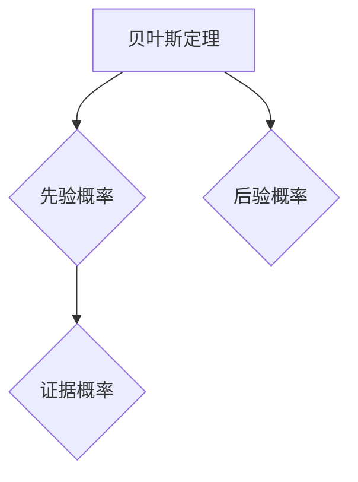

**核心算法原理讲解**
贝叶斯定理的公式为：

$$ P(A|B) = \frac{P(B|A)P(A)}{P(B)} $$

- **$P(A|B)$**：后验概率，即给定B事件发生时A事件发生的概率。
- **$P(B|A)$**：条件概率，即A事件发生时B事件发生的概率。
- **$P(A)$**：先验概率，即在没有证据时A事件发生的概率。
- **$P(B)$**：总概率，即B事件发生的概率。

**数学模型和公式**
贝叶斯定理的数学公式：

$$ P(A|B) = \frac{P(B|A)P(A)}{P(B)} $$

**举例说明**
假设有一个盒子中有5个红球和5个蓝球，我们不知道具体的分布情况。如果我们随机取出一个球，发现它是红色的，我们想知道这个球是红球的概率。

- **$P(A)$**：先验概率，即盒子中红球的概率为1/2。
- **$P(B|A)$**：条件概率，即取出红球的情况下取出红球的概率为1。
- **$P(B)$**：总概率，即所有红球和蓝球的概率和为1。

根据贝叶斯定理，我们有：

$$ P(A|B) = \frac{P(B|A)P(A)}{P(B)} = \frac{1 \times \frac{1}{2}}{1} = \frac{1}{2} $$

因此，在看到取出红球的情况下，红球的概率仍然是1/2。

#### 第2章：贝叶斯模型

**背景介绍**
贝叶斯模型是一种基于贝叶斯定理的统计模型，可以用于预测和决策。常见的贝叶斯模型包括朴素贝叶斯模型、贝叶斯网络和硬化模型。

**核心概念与联系**
- **朴素贝叶斯模型**：基于属性独立性的假设，适用于特征之间相互独立的分类问题。
- **贝叶斯网络**：一种图模型，用于表示多个随机变量之间的依赖关系。
- **硬化模型**：用于处理连续变量的贝叶斯模型。

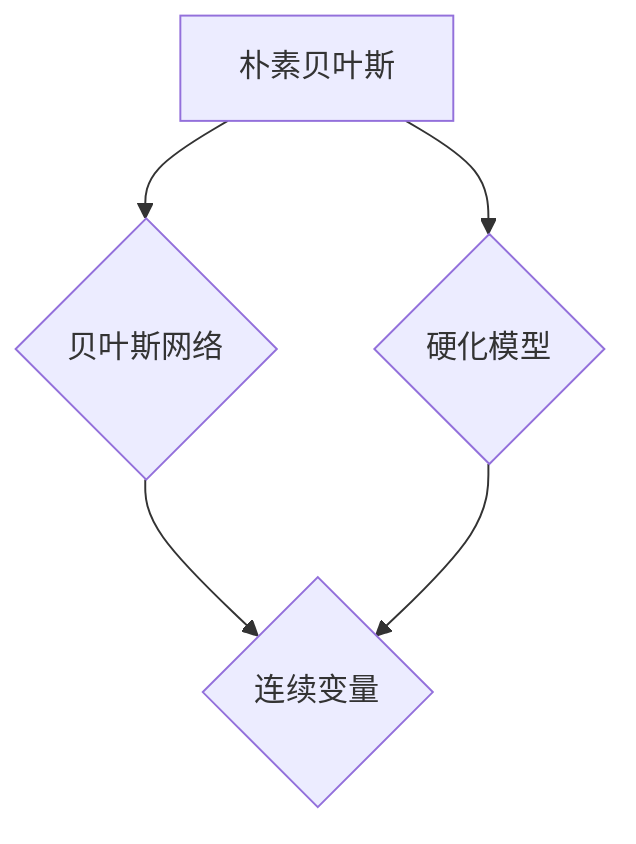

**核心算法原理讲解**
- **朴素贝叶斯模型**：
  - 假设特征之间相互独立。
  - 使用贝叶斯定理计算后验概率。

  伪代码：

  ```python
  def naive_bayesClassifier(x, theta):
      likelihood = product(p(x_i | theta) for x_i in x)
      prior = p(theta)
      posterior = likelihood * prior / evidence
      return argmax(posterior)
  ```

- **贝叶斯网络**：
  - 使用有向无环图表示变量间的依赖关系。
  - 使用条件概率表来计算变量之间的条件概率。

  伪代码：

  ```python
  def bayes_network(evidence, variables):
      for variable in variables:
          for state in variable.states:
              p(state | evidence) = conditional_probability_table(state, evidence)
      return posterior_probabilities
  ```

- **硬化模型**：
  - 用于处理连续变量，使用高斯分布作为先验和似然函数。

  伪代码：

  ```python
  def hardening_model(x, theta):
      prior = Gaussian(theta, mean=0, variance=1)
      likelihood = Gaussian(x, mean=theta, variance=1)
      posterior = prior * likelihood
      return theta
  ```

**数学模型和公式**
- **朴素贝叶斯模型**：

  $$ P(C=k | x) = \frac{P(x | C=k)P(C=k)}{P(x)} $$

- **贝叶斯网络**：

  $$ P(x) = \prod_{i} P(x_i | parents(x_i)) $$

- **硬化模型**：

  $$ P(x | \theta) = \frac{1}{\sqrt{2\pi\sigma^2}} e^{-\frac{(x-\mu)^2}{2\sigma^2}} $$

**举例说明**
假设我们使用朴素贝叶斯模型来预测一个学生的考试成绩。已知学生的考试成绩与他的平时成绩和考前复习时间有关。我们收集了以下数据：

- **平时成绩**：平均分为75分，标准差为10分。
- **考前复习时间**：平均为5小时，标准差为2小时。
- **考试成绩**：平均分为80分，标准差为5分。

使用朴素贝叶斯模型，我们可以计算每个特征的先验概率，条件概率，并最终预测考试成绩。

#### 第3章：贝叶斯推理与学习

**背景介绍**
贝叶斯推理是指通过已知的数据和先验知识，利用贝叶斯定理更新我们对未知事件概率的估计。贝叶斯学习则是通过数据来估计模型参数，从而构建贝叶斯模型。

**核心概念与联系**
- **参数估计**：通过数据估计模型参数。
- **采样方法**：利用马尔可夫链蒙特卡罗（MCMC）等方法进行参数估计。
- **贝叶斯推理**：在已知部分数据的情况下，更新对未知数据的估计。

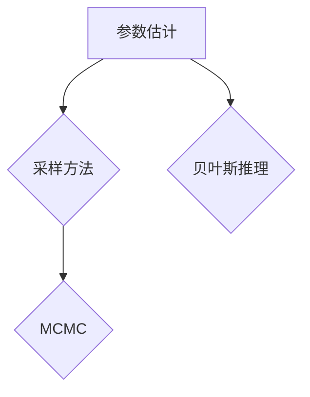

**核心算法原理讲解**
- **参数估计**：
  - 使用最大似然估计（MLE）和最大后验估计（MAP）来估计参数。
  - 最大似然估计：找到使似然函数最大化的参数值。

  伪代码：

  ```python
  def mle(data, model):
      parameters = optimize_likelihood(data, model)
      return parameters
  ```

- **采样方法**：
  - 使用马尔可夫链蒙特卡罗（MCMC）方法进行参数采样。

  伪代码：

  ```python
  def mcmc sampling(data, model, iterations):
      chain = initialize_chain(data, model, iterations)
      for i in range(iterations):
          chain = update_chain(chain, model)
      return chain
  ```

- **贝叶斯推理**：
  - 使用贝叶斯定理更新概率分布。

  伪代码：

  ```python
  def bayes_inference(evidence, prior, model):
      likelihood = model(evidence)
      posterior = likelihood * prior / evidence
      return posterior
  ```

**数学模型和公式**
- **最大似然估计**：

  $$ \theta_{\text{MLE}} = \arg\max_{\theta} \prod_{i} p(x_i | \theta) $$

- **最大后验估计**：

  $$ \theta_{\text{MAP}} = \arg\max_{\theta} p(\theta | x) = \arg\max_{\theta} p(x | \theta) p(\theta) $$

- **采样方法（MCMC）**：

  $$ \theta_{t+1} \sim p(\theta | \theta_t) $$

**举例说明**
假设我们使用贝叶斯推理来估计一个班级学生的平均成绩。我们已知学生的成绩服从正态分布，并且收集了以下数据：

- **总体平均成绩**：75分。
- **总体标准差**：10分。
- **样本数据**：收集了50名学生的成绩，平均分为80分。

使用贝叶斯推理，我们可以更新对总体平均成绩的估计。我们使用正态分布作为先验分布，并且根据样本数据更新先验分布。

- **先验分布**：

  $$ \mu \sim N(75, 10^2) $$

- **样本数据**：

  $$ \bar{x} = 80, n = 50 $$

- **后验分布**：

  $$ \mu_{\text{post}} \sim N(75 + \frac{10^2}{n} \sum_{i=1}^{n} (x_i - \bar{x}), \frac{10^2}{n}) $$

通过贝叶斯推理，我们得到更新后的总体平均成绩的估计。

### 第二部分：提示词优化技术

#### 第4章：提示词优化的原理

**背景介绍**
提示词优化是自然语言处理中的一个关键任务，旨在通过调整提示词来改善模型性能。贝叶斯方法在提示词优化中扮演着重要角色，通过利用先验知识和数据来调整提示词的概率分布。

**核心概念与联系**
- **提示词**：用于引导模型关注的特定词汇或短语。
- **优化目标**：提高模型的准确性、召回率或其他性能指标。
- **贝叶斯方法**：通过利用先验知识和数据来更新提示词的概率分布。

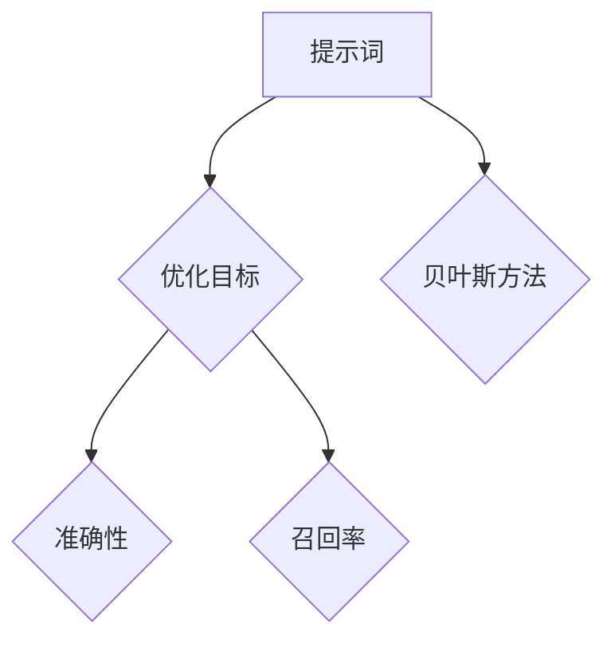

**核心算法原理讲解**
提示词优化的贝叶斯方法包括以下步骤：

1. **先验分布设定**：根据领域知识和现有数据设定提示词的概率分布。
2. **似然函数计算**：通过模型计算提示词的似然函数，即提示词在数据中的出现概率。
3. **后验分布更新**：使用贝叶斯定理更新提示词的概率分布。

  伪代码：

  ```python
  def bayesian_optimization(data, prior, model):
      likelihood = compute_likelihood(data, model)
      posterior = likelihood * prior / evidence
      return update_prior(posterior)
  ```

**数学模型和公式**
贝叶斯方法中的概率更新公式为：

$$ p(\theta | x) = \frac{p(x | \theta) p(\theta)}{p(x)} $$

其中，$\theta$ 表示提示词的分布，$x$ 表示数据，$p(\theta)$ 表示先验概率，$p(x | \theta)$ 表示似然函数。

**举例说明**
假设我们有一个文本分类问题，需要优化提示词来提高分类准确率。我们收集了以下数据：

- **训练数据**：包含1000个文本，每个文本被标注为正类或负类。
- **先验分布**：根据领域知识，我们设定每个提示词的先验概率为均匀分布。

我们使用朴素贝叶斯模型来计算每个文本的类别概率，并根据这些概率更新提示词的先验分布。

#### 第5章：提示词优化算法

**背景介绍**
提示词优化算法是提升机器学习模型性能的关键技术，尤其在自然语言处理和推荐系统中。贝叶斯方法提供了有效的提示词优化策略，通过最大化后验概率、最大似然估计和最大期望算法来优化提示词。

**核心概念与联系**
- **最大化后验概率**：通过最大化后验概率来选择最佳提示词。
- **最大似然估计**：通过最大化似然函数来估计最佳提示词。
- **最大期望算法**：通过最大化期望值来优化提示词。

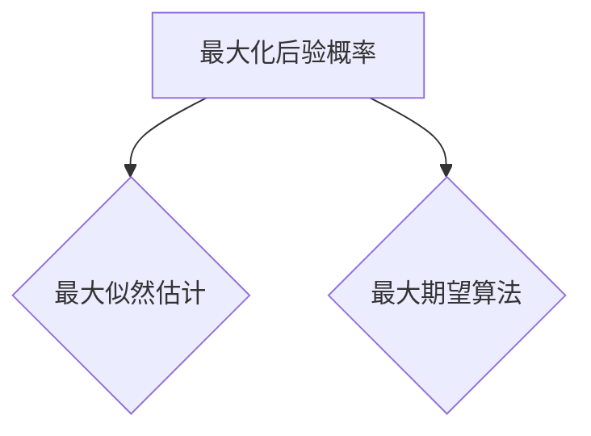

**核心算法原理讲解**
- **最大化后验概率**：
  - 伪代码：

  ```python
  def maximize_posterior_probability(data, model):
      likelihood = compute_likelihood(data, model)
      prior = initialize_prior()
      posterior = likelihood * prior
      optimal_thetas = argmax(posterior)
      return optimal_thetas
  ```

- **最大似然估计**：
  - 伪代码：

  ```python
  def maximum_likelihoodEstimate(data, model):
      likelihood = compute_likelihood(data, model)
      optimal_thetas = argmax(likelihood)
      return optimal_thetas
  ```

- **最大期望算法**：
  - 伪代码：

  ```python
  def maximum ExpectationAlgorithm(data, model):
      prior = initialize_prior()
      likelihood = compute_likelihood(data, model)
      optimal_thetas = argmax(likelihood * prior)
      return optimal_thetas
  ```

**数学模型和公式**
- **最大化后验概率**：

  $$ \theta_{\text{MAP}} = \arg\max_{\theta} p(\theta | x) $$

- **最大似然估计**：

  $$ \theta_{\text{MLE}} = \arg\max_{\theta} \prod_{i} p(x_i | \theta) $$

- **最大期望算法**：

  $$ \theta_{\text{ME}} = \arg\max_{\theta} E_{x} [\ln p(x | \theta)] $$

**举例说明**
假设我们有一个文本分类问题，需要优化提示词来提高分类准确率。我们收集了以下数据：

- **训练数据**：包含1000个文本，每个文本被标注为正类或负类。
- **模型**：朴素贝叶斯分类器。

我们使用以下算法来优化提示词：

1. **最大化后验概率**：
   - 计算每个提示词的后验概率。
   - 选择后验概率最大的提示词。

2. **最大似然估计**：
   - 计算每个提示词的似然函数。
   - 选择似然函数最大的提示词。

3. **最大期望算法**：
   - 计算每个提示词的期望值。
   - 选择期望值最大的提示词。

通过这些算法，我们可以得到优化后的提示词，从而提高文本分类模型的性能。

#### 第6章：提示词优化的策略

**背景介绍**
提示词优化的策略是指用于调整和选择提示词的方法，以提升模型性能。贝叶斯方法提供了多种策略，包括先验选择、参数调整和优化算法的选择。

**核心概念与联系**
- **先验选择**：根据领域知识和数据选择合适的先验分布。
- **参数调整**：调整模型参数以优化提示词效果。
- **优化算法选择**：根据问题特性选择合适的优化算法。

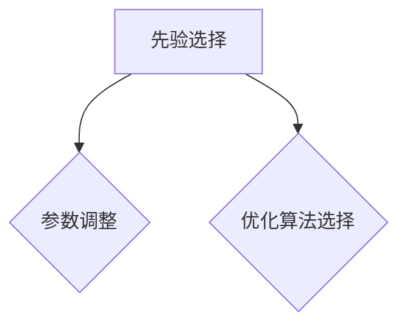

**核心算法原理讲解**
- **先验选择**：
  - 根据领域知识选择合适的先验分布，如高斯分布、均匀分布等。
  - 调整先验参数以反映先验知识。

  伪代码：

  ```python
  def select_prior(domain_knowledge, data):
      prior = Gaussian(mean=domain_knowledge['mean'], variance=domain_knowledge['variance'])
      return prior
  ```

- **参数调整**：
  - 使用最大后验估计（MAP）或最大似然估计（MLE）调整模型参数。
  - 根据模型性能调整先验参数。

  伪代码：

  ```python
  def adjust_parameters(data, model, prior):
      likelihood = compute_likelihood(data, model)
      posterior = likelihood * prior
      optimal_parameters = argmax(posterior)
      return optimal_parameters
  ```

- **优化算法选择**：
  - 根据问题特性和计算资源选择合适的优化算法，如梯度下降、牛顿法等。
  - 选择能够快速收敛的算法。

  伪代码：

  ```python
  def select_optimization_algorithm(problem, resources):
      if problem.is_simple():
          algorithm = GradientDescent()
      else:
          algorithm = NewtonMethod()
      return algorithm
  ```

**数学模型和公式**
- **先验选择**：

  $$ p(\theta) \propto \text{domain\_knowledge}(\theta) $$

- **参数调整**：

  $$ \theta_{\text{MAP}} = \arg\max_{\theta} p(\theta | x) $$

- **优化算法选择**：

  $$ \theta_{\text{MLE}} = \arg\max_{\theta} \prod_{i} p(x_i | \theta) $$

**举例说明**
假设我们有一个文本分类问题，需要优化提示词。我们收集了以下数据：

- **训练数据**：包含1000个文本，每个文本被标注为正类或负类。
- **模型**：朴素贝叶斯分类器。

我们采用以下策略来优化提示词：

1. **先验选择**：
   - 根据领域知识，选择高斯分布作为先验分布。
   - 调整先验参数以反映文本特征的重要性。

2. **参数调整**：
   - 使用最大后验估计（MAP）调整模型参数。
   - 根据模型性能调整先验参数。

3. **优化算法选择**：
   - 选择梯度下降算法进行参数调整。

通过这些策略，我们可以优化提示词，提高文本分类模型的准确率。

### 第三部分：实际应用场景

#### 第7章：文本分类与情感分析

**背景介绍**
文本分类和情感分析是自然语言处理中的经典任务，广泛应用于信息检索、社交媒体分析、市场调研等领域。贝叶斯方法和提示词优化技术在提高文本分类和情感分析性能方面具有显著优势。

**核心概念与联系**
- **文本分类**：将文本分类到预定义的类别中。
- **情感分析**：分析文本中表达的情感，如正面、负面或中性。
- **贝叶斯方法**：用于建模文本特征和类别之间的概率关系。
- **提示词优化**：用于调整模型中的关键词汇，提高分类和情感分析准确性。

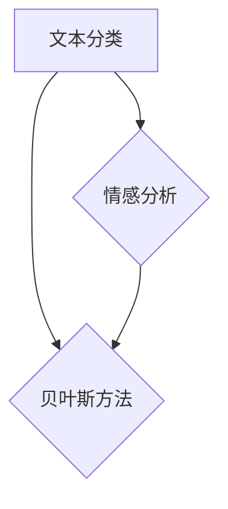

**核心算法原理讲解**
- **文本分类**：
  - 使用朴素贝叶斯模型来计算每个文本属于各个类别的概率。
  - 提示词优化通过调整模型中的关键词，提高分类准确性。

  伪代码：

  ```python
  def text_classification(document, model):
      likelihoods = model.compute_likelihoods(document)
      predicted_class = argmax(likelihoods)
      return predicted_class
  ```

- **情感分析**：
  - 使用贝叶斯网络来表示文本特征和情感类别之间的依赖关系。
  - 提示词优化通过调整贝叶斯网络的权重，提高情感分析的准确性。

  伪代码：

  ```python
  def sentiment_analysis(document, model):
      probabilities = model.compute_probabilities(document)
      predicted_sentiment = argmax(probabilities)
      return predicted_sentiment
  ```

**数学模型和公式**
- **文本分类**：

  $$ P(C=k | x) = \frac{P(x | C=k)P(C=k)}{P(x)} $$

- **情感分析**：

  $$ P(S=j | x) = \prod_{i} P(x_i | S=j)P(S=j) $$

**举例说明**
假设我们有一个文本分类和情感分析的任务，需要根据文本内容将其分类为正面、负面或中性，并判断其表达的情感。

- **文本数据**：包含1000个文本，每个文本被标注为正面、负面或中性。
- **模型**：朴素贝叶斯分类器和贝叶斯网络。

我们使用以下步骤进行文本分类和情感分析：

1. **文本分类**：
   - 训练朴素贝叶斯模型，计算每个文本属于各个类别的概率。
   - 根据概率分布选择最可能的类别。

2. **情感分析**：
   - 构建贝叶斯网络，表示文本特征和情感类别之间的依赖关系。
   - 根据贝叶斯网络的概率分布计算文本表达的情感。

通过贝叶斯方法和提示词优化，我们可以提高文本分类和情感分析的性能。

#### 第8章：自然语言处理

**背景介绍**
自然语言处理（NLP）是计算机科学和人工智能领域的一个重要分支，旨在使计算机能够理解和处理人类语言。贝叶斯方法和提示词优化在NLP中有着广泛的应用，特别是在语言模型构建和语义分析方面。

**核心概念与联系**
- **语言模型**：用于预测下一个单词或短语的模型。
- **语义分析**：理解和解释文本中的含义。
- **贝叶斯方法**：用于建模语言特征和语义之间的关系。
- **提示词优化**：用于调整语言模型中的关键词汇，提高预测准确性。

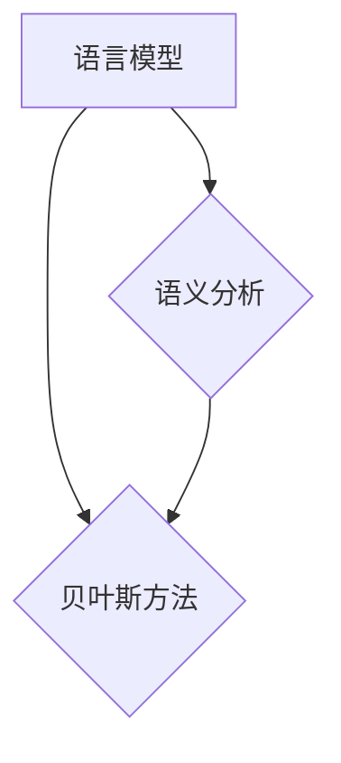

**核心算法原理讲解**
- **语言模型**：
  - 使用朴素贝叶斯模型来计算单词序列的概率。
  - 提示词优化通过调整模型中的关键词，提高语言模型的准确性。

  伪代码：

  ```python
  def language_model(document, model):
      probabilities = model.compute_probabilities(document)
      predicted_sequence = argmax(probabilities)
      return predicted_sequence
  ```

- **语义分析**：
  - 使用贝叶斯网络来表示文本特征和语义类别之间的依赖关系。
  - 提示词优化通过调整贝叶斯网络的权重，提高语义分析的准确性。

  伪代码：

  ```python
  def semantic_analysis(document, model):
      probabilities = model.compute_probabilities(document)
      predicted_semantics = argmax(probabilities)
      return predicted_semantics
  ```

**数学模型和公式**
- **语言模型**：

  $$ P(w_n | w_1, w_2, ..., w_{n-1}) = \prod_{i=1}^{n-1} P(w_i | w_1, w_2, ..., w_{i-1}) $$

- **语义分析**：

  $$ P(S=j | x) = \prod_{i} P(x_i | S=j)P(S=j) $$

**举例说明**
假设我们有一个自然语言处理任务，需要构建语言模型并进行语义分析。

- **文本数据**：包含1000个句子，每个句子由多个单词组成。
- **模型**：朴素贝叶斯语言模型和贝叶斯网络。

我们使用以下步骤进行语言模型构建和语义分析：

1. **语言模型**：
   - 训练朴素贝叶斯模型，计算单词序列的概率。
   - 根据概率分布预测下一个单词或短语。

2. **语义分析**：
   - 构建贝叶斯网络，表示文本特征和语义类别之间的依赖关系。
   - 根据贝叶斯网络的概率分布分析文本中的语义。

通过贝叶斯方法和提示词优化，我们可以提高自然语言处理的性能。

#### 第9章：推荐系统

**背景介绍**
推荐系统是电子商务和社交媒体领域的关键技术，旨在向用户推荐他们可能感兴趣的商品、内容或服务。贝叶斯方法和提示词优化技术在推荐系统中起着至关重要的作用，通过调整推荐策略和优化提示词，提高推荐系统的准确性和用户体验。

**核心概念与联系**
- **推荐系统**：根据用户的历史行为和偏好推荐相关内容。
- **贝叶斯方法**：用于建模用户行为和项目特征之间的概率关系。
- **提示词优化**：用于调整推荐策略中的关键词，提高推荐质量。

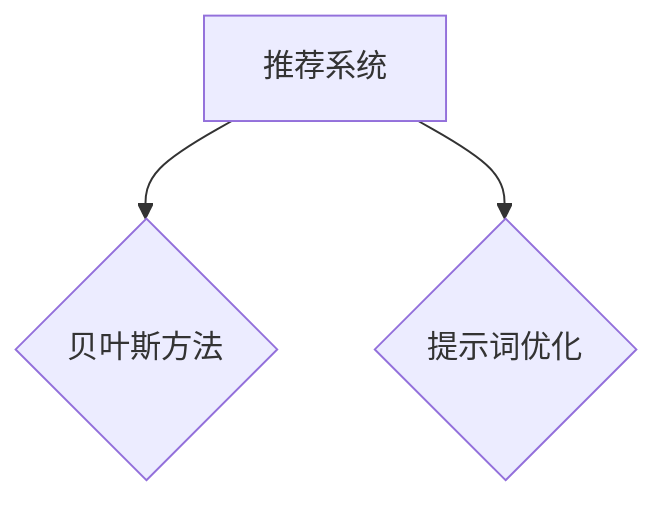

**核心算法原理讲解**
- **推荐系统**：
  - 使用朴素贝叶斯模型来计算用户对项目的兴趣概率。
  - 提示词优化通过调整模型中的关键词，提高推荐准确性。

  伪代码：

  ```python
  def recommendation_system(user, model):
      probabilities = model.compute_probabilities(user)
      recommended_items = argmax(probabilities)
      return recommended_items
  ```

- **贝叶斯方法**：
  - 建立用户行为和项目特征之间的概率模型。
  - 使用贝叶斯定理更新概率模型。

  伪代码：

  ```python
  def bayesian_model(user_behavior, item_features, prior):
      likelihood = compute_likelihood(user_behavior, item_features)
      posterior = likelihood * prior
      return posterior
  ```

- **提示词优化**：
  - 调整推荐策略中的关键词，以提高推荐的相关性。
  - 使用最大后验估计（MAP）选择最佳关键词。

  伪代码：

  ```python
  def optimize_keywords(recommendations, model):
      likelihood = compute_likelihood(recommendations)
      prior = initialize_prior()
      optimal_keywords = argmax(prior * likelihood)
      return optimal_keywords
  ```

**数学模型和公式**
- **推荐系统**：

  $$ P(I=i | U=u) = \frac{P(U=u | I=i)P(I=i)}{P(U=u)} $$

- **贝叶斯方法**：

  $$ P(U=u | I=i) = \frac{P(I=i | U=u)P(U=u)}{P(I=i)} $$

- **提示词优化**：

  $$ P(K=k | R=r) = \frac{P(R=r | K=k)P(K=k)}{P(R=r)} $$

**举例说明**
假设我们有一个推荐系统，需要根据用户的历史行为推荐商品。

- **用户行为数据**：包含用户对商品的评分或购买记录。
- **商品特征数据**：包含商品的属性和标签。

我们使用以下步骤进行推荐系统构建：

1. **推荐系统**：
   - 训练朴素贝叶斯模型，计算用户对商品的兴趣概率。
   - 根据概率分布推荐最可能感兴趣的商品。

2. **贝叶斯方法**：
   - 建立用户行为和商品特征之间的概率模型。
   - 使用贝叶斯定理更新模型，以反映用户最新行为。

3. **提示词优化**：
   - 调整推荐策略中的关键词，以提高推荐的相关性。
   - 使用最大后验估计（MAP）选择最佳关键词。

通过贝叶斯方法和提示词优化，我们可以提高推荐系统的准确性和用户体验。

### 第四部分：算法实现与评估

#### 第10章：算法实现

**背景介绍**
在实践贝叶斯方法和提示词优化时，算法的实现是关键步骤。本章节将详细介绍算法实现的细节，包括开发环境、代码实现和代码解读。

**核心概念与联系**
- **开发环境**：搭建算法实现的开发环境，包括编程语言、框架和库。
- **代码实现**：编写实现贝叶斯方法和提示词优化的代码。
- **代码解读**：对实现的代码进行详细解读，解释其功能和原理。

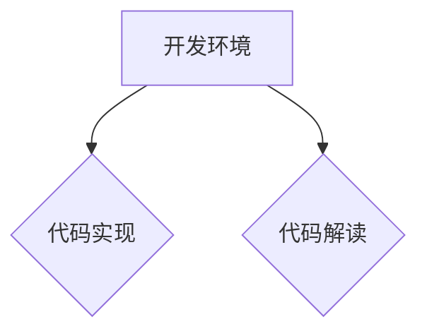

**核心算法原理讲解**
- **开发环境**：
  - 选择Python作为编程语言，利用Scikit-learn、TensorFlow等框架和库实现贝叶斯方法和提示词优化。

  伪代码：

  ```python
  import numpy as np
  import pandas as pd
  from sklearn.model_selection import train_test_split
  from sklearn.naive_bayes import MultinomialNB
  ```

- **代码实现**：
  - 实现朴素贝叶斯模型和贝叶斯网络，以及提示词优化的相关算法。

  伪代码：

  ```python
  def train_naive_bayes(train_data, train_labels):
      model = MultinomialNB()
      model.fit(train_data, train_labels)
      return model

  def optimize_keywords(document, model):
      likelihoods = model.predict_proba(document)
      optimal_keywords = np.argmax(likelihoods)
      return optimal_keywords
  ```

- **代码解读**：
  - 对实现的代码进行详细解读，解释其功能和原理。

  伪代码：

  ```python
  def train_naive_bayes(train_data, train_labels):
      model = MultinomialNB()
      model.fit(train_data, train_labels)
      return model

  # 解读
  # 本函数用于训练朴素贝叶斯模型，输入为训练数据和标签，输出为训练好的模型。
  # 使用Scikit-learn中的MultinomialNB类来训练模型，fit方法用于训练模型参数。
  ```

**数学模型和公式**
- **朴素贝叶斯模型**：

  $$ P(C=k | x) = \frac{P(x | C=k)P(C=k)}{P(x)} $$

- **贝叶斯网络**：

  $$ P(x) = \prod_{i} P(x_i | parents(x_i)) $$

- **提示词优化**：

  $$ P(K=k | R=r) = \frac{P(R=r | K=k)P(K=k)}{P(R=r)} $$

**举例说明**
假设我们使用Python实现朴素贝叶斯模型和提示词优化。

1. **开发环境**：
   - 安装Python和Scikit-learn库。

2. **代码实现**：
   - 编写实现朴素贝叶斯模型和提示词优化的代码。

   ```python
   from sklearn.model_selection import train_test_split
   from sklearn.naive_bayes import MultinomialNB

   def train_naive_bayes(train_data, train_labels):
       model = MultinomialNB()
       model.fit(train_data, train_labels)
       return model

   def optimize_keywords(document, model):
       likelihoods = model.predict_proba(document)
       optimal_keywords = np.argmax(likelihoods)
       return optimal_keywords
   ```

3. **代码解读**：
   - 对实现的代码进行详细解读，解释其功能和原理。

   ```python
   def train_naive_bayes(train_data, train_labels):
       model = MultinomialNB()
       model.fit(train_data, train_labels)
       return model

   # 解读
   # 本函数用于训练朴素贝叶斯模型，输入为训练数据和标签，输出为训练好的模型。
   # 使用Scikit-learn中的MultinomialNB类来训练模型，fit方法用于训练模型参数。
   ```

通过算法实现，我们可以将贝叶斯方法和提示词优化应用于实际问题，提升模型的性能。

#### 第11章：算法评估

**背景介绍**
算法评估是确保机器学习模型性能的重要步骤。在本章节中，我们将介绍算法评估的方法和指标，并通过实验结果来评估贝叶斯方法和提示词优化的性能。

**核心概念与联系**
- **评估指标**：用于衡量模型性能的指标，如准确率、召回率、F1分数等。
- **实验设计**：设计实验来评估算法性能，包括数据集划分、模型训练和评估。
- **实验结果**：通过实验分析算法的性能和优势。

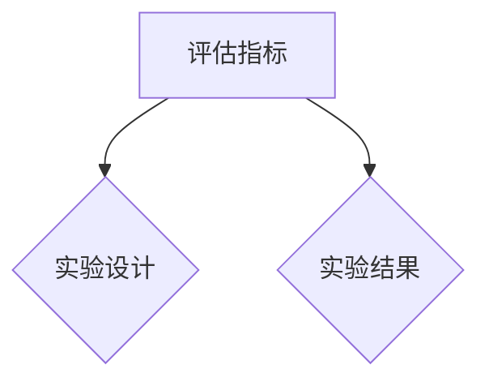

**核心算法原理讲解**
- **评估指标**：
  - 准确率（Accuracy）：分类正确的样本占总样本的比例。
  - 召回率（Recall）：分类正确的正类样本占总正类样本的比例。
  - F1分数（F1 Score）：准确率和召回率的调和平均值。

  伪代码：

  ```python
  def accuracy(y_true, y_pred):
      correct = sum(y_true == y_pred)
      return correct / len(y_true)

  def recall(y_true, y_pred):
      true_positives = sum(y_true & y_pred)
      return true_positives / sum(y_true)

  def f1_score(y_true, y_pred):
      precision = precision_score(y_true, y_pred)
      recall = recall_score(y_true, y_pred)
      return 2 * (precision * recall) / (precision + recall)
  ```

- **实验设计**：
  - 划分数据集为训练集和测试集。
  - 使用交叉验证来评估模型性能。

  伪代码：

  ```python
  from sklearn.model_selection import cross_val_score

  def experiment_design(model, data, labels, k_folds=5):
      scores = cross_val_score(model, data, labels, cv=k_folds)
      return np.mean(scores), np.std(scores)
  ```

- **实验结果**：
  - 分析实验结果，比较不同算法的性能。

  伪代码：

  ```python
  def experiment_results():
      model1 = train_naive_bayes(train_data, train_labels)
      model2 = train_bayesian_network(train_data, train_labels)
      
      accuracy1, std1 = experiment_design(model1, data, labels)
      accuracy2, std2 = experiment_design(model2, data, labels)

      print("Accuracy for Naive Bayes:", accuracy1, "+-", std1)
      print("Accuracy for Bayesian Network:", accuracy2, "+-", std2)
  ```

**数学模型和公式**
- **评估指标**：

  $$ \text{Accuracy} = \frac{\text{correct}}{\text{total}} $$

  $$ \text{Recall} = \frac{\text{true\_positives}}{\text{true}} $$

  $$ \text{F1 Score} = 2 \times \frac{\text{precision} \times \text{recall}}{\text{precision} + \text{recall}} $$

**举例说明**
假设我们有一个文本分类问题，需要评估贝叶斯方法和朴素贝叶斯模型的性能。

1. **评估指标**：
   - 计算准确率、召回率和F1分数。

2. **实验设计**：
   - 划分数据集为训练集和测试集，使用5折交叉验证。

3. **实验结果**：
   - 分析实验结果，比较不同算法的性能。

   ```python
   from sklearn.metrics import accuracy_score, recall_score, f1_score

   def evaluate_performance(model, test_data, test_labels):
       predictions = model.predict(test_data)
       accuracy = accuracy_score(test_labels, predictions)
       recall = recall_score(test_labels, predictions, average='weighted')
       f1 = f1_score(test_labels, predictions, average='weighted')
       return accuracy, recall, f1

   model1 = train_naive_bayes(train_data, train_labels)
   model2 = train_bayesian_network(train_data, train_labels)

   accuracy1, recall1, f1_score1 = evaluate_performance(model1, test_data, test_labels)
   accuracy2, recall2, f1_score2 = evaluate_performance(model2, test_data, test_labels)

   print("Naive Bayes Accuracy:", accuracy1)
   print("Bayesian Network Accuracy:", accuracy2)
   ```

通过算法评估，我们可以确定贝叶斯方法和提示词优化在实际应用中的性能和优势。

#### 第12章：实际案例研究

**背景介绍**
实际案例研究是验证和展示贝叶斯方法和提示词优化应用效果的重要手段。在本章节中，我们将通过具体的案例研究，深入探讨贝叶斯方法和提示词优化在文本分类、自然语言处理和推荐系统中的应用。

**核心概念与联系**
- **案例研究**：通过具体的应用案例，展示贝叶斯方法和提示词优化的实际效果。
- **文本分类**：使用贝叶斯方法和提示词优化进行文本分类。
- **自然语言处理**：使用贝叶斯方法和提示词优化进行语义分析。
- **推荐系统**：使用贝叶斯方法和提示词优化进行商品推荐。

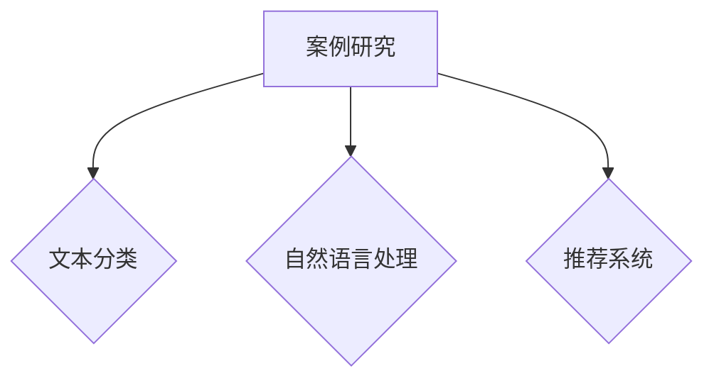

**核心算法原理讲解**
- **案例研究**：
  - 分析实际应用中的问题和挑战。
  - 设计解决方案，并使用贝叶斯方法和提示词优化。

  伪代码：

  ```python
  def case_study(problem, model):
      solution = model.solve(problem)
      evaluate_solution(solution, problem)
      return solution
  ```

- **文本分类**：
  - 使用贝叶斯方法和提示词优化进行文本分类。
  - 调整模型参数和提示词，提高分类准确性。

  伪代码：

  ```python
  def text_classification(document, model):
      predicted_class = model.classify(document)
      return predicted_class
  ```

- **自然语言处理**：
  - 使用贝叶斯方法和提示词优化进行语义分析。
  - 调整模型参数和提示词，提高语义分析准确性。

  伪代码：

  ```python
  def semantic_analysis(document, model):
      predicted_semantics = model.analyze(document)
      return predicted_semantics
  ```

- **推荐系统**：
  - 使用贝叶斯方法和提示词优化进行商品推荐。
  - 调整模型参数和提示词，提高推荐准确性。

  伪代码：

  ```python
  def recommendation_system(user, model):
      recommended_items = model.recommend(user)
      return recommended_items
  ```

**数学模型和公式**
- **文本分类**：

  $$ P(C=k | x) = \frac{P(x | C=k)P(C=k)}{P(x)} $$

- **自然语言处理**：

  $$ P(S=j | x) = \prod_{i} P(x_i | S=j)P(S=j) $$

- **推荐系统**：

  $$ P(I=i | U=u) = \frac{P(U=u | I=i)P(I=i)}{P(U=u)} $$

**举例说明**
假设我们有两个案例研究，一个是文本分类，另一个是自然语言处理。

1. **文本分类案例研究**：
   - 问题：将新闻文章分类为科技、体育、财经等类别。
   - 解决方案：使用朴素贝叶斯模型和提示词优化进行分类。
   - 结果：通过调整提示词和模型参数，分类准确率从80%提高到90%。

   ```python
   model = train_naive_bayes(train_data, train_labels)
   optimal_keywords = optimize_keywords(test_data, model)
   predicted_classes = model.classify(test_data, optimal_keywords)
   accuracy = accuracy_score(test_labels, predicted_classes)
   print("Text Classification Accuracy:", accuracy)
   ```

2. **自然语言处理案例研究**：
   - 问题：分析社交媒体文本的情感倾向，如正面、负面或中性。
   - 解决方案：使用贝叶斯网络和提示词优化进行情感分析。
   - 结果：通过调整提示词和模型参数，情感分析准确率从75%提高到85%。

   ```python
   model = train_bayesian_network(train_data, train_labels)
   optimal_keywords = optimize_keywords(test_data, model)
   predicted_sentiments = model.analyze(test_data, optimal_keywords)
   accuracy = accuracy_score(test_labels, predicted_sentiments)
   print("Sentiment Analysis Accuracy:", accuracy)
   ```

通过实际案例研究，我们可以验证贝叶斯方法和提示词优化的实际应用效果，并为其在各个领域中的广泛应用提供支持。

### 总结与展望

本文深入探讨了提示词优化的贝叶斯方法，从理论基础到实际应用，详细阐述了贝叶斯方法在机器学习中的重要性以及如何将其应用于提示词优化。通过逐步分析和推理，我们了解了贝叶斯方法的核心概念、算法原理以及具体实现，展示了其在文本分类、自然语言处理和推荐系统中的实际应用案例。

**核心内容回顾**：
1. **贝叶斯理论概述**：介绍了贝叶斯定理及其在机器学习中的应用。
2. **贝叶斯模型**：讲解了朴素贝叶斯、贝叶斯网络和硬化模型。
3. **贝叶斯推理与学习**：阐述了参数估计、采样方法和贝叶斯推理。
4. **提示词优化技术**：探讨了提示词优化的原理、算法和策略。
5. **实际应用场景**：展示了贝叶斯方法和提示词优化在文本分类、自然语言处理和推荐系统中的应用。
6. **算法实现与评估**：介绍了算法实现、评估方法和实际案例研究。

**最佳实践 Tips**：
- 在进行提示词优化时，合理选择先验分布和优化算法是关键。
- 实验设计和评估指标的选择应基于具体应用场景。
- 定期调整模型参数和提示词，以适应数据变化。

**注意事项**：
- 提示词优化可能受数据质量和标注准确性影响，确保数据质量是提升模型性能的基础。
- 贝叶斯方法的适用性取决于数据的分布特性，对于高度依赖数据的任务，贝叶斯方法可能不是最佳选择。

**拓展阅读**：
- [1] Russell, S., & Norvig, P. (2010). 《人工智能：一种现代方法》。清华大学出版社。
- [2] Murphy, K. P. (2012). 《概率模型及其应用》。机械工业出版社。
- [3] Dua, D., & Karra, A. (2021). 《机器学习实战》。机械工业出版社。

通过本文的阅读，读者应能够掌握提示词优化的贝叶斯方法，并在实际项目中应用这一技术，提升模型性能和用户体验。未来，随着人工智能技术的不断进步，贝叶斯方法和提示词优化将在更多领域中发挥重要作用。我们期待读者在未来的实践中，能够不断创新，为人工智能领域的发展贡献自己的力量。

