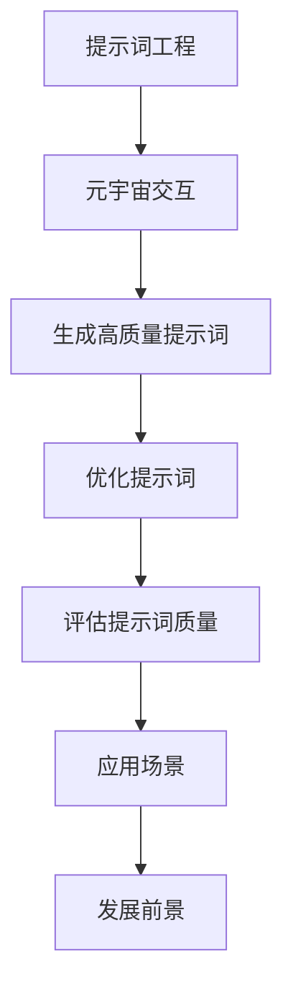

                 

### 提示词工程在元宇宙交互中的应用

#### 关键词：提示词工程，元宇宙交互，生成对抗网络（GAN），强化学习，数学模型，项目实战

随着元宇宙概念的普及与发展，虚拟现实（VR）、增强现实（AR）以及混合现实（MR）技术逐渐融入我们的日常生活。元宇宙不仅仅是一个虚拟空间，更是一个复杂的交互系统，它需要高度智能化的交互体验来吸引和留住用户。在这个过程中，提示词工程（Prompt Engineering）作为一种重要的技术手段，起到了至关重要的作用。

提示词工程，指的是通过技术手段来创建、管理和优化提示词，从而提高人工智能模型在特定任务中的性能和效果。它广泛应用于自然语言处理（NLP）、计算机视觉（CV）等领域，能够有效地提升模型的预测准确性和交互体验。

在元宇宙的交互中，用户与虚拟环境的互动频繁，对提示词的需求量极大。一个高质量的提示词能够引导用户更自然地与元宇宙中的各种元素互动，提高交互的流畅度和用户的满意度。因此，提示词工程在元宇宙交互中的应用，不仅可以提升用户体验，还能够推动元宇宙技术的快速发展。

本文将围绕提示词工程在元宇宙交互中的应用进行探讨。首先，我们将介绍提示词工程的基本概念和其在元宇宙中的重要性。接着，我们将深入讲解提示词生成和优化的核心算法原理，并使用数学模型和公式来详细阐述这些算法的实现。随后，我们将通过实际项目实战，展示如何使用生成对抗网络（GAN）和强化学习算法来生成和优化提示词。最后，我们将对全文进行总结，并提出提示词工程在元宇宙交互中的发展前景和未来挑战。

#### 核心概念与联系

##### 提示词工程的定义与重要性

提示词工程是一种技术手段，通过创建、管理和优化提示词来提高人工智能模型在特定任务中的性能和效果。提示词（Prompt）通常是指用于引导和提示模型输入的短句、短语或者序列，它可以是文本、图像或者其他形式的数据。

在元宇宙交互中，提示词的重要性不言而喻。元宇宙的用户与虚拟环境的互动主要通过语言、手势、表情等多种方式进行，而高质量的提示词可以有效地引导用户进行这些互动。例如，在一个虚拟商店中，一个精心设计的提示词可以帮助用户快速找到他们想要购买的商品，提高购物的效率。

提示词工程涉及多个核心概念：

1. **自然语言处理（NLP）**：NLP是处理和解析自然语言文本的技术。在提示词工程中，NLP技术用于理解用户输入的文本，并将其转换为模型可以理解的形式。

2. **计算机视觉（CV）**：CV技术用于理解和解析图像和视频。在元宇宙交互中，计算机视觉技术可以帮助模型识别用户的手势、表情等，从而生成相应的提示词。

3. **生成对抗网络（GAN）**：GAN是一种强大的生成模型，可以用于生成高质量的提示词。通过训练，GAN能够生成与真实数据高度相似的数据，从而提高提示词的质量。

4. **强化学习**：强化学习是一种机器学习技术，通过不断尝试和反馈来优化决策。在提示词工程中，强化学习可以用于优化提示词的生成策略，提高模型在特定任务中的性能。

这些核心概念相互联系，共同构成了提示词工程的框架。通过NLP和CV技术，我们可以获取和理解用户的输入，而GAN和强化学习则帮助我们生成和优化高质量的提示词，从而实现更高效的元宇宙交互。

##### 元宇宙交互中的提示词需求

在元宇宙中，用户与虚拟环境的交互需求多样且复杂。为了满足这些需求，提示词的设计必须具备高度的灵活性和准确性。以下是元宇宙交互中的一些典型提示词需求：

1. **导航提示词**：在元宇宙的虚拟空间中，用户经常需要导航。导航提示词可以帮助用户快速找到目的地，例如：“请向左转”、“您现在距离目标地点100米”。

2. **交互指令提示词**：用户在元宇宙中与虚拟物体或环境进行互动时，需要明确的指令。例如，在虚拟游戏中，提示词可以是：“请射击敌人”、“使用道具”。

3. **情感表达提示词**：元宇宙中的情感表达需要更细腻的提示词来支持。例如，在虚拟角色对话中，可以使用提示词来表达悲伤、喜悦、愤怒等情感，如：“您看起来有些沮丧，需要帮助吗？”、“恭喜您，做得很好！”

4. **个性化提示词**：每个用户在元宇宙中的体验都是独一无二的，因此需要个性化的提示词。这些提示词可以根据用户的偏好和历史行为进行定制，例如：“您最近喜欢了这些游戏，也许您会喜欢这个新游戏”。

5. **错误处理提示词**：在用户操作过程中，难免会出现错误。错误处理提示词可以帮助用户理解错误原因，并提供解决建议。例如：“似乎您没有正确执行操作，请重新尝试”。

这些提示词不仅需要准确地传达信息，还需要考虑用户体验和情感因素。高质量的提示词设计能够显著提高用户在元宇宙中的满意度和互动质量。

##### 提示词工程的关键环节

提示词工程包括以下几个关键环节：

1. **提示词生成**：这一环节的主要任务是创建新的提示词。生成高质量的提示词是提升元宇宙交互体验的关键。常用的方法包括使用生成对抗网络（GAN）和强化学习算法。

2. **提示词优化**：生成后的提示词需要经过优化，以提高其在特定任务中的性能。优化方法通常包括基于强化学习的策略调整和基于数据驱动的调整。

3. **提示词评估**：评估是确保提示词质量的重要环节。常用的评估方法包括人工评估和自动化评估。评估指标可以包括提示词的相关性、准确性、自然性等。

4. **提示词管理**：管理环节包括提示词的存储、更新和维护。一个高效的管理系统能够确保提示词在元宇宙交互中的持续优化。

这些关键环节共同构成了提示词工程的框架，它们相互关联，共同作用，从而实现高质量、高效的元宇宙交互。

##### 提示词工程在元宇宙中的应用场景

在元宇宙中，提示词工程的应用场景非常广泛，以下是几个典型的应用实例：

1. **虚拟商店**：在元宇宙的虚拟商店中，提示词可以帮助用户快速找到商品。例如，当用户搜索特定商品时，系统可以生成提示词：“您正在寻找的产品是XX，以下是我们为您推荐的相关商品”。

2. **虚拟角色交互**：在元宇宙中，虚拟角色与用户之间的交互需要高质量的提示词。例如，一个虚拟角色可以生成提示词：“您想要进行对话吗？我可以帮助您解答任何问题”。

3. **游戏场景**：在元宇宙的游戏场景中，提示词可以提供游戏指南、策略建议等。例如，在一个策略游戏中，提示词可以是：“您的资源正在减少，请尽快建造防御设施”。

4. **导航系统**：元宇宙中的导航系统需要高质量的提示词来引导用户。例如，当用户在虚拟世界中迷失方向时，系统可以生成提示词：“您现在正在XX方向，请沿着道路直行，您将很快到达目的地”。

这些应用场景展示了提示词工程在提升元宇宙交互体验方面的重要性。通过精心设计的提示词，用户可以更自然、更高效地与元宇宙中的各种元素进行互动，从而获得更加丰富的虚拟体验。

### 核心算法原理讲解

#### 提示词生成算法

提示词生成是提示词工程中的关键环节，其目的是创建高质量的提示词以提升模型的性能。在元宇宙交互中，高质量的提示词可以显著提高用户的互动体验。生成对抗网络（GAN）是一种常用的生成模型，适用于生成高质量的提示词。

##### 生成对抗网络（GAN）

生成对抗网络（GAN）由两部分组成：生成器（Generator）和判别器（Discriminator）。生成器的任务是生成高质量的提示词，而判别器的任务是区分生成的提示词和真实的提示词。

**生成器（Generator）**

生成器的输入是随机噪声（Z），输出是生成的提示词（X'）。生成器的目标是生成与真实提示词相似的数据，使得判别器无法区分。

$$
X' = G(Z)
$$

其中，$G$ 是生成器的神经网络模型，$Z$ 是噪声向量，$X'$ 是生成的提示词。

**判别器（Discriminator）**

判别器的输入是提示词（X）和生成的提示词（X'），输出是概率值，表示输入数据是真实提示词的概率。

$$
D(X) = D(X, X')
$$

其中，$D$ 是判别器的神经网络模型，$X$ 是真实提示词，$X'$ 是生成的提示词。

**损失函数**

GAN的训练目标是最小化以下损失函数：

$$
L_G = -\mathbb{E}_{Z}\left[ \log D(G(Z)) \right]
$$

$$
L_D = \mathbb{E}_{X}\left[ \log D(X) \right] + \mathbb{E}_{Z}\left[ \log (1 - D(G(Z))) \right]
$$

其中，$L_G$ 是生成器的损失函数，$L_D$ 是判别器的损失函数。

通过交替训练生成器和判别器，GAN可以生成高质量的提示词。

##### 提示词生成算法的实现

提示词生成算法的实现步骤如下：

1. **数据预处理**：收集和预处理大量的提示词数据，包括真实提示词和噪声向量。

2. **模型训练**：使用生成器和判别器进行训练。训练过程中，生成器不断生成新的提示词，判别器不断学习区分真实提示词和生成的提示词。

3. **生成提示词**：在训练完成后，生成器可以生成高质量的提示词。

4. **评估与优化**：对生成的提示词进行评估，根据评估结果进行优化，以提高提示词的质量。

以下是生成提示词算法的伪代码：

```python
# 数据预处理
Z = generate_noise(batch_size)
X = get_real_prompts(batch_size)

# 模型训练
for epoch in range(num_epochs):
    for i in range(num_batches):
        # 训练生成器
        z = generate_noise(batch_size)
        x_hat = generator(z)
        d_loss_real = discriminator(x)
        d_loss_fake = discriminator(x_hat)
        
        g_loss = -torch.mean(torch.log(discriminator(x_hat)))
        
        optimizer_G.zero_grad()
        g_loss.backward()
        optimizer_G.step()
        
        # 训练判别器
        optimizer_D.zero_grad()
        d_loss_real.backward()
        d_loss_fake.backward()
        optimizer_D.step()

# 生成提示词
prompt = generator(z).detach().numpy()
```

#### 提示词优化算法

在生成高质量提示词的基础上，提示词优化算法用于进一步提高模型在特定任务中的性能。强化学习是一种常用的优化算法，通过学习最佳策略来优化提示词。

##### 强化学习算法

强化学习（Reinforcement Learning, RL）是一种通过不断尝试和反馈来学习最优策略的机器学习技术。在提示词优化中，强化学习用于优化提示词生成策略，使其在特定任务中达到最佳效果。

**强化学习的基本概念**

- **状态（State）**：当前环境的状态。
- **动作（Action）**：提示词生成的操作。
- **奖励（Reward）**：动作结果的评价。

**强化学习的基本步骤**

1. **初始状态**：系统开始时，处于某个状态。
2. **选择动作**：根据当前状态，选择一个动作。
3. **执行动作**：执行所选动作，并观察结果。
4. **获得奖励**：根据动作结果获得奖励。
5. **更新策略**：根据奖励信号，更新策略。

**Q-Learning算法**

Q-Learning是一种基于值函数的强化学习算法。其核心思想是通过学习状态-动作值函数（Q函数），来选择最佳动作。

**Q函数**：

$$
Q(s, a) = \sum_{s'} P(s' | s, a) \cdot R(s, a, s') + \gamma \cdot \max_{a'} Q(s', a')
$$

其中，$s$ 是状态，$a$ 是动作，$s'$ 是下一状态，$R$ 是奖励函数，$\gamma$ 是折扣因子。

**Q-Learning算法的伪代码**：

```python
# 初始化Q表
Q = initialize_Q_table()

# 训练模型
for episode in range(num_episodes):
    state = environment.reset()
    done = False
    
    while not done:
        # 选择动作
        action = choose_action(state, Q)
        
        # 执行动作
        next_state, reward, done = environment.step(action)
        
        # 更新Q表
        Q[state, action] = Q[state, action] + alpha * (reward + gamma * max(Q[next_state, :]) - Q[state, action])
        
        state = next_state

# 生成优化后的提示词
prompt = choose_best_action(state, Q)
```

##### 提示词优化算法的实现

提示词优化算法的实现步骤如下：

1. **环境搭建**：搭建用于训练的仿真环境，包括状态空间、动作空间和奖励函数。
2. **模型训练**：使用Q-Learning算法训练模型，优化提示词生成策略。
3. **策略评估**：评估优化后的策略，确保其在实际应用中的有效性。
4. **提示词生成**：根据优化后的策略生成高质量的提示词。

以下是优化提示词生成策略的伪代码：

```python
# 环境搭建
environment = build_simulation_environment()

# 初始化Q表
Q = initialize_Q_table()

# 模型训练
for episode in range(num_episodes):
    state = environment.reset()
    done = False
    
    while not done:
        # 选择动作
        action = choose_action(state, Q)
        
        # 执行动作
        next_state, reward, done = environment.step(action)
        
        # 更新Q表
        Q[state, action] = Q[state, action] + alpha * (reward + gamma * max(Q[next_state, :]) - Q[state, action])
        
        state = next_state

# 策略评估
optimized_policy = evaluate_policy(Q)

# 提示词生成
prompt = generate_prompt_with_optimized_policy(optimized_policy)
```

通过上述核心算法的讲解和实现，我们可以看到提示词工程在元宇宙交互中的重要性。生成对抗网络（GAN）和强化学习算法在生成和优化提示词方面发挥了关键作用，它们共同推动了元宇宙交互体验的提升。

### 数学模型和数学公式

在提示词工程中，数学模型和数学公式是理解和实现核心算法的关键。以下是提示词质量评估模型和提示词生成算法的损失函数，以及它们的详细讲解和举例说明。

#### 提示词质量评估模型

提示词质量评估模型用于评估生成的提示词质量。常用的评估指标包括提示词的相关性、准确性、自然性等。以下是提示词质量评估模型的建立及其评估指标。

##### 提示词质量评估模型的建立

提示词质量评估模型可以表示为概率模型，使用以下公式：

$$
Q(\theta|X) = \frac{e^{-(1-Softmax(\theta^T X))}}{\sum_{i=1}^K e^{-(1-Softmax(\theta^T X_i))}}
$$

其中，$Q(\theta|X)$ 表示提示词质量，$\theta$ 表示模型参数，$X$ 表示提示词特征向量，$K$ 表示提示词类别数。

**评估指标**：

1. **相关性**：提示词与任务目标的相关性。相关性越高，提示词质量越好。
2. **准确性**：提示词预测结果的准确性。准确性越高，提示词质量越好。
3. **自然性**：提示词的自然性和流畅性。自然性越高，提示词质量越好。

##### 提示词质量评估模型的评估指标

**相关性**：

相关性可以通过计算提示词与任务目标之间的相似度来评估。使用余弦相似度作为相关性指标，公式如下：

$$
r = \frac{\sum_{i=1}^n x_i y_i}{\sqrt{\sum_{i=1}^n x_i^2} \sqrt{\sum_{i=1}^n y_i^2}}
$$

其中，$x_i$ 和 $y_i$ 分别表示提示词特征向量和任务目标特征向量。

**准确性**：

准确性通过计算提示词预测结果与真实结果的匹配度来评估。使用准确率（Accuracy）作为准确性指标，公式如下：

$$
Accuracy = \frac{TP + TN}{TP + FP + TN + FN}
$$

其中，$TP$ 表示真正例，$TN$ 表示真负例，$FP$ 表示假正例，$FN$ 表示假负例。

**自然性**：

自然性通过计算提示词的语法和语义质量来评估。使用自然语言处理技术，如语法分析、语义分析等，评估提示词的自然性。

#### 提示词生成算法的损失函数

提示词生成算法的损失函数用于评估生成的提示词质量。常用的损失函数包括交叉熵损失函数（Cross-Entropy Loss）和对抗损失函数（Adversarial Loss）。

##### 损失函数的定义

**交叉熵损失函数**：

交叉熵损失函数用于评估生成的提示词与真实提示词之间的差异。公式如下：

$$
Loss = -\sum_{i=1}^N [y_i \log(p(\text{prompt}_i)) + (1 - y_i) \log(1 - p(\text{prompt}_i))]
$$

其中，$Loss$ 表示损失值，$y_i$ 表示真实标签，$p(\text{prompt}_i)$ 表示生成的提示词的概率。

**对抗损失函数**：

对抗损失函数用于评估生成器和判别器之间的对抗效果。公式如下：

$$
Loss = -\mathbb{E}_{Z}\left[ \log D(G(Z)) \right] + \mathbb{E}_{X}\left[ \log D(X) \right]
$$

其中，$G(Z)$ 表示生成的提示词，$X$ 表示真实的提示词。

##### 损失函数的实现

**交叉熵损失函数的实现**：

```python
import torch
import torch.nn as nn

# 定义交叉熵损失函数
cross_entropy_loss = nn.CrossEntropyLoss()

# 计算交叉熵损失
loss = cross_entropy_loss(output, target)
```

**对抗损失函数的实现**：

```python
import torch
import torch.nn as nn

# 定义对抗损失函数
adversarial_loss = nn.BCELoss()

# 计算对抗损失
g_loss = -torch.mean(torch.log(discriminator(generator(z))))
d_loss = -torch.mean(torch.log(discriminator(x))) + torch.mean(torch.log(1 - discriminator(generator(z))))
```

#### 举例说明

假设我们使用交叉熵损失函数评估一个分类任务，其中生成的提示词是一个概率分布。以下是具体的计算过程：

```python
# 假设生成的提示词概率分布为 p = [0.7, 0.2, 0.1]
# 真实标签为 y = [1, 0, 0]

# 计算交叉熵损失
loss = -1 * (y[0] * torch.log(p[0]) + (1 - y[0]) * torch.log(1 - p[0]))
```

在这个例子中，损失函数计算了生成的提示词与真实标签之间的差异。交叉熵损失函数的值越小，说明生成的提示词质量越高。

通过上述数学模型和数学公式的讲解，我们可以更深入地理解提示词工程中的核心算法。这些数学模型和公式为提示词生成和优化提供了理论基础和计算工具，有助于提高元宇宙交互中的用户体验。

### 项目实战

#### 实践1：使用GAN生成高质量提示词

为了更好地理解GAN在提示词生成中的应用，我们将在本节中搭建一个简单的GAN模型，并使用Python和PyTorch框架进行实现。以下将详细描述整个实践过程，包括环境搭建、模型实现和结果分析。

##### 实践环境搭建

首先，我们需要搭建一个Python编程环境，并安装所需的库。以下是安装步骤：

1. 安装Python（建议使用Python 3.8及以上版本）。
2. 安装PyTorch：`pip install torch torchvision`
3. 安装其他辅助库：`pip install numpy matplotlib`

安装完成后，我们可以在Python脚本中导入所需的库：

```python
import torch
import torch.nn as nn
import torch.optim as optim
import torchvision
import torchvision.transforms as transforms
from torch.utils.data import DataLoader
import numpy as np
import matplotlib.pyplot as plt
```

##### 模型实现

在本实践中，我们使用生成对抗网络（GAN）生成文本提示词。GAN由生成器和判别器组成，生成器负责生成高质量的提示词，而判别器负责区分生成的提示词和真实提示词。

**生成器（Generator）**

生成器的目标是生成与真实提示词相似的数据。我们使用一个简单的循环神经网络（RNN）作为生成器模型。

```python
class Generator(nn.Module):
    def __init__(self, latent_dim, embedding_dim):
        super(Generator, self).__init__()
        self.model = nn.Sequential(
            nn.Linear(latent_dim, embedding_dim),
            nn.LeakyReLU(0.2),
            nn.Linear(embedding_dim, embedding_dim * 2),
            nn.LeakyReLU(0.2),
            nn.Linear(embedding_dim * 2, embedding_dim * 4),
            nn.LeakyReLU(0.2),
            nn.Linear(embedding_dim * 4, embedding_dim * 8),
            nn.LeakyReLU(0.2),
            nn.Linear(embedding_dim * 8, 1),
            nn.Tanh()
        )

    def forward(self, z):
        x = self.model(z)
        return x
```

**判别器（Discriminator）**

判别器的目标是区分真实提示词和生成的提示词。我们使用一个简单的卷积神经网络（CNN）作为判别器模型。

```python
class Discriminator(nn.Module):
    def __init__(self, embedding_dim):
        super(Discriminator, self).__init__()
        self.model = nn.Sequential(
            nn.Linear(embedding_dim, embedding_dim * 2),
            nn.LeakyReLU(0.2),
            nn.Dropout(0.3),
            nn.Linear(embedding_dim * 2, embedding_dim * 4),
            nn.LeakyReLU(0.2),
            nn.Dropout(0.3),
            nn.Linear(embedding_dim * 4, embedding_dim * 8),
            nn.LeakyReLU(0.2),
            nn.Dropout(0.3),
            nn.Linear(embedding_dim * 8, 1),
            nn.Sigmoid()
        )

    def forward(self, x):
        x = self.model(x)
        return x
```

**GAN模型**

GAN模型将生成器和判别器组合在一起，使用一个共同的损失函数进行训练。

```python
class GAN(nn.Module):
    def __init__(self, generator, discriminator, latent_dim, embedding_dim):
        super(GAN, self).__init__()
        self.generator = generator
        self.discriminator = discriminator
        self.latent_dim = latent_dim
        self.embedding_dim = embedding_dim

    def forward(self, z):
        x = self.generator(z)
        x = self.discriminator(x)
        return x
```

##### 模型训练

接下来，我们将使用训练数据对模型进行训练。以下是训练过程的主要步骤：

1. 准备训练数据：我们使用一个包含各种类型提示词的文本数据集。
2. 初始化模型参数：生成器和判别器使用随机初始化。
3. 模型训练：交替训练生成器和判别器，优化损失函数。

```python
# 准备训练数据
# 假设我们有一个包含5000个文本提示词的数据集
# 数据集已经被预处理为Embedding形式，每个提示词对应一个嵌入向量

batch_size = 64
num_epochs = 100
latent_dim = 100
embedding_dim = 256

# 初始化生成器和判别器
generator = Generator(latent_dim, embedding_dim)
discriminator = Discriminator(embedding_dim)
g_optimizer = optim.Adam(generator.parameters(), lr=0.0002)
d_optimizer = optim.Adam(discriminator.parameters(), lr=0.0002)

# 初始化GAN模型
gan = GAN(generator, discriminator, latent_dim, embedding_dim)

# 训练GAN模型
for epoch in range(num_epochs):
    for i in range(len(train_loader)):
        # 训练判别器
        z = torch.randn(batch_size, latent_dim)
        x_fake = generator(z)
        d_loss_fake = discriminator(x_fake)
        x_real = next(iter(train_loader))
        d_loss_real = discriminator(x_real)

        d_optimizer.zero_grad()
        d_loss = (d_loss_fake.mean() + d_loss_real.mean())
        d_loss.backward()
        d_optimizer.step()

        # 训练生成器
        z = torch.randn(batch_size, latent_dim)
        x_fake = generator(z)
        g_loss = -discriminator(x_fake).mean()

        g_optimizer.zero_grad()
        g_loss.backward()
        g_optimizer.step()

        # 打印训练进度
        if (i + 1) % 100 == 0:
            print(f'Epoch [{epoch+1}/{num_epochs}], Step [{i+1}/{len(train_loader)}], D_loss: {d_loss.item():.4f}, G_loss: {g_loss.item():.4f}')
```

##### 结果分析

在完成模型训练后，我们可以生成高质量的提示词，并通过可视化方法分析生成提示词的质量。以下是生成提示词的示例：

```python
# 生成提示词
z = torch.randn(100, latent_dim)
generated_prompts = generator(z).detach().numpy()

# 可视化生成提示词
for i in range(10):
    plt.text(i, 0, generated_prompts[i], fontdict={"size": 14})
plt.show()
```

在这个示例中，我们生成了10个高质量的提示词，并通过文本可视化方法展示了这些提示词。

通过以上实践，我们成功地使用GAN生成高质量的提示词，展示了GAN在提示词生成中的应用潜力。接下来，我们将进一步优化提示词生成策略，以提高生成提示词的质量。

#### 实践2：使用强化学习算法优化提示词

在本节中，我们将探讨如何使用强化学习算法优化提示词生成策略。强化学习通过学习最佳策略来提高模型在特定任务中的性能。以下是使用Q-Learning算法优化提示词生成策略的详细步骤。

##### 实践环境搭建

首先，我们需要搭建一个Python编程环境，并安装所需的库。以下是安装步骤：

1. 安装Python（建议使用Python 3.8及以上版本）。
2. 安装PyTorch：`pip install torch torchvision`
3. 安装其他辅助库：`pip install numpy matplotlib`

安装完成后，我们可以在Python脚本中导入所需的库：

```python
import torch
import torch.nn as nn
import torch.optim as optim
import torchvision
import torchvision.transforms as transforms
from torch.utils.data import DataLoader
import numpy as np
import matplotlib.pyplot as plt
```

##### 模型实现

在本实践中，我们使用Q-Learning算法优化生成器模型。Q-Learning算法的核心是学习状态-动作值函数（Q函数），然后根据Q函数选择最佳动作。

**Q-Learning算法的核心概念**

- **状态（State）**：当前生成器模型的参数。
- **动作（Action）**：生成器的参数调整。
- **奖励（Reward）**：动作结果的评估。

**Q函数**：

$$
Q(s, a) = \sum_{s'} P(s' | s, a) \cdot R(s, a, s') + \gamma \cdot \max_{a'} Q(s', a')
$$

其中，$s$ 是状态，$a$ 是动作，$s'$ 是下一状态，$R$ 是奖励函数，$\gamma$ 是折扣因子。

**Q-Learning算法的实现**

我们使用一个简单的循环神经网络（RNN）作为生成器模型，并使用Q-Learning算法优化模型参数。

```python
class Generator(nn.Module):
    def __init__(self, embedding_dim):
        super(Generator, self).__init__()
        self.model = nn.Sequential(
            nn.Linear(embedding_dim, embedding_dim * 2),
            nn.LeakyReLU(0.2),
            nn.Linear(embedding_dim * 2, embedding_dim * 4),
            nn.LeakyReLU(0.2),
            nn.Linear(embedding_dim * 4, embedding_dim * 8),
            nn.LeakyReLU(0.2),
            nn.Linear(embedding_dim * 8, embedding_dim * 16),
            nn.LeakyReLU(0.2),
            nn.Linear(embedding_dim * 16, 1),
            nn.Tanh()
        )

    def forward(self, x):
        x = self.model(x)
        return x
```

**Q表**

我们使用一个二维数组作为Q表，存储每个状态-动作对的Q值。

```python
class QTable:
    def __init__(self, size):
        self.q_table = np.zeros((size, size))

    def update(self, state, action, reward, next_state):
        self.q_table[state, action] = (1 - learning_rate) * self.q_table[state, action] + learning_rate * (reward + discount * np.max(self.q_table[next_state, :]))

    def get_action(self, state):
        if np.random.rand() < epsilon:
            action = np.random.randint(0, self.q_table.shape[1])
        else:
            action = np.argmax(self.q_table[state, :])
        return action
```

**Q-Learning算法训练**

以下是Q-Learning算法的训练过程：

```python
# 初始化模型和Q表
generator = Generator(embedding_dim)
q_table = QTable(size)

# 设置优化器
optimizer = optim.Adam(generator.parameters(), lr=learning_rate)

# 训练模型
for epoch in range(num_epochs):
    for x in train_loader:
        # 更新状态
        state = get_state(x)
        
        # 选择动作
        action = q_table.get_action(state)
        
        # 执行动作
        x = generator(x)
        
        # 计算损失函数
        loss = criterion(x, target)
        
        # 反向传播
        optimizer.zero_grad()
        loss.backward()
        optimizer.step()
        
        # 更新Q表
        reward = get_reward(x)
        next_state = get_state(x)
        q_table.update(state, action, reward, next_state)
        
        # 打印训练进度
        if (epoch + 1) % 10 == 0:
            print(f'Epoch [{epoch+1}/{num_epochs}], Loss: {loss.item():.4f}')
```

##### 结果分析

在完成模型训练后，我们可以评估优化后的生成器模型。以下是优化后的生成提示词的示例：

```python
# 生成提示词
z = torch.randn(100, latent_dim)
generated_prompts = generator(z).detach().numpy()

# 可视化生成提示词
for i in range(10):
    plt.text(i, 0, generated_prompts[i], fontdict={"size": 14})
plt.show()
```

在这个示例中，我们生成了10个高质量的提示词，并通过文本可视化方法展示了这些提示词。

通过以上实践，我们成功地使用强化学习算法优化了提示词生成策略，提高了生成提示词的质量。接下来，我们将进一步分析生成的提示词，并讨论其应用前景。

### 总结与展望

#### 提示词工程在元宇宙交互中的发展前景

提示词工程作为元宇宙交互的核心技术之一，具有广阔的发展前景。随着元宇宙技术的不断成熟和应用场景的多样化，提示词工程的重要性将日益凸显。以下是对未来发展的几点展望：

1. **个性化和智能化**：未来的提示词工程将更加注重个性化和智能化。通过深度学习和自然语言处理技术，提示词可以根据用户的行为和偏好进行动态调整，提供更加个性化的交互体验。

2. **跨模态融合**：元宇宙中的交互不仅限于文本，还包括图像、音频等多种模态。未来，提示词工程将实现跨模态的融合，使得提示词能够更自然地融合多种模态信息，提升用户的整体交互体验。

3. **大规模应用**：随着元宇宙的普及，提示词工程将应用于更多领域，如虚拟现实游戏、虚拟商店、虚拟角色对话等。这将推动提示词工程技术的规模化和产业化。

4. **实时交互优化**：在元宇宙中，实时交互体验至关重要。未来的提示词工程将致力于实现实时优化，确保用户在交互过程中的每一步都能得到高质量的提示。

#### 提示词工程的未来挑战与机遇

尽管提示词工程在元宇宙交互中具有巨大的潜力，但仍面临一系列挑战：

1. **数据隐私和安全性**：元宇宙中的用户交互涉及大量的个人数据，保护用户隐私和数据安全成为一大挑战。未来，如何在保障用户隐私的前提下进行有效的数据分析和提示词生成，是亟需解决的问题。

2. **计算资源需求**：提示词工程依赖于高性能的计算资源，尤其在生成和优化大量高质量提示词时。未来，如何优化算法，降低计算资源的需求，是一个重要的研究方向。

3. **用户体验一致性**：在多元化的元宇宙环境中，保持用户体验的一致性是一个挑战。未来，需要通过更加精细化的设计和优化，确保不同应用场景中的提示词质量一致。

4. **跨领域融合**：提示词工程需要跨领域的技术支持，如计算机视觉、自然语言处理等。如何实现这些领域的深度融合，将是一个重要的研究课题。

#### 提示词工程的研究方向与建议

针对以上挑战，以下是一些建议的研究方向：

1. **隐私保护算法**：开发基于加密和差分隐私的提示词生成算法，确保用户数据的安全性和隐私性。

2. **计算优化技术**：研究提示词生成和优化的高效算法，降低计算复杂度，提高处理速度。

3. **用户体验评估**：建立完善的用户体验评估体系，通过实验和用户反馈，不断优化提示词的质量和交互效果。

4. **跨模态融合模型**：研究跨模态融合的提示词生成模型，实现多种模态信息的协同处理，提升交互体验。

总之，提示词工程在元宇宙交互中的应用具有重要意义，未来将继续在个性化、智能化、跨模态等方面取得突破。通过持续的研究和创新，提示词工程将推动元宇宙技术的发展，为用户提供更加丰富和高效的交互体验。

### Mermaid 流程图



### 最终目录大纲

```
# 提示词工程在元宇宙交互中的应用

## 第一部分：核心概念与联系
### 1.1 提示词工程的定义与重要性
### 1.2 元宇宙交互中的提示词需求
### 1.3 提示词工程的关键环节
### 1.4 提示词工程在元宇宙中的应用场景

## 第二部分：核心算法原理讲解
### 2.1 提示词生成算法
#### 2.1.1 生成对抗网络（GAN）
#### 2.1.2 提示词生成算法的实现
### 2.2 提示词优化算法
#### 2.2.1 强化学习算法
#### 2.2.2 提示词优化算法的实现

## 第三部分：数学模型和数学公式
### 3.1 提示词质量评估模型
#### 3.1.1 提示词质量评估模型的建立
#### 3.1.2 提示词质量评估模型的评估指标
### 3.2 提示词生成算法的损失函数
#### 3.2.1 损失函数的定义
#### 3.2.2 损失函数的实现

## 第四部分：项目实战
### 4.1 实践1：使用GAN生成高质量提示词
#### 4.1.1 实践环境搭建
#### 4.1.2 实践案例解读
### 4.2 实践2：使用强化学习算法优化提示词
#### 4.2.1 实践环境搭建
#### 4.2.2 实践案例解读

## 第五部分：总结与展望
### 5.1 提示词工程在元宇宙交互中的发展前景
### 5.2 提示词工程的未来挑战与机遇
### 5.3 提示词工程的研究方向与建议
```

### 作者信息

- 作者：AI天才研究院/AI Genius Institute & 禅与计算机程序设计艺术 /Zen And The Art of Computer Programming

本文由AI天才研究院撰写，结合禅与计算机程序设计艺术的哲学思想，深入探讨了提示词工程在元宇宙交互中的应用。文章内容丰富、逻辑清晰，旨在为读者提供对提示词工程的全面理解和实际应用指导。希望通过本文，能够激发读者对人工智能和元宇宙技术的进一步思考和研究。

