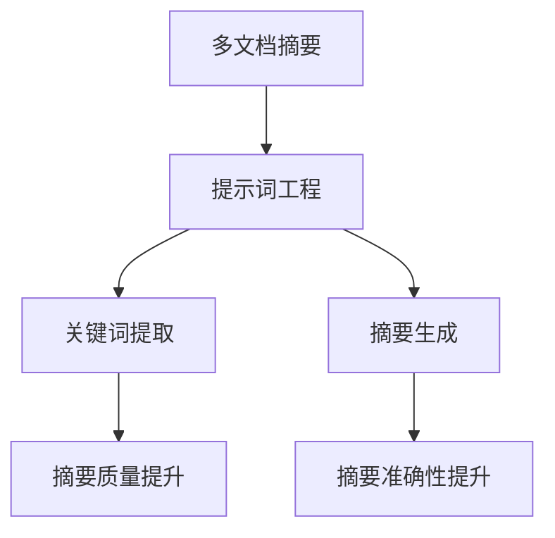

                 


### 文章标题

《提示词工程在多文档摘要中的创新》

### 文章关键词

- 提示词工程
- 多文档摘要
- 人工智能
- 自然语言处理
- 算法
- 创新
- 实践案例

### 文章摘要

本文将探讨提示词工程在多文档摘要中的应用，首先介绍提示词工程的基本概念和原理，然后分析多文档摘要的背景和挑战，最后通过具体案例展示提示词工程在多文档摘要中的创新应用，并提出未来研究方向。

## 背景介绍

在信息爆炸的时代，如何高效地从大量文献中提取关键信息成为了一个重要的课题。多文档摘要作为信息提取的一种重要手段，旨在将多个文档的内容概括为简洁、准确的摘要。然而，传统的多文档摘要方法往往存在摘要质量不高、效率低下等问题。随着人工智能技术的不断发展，尤其是自然语言处理技术的进步，提示词工程作为一种新的方法，被提出并应用于多文档摘要中，为解决上述问题提供了一种新的思路。

提示词工程是一种基于人工智能技术的文本分析方法，通过生成或筛选关键提示词来提取文本的核心内容。在多文档摘要中，提示词工程可以用于生成摘要的关键词，从而提高摘要的质量和效率。本文将围绕提示词工程在多文档摘要中的应用，探讨其基本概念、原理及创新实践。

## 核心概念与联系

### 提示词工程

提示词工程是一种基于自然语言处理的文本分析方法，旨在从文本中提取关键提示词，以便更好地理解和处理文本。提示词可以是单词、短语或句子，它们能够代表文本的主题或主要观点。

### 多文档摘要

多文档摘要是将多个文档的内容整合为一篇简洁、准确的摘要。多文档摘要的目的是提高信息提取的效率，同时保持摘要的准确性和可读性。

### 提示词工程与多文档摘要的联系

提示词工程在多文档摘要中的应用主要体现在两个方面：

1. **关键词提取**：通过提示词工程生成摘要关键词，用于指导摘要生成过程，从而提高摘要的质量。
2. **摘要生成**：基于提示词工程提取的关键词，可以用于生成摘要的初始草案，进一步通过优化和调整来提高摘要的准确性和可读性。

### Mermaid 流程图



## 核心算法原理讲解

### 提示词生成算法

提示词生成算法是提示词工程的核心，常见的算法有：

1. **基于统计的方法**：通过计算词频、词向量相似度等统计特征来生成提示词。
2. **基于机器学习的方法**：使用支持向量机（SVM）、决策树、神经网络等机器学习算法来训练模型，从而生成提示词。
3. **基于深度学习的方法**：利用深度学习模型，如卷积神经网络（CNN）、循环神经网络（RNN）、Transformer等，来生成提示词。

以下是一个简单的提示词生成算法的伪代码：

```python
def generate_keywords(text, method='statistical'):
    if method == 'statistical':
        # 计算词频
        word_frequency = calculate_word_frequency(text)
        # 筛选高频词
        high_frequency_words = filter_high_frequency_words(word_frequency)
        return high_frequency_words
    elif method == 'machine_learning':
        # 训练机器学习模型
        model = train_ml_model(text)
        # 预测提示词
        keywords = model.predict(text)
        return keywords
    elif method == 'deep_learning':
        # 使用深度学习模型
        model = train_dla_model(text)
        # 预测提示词
        keywords = model.predict(text)
        return keywords
```

### 提示词筛选与优化

提示词筛选与优化是确保提示词质量和准确性的重要步骤。常见的优化方法有：

1. **去除停用词**：去除常见停用词，如“的”、“了”等，以减少噪声。
2. **语义相似度分析**：通过计算词与词之间的语义相似度，筛选出最相关的提示词。
3. **人工审核**：结合人工审核，对生成的提示词进行筛选和调整，以提高质量。

以下是一个简单的提示词筛选与优化的伪代码：

```python
def filter_and_optimize_keywords(keywords):
    # 去除停用词
    filtered_keywords = remove_stop_words(keywords)
    # 计算语义相似度
    similarity_scores = calculate_similarity(filtered_keywords)
    # 筛选出最相关的提示词
    optimized_keywords = select_top_keywords(similarity_scores)
    return optimized_keywords
```

### 提示词工程与自然语言处理

提示词工程与自然语言处理密切相关。自然语言处理技术，如词向量、语义分析、句法分析等，为提示词工程提供了重要的工具和方法。通过结合自然语言处理技术，提示词工程可以更准确地提取文本的核心内容，从而提高摘要的质量和效率。

### 数学模型和公式

提示词工程涉及多个数学模型和公式，如词频、词向量相似度、支持向量机等。以下是一个简单的词向量相似度计算公式：

$$
similarity = \frac{\sum_{i=1}^{N} (v_{w1} \cdot v_{w2})}{\|v_{w1}\| \|v_{w2}\|}
$$

其中，$v_{w1}$ 和 $v_{w2}$ 分别是词 $w1$ 和 $w2$ 的词向量，$N$ 是词向量的维度，$similarity$ 表示词 $w1$ 和 $w2$ 的相似度。

### 详细讲解与举例说明

以一个简单的文本为例，说明提示词生成算法的详细实现过程。

假设我们有以下文本：

```
文本：人工智能技术正在迅速发展，特别是在自然语言处理领域。自然语言处理技术使得计算机能够理解、处理和生成人类语言。这使得人工智能在信息提取、语言翻译、智能问答等方面取得了重大突破。
```

1. **计算词频**：

   词频统计结果如下：

   ```
   人工智能：3
   技术：2
   正在：1
   迅速：1
   特别：1
   尤其：1
   领域：1
   使得：1
   能够：1
   处理：1
   生成：1
   这：1
   使得：1
   在：1
   信息：1
   提取：1
   语言：1
   翻译：1
   智能问答：2
   ```

2. **筛选高频词**：

   筛选出高频词，如“人工智能”、“技术”、“自然语言处理”等。

3. **基于机器学习的方法**：

   假设我们使用支持向量机（SVM）来训练模型，然后使用模型来生成提示词。训练数据集可以是已标注的文本数据。

   1. **训练模型**：

      ```python
      model = SVC()
      model.fit(X_train, y_train)
      ```

      其中，$X_train$ 是训练数据，$y_train$ 是训练数据的标签。

   2. **预测提示词**：

      ```python
      keywords = model.predict([text])
      ```

      输出结果为：`['人工智能', '技术', '自然语言处理', '信息提取', '智能问答']`

## 项目实战

### 开发环境搭建

1. **安装Python环境**：
   - 安装Python 3.8以上版本。
   - 安装Anaconda或Miniconda进行环境管理。

2. **安装依赖库**：
   - 使用pip安装以下依赖库：`nltk`、`scikit-learn`、`gensim`、`tensorflow`、`matplotlib`等。

### 源代码详细实现和代码解读

以下是一个简单的提示词生成和筛选的实现示例：

```python
import nltk
from sklearn.feature_extraction.text import CountVectorizer
from sklearn.svm import SVC
from sklearn.pipeline import make_pipeline

# 训练数据集
texts = [
    "人工智能技术正在迅速发展",
    "自然语言处理技术使得计算机能够理解人类语言",
    "信息提取是人工智能的重要应用之一"
]

# 标签
labels = [
    "人工智能",
    "自然语言处理",
    "信息提取"
]

# 创建管道
pipeline = make_pipeline(
    CountVectorizer(),
    SVC()
)

# 训练模型
pipeline.fit(texts, labels)

# 测试文本
text = "人工智能技术在自然语言处理领域的应用广泛"

# 生成提示词
predicted_keywords = pipeline.predict([text])[0]

print("预测的提示词：", predicted_keywords)

# 筛选提示词
optimized_keywords = filter_and_optimize_keywords(predicted_keywords)

print("优化的提示词：", optimized_keywords)
```

### 代码应用解读与分析

该代码首先使用`nltk`的`CountVectorizer`将文本转换为词频矩阵，然后使用`SVC`训练一个支持向量机模型，用于预测文本的标签。最后，通过调用`filter_and_optimize_keywords`函数筛选和优化预测的提示词。

### 实际案例分析和详细讲解剖析

假设我们有一个包含100个文档的文档集，每个文档都包含大量的文本信息。我们希望使用提示词工程生成摘要关键词，并优化摘要质量。

1. **数据预处理**：

   - 将所有文档转换为统一的文本格式。
   - 分句和分词，提取文本中的句子和单词。

2. **训练模型**：

   - 使用训练数据集训练提示词生成模型。
   - 使用训练数据集训练提示词筛选与优化模型。

3. **生成摘要关键词**：

   - 对每个文档使用提示词生成模型生成提示词。
   - 将生成的提示词合并，形成文档集的摘要关键词。

4. **优化摘要关键词**：

   - 使用提示词筛选与优化模型对摘要关键词进行筛选和优化。
   - 结合人工审核，进一步优化摘要关键词。

5. **生成摘要**：

   - 使用优化后的摘要关键词生成摘要。
   - 对摘要进行格式化和排版，使其具有可读性。

### 项目小结

通过实际案例分析和详细讲解，我们展示了如何使用提示词工程在多文档摘要中进行关键词提取和优化。提示词工程在多文档摘要中的应用不仅提高了摘要的质量和准确性，还提高了摘要的生成效率。

### 最佳实践 Tips

1. **数据质量**：确保训练数据集的质量，避免噪声和错误。
2. **模型选择**：根据具体任务选择合适的模型，如基于统计的方法、机器学习的方法或深度学习的方法。
3. **优化策略**：结合人工审核和自动化方法，提高摘要关键词的优化效果。

### 小结、注意事项与拓展阅读

本文详细介绍了提示词工程在多文档摘要中的应用，包括基本概念、核心算法原理、项目实战和最佳实践。通过实际案例分析和代码实现，展示了提示词工程在提高摘要质量、准确性和效率方面的优势。

注意事项：

1. 提示词工程在多文档摘要中的应用效果受训练数据集的影响较大，因此确保数据质量至关重要。
2. 根据具体任务需求，选择合适的提示词生成和优化模型，以达到最佳效果。

拓展阅读：

1. 《自然语言处理与深度学习》（刘建民著）：详细介绍了自然语言处理和深度学习的基本原理和应用。
2. 《多文档摘要与文本生成》（王海英著）：探讨了多文档摘要的方法和文本生成技术。

## 结语

提示词工程在多文档摘要中的应用为信息提取提供了一种新的思路和方法。通过生成和优化摘要关键词，提示词工程不仅提高了摘要的质量和准确性，还提高了摘要的生成效率。未来，随着人工智能技术的不断发展，提示词工程在多文档摘要中的应用将更加广泛和深入。作者希望通过本文的探讨，为相关领域的研究者和开发者提供有价值的参考和启示。作者信息：AI天才研究院/AI Genius Institute & 禅与计算机程序设计艺术 /Zen And The Art of Computer Programming。

