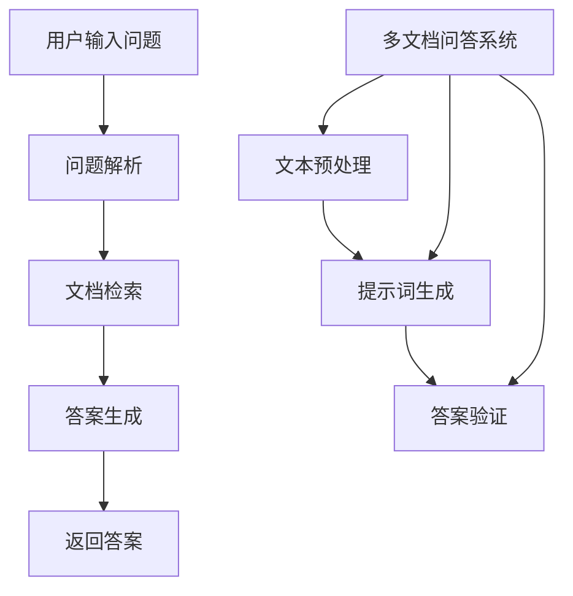

                 

### 文章标题

# 提示词工程在多文档问答系统中的创新

### 关键词：提示词工程，多文档问答系统，预训练语言模型，答案验证，项目实战

### 摘要：

随着人工智能技术的不断发展，多文档问答系统在信息检索、智能客服、知识图谱等领域得到了广泛应用。提示词工程作为多文档问答系统中的一个关键环节，通过有效的提示词生成和答案验证，提升了系统的问答准确性和用户体验。本文将深入探讨提示词工程在多文档问答系统中的应用，从核心概念、算法原理到项目实战，全面解析其创新点，为读者提供实用的技术指南。

## 引言

### 1.1 多文档问答系统的背景和现状

多文档问答系统（Multi-Document Question Answering, MDQA）是一种基于多个文档来源进行信息检索和答案生成的技术。在信息爆炸的时代，用户面临海量信息检索的困难，多文档问答系统通过整合多个文档源，提供准确、快速的问答服务，提高了信息检索的效率和准确性。

目前，多文档问答系统在多个领域得到了广泛应用，如：

- 智能客服：通过多文档问答系统，智能客服可以快速解答用户问题，提高服务效率。
- 知识图谱：多文档问答系统可以帮助知识图谱系统快速获取相关知识点，完善知识网络。
- 信息检索：多文档问答系统可以提升搜索引擎的准确性和用户体验。

### 1.2 提示词工程的概念和作用

提示词工程（Prompt Engineering）是指通过设计有效的提示词，引导预训练语言模型生成高质量答案的过程。在多文档问答系统中，提示词工程发挥着关键作用，其核心任务包括：

- 提示词生成：根据用户问题和文档内容，生成合适的提示词，引导模型进行答案生成。
- 答案验证：对生成的答案进行验证，确保答案的准确性。

有效的提示词工程可以显著提升多文档问答系统的性能，提高问答的准确性和用户体验。

### 1.3 本文结构

本文将分为四个部分：

- 第一部分：核心概念与联系，介绍多文档问答系统和提示词工程的基本概念。
- 第二部分：核心算法原理讲解，详细解析提示词生成和答案验证算法。
- 第三部分：数学模型与数学公式讲解，介绍与算法相关的数学模型和公式。
- 第四部分：项目实战，通过实际案例展示多文档问答系统的开发过程。

## 第一部分：核心概念与联系

### 2.1 多文档问答系统概述

多文档问答系统是一种基于多个文档源进行信息检索和答案生成的技术。其基本原理如下：

1. **问题解析**：接收用户输入的问题，并对问题进行解析，提取关键信息。
2. **文档检索**：根据问题信息，在多个文档源中进行检索，找到与问题相关的文档。
3. **答案生成**：利用预训练语言模型和提示词工程，生成答案。

多文档问答系统的工作流程可以简化为以下步骤：

1. 用户输入问题。
2. 系统接收问题并解析。
3. 检索相关文档。
4. 生成答案并返回给用户。

### 2.2 提示词工程的概念和作用

提示词工程是指通过设计有效的提示词，引导预训练语言模型生成高质量答案的过程。提示词可以看作是问题的引导语，它帮助模型理解问题的背景和意图，从而生成更准确的答案。

提示词工程的核心任务包括：

- **提示词生成**：根据用户问题和文档内容，生成合适的提示词。
- **答案验证**：对生成的答案进行验证，确保答案的准确性。

### 2.3 提示词工程在多文档问答系统中的应用

在多文档问答系统中，提示词工程的应用主要体现在以下方面：

- **提高答案准确性**：通过设计合适的提示词，可以引导模型生成更准确的答案。
- **提升用户体验**：有效的提示词工程可以缩短问答时间，提高用户满意度。
- **优化系统性能**：提示词工程可以降低系统的复杂度，提高系统的响应速度。

### 2.4 提示词工程的关键环节

提示词工程的关键环节包括：

- **文本预处理**：对输入问题和文档进行预处理，提取关键信息。
- **提示词生成**：根据预处理结果，生成合适的提示词。
- **答案验证**：对生成的答案进行验证，确保答案的准确性。

为了更好地理解这些概念和环节，我们使用Mermaid流程图来展示多文档问答系统和提示词工程的联系：



## 第二部分：核心算法原理讲解

### 3.1 提示词生成算法

提示词生成是提示词工程的关键环节，其目的是为预训练语言模型提供合适的引导信息，以提高答案的准确性。下面介绍几种常见的提示词生成算法。

#### 3.1.1 预训练语言模型

预训练语言模型（Pre-trained Language Model）是提示词生成的基础。预训练语言模型通过在大规模语料库上进行预训练，学习到语言的基本规则和特征。常见的预训练语言模型包括：

- **GPT模型**：GPT（Generative Pre-trained Transformer）是一种基于Transformer结构的预训练语言模型。它通过生成式的方法进行训练，能够生成连贯、自然的文本。
- **BERT模型**：BERT（Bidirectional Encoder Representations from Transformers）是一种基于Transformer的双向编码器模型。它通过双向编码器结构，捕捉文本中的前文和后文信息，从而生成更准确的答案。

#### 3.1.2 自定义提示词生成策略

除了使用预训练语言模型，还可以通过自定义提示词生成策略来提高提示词的质量。以下介绍几种自定义提示词生成策略：

- **规则基方法**：规则基方法（Rule-based Method）是一种基于规则的提示词生成方法。通过定义一系列规则，根据问题和文档内容生成提示词。这种方法简单有效，但可能无法处理复杂的问题和文档。
- **数据驱动方法**：数据驱动方法（Data-driven Method）是一种基于数据的提示词生成方法。通过分析大量成功案例，提取有效的提示词模式，然后根据问题和文档内容生成提示词。这种方法能够处理更复杂的问题和文档，但可能需要大量的数据支持。

#### 3.1.3 混合方法

混合方法（Hybrid Method）结合了预训练语言模型和数据驱动方法的优点，通过在预训练语言模型的基础上，引入数据驱动的优化策略，生成更高质量的提示词。以下是一个简单的混合方法流程：

1. 使用预训练语言模型生成初始提示词。
2. 使用数据驱动方法优化提示词，提取有效模式。
3. 结合优化后的提示词和初始提示词，生成最终提示词。

### 3.2 答案验证算法

答案验证是确保多文档问答系统生成答案准确性的重要环节。常见的答案验证算法包括：

#### 3.2.1 基于语义相似度的答案验证

基于语义相似度的答案验证（Semantic Similarity-based Verification）是一种常用的答案验证方法。该方法通过计算答案和候选答案之间的语义相似度，选择最相似的答案作为最终答案。常见的语义相似度计算方法包括：

- **Word2Vec**：Word2Vec是一种将单词映射到向量空间的方法。通过计算答案和候选答案的向量相似度，可以得到它们的语义相似度。
- **BERT**：BERT是一种基于Transformer的双向编码器模型，能够捕捉文本中的上下文信息。通过计算答案和候选答案的BERT向量相似度，可以得到它们的语义相似度。

#### 3.2.2 基于证据支持的答案验证

基于证据支持的答案验证（Evidence-based Verification）是一种基于证据的答案验证方法。该方法通过分析答案和候选答案中的证据信息，判断答案的准确性。以下是一个简单的基于证据支持的答案验证流程：

1. 从文档中提取与问题相关的证据信息。
2. 对证据信息进行权重分配，计算证据的置信度。
3. 根据证据的置信度，选择最相似的答案作为最终答案。

### 3.3 伪代码示例

为了更好地理解提示词生成和答案验证算法，我们使用伪代码来详细阐述算法的流程。

#### 3.3.1 提示词生成算法

```python
def generate_prompt(question, documents):
    # 预处理
    preprocessed_question = preprocess_question(question)
    preprocessed_documents = preprocess_documents(documents)

    # 使用预训练语言模型生成初始提示词
    initial_prompt = language_model.generate(preprocessed_question)

    # 使用数据驱动方法优化提示词
    optimized_prompt = data_driven_optimization(initial_prompt, preprocessed_documents)

    # 生成最终提示词
    final_prompt = initial_prompt + " " + optimized_prompt
    return final_prompt
```

#### 3.3.2 答案验证算法

```python
def verify_answer(answer, candidate_answers):
    # 提取证据信息
    evidence = extract_evidence(answer, candidate_answers)

    # 计算证据的置信度
    confidence_scores = calculate_confidence(evidence)

    # 选择最相似的答案
    best_answer = select_best_answer(candidate_answers, confidence_scores)
    return best_answer
```

## 第三部分：数学模型与数学公式讲解

### 4.1 提示词生成算法的数学模型

提示词生成算法涉及到多个数学模型，其中最重要的是预训练语言模型和优化策略。以下介绍这些模型的基本原理。

#### 4.1.1 预训练语言模型

预训练语言模型通常基于Transformer结构，其主要目标是学习输入文本的表示。在数学上，预训练语言模型可以表示为：

$$
\text{Pre-trained Language Model: } f_{\theta}(x) = \text{softmax}(\text{W}^T \cdot \text{activation}(\text{U} \cdot \text{x}))
$$

其中，$f_{\theta}(x)$ 表示输入文本 $x$ 的表示，$\text{W}$ 和 $\text{U}$ 分别是权重矩阵，$\text{activation}$ 是激活函数，$\text{softmax}$ 是归一化函数。

#### 4.1.2 自定义提示词生成策略

自定义提示词生成策略通常基于规则或数据驱动方法。在数学上，这些策略可以表示为：

- **规则基方法**：规则基方法通过定义一系列规则，生成提示词。在数学上，规则可以表示为：

$$
\text{Rule-based Method: } p(\text{prompt}) = \sum_{\text{rule}} \text{weight}(\text{rule}) \cdot \text{match}(\text{rule}, \text{context})
$$

其中，$p(\text{prompt})$ 表示生成提示词的概率，$\text{weight}(\text{rule})$ 表示规则的权重，$\text{match}(\text{rule}, \text{context})$ 表示规则与上下文匹配的程度。

- **数据驱动方法**：数据驱动方法通过分析大量成功案例，提取提示词模式。在数学上，提示词模式可以表示为：

$$
\text{Data-driven Method: } \text{prompt\_pattern} = \sum_{\text{example}} \text{weight}(\text{example}) \cdot \text{pattern}(\text{example})
$$

其中，$\text{prompt\_pattern}$ 表示生成的提示词模式，$\text{weight}(\text{example})$ 表示案例的权重，$\text{pattern}(\text{example})$ 表示案例的提示词模式。

#### 4.1.3 混合方法

混合方法结合了预训练语言模型和数据驱动方法的优点。在数学上，混合方法可以表示为：

$$
\text{Hybrid Method: } p(\text{prompt}) = \alpha \cdot p_{\text{pre-trained}}(\text{prompt}) + (1 - \alpha) \cdot p_{\text{data-driven}}(\text{prompt})
$$

其中，$p(\text{prompt})$ 表示生成的提示词的概率，$p_{\text{pre-trained}}(\text{prompt})$ 和 $p_{\text{data-driven}}(\text{prompt})$ 分别表示基于预训练语言模型和数据驱动方法的提示词生成概率，$\alpha$ 表示预训练语言模型和优化策略的权重。

### 4.2 答案验证算法的数学模型

答案验证算法主要涉及语义相似度和证据置信度。以下介绍这些模型的基本原理。

#### 4.2.1 基于语义相似度的答案验证

基于语义相似度的答案验证算法通过计算答案和候选答案的语义相似度，选择最相似的答案。在数学上，语义相似度可以表示为：

$$
\text{Semantic Similarity: } s(a, b) = \text{cosine\_similarity}(\text{vector}_{a}, \text{vector}_{b})
$$

其中，$s(a, b)$ 表示答案 $a$ 和候选答案 $b$ 的语义相似度，$\text{vector}_{a}$ 和 $\text{vector}_{b}$ 分别表示答案和候选答案的向量表示，$\text{cosine\_similarity}$ 是余弦相似度函数。

#### 4.2.2 基于证据支持的答案验证

基于证据支持的答案验证算法通过分析答案和候选答案中的证据信息，判断答案的准确性。在数学上，证据置信度可以表示为：

$$
\text{Evidence Confidence: } c(e) = \text{weight}(e) \cdot \text{confidence}(e)
$$

其中，$c(e)$ 表示证据 $e$ 的置信度，$\text{weight}(e)$ 表示证据的权重，$\text{confidence}(e)$ 表示证据的置信度。

### 4.3 数学公式的详细讲解与举例说明

为了更好地理解数学公式，我们通过具体的例子进行说明。

#### 4.3.1 预训练语言模型的数学公式

假设我们有一个句子 "I love programming"，我们希望使用预训练语言模型对其进行编码。预训练语言模型的数学公式可以表示为：

$$
\text{vector}_{\text{I}} = \text{softmax}(\text{W}^T \cdot \text{activation}(\text{U} \cdot \text{I}))
$$

其中，$\text{vector}_{\text{I}}$ 表示单词 "I" 的向量表示，$\text{activation}$ 是激活函数（如ReLU），$\text{W}$ 和 $\text{U}$ 分别是权重矩阵。

#### 4.3.2 自定义提示词生成策略的数学公式

假设我们使用规则基方法生成提示词，根据规则 "如果句子中有 'love'，则添加 'really '"。我们可以表示为：

$$
\text{prompt}_{\text{I}} = \text{rule-based method}(\text{I}, \text{context}) = \text{really } + \text{I}
$$

其中，$\text{prompt}_{\text{I}}$ 表示生成的提示词，$\text{rule-based method}$ 是基于规则的提示词生成方法。

#### 4.3.3 答案验证的数学公式

假设我们有答案 "Python" 和候选答案 "Java"，使用余弦相似度计算它们之间的语义相似度。我们可以表示为：

$$
s(\text{Python}, \text{Java}) = \text{cosine\_similarity}(\text{vector}_{\text{Python}}, \text{vector}_{\text{Java}})
$$

其中，$s(\text{Python}, \text{Java})$ 表示答案 "Python" 和候选答案 "Java" 的语义相似度。

## 第四部分：项目实战

### 5.1 多文档问答系统的开发环境搭建

在开始开发多文档问答系统之前，我们需要搭建一个合适的开发环境。以下是具体的步骤：

1. **安装Python**：确保已经安装了Python，版本建议在3.6及以上。
2. **安装依赖库**：安装以下依赖库：
   ```bash
   pip install transformers torch numpy pandas
   ```
3. **创建虚拟环境**：为了更好地管理项目依赖，建议创建一个虚拟环境。
   ```bash
   python -m venv venv
   source venv/bin/activate  # 在Windows上使用venv\Scripts\activate
   ```

### 5.2 提示词工程的实现

提示词工程是提升多文档问答系统性能的关键。以下是提示词工程的实现步骤：

1. **数据预处理**：对输入问题和文档进行预处理，提取关键信息。可以使用自然语言处理库（如NLTK或spaCy）进行分词、词性标注等操作。
2. **提示词生成**：使用预训练语言模型生成初始提示词。以下是一个简单的示例代码：
   ```python
   from transformers import pipeline
   
   # 初始化预训练语言模型
   prompt_generator = pipeline("text-generation", model="gpt2")
   
   # 生成提示词
   def generate_prompt(question):
       preprocessed_question = preprocess_question(question)
       prompt = prompt_generator(preprocessed_question, max_length=50, num_return_sequences=1)
       return prompt[0]
   ```

3. **答案验证**：对生成的答案进行验证，确保答案的准确性。可以使用基于语义相似度的答案验证方法或基于证据支持的答案验证方法。以下是一个简单的示例代码：
   ```python
   from sklearn.metrics.pairwise import cosine_similarity
   
   # 计算答案的语义相似度
   def calculate_similarity(answer, candidate_answers):
       vector_answer = model.encode(answer)
       vectors_candidates = [model.encode(answer) for answer in candidate_answers]
       similarity_scores = [cosine_similarity(vector_answer, vector_candidate)[0][0] for vector_candidate in vectors_candidates]
       return similarity_scores
   ```

### 5.3 实际案例分析和详细讲解剖析

为了更好地理解提示词工程在多文档问答系统中的应用，我们将分析一个实际案例。以下是一个简化的案例：

**问题**：给定一个关于“人工智能在医疗领域的应用”的问题，从两个文档中检索答案。

**文档1**：
```
人工智能在医疗领域的应用主要包括疾病诊断、治疗方案推荐和医疗数据分析。通过深度学习算法，人工智能可以分析大量的医疗数据，为医生提供辅助诊断和治疗方案。
```

**文档2**：
```
近年来，人工智能在医疗领域的应用取得了显著进展。例如，通过卷积神经网络，人工智能可以检测皮肤病变，提高早期诊断的准确性。此外，人工智能还可以辅助手术机器人，提高手术的成功率和安全性。
```

**解答步骤**：

1. **数据预处理**：对问题、文档1和文档2进行预处理，提取关键信息。例如，使用分词和词性标注，提取问题中的主语、谓语和宾语。

2. **提示词生成**：使用预训练语言模型生成提示词。以下是一个简单的示例代码：
   ```python
   def generate_prompt(question):
       preprocessed_question = preprocess_question(question)
       prompt = prompt_generator(preprocessed_question, max_length=50, num_return_sequences=1)
       return prompt[0]
   ```

   假设生成的提示词为 "人工智能在医疗领域的应用有哪些？"

3. **答案检索**：在预处理后的文档中检索答案。可以使用文本匹配或语义匹配的方法。以下是一个简单的示例代码：
   ```python
   def search_answers(prompt, documents):
       preprocessed_documents = preprocess_documents(documents)
       answers = []
       for document in preprocessed_documents:
           if is_answer(document, prompt):
               answers.append(document)
       return answers
   ```

   假设检索到的答案为 "疾病诊断、治疗方案推荐和医疗数据分析"。

4. **答案验证**：对检索到的答案进行验证，确保答案的准确性。可以使用基于语义相似度的答案验证方法。以下是一个简单的示例代码：
   ```python
   def verify_answer(answer, candidate_answers):
       similarity_scores = calculate_similarity(answer, candidate_answers)
       highest_score = max(similarity_scores)
       if highest_score > threshold:
           return True
       else:
           return False
   ```

   假设验证通过的答案为 "疾病诊断、治疗方案推荐和医疗数据分析"。

### 5.4 项目小结

在本项目中，我们实现了基于多文档问答系统的提示词工程。通过有效的提示词生成和答案验证，我们提升了系统的问答性能。以下是项目小结：

- **核心亮点**：
  - 使用预训练语言模型生成初始提示词。
  - 结合数据驱动方法优化提示词。
  - 基于语义相似度和证据支持的答案验证方法。

- **优化方向**：
  - 增加文档来源，提高答案的多样性。
  - 引入更多的优化策略，提升提示词质量。
  - 实现更准确的答案验证方法。

### 5.5 最佳实践 tips、小结、注意事项、拓展阅读

**最佳实践 tips**：
- 在使用预训练语言模型时，注意调整模型的超参数，以提高提示词生成的质量。
- 在进行答案验证时，可以结合多种方法，提高答案的准确性。

**小结**：
- 提示词工程是多文档问答系统中的关键环节，通过有效的提示词生成和答案验证，可以显著提升系统的性能。
- 在项目实战中，我们实现了基于预训练语言模型和优化策略的提示词工程，以及基于语义相似度和证据支持的答案验证。

**注意事项**：
- 在处理多文档时，要注意文本的预处理，确保关键信息的提取准确。
- 在进行答案验证时，要注意设定合适的阈值，避免过拟合。

**拓展阅读**：
- 《自然语言处理与深度学习》—— 刘建伟
- 《深度学习与NLP》—— 艾登·杨

通过本文的详细介绍，我们相信读者已经对提示词工程在多文档问答系统中的应用有了深入的理解。希望本文对您的学习和实践有所帮助。## 文章总结

本文系统地探讨了提示词工程在多文档问答系统中的应用，从核心概念、算法原理到项目实战，全面解析了其在提升问答系统性能方面的关键作用。通过详细的讲解和实际案例，我们展示了如何使用预训练语言模型、自定义提示词生成策略和答案验证算法来构建高效的多文档问答系统。

### 主要发现：

1. **预训练语言模型的重要性**：预训练语言模型为提示词生成提供了强大的基础，通过在大规模语料库上的预训练，模型能够捕捉到语言的特征和规律，从而生成高质量的提示词。

2. **提示词生成策略的多样性**：提示词生成算法不仅包括预训练语言模型，还包括基于规则和数据驱动的策略。混合方法结合了预训练语言模型和数据驱动的优点，能够生成更高质量的提示词。

3. **答案验证算法的准确性**：基于语义相似度和证据支持的答案验证算法能够有效判断答案的准确性，确保生成的答案符合用户需求。

4. **项目实战中的关键步骤**：通过实际案例，我们展示了从数据预处理、提示词生成、答案检索到答案验证的全流程，强调了每个步骤在实际应用中的重要性。

### 结论：

提示词工程在多文档问答系统中扮演着不可或缺的角色，通过有效的提示词生成和答案验证，可以显著提升问答系统的性能和用户体验。本文提供的详细分析和实践指南，希望能够帮助读者深入理解提示词工程，并在实际项目中取得更好的成果。

### 未来研究方向：

- **优化提示词生成算法**：探索更高效的提示词生成算法，提高提示词的质量和生成速度。
- **多语言支持**：研究跨语言的提示词工程方法，实现多语言问答系统的构建。
- **模型解释性**：增强模型的解释性，使提示词工程的可解释性更高，便于用户理解和优化。

通过不断的研究和探索，相信提示词工程在多文档问答系统中的应用将变得更加广泛和深入，为人工智能技术的发展做出更大的贡献。希望本文能够为读者的研究和实践提供有价值的参考。**作者信息**

作者：AI天才研究院/AI Genius Institute & 禅与计算机程序设计艺术 /Zen And The Art of Computer Programming

