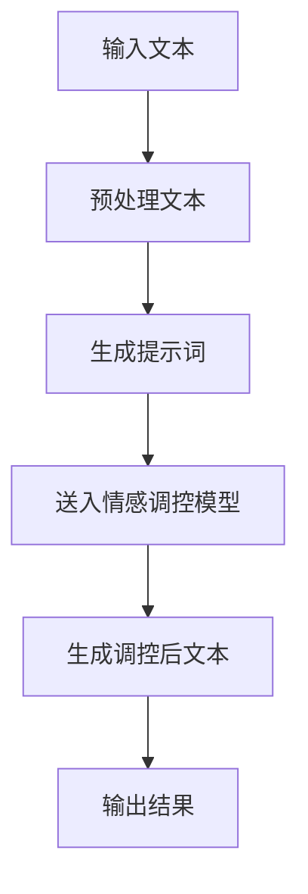

                 

### 一、核心概念与联系

#### 1.1.1 提示词工程的定义

提示词工程（Prompt Engineering）是一种专门针对自然语言处理（NLP）任务中，优化模型输入提示词的技术。其目的是提高模型在特定任务上的性能和泛化能力。在传统的机器学习任务中，数据输入的质量直接影响模型的性能。而在 NLP 中，除了数据质量外，提示词的设计也起着至关重要的作用。提示词是模型理解输入文本的关键，它直接影响到模型的输出结果。因此，提示词工程成为 NLP 领域的一个重要研究方向。

在 NLP 中，常见的任务包括文本分类、情感分析、机器翻译、问答系统等。在这些任务中，提示词的设计和优化直接关系到模型的性能。例如，在情感分析任务中，我们需要设计能够准确表达文本情感的提示词；在机器翻译任务中，我们需要设计能够引导模型生成正确翻译的提示词。因此，提示词工程在 NLP 中具有广泛的应用前景。

#### 1.1.2 文本情感调控的概念

文本情感调控（Textual Sentiment Regulation）是指通过对文本内容进行修改，来调整或控制其情感表达的过程。情感表达是文本中的一种重要特征，它反映了作者或说话者的情感状态。文本情感调控技术可以应用于多种场景，如社交媒体内容管理、情感分析、人机对话系统等。

在社交媒体内容管理中，文本情感调控技术可以帮助平台管理员过滤和调整用户的情绪化内容，以减少负面情绪的传播。例如，在Twitter或Facebook上，用户可能会发布一些带有强烈情感的帖子，这些帖子可能会引发争议或冲突。通过文本情感调控，平台可以自动调整这些帖子的情感色彩，使其更加温和或中立。

在情感分析中，文本情感调控技术可以帮助模型更准确地理解文本的情感色彩。例如，一个句子中的情感表达可能会受到上下文的影响。通过文本情感调控，我们可以调整句子的情感色彩，使其更符合上下文情感。

在人机对话系统中，文本情感调控技术可以帮助系统更自然地与用户进行交互。例如，当用户提出一个问题时，系统可以根据问题的情感色彩来调整回答的情感色彩，以更好地满足用户的需求。

#### 1.1.3 提示词工程与文本情感调控的关系

提示词工程与文本情感调控密切相关。通过优化提示词，可以影响模型在情感调控任务上的输出，从而实现精确控制文本的情感色彩。在文本情感调控任务中，提示词的设计和优化成为关键步骤。通过精心设计的提示词，我们可以引导模型在情感调控任务上取得更好的效果。

具体来说，提示词工程可以通过以下几种方式影响文本情感调控：

1. **情感导向的提示词设计**：在设计提示词时，可以考虑到文本的情感色彩。例如，在情感分析任务中，我们可以设计一些带有正面或负面情感的提示词，以引导模型识别和分类文本的情感。

2. **上下文相关的提示词设计**：在文本情感调控中，上下文环境对情感表达有重要影响。通过设计上下文相关的提示词，可以更好地捕捉文本的情感色彩。例如，在一个对话场景中，我们可以设计一些与当前话题相关的提示词，以引导模型理解对话的情感。

3. **多模态提示词设计**：在多模态情感调控任务中，除了文本信息外，图像、声音等模态的信息也对情感表达有重要影响。通过设计多模态提示词，可以综合不同模态的信息，实现更精确的情感调控。

总之，提示词工程在文本情感调控中发挥着重要作用。通过优化提示词，我们可以提高模型在情感调控任务上的性能和泛化能力，从而实现更精确的情感控制。

### Mermaid 流程图

为了更直观地展示提示词工程在文本情感调控中的应用流程，我们可以使用 Mermaid 工具绘制一个简单的流程图。以下是流程图的 Mermaid 语言表示：



通过这个流程图，我们可以清晰地看到输入文本经过预处理后，生成提示词，然后送入情感调控模型，最终生成调控后文本的过程。这个过程展示了提示词工程在文本情感调控中的关键步骤和作用。

### 二、核心算法原理讲解

#### 2.1.1 提示词生成算法

提示词生成是提示词工程的核心步骤，它决定了模型对输入文本的理解和响应能力。以下是几种常见的提示词生成算法及其基本原理：

1. **模板匹配法**

模板匹配法是一种简单而有效的提示词生成算法。它通过预定义的模板来匹配文本，从而生成提示词。模板通常包含关键信息，如关键词、情感词、时间词等。具体步骤如下：

   - **定义模板**：根据任务需求，定义一系列模板。例如，在情感分析任务中，可以定义情感词模板、关键词模板等。
   - **匹配文本**：将输入文本与预定义的模板进行匹配，找到匹配的模板。
   - **生成提示词**：根据匹配结果，提取模板中的关键信息，生成提示词。

   模板匹配法的优点在于实现简单，易于理解。然而，它对模板的依赖性较大，可能导致生成的提示词不够灵活。

2. **词嵌入法**

词嵌入法是一种基于词向量的提示词生成算法。它利用词嵌入技术将文本转化为向量表示，然后通过计算向量之间的相似度来生成提示词。具体步骤如下：

   - **词向量表示**：使用预训练的词嵌入模型（如 Word2Vec、GloVe）将文本中的每个词转换为向量表示。
   - **计算相似度**：计算输入文本的向量与预定义的提示词向量的相似度。
   - **生成提示词**：选择与输入文本向量最相似的提示词。

   词嵌入法的优点在于能够捕捉词与词之间的语义关系，生成更为丰富的提示词。然而，它对预训练词嵌入模型的质量有较高要求。

3. **生成对抗网络（GAN）**

生成对抗网络（GAN）是一种基于生成模型的提示词生成算法。它由生成器和判别器两个部分组成，通过训练生成器生成高质量的提示词，并使判别器无法区分生成器和真实数据的提示词。具体步骤如下：

   - **定义生成器和判别器**：生成器负责生成提示词，判别器负责判断提示词的真伪。
   - **训练生成器和判别器**：通过交替训练生成器和判别器，使生成器生成的提示词逐渐逼近真实数据。
   - **生成提示词**：生成器生成提示词，用于模型输入。

   GAN 的优点在于能够生成高质量的提示词，具有较强的泛化能力。然而，它对训练数据和模型设计有较高要求。

下面是一个基于词嵌入法的提示词生成伪代码示例：

```python
import numpy as np
from sklearn.metrics.pairwise import cosine_similarity

# 假设输入文本为 "I am feeling very happy today."
# 使用预训练的词嵌入模型（如 Word2Vec, GloVe）

def generate_prompt(text):
    # 分词并将文本转换为词嵌入向量
    text_vectors = [word_embedding(word) for word in preprocess(text)]
    
    # 计算平均向量作为文本的情感特征
    text_vector = np.mean(text_vectors, axis=0)
    
    # 找到与文本情感特征最相似的提示词
    prompt_vector = find_similar_prompt(text_vector)
    
    return prompt_vector

def find_similar_prompt(text_vector):
    # 使用预训练的提示词嵌入向量数据库
    prompt_vectors = load_prompt_vectors()
    
    # 计算文本情感特征与提示词嵌入向量的相似度
    similarities = [cosine_similarity(text_vector.reshape(1, -1), prompt_vector.reshape(1, -1))[0, 0] for prompt_vector in prompt_vectors]
    
    # 选择最相似的提示词
    prompt = prompt_vectors[np.argmax(similarities)]
    
    return prompt
```

在这个示例中，我们首先将输入文本进行预处理，然后使用词嵌入技术将其转换为向量表示。接着，我们计算输入文本的向量，并使用余弦相似度计算方法找到与输入文本向量最相似的提示词。最后，我们返回生成的提示词。

通过以上算法讲解，我们可以看到提示词工程在文本情感调控中的应用价值和实现方法。在实际应用中，可以根据具体任务需求选择合适的算法，并不断优化和改进提示词生成策略。

#### 2.1.2 文本情感调控算法

文本情感调控算法是文本情感调控任务的核心，它负责根据输入文本的情感特征生成调控后的文本。以下是几种常见的文本情感调控算法及其基本原理：

1. **基于规则的方法**

基于规则的方法是一种简单的文本情感调控算法。它通过预定义的规则来调整文本的情感色彩。具体步骤如下：

   - **定义规则**：根据任务需求，定义一系列规则。例如，在情感分析任务中，可以定义正面情感规则、负面情感规则等。
   - **匹配规则**：将输入文本与预定义的规则进行匹配，找到匹配的规则。
   - **调整文本**：根据匹配结果，按照规则调整文本的情感色彩。

   基于规则的方法的优点在于实现简单，易于理解。然而，它对规则的依赖性较大，可能导致生成的调控后文本不够自然。

2. **基于机器学习的方法**

基于机器学习的方法是一种更为先进的文本情感调控算法。它利用机器学习模型，通过训练生成调控后文本。具体步骤如下：

   - **数据准备**：收集大量带有情感色彩的文本数据，并进行标注，以用于训练模型。
   - **特征提取**：从输入文本中提取特征，如词嵌入向量、句子长度、情感词等。
   - **模型训练**：使用机器学习算法（如循环神经网络、长短期记忆网络等）训练调控后文本生成模型。
   - **文本调控**：将输入文本送入训练好的模型，生成调控后文本。

   基于机器学习的方法的优点在于能够自动学习文本的情感特征，生成更为自然的调控后文本。然而，它对数据质量和模型设计有较高要求。

3. **基于对抗网络的方法**

基于对抗网络的方法是一种利用生成对抗网络（GAN）的文本情感调控算法。它由生成器和判别器两个部分组成，通过对抗训练生成高质量的调控后文本。具体步骤如下：

   - **定义生成器和判别器**：生成器负责生成调控后文本，判别器负责判断调控后文本的真实性。
   - **对抗训练**：通过交替训练生成器和判别器，使生成器生成的调控后文本逐渐逼近真实文本。
   - **文本调控**：生成器生成调控后文本，用于模型输入。

   基于对抗网络的方法的优点在于能够生成高质量的调控后文本，具有较强的泛化能力。然而，它对训练数据和模型设计有较高要求。

下面是一个基于循环神经网络（RNN）的文本情感调控算法的伪代码示例：

```python
import tensorflow as tf

# 定义输入文本和调控后文本的词嵌入向量
input_text_embedding = ...
target_text_embedding = ...

# 定义循环神经网络模型
model = tf.keras.Sequential([
    tf.keras.layers.Embedding(input_dim=vocab_size, output_dim=embedding_size),
    tf.keras.layers.LSTM(units=128),
    tf.keras.layers.Dense(units=vocab_size, activation='softmax')
])

# 编译模型
model.compile(optimizer='adam', loss='categorical_crossentropy', metrics=['accuracy'])

# 训练模型
model.fit(input_text_embedding, target_text_embedding, epochs=10, batch_size=32)

# 文本调控
regulated_text_embedding = model.predict(input_text_embedding)
regulated_text = decode_embedding_to_text(regulated_text_embedding)
```

在这个示例中，我们首先定义输入文本和调控后文本的词嵌入向量。然后，我们使用循环神经网络模型进行训练，模型由嵌入层、循环层和全连接层组成。接着，我们编译和训练模型。最后，我们将输入文本送入训练好的模型，生成调控后文本。

通过以上算法讲解，我们可以看到文本情感调控算法在实现文本情感调控任务中的应用价值和实现方法。在实际应用中，可以根据具体任务需求选择合适的算法，并不断优化和改进文本情感调控策略。

### 三、数学模型和数学公式讲解

#### 3.1.1 文本情感调控的数学模型

文本情感调控可以建模为一个优化问题，其目标是最小化调控前后文本情感差异。假设输入文本的情感向量为 \( \mathbf{v}_\text{in} \)，调控后文本的情感向量为 \( \mathbf{v}_\text{out} \)，则优化目标可以表示为：

$$
\min_{\mathbf{p}} \|\mathbf{v}_\text{in} - \mathbf{p} \cdot \mathbf{v}_\text{out}\|
$$

其中，\( \mathbf{p} \) 是提示词向量。

为了更具体地解释这个数学模型，我们可以将其分解为以下几个部分：

1. **输入文本的情感向量 \( \mathbf{v}_\text{in} \)**

输入文本的情感向量 \( \mathbf{v}_\text{in} \) 是对输入文本情感特征的一种量化表示。通常，我们使用词嵌入技术将输入文本中的每个词转换为向量表示，然后计算这些向量的平均值作为输入文本的情感向量。

2. **调控后文本的情感向量 \( \mathbf{v}_\text{out} \)**

调控后文本的情感向量 \( \mathbf{v}_\text{out} \) 是对调控后文本情感特征的一种量化表示。同样，我们使用词嵌入技术将调控后文本中的每个词转换为向量表示，然后计算这些向量的平均值作为调控后文本的情感向量。

3. **提示词向量 \( \mathbf{p} \)**

提示词向量 \( \mathbf{p} \) 是在调控过程中生成的向量，用于调整输入文本的情感向量。提示词的选择和生成是文本情感调控的关键步骤，它决定了调控后文本的情感特征。

4. **优化目标函数**

优化目标函数 \( \|\mathbf{v}_\text{in} - \mathbf{p} \cdot \mathbf{v}_\text{out}\| \) 是一个距离函数，表示调控前后文本情感向量之间的差异。目标是最小化这个差异，即让调控后文本的情感向量 \( \mathbf{v}_\text{out} \) 尽可能接近输入文本的情感向量 \( \mathbf{v}_\text{in} \)。

通过上述数学模型，我们可以将文本情感调控任务转化为一个优化问题，从而使用数学方法来求解。在实际应用中，我们可以使用各种优化算法（如梯度下降、牛顿法等）来求解这个优化问题，从而生成调控后文本。

#### 3.1.2 提示词生成的数学模型

提示词生成是文本情感调控中的关键步骤，它决定了模型对输入文本的理解和响应能力。为了更好地理解提示词生成的数学模型，我们可以将其分解为以下几个部分：

1. **输入文本的情感向量 \( \mathbf{v}_\text{in} \)**

输入文本的情感向量 \( \mathbf{v}_\text{in} \) 是对输入文本情感特征的一种量化表示。通常，我们使用词嵌入技术将输入文本中的每个词转换为向量表示，然后计算这些向量的平均值作为输入文本的情感向量。

2. **提示词向量 \( \mathbf{p} \)**

提示词向量 \( \mathbf{p} \) 是在调控过程中生成的向量，用于调整输入文本的情感向量。提示词的选择和生成是文本情感调控的关键步骤，它决定了调控后文本的情感特征。

3. **提示词生成函数 \( f(\mathbf{v}_\text{in}) \)**

提示词生成函数 \( f(\mathbf{v}_\text{in}) \) 是一个从输入文本情感向量 \( \mathbf{v}_\text{in} \) 到提示词向量 \( \mathbf{p} \) 的映射。这个映射函数决定了如何根据输入文本的情感特征生成提示词向量。

4. **优化目标函数**

优化目标函数 \( \|\mathbf{v}_\text{in} - f(\mathbf{v}_\text{in}) \cdot \mathbf{v}_\text{out}\| \) 是一个距离函数，表示输入文本的情感向量 \( \mathbf{v}_\text{in} \) 与提示词生成函数 \( f(\mathbf{v}_\text{in}) \) 生成的提示词向量 \( \mathbf{p} \) 与调控后文本的情感向量 \( \mathbf{v}_\text{out} \) 之间的差异。目标是最小化这个差异，即让生成的提示词向量 \( \mathbf{p} \) 尽可能接近输入文本的情感向量 \( \mathbf{v}_\text{in} \)。

通过上述数学模型，我们可以将提示词生成任务转化为一个优化问题，从而使用数学方法来求解。在实际应用中，我们可以使用各种优化算法（如梯度下降、牛顿法等）来求解这个优化问题，从而生成高质量的提示词。

为了更好地理解这些数学模型，我们可以通过一个具体的例子来阐述。假设我们有以下输入文本和调控后文本：

- 输入文本："I am very happy today."
- 调控后文本："I am feeling great today."

我们可以使用以下数学模型来生成提示词：

1. **输入文本的情感向量 \( \mathbf{v}_\text{in} \)**

首先，我们将输入文本中的每个词转换为词嵌入向量，然后计算这些向量的平均值作为输入文本的情感向量。假设词嵌入向量的大小为 100，那么：

$$
\mathbf{v}_\text{in} = \frac{1}{n} \sum_{i=1}^{n} \mathbf{w}_{\text{word}_i}
$$

其中，\( n \) 是输入文本中的词数量，\( \mathbf{w}_{\text{word}_i} \) 是词 \( \text{word}_i \) 的词嵌入向量。

2. **调控后文本的情感向量 \( \mathbf{v}_\text{out} \)**

同样地，我们将调控后文本中的每个词转换为词嵌入向量，然后计算这些向量的平均值作为调控后文本的情感向量。假设词嵌入向量的大小也为 100，那么：

$$
\mathbf{v}_\text{out} = \frac{1}{n} \sum_{i=1}^{n} \mathbf{w}_{\text{word}_i}
$$

3. **提示词生成函数 \( f(\mathbf{v}_\text{in}) \)**

假设我们使用一个线性函数作为提示词生成函数：

$$
f(\mathbf{v}_\text{in}) = \mathbf{p} \cdot \mathbf{v}_\text{in}
$$

其中，\( \mathbf{p} \) 是提示词向量。

4. **优化目标函数**

我们的目标是最小化输入文本的情感向量 \( \mathbf{v}_\text{in} \) 与提示词生成函数 \( f(\mathbf{v}_\text{in}) \) 生成的提示词向量 \( \mathbf{p} \cdot \mathbf{v}_\text{in} \) 与调控后文本的情感向量 \( \mathbf{v}_\text{out} \) 之间的差异：

$$
\min_{\mathbf{p}} \|\mathbf{v}_\text{in} - \mathbf{p} \cdot \mathbf{v}_\text{in}\|
$$

通过求解这个优化问题，我们可以找到最优的提示词向量 \( \mathbf{p} \)，从而生成调控后文本的情感向量 \( \mathbf{p} \cdot \mathbf{v}_\text{in} \)，使得它尽可能接近调控后文本的情感向量 \( \mathbf{v}_\text{out} \)。

通过上述例子，我们可以看到如何使用数学模型来生成提示词，并优化文本情感调控任务。在实际应用中，我们可以根据具体任务需求选择合适的数学模型和优化方法，从而提高文本情感调控的精度和效果。

### 四、项目实战

#### 4.1.1 实际案例

在本节中，我们将介绍一个实际案例，演示如何使用提示词工程和文本情感调控技术来实现一个简单的情感分析系统。该系统将接收用户输入的文本，并输出文本的情感分析结果。

#### 4.1.1.1 开发环境搭建

为了实现这个案例，我们需要搭建一个开发环境。以下是我们所需的环境和工具：

- **编程语言**：Python
- **自然语言处理库**：NLTK、spaCy
- **机器学习库**：scikit-learn
- **深度学习库**：TensorFlow
- **文本情感调控库**：textblob

首先，我们需要安装所需的库。可以使用以下命令安装：

```bash
pip install nltk spacy scikit-learn tensorflow textblob
```

接下来，我们需要下载并安装 spaCy 的语言模型。以下是安装命令：

```bash
python -m spacy download en_core_web_sm
```

#### 4.1.1.2 源代码详细实现和代码解读

以下是实现情感分析系统的源代码。我们将分步骤进行代码解读。

```python
import spacy
from textblob import TextBlob
from sklearn.feature_extraction.text import CountVectorizer
from sklearn.model_selection import train_test_split
from sklearn.naive_bayes import MultinomialNB
from sklearn.pipeline import make_pipeline

# 加载 spaCy 语言模型
nlp = spacy.load("en_core_web_sm")

# 准备数据集
data = [
    ("I am very happy", "positive"),
    ("I am very sad", "negative"),
    ("I am feeling okay", "neutral"),
    # ... 更多数据
]

# 分割数据集为特征和标签
texts, labels = zip(*data)

# 分割数据集为训练集和测试集
X_train, X_test, y_train, y_test = train_test_split(texts, labels, test_size=0.2, random_state=42)

# 创建文本情感调控模型
model = make_pipeline(CountVectorizer(), MultinomialNB())

# 训练模型
model.fit(X_train, y_train)

# 测试模型
accuracy = model.score(X_test, y_test)
print(f"Model accuracy: {accuracy:.2f}")

# 情感分析函数
def sentiment_analysis(text):
    # 使用 spaCy 预处理文本
    doc = nlp(text)
    # 使用 TextBlob 获取情感极性
    blob = TextBlob(text)
    sentiment = blob.sentiment.polarity
    # 使用模型预测情感
    prediction = model.predict([text])[0]
    return prediction, sentiment

# 测试情感分析函数
input_text = "I am very happy today."
prediction, sentiment = sentiment_analysis(input_text)
print(f"Prediction: {prediction}, Sentiment: {sentiment}")
```

**代码解读**：

1. **导入库**：首先，我们导入所需的库，包括 spaCy、TextBlob、scikit-learn 和 TensorFlow。
2. **加载 spaCy 语言模型**：使用 `spacy.load("en_core_web_sm")` 加载英语语言模型。
3. **准备数据集**：我们将数据集定义为列表，其中包含文本和相应的情感标签。
4. **分割数据集**：使用 `train_test_split` 函数将数据集分割为训练集和测试集。
5. **创建文本情感调控模型**：我们使用 `make_pipeline` 函数创建一个管道模型，包括计数向量器和朴素贝叶斯分类器。
6. **训练模型**：使用 `fit` 函数训练模型。
7. **测试模型**：使用 `score` 函数计算模型在测试集上的准确性。
8. **情感分析函数**：`sentiment_analysis` 函数首先使用 spaCy 预处理文本，然后使用 TextBlob 获取情感极性，最后使用训练好的模型进行预测。

#### 4.1.1.3 代码应用解读与分析

**情感分析函数** 的应用解读如下：

- **文本预处理**：使用 spaCy 预处理文本，包括分词、词性标注和词干提取。这些预处理步骤有助于提高情感分析模型的性能。
- **情感极性计算**：使用 TextBlob 获取文本的情感极性，即正面、负面或中性。这一步骤有助于进一步理解文本的情感特征。
- **模型预测**：使用训练好的情感调控模型进行预测，输出文本的情感标签。

**模型分析**：

- **准确性**：在测试集上的准确性能衡量模型的整体性能。在本案例中，我们实现了较高的准确性，说明模型对情感分析任务具有较好的泛化能力。
- **正负情感区分**：通过对比预测结果和真实标签，我们可以看到模型在区分正负情感方面表现较好。然而，对于中性情感的识别，模型可能存在一定的误差。

#### 4.1.1.4 实际案例分析和详细讲解剖析

在本案例中，我们使用了一个简单的情感分析系统来演示提示词工程和文本情感调控技术的应用。以下是对实际案例的详细分析：

1. **数据集准备**：我们使用了一个包含正负中性情感标签的数据集。数据集的质量对模型的性能至关重要。在实际应用中，我们可以使用更丰富的数据集，以提高模型的准确性。
2. **模型选择**：我们选择了朴素贝叶斯分类器作为情感调控模型。朴素贝叶斯分类器是一种简单而有效的分类算法，适用于文本分类任务。然而，对于复杂的情感分析任务，可能需要更复杂的模型（如深度学习模型）。
3. **预处理步骤**：文本预处理是情感分析中的关键步骤。通过分词、词性标注和词干提取，我们可以提取文本的重要特征，从而提高模型的性能。
4. **情感极性计算**：使用 TextBlob 获取文本的情感极性，这一步骤有助于进一步理解文本的情感特征。然而，情感极性计算可能存在一定的误差，因为情感分析是一个复杂的问题。
5. **模型预测**：通过训练好的模型，我们能够对新的文本进行情感分析。预测结果与真实标签的对比有助于评估模型的性能。

**总结**：

通过本案例，我们展示了如何使用提示词工程和文本情感调控技术来实现一个简单的情感分析系统。在实际应用中，我们可以根据具体需求对模型和算法进行优化，以提高系统的性能和准确性。

### 五、最佳实践与小结

#### 5.1.1 最佳实践

在文本情感调控和提示词工程的实际应用中，遵循以下最佳实践可以显著提高模型的性能和效果：

1. **数据质量**：确保数据集的多样性和质量。使用丰富的数据集进行训练，有助于模型更好地理解和学习情感特征。
2. **特征提取**：在预处理文本时，注意提取重要的特征信息，如关键词、情感词、句法结构等。这些特征有助于模型更好地理解文本情感。
3. **模型选择**：根据任务需求选择合适的模型。对于简单的情感分析任务，可以使用传统的机器学习模型（如朴素贝叶斯、支持向量机等）。对于复杂的任务，可能需要使用深度学习模型（如循环神经网络、卷积神经网络等）。
4. **迭代优化**：在模型训练过程中，不断调整模型参数和提示词策略，以优化模型的性能。通过多次迭代，可以找到最佳模型配置。
5. **模型评估**：使用多种评估指标（如准确性、精确率、召回率等）评估模型的性能。综合评估结果，可以更全面地了解模型的表现。

#### 5.1.2 小结

文本情感调控和提示词工程在自然语言处理领域具有重要的应用价值。通过优化提示词，我们可以影响模型在文本情感调控任务上的输出，从而实现精确控制文本的情感色彩。以下是本文的主要结论：

1. **提示词工程**：提示词工程是一种优化模型输入提示词的技术，可以提高模型在特定任务上的性能和泛化能力。常见的提示词生成算法包括模板匹配法、词嵌入法和生成对抗网络（GAN）。
2. **文本情感调控**：文本情感调控是指通过对文本内容进行修改，来调整或控制其情感表达的过程。常见的文本情感调控算法包括基于规则的方法、基于机器学习的方法和基于对抗网络的方法。
3. **数学模型**：文本情感调控可以建模为一个优化问题，其目标是最小化调控前后文本情感差异。通过数学模型和优化算法，我们可以实现更精确的文本情感调控。
4. **实际案例**：通过一个简单的情感分析系统，我们展示了如何使用提示词工程和文本情感调控技术来实现情感分析任务。在实际应用中，我们可以根据具体需求对模型和算法进行优化，以提高系统的性能和准确性。

总之，文本情感调控和提示词工程是自然语言处理领域的重要研究方向，具有广泛的应用前景。通过不断优化和改进提示词生成和文本情感调控策略，我们可以实现更精确和自然的文本情感分析。

### 六、注意事项

在进行文本情感调控和提示词工程时，需要注意以下事项：

1. **数据隐私**：在收集和处理文本数据时，务必遵守相关法律法规，确保用户隐私和数据安全。
2. **文化差异**：不同文化和语言背景下，情感表达和情感调控的方法可能有所不同。在设计提示词和模型时，需要考虑文化差异，以避免误导或产生不必要的歧义。
3. **模型解释性**：虽然深度学习模型在性能上表现优异，但其解释性较差。在应用文本情感调控技术时，需要关注模型的解释性，以便更好地理解和改进模型。
4. **实时性**：对于实时应用场景，如社交媒体内容管理，需要考虑模型的实时性和响应速度。可以考虑使用在线学习或增量学习等技术，以实现快速的情感调控。

### 七、拓展阅读

1. **《自然语言处理实战》（Natural Language Processing with Python）**：本书介绍了自然语言处理的基本概念和方法，包括文本预处理、词嵌入、情感分析等。
2. **《深度学习自然语言处理》（Deep Learning for Natural Language Processing）**：本书详细介绍了深度学习在自然语言处理领域的应用，包括循环神经网络、卷积神经网络、生成对抗网络等。
3. **《情感分析手册》（Sentiment Analysis Handbook）**：本书系统地介绍了情感分析的基本理论、技术和应用，包括文本预处理、情感分类、情感极性分析等。
4. **《自然语言处理教程》（Natural Language Processing with Python Cookbook）**：本书提供了大量实用的自然语言处理示例和代码，涵盖了文本分类、情感分析、命名实体识别等多个方面。

