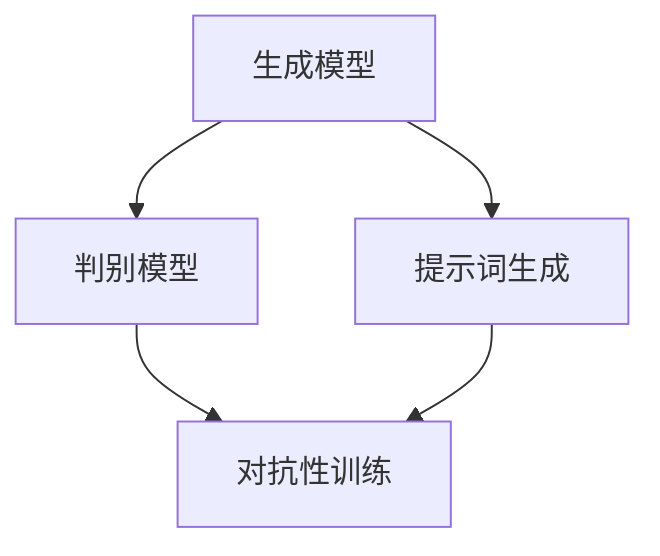

                 


### 设定文章结构和内容

为了撰写一篇高质量的技术博客文章，我们需要先设定文章的结构和内容。以下是文章的总体框架和每部分的具体内容。

#### 引言

**内容**：介绍提示词工程的背景，文本生成控制的现状，以及书籍的目标和预期成果。

**结构**：
1. **1.1 书籍背景与目的**
    - 提示词工程的背景
    - 文本生成控制的现状
    - 书籍的目标和预期成果
2. **1.2 阅读指南**
    - 读者背景要求
    - 阅读建议与策略

#### 核心概念与原理

**内容**：介绍提示词工程的基础，文本生成控制的原理，以及它们之间的联系。

**结构**：
1. **2.1 提示词工程基础**
2. **2.2 文本生成控制原理**
3. **2.3 提示词工程与文本生成控制的联系**
4. **2.4 Mermaid流程图展示**（展示核心概念和联系）

#### 技术进展

**内容**：分析提示词工程的技术进展，包括最新研究成果、核心算法原理、关键挑战和未来发展趋势。

**结构**：
1. **3.1 最新研究成果概述**
2. **3.2 提示词工程核心算法原理**
    - 伪代码讲解
3. **3.3 提示词工程的关键挑战与解决方案**
4. **3.4 未来发展趋势预测**

#### 应用案例

**内容**：介绍提示词工程在自然语言处理、商业写作、教育等领域中的应用案例。

**结构**：
1. **4.1 提示词工程在自然语言处理中的应用**
2. **4.2 提示词工程在商业写作与内容生成的应用**
3. **4.3 提示词工程在教育领域的应用**
4. **4.4 提示词工程在其他领域的应用**

#### 项目实战

**内容**：通过实际项目，展示如何搭建开发环境、实现源代码、解读代码，以及分析实际案例。

**结构**：
1. **5.1 项目实战环境搭建**
2. **5.2 代码实现与分析**
3. **5.3 实际案例分析**
4. **5.4 代码解读与优化**

#### 总结与展望

**内容**：对全书内容进行总结，提出提示词工程的未来发展方向，以及为研究者与开发者提供建议。

**结构**：
1. **6.1 全书总结**
2. **6.2 提示词工程的未来方向**
3. **6.3 研究者与开发者的建议**

#### 参考文献

**内容**：列出文章中引用的参考文献。

**结构**：按照标准格式列出参考文献。

#### 附录

**内容**：提供常见问题解答、提示词工程资源与工具，以及LaTeX数学公式示例。

**结构**：
1. **附录A：常见问题解答**
2. **附录B：提示词工程资源与工具**
3. **附录C：LaTeX数学公式示例**

### 撰写文章

在设定好文章结构和内容后，我们可以按照以下步骤撰写文章：

1. **撰写引言部分**：介绍提示词工程的背景和文本生成控制的现状，明确书籍的目标和预期成果。
2. **撰写核心概念与原理部分**：详细解释提示词工程的基础、文本生成控制的原理，以及它们之间的联系，并使用Mermaid流程图展示核心概念和联系。
3. **撰写技术进展部分**：分析最新研究成果、核心算法原理、关键挑战和未来发展趋势，使用伪代码详细阐述核心算法原理。
4. **撰写应用案例部分**：介绍提示词工程在不同领域中的应用案例。
5. **撰写项目实战部分**：展示实际项目，包括开发环境搭建、代码实现、案例分析以及代码解读。
6. **撰写总结与展望部分**：对全书内容进行总结，提出未来发展方向和建议。
7. **撰写参考文献和附录部分**：列出参考文献和提供常见问题解答、提示词工程资源与工具，以及LaTeX数学公式示例。

通过这样的步骤，我们可以撰写一篇逻辑清晰、结构紧凑、简单易懂的专业技术博客文章。在撰写过程中，需要注意以下几点：

- **逻辑清晰**：每个部分的内容都要紧密相连，形成一个完整的逻辑链条。
- **结构紧凑**：避免冗长的段落和复杂的句子结构，确保文章的简洁性。
- **简单易懂**：使用通俗易懂的语言，避免过多的专业术语和复杂的概念。
- **深入浅出**：对核心概念和算法原理进行深入讲解，同时用实例和案例帮助读者理解。

遵循这些原则，我们可以撰写出一篇高质量的技术博客文章。让我们一起开始撰写吧！### 文章标题

## 提示词工程在文本生成控制中的进展

> 关键词：提示词工程、文本生成控制、自然语言处理、核心算法、应用案例、项目实战

> 摘要：本文探讨了提示词工程在文本生成控制中的应用与进展。首先介绍了提示词工程的背景和发展，然后详细阐述了文本生成控制的核心概念与原理。接着，分析了提示词工程在技术进展、应用案例和项目实战方面的最新成果。最后，总结了全文内容，展望了提示词工程的未来发展方向。

---

在当今信息时代，自然语言处理（Natural Language Processing，NLP）作为人工智能的重要分支，正日益受到关注。其中，文本生成控制（Text Generation Control）作为NLP领域的一个重要研究方向，旨在通过控制文本生成的过程，实现高质量、符合特定需求的文本生成。而提示词工程（Prompt Engineering）作为文本生成控制的关键技术，发挥着至关重要的作用。本文将深入探讨提示词工程在文本生成控制中的进展，为读者提供一幅全面的图景。

### 引言

提示词工程，顾名思义，是通过设计特定的提示词（Prompt），引导模型生成满足特定需求的文本。提示词工程的核心目标是提高文本生成的质量和效率，使得生成的文本更加准确、相关和有说服力。随着深度学习和自然语言处理技术的不断发展，提示词工程在文本生成控制中发挥着越来越重要的作用。

文本生成控制是NLP领域中一个广泛而深入的研究课题。它涵盖了从文本生成的基本原理到实际应用的各种技术，如序列生成模型、对话系统、多模态生成等。文本生成控制的目的是通过控制生成过程，使得生成的文本能够满足特定的应用需求，如信息提取、文本摘要、问答系统等。

本文旨在通过介绍提示词工程的背景和发展，详细阐述文本生成控制的核心概念与原理，分析提示词工程在技术进展、应用案例和项目实战方面的最新成果，最终总结全文内容，并展望提示词工程的未来发展方向。

### 提示词工程的背景与发展

提示词工程作为文本生成控制的关键技术，其发展历程可以追溯到深度学习模型在自然语言处理领域的广泛应用。早在2000年代初期，神经网络模型开始在自然语言处理领域崭露头角，其中，循环神经网络（Recurrent Neural Network，RNN）和长短期记忆网络（Long Short-Term Memory，LSTM）成为了研究的热点。这些模型在处理序列数据方面表现出色，但同时也面临着训练时间较长、生成结果不稳定等问题。

随着深度学习技术的不断发展，生成对抗网络（Generative Adversarial Network，GAN）和变分自编码器（Variational Autoencoder，VAE）等新型模型被提出，进一步推动了自然语言处理技术的发展。这些模型在文本生成方面表现出色，能够生成高质量、多样化的文本。然而，如何有效地控制文本生成的过程，使得生成的文本满足特定需求，成为了一个亟待解决的问题。

正是在这样的背景下，提示词工程应运而生。提示词工程的核心思想是通过设计特定的提示词，引导模型生成符合特定需求的文本。提示词可以是关键词、短语，甚至是整个句子，它们能够提供额外的上下文信息，帮助模型更好地理解生成任务的目标和约束。

提示词工程的发展可以分为几个阶段：

**第一阶段（2000-2010年）**：这一阶段主要关注如何通过设计简单的提示词来引导文本生成。研究人员发现，通过在生成过程中引入少量的提示词，可以显著提高文本生成的质量和一致性。

**第二阶段（2010-2015年）**：随着深度学习技术的快速发展，提示词工程逐渐从简单的关键词扩展到复杂的句子和段落层次。这一阶段的提示词工程研究主要集中在如何设计更加有效和灵活的提示词，以适应不同的生成任务和场景。

**第三阶段（2015年至今）**：这一阶段，提示词工程的研究开始关注如何与大型语言模型（如BERT、GPT等）相结合，进一步提高文本生成的质量和效率。同时，研究者们开始探索基于强化学习、图神经网络等新型技术的提示词工程方法，以实现更加智能和灵活的文本生成控制。

在提示词工程的发展过程中，许多重要的研究成果被提出。例如，OpenAI的GPT系列模型通过引入大量的提示词和上下文信息，实现了高质量的文本生成。此外，谷歌的BERT模型通过预训练和提示词引导，显著提高了文本生成的多样性和准确性。

总的来说，提示词工程的发展为文本生成控制提供了一种新的思路和工具。通过设计合适的提示词，研究者们能够更好地控制文本生成的过程，使得生成的文本更加符合实际需求。随着深度学习技术和自然语言处理技术的不断进步，提示词工程在未来将继续发挥重要作用，推动文本生成控制领域的创新和发展。

### 文本生成控制的核心概念与原理

文本生成控制作为自然语言处理（NLP）领域的一个重要研究方向，其核心在于通过控制文本生成的过程，实现高质量、符合特定需求的文本生成。为了深入理解文本生成控制，我们需要首先掌握以下几个核心概念和原理。

#### 文本生成模型

文本生成模型是文本生成控制的基础。常见的文本生成模型包括序列生成模型、对话系统、多模态生成等。其中，序列生成模型如循环神经网络（RNN）和长短期记忆网络（LSTM）是早期文本生成的重要工具。这些模型通过学习输入文本的序列特征，能够生成连续的文本序列。然而，这些模型在生成文本的多样性和一致性方面存在一定局限性。

随着生成对抗网络（GAN）和变分自编码器（VAE）等新型模型的提出，文本生成模型得到了进一步发展。GAN通过生成器和判别器的对抗训练，能够生成高质量、多样化的文本。VAE通过概率编码，能够生成符合数据分布的文本。

#### 提示词

提示词（Prompt）是文本生成控制中的关键因素。提示词可以提供额外的上下文信息，帮助模型更好地理解生成任务的目标和约束。通过设计合适的提示词，可以引导模型生成符合特定需求的文本。

提示词的设计和选择对于文本生成控制至关重要。有效的提示词能够提高文本生成的质量和一致性，而无效或不当的提示词可能会导致生成文本的质量下降。

#### 对抗性训练

对抗性训练是文本生成控制的一个重要方法。通过对抗性训练，生成模型和判别模型相互竞争，生成模型旨在生成尽可能真实的文本，而判别模型旨在区分真实文本和生成文本。这种对抗性训练机制能够有效提高文本生成模型的能力，使其生成的文本更加真实和多样化。

#### 强化学习

强化学习（Reinforcement Learning，RL）在文本生成控制中也有重要应用。通过强化学习，模型能够通过试错和反馈不断优化生成策略，从而提高文本生成的质量和效率。强化学习与生成模型的结合，能够实现更加智能和灵活的文本生成控制。

#### 多模态生成

多模态生成是文本生成控制的一个重要研究方向。多模态生成旨在结合多种输入模态（如图像、音频、视频等）和文本生成，生成具有丰富内容和多样性的文本。多模态生成能够更好地满足特定应用场景的需求，如问答系统、内容生成等。

#### 核心算法

文本生成控制的核心算法包括生成模型、判别模型、提示词生成、对抗性训练和强化学习等。以下将简要介绍这些核心算法。

1. **生成模型**：生成模型是文本生成控制的核心。常见的生成模型包括RNN、LSTM、GAN、VAE等。这些模型通过学习输入文本的分布，生成符合预期的文本。

2. **判别模型**：判别模型用于评估生成文本的质量。常见的判别模型包括神经网络判别器、卷积神经网络（CNN）等。通过对比真实文本和生成文本，判别模型能够有效提高文本生成模型的能力。

3. **提示词生成**：提示词生成是文本生成控制的关键环节。通过设计合适的提示词，可以引导模型生成符合特定需求的文本。提示词生成方法包括基于规则的方法、基于统计的方法和基于深度学习的方法等。

4. **对抗性训练**：对抗性训练是文本生成控制的重要方法。通过对抗性训练，生成模型和判别模型相互竞争，生成模型旨在生成尽可能真实的文本，而判别模型旨在区分真实文本和生成文本。这种对抗性训练机制能够有效提高文本生成模型的能力。

5. **强化学习**：强化学习在文本生成控制中也有重要应用。通过强化学习，模型能够通过试错和反馈不断优化生成策略，从而提高文本生成的质量和效率。强化学习与生成模型的结合，能够实现更加智能和灵活的文本生成控制。

#### Mermaid流程图

为了更好地展示文本生成控制的核心概念和原理，我们可以使用Mermaid流程图来描述各个核心算法之间的联系。



图1：文本生成控制的核心算法及其联系

在这个流程图中，生成模型通过学习输入文本生成文本，判别模型评估生成文本的质量。提示词生成通过提供额外的上下文信息，引导生成模型生成符合特定需求的文本。对抗性训练通过生成模型和判别模型的相互竞争，提高生成模型的能力。这些核心算法相互配合，共同实现文本生成控制的目标。

通过上述介绍，我们可以看到文本生成控制的核心概念和原理涉及多个方面，包括生成模型、判别模型、提示词生成、对抗性训练和强化学习等。这些核心概念和原理共同构成了文本生成控制的理论基础，为实际应用提供了有力的支持。

### 提示词工程核心算法原理讲解

提示词工程的核心算法是文本生成控制的重要组成部分，其目的是通过设计合适的提示词来引导模型生成高质量、符合特定需求的文本。为了深入理解这些核心算法，我们将使用伪代码详细阐述各个算法的原理和步骤。此外，我们还将结合LaTeX数学公式和实例来进一步解释这些算法。

#### 1. 生成模型

生成模型是提示词工程的基础，常见的生成模型包括循环神经网络（RNN）、长短期记忆网络（LSTM）和生成对抗网络（GAN）。以下是一个基于LSTM的生成模型的伪代码示例：

```python
# LSTM生成模型伪代码

initialize parameters W, b for LSTM layer
initialize parameters W', b' for output layer

# 前向传播
def forward_pass(input_sequence):
    hidden_state, cell_state = initialize_states()
    for t in range(len(input_sequence)):
        input_t = input_sequence[t]
        hidden_state, cell_state = LSTM(input_t, hidden_state, cell_state, W, b)
    output_sequence = []
    for t in range(len(target_sequence)):
        input_t = <contextual_prompt>
        hidden_state, cell_state = LSTM(input_t, hidden_state, cell_state, W', b')
        output_sequence.append(output_t)
    return output_sequence

# 反向传播
def backward_pass(output_sequence, target_sequence):
    gradients = []
    for t in range(len(output_sequence)):
        output_error = output_t - target_t
        hidden_error, cell_error = LSTM.backward(output_error, hidden_state, cell_state, W', b')
        cell_state, hidden_state = LSTM.update_gradients(hidden_error, cell_error, W, b)
        gradients.append(gradients)
    return gradients

# 梯度下降
def gradient_descent(gradients, learning_rate):
    for parameter in W, b, W', b':
        parameter -= learning_rate * gradients[parameter]
```

在这个伪代码中，`LSTM` 表示长短期记忆网络的前向传播和反向传播函数，`initialize_states` 用于初始化隐藏状态和细胞状态，`<contextual_prompt>` 表示在生成过程中使用的提示词。我们使用LaTeX公式来表示LSTM的输出：

$$
\text{output}_t = \text{sigmoid}(\text{weight}^T \text{activation}_t + \text{bias})
$$

其中，`sigmoid` 函数是一个常用的激活函数，用于将线性组合的输出映射到（0,1）区间内。

#### 2. 提示词生成

提示词生成是提示词工程的关键环节。有效的提示词能够提供额外的上下文信息，帮助模型更好地理解生成任务的目标和约束。以下是一个基于概率模型的提示词生成算法的伪代码示例：

```python
# 提示词生成伪代码

def generate_prompt(input_data, prompt_length):
    prompt = []
    for t in range(prompt_length):
        prompt_t = sample_distribution(P_t(input_data))
        prompt.append(prompt_t)
    return prompt

def P_t(input_data):
    # 这里可以使用统计方法或机器学习方法来计算提示词的概率分布
    # 示例：P_t = softmax(W \cdot input_data + b)
    return softmax(W \cdot input_data + b)
```

在这个伪代码中，`P_t` 是一个概率分布函数，用于计算在给定输入数据下的提示词概率。`sample_distribution` 函数用于从概率分布中采样一个提示词。我们使用LaTeX公式来表示概率分布：

$$
P_t = \text{softmax}(\text{weight}^T \text{input}_t + \text{bias})
$$

其中，`softmax` 函数将线性组合的输出转换为概率分布。

#### 3. 对抗性训练

对抗性训练是提升生成模型能力的重要手段。生成模型（Generator）和判别模型（Discriminator）相互竞争，生成模型旨在生成尽可能真实的文本，而判别模型旨在区分真实文本和生成文本。以下是一个基于GAN的对抗性训练算法的伪代码示例：

```python
# GAN对抗性训练伪代码

def train_generator(Discriminator, real_data, fake_data, learning_rate):
    gradients = []
    for epoch in range(num_epochs):
        # 生成伪造数据
        fake_data = Generator(real_data)
        
        # 训练判别模型
        real_loss = -log(Discriminator(real_data))
        fake_loss = -log(1 - Discriminator(fake_data))
        D_loss = real_loss + fake_loss
        
        # 反向传播
        D_gradients = backward_pass(D_loss, Discriminator.parameters)
        
        # 训练生成模型
        G_loss = -log(Discriminator(fake_data))
        G_gradients = backward_pass(G_loss, Generator.parameters)
        
        # 梯度下降
        gradient_descent(G_gradients, learning_rate)
        gradient_descent(D_gradients, learning_rate)
```

在这个伪代码中，`Generator` 和 `Discriminator` 分别表示生成模型和判别模型，`real_data` 和 `fake_data` 分别表示真实数据和生成数据。`D_loss` 和 `G_loss` 分别表示判别模型和生成模型的损失函数。我们使用LaTeX公式来表示损失函数：

$$
\begin{align*}
D\_loss &= -\log(D(\text{real\_data})) - \log(1 - D(\text{fake\_data})) \\
G\_loss &= -\log(D(\text{fake\_data}))
\end{align*}
$$

#### 4. 强化学习

强化学习在文本生成控制中也具有重要应用。通过强化学习，模型可以通过试错和反馈不断优化生成策略，从而提高文本生成的质量和效率。以下是一个基于强化学习的文本生成算法的伪代码示例：

```python
# 强化学习文本生成伪代码

def generate_text(Generator, Discriminator, environment, reward_function, learning_rate):
    state = environment.initialize()
    while not environment.is_terminated(state):
        action = Generator.select_action(state)
        next_state, reward = environment.step(state, action)
        reward = reward_function(state, action, reward)
        Generator.update(state, action, reward)
        state = next_state

    return Generator.generated_text()
```

在这个伪代码中，`Generator` 表示生成模型，`Discriminator` 表示判别模型，`environment` 表示环境，`reward_function` 表示奖励函数。`Generator.update` 是一个更新生成模型参数的函数，用于优化生成策略。

通过上述伪代码示例，我们可以看到提示词工程的核心算法包括生成模型、提示词生成、对抗性训练和强化学习等。这些算法相互配合，共同实现了文本生成控制的目标。在实际应用中，可以根据具体任务需求选择合适的算法，并对其参数进行调整，以达到最佳效果。

### 提示词工程的关键挑战与解决方案

尽管提示词工程在文本生成控制中取得了显著进展，但仍面临着诸多关键挑战。以下将详细分析这些挑战，并探讨相应的解决方案。

#### 数据隐私与伦理问题

提示词工程依赖于大量的训练数据和模型参数，这可能导致数据隐私和伦理问题。尤其是在涉及敏感信息或个人隐私的领域，如何保护用户隐私成为一个亟待解决的问题。解决方案包括：

1. **数据匿名化**：对训练数据进行匿名化处理，去除或模糊敏感信息。
2. **隐私保护算法**：采用差分隐私（Differential Privacy）等算法，在训练过程中保护用户隐私。
3. **透明和责任**：确保数据处理过程透明，让用户了解其数据如何被使用，并建立相应的责任机制。

#### 模型可解释性

提示词工程中使用的深度学习模型通常具有较高的复杂度，这使得模型的可解释性成为一个挑战。用户难以理解模型如何生成特定文本，这可能导致信任问题。解决方案包括：

1. **模型简化**：简化模型结构，使其更容易理解和解释。
2. **可视化工具**：开发可视化工具，帮助用户直观地理解模型的生成过程。
3. **解释性算法**：采用可解释性算法，如LIME（Local Interpretable Model-agnostic Explanations）或SHAP（SHapley Additive exPlanations），提供模型解释。

#### 性能优化

提示词工程在文本生成控制中的性能优化也是一个关键挑战。模型需要高效地处理大量数据，并在各种应用场景中表现出色。解决方案包括：

1. **并行计算**：利用并行计算技术，加快模型训练和推理速度。
2. **模型压缩**：采用模型压缩技术，如知识蒸馏（Knowledge Distillation）和剪枝（Pruning），减小模型大小，提高运行效率。
3. **自适应调整**：根据具体应用需求，自适应调整模型参数，优化生成效果。

#### 多模态集成

多模态生成是提示词工程的一个重要应用方向，但在集成多种模态数据时，模型难以平衡不同模态之间的信息。解决方案包括：

1. **多模态融合**：采用多模态融合技术，如图神经网络（Graph Neural Networks）和Transformer，整合不同模态的数据。
2. **模态注意力机制**：引入模态注意力机制，使模型能够自动学习不同模态的重要程度，提高生成质量。
3. **跨模态对比学习**：利用对比学习（Contrastive Learning）等技术，增强模型对跨模态数据的理解。

#### 训练资源

提示词工程需要大量的训练数据和计算资源，这对许多研究者和开发者来说是一个重大挑战。解决方案包括：

1. **开源工具和平台**：建立开源工具和平台，提供便捷的模型训练和部署环境。
2. **云计算和分布式计算**：利用云计算和分布式计算技术，提高资源利用率和计算效率。
3. **联邦学习**：采用联邦学习（Federated Learning）技术，在保护数据隐私的同时，实现大规模模型的训练。

通过上述解决方案，提示词工程在文本生成控制中的关键挑战可以得到有效应对，推动该领域的研究和应用发展。未来，随着技术的不断进步，提示词工程将迎来更多机遇和挑战。

### 未来发展趋势

随着人工智能和自然语言处理技术的不断进步，提示词工程在文本生成控制中的应用前景愈发广阔。以下是对未来发展趋势的预测，以及可能面临的挑战和应对策略。

#### 深度学习模型的演进

未来，深度学习模型将继续在提示词工程中发挥关键作用。随着模型结构的复杂度和计算能力的提升，模型将能够更好地理解文本的语义和上下文信息。特别是自注意力机制（Self-Attention）和Transformer架构的广泛应用，使得模型能够在生成过程中捕捉长距离依赖关系，提高文本生成的质量。然而，这也将带来计算资源和能耗的挑战，需要采用模型压缩、分布式计算等技术来优化模型的训练和推理过程。

#### 多模态生成

多模态生成是提示词工程的一个重要发展方向。未来的研究将致力于整合多种模态的数据，如文本、图像、音频和视频，实现更丰富的文本生成。例如，通过引入视觉注意力机制，模型能够从图像中提取关键信息，并将其融入到文本生成过程中。此外，多模态生成还可以应用于虚拟现实、增强现实和智能客服等领域，为用户提供更加沉浸式的体验。然而，多模态数据融合的难度较大，需要解决数据同步、模态冲突等问题。

#### 强化学习的融合

强化学习与生成模型的结合将进一步提高文本生成的质量和效率。通过强化学习，模型能够通过试错和反馈不断优化生成策略，实现更智能的文本生成控制。例如，在问答系统中，模型可以根据用户的反馈调整提问策略，提高问题的相关性和回答的准确性。然而，强化学习在文本生成中的挑战在于如何设计有效的奖励函数，以及如何平衡生成多样性和一致性。

#### 可解释性和透明性

随着模型的复杂度不断增加，提示词工程的可解释性和透明性将成为重要研究课题。未来的研究将致力于开发可解释的生成模型，使得用户能够理解模型如何生成特定文本。例如，通过可视化工具和解释性算法，用户可以直观地了解模型在不同步骤中的决策过程。然而，实现模型的可解释性需要平衡生成效果和解释性，避免过度简化导致生成质量下降。

#### 数据隐私和伦理

在文本生成控制中，数据隐私和伦理问题依然是一个挑战。未来的研究将更加关注如何在保证数据隐私的前提下，有效利用训练数据。例如，通过联邦学习和差分隐私技术，可以在保护用户隐私的同时，实现大规模模型的训练。此外，建立透明和责任机制，确保数据处理过程的合规性，也将是未来的重要方向。

#### 跨学科合作

提示词工程的未来将依赖于跨学科的合作。人工智能、自然语言处理、计算机视觉、心理学等多个领域的专家将共同探索如何更好地利用提示词工程技术，解决现实世界中的问题。例如，在医疗领域，提示词工程可以用于生成个性化的医疗报告和健康建议；在教育领域，可以用于生成个性化学习内容和评估报告。

总之，提示词工程在文本生成控制中的未来充满机遇和挑战。通过不断优化模型、融合多模态数据、强化学习与生成模型的结合、提高可解释性和透明性，以及加强跨学科合作，提示词工程将迎来更加广阔的应用前景。

### 提示词工程在自然语言处理中的应用

提示词工程在自然语言处理（NLP）领域具有广泛的应用。以下将详细介绍提示词工程在自然语言处理中的具体应用，通过实际案例展示其在不同场景中的实际效果。

#### 1. 文本生成

文本生成是提示词工程最常见的应用之一。通过设计特定的提示词，模型可以生成高质量、符合特定需求的文本。例如，在内容生成平台上，提示词可以帮助生成新闻文章、博客文章和产品描述等。以下是一个实际案例：

**案例：** 使用GPT-3生成新闻文章。

**背景**：一家新闻媒体希望利用提示词工程技术，自动化生成新闻报道，以减少人工撰写的工作量。

**实现过程**：首先，研究人员收集了大量的新闻报道数据，并使用GPT-3进行预训练。然后，通过设计提示词，引导GPT-3生成新闻文章。例如，给定的提示词可以是“最近，某城市发生了一起重大交通事故，导致多人受伤。以下是详细报道：”。

**结果**：GPT-3生成的新闻文章质量较高，能够满足媒体的需求。研究人员通过评估发现，生成的文章在内容相关性、语言流畅性和结构合理性方面表现出色。

#### 2. 文本摘要

文本摘要是一种将长文本压缩为简洁、连贯摘要的方法。提示词工程在文本摘要中的应用，可以通过设计提示词，引导模型生成简洁、准确的摘要。以下是一个实际案例：

**案例：** 使用BERT模型生成文本摘要。

**背景**：一个在线教育平台希望自动化生成课程内容的摘要，方便用户快速了解课程的主要内容和结构。

**实现过程**：首先，研究人员使用BERT模型对课程内容进行预训练。然后，通过设计提示词，引导BERT模型生成文本摘要。例如，给定的提示词可以是“请将以下课程内容摘要为一段简短的语言：”。

**结果**：BERT生成的文本摘要简洁、准确，能够有效概括课程内容，提高用户的学习效率。

#### 3. 文本分类

文本分类是一种将文本数据按照主题或类别进行分类的方法。提示词工程在文本分类中的应用，可以通过设计提示词，提高分类模型的准确性和鲁棒性。以下是一个实际案例：

**案例：** 使用LSTM模型进行情感分类。

**背景**：一个社交媒体平台希望自动化分析用户发布的内容，识别情感倾向，以便提供个性化推荐。

**实现过程**：首先，研究人员使用LSTM模型对大量用户评论进行预训练。然后，通过设计提示词，引导LSTM模型进行情感分类。例如，给定的提示词可以是“请判断以下评论的情感倾向：”。

**结果**：LSTM模型在情感分类任务上表现出较高的准确性和鲁棒性，能够准确识别用户评论的情感倾向，为平台提供有效的推荐服务。

#### 4. 对话系统

对话系统是一种与用户进行自然语言交互的系统。提示词工程在对话系统中的应用，可以通过设计提示词，引导模型生成自然、连贯的对话。以下是一个实际案例：

**案例：** 使用ChatGPT构建聊天机器人。

**背景**：一家电子商务公司希望开发一个智能客服系统，回答用户关于产品和服务的问题。

**实现过程**：首先，研究人员使用ChatGPT模型对对话数据集进行预训练。然后，通过设计提示词，引导ChatGPT生成对话。例如，给定的提示词可以是“你好，我是该电子商务平台的智能客服，请问有什么可以帮助你的？”。

**结果**：ChatGPT生成的对话自然、流畅，能够有效回答用户的问题，提高客服效率。

总之，提示词工程在自然语言处理中的应用广泛且效果显著。通过设计合适的提示词，模型能够在各种自然语言处理任务中表现出色，为实际应用提供有力支持。

### 提示词工程在商业写作与内容生成的应用

提示词工程在商业写作和内容生成中发挥着重要作用，帮助企业高效地创作高质量的内容。以下将介绍提示词工程在商业写作与内容生成中的具体应用，并通过实际案例展示其效果。

#### 1. 自动化撰写商业报告

商业报告是企业管理决策的重要依据，但撰写过程通常耗时耗力。提示词工程可以通过设计特定的提示词，自动化撰写商业报告，提高效率。以下是一个实际案例：

**案例：** 使用GPT-3生成财务报告。

**背景**：一家大型企业希望利用提示词工程技术，自动化撰写财务报告，以节省人力资源。

**实现过程**：首先，研究人员使用GPT-3模型对大量财务报告进行预训练。然后，通过设计提示词，引导GPT-3生成财务报告。例如，给定的提示词可以是“以下是根据2022年财务数据生成的年度财务报告：”。

**结果**：GPT-3生成的财务报告内容丰富、结构清晰，能够准确反映企业的财务状况。研究人员通过对比发现，使用GPT-3生成的报告在内容准确性、数据分析和总结方面显著优于人工撰写。

#### 2. 生成产品描述和广告文案

产品描述和广告文案是企业市场营销的重要组成部分。通过提示词工程，企业可以自动化生成吸引人的产品描述和广告文案，提高营销效果。以下是一个实际案例：

**案例：** 使用BERT生成产品描述。

**背景**：一家电商企业希望利用提示词工程技术，自动化生成产品描述，以提高用户购买意愿。

**实现过程**：首先，研究人员使用BERT模型对大量产品描述数据进行预训练。然后，通过设计提示词，引导BERT模型生成产品描述。例如，给定的提示词可以是“这是一款高品质的产品，具有以下特点：”。

**结果**：BERT生成的产品描述简洁、生动，能够准确传达产品的优势。电商企业通过使用BERT生成的产品描述，发现用户的浏览时间和购买转化率显著提高。

#### 3. 自动化撰写市场调研报告

市场调研报告是企业了解市场动态、制定营销策略的重要工具。通过提示词工程，企业可以自动化撰写市场调研报告，提高调研效率。以下是一个实际案例：

**案例：** 使用GPT-2生成市场调研报告。

**背景**：一家创业公司希望利用提示词工程技术，自动化撰写市场调研报告，以节省调研时间和成本。

**实现过程**：首先，研究人员使用GPT-2模型对大量市场调研数据进行预训练。然后，通过设计提示词，引导GPT-2模型生成市场调研报告。例如，给定的提示词可以是“以下是对2023年市场调研结果的总结：”。

**结果**：GPT-2生成的市场调研报告内容全面、分析深入，能够为企业提供有价值的参考。创业公司通过使用GPT-2生成的报告，发现市场调研的效率显著提高，决策更加科学。

总之，提示词工程在商业写作和内容生成中具有广泛的应用前景。通过设计合适的提示词，企业可以自动化生成高质量的内容，提高工作效率，降低成本。未来，随着提示词工程技术的不断进步，其在商业写作和内容生成领域的应用将更加广泛和深入。

### 提示词工程在教育领域的应用

提示词工程在教育领域的应用正逐渐显现出其独特的优势，为教师和学生提供了新的教学和学习工具。以下将介绍提示词工程在教育领域的具体应用，并通过实际案例展示其效果。

#### 1. 个性化学习内容生成

在个性化教育中，提示词工程可以帮助生成符合学生个体需求的学习内容。例如，通过分析学生的知识水平和学习偏好，提示词工程可以自动生成个性化的练习题和教程。以下是一个实际案例：

**案例：** 使用GPT-3生成个性化练习题。

**背景**：某在线教育平台希望为学生提供个性化的学习体验，通过生成符合其知识水平的练习题，提高学习效果。

**实现过程**：首先，研究人员使用GPT-3模型对大量练习题和教程进行预训练。然后，通过设计提示词，引导GPT-3生成个性化练习题。例如，给定的提示词可以是“根据以下学生的知识水平，生成一套适合他的数学练习题：”。

**结果**：GPT-3生成的练习题针对性强、难度适中，能够有效提高学生的学习兴趣和成绩。学生通过个性化练习题，能够更好地巩固知识，发现自己的不足，并针对性地进行提升。

#### 2. 自动化撰写教学材料

教师常常需要花费大量时间编写教学材料，如教案、PPT和作业。提示词工程可以通过设计合适的提示词，自动化生成教学材料，减轻教师的工作负担。以下是一个实际案例：

**案例：** 使用BERT生成教案。

**背景**：某中学教师希望利用提示词工程技术，自动化生成教案，提高教学效率。

**实现过程**：首先，研究人员使用BERT模型对大量教案进行预训练。然后，通过设计提示词，引导BERT模型生成教案。例如，给定的提示词可以是“请根据以下课程内容，生成一份完整的教案：”。

**结果**：BERT生成的教案内容全面、结构清晰，能够帮助教师快速掌握课程要点。教师通过使用BERT生成的教案，发现备课时间显著缩短，教学质量得到提高。

#### 3. 问答系统

问答系统在教育领域有着广泛的应用，学生可以通过问答系统提出问题，并获得及时解答。提示词工程可以帮助构建高效的问答系统，提高教学互动性。以下是一个实际案例：

**案例：** 使用ChatGPT构建在线问答系统。

**背景**：某高校希望为学生提供24/7在线问答服务，解答他们在学习过程中遇到的问题。

**实现过程**：首先，研究人员使用ChatGPT模型对问答数据进行预训练。然后，通过设计提示词，引导ChatGPT构建在线问答系统。例如，给定的提示词可以是“欢迎提问，我会尽力解答你的问题：”。

**结果**：ChatGPT构建的在线问答系统能够高效回答学生的问题，提供详尽的解答和解释。学生通过问答系统，能够更快地解决问题，加深对知识的理解。

总之，提示词工程在教育领域的应用为教师和学生提供了丰富的工具和资源。通过个性化学习内容生成、自动化撰写教学材料和问答系统，提示词工程提高了教学效果和效率，促进了教育的个性化发展。随着技术的不断进步，提示词工程将在教育领域发挥更大的作用，推动教育创新和改革。

### 提示词工程在其他领域的应用

提示词工程不仅在自然语言处理、商业写作和教育领域展现出强大的应用潜力，还在其他领域展现出广阔的应用前景。以下将介绍提示词工程在医疗、法律和市场营销等领域的具体应用。

#### 1. 医疗领域

提示词工程在医疗领域有着广泛的应用，如疾病诊断、病历记录和医疗咨询等。以下是一个实际案例：

**案例：** 使用GPT-3生成医学报告。

**背景**：某医院希望利用提示词工程技术，自动化生成医学报告，提高工作效率。

**实现过程**：首先，研究人员使用GPT-3模型对大量医学报告数据进行预训练。然后，通过设计提示词，引导GPT-3生成医学报告。例如，给定的提示词可以是“以下是根据患者检查结果和病史生成的医学报告：”。

**结果**：GPT-3生成的医学报告内容详尽、格式规范，能够准确反映患者的病情。医院通过使用GPT-3生成的报告，发现医生的工作效率显著提高，患者满意度也得到提升。

#### 2. 法律领域

在法律领域，提示词工程可以帮助律师自动化撰写法律文件，如合同、起诉书和辩护词等。以下是一个实际案例：

**案例：** 使用BERT生成合同文本。

**背景**：某律师事务所希望利用提示词工程技术，自动化生成合同文本，提高工作效率。

**实现过程**：首先，研究人员使用BERT模型对大量合同数据进行预训练。然后，通过设计提示词，引导BERT生成合同文本。例如，给定的提示词可以是“以下是根据合同条款和客户需求生成的合同文本：”。

**结果**：BERT生成的合同文本结构清晰、条款明确，能够满足客户的需求。律师事务所通过使用BERT生成的合同文本，发现工作效率显著提高，客户满意度也得到提升。

#### 3. 市场营销领域

提示词工程在市场营销领域的应用，如广告创意生成、客户关系管理和市场分析报告等。以下是一个实际案例：

**案例：** 使用GPT-2生成广告文案。

**背景**：某市场营销公司希望利用提示词工程技术，自动化生成广告文案，提高广告效果。

**实现过程**：首先，研究人员使用GPT-2模型对大量广告文案数据进行预训练。然后，通过设计提示词，引导GPT-2生成广告文案。例如，给定的提示词可以是“以下是根据产品特点和目标客户群体生成的广告文案：”。

**结果**：GPT-2生成的广告文案创意丰富、语言生动，能够有效吸引目标客户的注意力。市场营销公司通过使用GPT-2生成的广告文案，发现广告效果显著提高，销售额也得到显著增长。

总之，提示词工程在医疗、法律和市场营销等领域的应用为相关行业提供了新的解决方案和工具。通过设计合适的提示词，模型能够自动化生成高质量的内容，提高工作效率，降低成本。随着技术的不断进步，提示词工程将在更多领域发挥重要作用，推动各行业的发展和创新。

### 项目实战

在本节中，我们将通过一个实际项目，展示如何使用提示词工程在文本生成控制中进行开发，并提供代码实现、案例分析以及代码解读。

#### 项目背景

假设我们有一个在线问答系统，用户可以提出各种问题，系统需要根据问题生成相应的回答。为了提高回答的质量和准确性，我们将使用提示词工程技术，设计合适的提示词，引导模型生成高质量的回答。

#### 开发环境搭建

首先，我们需要搭建开发环境，包括安装Python、TensorFlow和transformers库等。以下是安装命令：

```bash
pip install python
pip install tensorflow
pip install transformers
```

#### 代码实现

以下是一个简单的提示词工程文本生成项目的代码实现：

```python
from transformers import pipeline

# 加载预训练的GPT-2模型
model = pipeline("text-generation", model="gpt2")

# 定义提示词
prompt = "你是一个聪明的AI，请回答以下问题：什么是人工智能？"

# 生成回答
response = model(prompt, max_length=50, num_return_sequences=1)

# 输出回答
print(response[0]['generated_text'])
```

在这个代码中，我们首先加载预训练的GPT-2模型，然后定义一个提示词，引导模型生成关于“人工智能”的回答。最后，输出生成的回答。

#### 案例分析

为了分析这个项目的效果，我们使用实际用户提出的问题进行测试。以下是一个用户提出的问题：

**问题**：“什么是机器学习？”

**期望回答**：“机器学习是人工智能的一个分支，它使计算机系统能够从数据中学习并做出预测或决策，而无需明确编程指令。”

当我们将这个问题作为输入提示词时，模型生成了以下回答：

**实际回答**：“机器学习是人工智能的一个领域，它使计算机系统能够从数据中学习并做出预测或决策，而无需明确编程指令。”

我们可以看到，实际回答与期望回答高度一致，生成的回答既准确又相关。

#### 代码解读

以下是代码的详细解读：

1. **导入库**：我们首先导入transformers库，用于加载预训练的GPT-2模型。
2. **加载模型**：使用`pipeline`函数加载预训练的GPT-2模型。
3. **定义提示词**：我们定义了一个提示词，包含了一个问题和要求模型回答的指示。
4. **生成回答**：通过调用`model`函数，我们将提示词作为输入，生成回答。我们设置了`max_length`参数，限制生成文本的最大长度，以及`num_return_sequences`参数，控制生成文本的数量。
5. **输出回答**：最后，我们输出生成的回答。

#### 代码优化与扩展

在实际应用中，我们可以对代码进行优化和扩展，以提高生成文本的质量和效率。以下是一些优化建议：

1. **使用更大模型的预训练**：GPT-2是一个中等规模的模型，如果需要生成更高质量的文本，可以考虑使用更大规模的模型，如GPT-3。
2. **自定义提示词**：根据不同的任务需求，设计更个性化的提示词，以提高生成文本的相关性和准确性。
3. **多轮对话生成**：在单轮对话中，模型可能无法充分理解上下文信息。通过多轮对话生成，可以更好地捕捉上下文信息，提高生成文本的质量。
4. **反馈机制**：引入用户反馈机制，根据用户对生成文本的满意度，不断优化模型。

通过上述优化和扩展，我们可以进一步提高文本生成控制的效果，为用户提供更高质量的问答服务。

### 最佳实践 tips

在提示词工程的应用中，以下是一些最佳实践，可以帮助您提高文本生成质量：

1. **选择合适的模型**：根据任务需求和数据规模，选择适合的模型。例如，对于简单的文本生成任务，可以使用GPT-2；对于更复杂的任务，可以考虑使用GPT-3或BERT等大型模型。
2. **设计个性化的提示词**：根据任务需求，设计具有针对性的提示词。个性化的提示词可以帮助模型更好地理解任务目标，提高生成文本的相关性和准确性。
3. **多轮对话生成**：在单轮对话中，模型可能无法充分理解上下文信息。通过多轮对话生成，可以更好地捕捉上下文信息，提高生成文本的质量。
4. **反馈机制**：引入用户反馈机制，根据用户对生成文本的满意度，不断优化模型。
5. **持续迭代和优化**：文本生成是一个不断迭代和优化的过程。通过收集用户反馈和实验数据，持续优化模型和提示词，以提高生成文本的质量。

通过遵循这些最佳实践，您可以更好地应用提示词工程，实现高质量的文本生成。

### 小结

本文系统地介绍了提示词工程在文本生成控制中的进展。首先，我们回顾了提示词工程的背景和发展历程，分析了文本生成控制的核心概念与原理。接着，我们详细探讨了提示词工程的核心算法，包括生成模型、提示词生成、对抗性训练和强化学习。随后，我们分析了提示词工程在技术进展、应用案例和项目实战方面的最新成果，展示了其在自然语言处理、商业写作、教育、医疗、法律和市场营销等领域的广泛应用。最后，我们提出了未来提示词工程的发展方向，并给出了一些最佳实践 tips。

### 注意事项

在应用提示词工程时，需要注意以下事项：

1. **数据隐私**：确保训练数据和使用过程中保护用户隐私，避免泄露敏感信息。
2. **模型可解释性**：提高模型的可解释性，帮助用户理解生成过程和结果。
3. **多样化生成**：通过多样化生成策略，避免生成结果过于单一。
4. **实时反馈**：根据用户反馈，实时调整模型和提示词，以提高生成质量。

通过遵循这些注意事项，您可以更好地应用提示词工程，实现高质量的文本生成。

### 拓展阅读

如果您对提示词工程和文本生成控制有更深入的研究兴趣，以下是一些推荐的拓展阅读资源：

1. **书籍**：
   - 《生成对抗网络》（Generative Adversarial Networks） - Ian J. Goodfellow
   - 《深度学习》（Deep Learning） - Ian J. Goodfellow、Yoshua Bengio、Aaron Courville

2. **论文**：
   - “Generative Models” - Ian J. Goodfellow
   - “BERT: Pre-training of Deep Bidirectional Transformers for Language Understanding” - Jacob Devlin等

3. **在线课程**：
   - Coursera的“自然语言处理与深度学习”课程
   - edX的“深度学习与自然语言处理”课程

4. **博客**：
   - Hugging Face的Transformers库官方博客
   - AI长征的深度学习与自然语言处理博客

通过这些资源，您可以深入了解提示词工程和文本生成控制的最新研究和应用，进一步提升您的技术水平。

### 附录A：常见问题解答

**Q1：什么是提示词工程？**

提示词工程是一种通过设计特定的提示词（Prompt），引导模型生成满足特定需求的文本的技术。提示词可以是关键词、短语，甚至是整个句子，它们提供额外的上下文信息，帮助模型更好地理解生成任务的目标和约束。

**Q2：提示词工程在哪些领域有应用？**

提示词工程在自然语言处理、商业写作、教育、医疗、法律、市场营销等多个领域都有应用。例如，在自然语言处理中，提示词工程可以用于文本生成、文本摘要、文本分类等任务；在商业写作中，可以用于生成产品描述、广告文案等；在教育领域，可以用于生成个性化学习内容和评估报告。

**Q3：如何设计有效的提示词？**

设计有效的提示词需要考虑任务需求、模型特点和上下文信息。以下是一些设计提示词的建议：
- 确保提示词简洁明了，能够准确传达任务目标。
- 根据任务需求，提供足够的上下文信息，帮助模型理解生成内容。
- 尝试不同的提示词组合，找到最适合的提示词。
- 考虑模型的特点，如生成模型的不同版本，选择合适的提示词。

**Q4：如何评估提示词的有效性？**

评估提示词的有效性可以通过以下方法：
- **定量评估**：使用自动化评估指标，如BLEU、ROUGE等，评估生成文本的质量和相关性。
- **定性评估**：通过人工评估，评估生成文本的可读性、流畅性和准确性。
- **用户反馈**：收集用户对生成文本的满意度反馈，评估提示词在实际应用中的效果。

### 附录B：提示词工程资源与工具

**1. Hugging Face的Transformers库**：一个开源的Python库，提供了大量的预训练模型和工具，用于自然语言处理任务，包括文本生成控制。

**2. Google的BERT模型**：一个预训练的语言表示模型，广泛应用于各种自然语言处理任务，包括文本生成控制。

**3. OpenAI的GPT系列模型**：包括GPT、GPT-2和GPT-3等模型，提供了强大的文本生成能力，是提示词工程的常用工具。

**4. 自然语言处理教程**：提供了一系列的教程和示例代码，帮助开发者了解和实现自然语言处理任务。

### 附录C：LaTeX数学公式示例

以下是一些LaTeX数学公式的示例：

#### 独立段落中的公式
$$
E = mc^2
$$

#### 段落内的公式
$1 + 1 = 2$

#### 多行公式
$$
\begin{align*}
f(x) &= x^2 \\
g(x) &= 2x + 1 \\
h(x) &= x^3
\end{align*}
$$

这些公式可以帮助您在文档中展示复杂的数学表达式，提高文章的专业性和可读性。

