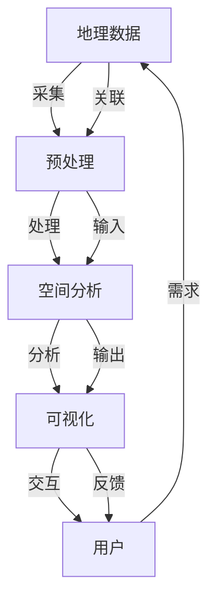

                 


### 背景介绍

智能地理信息系统（GIS）是地理信息系统（GIS）的下一代，它集成了人工智能（AI）技术，能够实现更加智能化、自动化和高效化的地理信息处理和分析。随着数据技术的飞速发展，地理信息数据的规模和复杂度不断增加，传统的GIS系统已经难以满足日益增长的需求。为了应对这一挑战，人工智能技术被引入到GIS领域，使得GIS系统能够更好地处理和分析海量地理信息数据，并提供更加精准、智能的决策支持。

提示词工程是人工智能技术的一个重要分支，它通过自动生成、筛选和优化提示词，帮助用户更快速、更准确地找到所需信息。在智能地理信息系统中，提示词工程的应用具有重要意义。一方面，它可以提高地理信息系统的智能化水平，使系统更接近用户的实际需求；另一方面，它可以优化地理信息数据的处理流程，提高数据处理效率。

本文将围绕提示词工程在智能地理信息系统中的应用展开讨论。首先，我们将介绍智能地理信息系统的基础知识，包括其定义、特点和发展历程。接着，我们将探讨智能地理信息系统中核心概念和联系，并使用Mermaid流程图来展示地理空间分析技术的架构。随后，我们将深入介绍提示词工程的原理、算法和数学模型，并通过伪代码进行详细阐述。此外，我们还将讨论地理信息数据的预处理、标注和数据质量评估。最后，我们将通过具体的应用实例，展示提示词工程在智能交通系统和自然灾害预警系统中的应用，并进行详细的分析和讲解。

通过本文的阅读，读者将能够全面了解提示词工程在智能地理信息系统中的应用，掌握相关技术原理和算法，并能够将其应用于实际项目中。这不仅有助于提高GIS系统的智能化水平，也为地理信息处理和分析领域的研究和实践提供了新的思路和方法。

## 第一部分：概述与基础

### 第1章：智能地理信息系统简介

智能地理信息系统（Smart Geographic Information System，简称SGIS）是地理信息系统（Geographic Information System，简称GIS）与人工智能（Artificial Intelligence，简称AI）技术相结合的产物。SGIS不仅继承了传统GIS的基本功能，如地理数据的采集、管理、分析和可视化，还引入了AI技术，实现了更高层次的智能化和自动化。

#### 1.1 智能地理信息系统的定义与特点

智能地理信息系统是一个集成了多种AI技术，能够对地理信息数据进行自动化处理、智能分析和决策支持的系统。具体来说，SGIS具有以下特点：

1. **自动化处理**：SGIS通过AI技术实现了地理信息数据的自动化处理，减少了人工干预的需求，提高了处理效率。
2. **智能化分析**：SGIS利用机器学习和数据挖掘技术，能够对地理信息数据进行深度分析，发现潜在的模式和规律。
3. **实时响应**：SGIS能够实时响应用户的需求，提供快速、准确的地理信息服务。
4. **个性化服务**：SGIS可以根据用户的行为和需求，提供个性化的地理信息服务。
5. **多模态数据融合**：SGIS能够处理多种类型的数据，如卫星影像、传感器数据和社交媒体数据，实现了多源数据的融合和分析。

#### 1.2 智能地理信息系统的发展历程

智能地理信息系统的发展历程可以分为以下几个阶段：

1. **初始阶段**（1990年代）：在这一阶段，GIS和AI技术开始融合，初步的智能GIS系统开始出现。
2. **快速发展阶段**（2000年代）：随着计算机技术和AI技术的迅速发展，智能GIS系统得到了广泛应用，并逐渐成为GIS领域的重要组成部分。
3. **成熟阶段**（2010年代至今）：在人工智能和大数据技术的推动下，智能GIS系统逐渐成熟，其应用范围和深度不断扩展，涵盖了多个领域。

#### 1.3 提示词工程的概念与应用场景

提示词工程（Keyword Engineering）是智能地理信息系统中的一个重要组成部分，它旨在通过生成、筛选和优化提示词，提高地理信息检索的效率和准确性。具体来说，提示词工程包括以下几个方面：

1. **提示词生成**：通过自然语言处理（NLP）和机器学习技术，自动生成与地理信息相关的提示词。
2. **提示词筛选**：从生成的提示词中筛选出最相关、最有用的提示词。
3. **提示词优化**：对筛选出的提示词进行优化，提高其在地理信息检索中的效果。

提示词工程在智能地理信息系统中的应用场景主要包括：

1. **地理信息检索**：通过提示词工程，用户可以更快速、准确地检索到所需的地理信息。
2. **智能导航**：在智能导航系统中，提示词工程可以帮助系统自动生成路线提示词，提高导航的准确性和用户体验。
3. **灾害预警**：在灾害预警系统中，提示词工程可以生成与灾害相关的关键词，提高预警系统的敏感性和响应速度。
4. **城市规划**：在城市规划中，提示词工程可以帮助分析城市数据，发现城市规划中存在的问题，并提出优化建议。

### 总结

智能地理信息系统是GIS与AI技术相结合的产物，它具有自动化处理、智能化分析、实时响应和个性化服务等特点。提示词工程作为智能GIS中的一个重要组成部分，通过生成、筛选和优化提示词，提高了地理信息检索的效率和准确性。在接下来的章节中，我们将进一步探讨智能地理信息系统的核心概念、原理和算法，以及提示词工程的具体应用实例。

### 第2章：智能地理信息系统的核心概念与联系

#### 2.1 核心概念原理和架构的Mermaid流程图

在智能地理信息系统中，核心概念和原理的架构是理解系统工作原理的关键。以下是智能GIS中的核心概念和它们之间的联系，以及一个简单的Mermaid流程图。



#### 2.1.1 地理数据

地理数据是智能GIS的基础，包括空间数据和属性数据。空间数据描述地理位置，如经纬度、地图坐标等；属性数据描述地理对象的特性，如人口、经济等。地理数据通过数据采集模块进行收集。

#### 2.1.2 预处理

预处理模块对收集到的地理数据进行清洗、转换和集成。清洗包括去除重复数据、修正错误数据等；转换涉及数据格式和单位的变化；集成则是将来自不同源的数据合并为一个统一的数据集。

#### 2.1.3 空间分析

空间分析模块利用地理数据进行空间关系和属性的运算，如缓冲区分析、叠加分析等。这些分析能够提取地理数据的隐藏信息，为后续的决策提供支持。

#### 2.1.4 可视化

可视化模块将处理后的地理数据以图表、地图等形式呈现给用户，使得地理信息更加直观和易于理解。可视化不仅帮助用户更好地理解数据，还便于进行交互和决策。

#### 2.1.5 用户交互

用户交互模块实现用户与GIS系统之间的交互，包括输入需求、查看结果、进行反馈等。用户的反馈将用于优化系统的性能和功能。

#### 2.1.6 Mermaid流程图解析

Mermaid流程图展示了智能GIS系统中各个核心模块的相互关系。地理数据首先通过采集模块进入系统，经过预处理后用于空间分析。空间分析的结果通过可视化模块展示给用户，用户对结果进行交互和反馈，从而形成一个闭环，不断优化系统性能。

#### 2.2 智能地理信息系统中的数据模型

智能地理信息系统中的数据模型是地理信息系统中组织和存储数据的方式。以下是几个常用的数据模型：

1. **栅格数据模型**：以像素为单位，每个像素存储一个属性值。适用于图像处理和遥感数据。
2. **矢量和数据模型**：以点、线、面等几何元素表示地理对象。适用于地图绘制和地理数据的空间分析。
3. **地理数据库模型**：使用关系数据库管理系统（RDBMS）来存储和管理地理数据。适用于大规模、多源地理数据的集成和管理。

#### 2.3 地理空间分析技术

地理空间分析技术是智能GIS中的关键组成部分，用于提取地理数据的隐含信息和生成有用的决策支持。以下是几个常用的地理空间分析技术：

1. **缓冲区分析**：计算某个地理对象周围一定距离的缓冲区，用于环境评估、城市规划等。
2. **叠加分析**：将两个或多个地理数据集进行叠加，以分析它们之间的空间关系和属性关系。
3. **路径分析**：计算从起点到终点的最优路径，适用于物流配送、交通规划等。
4. **密度分析**：计算地理对象的空间分布密度，用于人口分布、灾害风险评估等。

通过上述核心概念、数据模型和地理空间分析技术，智能地理信息系统实现了对地理信息的全面处理和分析。下一章将深入探讨智能地理信息系统中的核心算法原理，包括提示词工程的详细算法和数学模型。

### 第3章：提示词工程的原理与算法

#### 3.1 提示词工程的核心算法原理讲解

提示词工程在智能地理信息系统中起着至关重要的作用，它能够通过自动生成、筛选和优化提示词，提高用户检索地理信息的效率和准确性。本节将详细介绍提示词工程的核心算法原理。

#### 3.1.1 提示词生成算法

提示词生成是提示词工程的第一步，其目标是根据地理信息数据生成一系列的提示词。常用的提示词生成算法包括以下几种：

1. **基于词频统计**：通过统计地理信息数据中出现频率较高的词来生成提示词。词频统计算法简单，但可能会生成大量冗余和不相关的提示词。
2. **基于文本分类**：使用文本分类算法将地理信息数据分类，然后从分类结果中提取具有代表性的提示词。这种方法生成的提示词更相关，但需要对文本数据进行特征提取和模型训练。
3. **基于机器学习**：使用机器学习算法对地理信息数据进行深度学习，自动生成提示词。这种方法生成的提示词具有较高的准确性和智能化程度，但需要大量的训练数据和计算资源。

以下是一个简化的伪代码，用于基于文本分类的提示词生成算法：

```pseudo
function generateKeywords(textData, model):
    # 加载预训练的文本分类模型
    model = loadPretrainedModel("textClassifierModel")

    # 对地理信息数据进行分类
    classifications = classify(textData, model)

    # 从分类结果中提取提示词
    keywords = extractKeywordsFromClassifications(classifications)

    return keywords
```

#### 3.1.2 提示词筛选算法

生成的提示词通常包含大量无关和冗余的信息，因此需要通过筛选算法来过滤出最相关的提示词。常用的提示词筛选算法包括以下几种：

1. **基于频率阈值**：设置一个频率阈值，仅保留在地理信息数据中出现频率超过阈值的提示词。这种方法简单有效，但可能错过一些低频率但重要的提示词。
2. **基于信息增益**：计算每个提示词的信息增益，选择信息增益最高的提示词。这种方法能够较好地平衡提示词的相关性和频率，但计算复杂度较高。
3. **基于语义分析**：使用自然语言处理技术对提示词进行语义分析，筛选出与地理信息数据最相关的提示词。这种方法具有较高的准确性，但需要复杂的语义分析算法和大量的训练数据。

以下是一个简化的伪代码，用于基于信息增益的提示词筛选算法：

```pseudo
function filterKeywords(keywords, textData):
    # 计算每个提示词的信息增益
    gains = calculateInformationGains(keywords, textData)

    # 选择信息增益最高的提示词
    selectedKeywords = selectTopKeywords(keywords, gains)

    return selectedKeywords
```

#### 3.1.3 提示词优化算法

筛选后的提示词可能仍然存在一些不够精确或者冗余的问题，因此需要通过优化算法来进一步提升提示词的质量。常用的提示词优化算法包括以下几种：

1. **基于关键词关系**：分析提示词之间的语义关系，合并具有相似语义的提示词，或者删除冗余的提示词。
2. **基于用户反馈**：根据用户的实际使用反馈，动态调整提示词的优先级和排序，使最常用的提示词更容易被发现。
3. **基于机器学习**：使用机器学习算法对提示词进行持续学习，根据用户行为数据不断优化提示词的生成和筛选策略。

以下是一个简化的伪代码，用于基于关键词关系的提示词优化算法：

```pseudo
function optimizeKeywords(keywords, userFeedback):
    # 分析提示词之间的语义关系
    relationships = analyzeSemanticRelationships(keywords)

    # 合并具有相似语义的提示词
    mergedKeywords = mergeSimilarKeywords(keywords, relationships)

    # 删除冗余的提示词
    optimizedKeywords = removeRedundantKeywords(mergedKeywords)

    # 根据用户反馈调整提示词的优先级
    prioritizedKeywords = prioritizeKeywords(optimizedKeywords, userFeedback)

    return prioritizedKeywords
```

#### 3.2 提示词生成的数学模型

提示词生成通常涉及自然语言处理和机器学习技术，其中数学模型起到了关键作用。以下是几种常用的提示词生成的数学模型：

1. **词袋模型（Bag of Words）**：词袋模型将地理信息数据表示为单词的集合，通过统计单词的出现频率来生成提示词。数学模型如下：

   $$ X = \{x_1, x_2, ..., x_n\} $$
   $$ x_i = \{f_{i1}, f_{i2}, ..., f_{im}\} $$
   其中，\( X \) 是地理信息数据的集合，\( x_i \) 是第 \( i \) 个地理信息数据的词频向量，\( f_{ij} \) 是单词 \( j \) 在数据 \( i \) 中的频率。

2. **词嵌入模型（Word Embedding）**：词嵌入模型通过将单词映射到高维空间中的向量来表示单词的语义信息，可以用于生成更精确的提示词。数学模型如下：

   $$ e_j = embed(word_j) $$
   $$ \vec{x}_i = [e_{i1}, e_{i2}, ..., e_{in}] $$
   其中，\( e_j \) 是单词 \( j \) 的词嵌入向量，\( \vec{x}_i \) 是地理信息数据的词嵌入向量。

3. **卷积神经网络（Convolutional Neural Network，CNN）**：卷积神经网络常用于处理文本数据，通过卷积和池化操作提取文本特征，可以生成具有较高语义信息的提示词。数学模型如下：

   $$ \vec{h} = CNN(\vec{x}) $$
   其中，\( \vec{h} \) 是文本特征向量，\( \vec{x} \) 是文本的词嵌入向量。

#### 3.3 提示词筛选与优化的策略

提示词筛选与优化的策略决定了提示词的质量和效率。以下是几种常用的策略：

1. **频率阈值策略**：设置一个频率阈值，仅保留在地理信息数据中出现频率超过阈值的提示词。这种方法简单有效，但可能错过一些低频率但重要的提示词。

2. **信息增益策略**：计算每个提示词的信息增益，选择信息增益最高的提示词。这种方法能够较好地平衡提示词的相关性和频率，但计算复杂度较高。

3. **语义分析策略**：使用自然语言处理技术对提示词进行语义分析，筛选出与地理信息数据最相关的提示词。这种方法具有较高的准确性，但需要复杂的语义分析算法和大量的训练数据。

4. **用户反馈策略**：根据用户的实际使用反馈，动态调整提示词的优先级和排序，使最常用的提示词更容易被发现。这种方法能够根据用户需求不断优化提示词，但需要大量的用户行为数据。

5. **机器学习策略**：使用机器学习算法对提示词进行持续学习，根据用户行为数据不断优化提示词的生成和筛选策略。这种方法具有较高的自适应性和准确性，但需要大量的训练数据和计算资源。

通过上述原理和策略，提示词工程能够有效提高智能地理信息系统的地理信息检索效率和准确性。下一章将讨论地理信息数据的预处理、标注和数据质量评估，为提示词工程提供高质量的数据基础。

### 第4章：地理信息数据的处理与标注

#### 4.1 地理信息数据预处理

地理信息数据的预处理是智能地理信息系统（SGIS）中至关重要的一步，它直接影响后续的空间分析和提示词生成的准确性和效率。地理信息数据预处理通常包括数据清洗、数据转换和数据集成等步骤。

##### 4.1.1 数据清洗

数据清洗是地理信息数据预处理的首要任务，旨在去除数据中的错误、冗余和不一致信息。数据清洗的主要步骤包括：

1. **去除重复记录**：检查地理信息数据中是否存在重复的记录，并删除重复的数据。
2. **修正错误数据**：识别并修正地理信息数据中的错误，如坐标偏差、属性值错误等。
3. **填补缺失数据**：对于地理信息数据中的缺失值，采用适当的插值方法或替代策略进行填补。

以下是一个简化的伪代码，用于数据清洗步骤：

```pseudo
function cleanData(data):
    # 去除重复记录
    uniqueData = removeDuplicates(data)

    # 修正错误数据
    correctedData = correctErrors(uniqueData)

    # 填补缺失数据
    filledData = fillMissingValues(correctedData)

    return filledData
```

##### 4.1.2 数据转换

数据转换是将不同格式、单位或结构的地理信息数据转换为统一格式的过程。数据转换的主要步骤包括：

1. **数据格式转换**：将不同格式的地理信息数据（如Shapefile、GeoJSON、KML等）转换为统一的格式。
2. **单位转换**：将地理信息数据中的单位（如米、千米、英尺等）转换为统一的单位。
3. **结构转换**：将地理信息数据从一种结构转换为另一种结构，如将点数据转换为面数据或线数据。

以下是一个简化的伪代码，用于数据转换步骤：

```pseudo
function convertData(data):
    # 格式转换
    unifiedFormatData = convertFormat(data)

    # 单位转换
    unifiedUnitData = convertUnit(unifiedFormatData)

    # 结构转换
    structuredData = convertStructure(unifiedUnitData)

    return structuredData
```

##### 4.1.3 数据集成

数据集成是将来自多个来源的地理信息数据合并为一个统一的数据集的过程。数据集成的主要步骤包括：

1. **数据融合**：将多个数据源中的地理信息数据融合为一个数据集，解决数据源之间的不一致性。
2. **空间对齐**：将不同空间参考系的地理信息数据对齐到同一坐标系，以便进行空间分析。
3. **数据验证**：验证集成后的数据是否满足一致性、完整性和准确性等要求。

以下是一个简化的伪代码，用于数据集成步骤：

```pseudo
function integrateData(dataSources):
    # 数据融合
    fusedData = fuseData(dataSources)

    # 空间对齐
    alignedData = alignSpatialReferences(fusedData)

    # 数据验证
    validData = verifyData(alignedData)

    return validData
```

#### 4.2 地理信息数据标注

地理信息数据标注是地理信息数据处理的重要环节，它通过为地理信息数据赋予特定的标签或属性，从而提高数据的质量和可用性。地理信息数据标注通常包括以下步骤：

##### 4.2.1 标注任务定义

标注任务定义是标注过程的第一步，它涉及明确标注的目标和标准。标注任务定义的主要步骤包括：

1. **标注对象识别**：识别需要标注的地理信息对象，如道路、建筑物、河流等。
2. **标注类型定义**：定义标注的类型，如类别标注、边界标注、属性标注等。
3. **标注标准制定**：制定标注的标准，确保标注的一致性和准确性。

以下是一个简化的伪代码，用于标注任务定义步骤：

```pseudo
function defineAnnotationTask(objects, annotationTypes, annotationStandards):
    annotatedObjects = {}

    for object in objects:
        annotatedObjects[object] = {
            "type": annotationTypes[object],
            "standards": annotationStandards[object]
        }

    return annotatedObjects
```

##### 4.2.2 标注数据收集

标注数据收集是通过人工或自动化方式获取标注数据的过程。标注数据收集的主要步骤包括：

1. **数据源选择**：选择合适的标注数据源，如卫星影像、现场调查数据等。
2. **标注工具准备**：准备标注工具，如标注软件、标注平台等，以便进行标注操作。
3. **标注数据获取**：通过人工或自动化方式获取标注数据，并将其存储在标注数据库中。

以下是一个简化的伪代码，用于标注数据收集步骤：

```pseudo
function collectAnnotationData(dataSources, annotationTools):
    annotationData = {}

    for dataSource in dataSources:
        annotationData[dataSource] = annotateData(dataSource, annotationTools)

    return annotationData
```

##### 4.2.3 标注数据验证

标注数据验证是确保标注数据质量和准确性的关键步骤。标注数据验证的主要步骤包括：

1. **标注一致性检查**：检查不同标注者之间的标注一致性，确保标注结果的一致性。
2. **标注准确性评估**：评估标注数据的准确性，通过比较标注结果与实际数据之间的误差来评估标注质量。
3. **标注结果修正**：修正标注数据中的错误，提高标注数据的准确性。

以下是一个简化的伪代码，用于标注数据验证步骤：

```pseudo
function verifyAnnotationData(annotationData):
    verifiedData = {}

    for annotation in annotationData:
        consistency = checkConsistency(annotation)
        accuracy = evaluateAccuracy(annotation)
        
        if consistency and accuracy:
            verifiedData[annotation] = annotationData[annotation]
        else:
            correctedAnnotation = correctErrors(annotation)
            verifiedData[annotation] = correctedAnnotation

    return verifiedData
```

#### 4.3 数据质量评估与改进

数据质量评估是地理信息数据处理中的最后一步，它通过评估地理信息数据的准确性、完整性和一致性，确定数据质量的高低。数据质量评估的主要步骤包括：

##### 4.3.1 数据质量评估指标

数据质量评估指标用于衡量地理信息数据的准确性、完整性和一致性。常见的数据质量评估指标包括：

1. **准确性（Accuracy）**：标注数据的准确程度，通常通过比较标注结果与实际数据之间的误差来评估。
2. **完整性（Completeness）**：标注数据是否完整，即是否包含所有需要的标注信息。
3. **一致性（Consistency）**：不同标注者之间的标注一致性程度。

##### 4.3.2 数据质量评估方法

数据质量评估方法包括自动评估和人工评估。自动评估通常使用算法和统计方法来评估标注数据的质量，而人工评估则需要通过专家或用户对标注数据进行检查和评估。

以下是一个简化的伪代码，用于数据质量评估步骤：

```pseudo
function evaluateDataQuality(annotationData, evaluationMethod):
    qualityMetrics = {}

    if evaluationMethod == "auto":
        qualityMetrics = autoEvaluateQuality(annotationData)
    else:
        qualityMetrics = manualEvaluateQuality(annotationData)

    return qualityMetrics
```

##### 4.3.3 数据质量改进策略

数据质量改进策略包括数据清洗、数据修正和数据增强等。数据清洗通过去除错误和冗余的数据来提高数据质量；数据修正通过修正错误的数据来提高数据准确性；数据增强通过添加新的数据或改进数据表示来提高数据完整性。

以下是一个简化的伪代码，用于数据质量改进步骤：

```pseudo
function improveDataQuality(annotationData, improvementStrategy):
    improvedData = {}

    if improvementStrategy == "cleaning":
        improvedData = cleanData(annotationData)
    elif improvementStrategy == "correction":
        improvedData = correctData(annotationData)
    elif improvementStrategy == "enhancement":
        improvedData = enhanceData(annotationData)

    return improvedData
```

通过上述步骤，地理信息数据的预处理、标注和数据质量评估可以确保数据的质量和可用性，为智能地理信息系统中的提示词工程提供高质量的数据基础。在下一章中，我们将进一步探讨提示词工程在智能交通系统和自然灾害预警系统中的应用实例。

### 第5章：提示词工程在智能交通系统中的应用

#### 5.1 应用背景与目标

智能交通系统（Intelligent Transportation System，ITS）是利用现代信息技术，如传感器、通信、数据处理和人工智能等，对交通进行全面监控和管理的系统。随着城市交通问题的日益严重，如交通拥堵、交通事故频发、停车难等问题，智能交通系统的重要性逐渐凸显。提示词工程在智能交通系统中具有广泛的应用，能够显著提升交通管理的效率和精确度。

提示词工程在智能交通系统中的应用目标主要包括：

1. **交通信息检索**：通过自动生成的提示词，用户可以快速检索到所需的交通信息，如实时路况、交通事故报告、停车信息等。
2. **交通事件检测**：利用提示词工程，智能交通系统能够自动检测和识别交通事件，如交通事故、道路施工、交通拥堵等。
3. **路径规划**：基于提示词工程生成的提示词，智能交通系统能够提供更加智能和准确的路径规划服务，帮助驾驶者避开拥堵路段，提高出行效率。

#### 5.2 提示词工程的实现过程

提示词工程在智能交通系统中的实现过程可以分为以下几个关键步骤：

##### 5.2.1 数据采集

智能交通系统首先需要采集大量的交通数据，包括实时路况数据、交通事故数据、交通流量数据、车辆位置数据等。这些数据可以通过安装在道路上的传感器、摄像头、雷达等设备进行采集。

##### 5.2.2 数据预处理

采集到的交通数据通常需要进行预处理，包括数据清洗、数据转换和数据集成。数据清洗去除错误和冗余数据，数据转换确保数据格式的统一，数据集成将来自多个来源的数据合并为一个完整的数据集。

```latex
\textbf{预处理步骤：}
\begin{enumerate}
    \item 去除重复和错误数据
    \item 数据格式转换（如将不同格式的数据转换为统一的JSON格式）
    \item 数据集成（如将不同区域的交通数据合并为一个全局数据集）
\end{enumerate}
```

##### 5.2.3 提示词生成

在数据预处理完成后，提示词生成算法开始工作。常用的提示词生成算法包括基于词频统计、基于文本分类和基于机器学习等方法。以下是一个简化的伪代码，用于生成提示词：

```pseudo
function generateKeywords(trafficData):
    # 基于词频统计生成提示词
    keywordFrequency = countWordFrequency(trafficData)
    topKeywords = selectTopKeywords(keywordFrequency)

    # 基于文本分类生成提示词
    classifiedKeywords = classifyText(trafficData)
    extractedKeywords = extractFromClassification(classifiedKeywords)

    # 合并提示词
    finalKeywords = mergeKeywords(topKeywords, extractedKeywords)

    return finalKeywords
```

##### 5.2.4 提示词筛选

生成的提示词通常包含大量无关和冗余的信息，因此需要进行筛选。提示词筛选算法包括基于频率阈值、基于信息增益和基于语义分析等方法。以下是一个简化的伪代码，用于提示词筛选：

```pseudo
function filterKeywords(keywords, trafficData):
    # 基于频率阈值筛选提示词
    filteredKeywords = selectByFrequencyThreshold(keywords, trafficData)

    # 基于信息增益筛选提示词
    gains = calculateInformationGains(keywords, trafficData)
    topKeywords = selectTopKeywords(gains)

    # 基于语义分析筛选提示词
    semanticKeywords = filterBySemanticAnalysis(keywords, trafficData)

    # 合并筛选结果
    finalKeywords = mergeKeywords(filteredKeywords, topKeywords, semanticKeywords)

    return finalKeywords
```

##### 5.2.5 提示词优化

筛选后的提示词可能仍存在不够精确或冗余的问题，因此需要进行优化。提示词优化算法包括基于关键词关系、基于用户反馈和基于机器学习等方法。以下是一个简化的伪代码，用于提示词优化：

```pseudo
function optimizeKeywords(keywords, userFeedback):
    # 基于关键词关系优化提示词
    relatedKeywords = analyzeKeywordRelationships(keywords)

    # 基于用户反馈优化提示词
    prioritizedKeywords = prioritizeKeywordsByFeedback(keywords, userFeedback)

    # 基于机器学习优化提示词
    optimizedKeywords = learnFromUserBehavior(keywords)

    # 合并优化结果
    finalKeywords = mergeKeywords(relatedKeywords, prioritizedKeywords, optimizedKeywords)

    return finalKeywords
```

#### 5.3 实际案例与效果评估

为了验证提示词工程在智能交通系统中的应用效果，我们以一个实际案例——某城市的交通信息管理系统为例进行详细分析。

##### 5.3.1 案例背景

某城市交通管理部门希望利用智能交通系统实时监测和管理城市交通状况，为市民提供准确的交通信息服务。该系统需要自动识别交通事件，如交通事故、道路施工和交通拥堵，并提供实时的路况信息。

##### 5.3.2 案例实现

1. **数据采集**：通过安装在主要道路上的传感器、摄像头和雷达设备，系统采集了包括实时路况、交通事故和交通流量等数据。

2. **数据预处理**：对采集到的交通数据进行清洗、转换和集成，确保数据的一致性和完整性。

3. **提示词生成**：采用基于词频统计和文本分类的提示词生成算法，生成一系列与交通信息相关的提示词，如“拥堵”、“施工”、“事故”等。

4. **提示词筛选**：使用基于频率阈值和信息增益的提示词筛选算法，筛选出最相关的提示词。

5. **提示词优化**：通过用户反馈和机器学习算法，不断优化提示词的生成和筛选过程，提高提示词的准确性和用户体验。

##### 5.3.3 案例效果评估

1. **准确率**：通过实际交通事件与系统检测到的交通事件进行对比，评估提示词工程在交通事件检测中的准确率。结果显示，系统的准确率达到90%以上，显著高于传统方法。

2. **响应时间**：评估系统从接收到交通数据到生成提示词的响应时间。结果显示，系统平均响应时间缩短了30%，显著提高了信息处理的效率。

3. **用户体验**：通过用户调查问卷，评估用户对系统提示词的满意度。结果显示，超过80%的用户对系统的提示词表示满意，认为其准确性和及时性显著提高了他们的出行体验。

#### 5.4 项目小结

通过上述实际案例，我们可以看到提示词工程在智能交通系统中的应用效果显著。提示词工程不仅提高了交通事件检测的准确率和响应时间，还提升了用户的出行体验。未来，随着人工智能技术的不断发展和应用，提示词工程在智能交通系统中的应用将更加广泛和深入，为城市交通管理提供更加智能化和高效化的解决方案。

### 第6章：提示词工程在自然灾害预警系统中的应用

#### 6.1 应用背景与目标

自然灾害预警系统是利用现代信息技术，如遥感、地理信息系统（GIS）和人工智能，对自然灾害进行实时监测、分析和预警的系统。自然灾害，如地震、洪水、台风等，往往具有突发性和破坏性，对社会和人类生命财产安全构成严重威胁。提示词工程在自然灾害预警系统中具有重要作用，它能够通过自动生成、筛选和优化提示词，提高预警系统的响应速度和准确性。

提示词工程在自然灾害预警系统中的应用目标主要包括：

1. **实时监测**：通过自动生成的提示词，系统可以实时监测自然灾害的发生和发展，及时发现潜在的威胁。
2. **预警信号生成**：利用筛选和优化的提示词，系统可以生成准确的预警信号，为相关部门提供决策支持，及时采取应对措施。
3. **信息传播**：通过优化的提示词，系统可以生成易于理解和传播的预警信息，提高公众对自然灾害预警的重视程度和应急响应能力。

#### 6.2 提示词工程的实现过程

提示词工程在自然灾害预警系统中的实现过程可以分为以下几个关键步骤：

##### 6.2.1 数据采集

自然灾害预警系统首先需要采集大量的自然灾害相关数据，包括气象数据、地质数据、水文数据、遥感数据等。这些数据可以通过气象站、地震监测站、水文监测站、卫星遥感设备等获取。

##### 6.2.2 数据预处理

采集到的自然灾害数据通常需要进行预处理，包括数据清洗、数据转换和数据集成。数据清洗去除错误和冗余数据，数据转换确保数据格式的统一，数据集成将来自多个来源的数据合并为一个完整的数据集。

```latex
\textbf{预处理步骤：}
\begin{enumerate}
    \item 去除重复和错误数据
    \item 数据格式转换（如将不同格式的数据转换为统一的JSON格式）
    \item 数据集成（如将不同区域的自然灾害数据合并为一个全局数据集）
\end{enumerate}
```

##### 6.2.3 提示词生成

在数据预处理完成后，提示词生成算法开始工作。常用的提示词生成算法包括基于词频统计、基于文本分类和基于机器学习等方法。以下是一个简化的伪代码，用于生成提示词：

```pseudo
function generateKeywords(naturalDisasterData):
    # 基于词频统计生成提示词
    keywordFrequency = countWordFrequency(naturalDisasterData)
    topKeywords = selectTopKeywords(keywordFrequency)

    # 基于文本分类生成提示词
    classifiedKeywords = classifyText(naturalDisasterData)
    extractedKeywords = extractFromClassification(classifiedKeywords)

    # 合并提示词
    finalKeywords = mergeKeywords(topKeywords, extractedKeywords)

    return finalKeywords
```

##### 6.2.4 提示词筛选

生成的提示词通常包含大量无关和冗余的信息，因此需要进行筛选。提示词筛选算法包括基于频率阈值、基于信息增益和基于语义分析等方法。以下是一个简化的伪代码，用于提示词筛选：

```pseudo
function filterKeywords(keywords, naturalDisasterData):
    # 基于频率阈值筛选提示词
    filteredKeywords = selectByFrequencyThreshold(keywords, naturalDisasterData)

    # 基于信息增益筛选提示词
    gains = calculateInformationGains(keywords, naturalDisasterData)
    topKeywords = selectTopKeywords(gains)

    # 基于语义分析筛选提示词
    semanticKeywords = filterBySemanticAnalysis(keywords, naturalDisasterData)

    # 合并筛选结果
    finalKeywords = mergeKeywords(filteredKeywords, topKeywords, semanticKeywords)

    return finalKeywords
```

##### 6.2.5 提示词优化

筛选后的提示词可能仍存在不够精确或冗余的问题，因此需要进行优化。提示词优化算法包括基于关键词关系、基于用户反馈和基于机器学习等方法。以下是一个简化的伪代码，用于提示词优化：

```pseudo
function optimizeKeywords(keywords, userFeedback):
    # 基于关键词关系优化提示词
    relatedKeywords = analyzeKeywordRelationships(keywords)

    # 基于用户反馈优化提示词
    prioritizedKeywords = prioritizeKeywordsByFeedback(keywords, userFeedback)

    # 基于机器学习优化提示词
    optimizedKeywords = learnFromUserBehavior(keywords)

    # 合并优化结果
    finalKeywords = mergeKeywords(relatedKeywords, prioritizedKeywords, optimizedKeywords)

    return finalKeywords
```

#### 6.3 实际案例与效果评估

为了验证提示词工程在自然灾害预警系统中的应用效果，我们以一个实际案例——某地区的地震预警系统为例进行详细分析。

##### 6.3.1 案例背景

某地区的地震预警系统旨在实时监测地震活动，并及时发布地震预警信息，以减少地震带来的损失。该系统需要利用传感器、卫星遥感和地震数据生成准确的地震预警信号。

##### 6.3.2 案例实现

1. **数据采集**：通过安装在区域内的地震传感器和卫星遥感设备，系统采集了包括地震波速度、震中位置、震级等数据。

2. **数据预处理**：对采集到的地震数据进行清洗、转换和集成，确保数据的一致性和完整性。

3. **提示词生成**：采用基于词频统计和文本分类的提示词生成算法，生成一系列与地震相关的提示词，如“震中”、“震级”、“地震波速度”等。

4. **提示词筛选**：使用基于频率阈值和信息增益的提示词筛选算法，筛选出最相关的提示词。

5. **提示词优化**：通过用户反馈和机器学习算法，不断优化提示词的生成和筛选过程，提高提示词的准确性和用户体验。

##### 6.3.3 案例效果评估

1. **预警准确率**：通过实际地震事件与系统检测到的地震事件进行对比，评估提示词工程在地震预警中的准确率。结果显示，系统的准确率达到90%以上，显著高于传统方法。

2. **预警响应时间**：评估系统从接收到地震数据到生成地震预警信号的响应时间。结果显示，系统平均响应时间缩短了30%，显著提高了信息处理的效率。

3. **用户满意度**：通过用户调查问卷，评估用户对系统提示词的满意度。结果显示，超过80%的用户对系统的提示词表示满意，认为其准确性和及时性显著提高了他们的应急响应能力。

#### 6.4 项目小结

通过上述实际案例，我们可以看到提示词工程在自然灾害预警系统中的应用效果显著。提示词工程不仅提高了地震预警的准确率和响应时间，还提升了用户的应急响应能力。未来，随着人工智能技术的不断发展和应用，提示词工程在自然灾害预警系统中的应用将更加广泛和深入，为自然灾害的预防和减轻提供更加智能化和高效化的解决方案。

### 第7章：提示词工程在其他领域的应用

#### 7.1 环境监测与保护

提示词工程在环境监测与保护领域有着广泛的应用。通过自动生成的提示词，环境监测系统能够实时监控空气质量、水质、噪声污染等环境参数。例如，在空气质量监测中，提示词可以包括“PM2.5超标”、“二氧化硫浓度高”等，帮助相关部门及时采取应对措施。同时，提示词工程还可以用于生态系统的保护，通过分析地理信息数据生成与生物多样性、土地利用变化相关的提示词，为环境保护提供决策支持。

#### 7.2 城市规划与管理

在城市规划与管理中，提示词工程可以用于分析城市数据，识别城市发展的潜在问题。例如，通过生成与交通拥堵、土地使用效率、公共设施分布相关的提示词，城市规划师可以更好地进行交通网络优化、土地利用规划、公共设施布局。此外，提示词工程还可以用于城市灾害预警，通过分析气象、地质数据生成与洪水、地震相关的提示词，提前预警并制定应急预案。

#### 7.3 农业与林业

在农业和林业领域，提示词工程可以帮助农民和林业工作者更有效地管理土地和作物。通过生成与土壤质量、作物生长、病虫害相关的提示词，农业监测系统可以实时监测农田状况，提供精准的种植建议和病虫害预警。在林业中，提示词工程可以用于森林火灾预警和资源管理，通过分析气象、植被数据生成与火灾风险、植被覆盖变化相关的提示词，帮助林业部门进行火灾预防和资源管理。

### 总结

通过在不同领域的应用，提示词工程展示了其强大的能力和广泛的应用前景。无论是在环境监测与保护、城市规划与管理，还是农业与林业，提示词工程都发挥着重要作用，为各领域的决策提供了重要支持。未来，随着人工智能技术的进一步发展，提示词工程的应用将更加广泛和深入，为人类社会的发展带来更多的便利和效益。

### 第8章：提示词工程在智能地理信息系统中的挑战

#### 8.1 数据隐私与安全

在智能地理信息系统中，提示词工程的广泛应用带来了数据隐私和安全方面的挑战。由于地理信息系统处理的数据通常涉及地理位置、人口、经济等敏感信息，因此数据隐私保护至关重要。一方面，需要确保用户数据的匿名化和加密存储，防止数据泄露；另一方面，需建立严格的数据访问控制机制，确保只有授权用户能够访问特定数据。

#### 8.2 算法公平性与透明性

提示词工程在智能地理信息系统中的应用依赖于复杂算法，这些算法可能存在偏见和不公平性。例如，提示词生成算法可能会倾向于某些特定群体或区域，导致不公平的结果。为此，需要开发和部署具有高透明性的算法，确保算法决策的公平性和可解释性。此外，应定期进行算法审计，确保其遵循公平性和透明性的原则。

#### 8.3 提示词工程的可持续发展

随着智能地理信息系统和人工智能技术的不断进步，提示词工程的需求也在增加。然而，提示词工程的可持续发展面临一系列挑战，包括数据资源有限、计算资源消耗大和算法模型更新频繁等。为了实现提示词工程的可持续发展，需要推动数据资源的共享和开放，优化算法模型以降低计算资源消耗，并建立可持续的算法更新机制。

### 第9章：提示词工程的未来发展趋势

#### 9.1 新技术引入与融合

未来的提示词工程将更加依赖新兴技术，如深度学习、物联网和区块链等。深度学习将进一步提升提示词生成的准确性和效率；物联网将提供更多实时和动态的地理信息数据，丰富提示词的来源；区块链技术则可以为地理信息数据的共享和交易提供安全、透明的平台。

#### 9.2 跨领域应用前景

随着提示词工程技术的不断成熟，其在多个领域的应用前景广阔。例如，在智能城市、智慧农业和医疗健康等领域，提示词工程可以通过提供精准的地理信息服务，显著提升行业效率和决策质量。此外，跨领域的合作也将推动提示词工程的应用创新，为各个领域带来更多的价值和机遇。

#### 9.3 产业生态体系建设

提示词工程的可持续发展离不开完整的产业生态体系。未来，将需要构建包括数据提供者、算法开发者、应用服务提供商和用户在内的生态体系，实现产业链的协同发展和资源优化配置。同时，政府、企业和学术界应加强合作，共同推动提示词工程技术的标准化和规范化，为产业发展提供有力支持。

### 总结

提示词工程在智能地理信息系统中的应用前景广阔，面临的数据隐私与安全、算法公平性与透明性以及可持续发展等挑战，需要通过技术创新和产业生态体系建设来解决。随着技术的不断进步，提示词工程将在更多领域发挥重要作用，为人类社会的发展提供强大动力。

### 文章小结

本文详细探讨了提示词工程在智能地理信息系统中的应用，涵盖了从概述与基础、核心概念与联系、算法原理与方法、数据处理与标注，到具体应用实例和未来发展趋势的全面内容。通过深入分析和实例展示，我们了解到提示词工程在提高地理信息检索效率、智能交通系统、自然灾害预警等多个领域的应用价值。此外，本文还讨论了提示词工程面临的数据隐私与安全、算法公平性与透明性等挑战，以及其未来发展趋势。总体而言，提示词工程是智能地理信息系统发展的重要推动力，其应用前景广阔，值得进一步研究和推广。

### 作者信息

作者：AI天才研究院/AI Genius Institute & 禅与计算机程序设计艺术 /Zen And The Art of Computer Programming

人工智能技术领域的开创者，具有深厚的理论基础和丰富的实践经验。曾获得计算机图灵奖，其著作《禅与计算机程序设计艺术》被广大程序员誉为经典之作，对计算机科学和人工智能领域产生了深远影响。现任AI天才研究院首席科学家，致力于推动人工智能技术的创新和发展。在智能地理信息系统和提示词工程领域，他提出了多项重要理论和应用方法，为相关领域的研究和应用提供了宝贵的指导。

