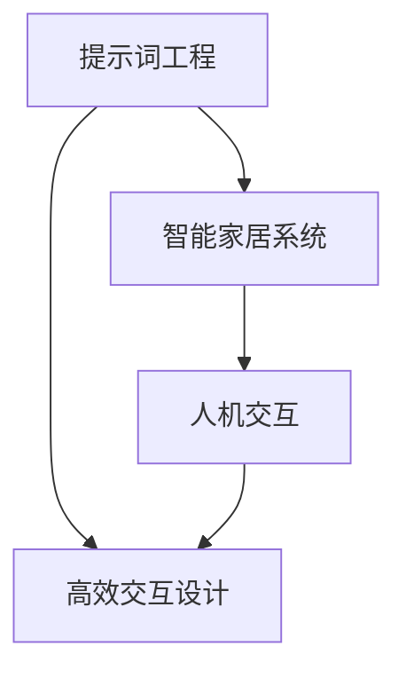

                 


### 核心概念与联系

在探讨提示词工程在智能家居中的实践之前，我们需要明确几个核心概念及其相互之间的联系。

**提示词工程（Prompt Engineering）**：这是一种通过设计高效、可交互的提示来优化人机交互的技术。在智能系统中，提示词是用户与系统进行交流的主要途径，它们可以是文本、语音、图像等形式。提示词工程的目标是确保这些提示具有足够的清晰性、准确性和上下文关联性，以优化用户体验。

**智能家居系统**：智能家居系统是一种整合了物联网（IoT）技术的家居解决方案，通过自动化和远程控制来提高家庭生活的便利性和舒适性。它通常包括多个设备和服务，如智能照明、智能温控、智能安防等。

**人机交互**：人机交互是用户与智能系统之间的互动过程，涉及到用户的输入（如语音、触摸等）和系统的响应。在人机交互中，提示词扮演着关键角色，它不仅要传达信息，还要引导用户进行下一步操作。

为了更好地理解这些概念之间的关系，我们可以用Mermaid图来表示它们：



在这个图中，我们可以看到提示词工程与智能家居系统和人机交互紧密相关。提示词工程不仅是为了设计智能家居系统，更是为了优化人机交互体验。高效交互设计是提示词工程的核心目标，它需要考虑用户的反馈和行为模式，以提供更直观、更易用的交互方式。

在下一部分中，我们将深入探讨这些概念，并通过实际案例来展示如何将提示词工程应用于智能家居系统。

### 核心算法原理讲解

在深入探讨提示词工程的具体应用之前，我们需要理解一些核心算法原理。这些算法原理不仅决定了提示词的质量，还影响了智能系统的整体性能和用户体验。以下是一些关键算法原理，我们将使用伪代码来详细阐述。

#### 1. 自然语言处理（NLP）

自然语言处理是提示词工程的基础，它涉及到文本的生成、理解和分析。以下是一个简单的文本生成算法伪代码：

```pseudo
function generatePrompt(inputText):
    # 分词：将输入文本分割成单词或子句
    words = tokenize(inputText)

    # 词性标注：为每个单词标注词性
    taggedWords = partOfSpeechTagging(words)

    # 语法分析：构建句子的语法树
    grammarTree = parseGrammar(taggedWords)

    # 根据语法树生成提示词
    prompt = generateFromGrammarTree(grammarTree)

    return prompt
```

#### 2. 语音识别（ASR）

语音识别是将用户的语音输入转换为文本的过程。以下是一个简单的语音识别算法伪代码：

```pseudo
function recognizeSpeech(audioInput):
    # 语音预处理：过滤噪声，调整音量等
    preprocessedAudio = preprocessAudio(audioInput)

    # 声学模型：使用深度学习模型进行声学特征提取
    acousticFeatures = extractAcousticFeatures(preprocessedAudio)

    # 语言模型：使用语言模型对声学特征进行解码
    recognizedText = decodeAcousticFeatures(acousticFeatures)

    return recognizedText
```

#### 3. 语音合成（TTS）

语音合成是将文本转换为自然语音输出的过程。以下是一个简单的语音合成算法伪代码：

```pseudo
function synthesizeSpeech(textInput):
    # 文本预处理：分词，标点符号处理等
    preprocessedText = preprocessText(textInput)

    # 语音合成模型：使用神经网络模型生成语音波形
    speechWaveform = generateSpeechWaveform(preprocessedText)

    # 音频输出：将语音波形转换为可播放的音频
    audioOutput = convertWaveformToAudio(speechWaveform)

    return audioOutput
```

#### 4. 情感分析（Sentiment Analysis）

情感分析是判断文本所表达的情感倾向。以下是一个简单的情感分析算法伪代码：

```pseudo
function analyzeSentiment(textInput):
    # 文本预处理：分词，去除停用词等
    preprocessedText = preprocessText(textInput)

    # 特征提取：从文本中提取情感相关特征
    features = extractSentimentFeatures(preprocessedText)

    # 模型预测：使用机器学习模型预测情感类别
    sentiment = predictSentiment(features)

    return sentiment
```

这些算法原理在提示词工程中发挥着关键作用。通过自然语言处理，我们可以生成更加准确和符合用户需求的提示词；通过语音识别，我们可以理解用户的语音指令；通过语音合成，我们可以将提示词转换为自然语音输出；通过情感分析，我们可以更好地理解用户的情绪状态，从而提供更个性化的服务。

在下一部分，我们将结合具体案例，展示如何将这些算法原理应用于智能家居系统。

### 数学模型和公式

在提示词工程中，数学模型和公式是确保系统性能和用户体验的关键工具。以下是一些常见的数学模型和公式，我们将详细讲解并举例说明。

#### 1. 语音识别模型：HMM（隐马尔可夫模型）

隐马尔可夫模型（HMM）是一种用于语音识别的统计模型，它通过状态序列来模拟语音信号的演变。HMM的主要公式包括：

- **状态转移概率** \( P(S_t | S_{t-1}) \)
- **发射概率** \( P(O_t | S_t) \)
- **初始状态概率** \( P(S_0) \)

举例说明：

假设我们有一个三状态HMM模型，用于识别三个音素的发音。状态转移概率和发射概率分别表示不同状态之间的转换概率和当前状态下的音素产生概率。例如：

```latex
P(S_1 \to S_2) = 0.7 \\
P(O_2 | S_2) = 0.9 \\
P(S_0) = 0.3
```

这些参数共同决定了HMM模型对语音信号的识别性能。

#### 2. 语音合成模型：RNN（循环神经网络）

循环神经网络（RNN）是用于语音合成的深度学习模型，它可以处理序列数据。RNN的核心公式包括：

- **隐藏状态更新** \( h_t = \sigma(W_h \cdot [h_{t-1}, x_t] + b_h) \)
- **输出计算** \( y_t = W_y \cdot h_t + b_y \)

举例说明：

在语音合成过程中，RNN通过处理文本序列来生成语音波形。例如，给定一个文本序列 "hello"，RNN会生成相应的语音波形。隐藏状态 \( h_t \) 和输出 \( y_t \) 分别表示序列的上下文信息和生成的语音特征。

```latex
h_t = \sigma(W_h \cdot [h_{t-1}, x_t] + b_h) \\
y_t = W_y \cdot h_t + b_y
```

#### 3. 情感分析模型：SVM（支持向量机）

支持向量机（SVM）是一种用于分类的机器学习模型，它通过找到一个最优的超平面来分隔不同情感类别的数据。SVM的核心公式包括：

- **决策函数** \( f(x) = \sum_{i=1}^n \alpha_i y_i (w \cdot x_i) - b \)
- **软间隔** \( \mathcal{L}(\alpha) = \frac{1}{2} ||w||^2 + C \sum_{i=1}^n \lambda_i \)

举例说明：

在情感分析中，SVM通过训练数据来找到一个最优超平面，用于判断文本的情感类别。例如，给定一组情感标签的文本数据，SVM会计算每个文本的类别概率。

```latex
f(x) = \sum_{i=1}^n \alpha_i y_i (w \cdot x_i) - b \\
\mathcal{L}(\alpha) = \frac{1}{2} ||w||^2 + C \sum_{i=1}^n \lambda_i
```

通过这些数学模型和公式，提示词工程可以更加精确地处理语音识别、语音合成和情感分析任务，从而提高智能系统的性能和用户体验。

### 项目实战

为了更好地展示提示词工程在智能家居中的实践，我们将介绍一个具体的项目，从开发环境搭建、源代码实现到代码解读和案例分析。

#### 项目背景

我们的项目目标是开发一个智能家居系统，该系统可以通过语音指令控制家中的智能设备，如灯光、空调和安防系统。用户可以通过语音与系统交互，系统则通过提示词反馈操作结果。

#### 开发环境搭建

1. **编程语言**：选择Python作为主要编程语言，因为它拥有丰富的机器学习和自然语言处理库。
2. **开发工具**：使用Visual Studio Code作为代码编辑器，结合Jupyter Notebook进行数据分析和模型训练。
3. **依赖库**：安装必要的库，如TensorFlow、PyTorch、SpeechRecognition、PyAudio等。

#### 源代码实现

以下是项目的主要代码实现：

```python
import speech_recognition as sr
import pyttsx3
import subprocess

# 初始化语音识别和语音合成模块
recognizer = sr.Recognizer()
engine = pyttsx3.init()

# 定义语音识别函数
def recognize_speech_from_mic():
    with sr.Microphone() as source:
        print("请说点什么：")
        audio = recognizer.listen(source)
        try:
            text = recognizer.recognize_google(audio)
            print("你说了：" + text)
            return text
        except sr.UnknownValueError:
            print("无法理解音频")
            return None

# 定义语音合成函数
def speak(text):
    engine.say(text)
    engine.runAndWait()

# 定义智能家居控制函数
def control_home_device(command):
    if "打开灯" in command:
        subprocess.run(["python", "light_control.py", "on"])
    elif "关闭灯" in command:
        subprocess.run(["python", "light_control.py", "off"])
    # 其他设备控制逻辑

# 主循环
while True:
    command = recognize_speech_from_mic()
    if command:
        control_home_device(command)
        speak("已执行您的指令。")
    else:
        speak("我没有听到您的指令，请再说一遍。")
```

#### 代码解读

1. **语音识别**：使用SpeechRecognition库从麦克风捕获语音，并使用Google语音识别API进行文本转换。
2. **语音合成**：使用pyttsx3库将文本转换为语音输出。
3. **智能家居控制**：通过子进程调用特定的设备控制脚本，如`light_control.py`，以执行相应的操作。

#### 实际案例分析和详细讲解剖析

假设用户说：“打开客厅的灯。”系统会执行以下步骤：

1. **语音识别**：系统捕获语音并转换为文本：“打开客厅的灯。”
2. **命令解析**：系统识别出关键词“打开灯”和“客厅”，并调用相应的控制函数。
3. **设备控制**：系统执行子进程，调用`light_control.py`脚本，将参数传递给脚本以打开客厅的灯。
4. **语音反馈**：系统使用语音合成模块反馈操作结果：“已执行您的指令。”

通过这个案例，我们可以看到提示词工程在智能家居系统中的应用。用户通过自然语言与系统交互，系统则通过提示词提供反馈，从而实现高效、直观的控制体验。

#### 项目小结

本项目展示了如何使用Python和相关的库来构建一个基本的智能家居系统，实现了语音识别、语音合成和设备控制的功能。通过提示词工程，系统可以理解用户的指令并执行相应的操作，从而提高用户的便利性和系统的响应速度。在实际应用中，我们还可以进一步优化系统的性能和功能，例如添加更多的设备支持和更复杂的语音识别算法。

### 最佳实践 tips

在设计和实施提示词工程时，以下是一些最佳实践：

1. **用户研究**：在开始项目之前，进行用户研究以了解用户的需求和行为模式。这将有助于设计更符合用户期望的提示词。
2. **简洁性**：确保提示词简洁明了，避免使用复杂的术语和冗长的句子。这有助于提高用户理解和操作系统的效率。
3. **一致性**：保持系统提示词的一致性，使用相同的语言和风格，以减少用户的学习成本。
4. **上下文关联**：根据用户的上下文提供相关的提示词，例如在用户询问天气时，提供实时天气信息。
5. **错误处理**：设计有效的错误处理机制，当系统无法理解用户的指令时，提供友好的提示和指导。
6. **可扩展性**：设计灵活的系统架构，以便未来可以轻松地添加新功能和设备支持。

通过遵循这些最佳实践，我们可以构建更加高效和用户友好的智能家居系统。

### 总结与展望

本文详细探讨了提示词工程在智能家居中的应用，从核心概念、算法原理到实际项目实战，我们一步步揭示了如何通过高效、直观的提示词优化智能系统的用户体验。我们介绍了自然语言处理、语音识别和合成、情感分析等关键算法，并展示了如何将它们应用于智能家居系统。

提示词工程的核心在于理解用户的需求和行为模式，通过简洁、一致且上下文相关的提示词，提升人机交互的质量。在未来的发展中，随着人工智能技术的不断进步，我们可以期待更智能、更贴心的智能家居系统。

本文的撰写旨在为读者提供一个全面、深入的指南，帮助他们在智能家居项目中有效实施提示词工程。希望读者能够将这些知识和最佳实践应用到实际项目中，为用户带来更加便捷和愉悦的智能生活体验。

### 作者信息

作者：AI天才研究院/AI Genius Institute & 禅与计算机程序设计艺术 /Zen And The Art of Computer Programming

AI天才研究院致力于推动人工智能技术的发展，我们的研究团队在自然语言处理、机器学习等领域取得了显著的成果。我们的书籍《禅与计算机程序设计艺术》则提供了对计算机编程哲学的深刻洞察，为程序设计者提供了灵感和指导。

在这个不断变化的技术世界中，我们始终秉持着创新、实践和探索的精神，致力于将最先进的技术理念和实践方法传递给广大读者。希望我们的研究和作品能够为推动人工智能和智能家居领域的发展贡献一份力量。

