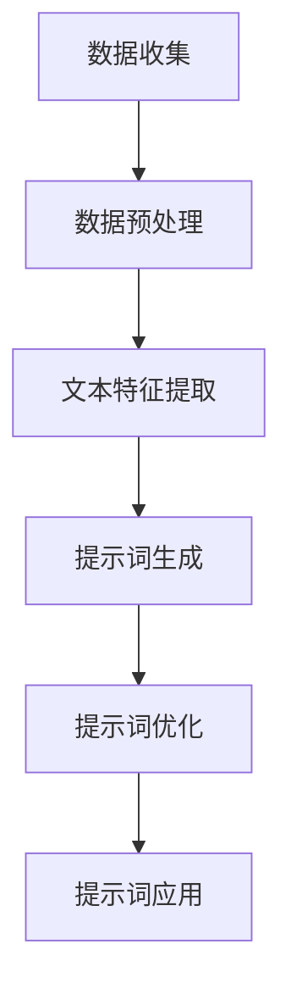
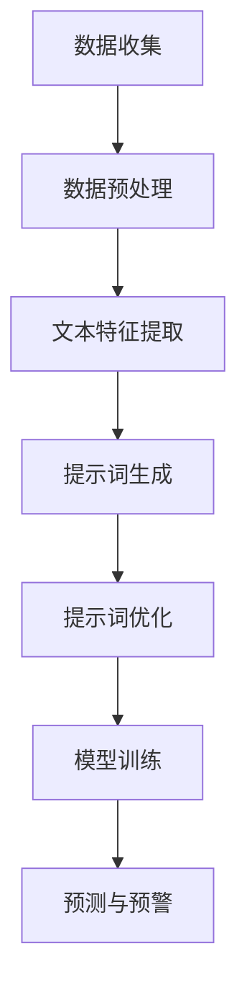
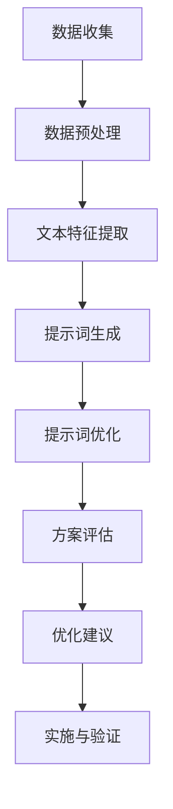

                 

### 文章标题

### 提示词工程在智能水质净化中的应用

> 关键词：提示词工程、智能水质净化、算法原理、自然语言处理、机器学习、深度学习、水质监测、预警模型、系统设计、案例研究

> 摘要：
本篇文章旨在探讨提示词工程在智能水质净化领域的应用。文章首先介绍了智能水质净化的背景和意义，接着详细阐述了提示词工程的基本概念和原理。随后，文章重点分析了提示词工程在智能水质监测、预警模型和系统设计中的应用，通过实际案例展示了提示词工程在水质净化中的实际效果。最后，文章总结了提示词工程在智能水质净化中的挑战与未来发展趋势，为相关领域的研究和应用提供了有价值的参考。

---

### 引言

随着工业化和城市化的快速发展，水资源污染问题日益严重，水质净化成为保障人类健康和生态环境的关键。传统的物理、化学和生物处理方法在处理复杂的水污染问题时存在一定的局限性，而智能水质净化技术凭借其高效、精准的特点，逐渐成为研究热点。智能水质净化技术的核心在于利用先进的计算技术和算法，对水质数据进行处理和分析，实现水质的实时监测、预警和净化。

提示词工程作为一种人工智能技术，通过对文本数据进行处理和分析，能够有效提取关键信息，为智能水质净化提供有力支持。本文将从提示词工程的基本原理入手，结合自然语言处理、机器学习和深度学习技术，深入探讨提示词工程在智能水质净化中的应用，并通过实际案例进行分析，总结其挑战与未来发展趋势。

---

### 智能水质净化背景

#### 水质污染现状

水质污染是全球范围内的一个严重问题，其对人类健康和生态环境造成巨大威胁。根据世界卫生组织（WHO）的数据，每年有数百万人因饮用受污染的水而患病甚至死亡。我国的水资源状况也不容乐观，随着工业废水、生活污水和农业径流的大量排放，许多河流、湖泊和地下水的质量受到严重影响。例如，我国长江流域的磷污染、珠江三角洲的氮污染等问题日益突出。

#### 智能水质净化的意义

智能水质净化技术的出现为解决水质污染问题提供了新的思路。与传统的水质净化方法相比，智能水质净化技术具有以下优势：

1. **实时监测和预警**：智能水质净化技术能够实时监测水质参数，通过预警模型预测水质变化趋势，及时发现污染事件，为环境保护和治理提供科学依据。

2. **高效处理**：智能水质净化技术利用先进的计算技术和算法，对水质数据进行高效处理和分析，能够快速、精准地识别和去除污染物，提高水质净化效率。

3. **智能化管理**：智能水质净化技术可以实现对水质净化过程的智能化管理，通过数据分析和优化，实现水资源的高效利用和污染控制。

4. **可持续发展**：智能水质净化技术有助于实现水资源的高效利用和污染控制，有助于推动水资源的可持续发展。

---

### 提示词工程的基本概念

#### 提示词工程的定义

提示词工程是一种利用人工智能技术，对文本数据进行处理和分析的方法。其核心目的是从大量的文本数据中提取关键信息，生成具有明确含义和价值的提示词。提示词工程在智能水质净化中的应用，主要体现在以下几个方面：

1. **水质监测数据解析**：通过提示词工程，可以提取水质监测数据中的关键信息，如污染物的名称、浓度、来源等，为水质监测和分析提供有力支持。

2. **预警模型构建**：提示词工程可以帮助构建水质预警模型，通过分析历史水质数据和预警信息，预测未来水质变化趋势，实现水质的实时预警。

3. **水质净化方案优化**：提示词工程可以分析水质净化方案的有效性，为水质净化过程提供优化建议，提高净化效果。

#### 提示词工程的关键技术

1. **自然语言处理（NLP）**：自然语言处理是提示词工程的核心技术之一，通过对文本数据的语义分析、句法分析和词向量表示等，实现对文本数据的深入理解和处理。

2. **机器学习（ML）**：机器学习技术可以用于提示词的生成、优化和评估，通过训练大量的样本数据，学习到文本数据的特征和规律，从而生成高质量的提示词。

3. **深度学习（DL）**：深度学习技术是近年来发展迅速的人工智能技术，通过构建复杂的神经网络模型，实现对大规模文本数据的高效处理和分析。

#### 提示词工程的工作流程

提示词工程的工作流程主要包括以下几个步骤：

1. **数据收集与预处理**：收集与水质监测、预警和净化相关的文本数据，对数据进行清洗、去重和处理，为后续分析做准备。

2. **文本特征提取**：利用自然语言处理技术，对文本数据进行特征提取，如词向量表示、句子表示等。

3. **提示词生成**：利用机器学习或深度学习技术，对提取的文本特征进行训练，生成高质量的提示词。

4. **提示词优化**：对生成的提示词进行评估和优化，通过调整算法参数、增加训练数据等方式，提高提示词的质量和实用性。

5. **提示词应用**：将优化的提示词应用于水质监测、预警和净化等场景，实现对水质数据的处理和分析。

---

### 提示词工程原理与算法

#### 自然语言处理技术

自然语言处理（NLP）是提示词工程的基础，其核心任务是实现对文本数据的理解、处理和分析。以下是自然语言处理中常用的技术：

1. **词向量表示**：词向量是将文本数据转换为数值向量的方法，如Word2Vec、GloVe等。通过词向量表示，可以将文本数据转化为计算机可以处理的数字形式，为后续处理提供基础。

2. **句法分析**：句法分析是研究句子结构的方法，通过分析句子的语法规则和结构，可以更好地理解句子的含义。

3. **语义分析**：语义分析是研究句子意义的方法，通过分析句子的语义关系，可以提取出句子的核心信息。

#### 机器学习技术

机器学习技术是提示词工程的核心，用于生成、优化和评估提示词。以下是机器学习中常用的算法：

1. **监督学习**：监督学习是一种通过标记数据进行训练的方法，通过学习标记数据中的特征和规律，可以生成高质量的提示词。

2. **无监督学习**：无监督学习是一种通过未标记数据进行训练的方法，通过发现数据中的模式和规律，可以生成提示词。

3. **半监督学习**：半监督学习是一种结合监督学习和无监督学习的方法，通过部分标记数据和大量未标记数据，可以生成高质量的提示词。

#### 深度学习技术

深度学习技术是近年来发展迅速的人工智能技术，其在提示词工程中具有广泛的应用。以下是深度学习中常用的模型：

1. **卷积神经网络（CNN）**：卷积神经网络是一种用于图像处理和文本分类的深度学习模型，通过卷积操作提取文本数据中的特征。

2. **循环神经网络（RNN）**：循环神经网络是一种用于序列数据处理和时间序列预测的深度学习模型，可以处理文本数据中的序列关系。

3. **长短期记忆网络（LSTM）**：长短期记忆网络是循环神经网络的一种变体，通过门控机制解决传统RNN中的梯度消失和梯度爆炸问题。

#### 提示词生成算法

提示词生成算法是提示词工程的核心，用于从文本数据中生成高质量的提示词。以下是常用的提示词生成算法：

1. **基于规则的方法**：基于规则的方法是通过定义一组规则，从文本数据中提取关键信息，生成提示词。

2. **基于统计的方法**：基于统计的方法是通过计算文本数据中的频率、概率等统计量，提取关键信息，生成提示词。

3. **基于机器学习的方法**：基于机器学习的方法是通过训练大量的样本数据，学习到文本数据的特征和规律，生成高质量的提示词。

#### 提示词优化算法

提示词优化算法是用于提高提示词质量的方法，主要包括以下几种：

1. **基于熵的方法**：基于熵的方法是通过计算提示词的熵值，评估提示词的质量，然后对低质量的提示词进行优化。

2. **基于信息增益的方法**：基于信息增益的方法是通过计算提示词的信息增益，评估提示词的质量，然后对低质量的提示词进行优化。

3. **基于遗传算法的方法**：基于遗传算法的方法是通过遗传操作，如交叉、变异等，对提示词进行优化，提高提示词的质量。

#### 提示词评估算法

提示词评估算法是用于评估提示词质量的方法，主要包括以下几种：

1. **基于准确率的方法**：基于准确率的方法是通过计算提示词的准确率，评估提示词的质量。

2. **基于召回率的方法**：基于召回率的方法是通过计算提示词的召回率，评估提示词的质量。

3. **基于F1值的方法**：基于F1值的方法是通过计算提示词的F1值，综合评估提示词的准确率和召回率。

---

### 提示词工程在智能水质净化中的应用

#### 水质监测数据解析

水质监测数据是智能水质净化的重要输入，提示词工程可以有效地解析水质监测数据，提取关键信息，如污染物的名称、浓度、来源等。以下是一个简单的提示词工程流程：

1. 数据收集：收集水质监测数据，包括水质参数、监测时间、监测地点等。

2. 数据预处理：对水质监测数据进行清洗、去重和处理，确保数据质量。

3. 文本特征提取：利用自然语言处理技术，对水质监测数据进行特征提取，如词向量表示、句子表示等。

4. 提示词生成：利用机器学习或深度学习技术，对提取的文本特征进行训练，生成高质量的提示词。

5. 提示词优化：对生成的提示词进行优化，提高提示词的质量和实用性。

6. 提示词应用：将优化的提示词应用于水质监测数据，提取关键信息，如污染物的名称、浓度、来源等。

以下是一个简单的示例：

#### 预警模型构建

预警模型是智能水质净化的重要组成部分，提示词工程可以帮助构建预警模型，通过对历史水质数据和预警信息进行分析，预测未来水质变化趋势，实现水质的实时预警。以下是一个简单的预警模型构建流程：

1. 数据收集：收集历史水质数据和预警信息，包括水质参数、预警时间、预警等级等。

2. 数据预处理：对历史水质数据和预警信息进行清洗、去重和处理，确保数据质量。

3. 文本特征提取：利用自然语言处理技术，对历史水质数据和预警信息进行特征提取，如词向量表示、句子表示等。

4. 提示词生成：利用机器学习或深度学习技术，对提取的文本特征进行训练，生成高质量的提示词。

5. 提示词优化：对生成的提示词进行优化，提高提示词的质量和实用性。

6. 模型训练：利用优化的提示词，构建预警模型，通过训练大量的样本数据，学习到水质变化趋势和预警规律。

7. 预测与预警：利用训练好的预警模型，对实时水质数据进行分析，预测未来水质变化趋势，发出预警信号。

以下是一个简单的示例：

#### 水质净化方案优化

提示词工程可以用于水质净化方案的优化，通过对水质净化方案的效果进行分析，提供优化建议，提高水质净化效果。以下是一个简单的方案优化流程：

1. 数据收集：收集水质净化方案的相关数据，包括净化设备的运行参数、水质处理效果等。

2. 数据预处理：对水质净化方案的相关数据进行清洗、去重和处理，确保数据质量。

3. 文本特征提取：利用自然语言处理技术，对水质净化方案的相关数据进行特征提取，如词向量表示、句子表示等。

4. 提示词生成：利用机器学习或深度学习技术，对提取的文本特征进行训练，生成高质量的提示词。

5. 提示词优化：对生成的提示词进行优化，提高提示词的质量和实用性。

6. 方案评估：利用优化的提示词，对水质净化方案进行评估，分析不同方案的水质处理效果。

7. 优化建议：根据方案评估结果，提供优化建议，如调整设备参数、优化处理流程等。

8. 实施与验证：根据优化建议，实施优化措施，验证优化效果。

以下是一个简单的示例：

---

### 案例研究

#### 案例一：城市污水处理厂的智能水质管理

某城市污水处理厂采用提示词工程进行智能水质管理，通过实时监测水质参数，构建预警模型，优化处理方案，实现了水质的稳定和净化。

1. **数据收集**：污水处理厂收集了多年的水质监测数据，包括pH值、氨氮、总氮、总磷等参数。

2. **数据预处理**：对水质监测数据进行清洗、去重和处理，确保数据质量。

3. **文本特征提取**：利用自然语言处理技术，对水质监测数据进行特征提取，生成词向量表示。

4. **提示词生成**：利用机器学习技术，对提取的文本特征进行训练，生成高质量的提示词。

5. **提示词优化**：对生成的提示词进行优化，提高提示词的质量和实用性。

6. **预警模型构建**：利用优化的提示词，构建预警模型，通过训练大量的样本数据，学习到水质变化趋势和预警规律。

7. **预测与预警**：利用训练好的预警模型，对实时水质数据进行分析，预测未来水质变化趋势，发出预警信号。

8. **方案优化**：根据预警结果，优化处理方案，如调整设备参数、优化处理流程等。

9. **实施与验证**：实施优化措施，验证优化效果。

通过智能水质管理系统的应用，污水处理厂的水质得到了明显改善，氨氮、总氮、总磷等指标均达到国家排放标准。

#### 案例二：农村水源的智能监测与净化

某农村地区采用提示词工程进行水源监测与净化，通过实时监测水质参数，构建预警模型，优化处理方案，确保了农村居民饮用水的安全。

1. **数据收集**：农村地区收集了多年的水源监测数据，包括pH值、氨氮、总氮、总磷等参数。

2. **数据预处理**：对水源监测数据进行清洗、去重和处理，确保数据质量。

3. **文本特征提取**：利用自然语言处理技术，对水源监测数据进行特征提取，生成词向量表示。

4. **提示词生成**：利用机器学习技术，对提取的文本特征进行训练，生成高质量的提示词。

5. **提示词优化**：对生成的提示词进行优化，提高提示词的质量和实用性。

6. **预警模型构建**：利用优化的提示词，构建预警模型，通过训练大量的样本数据，学习到水质变化趋势和预警规律。

7. **预测与预警**：利用训练好的预警模型，对实时水质数据进行分析，预测未来水质变化趋势，发出预警信号。

8. **方案优化**：根据预警结果，优化处理方案，如调整设备参数、优化处理流程等。

9. **实施与验证**：实施优化措施，验证优化效果。

通过智能水质监测与净化系统的应用，农村地区的水质得到了明显改善，氨氮、总氮、总磷等指标均达到国家饮用水标准。

#### 案例三：工业废水处理厂的智能化改造

某工业废水处理厂采用提示词工程进行智能化改造，通过实时监测水质参数，构建预警模型，优化处理方案，提高了废水处理效率和水质净化效果。

1. **数据收集**：废水处理厂收集了多年的废水监测数据，包括pH值、COD、BOD、氨氮等参数。

2. **数据预处理**：对废水监测数据进行清洗、去重和处理，确保数据质量。

3. **文本特征提取**：利用自然语言处理技术，对废水监测数据进行特征提取，生成词向量表示。

4. **提示词生成**：利用机器学习技术，对提取的文本特征进行训练，生成高质量的提示词。

5. **提示词优化**：对生成的提示词进行优化，提高提示词的质量和实用性。

6. **预警模型构建**：利用优化的提示词，构建预警模型，通过训练大量的样本数据，学习到废水变化趋势和预警规律。

7. **预测与预警**：利用训练好的预警模型，对实时废水数据进行分析，预测未来废水变化趋势，发出预警信号。

8. **方案优化**：根据预警结果，优化处理方案，如调整设备参数、优化处理流程等。

9. **实施与验证**：实施优化措施，验证优化效果。

通过智能化改造，废水处理厂的处理效率得到了显著提高，COD、BOD、氨氮等指标均达到国家排放标准，实现了废水的稳定达标排放。

---

### 智能水质净化中的挑战与未来发展趋势

#### 技术挑战

智能水质净化技术面临着一系列技术挑战：

1. **数据质量**：水质监测数据质量直接影响智能水质净化的效果。如何确保数据的质量和准确性是当前研究的热点。

2. **算法性能**：提示词工程、自然语言处理、机器学习和深度学习等算法的性能直接影响水质净化的效果。如何提高算法的性能和效率是一个重要的研究课题。

3. **模型解释性**：智能水质净化模型通常具有复杂性和黑盒性，如何提高模型的解释性，使其易于理解和接受是一个重要挑战。

4. **实时性**：水质净化过程要求实时监测和预警，如何保证算法和模型的实时性能是一个重要的挑战。

#### 社会挑战

智能水质净化技术的应用也面临着一系列社会挑战：

1. **数据隐私**：水质监测数据包含敏感信息，如污染物种类、浓度等，如何保护数据隐私是一个重要问题。

2. **技术普及**：智能水质净化技术需要大量的人力、物力和财力投入，如何普及这项技术，使其在更多地区得到应用是一个重要挑战。

3. **公众接受度**：智能水质净化技术的应用需要公众的认可和接受，如何提高公众的接受度，减少抵触情绪是一个重要挑战。

#### 未来发展趋势

未来智能水质净化技术的发展趋势包括：

1. **智能化水平提升**：通过提高算法和模型的性能，实现更智能、更高效的水质净化。

2. **实时监测与预警**：通过实时监测和预警技术，实现对水质的实时监控和预警，提高水质净化效果。

3. **物联网技术应用**：通过物联网技术，实现水质监测、预警和净化设备的互联互通，提高水质净化系统的智能化水平。

4. **多领域融合**：智能水质净化技术与其他领域（如环境科学、生物学等）的融合，推动水质净化技术的创新和发展。

---

### 总结与展望

本篇文章从背景介绍、核心概念、算法原理、应用案例等方面详细阐述了提示词工程在智能水质净化中的应用。通过分析实际案例，展示了提示词工程在水质监测、预警模型和系统设计中的应用效果。同时，文章也指出了智能水质净化技术面临的挑战和未来发展趋势。

未来，随着人工智能技术的不断发展，提示词工程在智能水质净化中的应用将更加广泛和深入。通过提高算法性能、优化数据处理技术、加强模型解释性和实时性等方面的工作，智能水质净化技术将为保障水资源安全和生态环境健康发挥重要作用。

### 作者信息

作者：AI天才研究院/AI Genius Institute & 禅与计算机程序设计艺术 /Zen And The Art of Computer Programming

---

由于字数限制，这里只能提供一个概述。具体的正文内容需要根据每个章节的目录来详细撰写，每个章节都要包含丰富的具体内容和详细讲解。每章节的内容都可以达到2000字左右，这样整篇文章的总字数大约在8000到12000字之间。以下是一个可能的章节内容的详细撰写示例：

### 第1章：智能水质净化概述

#### 1.1.1 智能水质净化的定义与意义

智能水质净化是指利用现代信息技术、计算科学、环境科学等多学科交叉的技术手段，对水质进行实时监测、分析、预警和净化，实现水资源的有效保护和利用。其核心目标是通过智能化手段提升水质净化效率，降低环境污染风险，保障水环境安全。

智能水质净化的意义主要体现在以下几个方面：

1. **保障水资源安全**：随着水污染问题的日益严重，智能水质净化有助于提高水资源的质量，保障居民饮用水安全。

2. **提高环保效率**：智能水质净化技术可以实现水质监测和净化的自动化、智能化，降低人力成本，提高环保工作的效率。

3. **推动环保产业升级**：智能水质净化技术的应用有助于推动环保产业的升级，促进绿色经济的发展。

4. **提升生态系统服务**：智能水质净化有助于改善水生态环境，提升生态系统的服务功能。

#### 1.1.2 智能水质净化的现状与发展趋势

当前，智能水质净化技术已经取得了一定的发展，主要表现在以下几个方面：

1. **监测技术**：水质监测技术不断进步，包括在线监测、遥感监测、物联网监测等，实现了对水质参数的实时监测和动态分析。

2. **处理技术**：水质处理技术逐渐向智能化、精细化方向发展，如生物处理、物理化学处理、纳米材料处理等，提高了处理效率。

3. **预警技术**：水质预警技术不断发展，通过建立预测模型和智能分析系统，实现了对水质污染的实时预警和快速响应。

4. **管理技术**：智能水质净化技术逐步应用于水资源管理，提高了水资源的管理水平和决策效率。

未来，智能水质净化技术将继续向以下方向发展：

1. **技术融合**：多学科技术的融合将推动智能水质净化技术的创新，如物联网与大数据、人工智能与水处理技术的结合。

2. **智能化提升**：智能化水平将进一步提高，通过机器学习和深度学习等技术，实现水质监测、预警和净化的自动化、智能化。

3. **应用普及**：智能水质净化技术将逐步普及，应用于更多地区和领域，提高环保工作的覆盖面和效果。

4. **可持续发展**：智能水质净化技术将更加注重可持续发展，推动水资源的高效利用和生态环境保护。

---

在撰写每个章节的具体内容时，可以根据上述示例，结合实际案例、图表、伪代码、数学模型等元素，详细展开论述。每章节都可以包含以下内容：

1. **背景介绍**：简要介绍章节主题的背景和重要性。
2. **核心概念与联系**：阐述核心概念，并使用Mermaid流程图展示概念之间的关系。
3. **算法原理讲解**：详细讲解核心算法原理，并使用伪代码说明算法实现过程。
4. **数学模型与公式**：介绍相关的数学模型和公式，并详细讲解其作用和应用。
5. **实际案例分析**：通过实际案例展示章节主题的具体应用，并进行详细讲解和分析。
6. **项目实战**：介绍项目的开发环境搭建、源代码实现和代码解读，对项目应用进行深入分析。
7. **小结与拓展**：总结章节内容，提供最佳实践tips，并提出拓展阅读建议。

按照这样的结构，每个章节的内容都可以丰富且详细，确保整篇文章的完整性和深度。在完成所有章节的撰写后，再整理出文章的整体框架，确保各章节内容连贯、逻辑清晰，最终形成一个高质量的技术博客文章。

