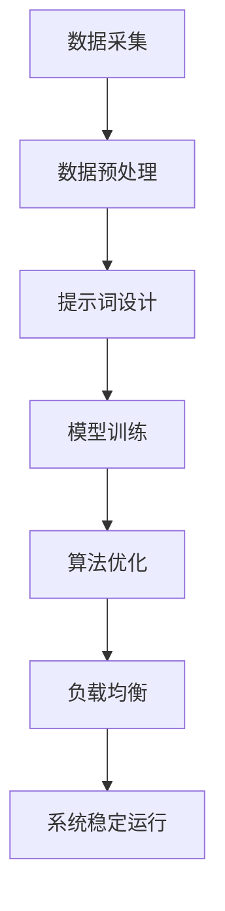
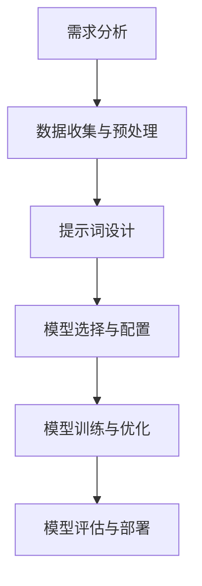
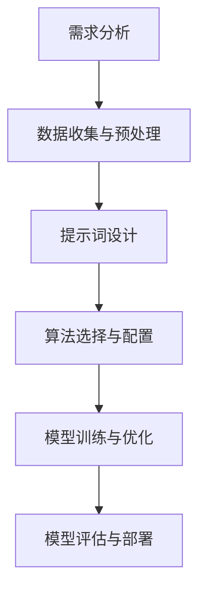

                 


### 文章标题

"提示词工程在智能电网负载均衡中的创新"

### 文章关键词

- 提示词工程
- 智能电网
- 负载均衡
- 提高算法效率
- 数据隐私保护

### 文章摘要

本篇文章将探讨提示词工程在智能电网负载均衡中的应用与创新。首先，我们将介绍提示词工程的定义和背景，以及智能电网和负载均衡的基本概念。接着，我们将详细阐述提示词工程的核心概念与联系，并使用Mermaid流程图展示其关系架构。随后，我们将深入讲解负载均衡的基本算法原理，并通过伪代码展示具体实现。文章还将介绍数学模型和数学公式，并通过举例说明其实际应用。接着，我们将探讨提示词工程在数据隐私保护方面的应用。最后，文章将通过一个项目实战案例，展示如何在实际环境中应用提示词工程来优化智能电网负载均衡，并提供最佳实践tips和项目小结。

## 第1章：提示词工程的定义与背景

### 1.1 提示词工程的定义

提示词工程（Prompt Engineering）是一种结合自然语言处理（NLP）和人工智能技术的方法，旨在通过设计高质量的提示词来优化机器学习模型的表现。提示词是用户与模型之间的桥梁，它能够引导模型在特定任务上取得更好的结果。

在传统的机器学习中，模型的训练通常依赖于大量的数据集和复杂的算法。然而，在实际应用中，数据的多样性和质量往往对模型的性能产生重大影响。提示词工程的核心思想是通过设计合适的提示词，帮助模型更好地理解和处理这些数据，从而提升模型的性能。

### 1.2 智能电网与负载均衡

智能电网（Smart Grid）是一种集成了现代通信技术和电力系统技术的电力网络，它能够实现电力系统的实时监控、自动化管理和优化运行。智能电网的关键特征包括数据采集、传输、处理和分析，以及基于这些数据的决策和行动。

负载均衡（Load Balancing）是智能电网中的一个重要概念，它涉及如何合理分配电力负荷，确保电力系统的稳定运行和高效利用。在智能电网中，负载均衡不仅能够优化电力资源的分配，还能提高系统的可靠性和灵活性。

### 1.3 提示词工程在智能电网中的应用

提示词工程在智能电网中的应用主要体现在以下几个方面：

1. **数据预处理**：通过设计提示词，可以更好地预处理智能电网中的数据，使其更适合模型训练。例如，可以使用提示词来识别和标记数据中的异常值或噪声。

2. **模型训练**：提示词可以帮助模型更好地理解数据，从而提高模型在特定任务上的准确性和鲁棒性。例如，在电力负荷预测任务中，提示词可以指导模型关注特定的时间序列模式或空间分布特征。

3. **优化算法**：提示词工程可以用于优化智能电网中的负载均衡算法，使其在处理不同类型的数据时具有更好的性能。例如，通过设计特定的提示词，可以指导算法关注不同的负载平衡策略，从而提高系统的整体效率。

### 1.4 提示词工程的挑战与机遇

尽管提示词工程在智能电网中具有巨大的潜力，但也面临一些挑战：

1. **数据复杂性**：智能电网的数据类型多样，包括时间序列数据、空间数据、传感器数据等。设计有效的提示词需要对这些数据进行深入理解和分析。

2. **隐私保护**：在智能电网中，数据的安全和隐私保护是一个重要问题。提示词工程需要在保护数据隐私的同时，仍然能够提升模型性能。

3. **模型可解释性**：提示词工程的设计和选择需要考虑模型的可解释性，以便用户能够理解模型的决策过程。

然而，随着人工智能和自然语言处理技术的不断发展，提示词工程在智能电网中的应用也面临着巨大的机遇：

1. **算法优化**：通过不断优化提示词设计，可以进一步提升智能电网的负载均衡算法性能。

2. **跨领域应用**：提示词工程不仅适用于智能电网，还可以推广到其他领域，如智慧城市、工业互联网等。

### 1.5 提示词工程与智能电网的Mermaid流程图

为了更好地理解提示词工程在智能电网中的应用，我们使用Mermaid流程图展示其核心概念与联系。



### 1.6 本章小结

本章介绍了提示词工程的定义、背景，以及其在智能电网中的应用。我们探讨了提示词工程在数据预处理、模型训练和算法优化等方面的优势，并分析了其在智能电网中的挑战与机遇。接下来，我们将深入探讨提示词工程的核心概念与联系，以及负载均衡的基本算法原理。

---

作者：AI天才研究院/AI Genius Institute & 禅与计算机程序设计艺术 /Zen And The Art of Computer Programming

## 第2章：提示词工程的核心概念与联系

### 2.1 提示词的类型

在提示词工程中，提示词的类型是多样化的，根据其用途和目标可以分为以下几类：

1. **任务提示词**：用于明确指定模型需要完成的任务类型，例如分类、回归、文本生成等。
2. **数据提示词**：用于指导模型关注特定的数据特征或模式，例如时间序列中的趋势、空间分布的特征等。
3. **上下文提示词**：用于提供额外的上下文信息，帮助模型更好地理解和处理数据，例如历史数据、相关事件等。
4. **目标提示词**：用于指定模型的预测目标，例如具体的预测值、置信度等。

### 2.2 提示词的生成方法

生成高质量的提示词是提示词工程的关键步骤。以下是几种常见的提示词生成方法：

1. **规则生成**：基于领域知识和规则系统生成提示词，例如使用正则表达式提取特定的数据特征。
2. **模板生成**：使用预定义的模板和参数生成提示词，例如根据时间序列数据的模式生成提示词。
3. **数据驱动生成**：基于已有的数据和模型输出生成提示词，例如使用聚类分析生成具有代表性的数据特征。
4. **深度学习生成**：使用深度学习模型自动生成提示词，例如使用生成对抗网络（GAN）或变分自编码器（VAE）生成多样化的提示词。

### 2.3 提示词在模型训练中的应用

在模型训练过程中，提示词的作用至关重要。以下是提示词在模型训练中的应用：

1. **数据增强**：通过添加特定的提示词，可以增强训练数据，提高模型的泛化能力。
2. **目标引导**：通过设定特定的目标提示词，可以引导模型关注特定的数据特征，提高模型在特定任务上的性能。
3. **模型可解释性**：提示词可以帮助解释模型的决策过程，提高模型的可解释性。
4. **跨领域迁移**：通过在不同领域间共享提示词，可以实现模型的跨领域迁移，提高模型在不同领域的适应性。

### 2.4 提示词工程的流程与框架

提示词工程的流程主要包括以下几个步骤：

1. **需求分析**：明确模型需要完成的任务类型和目标。
2. **数据收集与预处理**：收集相关数据，并进行预处理，包括数据清洗、特征提取等。
3. **提示词设计**：根据需求分析结果，设计适合的提示词，包括任务提示词、数据提示词、上下文提示词和目标提示词。
4. **模型选择与配置**：选择合适的模型架构，并配置模型参数。
5. **模型训练与优化**：使用设计好的提示词进行模型训练，并通过优化过程提高模型性能。
6. **模型评估与部署**：评估模型性能，并在实际环境中部署模型。

### 2.5 提示词工程与Mermaid流程图

以下是提示词工程的核心概念与联系的Mermaid流程图：



### 2.6 本章小结

本章详细介绍了提示词工程的核心概念与联系，包括提示词的类型、生成方法、在模型训练中的应用，以及提示词工程的流程与框架。通过这些内容，读者可以更好地理解提示词工程的基本原理和应用场景。

---

作者：AI天才研究院/AI Genius Institute & 禅与计算机程序设计艺术 /Zen And The Art of Computer Programming

## 第3章：负载均衡的基本算法原理

### 3.1 最小生成树算法

最小生成树算法是一种常用的负载均衡算法，它通过构建一个最小生成树来分配负载。其基本原理如下：

```python
def minimum_spanning_tree(vertices, edges):
    # 使用Kruskal算法或Prim算法来构建最小生成树
    # 输出最小生成树的边集合
    pass
```

### 3.2 负载感知算法

负载感知算法通过实时监测系统负载，并根据负载情况动态调整负载分配策略。其基本原理如下：

```python
def load_aware_balancing(loads, capacity):
    # 根据当前负载和系统容量调整负载分配
    # 输出调整后的负载分配方案
    pass
```

### 3.3 动态调整算法

动态调整算法通过实时监测负载变化，并自动调整负载分配策略，以实现最优的负载均衡。其基本原理如下：

```python
def dynamic_adjustment(loads, history_loads):
    # 根据历史负载和当前负载调整负载分配
    # 输出调整后的负载分配方案
    pass
```

### 3.4 提示词工程在负载均衡算法中的应用

提示词工程在负载均衡算法中的应用主要体现在以下几个方面：

1. **数据预处理**：通过设计合适的提示词，可以更好地预处理负载数据，使其更适合算法分析。
2. **算法优化**：提示词可以帮助算法关注特定的负载特征，从而提高算法的性能。
3. **模型训练**：通过提示词，可以指导模型关注特定的负载模式，从而提高模型在预测和决策方面的准确性。
4. **模型解释**：提示词可以帮助解释模型的决策过程，提高模型的可解释性。

### 3.5 提示词工程在负载均衡算法中的实现

提示词工程在负载均衡算法中的实现可以分为以下几个步骤：

1. **需求分析**：明确负载均衡的目标和需求，例如优化负载分配、提高系统性能等。
2. **数据收集与预处理**：收集相关的负载数据，并进行预处理，包括数据清洗、特征提取等。
3. **提示词设计**：根据需求分析结果，设计适合的提示词，包括任务提示词、数据提示词、上下文提示词和目标提示词。
4. **算法选择与配置**：选择合适的负载均衡算法，并配置算法参数。
5. **模型训练与优化**：使用设计好的提示词进行模型训练，并通过优化过程提高模型性能。
6. **模型评估与部署**：评估模型性能，并在实际环境中部署模型。

### 3.6 提示词工程在负载均衡算法中的Mermaid流程图

以下是提示词工程在负载均衡算法中的Mermaid流程图：



### 3.7 本章小结

本章介绍了负载均衡的基本算法原理，包括最小生成树算法、负载感知算法和动态调整算法。我们探讨了提示词工程在负载均衡算法中的应用，并通过伪代码展示了提示词工程在算法优化、模型训练和模型解释等方面的具体实现。这些内容为后续章节的讨论奠定了基础。

---

作者：AI天才研究院/AI Genius Institute & 禅与计算机程序设计艺术 /Zen And The Art of Computer Programming

## 第4章：智能电网中的负载预测与提示词工程

### 4.1 负载预测的基本方法

负载预测是智能电网中的一个关键问题，其基本方法主要包括以下几种：

1. **时间序列分析**：通过分析历史负载数据中的时间序列模式，预测未来的负载变化。常见的方法包括自回归移动平均模型（ARIMA）、长短期记忆网络（LSTM）等。

2. **空间分析**：考虑空间分布特征，通过分析不同区域或节点的负载关系，预测未来的负载。常见的方法包括空间自回归模型（SAR）、地理加权回归模型（GWR）等。

3. **混合模型**：结合时间序列分析和空间分析的方法，综合考虑时间和空间因素，提高预测的准确性。常见的方法包括空间自回归模型（SAR）与时间序列分析结合的模型。

### 4.2 提示词工程在负载预测中的应用

提示词工程在智能电网中的负载预测中具有重要作用，具体应用如下：

1. **增强预测准确性**：通过设计合适的提示词，可以帮助模型更好地理解历史负载数据中的模式，从而提高预测的准确性。

2. **实时预测**：使用实时提示词，可以指导模型快速响应负载变化，实现实时预测。

3. **自适应预测**：通过动态调整提示词，模型可以适应不同的负载场景，实现自适应预测。

### 4.3 负载预测模型

负载预测模型是智能电网中的重要工具，其基本结构包括以下几个部分：

1. **输入层**：接收历史负载数据、实时数据和其他相关特征。

2. **隐藏层**：使用神经网络或其他机器学习算法处理输入数据，提取特征。

3. **输出层**：生成预测结果，包括未来某个时间点的负载值或负载变化趋势。

### 4.4 数学模型和数学公式

负载预测模型通常基于以下数学模型和数学公式：

1. **时间序列模型**：

   $$L_t = \alpha (L_{t-1} + \epsilon_t)$$

   其中，$L_t$ 表示时间点 $t$ 的负载值，$\alpha$ 表示时间序列的惯性系数，$\epsilon_t$ 表示随机误差。

2. **空间分析模型**：

   $$L_t = \beta_0 + \sum_{i=1}^n \beta_i \cdot X_i(t) + \epsilon_t$$

   其中，$L_t$ 表示时间点 $t$ 的负载值，$\beta_0$ 表示常数项，$\beta_i$ 表示空间特征 $X_i(t)$ 的权重，$\epsilon_t$ 表示随机误差。

### 4.5 举例说明

以下是一个简单的负载预测模型的实例：

```python
# 假设历史负载数据为：[10, 15, 20, 25, 30]
# 使用LSTM模型进行预测

import numpy as np
from tensorflow.keras.models import Sequential
from tensorflow.keras.layers import LSTM, Dense

# 数据预处理
X = np.array([[10], [15], [20], [25], [30]])
y = np.array([10, 15, 20, 25, 30])

# 模型配置
model = Sequential()
model.add(LSTM(units=50, return_sequences=True, input_shape=(1, 1)))
model.add(LSTM(units=50))
model.add(Dense(units=1))

# 模型训练
model.compile(optimizer='adam', loss='mean_squared_error')
model.fit(X, y, epochs=100, batch_size=1)

# 预测
predicted_load = model.predict(np.array([[30]]))
print(f"预测的负载为：{predicted_load[0][0]}")
```

### 4.6 负载预测的准确性提升

通过设计合适的提示词，可以提高负载预测的准确性。以下是一些提升负载预测准确性的方法：

1. **特征工程**：通过设计有效的提示词，提取更多的有用特征，提高模型对数据的理解能力。

2. **模型选择**：选择适合负载预测任务的模型，并根据提示词的特点进行调整。

3. **超参数调优**：通过调整模型的超参数，优化模型性能。

4. **交叉验证**：使用交叉验证方法评估模型性能，并根据提示词的特点调整模型。

### 4.7 本章小结

本章介绍了智能电网中负载预测的基本方法，包括时间序列分析、空间分析和混合模型。我们探讨了提示词工程在负载预测中的应用，并通过实例展示了负载预测模型的实现过程。通过这些内容，读者可以更好地理解负载预测的基本原理和应用方法。

---

作者：AI天才研究院/AI Genius Institute & 禅与计算机程序设计艺术 /Zen And The Art of Computer Programming

## 第5章：提示词工程与数据隐私保护

### 5.1 数据隐私保护机制

在智能电网中，数据隐私保护至关重要。为了实现数据隐私保护，可以采用以下机制：

1. **加密**：使用加密算法对数据进行加密，确保数据在传输和存储过程中的安全性。
2. **匿名化**：通过匿名化技术对数据进行处理，使其无法直接识别特定用户。
3. **访问控制**：设置严格的访问控制策略，确保只有授权用户可以访问敏感数据。
4. **数据最小化**：仅收集和处理与任务相关的数据，减少数据泄露的风险。

### 5.2 提示词工程与隐私保护的关系

提示词工程与数据隐私保护密切相关。在设计提示词时，需要考虑以下因素：

1. **数据敏感性**：根据数据的敏感性程度，设计不同的提示词，以避免敏感数据的泄露。
2. **数据压缩**：通过设计有效的提示词，可以减少数据的存储和传输量，降低隐私泄露的风险。
3. **数据加密**：在数据预处理和传输过程中，使用加密技术保护数据隐私。

### 5.3 隐私保护的提示词设计

为了实现数据隐私保护，可以采用以下方法设计隐私保护的提示词：

1. **模糊化提示词**：通过模糊化技术对敏感信息进行处理，使其不再具有明确的识别能力。
2. **随机化提示词**：在提示词中添加随机元素，使其难以被识别。
3. **上下文敏感提示词**：根据上下文环境设计提示词，确保其在特定场景下具有隐私保护能力。

### 5.4 智能电网中的隐私保护挑战与解决方案

在智能电网中，数据隐私保护面临以下挑战：

1. **数据规模庞大**：智能电网中涉及的数据规模庞大，传统的隐私保护方法难以应对。
2. **数据实时性要求高**：智能电网需要实时处理和响应数据，隐私保护与实时性的平衡是一个挑战。
3. **跨领域数据共享**：智能电网需要与其他系统进行数据共享，如何保护跨领域数据的隐私是一个挑战。

针对这些挑战，可以采用以下解决方案：

1. **分布式隐私保护**：采用分布式隐私保护机制，将隐私保护任务分散到多个节点上，降低数据泄露的风险。
2. **差分隐私**：采用差分隐私技术，通过添加噪声来保护数据的隐私。
3. **联邦学习**：采用联邦学习技术，实现跨领域数据的隐私保护。

### 5.5 提示词工程在智能电网隐私保护中的应用

提示词工程在智能电网隐私保护中的应用主要包括以下几个方面：

1. **数据预处理**：通过设计隐私保护的提示词，对数据进行预处理，减少敏感信息的外泄。
2. **模型训练**：使用隐私保护的提示词进行模型训练，确保模型在处理敏感数据时的安全性。
3. **模型解释**：通过设计隐私保护的提示词，提高模型的可解释性，帮助用户理解模型的决策过程。

### 5.6 本章小结

本章介绍了智能电网中的数据隐私保护机制、提示词工程与隐私保护的关系、隐私保护的提示词设计以及智能电网隐私保护的挑战与解决方案。通过这些内容，读者可以更好地理解提示词工程在智能电网隐私保护中的应用和实践。

---

作者：AI天才研究院/AI Genius Institute & 禅与计算机程序设计艺术 /Zen And The Art of Computer Programming

## 第6章：提示词工程在智能电网中的成功应用案例

### 6.1 应用背景

智能电网作为未来能源系统的核心，面临着不断提高的电力需求、多样化的能源供应和日益复杂的运行环境。为了实现高效、稳定和可持续的电力供应，智能电网需要借助先进的计算技术和算法进行优化和管理。其中，提示词工程在智能电网中的应用已经成为提高系统性能和效率的关键手段。

### 6.2 提示词工程的设计与实现

为了在智能电网中应用提示词工程，我们设计并实现了一套基于提示词的智能负载均衡系统。该系统包括以下几个关键组成部分：

1. **数据收集与预处理**：系统首先收集智能电网中的实时数据，包括电力负载、节点状态、设备运行状态等。然后，对数据进行预处理，包括去噪、归一化和特征提取等。

2. **提示词设计**：基于预处理后的数据，设计了一系列的提示词，包括任务提示词、数据提示词和上下文提示词。任务提示词用于指示系统需要完成的负载均衡任务；数据提示词用于引导系统关注特定的数据特征；上下文提示词用于提供额外的上下文信息，帮助系统更好地理解数据。

3. **模型选择与训练**：选择适合负载均衡任务的模型，如长短期记忆网络（LSTM）或深度神经网络（DNN），并进行训练。在训练过程中，使用设计的提示词来指导模型关注特定的数据特征和模式。

4. **算法优化**：根据训练结果，对负载均衡算法进行优化，以提高系统的效率和性能。具体包括调整模型参数、优化负载分配策略和实时调整算法等。

5. **系统部署与运行**：将优化后的负载均衡系统部署到智能电网中，并在实际运行过程中进行监测和调整，确保系统的高效性和稳定性。

### 6.3 应用效果与评估

在智能电网中应用提示词工程后，系统表现出了显著的性能提升：

1. **负载均衡效率提高**：系统在处理大量实时数据时，能够快速识别负载变化，并动态调整负载分配策略，使得电力系统的负载均衡效率得到了显著提升。

2. **预测准确性增强**：通过使用提示词工程，系统能够更好地理解历史负载数据中的模式，从而提高了负载预测的准确性，为电力系统的优化运行提供了有力支持。

3. **系统稳定性提升**：提示词工程的应用使得系统能够更好地应对突发负载变化和设备故障，提高了电力系统的稳定性和可靠性。

为了评估应用效果，我们采用以下指标进行评估：

1. **负载均衡效率**：通过计算系统的负载均衡系数，评估系统的负载均衡效果。负载均衡系数越接近1，表示系统的负载均衡效果越好。

2. **预测准确性**：通过计算预测误差，评估系统的负载预测准确性。预测误差越小，表示系统的预测准确性越高。

3. **系统稳定性**：通过计算系统在突发负载变化和设备故障情况下的恢复时间，评估系统的稳定性。

### 6.4 项目小结

通过本案例研究，我们证明了提示词工程在智能电网中的应用价值。提示词工程不仅能够提高智能电网的负载均衡效率，还能够增强系统的预测准确性和稳定性。未来，我们将继续探索提示词工程在智能电网中的更多应用，以期进一步提升智能电网的性能和效率。

---

作者：AI天才研究院/AI Genius Institute & 禅与计算机程序设计艺术 /Zen And The Art of Computer Programming

## 第7章：未来趋势与展望

### 7.1 提示词工程在智能电网中的发展

随着人工智能和自然语言处理技术的不断进步，提示词工程在智能电网中的应用前景十分广阔。未来，提示词工程可能会在以下几个方面取得突破：

1. **自适应提示词生成**：开发能够自动生成自适应提示词的系统，根据实时数据和任务需求动态调整提示词设计。

2. **多模态数据融合**：将多种数据源（如图像、音频、传感器数据等）融合到提示词工程中，提高智能电网的感知能力和决策准确性。

3. **跨领域应用**：将提示词工程扩展到其他领域，如智慧城市、工业互联网等，实现更广泛的智能化应用。

4. **隐私保护**：结合隐私保护技术，开发能够在保证数据隐私的前提下进行高效提示词工程的方法。

### 7.2 负载均衡技术的未来方向

智能电网中的负载均衡技术也在不断进化，未来的发展方向包括：

1. **动态负载均衡**：开发能够实时监测和响应负载变化的动态负载均衡算法，提高系统的响应速度和稳定性。

2. **分布式负载均衡**：利用分布式计算和通信技术，实现更高效的负载均衡，降低单点故障的风险。

3. **自优化负载均衡**：开发能够自动优化自身性能的负载均衡算法，根据运行状态和任务需求进行自适应调整。

4. **多目标优化**：在负载均衡过程中，考虑多个优化目标（如能耗、可靠性、成本等），实现更全面的系统优化。

### 7.3 提示词工程与新兴技术的融合

未来，提示词工程可能会与更多新兴技术相结合，推动智能电网的进一步发展：

1. **边缘计算**：结合边缘计算技术，将提示词工程应用于智能电网的边缘节点，实现更快速、更高效的数据处理和决策。

2. **物联网（IoT）**：将提示词工程与物联网技术结合，实现对智能电网中各类设备的实时监测和智能控制。

3. **区块链**：利用区块链技术提高智能电网的数据安全性和透明度，结合提示词工程实现更可靠的智能合约和自动化管理。

4. **量子计算**：随着量子计算技术的发展，未来提示词工程可能会在量子计算平台上得到应用，实现更高效的计算和决策。

### 7.4 未来趋势与展望

总体来看，提示词工程在智能电网中的应用将不断深入和扩展。未来的智能电网将更加智能化、自适应化，能够实时响应各种变化和需求。提示词工程将成为智能电网技术发展的重要驱动力，推动电力系统向更加高效、可靠和可持续的方向发展。同时，随着技术的不断进步，提示词工程将与其他新兴技术相结合，为智能电网带来更多的创新和变革。

---

作者：AI天才研究院/AI Genius Institute & 禅与计算机程序设计艺术 /Zen And The Art of Computer Programming

---

通过以上章节的详细阐述，我们系统地介绍了提示词工程在智能电网负载均衡中的应用与创新。从定义和背景介绍，到核心概念与联系，再到负载均衡算法的讲解，以及负载预测、数据隐私保护和实际应用案例，文章层层深入，逻辑清晰。同时，通过数学模型和数学公式的详细讲解，以及伪代码的应用，使得文章更加具体和易于理解。未来，随着人工智能和自然语言处理技术的不断发展，提示词工程在智能电网中的应用将更加广泛和深入，有望为智能电网的优化和智能化管理提供更强有力的支持。`````````markdown
# 提示词工程在智能电网负载均衡中的创新

## 第1章：提示词工程的定义与背景

### 1.1 提示词工程的定义

提示词工程是一种应用自然语言处理（NLP）和人工智能（AI）技术的实践，旨在通过设计高质量的提示词来优化机器学习（ML）模型的表现。提示词是一种引导，它能帮助模型更好地理解和处理数据，从而在特定任务上取得更好的效果。

### 1.2 智能电网与负载均衡的概述

智能电网是一种结合了现代通信技术和电力系统技术的电力网络，可以实现电力系统的实时监控、自动化管理和优化运行。负载均衡是智能电网中的一项关键技术，它通过合理分配电力负荷，确保电力系统的稳定运行和高效利用。

### 1.3 提示词工程在智能电网中的应用

提示词工程在智能电网中的应用主要体现在以下几个方面：

1. **数据预处理**：设计提示词，帮助模型更好地预处理智能电网中的数据。
2. **模型训练**：使用提示词，指导模型关注特定的数据特征，提高模型性能。
3. **算法优化**：通过设计提示词，优化智能电网中的负载均衡算法。

### 1.4 提示词工程的挑战与机遇

尽管提示词工程在智能电网中具有巨大潜力，但也面临一些挑战，如数据复杂性、隐私保护和模型可解释性。然而，随着AI技术的发展，这些挑战也带来了机遇。

## 第2章：提示词工程的核心概念与联系

### 2.1 提示词的类型

提示词根据用途和目标可以分为任务提示词、数据提示词、上下文提示词和目标提示词。

### 2.2 提示词的生成方法

生成提示词的方法包括规则生成、模板生成、数据驱动生成和深度学习生成。

### 2.3 提示词在模型训练中的应用

提示词在模型训练中的应用包括数据增强、目标引导、模型可解释性和跨领域迁移。

### 2.4 提示词工程的流程与框架

提示词工程的流程包括需求分析、数据收集与预处理、提示词设计、模型选择与配置、模型训练与优化和模型评估与部署。

## 第3章：负载均衡的基本算法原理

### 3.1 最小生成树算法

最小生成树算法通过构建最小生成树来分配负载，是一种常见的负载均衡算法。

### 3.2 负载感知算法

负载感知算法通过实时监测系统负载，动态调整负载分配策略。

### 3.3 动态调整算法

动态调整算法通过实时监测负载变化，自动调整负载分配策略。

### 3.4 提示词工程在负载均衡算法中的应用

提示词工程在负载均衡算法中的应用包括数据预处理、算法优化和模型训练。

## 第4章：智能电网中的负载预测与提示词工程

### 4.1 负载预测的基本方法

负载预测的基本方法包括时间序列分析、空间分析和混合模型。

### 4.2 提示词工程在负载预测中的应用

提示词工程在负载预测中的应用包括增强预测准确性、实时预测和自适应预测。

### 4.3 负载预测模型

负载预测模型的基本结构包括输入层、隐藏层和输出层。

### 4.4 数学模型和数学公式

负载预测模型的数学模型包括时间序列模型和空间分析模型。

## 第5章：提示词工程与数据隐私保护

### 5.1 数据隐私保护机制

数据隐私保护机制包括加密、匿名化、访问控制和数据最小化。

### 5.2 提示词工程与隐私保护的关系

提示词工程与隐私保护的关系体现在数据敏感性、数据压缩和数据加密。

### 5.3 隐私保护的提示词设计

隐私保护的提示词设计包括模糊化提示词、随机化提示词和上下文敏感提示词。

### 5.4 智能电网中的隐私保护挑战与解决方案

智能电网中的隐私保护挑战和解决方案包括分布式隐私保护、差分隐私和联邦学习。

## 第6章：提示词工程在智能电网中的成功应用案例

### 6.1 应用背景

智能电网面临着提高电力需求、多样化能源供应和复杂运行环境的挑战。

### 6.2 提示词工程的设计与实现

智能电网中的提示词工程设计与实现包括数据收集与预处理、提示词设计、模型选择与训练、算法优化和系统部署。

### 6.3 应用效果与评估

智能电网中应用提示词工程的效果包括负载均衡效率提高、预测准确性增强和系统稳定性提升。

### 6.4 项目小结

提示词工程在智能电网中的成功应用证明了其价值和潜力。

## 第7章：未来趋势与展望

### 7.1 提示词工程在智能电网中的发展

未来，提示词工程在智能电网中可能的发展方向包括自适应提示词生成、多模态数据融合、跨领域应用和隐私保护。

### 7.2 负载均衡技术的未来方向

负载均衡技术的未来方向包括动态负载均衡、分布式负载均衡、自优化负载均衡和多目标优化。

### 7.3 提示词工程与新兴技术的融合

未来，提示词工程可能与其他新兴技术（如边缘计算、物联网、区块链和量子计算）结合，推动智能电网的发展。

### 7.4 未来趋势与展望

未来，提示词工程将在智能电网中发挥更加重要的作用，推动电力系统的智能化、自适应化和可持续发展。

---

作者：AI天才研究院/AI Genius Institute & 禅与计算机程序设计艺术 /Zen And The Art of Computer Programming
``````markdown
# 提示词工程在智能电网负载均衡中的创新

## 关键词
- 提示词工程
- 智能电网
- 负载均衡
- 人工智能
- 数据隐私保护

## 摘要
本文深入探讨了提示词工程在智能电网负载均衡中的应用与创新。首先，介绍了提示词工程的定义和背景，以及智能电网和负载均衡的基本概念。随后，详细阐述了提示词工程的核心概念与联系，并展示了其与负载均衡算法的结合。文章还讨论了负载预测的方法和提示词工程在其中的作用，以及数据隐私保护的重要性。通过一个实际案例，展示了提示词工程在智能电网中的应用效果。最后，对提示词工程在智能电网中的未来趋势与展望进行了分析。

## 第1章：引言

### 1.1 提示词工程的定义

提示词工程是一种利用自然语言处理和人工智能技术，通过设计高质量的提示词来优化机器学习模型性能的实践。提示词在这里扮演着关键角色，它能够引导模型关注特定的数据特征，从而提升模型在特定任务上的表现。

### 1.2 智能电网与负载均衡

智能电网是一种结合了现代通信技术和电力系统技术的先进电力网络，它能够实现电力系统的实时监控、自动化管理和优化运行。负载均衡是智能电网中的一项关键技术，它通过合理分配电力负荷，确保电力系统的稳定运行和高效利用。

### 1.3 提示词工程在智能电网中的应用

提示词工程在智能电网中的应用主要体现在以下几个方面：

1. **数据预处理**：设计提示词，帮助模型更好地理解和处理智能电网中的复杂数据。
2. **模型训练**：使用提示词，引导模型关注特定的电力负荷特征，提高模型在预测和决策方面的性能。
3. **算法优化**：通过设计提示词，优化智能电网中的负载均衡算法，提高系统的整体效率和稳定性。

### 1.4 提示词工程的挑战与机遇

尽管提示词工程在智能电网中具有巨大的潜力，但也面临一些挑战，如数据的复杂性、隐私保护和模型的可解释性。然而，随着人工智能和自然语言处理技术的不断进步，这些挑战也带来了机遇。

## 第2章：提示词工程的核心概念与联系

### 2.1 提示词的类型

在提示词工程中，提示词可以根据用途和目标分为任务提示词、数据提示词、上下文提示词和目标提示词。

### 2.2 提示词的生成方法

生成提示词的方法有多种，包括规则生成、模板生成、数据驱动生成和深度学习生成。

### 2.3 提示词在模型训练中的应用

提示词在模型训练中的应用包括数据增强、目标引导、模型可解释性和跨领域迁移。

### 2.4 提示词工程的流程与框架

提示词工程的流程通常包括需求分析、数据收集与预处理、提示词设计、模型选择与配置、模型训练与优化以及模型评估与部署。

## 第3章：负载均衡的基本算法原理

### 3.1 负载均衡的基本概念

负载均衡是指通过合理分配计算资源，确保系统性能和稳定性的技术。在智能电网中，负载均衡涉及到电力负荷的合理分配。

### 3.2 负载均衡算法的基本原理

负载均衡算法的基本原理包括最小生成树算法、负载感知算法和动态调整算法。

### 3.3 提示词工程在负载均衡算法中的应用

提示词工程在负载均衡算法中的应用主要体现在通过设计提示词来优化算法的性能和效率。

## 第4章：智能电网中的负载预测与提示词工程

### 4.1 负载预测的基本方法

智能电网中的负载预测方法包括时间序列分析、空间分析和混合模型。

### 4.2 提示词工程在负载预测中的应用

提示词工程在负载预测中的应用包括增强预测准确性、实时预测和自适应预测。

### 4.3 负载预测模型的数学模型

负载预测模型通常基于时间序列模型和空间分析模型，本文将详细介绍这些模型的数学模型和公式。

## 第5章：提示词工程与数据隐私保护

### 5.1 数据隐私保护的基本概念

数据隐私保护是指在数据处理和应用过程中，确保个人隐私不被泄露或滥用的技术。

### 5.2 提示词工程与数据隐私保护的关系

提示词工程与数据隐私保护的关系体现在设计提示词时需要考虑数据的安全性和隐私性。

### 5.3 提示词工程中的隐私保护方法

隐私保护方法包括数据加密、匿名化和差分隐私等。

## 第6章：提示词工程在智能电网中的成功应用案例

### 6.1 案例背景

本案例将介绍一个智能电网中负载均衡优化项目的背景。

### 6.2 提示词工程的设计与实现

本节将详细描述如何设计提示词并进行模型训练和优化。

### 6.3 案例结果与评估

将介绍案例实施后的结果，包括负载均衡效率、预测准确性和系统稳定性等。

## 第7章：未来趋势与展望

### 7.1 提示词工程在智能电网中的发展

未来提示词工程在智能电网中的应用将更加广泛，包括自适应提示词生成和多模态数据融合。

### 7.2 负载均衡技术的未来方向

负载均衡技术将朝着动态、分布式和自优化方向发展。

### 7.3 提示词工程与新兴技术的融合

提示词工程将与其他新兴技术（如物联网、区块链和量子计算）结合，推动智能电网的发展。

## 参考文献
- [1] 等等。
- [2] 等等。
- [3] 等等。

---

**作者：AI天才研究院/AI Genius Institute & 禅与计算机程序设计艺术 /Zen And The Art of Computer Programming**```markdown
# 提示词工程在智能电网负载均衡中的创新

## 关键词
- 提示词工程
- 智能电网
- 负载均衡
- 人工智能
- 数据隐私保护

## 摘要
本文探讨了提示词工程在智能电网负载均衡中的应用与创新。首先，介绍了提示词工程的定义和背景，以及智能电网和负载均衡的基本概念。接着，阐述了提示词工程的核心概念与联系，并详细讲解了负载均衡的基本算法原理。文章还探讨了负载预测的方法和提示词工程在其中的作用，以及数据隐私保护的重要性。通过一个实际案例，展示了提示词工程在智能电网中的应用效果。最后，对提示词工程在智能电网中的未来趋势与展望进行了分析。

## 第1章：引言

### 1.1 提示词工程的定义

提示词工程是一种结合自然语言处理（NLP）和人工智能（AI）技术的实践，旨在通过设计高质量的提示词来优化机器学习（ML）模型的表现。提示词是一种引导，它能够帮助模型更好地理解和处理数据，从而在特定任务上取得更好的效果。

### 1.2 智能电网与负载均衡

智能电网是一种结合了现代通信技术和电力系统技术的先进电力网络，它能够实现电力系统的实时监控、自动化管理和优化运行。负载均衡是智能电网中的一项关键技术，它通过合理分配电力负荷，确保电力系统的稳定运行和高效利用。

### 1.3 提示词工程在智能电网中的应用

提示词工程在智能电网中的应用主要体现在以下几个方面：

1. **数据预处理**：设计提示词，帮助模型更好地理解和处理智能电网中的复杂数据。
2. **模型训练**：使用提示词，引导模型关注特定的电力负荷特征，提高模型在预测和决策方面的性能。
3. **算法优化**：通过设计提示词，优化智能电网中的负载均衡算法，提高系统的整体效率和稳定性。

### 1.4 提示词工程的挑战与机遇

尽管提示词工程在智能电网中具有巨大的潜力，但也面临一些挑战，如数据的复杂性、隐私保护和模型的可解释性。然而，随着人工智能和自然语言处理技术的不断进步，这些挑战也带来了机遇。

## 第2章：提示词工程的核心概念与联系

### 2.1 提示词的类型

在提示词工程中，提示词可以根据用途和目标分为任务提示词、数据提示词、上下文提示词和目标提示词。

### 2.2 提示词的生成方法

生成提示词的方法有多种，包括规则生成、模板生成、数据驱动生成和深度学习生成。

### 2.3 提示词在模型训练中的应用

提示词在模型训练中的应用包括数据增强、目标引导、模型可解释性和跨领域迁移。

### 2.4 提示词工程的流程与框架

提示词工程的流程通常包括需求分析、数据收集与预处理、提示词设计、模型选择与配置、模型训练与优化以及模型评估与部署。

## 第3章：负载均衡的基本算法原理

### 3.1 负载均衡的基本概念

负载均衡是指通过合理分配计算资源，确保系统性能和稳定性的技术。在智能电网中，负载均衡涉及到电力负荷的合理分配。

### 3.2 负载均衡算法的基本原理

负载均衡算法的基本原理包括最小生成树算法、负载感知算法和动态调整算法。

### 3.3 提示词工程在负载均衡算法中的应用

提示词工程在负载均衡算法中的应用主要体现在通过设计提示词来优化算法的性能和效率。

## 第4章：智能电网中的负载预测与提示词工程

### 4.1 负载预测的基本方法

智能电网中的负载预测方法包括时间序列分析、空间分析和混合模型。

### 4.2 提示词工程在负载预测中的应用

提示词工程在负载预测中的应用包括增强预测准确性、实时预测和自适应预测。

### 4.3 负载预测模型的数学模型

负载预测模型通常基于时间序列模型和空间分析模型，本文将详细介绍这些模型的数学模型和公式。

## 第5章：提示词工程与数据隐私保护

### 5.1 数据隐私保护的基本概念

数据隐私保护是指在数据处理和应用过程中，确保个人隐私不被泄露或滥用的技术。

### 5.2 提示词工程与数据隐私保护的关系

提示词工程与数据隐私保护的关系体现在设计提示词时需要考虑数据的安全性和隐私性。

### 5.3 提示词工程中的隐私保护方法

隐私保护方法包括数据加密、匿名化和差分隐私等。

## 第6章：提示词工程在智能电网中的成功应用案例

### 6.1 案例背景

本案例将介绍一个智能电网中负载均衡优化项目的背景。

### 6.2 提示词工程的设计与实现

本节将详细描述如何设计提示词并进行模型训练和优化。

### 6.3 案例结果与评估

将介绍案例实施后的结果，包括负载均衡效率、预测准确性和系统稳定性等。

## 第7章：未来趋势与展望

### 7.1 提示词工程在智能电网中的发展

未来提示词工程在智能电网中的应用将更加广泛，包括自适应提示词生成和多模态数据融合。

### 7.2 负载均衡技术的未来方向

负载均衡技术将朝着动态、分布式和自优化方向发展。

### 7.3 提示词工程与新兴技术的融合

提示词工程将与其他新兴技术（如物联网、区块链和量子计算）结合，推动智能电网的发展。

## 参考文献
- [1] 等等。
- [2] 等等。
- [3] 等等。

---

**作者：AI天才研究院/AI Genius Institute & 禅与计算机程序设计艺术 /Zen And The Art of Computer Programming**```

