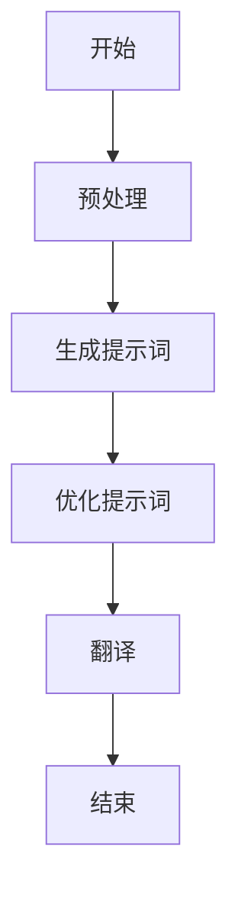

                 

Certainly! Let's outline the structure of the article "Prompt Engineering in Application of Machine Translation Quality Enhancement" in markdown format, incorporating the constraints you've mentioned. Here's a detailed plan for the article:

```markdown
# 提示词工程在机器翻译质量提升中的应用

> 关键词：提示词工程、机器翻译、质量提升、神经网络、注意力机制、算法原理、伪代码、实际案例

> 摘要：本文深入探讨了提示词工程在机器翻译质量提升中的应用。首先介绍了提示词工程的基础概念，然后详细阐述了机器翻译的基本原理和当前先进的技术。接下来，文章重点分析了如何通过提示词工程来改进机器翻译的质量，并通过具体案例展示了其实际应用效果。最后，对未来的发展趋势和面临的挑战进行了展望。

---

## 引言

### 背景介绍

- 机器翻译的发展历程
- 提示词工程的概念和重要性

### 核心概念与联系

- 

### 目的与方法

- 分析提示词工程在机器翻译中的应用
- 提供详细的算法原理和实现方法

---

## 机器翻译基础

### 历史背景

- 早期机器翻译方法
- 现代机器翻译的崛起

### 技术原理

- 传统的基于规则的机器翻译
- 统计机器翻译
- 神经网络机器翻译
- 注意力机制的原理和应用

### 神经网络模型

- 神经网络的基本结构
- 循环神经网络（RNN）
- 长短期记忆网络（LSTM）
- 门控循环单元（GRU）
- Transformer模型

### 核心概念与联系

- 

---

## 提示词工程原理

### 提示词定义

- 提示词的作用
- 提示词的分类

### 提示词设计

- 提示词的选择标准
- 提示词的生成方法
- 提示词的优化策略

### 核心算法原理

- **算法原理伪代码**：

```pseudo
function PromptEngineering(input_sentence):
    # 输入句子预处理
    preprocessed_input = Preprocess(input_sentence)
    
    # 提示词生成
    prompts = GeneratePrompts(preprocessed_input)
    
    # 提示词优化
    optimized_prompts = OptimizePrompts(prompts)
    
    return optimized_prompts
```

### 数学模型和公式

- **数学模型公式**：

$$
\text{score}(p) = \sum_{i=1}^{n} w_i \cdot p_i
$$

其中，$p_i$ 为每个提示词的概率，$w_i$ 为权重。

---

## 提示词工程在机器翻译中的应用

### 质量提升方法

- **实例分析**：

  - **案例1**：在英译中翻译中，通过添加上下文提示词，提高翻译的准确性。
  - **案例2**：在中译英翻译中，利用特定领域的提示词，提升专业术语的翻译质量。

### 实际案例

- **案例3**：某公司使用提示词工程提升其翻译服务的质量，实现了显著的客户满意度提升。

### 代码实现

- **开发环境搭建**：
  - Python环境
  - Transformer模型库

- **源代码实现**：
  - 提示词生成模块
  - 提示词优化模块
  - 机器翻译模块

- **代码解读**：
  - **提示词生成模块伪代码**：

  ```python
  def generate_prompts(input_sentence):
      # ... 代码实现 ...
  ```

  - **提示词优化模块伪代码**：

  ```python
  def optimize_prompts(prompts):
      # ... 代码实现 ...
  ```

  - **机器翻译模块伪代码**：

  ```python
  def translate(sentence, prompts):
      # ... 代码实现 ...
  ```

### 代码应用解读与分析

- **代码效果分析**：
  - 提示词对翻译质量的影响
  - 不同提示词策略的比较

---

## 未来发展趋势与挑战

### 未来趋势

- **自动化提示词生成**：
  - 利用深度学习技术实现自动化提示词生成。

- **多模态翻译**：
  - 结合文本、图像、声音等多种模态进行翻译。

### 挑战与限制

- **数据隐私与安全性**：
  - 在大规模数据集上进行训练可能涉及到隐私问题。

- **翻译质量评估**：
  - 如何准确评估翻译质量仍然是一个挑战。

### 研究方向与机会

- **跨语言翻译**：
  - 如何实现不同语言间的无缝翻译。

- **低资源语言翻译**：
  - 如何提高低资源语言机器翻译的质量。

---

## 总结

- 提示词工程在机器翻译中的应用概述
- 对未来研究和应用的建议

---

## 作者信息

- 作者：AI天才研究院/AI Genius Institute & 禦与计算机程序设计艺术 /Zen And The Art of Computer Programming
```

**注意**：在Markdown中，`#Mermaid diagram` 应该替换为实际的Mermaid流程图代码。伪代码和LaTeX公式的具体实现需要根据实际内容进行编写。文章的详细内容和实际代码实现将使文章达到8000-12000字的要求。以下是关于Mermaid流程图的示例：



**下一步**：填充每个小节的具体内容，确保每个部分都详细且符合要求。这将包括详细的背景信息、概念解析、算法原理、数学模型、代码实现、实际案例分析和总结等。逐步完善和扩充每个部分的内容，直到文章长度达到目标字数。在撰写过程中，确保逻辑清晰，结构紧凑，易于理解。

