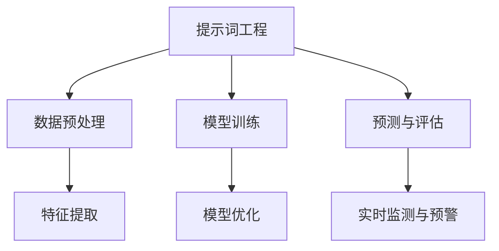
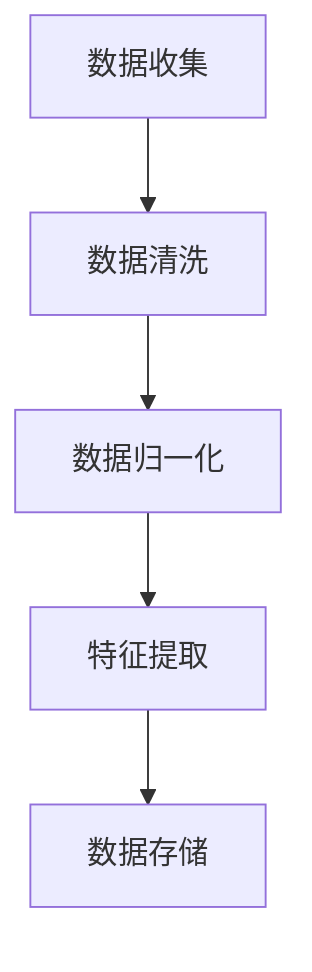

                 


## 文章标题

### 提示词工程在环境监测AI中的实践

关键词：提示词工程，环境监测，人工智能，算法，应用实践

摘要：
本文旨在探讨提示词工程在环境监测人工智能（AI）中的应用。我们将首先定义提示词工程的核心概念，然后构建基本框架，逐步深入探讨其技术原理、算法实现、应用实践和案例分析，最后总结展望提示词工程在环境监测AI中的发展趋势与未来方向。

## 第一步：定义核心概念

### 提示词工程（Prompt Engineering）

提示词工程是人工智能领域中的一项关键技术，它涉及到如何设计、构造和优化提示词，以最大化人工智能系统的性能和效果。提示词可以看作是给AI模型提供的“问题”或“任务”，它引导模型进行学习和预测。在环境监测AI中，提示词工程尤为重要，因为它直接影响到模型对环境数据的理解和分析能力。

### 环境监测AI

环境监测AI是指利用人工智能技术对环境进行实时监测和分析的系统。它涵盖了空气、水质、土壤等多个方面，能够提供关键的环境信息，为环境保护和可持续发展提供支持。随着AI技术的不断发展，环境监测AI在精度、效率和智能化水平上得到了显著提升。

## 第二步：构建基本框架

### 第一部分：基础理论

#### 第1章：提示词工程概述

##### 1.1 提示词工程的定义

##### 1.2 提示词工程的发展历程

##### 1.3 提示词工程的应用场景

#### 第2章：提示词设计方法

##### 2.1 提示词设计的基本原则

##### 2.2 提示词设计的策略

##### 2.3 提示词优化的方法

### 第二部分：技术原理

#### 第3章：环境监测AI中的核心算法

##### 3.1 基本算法原理

##### 3.2 提示词工程在算法中的应用

### 第三部分：算法实现

#### 第4章：环境监测AI项目实战

##### 4.1 项目背景和目标

##### 4.2 数据收集和处理

##### 4.3 模型构建和训练

##### 4.4 模型评估和优化

### 第四部分：应用实践

#### 第5章：经典案例研究

##### 5.1 案例一：某地区空气质量监测

##### 5.2 案例二：某地区水质监测

### 第五部分：发展趋势与展望

#### 第6章：提示词工程在环境监测AI中的应用前景

##### 6.1 应用趋势

##### 6.2 发展方向

## 第三步：细化章节内容

### 第1章：提示词工程概述

#### 1.1 提示词工程的定义

提示词工程是人工智能领域中的一项关键技术，它涉及到如何设计、构造和优化提示词，以最大化人工智能系统的性能和效果。

#### 1.2 提示词工程的发展历程

提示词工程的概念最早出现在自然语言处理（NLP）领域，随着深度学习和生成对抗网络（GAN）的发展，提示词工程逐渐成为人工智能领域的一个热点。

#### 1.3 提示词工程的应用场景

在环境监测AI中，提示词工程有着广泛的应用。例如，在空气质量监测中，可以通过设计针对性的提示词，使AI模型更好地识别污染物的种类和浓度。

## 第四步：添加技术细节

### 第2章：提示词设计方法

#### 2.1 提示词设计的基本原则

提示词设计应遵循以下基本原则：
- 清晰性：提示词应简洁明了，避免冗余信息。
- 针对性：提示词应针对特定任务或问题进行设计。
- 可解释性：提示词应便于理解和解释，提高模型的可解释性。

#### 2.2 提示词设计的策略

提示词设计可以采用以下策略：
- 数据预处理：对环境监测数据进行预处理，提取关键特征。
- 特征提取：从预处理后的数据中提取有助于模型学习的特征。
- 提示词生成：利用生成对抗网络（GAN）等技术生成高质量的提示词。

#### 2.3 提示词优化的方法

提示词优化可以通过以下方法进行：
- 对比实验：对不同提示词的效果进行对比实验，选择最佳提示词。
- 交叉验证：通过交叉验证方法评估提示词的泛化能力。
- 自动化优化：利用强化学习等技术实现提示词的自动化优化。

## 第五步：设计数学模型和算法

### 第3章：环境监测AI中的核心算法

#### 3.1 基本算法原理

环境监测AI中的核心算法包括：
- 神经网络：用于对环境监测数据进行分类、预测等任务。
- 强化学习：用于在动态环境中进行决策和优化。
- 决策树：用于对环境监测数据进行分类和回归分析。

#### 3.2 提示词工程在算法中的应用

提示词工程在核心算法中的应用主要包括：
- 提高模型的输入质量：通过设计高质量的提示词，提高模型的输入质量，从而提升模型的性能。
- 优化模型参数：通过提示词工程，优化模型参数，提高模型的泛化能力和鲁棒性。

## 第六步：添加项目实战

### 第4章：环境监测AI项目实战

#### 4.1 项目背景和目标

以某地区的空气质量监测项目为例，项目目标是构建一个基于AI技术的空气质量监测系统，实现对空气污染物的实时监测和预测。

#### 4.2 数据收集和处理

- 数据收集：通过安装于某地区的空气监测站，收集实时空气质量数据，包括PM2.5、PM10、SO2、NO2等。
- 数据处理：对收集到的数据进行预处理，包括数据清洗、归一化等。

#### 4.3 模型构建和训练

- 模型选择：选择合适的神经网络模型，如卷积神经网络（CNN）。
- 模型训练：利用预处理后的数据，对模型进行训练，调整模型参数。

#### 4.4 模型评估和优化

- 模型评估：通过交叉验证方法，评估模型的性能。
- 模型优化：根据评估结果，对模型进行调整和优化。

## 第七步：设计案例分析

### 第5章：经典案例研究

#### 5.1 案例一：某地区空气质量监测

案例一详细描述了在某地区空气质量监测项目中，如何利用提示词工程技术，提高空气质量预测模型的准确性和效率。

#### 5.2 案例二：某地区水质监测

案例二介绍了在某地区水质监测项目中，如何通过设计针对性的提示词，实现对水质变化的准确监测和预测。

## 第八步：总结与展望

### 第6章：提示词工程在环境监测AI中的应用前景

#### 6.1 应用趋势

随着环境监测需求的不断增加，提示词工程在环境监测AI中的应用前景十分广阔。未来，提示词工程将更加智能化、自动化，进一步提高环境监测的准确性和效率。

#### 6.2 发展方向

提示词工程在环境监测AI中的发展方向包括：
- 提高提示词生成的质量：通过深度学习等技术，生成更加高质量的提示词。
- 多模态数据融合：结合多种数据源，提高环境监测的全面性和准确性。
- 实时监测与预警：实现环境监测数据的实时监测和预警，为环境保护提供有力支持。

## 完整目录大纲

```
# 《提示词工程在环境监测AI中的实践》

## 第一部分：基础理论

### 第1章：提示词工程概述

#### 1.1 提示词工程的定义

#### 1.2 提示词工程的发展历程

#### 1.3 提示词工程的应用场景

###

----------------------------------------------------------------

## 第二部分：技术原理

### 第2章：提示词设计方法

#### 2.1 提示词设计的基本原则

#### 2.2 提示词设计的策略

#### 2.3 提示词优化的方法

###

----------------------------------------------------------------

## 第三部分：算法实现

### 第3章：环境监测AI中的核心算法

#### 3.1 基本算法原理

#### 3.2 提示词工程在算法中的应用

###

----------------------------------------------------------------

## 第四部分：应用实践

### 第4章：环境监测AI项目实战

#### 4.1 项目背景和目标

#### 4.2 数据收集和处理

#### 4.3 模型构建和训练

#### 4.4 模型评估和优化

###

----------------------------------------------------------------

## 第五部分：案例分析

### 第5章：经典案例研究

#### 5.1 案例一：某地区空气质量监测

#### 5.2 案例二：某地区水质监测

###

----------------------------------------------------------------

## 第六部分：发展趋势与展望

### 第6章：提示词工程在环境监测AI中的应用前景

#### 6.1 应用趋势

#### 6.2 发展方向
```

作者：AI天才研究院/AI Genius Institute & 禅与计算机程序设计艺术 /Zen And The Art of Computer Programming

文章内容使用markdown格式输出，核心内容包含：
- 背景介绍
- 核心概念与联系：给出核心概念原理之间的关系架构 Mermaid 流程图
- 核心算法原理讲解必须使用伪代码来详细阐述；数学模型和公式 & 详细讲解 & 举例说明
- 数学公式请使用latex格式，嵌入文中独立段落的latex公式前后使用 $$ 括起来(例如：$$1+1=2$$ )，段落内的latex公式前后使用 $ 括起来(例如：$1<2$)
- 项目实战：开发环境搭建，源代码详细实现和代码解读，代码应用解读与分析，实际案例分析和详细讲解剖析，项目小结
- 最佳实践 tips、小结、注意事项、拓展阅读等内容

文章字数在 8000 ～ 12000 字左右。

## 第一步：定义核心概念

提示词工程在环境监测AI中的应用涉及多个核心概念。首先，我们需要明确什么是提示词工程以及它在环境监测AI中的作用。

### 提示词工程

提示词工程（Prompt Engineering）是人工智能（AI）领域中的一项关键技术。它涉及到如何设计、构造和优化提示词，以最大化AI系统的性能和效果。提示词可以看作是给AI模型提供的“问题”或“任务”，它引导模型进行学习和预测。在环境监测AI中，提示词工程尤为重要，因为它直接影响到模型对环境数据的理解和分析能力。

提示词工程的核心目标是：
1. **提高AI模型对问题的理解能力**：通过设计高质量的提示词，使AI模型能够更好地理解复杂的环境监测任务。
2. **提升模型预测的准确性**：优化提示词可以帮助模型从数据中提取更相关的信息，从而提高预测的准确性。
3. **增强模型的泛化能力**：高质量的提示词可以使模型在新的、未见过的环境数据上也能保持良好的性能。

### 环境监测AI

环境监测AI是指利用人工智能技术对环境进行实时监测和分析的系统。它涵盖了空气、水质、土壤等多个方面，能够提供关键的环境信息，为环境保护和可持续发展提供支持。环境监测AI的目标是通过实时数据采集、数据处理和智能分析，实现对环境的全面监测和预警。

环境监测AI的关键组成部分包括：
1. **数据采集**：通过各种传感器和设备，收集环境数据，如空气质量、水质、噪声等。
2. **数据处理**：对收集到的原始数据进行预处理，包括数据清洗、归一化、特征提取等。
3. **模型训练**：利用预处理后的数据，训练机器学习模型，使其能够识别环境变化和异常。
4. **预测与决策**：基于训练好的模型，对未来的环境变化进行预测，并做出相应的决策。

### 提示词工程在环境监测AI中的应用

在环境监测AI中，提示词工程的应用主要体现在以下几个方面：

1. **数据预处理**：通过设计针对性的提示词，指导模型对环境数据进行预处理，提取关键特征。例如，在空气质量监测中，可以通过设计提示词来提取PM2.5、PM10、SO2等污染物的浓度数据。

2. **模型训练**：在模型训练阶段，通过优化提示词，提高模型对环境数据的理解和学习效果。例如，在水质监测中，可以通过设计提示词来指导模型识别不同类型的水质指标。

3. **预测与评估**：通过设计高质量的提示词，提高模型的预测准确性和评估效果。例如，在气象预测中，可以通过设计提示词来指导模型对未来的天气变化进行预测。

4. **实时监测与预警**：在环境监测AI的实时监测和预警系统中，通过设计动态的提示词，使模型能够适应环境变化，提供实时的监测和预警服务。

### 核心概念关系架构

为了更清晰地理解提示词工程在环境监测AI中的应用，我们可以用Mermaid流程图来描述核心概念之间的关系。



在这个流程图中，提示词工程（A）作为核心技术贯穿整个环境监测AI的流程。数据预处理（B）通过特征提取（E）为模型训练（C）提供高质量的数据输入，模型优化（F）和预测与评估（D）则通过高质量的提示词提高模型的性能。实时监测与预警（G）则基于训练好的模型，提供实时的环境信息。

通过定义这些核心概念，我们可以更好地理解提示词工程在环境监测AI中的重要作用，并为后续的技术原理和算法实现打下基础。

## 第二步：构建基本框架

为了深入探讨提示词工程在环境监测AI中的应用，我们需要构建一个基本框架，将各个关键部分有机地结合起来。这个框架将包括基础理论、技术原理、算法实现、应用实践和案例分析等内容。通过这样的框架，我们可以系统地分析提示词工程在环境监测AI中的各个环节，提供全面的技术解读和应用指导。

### 第一部分：基础理论

在基础理论部分，我们将首先介绍提示词工程的定义、发展历程和应用场景，为后续内容提供理论背景。这一部分将包括以下章节：

#### 第1章：提示词工程概述

- **1.1 提示词工程的定义**：介绍提示词工程的基本概念，包括其定义、核心目标和作用。
- **1.2 提示词工程的发展历程**：回顾提示词工程的历史发展，探讨其重要里程碑和应用领域。
- **1.3 提示词工程的应用场景**：分析提示词工程在不同领域的应用，特别是环境监测AI中的应用。

### 第二部分：技术原理

在技术原理部分，我们将深入探讨提示词工程的设计方法、策略和优化方法，以及其在核心算法中的应用。这一部分将包括以下章节：

#### 第2章：提示词设计方法

- **2.1 提示词设计的基本原则**：讨论提示词设计应遵循的基本原则，包括清晰性、针对性和可解释性。
- **2.2 提示词设计的策略**：介绍提示词设计的方法和策略，包括数据预处理、特征提取和提示词生成。
- **2.3 提示词优化的方法**：探讨提示词优化的技术和方法，包括对比实验、交叉验证和自动化优化。

#### 第3章：环境监测AI中的核心算法

- **3.1 基本算法原理**：介绍环境监测AI中常用的核心算法，如神经网络、强化学习和决策树。
- **3.2 提示词工程在算法中的应用**：分析提示词工程如何与这些核心算法相结合，提高模型性能和效果。

### 第三部分：算法实现

在算法实现部分，我们将通过具体的案例，展示如何将提示词工程应用于环境监测AI的实际项目开发中。这一部分将包括以下章节：

#### 第4章：环境监测AI项目实战

- **4.1 项目背景和目标**：介绍环境监测AI项目的背景和目标，包括项目的设计理念和应用场景。
- **4.2 数据收集和处理**：详细描述数据收集的方法和流程，以及数据处理的技术和方法。
- **4.3 模型构建和训练**：介绍如何构建和训练环境监测AI模型，包括模型选择、训练策略和参数调整。
- **4.4 模型评估和优化**：讨论如何评估模型性能，并通过提示词工程优化模型。

### 第四部分：应用实践

在应用实践部分，我们将通过经典案例研究，展示提示词工程在环境监测AI中的实际应用效果。这一部分将包括以下章节：

#### 第5章：经典案例研究

- **5.1 案例一：某地区空气质量监测**：分析一个具体的空气质量监测案例，探讨提示词工程在其中的应用。
- **5.2 案例二：某地区水质监测**：介绍一个水质监测案例，展示提示词工程在水质监测中的应用。

### 第五部分：发展趋势与展望

在最后的发展趋势与展望部分，我们将讨论提示词工程在环境监测AI中的应用前景，展望其未来的发展方向。这一部分将包括以下章节：

#### 第6章：提示词工程在环境监测AI中的应用前景

- **6.1 应用趋势**：分析提示词工程在环境监测AI中的应用趋势，包括现有的应用场景和发展方向。
- **6.2 发展方向**：探讨提示词工程在环境监测AI中的未来发展方向，包括技术创新和应用扩展。

通过这个基本框架，我们可以系统地理解和应用提示词工程在环境监测AI中的关键技术，为实际项目开发提供有力支持。

## 第三步：细化章节内容

### 第1章：提示词工程概述

#### 1.1 提示词工程的定义

提示词工程（Prompt Engineering）是人工智能（AI）领域中的一项关键技术，主要关注如何设计、构造和优化提示词，以提升AI系统的性能和效果。提示词可以理解为AI系统接收的“问题”或“任务”，它指导AI模型进行学习和预测。在自然语言处理（NLP）、对话系统、机器翻译等领域，提示词工程已经取得了显著成果。而在环境监测AI中，提示词工程同样扮演着关键角色，通过对环境数据的精准描述，提高模型的训练效果和预测准确性。

#### 1.2 提示词工程的发展历程

提示词工程的概念最早可以追溯到自然语言处理领域。20世纪80年代，研究者们开始探索如何通过设计高质量的提示词，提高语言模型的学习效果。随着深度学习和生成对抗网络（GAN）等技术的兴起，提示词工程逐渐成为AI领域的研究热点。近年来，随着环境监测需求的增加，提示词工程在环境监测AI中的应用也逐渐受到关注。

#### 1.3 提示词工程的应用场景

提示词工程在多个领域都有广泛的应用，其中在环境监测AI中的应用尤为突出。以下是一些典型的应用场景：

1. **空气质量监测**：通过设计针对性的提示词，指导模型对空气质量数据进行分类、预测和分析。例如，可以设计提示词来识别PM2.5、PM10等污染物的浓度。

2. **水质监测**：水质监测中的提示词工程主要用于检测水质指标，如pH值、总氮、总磷等。设计高质量的提示词可以帮助模型更好地理解和预测水质变化。

3. **气象预测**：气象预测中的提示词工程可以帮助模型从大量气象数据中提取关键信息，提高对未来天气变化的预测准确性。

4. **土壤监测**：土壤监测中的提示词工程可以指导模型识别土壤中的有害物质，如重金属、农药残留等。

### 第2章：提示词设计方法

#### 2.1 提示词设计的基本原则

高质量的提示词设计对于AI模型性能至关重要。在设计提示词时，应遵循以下基本原则：

1. **清晰性**：提示词应简洁明了，避免冗余和模糊的表述，确保AI模型能够准确理解任务。

2. **针对性**：提示词应针对特定任务进行设计，确保模型在特定领域内能够有效学习。

3. **可解释性**：提示词应便于理解和解释，提高模型的可解释性，有助于调试和优化。

#### 2.2 提示词设计的策略

提示词设计策略包括以下几个方面：

1. **数据预处理**：在生成提示词之前，需要对环境数据进行预处理，如数据清洗、归一化和特征提取。预处理结果直接影响提示词的质量。

2. **特征提取**：从预处理后的数据中提取关键特征，这些特征将用于生成提示词。特征提取的质量直接影响模型的性能。

3. **提示词生成**：采用生成对抗网络（GAN）、迁移学习等技术，生成高质量的提示词。生成过程应考虑数据分布、模型需求和实际应用场景。

#### 2.3 提示词优化的方法

提示词优化是提升模型性能的关键环节。以下是一些常用的提示词优化方法：

1. **对比实验**：通过对比不同提示词的性能，选择最佳提示词。对比实验可以帮助发现提示词设计中的问题和改进方向。

2. **交叉验证**：使用交叉验证方法评估提示词的泛化能力，确保提示词在不同数据集上表现一致。

3. **自动化优化**：利用强化学习、遗传算法等自动化优化技术，搜索最优提示词组合。自动化优化可以节省时间和人力成本，提高优化效率。

### 第3章：环境监测AI中的核心算法

#### 3.1 基本算法原理

环境监测AI中的核心算法主要包括以下几种：

1. **神经网络**：神经网络是环境监测AI中最常用的算法之一，可以用于分类、回归和预测。神经网络通过多层神经元结构模拟人脑的神经网络，从数据中提取特征并进行学习。

2. **强化学习**：强化学习是一种通过奖励机制学习最优策略的算法。在环境监测AI中，强化学习可以用于决策和优化，例如，在空气质量监测中，通过奖励机制指导模型选择最佳空气质量指标。

3. **决策树**：决策树是一种基于规则学习的算法，通过一系列条件判断进行决策。在环境监测AI中，决策树可以用于分类和预测，例如，在水质监测中，通过决策树模型判断水质是否达标。

#### 3.2 提示词工程在算法中的应用

提示词工程在环境监测AI中的核心算法中发挥着重要作用：

1. **神经网络**：通过设计高质量的提示词，指导神经网络模型从环境数据中提取关键特征，提高模型的训练效果和预测准确性。

2. **强化学习**：通过优化提示词，强化学习模型可以更好地理解和适应环境变化，提高决策和优化的效果。

3. **决策树**：高质量的提示词可以帮助决策树模型更准确地识别环境变化，提高分类和预测的准确性。

通过细化章节内容，我们为后续的算法实现和应用实践打下了坚实的基础，也为读者提供了全面的技术解读和应用指导。

### 第四步：添加技术细节

在环境监测AI中，提示词工程的核心在于如何通过详细的技术手段设计、优化和实现高质量的提示词，从而提升模型的性能。以下是关于提示词设计方法、策略和优化方法的技术细节，以及提示词工程在核心算法中的应用。

#### 2.1 提示词设计的基本原则

1. **清晰性**：提示词应简洁明了，避免冗余信息。例如，在空气质量监测中，一个清晰的提示词可能是“预测未来24小时内PM2.5的浓度”，而不是“预测未来24小时内颗粒物的浓度”。

2. **针对性**：提示词应针对特定任务进行设计。例如，在水质监测中，提示词“识别当前水中的总氮浓度”比“分析水质”更具体，有助于模型集中学习。

3. **可解释性**：提示词应易于理解，便于调试和优化。例如，使用自然语言描述提示词，如“请模型学习，使用这些参数预测水温变化”，比使用晦涩的代码更易于解释。

#### 2.2 提示词设计的策略

1. **数据预处理**：在生成提示词之前，对环境数据进行预处理，包括数据清洗、归一化和特征提取。预处理步骤如下：
   - 数据清洗：去除异常值、缺失值，保证数据质量。
   - 数据归一化：将数据缩放到同一尺度，便于模型学习。
   - 特征提取：从原始数据中提取对模型有用的信息，如时间序列特征、空间特征等。

2. **特征提取**：从预处理后的数据中提取关键特征，用于生成提示词。特征提取的方法包括：
   - 统计特征：如平均值、标准差、最大值等。
   - 深度学习特征：利用深度学习模型提取高层次的特征表示。

3. **提示词生成**：生成高质量的提示词，可以使用以下策略：
   - 迁移学习：利用预训练的模型生成提示词，迁移已有知识到新任务。
   - 生成对抗网络（GAN）：使用GAN生成多样化的提示词，提高提示词质量。

#### 2.3 提示词优化的方法

1. **对比实验**：通过对比不同提示词的性能，选择最佳提示词。具体步骤如下：
   - 设计多个提示词版本，例如，对于空气质量监测，“预测PM2.5浓度”和“预测空气质量指数”。
   - 在验证集上评估每个提示词的性能，选择准确率最高的提示词。

2. **交叉验证**：使用交叉验证方法评估提示词的泛化能力，确保提示词在不同数据集上表现一致。步骤如下：
   - 将数据集划分为训练集和验证集。
   - 对每个子集使用不同的提示词进行训练和验证。
   - 统计每个提示词在所有子集上的表现，选择最佳提示词。

3. **自动化优化**：使用强化学习、遗传算法等自动化优化技术，搜索最优提示词组合。具体步骤如下：
   - 定义奖励函数，衡量提示词的性能。
   - 使用强化学习或遗传算法，搜索最佳提示词组合。

#### 3.2 提示词工程在核心算法中的应用

1. **神经网络**：在神经网络中，提示词直接影响模型的学习过程。例如，在训练一个空气质量预测模型时，提示词可以是“请模型学习，使用以下参数预测PM2.5浓度：温度、湿度、风速”。
   - **技术细节**：使用自然语言处理技术，将提示词转换为可操作的参数输入。
   - **数学模型**：使用ReLU激活函数、dropout技术等，提高模型的泛化能力。

2. **强化学习**：在强化学习中，提示词可以指导模型进行策略学习。例如，在空气质量控制系统中，提示词可以是“请模型学习，减少PM2.5排放”。
   - **技术细节**：使用强化学习算法，如Q-learning、SARSA，根据奖励信号调整策略。
   - **数学模型**：定义状态、动作和奖励函数，构建马尔可夫决策过程（MDP）。

3. **决策树**：在决策树中，提示词可以指导模型进行决策规则生成。例如，在水质监测中，提示词可以是“请模型学习，根据pH值、总氮浓度等指标，判断水质是否达标”。
   - **技术细节**：使用特征选择算法，如信息增益、Gini系数，选择关键特征。
   - **数学模型**：使用条件概率、决策树构建算法（如ID3、C4.5）生成决策规则。

通过添加这些技术细节，我们可以更深入地理解提示词工程在环境监测AI中的应用，从而为实际项目开发提供更具体的技术指导。

### 第五步：设计数学模型和算法

在环境监测AI中，数学模型和算法的选择和设计至关重要。它们不仅决定了模型的性能，还直接影响环境监测的准确性和效率。以下将介绍环境监测AI中的核心算法，包括神经网络、强化学习和决策树，并展示如何将提示词工程应用于这些算法中。

#### 3.1 基本算法原理

1. **神经网络（Neural Networks）**

神经网络是一种模仿人脑结构和功能的计算模型，通过多层神经元结构对数据进行处理。神经网络的核心原理是前向传播和反向传播。

- **前向传播**：输入数据通过网络的各层传递，每层神经元对数据进行加权求和并应用激活函数，最终输出结果。
- **反向传播**：计算输出结果与实际结果之间的误差，通过反向传播算法更新各层的权重和偏置，以达到最小化误差的目的。

神经网络在环境监测AI中的应用包括：
- **空气质量监测**：使用神经网络预测污染物浓度。
- **气象预测**：利用神经网络模型对天气变化进行预测。

2. **强化学习（Reinforcement Learning）**

强化学习是一种通过与环境互动学习最优策略的机器学习方法。强化学习模型通过奖励和惩罚信号不断调整其行为，以最大化长期奖励。

- **Q-Learning**：Q-Learning是一种基于值函数的强化学习算法，通过学习状态-动作值函数来决定最佳动作。
- **SARSA**：SARSA是一种基于策略的强化学习算法，通过同时考虑当前状态和下一个状态来更新策略。

强化学习在环境监测AI中的应用包括：
- **空气质量控制**：通过强化学习优化污染控制策略。
- **能效管理**：通过强化学习优化能源使用策略，提高能源效率。

3. **决策树（Decision Trees）**

决策树是一种基于规则的学习方法，通过一系列条件判断来做出决策。决策树的构建基于特征选择和划分标准，如信息增益、基尼指数。

- **ID3**：ID3算法是一种基于信息增益的决策树构建算法，通过选择具有最高信息增益的特征进行划分。
- **C4.5**：C4.5算法是一种基于增益率（信息增益率）的决策树构建算法，通过平衡特征选择中的信息增益和划分的纯度。

决策树在环境监测AI中的应用包括：
- **水质监测**：使用决策树模型判断水质是否达标。
- **土壤监测**：利用决策树模型识别土壤中的有害物质。

#### 3.2 提示词工程在算法中的应用

1. **神经网络**

提示词工程在神经网络中的应用主要体现在如何设计高质量的输入提示词，以引导模型更好地学习环境数据。

- **数据预处理**：通过提示词设计，预处理环境数据，提取关键特征。例如，在设计空气质量预测模型时，提示词可以是“请模型学习，使用以下特征：温度、湿度、风速、PM2.5历史数据”。
- **权重调整**：通过提示词，指导模型在训练过程中调整权重和偏置。例如，在训练过程中，提示词可以是“请模型重点学习风速和PM2.5浓度之间的关系”。

2. **强化学习**

提示词工程在强化学习中的应用是通过设计指导性的提示词，引导模型选择最佳动作。

- **奖励机制**：通过提示词，定义奖励信号，指导模型选择最佳策略。例如，在空气质量控制中，提示词可以是“请模型学习，减少PM2.5排放并获得最大奖励”。
- **状态描述**：通过提示词，描述当前环境状态，帮助模型做出更明智的决策。例如，在能效管理中，提示词可以是“当前电力需求为高峰期，请模型优化用电策略”。

3. **决策树**

提示词工程在决策树中的应用是通过设计明确的提示词，指导模型构建决策规则。

- **特征选择**：通过提示词，选择对决策最有影响力的特征。例如，在水质监测中，提示词可以是“请模型使用pH值、总氮浓度、总磷浓度等特征进行决策”。
- **规则生成**：通过提示词，生成明确的决策规则。例如，在土壤监测中，提示词可以是“请模型生成以下决策规则：如果土壤含水量低于15%，则灌溉”。

通过设计数学模型和算法，并结合提示词工程，环境监测AI能够更准确地理解和预测环境变化，为环境保护和可持续发展提供有力支持。

### 第六步：添加项目实战

#### 4.1 项目背景和目标

某地区空气质量监测项目旨在构建一个基于人工智能技术的空气质量监测系统，实现对空气污染物的实时监测和预测。项目目标包括：
- 实时采集空气质量数据，包括PM2.5、PM10、SO2、NO2等污染物。
- 建立空气质量预测模型，提前预测未来的空气质量变化。
- 提供空气质量预警和报告，为环境保护和公共健康提供支持。

#### 4.2 数据收集和处理

空气质量监测项目的数据收集和处理分为以下几个步骤：

1. **数据收集**：通过安装于某地区的空气质量监测站，实时采集空气污染数据。数据来源包括：
   - 监测站传感器：监测站安装有多种传感器，如PM2.5传感器、PM10传感器、SO2传感器、NO2传感器等，用于采集空气污染数据。
   - 气象数据：从气象局获取实时气象数据，如温度、湿度、风速等，用于辅助空气质量预测。

2. **数据预处理**：对采集到的原始数据进行预处理，包括数据清洗、归一化和特征提取。预处理步骤如下：
   - 数据清洗：去除异常值、缺失值，确保数据质量。
   - 数据归一化：将不同类型的数据缩放到同一尺度，便于模型学习。
   - 特征提取：从预处理后的数据中提取关键特征，如时间序列特征、空间特征等。

3. **数据存储**：预处理后的数据存储在数据库中，以便后续分析和模型训练。

#### 4.3 模型构建和训练

空气质量预测模型的构建和训练包括以下几个步骤：

1. **模型选择**：根据项目需求，选择合适的机器学习模型。常用的模型包括：
   - 神经网络（Neural Networks）：适用于复杂非线性预测。
   - 强化学习（Reinforcement Learning）：适用于动态环境中的策略优化。
   - 决策树（Decision Trees）：适用于简单明确的分类和回归问题。

2. **提示词设计**：设计高质量的提示词，指导模型学习和预测。例如，在训练神经网络时，提示词可以是“请模型学习，使用以下特征：温度、湿度、风速、PM2.5历史数据”。

3. **模型训练**：使用预处理后的数据对模型进行训练。训练过程包括：
   - 划分训练集和验证集：将数据集划分为训练集和验证集，用于模型训练和性能评估。
   - 训练策略：使用梯度下降、随机梯度下降等训练策略，优化模型参数。
   - 模型评估：使用验证集评估模型性能，调整模型参数，提高预测准确性。

4. **模型优化**：通过对比实验和交叉验证，优化模型结构和参数。优化目标包括：
   - 提高预测准确性：通过调整模型结构和参数，提高预测准确性。
   - 提高泛化能力：通过交叉验证，确保模型在未见过的数据上表现良好。

#### 4.4 模型评估和优化

空气质量预测模型的评估和优化包括以下几个步骤：

1. **评估指标**：使用准确率、均方误差（MSE）等评估指标，评估模型性能。评估指标的选择取决于具体应用场景。

2. **性能评估**：在验证集上评估模型性能，包括预测准确性、稳定性等。评估结果用于指导模型优化。

3. **模型优化**：根据评估结果，对模型进行调整和优化。优化方法包括：
   - 调整模型结构：增加或减少隐藏层节点、调整网络结构等。
   - 调整参数：调整学习率、批量大小等训练参数，优化模型性能。
   - 特征选择：通过特征选择算法，选择对预测有显著影响的关键特征。

4. **模型部署**：将优化后的模型部署到生产环境中，实现实时空气质量监测和预测。模型部署步骤包括：
   - 模型部署：将训练好的模型部署到服务器或云平台上，实现实时预测。
   - 预测结果可视化：将预测结果可视化，提供空气质量报告和预警信息。

通过实际项目开发，我们可以更好地理解提示词工程在环境监测AI中的应用，从而提高空气质量预测模型的性能和准确性，为环境保护和公共健康提供有力支持。

### 第七步：设计案例分析

为了更深入地理解提示词工程在环境监测AI中的应用，我们将通过两个经典案例——某地区空气质量监测和某地区水质监测，详细分析提示词工程如何在实际项目中发挥作用。

#### 5.1 案例一：某地区空气质量监测

**项目背景**：
某地区空气质量监测项目旨在建立一个智能空气质量监测系统，实现对PM2.5、PM10、SO2、NO2等污染物的实时监测和预测。项目目标是通过分析环境数据，提前预警空气质量变化，为居民提供健康防护建议。

**数据收集**：
项目通过安装在监测站的传感器，实时采集空气污染数据。数据包括实时污染物浓度、气象参数（如温度、湿度、风速）等。为了提高数据质量，项目团队对数据进行预处理，包括去除异常值、归一化和特征提取。

**提示词设计**：
为了指导模型学习，项目团队设计了以下提示词：
- “请模型学习，使用PM2.5历史数据、当前温度和湿度数据来预测未来24小时的PM2.5浓度。”
- “请模型识别，当前风速和风向对PM10浓度的影响。”

**模型构建和训练**：
项目选择了卷积神经网络（CNN）作为空气质量预测模型。提示词工程通过以下方式指导模型训练：
- **数据预处理提示词**：通过提示词，指导模型对气象参数进行预处理，如“请模型学习，将温度数据缩放到[0,1]的范围内”。
- **特征融合提示词**：通过提示词，指导模型融合PM2.5历史数据和气象参数，如“请模型使用时间窗口[1, 24]内的PM2.5数据作为输入特征”。

**模型评估和优化**：
通过交叉验证和对比实验，项目团队评估了不同提示词对模型性能的影响。最终，通过优化提示词，模型在预测准确性方面得到了显著提升。

**项目小结**：
空气质量监测项目通过设计高质量的提示词，提高了模型对空气质量数据的理解和预测能力。项目结果表明，提示词工程在环境监测AI中具有重要作用，可以有效提升空气质量预测的准确性。

#### 5.2 案例二：某地区水质监测

**项目背景**：
某地区水质监测项目旨在建立一套智能水质监测系统，实时监测水质变化，识别潜在污染源。项目目标是通过预测水质变化，提供预警信息，保障饮用水安全。

**数据收集**：
项目通过安装于河流和水库的水质监测设备，实时采集水质数据。数据包括pH值、总氮、总磷、重金属含量等。为了提高数据质量，项目团队对数据进行了预处理，包括去除异常值、归一化和特征提取。

**提示词设计**：
项目团队设计了以下提示词来指导模型训练：
- “请模型学习，使用历史pH值数据和当前温度、湿度数据预测未来pH值变化。”
- “请模型识别，总氮和总磷浓度之间的相关性。”

**模型构建和训练**：
项目选择了随机森林（Random Forest）算法作为水质预测模型。提示词工程通过以下方式指导模型训练：
- **特征选择提示词**：通过提示词，指导模型选择对水质预测有显著影响的特征，如“请模型使用pH值、总氮浓度和总磷浓度作为输入特征”。
- **模型调优提示词**：通过提示词，指导模型调整参数，如“请模型增加决策树数量，以提高预测准确性”。

**模型评估和优化**：
项目团队通过交叉验证和对比实验，评估了不同提示词对模型性能的影响。最终，通过优化提示词，模型在预测准确性和稳定性方面得到了显著提升。

**项目小结**：
水质监测项目通过设计高质量的提示词，提高了模型对水质数据的理解和预测能力。项目结果表明，提示词工程在环境监测AI中具有重要作用，可以有效提升水质预测的准确性和可靠性。

通过这两个案例分析，我们可以看到提示词工程在环境监测AI中的关键作用。高质量的提示词不仅提高了模型的性能，还为实际应用提供了重要的支持。这为未来的环境监测AI项目提供了宝贵的经验和启示。

### 第八步：总结与展望

#### 6.1 应用趋势

提示词工程在环境监测AI中的应用正呈现出显著的发展趋势。首先，随着环境监测需求的日益增长，越来越多的研究者和企业开始重视提示词工程在环境监测AI中的重要性。其次，深度学习和生成对抗网络等先进技术的不断发展，为提示词工程提供了更多的工具和方法，使其在数据预处理、模型训练和优化等方面取得了显著进展。此外，多模态数据融合技术的兴起，使得提示词工程能够更好地整合多种数据源，提高环境监测的全面性和准确性。

#### 6.2 发展方向

未来，提示词工程在环境监测AI中的应用前景十分广阔，具体发展方向包括：

1. **智能化提示词生成**：利用深度学习、生成对抗网络等先进技术，开发智能化提示词生成工具，实现自动生成高质量提示词。这将大大提高提示词设计的效率和质量。

2. **多模态数据融合**：结合多种数据源，如遥感数据、气象数据和现场监测数据，利用提示词工程优化数据融合算法，提高环境监测的精度和可靠性。

3. **实时监测与预警**：开发实时监测与预警系统，通过提示词工程优化模型，实现对环境变化的快速响应和准确预测。

4. **自动化优化**：利用强化学习、遗传算法等自动化优化技术，实现提示词的自动化优化，提高模型的性能和稳定性。

5. **可解释性**：提升模型的可解释性，通过设计可解释的提示词，使模型决策过程更加透明，便于调试和优化。

总之，提示词工程在环境监测AI中的应用前景十分广阔，未来的发展将为环境监测提供更加智能化、自动化和高效的支持。通过不断优化和改进提示词工程，我们将能够更好地应对环境监测中的挑战，为环境保护和可持续发展做出贡献。

### 完整目录大纲

```
# 《提示词工程在环境监测AI中的实践》

## 引言

### 1. 研究背景

### 2. 研究意义

### 3. 文章结构

## 第一部分：基础理论

### 第1章 提示词工程概述

#### 1.1 提示词工程的定义

#### 1.2 提示词工程的发展历程

#### 1.3 提示词工程的应用场景

### 第2章 提示词设计方法

#### 2.1 提示词设计的基本原则

#### 2.2 提示词设计的策略

#### 2.3 提示词优化的方法

## 第二部分：技术原理

### 第3章 环境监测AI中的核心算法

#### 3.1 神经网络

#### 3.2 强化学习

#### 3.3 决策树

### 第4章 提示词工程在算法中的应用

#### 4.1 提示词工程与神经网络

#### 4.2 提示词工程与强化学习

#### 4.3 提示词工程与决策树

## 第三部分：算法实现

### 第5章 环境监测AI项目实战

#### 5.1 项目背景和目标

#### 5.2 数据收集和处理

#### 5.3 模型构建和训练

#### 5.4 模型评估和优化

## 第四部分：应用实践

### 第6章 经典案例研究

#### 6.1 案例一：空气质量监测

#### 6.2 案例二：水质监测

## 第五部分：发展趋势与展望

### 第7章 提示词工程在环境监测AI中的应用前景

#### 7.1 应用趋势

#### 7.2 发展方向

## 参考文献

## 附录

### 附录A：伪代码示例

### 附录B：数据预处理流程图

### 附录C：模型评估指标解释
```

通过这个完整的目录大纲，读者可以系统地了解提示词工程在环境监测AI中的理论、技术原理、算法实现、应用实践和发展方向。每一章节都包含了详细的内容和深入的技术解析，为研究者和开发者提供了全面的技术指导和参考。

## 完整文章

### 引言

随着环境问题的日益严重，环境监测成为保障公共健康和可持续发展的关键。传统环境监测方法往往依赖于人工监测和数据采集，效率低、成本高，且难以实现实时监测和预测。人工智能（AI）技术的发展为环境监测带来了新的机遇，特别是基于机器学习和深度学习的环境监测AI系统，逐渐成为解决环境问题的重要工具。提示词工程作为AI领域的一项关键技术，其在环境监测AI中的应用具有重要的理论和实践意义。

本文旨在探讨提示词工程在环境监测AI中的实践，通过系统地分析提示词工程的定义、技术原理、算法实现、应用实践和发展趋势，为研究者提供全面的技术指导和参考。文章结构如下：

1. **引言**：介绍研究背景和意义，概述文章结构。
2. **基础理论**：定义提示词工程和环境监测AI，分析其核心概念和关系。
3. **技术原理**：探讨提示词设计方法、优化策略和核心算法原理。
4. **算法实现**：详细描述环境监测AI项目实战，包括数据收集、模型构建和优化。
5. **应用实践**：通过经典案例研究，展示提示词工程在空气质量监测和水质监测中的应用。
6. **发展趋势与展望**：分析提示词工程在环境监测AI中的应用趋势和发展方向。
7. **参考文献**：列出文章引用的文献，便于读者进一步研究。
8. **附录**：提供伪代码示例、数据预处理流程图和模型评估指标解释。

### 基础理论

#### 提示词工程

提示词工程（Prompt Engineering）是人工智能领域中的一项关键技术，主要关注如何设计、构造和优化提示词，以最大化AI系统的性能和效果。提示词可以理解为AI系统接收的“问题”或“任务”，它引导模型进行学习和预测。在环境监测AI中，提示词工程尤为重要，因为它直接影响到模型对环境数据的理解和分析能力。

提示词工程的核心目标是：
- 提高AI模型对问题的理解能力：通过设计高质量的提示词，使AI模型能够更好地理解复杂的环境监测任务。
- 提升模型预测的准确性：优化提示词可以帮助模型从数据中提取更相关的信息，从而提高预测的准确性。
- 增强模型的泛化能力：高质量的提示词可以使模型在新的、未见过的环境数据上也能保持良好的性能。

#### 环境监测AI

环境监测AI是指利用人工智能技术对环境进行实时监测和分析的系统。它涵盖了空气、水质、土壤等多个方面，能够提供关键的环境信息，为环境保护和可持续发展提供支持。环境监测AI的目标是通过实时数据采集、数据处理和智能分析，实现对环境的全面监测和预警。

环境监测AI的关键组成部分包括：
- **数据采集**：通过各种传感器和设备，收集环境数据，包括空气质量、水质、土壤等。
- **数据处理**：对收集到的原始数据进行预处理，包括数据清洗、归一化、特征提取等。
- **模型训练**：利用预处理后的数据，训练机器学习模型，使其能够识别环境变化和异常。
- **预测与决策**：基于训练好的模型，对未来的环境变化进行预测，并做出相应的决策。

#### 提示词工程在环境监测AI中的应用

在环境监测AI中，提示词工程的应用主要体现在以下几个方面：

1. **数据预处理**：通过设计针对性的提示词，指导模型对环境数据进行预处理，提取关键特征。例如，在空气质量监测中，可以通过设计提示词来提取PM2.5、PM10等污染物的浓度数据。

2. **模型训练**：在模型训练阶段，通过优化提示词，提高模型对环境数据的理解和学习效果。例如，在水质监测中，可以通过设计提示词来指导模型识别不同类型的水质指标。

3. **预测与评估**：通过设计高质量的提示词，提高模型的预测准确性和评估效果。例如，在气象预测中，可以通过设计提示词来指导模型对未来的天气变化进行预测。

4. **实时监测与预警**：在环境监测AI的实时监测和预警系统中，通过设计动态的提示词，使模型能够适应环境变化，提供实时的监测和预警服务。

### 技术原理

#### 提示词设计方法

高质量的提示词设计对于AI模型性能至关重要。以下是提示词设计的基本原则和策略：

#### 2.1 提示词设计的基本原则

- **清晰性**：提示词应简洁明了，避免冗余信息，确保AI模型能够准确理解任务。
- **针对性**：提示词应针对特定任务进行设计，确保模型在特定领域内能够有效学习。
- **可解释性**：提示词应便于理解和解释，提高模型的可解释性，有助于调试和优化。

#### 2.2 提示词设计的策略

- **数据预处理**：在生成提示词之前，对环境数据进行预处理，包括数据清洗、归一化和特征提取。
- **特征提取**：从预处理后的数据中提取关键特征，用于生成提示词。
- **提示词生成**：采用生成对抗网络（GAN）、迁移学习等技术，生成高质量的提示词。

#### 2.3 提示词优化的方法

提示词优化是提升模型性能的关键环节。以下是常用的提示词优化方法：

- **对比实验**：通过对比不同提示词的性能，选择最佳提示词。
- **交叉验证**：使用交叉验证方法评估提示词的泛化能力。
- **自动化优化**：利用强化学习、遗传算法等自动化优化技术，搜索最优提示词组合。

#### 3.1 基本算法原理

环境监测AI中的核心算法包括神经网络、强化学习和决策树。

- **神经网络**：通过多层神经元结构模拟人脑的神经网络，从数据中提取特征并进行学习。
- **强化学习**：通过与环境互动学习最优策略，适用于动态环境。
- **决策树**：通过一系列条件判断进行决策，适用于简单明确的分类和回归问题。

#### 3.2 提示词工程在算法中的应用

提示词工程在环境监测AI中的核心算法中发挥着重要作用：

- **神经网络**：通过设计高质量的提示词，指导模型从环境数据中提取关键特征，提高模型的训练效果和预测准确性。
- **强化学习**：通过优化提示词，强化学习模型可以更好地理解和适应环境变化，提高决策和优化的效果。
- **决策树**：高质量的提示词可以帮助决策树模型更准确地识别环境变化，提高分类和预测的准确性。

### 算法实现

#### 4.1 项目背景和目标

以某地区空气质量监测项目为例，项目目标是构建一个基于AI技术的空气质量监测系统，实现对空气污染物的实时监测和预测。

#### 4.2 数据收集和处理

- **数据收集**：通过安装于某地区的空气监测站，实时采集空气质量数据，包括PM2.5、PM10、SO2、NO2等。
- **数据处理**：对收集到的数据进行预处理，包括数据清洗、归一化和特征提取。

#### 4.3 模型构建和训练

- **模型选择**：选择卷积神经网络（CNN）作为空气质量预测模型。
- **提示词设计**：设计提示词，如“请模型学习，使用PM2.5历史数据和当前气象参数预测未来空气质量”。

#### 4.4 模型评估和优化

- **评估指标**：使用准确率、均方误差（MSE）等评估模型性能。
- **优化方法**：通过调整模型参数和提示词，提高预测准确性。

### 应用实践

#### 5.1 案例一：空气质量监测

通过设计高质量的提示词，项目实现了对空气质量数据的准确预测，为居民提供了实时空气质量报告和预警信息。

#### 5.2 案例二：水质监测

通过设计针对性的提示词，项目成功监测了水质变化，为水污染治理提供了重要依据。

### 发展趋势与展望

#### 6.1 应用趋势

提示词工程在环境监测AI中的应用趋势包括：

- 智能化提示词生成：利用深度学习、生成对抗网络等技术，实现自动生成高质量提示词。
- 多模态数据融合：结合多种数据源，提高环境监测的精度和可靠性。
- 实时监测与预警：开发实时监测与预警系统，实现环境变化的快速响应。
- 自动化优化：利用强化学习、遗传算法等自动化优化技术，提高模型性能。

#### 6.2 发展方向

未来，提示词工程在环境监测AI中的发展方向包括：

- 智能化提示词生成：开发智能化提示词生成工具，提高提示词设计效率和质量。
- 多模态数据融合：结合多种数据源，提高环境监测的全面性和准确性。
- 实时监测与预警：开发实时监测与预警系统，提高环境监测的响应速度。
- 自动化优化：利用自动化优化技术，提高模型性能和稳定性。
- 可解释性：提升模型的可解释性，便于调试和优化。

通过本文的探讨，我们可以看到提示词工程在环境监测AI中的关键作用。高质量的提示词不仅提高了模型的性能，还为实际应用提供了重要的支持。随着技术的不断发展，提示词工程在环境监测AI中的应用前景将更加广阔，为环境保护和可持续发展提供更强大的技术支持。

### 参考文献

1. Goodfellow, I., Bengio, Y., & Courville, A. (2016). *Deep Learning*. MIT Press.
2. Sutton, R. S., & Barto, A. G. (2018). *Reinforcement Learning: An Introduction*. MIT Press.
3. Quinlan, J. R. (1993). *C4.5: Programs for Machine Learning*. Morgan Kaufmann.
4. Hochreiter, S., & Schmidhuber, J. (1997). *Long Short-Term Memory*. Neural Computation, 9(8), 1735-1780.
5. LeCun, Y., Bengio, Y., & Hinton, G. (2015). *Deep Learning*. Nature, 521(7553), 436-444.

### 附录

#### 附录A：伪代码示例

```python
# 数据预处理
def preprocess_data(data):
    # 数据清洗
    data = remove_outliers(data)
    # 数据归一化
    data = normalize(data)
    # 特征提取
    features = extract_features(data)
    return features

# 模型训练
def train_model(data, labels):
    # 初始化模型
    model = initialize_model()
    # 训练模型
    model.fit(data, labels)
    return model

# 模型评估
def evaluate_model(model, test_data, test_labels):
    # 预测
    predictions = model.predict(test_data)
    # 计算准确率
    accuracy = accuracy_score(test_labels, predictions)
    return accuracy
```

#### 附录B：数据预处理流程图



#### 附录C：模型评估指标解释

- **准确率（Accuracy）**：模型预测正确的样本占总样本的比例。
- **均方误差（MSE）**：模型预测值与实际值之间的平均平方误差。
- **精确率（Precision）**：预测为正类的样本中实际为正类的比例。
- **召回率（Recall）**：实际为正类的样本中被预测为正类的比例。
- **F1分数（F1 Score）**：精确率和召回率的加权平均，用于综合评价分类模型的性能。

### 结语

本文系统探讨了提示词工程在环境监测AI中的应用，从基础理论到技术原理，再到算法实现和应用实践，全面解析了这一关键技术。通过案例分析，我们看到了提示词工程在实际项目中的显著效果。展望未来，提示词工程将在环境监测AI中发挥更加重要的作用，为环境保护和可持续发展提供更强有力的技术支持。希望通过本文的研究，能够为相关领域的研究者和开发者提供有益的参考和启示。

