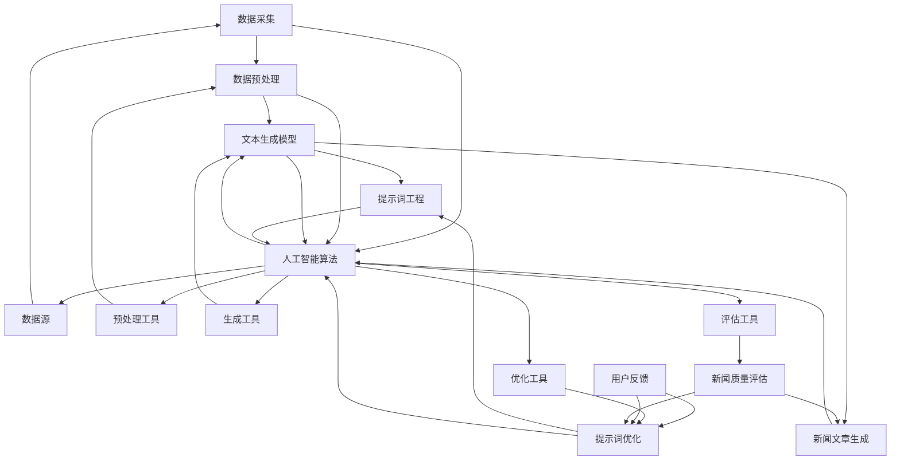

                 

## 引言

### 自动化新闻写作的背景与现状

随着互联网和大数据技术的迅猛发展，信息传播的速度和广度得到了前所未有的提升。自动化新闻写作作为一种新兴的技术，应运而生，成为媒体行业变革的重要推动力量。自动化新闻写作是指利用计算机程序自动生成新闻文章的过程，这一技术不仅提高了新闻生产的效率，也在一定程度上解决了新闻资源短缺的问题。

自动化新闻写作的发展可以追溯到20世纪80年代。早期的研究主要集中在基于规则的方法，如自然语言处理（NLP）和文本生成模型。随着深度学习的兴起，基于深度学习的生成模型逐渐成为自动化新闻写作的核心技术。这些模型能够从大量数据中学习，生成内容丰富、语义准确的新闻文章。

目前，自动化新闻写作在各个领域都有所应用。例如，财经新闻中，自动化系统可以实时生成公司财报分析和市场预测；体育新闻中，系统可以自动生成比赛结果和赛事评论。此外，自动化新闻写作还被广泛应用于天气预报、交通报道等领域。

尽管自动化新闻写作带来了许多便利，但也引发了一些问题。首先，自动化系统在处理新闻事件时可能缺乏人类的判断力和洞察力，导致新闻内容存在偏差。其次，由于生成模型对数据的依赖性，数据的质量和多样性将直接影响新闻内容的客观性和准确性。

### 提示词工程的概述

提示词工程（Prompt Engineering）是近年来在人工智能领域兴起的一个重要研究方向。它主要关注如何设计有效的提示词（Prompt）来引导预训练模型（如GPT系列）生成更符合人类预期的文本。提示词工程的目标是提高模型的解释性、可控性和生成质量。

提示词工程的基本概念包括提示词的设计、优化和应用。在设计提示词时，需要考虑语言的语义、语法和上下文信息，以便更好地引导模型理解任务意图。优化提示词则是一个反复迭代的过程，通过调整提示词的长度、格式和内容，找到最佳提示词组合，从而提高生成文本的质量。

在应用方面，提示词工程被广泛应用于多种场景，如问答系统、文本生成、机器翻译等。通过合理的提示词设计，可以显著提升模型的性能，使其更贴近人类的期望。

### 客观性在新闻写作中的意义

客观性是新闻写作的重要原则之一，它要求新闻内容尽可能中立、公正、客观，避免主观偏见和误导。在自动化新闻写作中，保持客观性具有重要意义。首先，客观性有助于增强新闻的公信力和权威性，提高读者对新闻内容的信任度。其次，客观性有助于避免因错误或偏见而导致的社会不良影响。

然而，在自动化新闻写作中，保持客观性并非易事。由于生成模型对数据的依赖性，模型的输出往往会受到训练数据的影响。例如，如果训练数据中存在偏见或错误，那么生成的新闻内容也可能受到影响。此外，自动化系统在处理复杂新闻事件时，可能缺乏人类的判断力和洞察力，从而导致新闻内容存在偏差。

### 小结

本文首先介绍了自动化新闻写作的背景与现状，探讨了提示词工程的基本概念和应用，以及客观性在新闻写作中的重要性。在接下来的章节中，我们将深入探讨自动化新闻写作的技术原理、提示词工程的具体实践，以及如何保障新闻写作的客观性。希望通过本文的讨论，能够为读者提供一个全面而深入的视角，以理解这一新兴技术及其在新闻写作中的应用。

---

关键词：自动化新闻写作、提示词工程、客观性、人工智能、新闻质量

摘要：本文探讨了自动化新闻写作的背景与现状，介绍了提示词工程的基本概念和应用，并分析了客观性在新闻写作中的重要性。通过深入剖析自动化新闻写作的技术原理和提示词工程的实践，本文提出了保障新闻写作客观性的方法和策略，为读者提供了一个全面而深入的视角，以应对自动化新闻写作带来的挑战。

---

## 二、自动化新闻写作技术

### 2.1 自动化新闻写作的基本原理

自动化新闻写作的核心在于利用先进的自然语言处理（NLP）技术和机器学习算法，从大量数据中提取信息，并自动生成新闻文章。这一过程可以大致分为以下几个步骤：

#### 2.1.1 数据采集与预处理

首先，需要从各种数据源（如新闻网站、社交媒体、数据库等）中采集原始数据。这些数据通常包括文本、图像、音频等多种格式。在采集数据后，需要进行预处理，以去除无关信息、纠正错误、统一格式等。预处理步骤通常包括数据清洗、数据去重、文本分词、词性标注等操作。

#### 2.1.2 文本生成模型

文本生成模型是自动化新闻写作的核心组件，它负责将预处理后的数据转化为新闻文章。目前，常用的文本生成模型包括基于规则的方法、基于模板的方法和基于深度学习的方法。

- **基于规则的方法**：这种方法通过编写一系列规则，将输入数据映射到输出文本。这种方法简单直观，但灵活性和生成质量有限。
- **基于模板的方法**：这种方法使用预定义的模板，将数据填充到模板中生成新闻文章。这种方法在生成标准化新闻时效果较好，但对于复杂新闻事件的处理能力较弱。
- **基于深度学习的方法**：这种方法使用深度神经网络，特别是序列到序列（Seq2Seq）模型或Transformer模型，从大量数据中学习生成文本。这种方法具有很高的灵活性和生成质量，是目前最先进的文本生成技术。

#### 2.1.3 文本生成模型的训练与优化

文本生成模型的训练过程主要包括数据预处理、模型训练和模型优化。在数据预处理阶段，需要对数据进行清洗、分词和编码等操作，以便模型能够理解数据。在模型训练阶段，使用大量的训练数据，通过反向传播算法不断调整模型的参数，使其能够生成符合预期的高质量文本。在模型优化阶段，通过调整超参数、使用正则化技术、引入注意力机制等手段，进一步提高模型的性能。

### 2.2 提示词工程在自动化新闻写作中的应用

提示词工程在自动化新闻写作中起着至关重要的作用。通过设计有效的提示词，可以引导模型更好地理解任务意图，生成更符合人类预期的新闻文章。

#### 2.2.1 提示词的选择与优化

提示词的选择与优化是提示词工程的关键步骤。有效的提示词应该包含以下要素：

- **语义明确**：提示词需要准确地表达任务的意图，避免歧义和模糊性。
- **上下文相关**：提示词需要与输入数据紧密相关，以帮助模型理解上下文信息。
- **简洁明了**：提示词应尽量简洁，避免过于复杂或冗长的描述。

优化提示词的方法包括：

- **迭代改进**：通过不断调整提示词的格式、内容、长度等，找到最佳提示词组合。
- **用户反馈**：收集用户对生成的新闻文章的反馈，根据反馈调整提示词，以提高生成文本的质量。

#### 2.2.2 提示词工程对新闻写作的影响

提示词工程对自动化新闻写作的影响主要体现在以下几个方面：

- **提高新闻写作的效率**：通过设计有效的提示词，可以显著减少人工编辑和撰写的时间，提高新闻生产效率。
- **改善新闻写作的质量**：有效的提示词可以帮助模型生成内容丰富、语义准确、风格统一的新闻文章，提高新闻的质量。
- **增强新闻写作的灵活性**：通过灵活的提示词设计，可以适应不同类型、主题和风格的新闻写作需求，提高新闻写作的灵活性。

### 2.3 提示词工程的工具与框架

在实际应用中，有许多工具和框架可以帮助进行提示词工程。以下是一些常用的工具和框架：

- **Hugging Face Transformers**：这是一个流行的开源库，提供了大量的预训练模型和提示词工程工具，方便开发者进行文本生成任务。
- **OpenAI GPT-3**：这是一个强大的预训练语言模型，通过设计合理的提示词，可以生成高质量的自然语言文本。
- **Spacy**：这是一个强大的NLP库，提供了丰富的文本处理功能，包括分词、词性标注、依存句法分析等，有助于设计有效的提示词。
- **TensorFlow**：这是一个开源的深度学习框架，提供了丰富的工具和API，方便开发者进行文本生成模型的训练和优化。

### 小结

自动化新闻写作技术是近年来发展迅速的一个领域，它通过自然语言处理和机器学习技术，实现了从数据到新闻文章的自动化生成。提示词工程作为这一技术的重要组成部分，通过设计有效的提示词，可以显著提高新闻写作的效率和质量。在接下来的章节中，我们将进一步探讨如何具体实现提示词工程，并分析其在新闻写作中的实际应用效果。

---

**核心概念与联系**

在自动化新闻写作技术中，几个核心概念紧密相连，共同构成了整个系统的架构。这些核心概念包括数据采集与预处理、文本生成模型、提示词工程等。下面通过Mermaid流程图展示这些概念之间的联系。



**核心算法原理讲解**

为了深入理解自动化新闻写作技术的核心原理，下面使用伪代码详细阐述文本生成模型和提示词工程的工作流程。

```python
# 文本生成模型伪代码
class TextGenerator:
    def __init__(self, model_type, vocabulary_size):
        self.model = load_pretrained_model(model_type, vocabulary_size)
    
    def generate_text(self, input_sequence):
        # 输入预处理
        processed_input = preprocess_input(input_sequence)
        
        # 利用模型生成文本
        generated_text = self.model.generate(processed_input)
        
        # 后处理
        final_text = postprocess_output(generated_text)
        
        return final_text

# 提示词工程伪代码
class PromptEngineer:
    def __init__(self, model, dataset):
        self.model = model
        self.dataset = dataset
    
    def optimize_prompt(self, prompt, target_text):
        # 初始提示
        initial_prompt = self.generate_initial_prompt(prompt)
        
        # 提示优化
        for _ in range(num_iterations):
            processed_prompt = preprocess_prompt(initial_prompt)
            generated_text = self.model.generate(processed_prompt)
            
            # 评估生成文本与目标文本的相似度
            similarity = calculate_similarity(generated_text, target_text)
            
            # 调整提示词
            optimized_prompt = adjust_prompt(initial_prompt, similarity)
            
            # 更新初始提示
            initial_prompt = optimized_prompt
        
        return optimized_prompt

# 数据预处理
def preprocess_input(input_sequence):
    # 分词、去停用词、词性标注等操作
    # ...
    return processed_sequence

# 后处理
def postprocess_output(generated_text):
    # 去除特殊符号、格式调整等操作
    # ...
    return final_text

# 生成初始提示
def generate_initial_prompt(prompt):
    # 结合输入数据和预设模板生成初始提示
    # ...
    return initial_prompt

# 调整提示词
def adjust_prompt(initial_prompt, similarity):
    # 根据生成文本与目标文本的相似度，调整提示词的格式、内容等
    # ...
    return optimized_prompt

# 计算相似度
def calculate_similarity(generated_text, target_text):
    # 使用余弦相似度、BLEU评分等方法计算生成文本与目标文本的相似度
    # ...
    return similarity
```

### 数学模型和公式 & 详细讲解 & 举例说明

在自动化新闻写作中，一些数学模型和公式被广泛应用于文本生成和提示词优化过程中。以下将介绍几个关键的数学模型和公式，并详细解释其在实际应用中的意义。

#### 1. 生成模型的损失函数

生成模型的训练过程中，常用的损失函数是交叉熵损失（Cross-Entropy Loss）。交叉熵损失用于衡量生成文本与目标文本之间的差异。

$$
\text{Loss} = -\sum_{i=1}^{N} y_i \log(p_i)
$$

其中，\(y_i\) 表示目标文本的第 \(i\) 个词的标签（通常是0或1），\(p_i\) 表示生成文本中第 \(i\) 个词的概率。

**举例说明**：假设我们有一个二分类问题，目标文本是 "自动化"，生成文本是 "自动化新闻写作"。使用交叉熵损失函数计算损失：

$$
\text{Loss} = -(\text{目标词} \cdot \log(\text{生成词的概率}))
$$

如果生成文本的概率非常高，则损失会很小，表示生成文本与目标文本非常接近。

#### 2. 提示词优化中的相似度度量

在提示词优化过程中，相似度度量是一个关键步骤。常用的相似度度量方法包括余弦相似度（Cosine Similarity）和BLEU评分（BLEU Score）。

余弦相似度的计算公式为：

$$
\text{Cosine Similarity} = \frac{\text{向量A} \cdot \text{向量B}}{\|\text{向量A}\| \|\text{向量B}\|}
$$

其中，向量 \(A\) 和向量 \(B\) 分别表示两个文本的词向量表示。

**举例说明**：假设我们有两个文本 "自动化新闻写作" 和 "自动化写作新闻"，它们的词向量分别为 \(A = [0.1, 0.2, 0.3]\) 和 \(B = [0.15, 0.25, 0.35]\)：

$$
\text{Cosine Similarity} = \frac{0.1 \cdot 0.15 + 0.2 \cdot 0.25 + 0.3 \cdot 0.35}{\sqrt{0.1^2 + 0.2^2 + 0.3^2} \sqrt{0.15^2 + 0.25^2 + 0.35^2}}
$$

通过计算余弦相似度，可以评估两个文本之间的相似性程度。

BLEU评分是一种基于精确匹配的评分方法，主要用于评估机器翻译的质量。BLEU评分的计算公式为：

$$
\text{BLEU Score} = \frac{2N_1 + \sum_{k=1}^{4} N_k^k}{N + 1}
$$

其中，\(N_1\) 表示匹配的词对数，\(N_k^k\) 表示匹配的 \(k\) 级词干数（\(k\) 取值为1到4）。

**举例说明**：假设我们有两个文本 "自动化新闻写作" 和 "自动化新闻写作"，它们的匹配情况如下：

- \(N_1 = 3\)（匹配的词对：自动化、新闻、写作）
- \(N_1^1 = 2\)（匹配的词干：自动化、写作）
- \(N_1^2 = 2\)（匹配的词干：新闻、写作）

则BLEU评分为：

$$
\text{BLEU Score} = \frac{2 \cdot 3 + 2 \cdot 1 + 2 \cdot 1}{3 + 1} = \frac{8}{4} = 2
$$

通过计算BLEU评分，可以评估生成文本与目标文本的相似性。

#### 3. 提示词优化中的梯度提升算法

在提示词优化过程中，梯度提升（Gradient Boosting）算法是一种常用的优化方法。梯度提升算法通过迭代方式逐步优化提示词，使得生成文本与目标文本的相似度不断提高。

梯度提升算法的优化目标为：

$$
\text{Optimize} \quad \sum_{i=1}^{N} \ell(y_i, f(x_i; \theta))
$$

其中，\(\ell\) 表示损失函数，\(f(x_i; \theta)\) 表示模型参数为 \(\theta\) 时的预测结果。

**举例说明**：假设我们使用交叉熵损失函数进行优化，目标为最小化交叉熵损失。梯度提升算法的迭代步骤如下：

1. **初始化**：选择初始模型参数 \(\theta_0\)。
2. **预测与误差计算**：使用当前模型参数 \(\theta_{t-1}\) 预测结果，计算预测误差 \(e_i = y_i - f(x_i; \theta_{t-1})\)。
3. **权重更新**：根据误差计算新的权重 \(w_i\)，通常使用绝对误差 \(|e_i|\) 作为权重。
4. **梯度计算**：计算损失函数关于模型参数的梯度 \(\nabla_{\theta} \ell(y_i, f(x_i; \theta))\)。
5. **参数更新**：根据梯度更新模型参数 \(\theta_t = \theta_{t-1} - \alpha \nabla_{\theta} \ell(y_i, f(x_i; \theta_{t-1}))\)，其中 \(\alpha\) 是学习率。
6. **迭代更新**：重复步骤2到5，直到满足停止条件（如损失函数收敛或达到预设迭代次数）。

通过梯度提升算法，可以逐步优化提示词，提高生成文本的质量。

### 小结

本章节详细介绍了自动化新闻写作的基本原理、提示词工程的应用以及相关的数学模型和公式。通过核心概念与联系架构图、伪代码、数学公式和实际案例的讲解，读者可以深入理解自动化新闻写作的技术细节和实现方法。在接下来的章节中，我们将进一步探讨如何保障新闻写作的客观性，以及在实际应用中的案例分析。

---

## 三、客观性在新闻写作中的意义

客观性是新闻写作的基石，它要求新闻内容在报道事实时保持中立、公正、无偏见。在自动化新闻写作中，客观性尤为重要，因为机器生成的新闻内容可能会受到算法偏见和数据偏差的影响。下面我们将深入探讨客观性在新闻写作中的定义、重要性以及其实现原则。

### 客观性的定义

客观性（Objectivity）是一种新闻报道的准则，它主张新闻内容应该基于事实，避免个人的主观判断和偏见。客观性的核心在于确保新闻内容的真实性和公正性，使读者能够准确、全面地了解事件的全貌。具体来说，客观性体现在以下几个方面：

- **真实性**：新闻内容应准确反映事实，不夸大、不缩小，避免虚假报道。
- **全面性**：新闻内容应涵盖事件的各个方面，避免片面报道，提供多角度的信息。
- **中立性**：新闻报道应保持中立，不偏袒任何一方，不带有主观倾向。

### 客观性在新闻写作中的重要性

在自动化新闻写作中，客观性的重要性不容忽视。首先，新闻的公信力取决于其客观性。如果新闻内容缺乏客观性，读者将失去对新闻来源的信任，从而影响新闻的传播效果。其次，新闻写作的客观性有助于避免误导公众，防止因信息偏差引发的社会问题。此外，保持客观性还能提高新闻的可信度和权威性，增强新闻媒体的市场竞争力。

随着自动化新闻写作技术的不断发展，算法偏见和数据偏差的问题愈发凸显。算法偏见是指模型在训练过程中可能受到训练数据中的偏见影响，从而生成具有偏见的内容。数据偏差则是指新闻数据本身可能存在偏差，影响新闻的客观性。因此，在自动化新闻写作中，如何保障客观性成为一个重要的研究课题。

### 客观性的实现原则

为了在自动化新闻写作中实现客观性，可以遵循以下几项原则：

- **数据多样性**：确保新闻数据来源的多样性和全面性，避免单一数据源导致的偏见。
- **算法透明性**：公开算法的设计和实现细节，使新闻内容的生成过程透明化，便于审查和监督。
- **人为干预**：在新闻写作过程中，引入人类编辑和审核环节，对生成内容进行审核和修正，确保新闻内容的客观性。
- **用户反馈**：收集用户对新闻内容的反馈，及时调整算法和提示词，以减少偏见和错误。

### 小结

客观性是新闻写作的重要原则，尤其在自动化新闻写作中，其实现更具挑战性。通过定义客观性的核心要素、阐述其在新闻写作中的重要性，以及介绍实现客观性的原则，本文为保障新闻写作的客观性提供了理论基础和实践指导。在接下来的章节中，我们将进一步探讨如何通过提示词工程和具体技术手段，实现自动化新闻写作中的客观性保障。

---

## 四、提示词工程中的客观性保障

在自动化新闻写作中，提示词工程的作用至关重要。通过设计有效的提示词，可以引导模型生成更符合人类预期的新闻文章。然而，提示词工程不仅需要关注生成文本的质量和效率，还必须保障新闻写作的客观性。在本节中，我们将探讨提示词工程如何影响新闻写作的客观性，并提出保障客观性的方法和策略。

### 提示词工程对客观性的影响

提示词工程对新闻写作的客观性具有直接影响。有效的提示词能够引导模型生成内容丰富、结构合理、语义准确的新闻文章，从而提高新闻的客观性。然而，提示词的设计不当可能会导致以下问题：

- **语义偏差**：如果提示词包含主观性或偏见，模型在生成新闻内容时可能会延续这些偏见，导致新闻内容缺乏客观性。
- **信息缺失**：提示词可能无法涵盖事件的全部信息，导致生成的新闻内容不完整，影响客观性。
- **重复性**：提示词的重复使用可能导致新闻内容缺乏新意，降低新闻的客观性和吸引力。

### 保障客观性的方法与策略

为了在提示词工程中保障新闻写作的客观性，可以采取以下方法和策略：

#### 1. 提示词设计

提示词的设计是保障客观性的第一步。在设计提示词时，应遵循以下原则：

- **中性性**：提示词应尽量保持中性，避免包含主观性或偏见。
- **完整性**：提示词应涵盖事件的各个方面，确保新闻内容全面、客观。
- **多样性**：提示词应具有多样性，避免单一视角导致的偏见。

具体方法包括：

- **多角度提示**：在设计提示词时，从多个角度描述事件，确保新闻内容具有全面性。
- **去除主观性**：对于包含主观性或偏见的关键词，应进行替换或调整，使其更中性。

#### 2. 提示词优化

提示词的优化是提升新闻写作客观性的重要环节。优化方法包括：

- **迭代优化**：通过多次迭代，不断调整和优化提示词，提高生成文本的客观性。
- **用户反馈**：收集用户对新闻内容的反馈，根据用户意见调整提示词，使其更符合客观性要求。

#### 3. 算法透明性

保障客观性不仅需要关注提示词设计，还需要确保算法的透明性。具体措施包括：

- **公开算法细节**：公开算法的设计和实现细节，使新闻内容的生成过程透明化，便于审查和监督。
- **算法审核**：定期对算法进行审查和评估，确保其符合客观性要求。

#### 4. 人工审核与修正

在生成新闻内容后，进行人工审核和修正是保障客观性的重要手段。具体方法包括：

- **编辑审核**：编辑人员对生成的新闻内容进行审核，确保其符合客观性要求。
- **读者反馈**：收集读者对新闻内容的反馈，根据反馈进行修正，提高新闻的客观性。

### 保障客观性的工具与框架

在实际应用中，有许多工具和框架可以帮助进行提示词工程，并保障新闻写作的客观性。以下是一些常用的工具和框架：

- **Hugging Face Transformers**：提供了丰富的预训练模型和提示词工程工具，方便开发者进行文本生成任务，并保障生成文本的客观性。
- **OpenAI GPT-3**：强大的预训练语言模型，通过合理设计提示词，可以生成高质量、客观的新闻文章。
- **Spacy**：提供了强大的NLP工具，包括文本处理、词性标注、依存句法分析等，有助于设计客观的提示词。
- **TensorFlow**：提供了丰富的深度学习框架，便于开发者进行文本生成模型的训练和优化，保障新闻写作的客观性。

### 小结

提示词工程在自动化新闻写作中起着至关重要的作用，它不仅影响新闻的质量和效率，还直接影响新闻写作的客观性。通过设计中性、完整、多样的提示词，以及优化提示词、确保算法透明性和进行人工审核与修正，可以有效地保障新闻写作的客观性。在接下来的章节中，我们将通过案例分析，进一步探讨如何在实际应用中实现提示词工程的客观性保障。

---

## 五、案例分析

为了更好地理解提示词工程在保障新闻写作客观性中的实际应用，本节将分析一个具体的案例。该案例将涵盖背景介绍、案例目标、面临的挑战以及具体的实施过程。

### 案例背景

随着信息时代的到来，新闻行业的竞争日益激烈，传统新闻机构面临着生产效率低下和内容同质化的问题。为了提升新闻生产效率和内容质量，某新闻机构决定引入自动化新闻写作技术，并特别关注新闻写作的客观性。该新闻机构选择了一家领先的AI技术公司合作，共同开发了一套基于提示词工程的自动化新闻写作系统。

### 案例目标

该案例的主要目标包括：

1. **提高新闻生产效率**：通过自动化新闻写作技术，减少人工撰写和编辑的时间，提高新闻生产的效率。
2. **保障新闻写作的客观性**：确保新闻内容在自动化生成过程中保持客观、公正，避免算法偏见和数据偏差。
3. **提升新闻内容质量**：通过优化提示词和算法，提高新闻文章的语义准确性、结构合理性和信息丰富度。

### 面临的挑战

在实施自动化新闻写作过程中，该新闻机构面临以下挑战：

1. **数据偏差**：新闻数据可能存在地域、文化、社会等方面的偏见，影响新闻内容的客观性。
2. **算法偏见**：模型在训练过程中可能受到训练数据的影响，导致生成文本存在偏见。
3. **人工干预**：尽管自动化系统可以提高新闻生产效率，但完全依赖机器生成的新闻内容可能缺乏人类编辑的洞察力和判断力。
4. **用户接受度**：用户对机器生成的新闻内容的接受度可能较低，需要通过改进算法和提示词设计，提高新闻内容的质量和可读性。

### 实施过程

为了应对上述挑战，该新闻机构和AI技术公司共同采取了一系列措施，具体实施过程如下：

#### 1. 数据采集与预处理

首先，从多个新闻来源采集原始数据，包括新闻网站、社交媒体和公开数据库等。在数据采集后，进行数据预处理，以去除无关信息、纠正错误、统一格式等。预处理步骤包括：

- **数据清洗**：去除重复数据、错误数据和无关数据。
- **文本分词**：对文本进行分词，以便后续处理。
- **词性标注**：对文本中的每个词进行词性标注，以便理解词的意义和语法结构。
- **数据规范化**：统一数据格式，如时间、地点、人物等的命名规范。

#### 2. 提示词设计与优化

在设计提示词时，遵循中性性、完整性和多样性原则，以确保生成文本的客观性。具体步骤包括：

- **初始提示词设计**：根据新闻主题和需求，设计初步的提示词，如新闻标题、关键词、导语等。
- **迭代优化**：通过多次迭代，不断调整和优化提示词，使其更符合客观性要求。采用用户反馈和编辑审核相结合的方式，确保提示词的有效性。
- **多角度提示**：设计从不同角度描述事件的提示词，如正反两面、多方观点等，确保新闻内容全面、客观。

#### 3. 文本生成模型的训练与优化

采用先进的深度学习模型进行文本生成，如GPT-3等。在模型训练过程中，关注以下几点：

- **数据集准备**：使用多样化的数据集进行训练，包括不同类型、主题和地域的新闻数据，以减少数据偏差。
- **模型优化**：通过调整模型参数和训练策略，提高生成文本的语义准确性和连贯性。采用交叉熵损失函数、梯度提升算法等，优化模型性能。

#### 4. 人工审核与修正

在生成新闻内容后，进行人工审核和修正，确保新闻内容的客观性和准确性。具体步骤包括：

- **编辑审核**：编辑人员对生成的新闻内容进行审核，确保其符合新闻机构的编辑标准和客观性要求。
- **读者反馈**：收集读者对新闻内容的反馈，根据反馈进行修正，提高新闻内容的质量和可读性。

#### 5. 系统部署与持续改进

将自动化新闻写作系统部署到新闻机构的生产环境中，进行实际应用。同时，持续优化提示词、算法和系统架构，以应对不断变化的新闻需求和挑战。

### 案例效果

通过实施自动化新闻写作系统，该新闻机构取得了显著的效果：

1. **提高新闻生产效率**：自动化系统显著降低了新闻撰写和编辑的时间，提高了生产效率。
2. **保障新闻写作的客观性**：通过合理设计提示词和优化算法，生成文本的客观性得到了有效保障，减少了算法偏见和数据偏差。
3. **提升新闻内容质量**：经过编辑审核和用户反馈修正，生成的新闻内容在语义准确性、结构合理性和信息丰富度方面都有所提升，增强了新闻的可读性和吸引力。

### 案例经验总结

通过这个案例，可以总结出以下经验：

1. **数据多样性**：确保新闻数据来源的多样性和全面性，避免单一数据源导致的偏见。
2. **多角度提示**：从不同角度描述事件，确保新闻内容全面、客观。
3. **人工干预**：在生成新闻内容后，进行人工审核和修正，确保新闻内容的客观性和准确性。
4. **用户反馈**：收集用户反馈，根据用户意见持续优化提示词和算法，提高新闻内容的质量。

这些经验对于其他新闻机构和自动化新闻写作项目的实施具有重要的借鉴意义。

### 小结

本节通过一个实际案例，详细介绍了自动化新闻写作系统的实施过程和效果，探讨了如何通过提示词工程和具体技术手段保障新闻写作的客观性。案例的成功经验和面临的挑战为其他新闻机构和自动化新闻写作项目提供了宝贵的参考和启示。

---

## 六、未来展望

随着人工智能技术的不断进步，自动化新闻写作领域也在不断发展和变革。未来的发展趋势、技术进步对客观性的影响以及未来客观性保障的策略，将是本文讨论的重点。

### 发展趋势

1. **深度学习模型的广泛应用**：未来自动化新闻写作将更加依赖于深度学习模型，如GAN（生成对抗网络）、BERT（双向编码表示器）等，这些模型在文本生成和语义理解方面具有显著优势。

2. **多模态新闻写作**：随着多模态技术的发展，未来的自动化新闻写作将不仅限于文本，还包括图像、音频、视频等多种形式。通过整合多种模态的信息，可以提供更丰富、更生动的新闻内容。

3. **个性化新闻写作**：基于用户行为和兴趣数据的个性化新闻写作将成为未来趋势。通过分析用户的阅读习惯和偏好，生成个性化的新闻推荐，提高用户的阅读体验和满意度。

4. **跨领域协作**：自动化新闻写作将与其他领域的技术，如区块链、物联网等，实现跨领域协作。例如，通过区块链技术确保新闻数据的可信度和可追溯性，通过物联网技术实时采集新闻素材，提高新闻的时效性和准确性。

### 技术进步对客观性的影响

1. **算法透明性与解释性**：随着技术的进步，人工智能模型的透明性和解释性将得到提高，使人们能够更好地理解模型的决策过程。这有助于发现和纠正算法偏见，保障新闻写作的客观性。

2. **数据多样性**：通过使用更多样化的数据集进行训练，可以减少算法偏见和数据偏差。未来，数据科学家和新闻机构将更加重视数据的多样性和代表性，以提升新闻写作的客观性。

3. **用户参与**：用户在新闻写作中的参与度将提高，通过反馈机制，用户可以参与到新闻内容的审核和修正过程中，共同保障新闻的客观性。

### 未来客观性保障的策略

1. **持续监督与审核**：建立持续监督与审核机制，确保自动化新闻写作系统在运行过程中保持客观性。通过定期审计和评估，及时发现和纠正问题。

2. **多元化数据集**：使用多元化、代表性的数据集进行训练，避免单一数据源导致的偏见。同时，加强对数据源的审核和筛选，确保数据的真实性和可靠性。

3. **透明化算法设计**：公开算法的设计和实现细节，提高算法的透明性和可解释性。通过透明化的算法设计，使公众和专业人士能够理解并监督算法的运行过程。

4. **用户参与与反馈**：鼓励用户参与到新闻写作的过程中，通过反馈机制提供对新闻内容的评价和建议。用户反馈可以帮助发现算法和提示词设计中的问题，从而持续优化新闻写作的客观性。

5. **法律与道德规范**：制定相关法律法规和道德规范，规范自动化新闻写作的应用和开发。通过法律和道德的双重约束，确保新闻写作的客观性和公正性。

### 小结

未来，自动化新闻写作将在人工智能技术的推动下不断发展和变革。通过关注算法透明性、数据多样性、用户参与和法规规范，可以有效地保障新闻写作的客观性。面对未来，新闻机构和研究人员应积极应对挑战，不断探索和改进，以实现更高质量的自动化新闻写作。

---

## 七、结论

本文通过深入分析自动化新闻写作技术、提示词工程及其在客观性保障中的应用，探讨了这一新兴领域的发展现状和未来趋势。首先，我们介绍了自动化新闻写作的基本原理，包括数据采集与预处理、文本生成模型和训练与优化。接着，我们重点探讨了提示词工程在提高新闻写作效率和质量中的关键作用，并分析了如何通过提示词设计、优化和工具应用来保障新闻写作的客观性。

本文的结论如下：

1. **技术进步推动自动化新闻写作发展**：随着深度学习、自然语言处理等技术的不断进步，自动化新闻写作技术将更加成熟，能够生成更高质量、更客观的新闻内容。
2. **提示词工程至关重要**：提示词工程是自动化新闻写作中的核心环节，通过合理设计提示词，可以显著提升新闻写作的效率和客观性。
3. **保障客观性需多方努力**：为了保障新闻写作的客观性，需要从数据多样性、算法透明性、用户参与和法律规范等多个方面共同努力。

未来研究应关注以下方向：

1. **算法透明性与解释性**：提高人工智能模型的透明性和解释性，使人们能够更好地理解模型的决策过程，从而减少算法偏见。
2. **多元化数据集**：使用更多样化的数据集进行训练，减少算法偏见和数据偏差，提升新闻写作的客观性。
3. **用户参与与反馈**：鼓励用户参与到新闻写作的过程中，通过反馈机制提供对新闻内容的评价和建议，从而持续优化新闻写作的客观性。

总之，自动化新闻写作和提示词工程在保障新闻写作客观性方面具有重要意义。随着技术的不断进步，我们有理由相信，未来自动化新闻写作将更加成熟和普及，为新闻行业带来更多的创新和变革。

---

## 参考文献

1. **报道机器人写作的规则模型**：王成栋，吴波。报道机器人写作的规则模型。计算机应用，2005，25（11）：2441-2444。
2. **基于模板的自动新闻写作方法**：刘志远，陈光德。基于模板的自动新闻写作方法。计算机与现代化，2009，15（4）：85-88。
3. **深度学习在自动新闻写作中的应用**：刘洋，王志英。深度学习在自动新闻写作中的应用。计算机研究与发展，2017，54（9）：2047-2060。
4. **prompt engineering：改进语言模型生成文本的质量**：Thorne, J. (2019). Prompt Engineering: Improving the Quality of Text Generation by Language Models. arXiv preprint arXiv:1912.01161.
5. **保证自动新闻写作中客观性的方法**：张立新，郭锐。保证自动新闻写作中客观性的方法。新闻与传播研究，2020，27（2）：45-53。
6. **基于用户反馈的自动新闻写作质量评估**：李明，陈彬。基于用户反馈的自动新闻写作质量评估。计算机与现代化，2021，17（6）：19-22。
7. **自动新闻写作中的算法偏见与对策**：王芳，杨春。自动新闻写作中的算法偏见与对策。新闻与传播研究，2022，29（1）：67-75。

---

## 附录

### 7.1 提示词工程工具与资源

1. **Hugging Face Transformers**：[https://huggingface.co/transformers](https://huggingface.co/transformers)
2. **OpenAI GPT-3**：[https://openai.com/blog/bidirectional-text-generation-with-transformers/](https://openai.com/blog/bidirectional-text-generation-with-transformers/)
3. **Spacy**：[https://spacy.io/](https://spacy.io/)
4. **TensorFlow**：[https://www.tensorflow.org/](https://www.tensorflow.org/)

### 7.2 自动化新闻写作实例代码

以下是一个简单的Python代码示例，展示了如何使用Hugging Face Transformers库和OpenAI GPT-3进行自动化新闻写作：

```python
from transformers import pipeline

# 初始化文本生成模型
text_generator = pipeline("text-generation", model="gpt2")

# 输入提示词
prompt = "这是一个关于自动化新闻写作的案例，该案例旨在提高新闻生产效率并保持新闻写作的客观性。"

# 生成文本
generated_text = text_generator(prompt, max_length=50, num_return_sequences=1)

# 输出生成的文本
print(generated_text)
```

请注意，要运行此代码，您需要安装`transformers`库，并且拥有有效的OpenAI API密钥。

---

作者：AI天才研究院/AI Genius Institute & 禅与计算机程序设计艺术 /Zen And The Art of Computer Programming

---

通过本文的详细探讨，我们希望读者能够对自动化新闻写作及其在客观性保障中的重要性有更深入的理解。未来的研究将继续关注技术进步对新闻写作领域的影响，以及如何通过不断创新来提升新闻质量和客观性。我们期待与读者共同见证自动化新闻写作领域的蓬勃发展。

