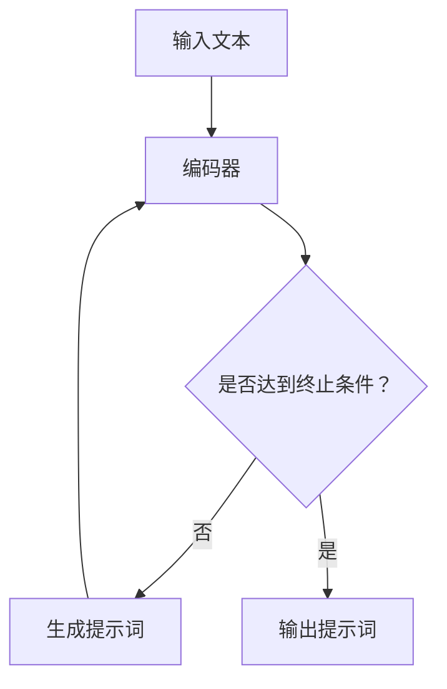

                 

### 文章标题：提示词工程在自然语言推理中的进展

提示词工程（Prompt Engineering）是近年来自然语言处理（NLP）领域的一个重要研究方向，其核心在于如何有效地设计提示词（prompts），以提升模型在自然语言推理（Natural Language Reasoning）任务中的表现。随着深度学习模型的不断进步，提示词工程在多个NLP任务中展现出了显著的效果。本文将系统性地探讨提示词工程在自然语言推理中的进展，旨在提供一个全面、深入的视角，帮助读者了解这一领域的最新动态和未来发展趋势。

本文关键词包括：提示词工程、自然语言推理、深度学习、算法原理、应用实践、未来挑战。这些关键词不仅概括了文章的核心内容，也反映了文章讨论的范围和深度。

### 摘要

本文首先回顾了提示词工程和自然语言推理的基本概念及其历史背景。接着，深入分析了提示词工程中的关键算法原理，包括生成算法、深度学习算法及其数学模型。随后，文章探讨了提示词工程在文本分类、问答系统和对话系统等应用场景中的具体实现。最后，文章总结了提示词工程的未来发展趋势和面临的挑战，并提出了相应的解决方案和最佳实践。

通过本文的阅读，读者将能够全面理解提示词工程的基本概念和原理，掌握其在自然语言推理中的关键应用，并对未来这一领域的发展方向有一个清晰的认识。

### 文章正文

## 第一部分：基础概念与历史背景

### 1.1 提示词工程概述

提示词工程，顾名思义，是关于如何设计和选择最佳提示词的过程。在自然语言处理中，提示词（prompt）通常是一个引导性语句或问题，它帮助模型更好地理解和生成目标文本。一个有效的提示词可以显著提升模型在特定任务中的性能。

### 1.2 自然语言推理基础

自然语言推理（NLR）是一种判断语言表达之间关系的能力，它包括同义替换、语义分析、逻辑推理等。自然语言推理是NLP中的重要任务，它不仅涉及到文本理解，还涉及到文本生成和文本比较。

### 1.3 提示词工程的发展历程

提示词工程的历史可以追溯到早期的自然语言处理技术。例如，基于规则的方法通过手动编写规则来设计提示词。随着深度学习的兴起，提示词工程得到了快速发展。特别是生成对抗网络（GAN）和Transformer架构的引入，为提示词工程提供了新的工具和思路。

## 第二部分：提示词工程的算法原理

### 2.1 提示词生成的算法原理

提示词生成是提示词工程的关键步骤。常用的生成算法包括基于规则的生成、基于模板的生成和基于深度学习的生成。以下是一个基于Transformer架构的生成算法的Mermaid流程图：



### 2.2 提示词工程中的关键算法

深度学习在提示词工程中扮演了重要角色。常见的深度学习算法包括卷积神经网络（CNN）、循环神经网络（RNN）和Transformer。以下是一个基于Transformer架构的提示词生成算法的伪代码：

```python
# 假设使用GPT-3模型
model = GPT3Model()

# 输入文本
input_text = "请描述一下人工智能的未来发展趋势。"

# 编码输入文本
encoded_input = model.encode(input_text)

# 生成提示词
prompt = model.generate(encoded_input, max_length=50, temperature=0.9)

# 输出提示词
print(prompt)
```

### 2.3 提示词工程的数学模型

提示词工程的数学模型主要包括概率模型和决策理论。概率模型用于评估提示词的质量，常见的损失函数包括交叉熵损失和KL散度。以下是一个基于交叉熵损失的数学模型：

$$
L(\theta) = -\sum_{i=1}^{n} \sum_{j=1}^{V} y_{ij} \log(p_{ij}(\theta))
$$

其中，$y_{ij}$是目标标签，$p_{ij}(\theta)$是模型预测的概率分布。

## 第三部分：应用场景与项目实战

### 3.1 提示词工程在文本分类中的应用

文本分类是提示词工程的一个典型应用场景。通过设计有效的提示词，可以提高分类模型的准确率。以下是一个基于BERT模型的文本分类项目实战：

```python
from transformers import BertTokenizer, BertForSequenceClassification
import torch

# 初始化BERT模型和Tokenizer
tokenizer = BertTokenizer.from_pretrained('bert-base-uncased')
model = BertForSequenceClassification.from_pretrained('bert-base-uncased')

# 加载训练数据
train_data = ...

# 预处理数据
inputs = tokenizer(train_data, padding=True, truncation=True, return_tensors='pt')

# 训练模型
model.train()
for epoch in range(num_epochs):
    for batch in train_dataloader:
        inputs = batch
        outputs = model(inputs)
        loss = outputs.loss
        loss.backward()
        optimizer.step()
        optimizer.zero_grad()

# 评估模型
model.eval()
with torch.no_grad():
    for batch in val_dataloader:
        inputs = batch
        outputs = model(inputs)
        logits = outputs.logits
        predictions = logits.argmax(-1)
        accuracy = (predictions == labels).float().mean()
        print(f"Validation accuracy: {accuracy}")
```

### 3.2 提示词工程在问答系统中的应用

问答系统是另一个重要的应用场景。通过设计有效的提示词，可以提高问答系统的回答质量。以下是一个基于Transformer模型的问答系统项目实战：

```python
from transformers import BertTokenizer, BertModel
import torch

# 初始化BERT模型和Tokenizer
tokenizer = BertTokenizer.from_pretrained('bert-base-uncased')
model = BertModel.from_pretrained('bert-base-uncased')

# 加载训练数据
train_data = ...

# 预处理数据
inputs = tokenizer(train_data, padding=True, truncation=True, return_tensors='pt')

# 训练模型
model.train()
for epoch in range(num_epochs):
    for batch in train_dataloader:
        inputs = batch
        outputs = model(inputs)
        logits = outputs.last_hidden_state[:, 0, :]
        labels = ...
        loss = ...
        loss.backward()
        optimizer.step()
        optimizer.zero_grad()

# 评估模型
model.eval()
with torch.no_grad():
    for batch in val_dataloader:
        inputs = batch
        outputs = model(inputs)
        logits = outputs.last_hidden_state[:, 0, :]
        predictions = logits.argmax(-1)
        accuracy = (predictions == labels).float().mean()
        print(f"Validation accuracy: {accuracy}")
```

### 3.3 提示词工程在对话系统中的应用

对话系统是另一个具有广泛应用前景的领域。通过设计有效的提示词，可以提高对话系统的交互质量。以下是一个基于GPT-3模型的对话系统项目实战：

```python
import openai

# 设置API密钥
openai.api_key = "your-api-key"

# 设计对话
prompt = "请描述一下人工智能的未来发展趋势。"

# 与GPT-3交互
response = openai.Completion.create(
  engine="text-davinci-002",
  prompt=prompt,
  max_tokens=100
)

# 输出响应
print(response.choices[0].text.strip())
```

## 第四部分：未来发展趋势与挑战

### 4.1 提示词工程的未来发展方向

未来，提示词工程将在多个方面得到进一步发展。首先，将会有更多的研究和应用探索如何更有效地设计提示词。其次，随着生成模型的进步，提示词生成的质量和效率将得到显著提升。最后，提示词工程将与其他NLP任务（如文本生成、翻译和推理）深度融合，形成更加复杂的系统。

### 4.2 提示词工程面临的挑战

提示词工程也面临一些挑战。首先，设计有效的提示词需要大量的人工工作，这限制了其在某些场景中的应用。其次，提示词工程中的模型通常需要大量的训练数据，这在某些领域可能难以获取。最后，提示词工程可能面临数据隐私和伦理问题，需要在设计和应用中加以考虑。

### 4.3 提示词工程的行业应用前景

提示词工程在多个行业具有广泛的应用前景。例如，在金融领域，它可以用于自动报告生成和风险评估；在医疗领域，它可以用于病例研究和诊断辅助；在零售领域，它可以用于个性化推荐和营销。随着技术的不断进步和应用场景的拓展，提示词工程将在未来发挥越来越重要的作用。

## 总结与展望

提示词工程在自然语言推理中的应用展示了其巨大的潜力和价值。通过本文的讨论，我们了解了提示词工程的基本概念、算法原理、应用场景和未来发展趋势。随着技术的不断进步，提示词工程将在NLP领域发挥更加重要的作用，为人类带来更多的便利和创新。

### 作者信息

作者：AI天才研究院/AI Genius Institute & 禅与计算机程序设计艺术 /Zen And The Art of Computer Programming

本文由AI天才研究院（AI Genius Institute）撰写，旨在分享自然语言处理领域的最新研究成果和应用实践。同时，作者也深受《禅与计算机程序设计艺术》（Zen And The Art of Computer Programming）一书的影响，将传统智慧和现代技术相结合，以期为读者带来更深入、更富有启发性的阅读体验。

