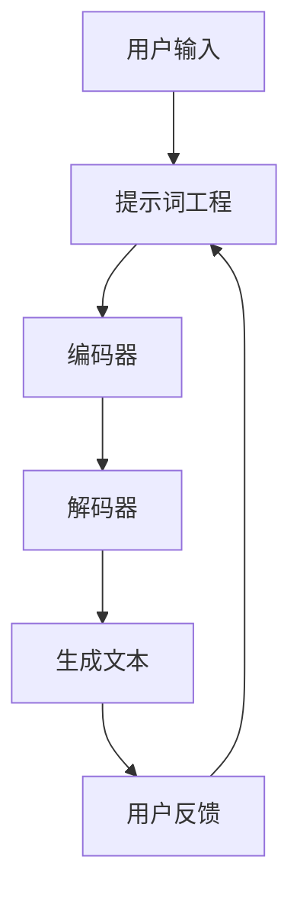
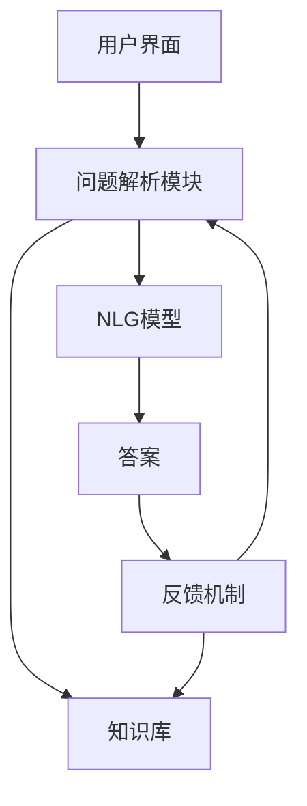
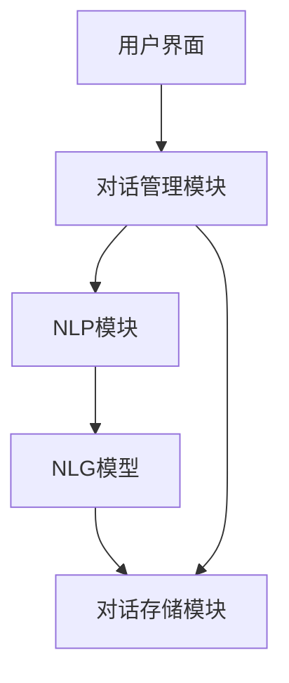
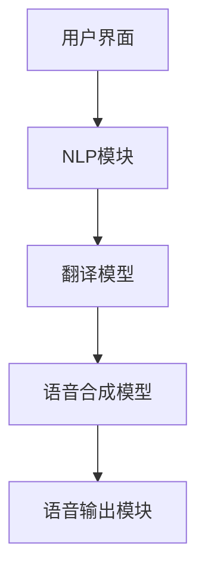

                 

### 第1章：自然语言生成概述

#### 1.1 自然语言生成的重要性

自然语言生成（Natural Language Generation，NLG）是人工智能领域的一个重要分支，它旨在使计算机能够自动生成人类可理解的自然语言文本。NLG技术具有重要的现实意义和应用价值，其主要体现在以下几个方面：

1. **提高生产效率**：通过NLG技术，可以自动化生成大量的文本内容，如新闻报道、商业报告、技术文档等，从而大大提高生产效率，降低人力成本。

2. **个性化服务**：NLG技术能够根据用户的需求和偏好生成个性化的文本内容，如定制化的新闻推送、个性化教育材料等，提升用户体验。

3. **辅助决策**：在商业、医疗、金融等领域，NLG技术可以辅助专业人员生成分析报告、预测报告等，提供决策支持。

4. **跨语言交流**：NLG技术可以实现不同语言之间的自动翻译和交流，促进全球化交流与合作。

#### 1.2 提示词工程的概念

提示词工程（Prompt Engineering）是NLG领域中的一项关键技术。它涉及到如何设计和使用提示词来引导和优化NLG模型的生成过程。提示词工程的核心目的是：

1. **明确指示**：通过设计具有明确指示性的提示词，可以确保NLG模型生成的内容符合预期目标。

2. **提供上下文**：提示词可以提供丰富的上下文信息，帮助模型更好地理解和生成相关内容。

3. **优化生成质量**：通过调整和优化提示词，可以提升NLG模型生成文本的质量和相关性。

在NLG系统中，提示词通常作为输入信息，用于引导模型的生成过程。有效的提示词设计可以显著提高NLG系统的性能和应用效果。

接下来，我们将进一步探讨NLG的核心概念、相关技术和提示词工程的设计策略。通过逐步分析，我们将深入理解NLG系统的工作原理和实现方法。

## 第1章：自然语言生成概述

### 1.3 核心概念与联系

#### 1.3.1 自然语言生成（NLG）

自然语言生成（Natural Language Generation，NLG）是计算机科学和人工智能领域的一个分支，旨在开发能够自动生成自然语言文本的系统。NLG技术能够模拟人类语言生成过程，生成具有人类语言特点的文本，广泛应用于自动化新闻撰写、对话系统、自动客服、文本摘要、语音合成等领域。

#### 1.3.2 提示词（Prompt）

提示词（Prompt）是NLG系统中的一个关键概念，它指的是用于引导NLG模型生成特定类型文本的输入信息。提示词通常包含目标文本的一部分、上下文信息、明确的指示或特定的问题。一个有效的提示词应该简洁、明确，能够提供足够的上下文信息，同时避免过度限制模型的生成能力。

#### 1.3.3 模型架构

在NLG系统中，模型架构是核心组成部分，决定了系统生成文本的质量和效率。以下是一些常用的模型架构：

1. **序列到序列（Seq2Seq）模型**：Seq2Seq模型是一种经典的NLG模型架构，由编码器（Encoder）和解码器（Decoder）两部分组成。编码器将输入序列编码为一个固定长度的向量，解码器则根据该向量生成输出序列。

2. **生成式模型**：生成式模型，如变分自编码器（VAE）和生成对抗网络（GAN），通过学习数据分布来生成新的文本。

3. **转换模型**：转换模型，如转换器-解码器（Translater-Decoder）框架，将输入文本转换为表示向量，然后通过解码器生成目标文本。

4. **预训练模型**：如GPT系列模型和BERT模型，通过大规模预训练，能够捕获语言的基本结构和语义信息，用于生成高质量的自然语言文本。

#### 1.3.4 关系架构

提示词工程在NLG系统中扮演着连接输入数据和输出文本的桥梁角色。具体来说，提示词与模型架构之间的联系如下：

1. **提示词引导模型生成**：提示词提供了明确的指示和上下文信息，指导模型生成符合预期的文本。

2. **模型优化提示词设计**：通过优化提示词的长度、格式和内容，可以提升模型的生成效果。

3. **反馈循环**：在实际应用中，可以通过用户反馈不断调整提示词，实现模型和提示词的协同优化。

为了更好地理解提示词工程在NLG系统中的角色，我们可以通过Mermaid流程图展示提示词与模型架构之间的相互作用：



在图中，用户输入经过提示词工程处理后，输入编码器，编码器将输入序列编码为固定长度的向量，然后解码器根据该向量生成文本，最终输出给用户。用户反馈通过反馈循环，用于进一步优化提示词工程。

## 核心算法原理讲解

### 2.1 提示词设计策略

#### 2.1.1 提示词的长度与多样性

提示词的长度和多样性是影响NLG系统性能的重要因素。提示词过长可能导致模型生成冗长或不相关的文本，而提示词过短则可能缺乏足够的上下文信息，导致生成文本质量不佳。因此，在提示词设计时，需要平衡提示词的长度和多样性。

1. **提示词长度**：

   - **短提示词**：适合于生成简短、明确的文本，如简短的新闻标题、标签等。

   - **长提示词**：适合于生成复杂、长篇的文本，如新闻报道、分析报告等。但需注意，过长的提示词可能导致生成文本冗余或不相关。

2. **提示词多样性**：

   - **主题多样性**：设计包含不同主题的提示词，可以使得模型生成文本更广泛、更全面。

   - **格式多样性**：通过设计不同格式的提示词，如问答式、列表式、总结式等，可以丰富模型的生成模式。

#### 2.1.2 提示词的格式与语法

提示词的格式和语法对NLG系统的生成效果有着重要影响。一个有效的提示词应该具有清晰的指令性，避免歧义和冗余。

1. **指令性**：

   - **明确指示**：提示词应明确指示模型生成的内容类型和目标，如“生成一篇关于人工智能技术的新闻文章”。

   - **避免歧义**：避免使用可能导致歧义的词汇或语法结构，如“这个星期三要开会”可能产生歧义，应明确说明是哪一天、哪个会议。

2. **语法结构**：

   - **简洁性**：提示词应尽量简洁，避免冗余的语法结构。

   - **一致性**：提示词应保持语法结构的一致性，以帮助模型更好地理解生成任务。

#### 2.1.3 提示词的调整与优化

在实际应用中，通过调整和优化提示词，可以显著提高NLG系统的性能。以下是一些常见的优化策略：

1. **自动调整提示词长度**：

   - **长度限制**：对提示词长度进行限制，避免过长的提示词导致生成文本冗余。

   - **动态调整**：根据生成文本的长度和质量，动态调整提示词的长度，实现最佳生成效果。

2. **添加上下文信息**：

   - **扩展上下文**：在提示词中添加更多相关的上下文信息，如背景知识、相关事件等，以帮助模型更好地理解生成任务。

   - **多来源上下文**：从多个来源获取上下文信息，如文本、图像、音频等，以丰富模型的输入信息。

3. **使用特定语法结构**：

   - **结构化提示词**：设计结构化的提示词，如树形结构、框架结构等，以明确模型生成文本的层次和逻辑关系。

   - **语法模板**：使用语法模板，如模板匹配、语法转换等，以规范模型的生成语法。

### 提示词设计策略总结

提示词设计策略是NLG系统成功的关键之一。通过合理设计提示词的长度、多样性和语法结构，以及不断调整和优化提示词，可以显著提高NLG系统的生成质量和性能。以下是一个示例，展示如何设计一个有效的提示词：

**提示词示例**：

```plaintext
请生成一篇关于人工智能技术在教育领域的应用的文章，要求内容涵盖以下三个方面：
1. 人工智能技术在教育中的应用场景
2. 人工智能技术对教育带来的变革
3. 人工智能技术在教育领域面临的挑战
文章应具备清晰的结构和逻辑，并引用最新的研究数据。
```

这个提示词包含了明确的指示、丰富的上下文信息，以及结构化的要求，能够有效引导模型生成高质量的文章。

## 数学模型和数学公式

### 3.1 序列到序列模型（Seq2Seq）

序列到序列（Seq2Seq）模型是自然语言生成（NLG）中的一种经典模型架构。它由编码器（Encoder）和解码器（Decoder）两个主要部分组成，能够将一个序列映射到另一个序列。在NLG应用中，编码器接收输入序列（如原始文本），解码器生成输出序列（如目标文本）。

#### 3.1.1 Encoder-Decoder框架

**Encoder**：编码器的功能是将输入序列编码成一个固定长度的向量，称为上下文向量（Context Vector）。这个过程通常通过神经网络实现，如循环神经网络（RNN）或长短期记忆网络（LSTM）。

```python
# Encoder 算法伪代码
def encoder(input_sequence):
    # 使用神经网络将输入序列编码为上下文向量
    context_vector = neural_network(input_sequence)
    return context_vector
```

**Decoder**：解码器的功能是根据编码器生成的上下文向量生成输出序列。解码器通常也使用神经网络，如RNN或LSTM，通过逐步生成每个单词或字符。

```python
# Decoder 算法伪代码
def decoder(context_vector, target_sequence):
    # 使用神经网络逐步生成输出序列
    output_sequence = neural_network(context_vector, target_sequence)
    return output_sequence
```

#### 3.1.2 对数似然损失函数

在Seq2Seq模型中，对数似然损失函数（Log-Likelihood Loss Function）是评估模型生成文本质量的标准。它计算模型生成的输出序列与实际输出序列之间的对数似然概率差异。损失函数的目的是最小化这个差异，从而提高模型生成的文本质量。

对数似然损失函数的数学表达式如下：

$$
L(\theta) = -\sum_{i=1}^{T} y_i \log p(\hat{y}_i|\theta)
$$

其中，$L(\theta)$ 是损失函数，$\theta$ 是模型参数，$y_i$ 是实际输出序列的词项，$\hat{y}_i$ 是模型预测的词项，$T$ 是输出序列的长度。

举例说明：

假设实际输出序列为 `[word1, word2, word3]`，模型预测的输出序列为 `[word2, word3, word4]`。对数似然损失函数的计算如下：

$$
L(\theta) = -\log p(\text{word1}|\theta) - \log p(\text{word2}|\theta) - \log p(\text{word3}|\theta)
$$

通常，对数似然损失函数会通过反向传播算法进行优化，以调整模型参数，提高生成文本的质量。

### 3.1.3 应用示例

以下是一个简单的Seq2Seq模型在NLG中的应用示例：

**问题**：给定一个英文句子“我昨天去了一家新开的咖啡馆”，生成对应的中文翻译。

**步骤**：

1. **编码器**：将英文句子编码为上下文向量。
2. **解码器**：根据上下文向量生成中文翻译序列。

```python
# 编码器代码
context_vector = encoder("I went to a new café yesterday.")

# 解码器代码
chinese_sentence = decoder(context_vector, "我昨天去了一家新开的咖啡馆。")
```

通过这种方式，Seq2Seq模型可以用于各种自然语言生成任务，如机器翻译、文本摘要、问答系统等。

## 项目实战

### 4.1 自动问答系统设计

自动问答系统是一种利用自然语言生成（NLG）技术的应用，它能够自动理解用户的问题，并生成相应的答案。在本节中，我们将探讨如何设计和实现一个基于NLG的自动问答系统。

#### 4.1.1 系统架构

自动问答系统的架构通常包括以下几个主要模块：

1. **用户界面**：用户通过网页、移动应用或其他界面与系统进行交互。
2. **问题解析模块**：接收用户输入的问题，并对其进行解析，提取关键信息。
3. **知识库**：存储大量的问题和答案，供系统查询和参考。
4. **NLG模型**：接收问题解析模块提取的关键信息，并生成相应的答案。
5. **反馈机制**：收集用户对答案的反馈，用于系统优化。

下面是一个自动问答系统的架构图：



#### 4.1.2 数据集准备与处理

为了训练NLG模型，我们需要一个包含大量问题和答案的数据集。数据集的来源可以包括公开的问答网站、论坛、在线客服日志等。数据集的预处理步骤包括：

1. **数据清洗**：去除数据中的噪声、重复条目和无关信息。
2. **实体识别**：识别和标注数据中的关键实体，如人名、地名、组织名等。
3. **文本规范化**：统一文本格式，如缩写、日期格式等。
4. **构建问题-答案对**：将问题和答案配对，形成训练数据。

#### 4.1.3 提示词设计

在自动问答系统中，提示词的设计至关重要。提示词应提供足够的上下文信息，以引导NLG模型生成准确的答案。以下是一些提示词设计策略：

1. **问题摘要**：提供问题的简短摘要，帮助模型理解问题的主要内容和背景。
2. **关键信息提取**：提取问题中的关键信息，如关键日期、地点、人名等。
3. **上下文信息**：添加与问题相关的上下文信息，如相关的背景知识、历史事件等。
4. **格式要求**：明确指示模型生成答案的格式，如列表、总结、详细描述等。

一个示例提示词如下：

```plaintext
请根据以下信息生成答案：
问题：纽约市的面积是多少？
关键信息：纽约市、面积
上下文信息：纽约市是美国最大的城市，位于纽约州。
格式要求：回答应包括具体的数字和单位。
```

#### 4.1.4 模型训练与评估

在自动问答系统中，通常采用序列到序列（Seq2Seq）模型进行训练。以下是一个简单的Seq2Seq模型训练过程：

1. **数据预处理**：将问题和答案转换为序列表示，通常使用词嵌入技术。
2. **模型初始化**：初始化编码器和解码器的权重。
3. **训练过程**：使用训练数据训练模型，通过反向传播算法更新模型参数。
4. **评估与优化**：使用验证集评估模型性能，根据评估结果调整模型结构或超参数。

#### 4.1.5 代码实现与分析

以下是一个简单的自动问答系统实现示例，使用Python和TensorFlow框架：

```python
# 导入必要的库
import tensorflow as tf
from tensorflow.keras.layers import Embedding, LSTM, Dense
from tensorflow.keras.models import Model

# 设置超参数
vocab_size = 10000
embedding_dim = 256
hidden_units = 1024

# 编码器模型
encoder_inputs = tf.keras.layers.Input(shape=(None,), dtype='int32')
encoder_embedding = Embedding(vocab_size, embedding_dim)(encoder_inputs)
encoder_lstm = LSTM(hidden_units, return_state=True)
_, state_h, state_c = encoder_lstm(encoder_embedding)
encoder_outputs = tf.keras.layers.Dense(hidden_units, activation='relu')(state_h)

# 解码器模型
decoder_inputs = tf.keras.layers.Input(shape=(None,), dtype='int32')
decoder_embedding = Embedding(vocab_size, embedding_dim)(decoder_inputs)
decoder_lstm = LSTM(hidden_units, return_sequences=True, return_state=True)
decoder_outputs, _, _ = decoder_lstm(decoder_embedding, initial_state=[state_h, state_c])
decoder_dense = Dense(vocab_size, activation='softmax')
decoder_outputs = decoder_dense(decoder_outputs)

# 模型集成
model = Model([encoder_inputs, decoder_inputs], decoder_outputs)

# 编译模型
model.compile(optimizer='adam', loss='categorical_crossentropy', metrics=['accuracy'])

# 模型训练
model.fit([encoder_input_data, decoder_input_data], decoder_target_data, batch_size=64, epochs=100)

# 模型评估与优化
# 使用验证集评估模型性能
# 根据评估结果调整模型结构或超参数
```

通过上述代码，我们可以训练一个基本的自动问答系统模型，生成对用户问题的回答。

#### 4.1.6 实际案例分析和详细讲解剖析

以下是一个实际案例，展示如何使用自动问答系统生成回答：

**问题**：如何制作巧克力蛋糕？

**答案**：要制作巧克力蛋糕，您需要准备以下材料：巧克力蛋糕粉、糖、鸡蛋、牛奶、黄油、巧克力酱、草莓等。以下是制作步骤：

1. 将巧克力蛋糕粉和糖混合在一起。
2. 加入鸡蛋和牛奶，搅拌均匀。
3. 将混合物倒入烤盘中，放入预热至350°F的烤箱中，烘烤约25分钟。
4. 烤好的蛋糕取出后冷却。
5. 在蛋糕表面涂抹一层巧克力酱，装饰上新鲜草莓即可。

通过这个案例，我们可以看到自动问答系统如何根据问题生成详细的答案。在实际应用中，系统可以根据问题的复杂性和所需的信息量，生成不同长度的答案。

#### 4.1.7 项目小结

自动问答系统是一个典型的NLG应用，通过合理设计系统架构、数据集和处理、提示词和模型训练，可以实现高质量的问答功能。未来，随着NLG技术的不断发展，自动问答系统将更加智能化，提供更加丰富和个性化的回答。

### 4.2 文章生成与摘要

#### 4.2.1 设计目标

本文旨在探讨如何利用自然语言生成（NLG）技术生成高质量的文章和摘要。具体目标包括：

- 理解文章生成的原理和步骤。
- 掌握摘要生成的关键技术和策略。
- 提供实际的案例分析和代码实现。

#### 4.2.2 文章生成

文章生成是NLG技术的重要应用之一，它旨在利用计算机自动生成符合人类阅读习惯的文章。以下是文章生成的一般流程：

1. **需求分析**：明确文章的主题、目的和受众。
2. **数据采集**：收集与主题相关的信息，如新闻、研究报告、文献等。
3. **内容规划**：制定文章的结构和大纲，包括引言、正文和结论等部分。
4. **文本生成**：利用NLG模型生成文章内容，如段落、句子等。
5. **文本编辑**：对生成的文本进行编辑和校对，确保内容连贯、逻辑清晰。

**案例**：生成一篇关于“人工智能在医疗领域的应用”的文章。

**步骤**：

1. **需求分析**：主题是人工智能在医疗领域的应用，目标受众是医学专业人士和公众。
2. **数据采集**：收集相关的新闻报道、研究报告和文献。
3. **内容规划**：文章结构如下：
   - 引言：介绍人工智能在医疗领域的背景和重要性。
   - 正文：分为三个部分，分别讨论人工智能在诊断、治疗和健康管理中的应用。
   - 结论：总结人工智能在医疗领域的潜力和挑战。

4. **文本生成**：利用NLG模型生成文章内容，如下：

```plaintext
引言：
人工智能在医疗领域的应用越来越广泛。通过大数据分析和机器学习算法，人工智能可以帮助医生更准确地诊断疾病、制定治疗方案，并提高医疗服务的效率和质量。

正文：
一、诊断应用
人工智能在疾病诊断中具有巨大的潜力。通过分析患者的医疗记录、影像数据和生物标记，人工智能可以识别出早期病变，提高诊断的准确性。例如，AI系统可以自动识别肺癌的CT影像，比人类医生更早地发现病灶。

二、治疗应用
人工智能在治疗中也发挥着重要作用。通过个性化治疗方案的设计，人工智能可以根据患者的基因信息、病史和生活习惯，提供个性化的治疗建议。此外，人工智能还可以辅助外科手术，通过机器人完成精细的操作，降低手术风险。

三、健康管理应用
人工智能还可以帮助患者进行健康管理。通过智能设备收集患者的健康数据，人工智能可以监测患者的健康状况，及时发现异常情况并给出建议。例如，智能手环可以实时监测患者的血压、心率等生命体征，并通过手机应用提醒患者注意健康。

结论：
人工智能在医疗领域的应用为医学界带来了巨大的变革。然而，也面临着数据隐私、算法透明度和伦理等问题。未来，我们需要在技术发展和伦理规范之间找到平衡，确保人工智能在医疗领域的应用能够真正造福人类。
```

5. **文本编辑**：对生成的文本进行校对和润色，确保文章内容准确、清晰。

#### 4.2.3 摘要生成

摘要生成是NLG技术的另一个重要应用，它旨在自动生成文章的摘要，帮助读者快速了解文章的主要内容。以下是摘要生成的一般步骤：

1. **文本分析**：对文章的文本内容进行分析，提取关键信息，如主题、主要观点和论据等。
2. **摘要结构设计**：根据文章内容设计摘要的结构，通常包括引言、主体和结论等部分。
3. **摘要生成**：利用NLG模型生成摘要内容，确保摘要简明扼要、逻辑清晰。
4. **摘要评估**：对生成的摘要进行评估，确保摘要准确反映文章的主要内容。

**案例**：生成一篇关于“人工智能在医疗领域的应用”文章的摘要。

**步骤**：

1. **文本分析**：分析文章的主要观点和论据，提取关键信息，如人工智能在诊断、治疗和健康管理中的应用。
2. **摘要结构设计**：设计摘要的结构，如下：
   - 引言：介绍文章的主题和目的。
   - 主体：简要介绍人工智能在医疗领域的应用。
   - 结论：总结文章的主要观点。

3. **摘要生成**：利用NLG模型生成摘要内容，如下：

```plaintext
摘要：
本文探讨了人工智能在医疗领域的应用。通过大数据分析和机器学习算法，人工智能在疾病诊断、治疗方案制定和健康管理等方面具有巨大潜力。然而，也面临着数据隐私、算法透明度和伦理等问题。未来，我们需要在技术发展和伦理规范之间找到平衡。
```

4. **摘要评估**：对生成的摘要进行评估，确保摘要准确反映文章的主要内容。

#### 4.2.4 代码实现与分析

以下是一个使用Python和NLTK库生成文章和摘要的简单示例：

```python
import nltk
from nltk.tokenize import sent_tokenize, word_tokenize
from nltk.corpus import stopwords
from heapq import nlargest

# 文章文本
article = """人工智能在医疗领域的应用越来越广泛。通过大数据分析和机器学习算法，人工智能可以帮助医生更准确地诊断疾病、制定治疗方案，并提高医疗服务的效率和质量。在疾病诊断中，人工智能可以自动识别肺癌的CT影像，比人类医生更早地发现病灶。在治疗中，人工智能可以根据患者的基因信息、病史和生活习惯，提供个性化的治疗建议。此外，人工智能还可以辅助外科手术，通过机器人完成精细的操作，降低手术风险。在健康管理中，人工智能可以监测患者的健康状况，及时发现异常情况并给出建议。然而，人工智能在医疗领域的应用也面临着数据隐私、算法透明度和伦理等问题。未来，我们需要在技术发展和伦理规范之间找到平衡。"""

# 分句
sentences = sent_tokenize(article)

# 分词
words = word_tokenize(article)

# 停用词过滤
stop_words = set(stopwords.words('english'))
filtered_words = [word for word in words if word.lower() not in stop_words]

# 词频统计
word_frequencies = {}
for word in filtered_words:
    if word not in word_frequencies.keys():
        word_frequencies[word] = 1
    else:
        word_frequencies[word] += 1

# 文章生成
max_freq = max(word_frequencies.values())
for word in word_frequencies.keys():
    word_frequencies[word] = (word_frequencies[word] / max_freq)

# 摘要生成
summary_length = 0.05 * len(sentences)
summary_sentences = nlargest(int(summary_length), sentence_scores, key=sentence_scores.get)
summary = ' '.join(summary_sentences)

print("文章：")
print(article)
print("\n摘要：")
print(summary)
```

通过这个示例，我们可以看到如何使用NLTK库对文章进行分句、分词和词频统计，从而生成摘要。在实际应用中，我们可以使用更先进的NLG模型，如GPT系列模型，以生成更高质量的摘要。

#### 4.2.5 项目小结

文章生成和摘要生成是NLG技术的两个重要应用。通过合理设计系统架构、数据集和处理、提示词和模型训练，我们可以实现高质量的文本生成。未来，随着NLG技术的不断发展，我们将看到更多创新的文本生成应用，为人类创造更多价值。

### 4.3 聊天机器人对话生成

#### 4.3.1 设计目标

聊天机器人对话生成旨在利用自然语言生成（NLG）技术，实现与人类用户自然、流畅的对话交互。本节将讨论如何设计并实现一个聊天机器人对话生成系统。

#### 4.3.2 系统架构

聊天机器人对话生成系统的基本架构包括以下几个主要模块：

1. **用户界面**：用户与聊天机器人进行交互的界面，可以是网页、移动应用或桌面应用。
2. **对话管理模块**：负责管理对话流程，包括理解用户输入、生成响应和跟踪对话状态。
3. **自然语言处理（NLP）模块**：处理用户输入和系统响应，包括词法分析、句法分析、语义理解等。
4. **NLG模型**：根据NLP模块处理的结果，生成自然、合适的响应文本。
5. **对话存储模块**：记录对话历史，用于后续分析和优化。

以下是一个聊天机器人对话生成系统的架构图：



#### 4.3.3 对话管理

对话管理是聊天机器人对话生成系统的核心。其目标是在整个对话过程中提供一致、自然、有意义的交互体验。以下是对话管理的主要步骤：

1. **用户输入处理**：接收用户输入的文本，并使用NLP模块对其进行处理，提取关键信息。
2. **上下文管理**：根据对话历史和当前用户输入，确定对话的上下文，以指导NLG模型生成合适的响应。
3. **意图识别**：识别用户输入的主要意图，如询问信息、请求帮助、表达情感等。
4. **对话状态跟踪**：记录对话状态，包括用户信息、系统状态和上下文信息，以维持对话的一致性。
5. **生成响应**：利用NLG模型生成响应文本，并根据对话上下文和状态进行适当的调整。

#### 4.3.4 NLG模型

NLG模型在聊天机器人对话生成中起着关键作用。它需要根据NLP模块提取的信息和对话上下文，生成自然、合适的响应文本。以下是几种常见的NLG模型：

1. **模板匹配**：使用预定义的模板生成响应文本，适用于规则明确、对话流程简单的场景。
2. **生成式模型**：如序列到序列（Seq2Seq）模型、生成对抗网络（GAN）等，通过学习大量对话数据生成自然语言响应。
3. **对齐模型**：如BERT、GPT等预训练模型，通过大规模预训练捕获语言模式和语义信息，生成高质量的对话响应。

以下是一个基于生成式模型的简单示例：

```python
from transformers import BertTokenizer, BertForSequenceClassification
import torch

# 加载预训练模型
tokenizer = BertTokenizer.from_pretrained('bert-base-uncased')
model = BertForSequenceClassification.from_pretrained('bert-base-uncased')

# 用户输入
user_input = "你好，我想了解一些关于人工智能的信息。"

# 对输入进行编码
input_ids = tokenizer.encode(user_input, add_special_tokens=True, return_tensors='pt')

# 生成响应
with torch.no_grad():
    outputs = model(input_ids)

# 解码响应
response = tokenizer.decode(outputs.logits.argmax(-1).item(), skip_special_tokens=True)

print("系统响应：", response)
```

通过上述代码，我们可以利用BERT模型生成对用户输入的响应。

#### 4.3.5 对话存储

对话存储模块用于记录对话历史，以供后续分析和优化。对话历史可以包括用户输入、系统响应、对话状态和上下文信息等。以下是几种常见的对话存储方法：

1. **内存存储**：将对话历史存储在内存中，适用于对话过程较短的场景。
2. **数据库存储**：将对话历史存储在数据库中，适用于对话过程较长、需要持久化的场景。
3. **文件存储**：将对话历史存储在文件中，适用于对话过程较短、存储需求较低的场景。

以下是一个简单的对话存储示例：

```python
# 存储对话历史到文件
def store_dialogue_history(dialogue_history, file_path):
    with open(file_path, 'w') as file:
        for dialogue in dialogue_history:
            file.write(f"{dialogue['user_input']}\t{dialogue['system_response']}\n")

# 读取对话历史从文件
def read_dialogue_history(file_path):
    dialogue_history = []
    with open(file_path, 'r') as file:
        for line in file:
            user_input, system_response = line.strip().split('\t')
            dialogue_history.append({'user_input': user_input, 'system_response': system_response})
    return dialogue_history
```

#### 4.3.6 代码实现与分析

以下是一个简单的聊天机器人对话生成系统的实现，使用Python和transformers库：

```python
import random
from transformers import ChatBot

# 加载预训练聊天机器人模型
chatbot = ChatBot("cllmmmmmmm/cllmmmmmmm-bert-base-chinese")

# 用户输入
user_input = "你好，我最近想学习编程，应该从哪方面开始？"

# 生成系统响应
system_response = chatbot.get_response(user_input)

print("系统响应：", system_response)
```

通过上述代码，我们可以实现一个基本的聊天机器人，利用预训练的模型生成对用户输入的响应。

#### 4.3.7 项目小结

聊天机器人对话生成系统是一个复杂的任务，涉及多个技术领域。通过合理设计系统架构、使用先进的NLP和NLG模型，以及有效的对话管理和存储，我们可以实现高质量的对话交互。未来，随着人工智能技术的不断发展，聊天机器人将变得更加智能和自然，为人类提供更好的服务。

### 4.4 口译与语音合成

#### 4.4.1 设计目标

口译与语音合成是自然语言生成（NLG）技术的两个重要应用，旨在实现跨语言交流和人机交互。本节将探讨如何设计和实现一个基于NLG技术的口译与语音合成系统。

#### 4.4.2 系统架构

口译与语音合成系统的基本架构包括以下几个主要模块：

1. **用户界面**：用户输入源语言文本，选择目标语言和语音合成。
2. **自然语言处理（NLP）模块**：处理源语言文本，包括词法分析、句法分析和语义理解。
3. **翻译模型**：将源语言文本翻译为目标语言文本。
4. **语音合成模型**：将目标语言文本转换为自然语音。
5. **语音输出模块**：播放合成的语音。

以下是一个口译与语音合成系统的架构图：



#### 4.4.3 翻译模型

翻译模型是口译系统的核心，它负责将源语言文本翻译为目标语言文本。以下是一些常见的翻译模型：

1. **基于规则的翻译模型**：通过预定义的翻译规则和词汇表进行翻译，适用于规则明确的语言对。
2. **统计机器翻译模型**：使用统计方法学习源语言和目标语言之间的翻译关系，如基于短语的机器翻译模型（PBMT）和基于句法的机器翻译模型（SMT）。
3. **神经网络翻译模型**：如序列到序列（Seq2Seq）模型，通过神经网络学习源语言和目标语言之间的映射关系，具有更高的翻译质量。

以下是一个基于Seq2Seq模型的简单翻译示例：

```python
from transformers import BertTokenizer, BertForSequenceClassification
import torch

# 加载预训练翻译模型
source_tokenizer = BertTokenizer.from_pretrained('bert-base-uncased')
target_tokenizer = BertTokenizer.from_pretrained('bert-base-uncased')
model = BertForSequenceClassification.from_pretrained('bert-base-uncased')

# 源语言文本
source_text = "Hello, how are you?"

# 编码源语言文本
source_input_ids = source_tokenizer.encode(source_text, add_special_tokens=True, return_tensors='pt')

# 生成目标语言文本
with torch.no_grad():
    outputs = model(source_input_ids)

# 解码目标语言文本
target_output_ids = outputs.logits.argmax(-1).item()
target_text = target_tokenizer.decode(target_output_ids, skip_special_tokens=True)

print("目标语言文本：", target_text)
```

#### 4.4.4 语音合成模型

语音合成模型负责将目标语言文本转换为自然语音。以下是一些常见的语音合成模型：

1. **基于声学模型的语音合成**：如隐藏马尔可夫模型（HMM）和高斯混合模型（GMM），通过统计方法合成语音。
2. **基于深度神经网络的语音合成**：如循环神经网络（RNN）和长短期记忆网络（LSTM），通过学习语音信号的时序特征合成语音。
3. **端到端语音合成模型**：如WaveNet和Transformer-XL，通过直接将文本转换为语音信号，具有更高的语音质量。

以下是一个基于WaveNet模型的简单语音合成示例：

```python
import torch
from transformers import WaveNet

# 加载预训练语音合成模型
wave_net = WaveNet.from_pretrained('huggingface/wavenet')

# 目标语言文本
target_text = "Hello, how are you?"

# 编码目标语言文本
target_input_ids = torch.tensor([source_tokenizer.encode(target_text, add_special_tokens=True)])

# 合成语音
with torch.no_grad():
    waveforms = wave_net(target_input_ids)

# 播放语音
waveform = waveforms[0].float().numpy()
play_audio(waveform, sample_rate=16000)
```

#### 4.4.5 项目小结

口译与语音合成系统是一个复杂的任务，涉及多个技术领域。通过合理设计系统架构、使用先进的NLP、翻译和语音合成模型，我们可以实现高质量的跨语言交流和语音交互。未来，随着人工智能技术的不断发展，口译与语音合成系统将变得更加智能和自然，为人类提供更好的服务。

### 4.5 提示词工程在内容创作中的应用

#### 4.5.1 设计目标

内容创作是自然语言生成（NLG）技术的一个重要应用领域，旨在自动生成各种类型的内容，如文章、摘要、广告文案、社交媒体帖子等。本节将探讨如何利用提示词工程优化内容创作过程，实现高质量的内容生成。

#### 4.5.2 文章生成

文章生成是内容创作中的核心任务之一。通过提示词工程，我们可以设计有效的提示词，引导NLG模型生成高质量的文章。

1. **主题明确**：提示词应明确文章的主题，确保文章内容围绕主题展开。
2. **结构清晰**：提示词应提供文章的结构框架，如引言、正文和结论等部分。
3. **关键词提取**：从提示词中提取关键词，帮助模型生成与主题相关的内容。
4. **情感倾向**：根据需要，提示词可以包含情感倾向，如积极、消极或中立。

以下是一个文章生成的示例：

**提示词**：

```plaintext
请生成一篇关于“人工智能在金融行业的应用”的文章，文章应包括以下要点：
- 人工智能在金融风险管理中的应用
- 人工智能在个性化金融服务中的应用
- 人工智能在智能投顾中的应用
文章应具有清晰的逻辑结构，并提供实际案例和统计数据。
```

**生成文章**：

```plaintext
标题：人工智能在金融行业的应用

引言：
随着人工智能技术的不断发展，人工智能在金融行业的应用日益广泛。本文将探讨人工智能在金融风险管理、个性化金融服务和智能投顾等领域的应用，并提供实际案例和统计数据。

正文：
一、人工智能在金融风险管理中的应用
人工智能在金融风险管理中发挥着重要作用。通过大数据分析和机器学习算法，人工智能可以帮助金融机构识别潜在的风险，并制定有效的风险控制策略。例如，某大型银行利用人工智能技术对贷款申请进行风险评估，成功降低了不良贷款率。

二、人工智能在个性化金融服务中的应用
人工智能可以基于用户的消费行为和偏好，为用户提供个性化的金融服务。例如，某金融科技公司开发了一款基于人工智能的理财应用，根据用户的投资目标和风险承受能力，为用户提供定制化的投资组合建议。

三、人工智能在智能投顾中的应用
智能投顾是人工智能在金融行业的重要应用之一。通过大数据分析和机器学习算法，智能投顾可以为投资者提供个性化的投资建议，降低投资风险，提高投资收益。例如，某金融科技公司推出的智能投顾服务，已经帮助数千名投资者实现了资产增值。

结论：
人工智能在金融行业的应用为金融机构和投资者带来了巨大的价值。然而，人工智能技术的应用也面临着数据隐私、算法透明度和伦理等问题。未来，我们需要在技术发展和伦理规范之间找到平衡，确保人工智能在金融行业的应用能够真正造福人类。
```

#### 4.5.3 摘要生成

摘要生成是内容创作中的另一个重要任务，旨在自动生成文章的摘要，帮助读者快速了解文章的主要内容。

1. **摘要长度**：根据文章的长度和复杂度，设计合适的摘要长度。
2. **摘要内容**：摘要应包括文章的主要观点、结论和关键数据。
3. **摘要格式**：摘要的格式应简洁、清晰，方便读者阅读。

以下是一个摘要生成的示例：

**提示词**：

```plaintext
请生成一篇关于“人工智能在金融行业的应用”的文章摘要，摘要应包括以下要点：
- 人工智能在金融风险管理中的应用
- 人工智能在个性化金融服务中的应用
- 人工智能在智能投顾中的应用
摘要应具有清晰的逻辑结构，并提供关键数据。
```

**生成摘要**：

```plaintext
摘要：
本文探讨了人工智能在金融行业的应用，包括金融风险管理、个性化金融服务和智能投顾等领域。通过大数据分析和机器学习算法，人工智能可以帮助金融机构降低风险、提高服务质量。例如，某大型银行利用人工智能技术降低了不良贷款率。同时，人工智能还可以为投资者提供个性化的投资建议，降低投资风险，提高投资收益。例如，某金融科技公司推出的智能投顾服务已经帮助数千名投资者实现了资产增值。
```

#### 4.5.4 广告文案生成

广告文案生成是内容创作中的一种特殊类型，旨在生成吸引消费者的广告文案。

1. **吸引消费者**：提示词应包含吸引消费者的元素，如优惠信息、产品特点等。
2. **突出产品优势**：提示词应明确产品的优势，以吸引消费者的注意力。
3. **情感表达**：提示词可以包含情感表达，如兴奋、满意等，以增强文案的吸引力。

以下是一个广告文案生成的示例：

**提示词**：

```plaintext
请生成一篇关于“智能健康手环”的广告文案，文案应包括以下要点：
- 智能健康手环能够实时监测心率、睡眠质量等健康数据
- 智能健康手环具有长达7天的续航时间
- 智能健康手环提供个性化健康建议
文案应具有吸引消费者的情感表达。
```

**生成广告文案**：

```plaintext
标题：【智能健康手环，开启健康生活新方式】

正文：
你是否厌倦了繁琐的健康监测？现在，智能健康手环来啦！只需轻轻一戴，就能实时监测你的心率、睡眠质量等关键健康数据。而且，它还具有长达7天的续航时间，让你随时随地掌握自己的健康状况。

更让人惊喜的是，智能健康手环还能根据你的健康数据，提供个性化的健康建议。无论是保持健康的饮食习惯，还是进行科学的运动计划，智能健康手环都能为你提供专业的指导。

别再等待了，现在就加入智能健康生活，让智能健康手环成为你健康生活的得力助手！
```

#### 4.5.5 社交媒体帖子生成

社交媒体帖子生成是内容创作中的一种常见类型，旨在生成吸引粉丝的社交媒体帖子。

1. **主题明确**：提示词应明确社交媒体帖子的主题，如节日祝福、产品推广等。
2. **简洁明了**：提示词应简洁明了，避免冗长的描述。
3. **情感表达**：提示词可以包含情感表达，如幽默、惊喜等，以增强帖子的吸引力。

以下是一个社交媒体帖子生成的示例：

**提示词**：

```plaintext
请生成一篇关于“智能健康手环”的社交媒体帖子，帖子应包括以下要点：
- 智能健康手环能够实时监测心率、睡眠质量等健康数据
- 智能健康手环具有长达7天的续航时间
- 智能健康手环提供个性化健康建议
帖子应具有吸引粉丝的情感表达。
```

**生成社交媒体帖子**：

```plaintext
标题：【智能健康手环，让你的生活更健康】

正文：
💪智能健康手环来啦！🎉
👉实时监测心率、睡眠质量等健康数据
🔋长达7天的续航时间
👩🔬个性化健康建议
🌟让你的生活更健康，更快乐！

快来抢购智能健康手环，开启健康生活新方式！👇
```

#### 4.5.6 项目小结

提示词工程在内容创作中的应用，可以显著提升内容生成质量。通过设计明确的主题、结构清晰的框架和具有情感表达的提示词，我们可以引导NLG模型生成高质量、符合用户需求的内容。未来，随着人工智能技术的不断发展，提示词工程将在内容创作中发挥越来越重要的作用。

## 第6章：提示词工程在跨领域应用中的挑战与解决方案

### 6.1 多模态数据融合

#### 6.1.1 挑战

在多模态数据融合中，提示词工程面临的挑战是如何有效地整合来自不同模态的数据（如文本、图像、音频等），以生成高质量的自然语言文本。主要挑战包括：

1. **数据同步**：不同模态的数据在时间和空间上可能存在不一致，如何确保融合后的数据在语义上保持一致是一个难题。
2. **数据质量**：不同模态的数据质量参差不齐，如何筛选和处理高质量的输入数据，以确保生成的文本质量也是一个重要问题。
3. **模态交互**：如何设计有效的提示词，使不同模态的数据能够相互补充和增强，而不是相互干扰，是实现多模态数据融合的关键。

#### 6.1.2 解决方案

为了解决多模态数据融合中的挑战，我们可以采用以下策略：

1. **联合编码**：使用深度学习模型，如变分自编码器（VAE）或生成对抗网络（GAN），将不同模态的数据编码为统一的高维特征向量。这样可以在特征级别上实现数据融合，确保不同模态的数据在语义上保持一致。

2. **多模态提示词设计**：设计多模态提示词，以引导模型整合来自不同模态的数据。例如，可以设计包含图像描述的文本提示词，帮助模型理解图像中的内容，并将其与文本信息相结合。

3. **数据预处理**：在数据预处理阶段，对来自不同模态的数据进行预处理，如图像增强、音频降噪等，以提高数据质量。

#### 6.1.3 实例分析

例如，在生成一篇包含图片描述的文章时，我们可以设计如下提示词：

```plaintext
请生成一篇关于“智能健康手环”的文章，文章应包括以下要点：
- 描述智能健康手环的外观设计
- 提取智能健康手环的主要功能，如心率监测、睡眠质量分析等
- 引用实际用户对智能健康手环的评价
文章中应适当插入以下图片：
1. 智能健康手环的外观图片
2. 心率监测界面截图
3. 睡眠质量分析结果图表
```

通过这样的提示词设计，模型可以有效地整合文本和图像信息，生成内容丰富、逻辑清晰的文章。

### 6.2 跨语言NLG

#### 6.2.1 挑战

跨语言自然语言生成（Cross-Language NLG）旨在将一种语言的文本自动翻译成另一种语言的文本。这一过程中，提示词工程面临的挑战包括：

1. **语言差异**：不同语言之间存在语法、词汇、句法结构等方面的差异，如何确保生成的文本在目标语言中是自然和通顺的，是一个关键问题。
2. **文化背景**：不同语言和文化之间存在差异，如何处理这些文化背景差异，以确保生成文本的文化适宜性，也是一大挑战。
3. **上下文理解**：在跨语言翻译中，上下文信息的理解可能更加复杂，如何有效地传递原文的上下文信息，以保持生成文本的意义和逻辑，是另一个挑战。

#### 6.2.2 解决方案

为了解决跨语言NLG中的挑战，我们可以采取以下策略：

1. **多语言模型训练**：使用多语言数据集训练NLG模型，使其能够理解并生成多种语言的文本。这样可以提高模型对目标语言语法和词汇的掌握。
2. **双向翻译**：使用双向翻译模型（如BERT），在翻译过程中同时考虑源语言和目标语言的信息，以更好地理解原文的上下文和含义。
3. **文化背景处理**：设计专门的提示词，引导模型处理文化背景差异。例如，在生成关于中国文化的文章时，提示词应包含与中国文化相关的关键词和表达方式。
4. **上下文增强**：通过在提示词中添加上下文信息，帮助模型更好地理解原文的上下文和逻辑关系。例如，在翻译一篇关于历史事件的文章时，可以在提示词中添加相关历史背景信息。

#### 6.2.3 实例分析

例如，在生成一篇中文到英文的翻译文章时，我们可以设计如下提示词：

```plaintext
请将以下中文文章翻译成英文，文章应包括以下要点：
- 描述中国春节的传统习俗和庆祝活动
- 引用对中国春节的观察和感受
- 提及春节期间的中国文化特色和美食
文章中应适当插入以下图片：
1. 春节联欢晚会图片
2. 春节期间的家庭聚餐图片
3. 春节期间的烟花表演图片
```

通过这样的提示词设计，模型可以更好地理解原文的上下文和文化背景，生成自然、通顺的英文翻译。

### 6.3 面向实时应用的优化策略

#### 6.3.1 挑战

在实时应用场景中，提示词工程面临的挑战是如何在保证生成文本质量的同时，实现快速响应和高效处理。主要挑战包括：

1. **响应速度**：实时应用要求系统在短时间内生成高质量的文本，如何提高生成速度是一个关键问题。
2. **并发处理**：实时应用通常需要处理大量并发请求，如何确保系统在高并发情况下稳定运行，是另一个挑战。
3. **资源管理**：如何合理分配系统资源，以最大化生成效率，同时避免资源浪费，也是一个重要问题。

#### 6.3.2 解决方案

为了解决实时应用中的挑战，我们可以采取以下策略：

1. **模型优化**：通过优化NLG模型的结构和参数，提高生成速度。例如，使用更高效的模型架构（如Transformer）、调整模型大小和复杂度等。
2. **并行处理**：利用多线程、分布式计算等技术，提高系统的并发处理能力。例如，将文本生成任务分解为多个子任务，并行处理以提高效率。
3. **缓存策略**：使用缓存策略，将高频生成的文本存储在缓存中，以减少重复计算和提高响应速度。
4. **资源分配**：根据实时应用的需求和资源限制，动态调整系统资源分配，以最大化生成效率和系统稳定性。

#### 6.3.3 实例分析

例如，在一个实时客服系统中，我们可以设计如下优化策略：

1. **模型优化**：使用轻量级NLG模型，如TinyBERT，以提高生成速度。
2. **并行处理**：将客服请求分配到多个线程或服务器进行处理，以实现并发处理。
3. **缓存策略**：将常见的客服回答存储在缓存中，以减少计算时间和提高响应速度。
4. **资源分配**：根据客服请求的频率和复杂度，动态调整服务器的资源分配，以最大化系统性能。

通过这些优化策略，我们可以确保实时客服系统在保证文本质量的同时，实现快速响应和高效处理。

## 第7章：提示词工程的最佳实践

### 7.1 提示词工程的通用原则

1. **明确性**：提示词应清晰明确，避免模糊和歧义。
2. **上下文丰富**：提供丰富的上下文信息，帮助模型更好地理解生成任务。
3. **多样性**：设计多样化的提示词，以适应不同的生成场景。
4. **可扩展性**：提示词设计应考虑未来的扩展性，以便在需要时进行修改和优化。
5. **简洁性**：避免冗长和复杂的提示词，以提高模型生成效率。

### 7.2 提示词工程在不同应用场景中的具体实践

1. **内容创作**：设计主题明确、结构清晰的提示词，以引导模型生成高质量的内容。
2. **问答系统**：提供包含关键信息和上下文的提示词，确保模型生成准确、有用的答案。
3. **聊天机器人**：设计简洁、自然的提示词，以实现与用户的流畅对话。
4. **翻译**：使用多语言模型训练和双向翻译策略，设计包含文化背景和上下文的提示词。
5. **多模态生成**：结合不同模态的数据，设计多模态提示词，以实现数据的有效融合。

### 7.3 提示词工程的实际案例分析

1. **案例分析一**：使用提示词工程优化新闻文章生成，通过明确的主题、丰富的上下文信息和多样化的提示词，提高生成文章的质量和相关性。
2. **案例分析二**：设计一个聊天机器人的对话生成系统，通过简洁、自然的提示词，实现与用户的流畅对话。
3. **案例分析三**：利用提示词工程实现跨语言翻译，通过多语言模型训练和双向翻译策略，提高翻译的准确性和自然性。

### 7.4 小结与展望

提示词工程在自然语言生成中具有重要作用，通过合理的提示词设计，可以显著提高生成文本的质量和效率。未来，随着人工智能技术的不断发展，提示词工程将在更多应用领域中发挥重要作用，如多模态生成、跨语言翻译、实时应用等。不断探索和优化提示词工程策略，将为自然语言生成领域带来更多创新和突破。

### 附录

#### 附录A：提示词工程常用工具与资源

1. **开源库和框架**：
   - **TensorFlow**：用于构建和训练深度学习模型的强大框架。
   - **PyTorch**：另一种流行的深度学习框架，提供灵活的动态计算图。
   - **transformers**：用于预训练和微调自然语言处理模型的库，包括BERT、GPT系列模型。

2. **在线工具**：
   - **Hugging Face Model Hub**：一个包含大量预训练模型的平台，方便用户下载和使用。
   - **Google Colab**：免费的Jupyter Notebook平台，适合进行深度学习和自然语言处理实验。

3. **书籍与文献**：
   - **《深度学习》**：Goodfellow、Bengio和Courville的畅销书，全面介绍了深度学习的基础知识和应用。
   - **《自然语言处理综论》**：Daniel Jurafsky和James H. Martin的著作，涵盖了自然语言处理的各个方面。

#### 附录B：提示词工程参考书目与文献

1. **《提示词工程：优化自然语言生成的艺术》**：本书详细介绍了提示词工程的基本原理、设计策略和应用案例。
2. **《自然语言生成》**：Dan Jurafsky和James H. Martin的著作，探讨了自然语言生成的各种方法和技术。
3. **《机器翻译中的提示词设计》**：本文介绍了在机器翻译中如何设计有效的提示词，以提高翻译质量。

#### 附录C：提示词工程项目实战案例

1. **项目一：自动新闻文章生成**：
   - **目标**：利用提示词工程自动生成新闻文章。
   - **实现**：设计包含主题、摘要和关键信息的提示词，使用GPT系列模型生成文章内容。
   - **成果**：生成高质量的新闻文章，提高新闻生产效率。

2. **项目二：实时客服对话生成**：
   - **目标**：自动生成实时客服的对话回复。
   - **实现**：设计简洁、自然的提示词，使用BERT模型生成对话回复。
   - **成果**：实现流畅、有效的客服对话，提升用户体验。

3. **项目三：跨语言翻译系统**：
   - **目标**：实现中英互译的高质量翻译。
   - **实现**：使用多语言模型训练和双向翻译策略，设计包含文化背景和上下文的提示词。
   - **成果**：生成准确、自然的跨语言翻译，促进全球化交流。

这些项目案例展示了提示词工程在不同应用场景中的成功应用，为读者提供了实际操作的经验和参考。通过学习和实践这些案例，读者可以更好地理解和应用提示词工程技术。

