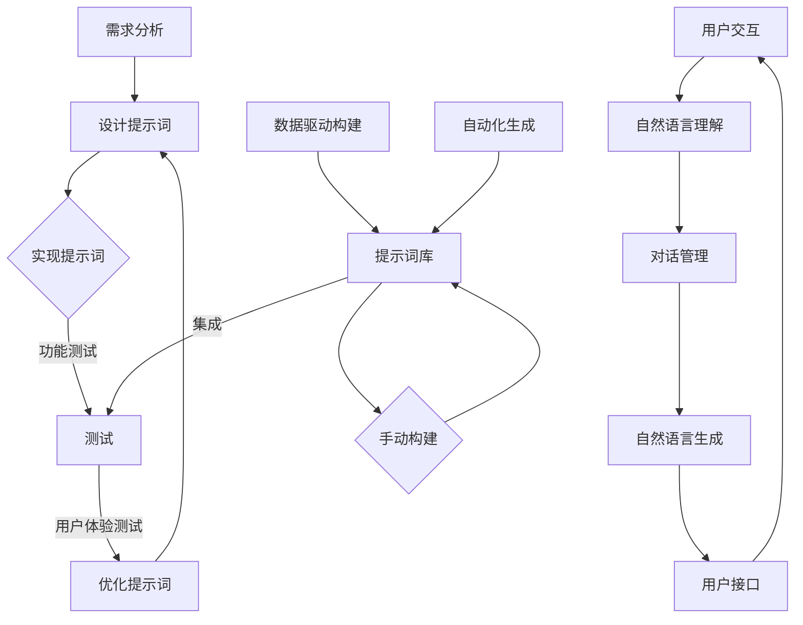

                 

### 文章标题

# 提示词工程在虚拟助手个性化中的应用

提示词工程作为人工智能领域的核心组成部分，在虚拟助手个性化服务中扮演着至关重要的角色。本文旨在深入探讨提示词工程在虚拟助手中的应用，通过逻辑清晰、结构紧凑的分析，详细解析这一技术背后的原理及其在实际项目中的具体实施策略。文章将分为以下几个部分：

## 关键词
- 提示词工程
- 虚拟助手
- 个性化服务
- 自然语言处理
- 机器学习
- 深度学习

## 摘要
本文首先介绍了虚拟助手的发展背景及其在现代社会中的重要性。接着，深入探讨了提示词工程的基本概念和流程，并通过Mermaid流程图展示了其与核心概念之间的联系。随后，文章详细阐述了自然语言处理、机器学习和深度学习在提示词工程中的应用，辅以伪代码和数学模型进行解释。接着，文章探讨了虚拟助手个性化服务的需求和实现方法，并结合实际案例进行了详细分析。最后，文章总结了提示词工程在虚拟助手个性化应用中的挑战和未来发展方向。

## 引言
### 虚拟助手的发展历程
虚拟助手，也被称为虚拟智能代理或聊天机器人，是一种利用人工智能技术模拟人类交互的软件程序。其起源可以追溯到20世纪50年代，当时计算机科学家艾伦·图灵提出了“图灵测试”，用以评估机器是否具有人类水平的智能。随着计算能力和算法的进步，虚拟助手逐渐从实验室走向商业应用。

在早期，虚拟助手主要应用于简单的信息检索和简单的对话功能，如问答系统和自动应答服务。随着自然语言处理（NLP）技术的发展，虚拟助手开始能够理解和生成更加复杂的对话。近年来，随着深度学习和生成对抗网络（GAN）等先进技术的应用，虚拟助手的能力得到了显著提升，它们能够进行更为自然的对话，甚至具备情感理解和个性化服务的能力。

### 虚拟助手的基本架构
虚拟助手的基本架构通常包括以下几个核心模块：

1. **用户接口**：这是用户与虚拟助手交互的界面，可以是文本聊天窗口、语音交互或图形用户界面（GUI）。
2. **自然语言理解（NLU）**：这个模块负责解析用户的输入，理解其意图和上下文。它通常包括词法分析、句法分析和语义分析。
3. **对话管理**：对话管理模块负责维护对话的状态，决定下一步应该采取的行动。它通常基于状态转移图或序列模型。
4. **自然语言生成（NLG）**：这个模块负责生成对用户的响应，使其具有自然流畅的语言风格。
5. **第三方系统集成**：虚拟助手需要与外部系统（如数据库、API、外部服务）集成，以提供更多的功能和数据支持。

### 虚拟助手的核心功能
虚拟助手的核心功能包括：

1. **问答功能**：能够回答用户的问题，提供信息和建议。
2. **任务执行**：能够执行用户指定的任务，如预订机票、安排会议等。
3. **情感交互**：能够理解用户的情感状态，并进行适当的回应，以提供更加个性化的服务。
4. **个性化服务**：根据用户的历史行为和偏好，提供定制化的建议和推荐。

虚拟助手在现代社会的应用场景非常广泛，从客服支持、客户服务到个人助理，都展示了其强大的潜力。随着技术的不断进步，虚拟助手将进一步提升用户体验，成为人们日常生活中不可或缺的一部分。

### 提示词工程基础

#### 提示词的定义与分类

提示词（Prompt Word）在虚拟助手开发中扮演着至关重要的角色。简单来说，提示词是一种引导用户输入的方式，它能够激发用户产生特定的反应或行为。提示词可以分为以下几类：

1. **开放性提示词**：这类提示词不限制用户的回答，允许用户自由表达。例如：“您有什么问题需要帮忙吗？”
2. **封闭性提示词**：这类提示词限制用户的回答范围，通常用于获取具体信息。例如：“您想要咨询哪个产品？”
3. **引导性提示词**：这类提示词旨在引导用户按照特定的步骤或流程进行交互。例如：“请按照以下步骤进行操作：1. 输入您的用户名，2. 输入您的密码。”
4. **情境性提示词**：这类提示词根据用户的情境或上下文提供特定的指导。例如：“您好，欢迎来到我们的在线客服系统，请问您有什么问题需要帮忙吗？”

#### 提示词工程的基本流程

提示词工程是虚拟助手开发中的一个重要环节，其基本流程包括以下几个步骤：

1. **需求分析**：首先，需要明确虚拟助手的具体应用场景和用户需求，确定需要哪些类型的提示词。
2. **设计**：根据需求分析结果，设计具体的提示词，包括提示词的内容、形式和交互方式。
3. **实现**：将设计的提示词集成到虚拟助手的系统中，确保其能够正确执行并响应用户的输入。
4. **测试**：对提示词进行功能测试和用户体验测试，确保其能够满足用户需求和提供良好的交互体验。
5. **优化**：根据测试反馈对提示词进行优化和调整，以提高其有效性和用户满意度。

#### 提示词库的构建方法

提示词库是虚拟助手的核心资源，构建一个高质量、多样化的提示词库是提升虚拟助手性能的关键。以下是构建提示词库的几种方法：

1. **手动构建**：通过人工设计和编写提示词，这种方法能够确保提示词的准确性和针对性，但耗时较长且效率较低。
2. **自动化生成**：利用自然语言处理技术，自动生成提示词。这种方法能够提高生成速度，但可能存在质量不稳定的问题。
3. **数据驱动构建**：通过分析用户交互数据，提取出常用的、有效的提示词。这种方法结合了手动和自动生成的方法，能够生成高质量的提示词库。

构建高质量的提示词库需要综合考虑用户体验、业务需求和系统性能等因素。通过不断优化和更新提示词库，虚拟助手能够提供更加个性化和高效的服务。

### 提示词工程与核心概念的关系

#### Mermaid流程图

为了更清晰地展示提示词工程与核心概念之间的关系，我们可以使用Mermaid流程图来描述这一过程：

这个流程图展示了从需求分析到提示词优化的一系列步骤，以及提示词工程与自然语言理解、对话管理、自然语言生成等核心概念之间的相互作用。通过这种结构化的流程，我们可以更好地理解和优化虚拟助手的功能。

### 自然语言处理与提示词

#### NLP基本概念

自然语言处理（NLP）是人工智能领域的一个重要分支，旨在使计算机能够理解、生成和处理自然语言。NLP的基本概念包括：

1. **文本预处理**：包括分词、词性标注、去除停用词等，为后续处理做准备。
2. **词嵌入**：将词语映射到高维向量空间，以捕获词语的语义信息。
3. **词性标注**：识别文本中的词语及其词性，如名词、动词、形容词等。
4. **句法分析**：分析句子的结构，识别主语、谓语、宾语等成分。
5. **语义分析**：理解句子或文本的整体意义，包括实体识别、情感分析等。

#### 词嵌入与提示词选择

词嵌入是将词语映射到高维向量空间的一种技术，常见的词嵌入模型包括Word2Vec、GloVe和BERT等。词嵌入不仅能够捕获词语的语义信息，还能够表示词语之间的相似性。

在提示词选择中，词嵌入起着重要作用。通过词嵌入，我们可以：

1. **语义匹配**：选择与用户输入语义相近的提示词，提高交互的自然性和准确性。
2. **情感分析**：利用词嵌入模型分析提示词的情感倾向，选择符合用户情绪的提示词。
3. **上下文理解**：通过词嵌入模型，理解提示词在特定上下文中的含义，从而生成更合适的提示。

#### 提示词优化策略

提示词的优化是提升虚拟助手交互质量的关键。以下是几种常见的提示词优化策略：

1. **反馈调整**：根据用户对提示词的反馈，调整提示词的选择和表达方式，使其更加符合用户需求。
2. **情境适应**：根据用户的情境和上下文，动态选择合适的提示词，提高交互的自然性和连贯性。
3. **多样性增强**：避免使用过于固定或单一的提示词，增加提示词的多样性，以提升用户的体验。
4. **数据驱动**：利用用户交互数据，分析常用的、有效的提示词，并不断优化和更新提示词库。

通过这些策略，我们可以使虚拟助手提供的提示词更加准确、自然和个性化，从而提升用户体验。

### 机器学习与提示词工程

#### 机器学习模型介绍

机器学习（ML）是人工智能的核心技术之一，其基本概念包括：

1. **监督学习**：通过已标注的数据训练模型，使其能够对新的数据进行预测或分类。
2. **无监督学习**：没有已标注的数据，通过发现数据之间的模式或结构来进行学习。
3. **强化学习**：通过与环境的交互，不断优化策略以最大化奖励。

在提示词工程中，常见的机器学习模型包括：

1. **决策树**：基于特征进行分类或回归，易于解释和理解。
2. **支持向量机（SVM）**：通过最大化分类边界来划分数据。
3. **神经网络**：通过多层非线性变换进行复杂函数的建模。
4. **深度学习**：利用多层神经网络进行大规模数据的学习和预测。

#### 提示词在机器学习中的应用

在机器学习中，提示词可以作为特征之一，用于训练模型以识别用户的意图和情感。以下是几种应用场景：

1. **意图识别**：通过分析用户的输入，确定用户想要执行的任务或操作。例如，在购物虚拟助手中，用户输入“我要买一个手机”，模型需要识别出“购买手机”的意图。
2. **情感分析**：通过分析用户的输入，判断用户的情感状态。例如，在客户服务虚拟助手中，用户输入“我很生气”，模型需要识别出用户的负面情感。
3. **对话生成**：在自然语言生成（NLG）中，提示词可以帮助模型生成自然、连贯的对话回复。

#### 提示词对模型性能的影响

提示词的选择和优化对机器学习模型的性能具有重要影响。以下是几个关键点：

1. **特征质量**：高质量的提示词能够提供更有价值的特征信息，从而提升模型的分类或预测能力。
2. **多样性**：提示词的多样性有助于模型捕捉更多的语义信息，从而提高其泛化能力。
3. **长度和结构**：提示词的长度和结构也需要考虑。过短的提示词可能缺乏足够的语义信息，而过长的提示词可能导致模型处理效率降低。
4. **情感和情绪**：对于情感分析等应用，提示词的情感和情绪倾向对模型性能也有显著影响。

通过优化提示词，我们可以显著提升虚拟助手的交互质量和用户满意度。接下来，我们将进一步探讨深度学习在提示词工程中的应用。

### 深度学习与提示词工程

#### 深度学习基础

深度学习（Deep Learning, DL）是机器学习的一个重要分支，其核心思想是通过多层神经网络来模拟人脑的神经元结构和工作方式。深度学习的基本组成部分包括：

1. **神经网络**：神经网络由多个神经元（或节点）组成，每个神经元接收来自前一层神经元的输入，通过权重（weight）进行加权求和，然后通过激活函数（activation function）输出结果。
2. **多层网络**：深度学习中的神经网络通常包含多层，每层负责提取不同层次的特征。深层网络能够捕捉到更加复杂和抽象的特征。
3. **反向传播**：反向传播（Backpropagation）是一种训练神经网络的算法，通过不断调整网络中的权重，使网络的输出误差最小化。
4. **激活函数**：激活函数是神经网络中的一个关键组件，用于引入非线性变换，使神经网络能够处理复杂的非线性问题。

#### 深度学习在虚拟助手中的应用

深度学习在虚拟助手中的应用非常广泛，以下是几个典型的应用场景：

1. **意图识别**：深度学习模型能够通过分析用户的输入，准确识别用户的意图。例如，使用卷积神经网络（CNN）可以捕捉文本中的关键特征，从而提高意图识别的准确性。
2. **情感分析**：深度学习模型能够分析用户的输入，识别用户的情感状态。通过长短期记忆网络（LSTM）等序列模型，可以捕捉到用户输入中的情感变化。
3. **对话生成**：深度学习模型可以生成自然、流畅的对话回复。使用生成对抗网络（GAN）和变分自编码器（VAE）等生成模型，可以生成高质量的对话内容。
4. **知识图谱构建**：深度学习模型可以用于构建虚拟助手的知识图谱，通过图神经网络（GNN）等模型，可以更好地组织和管理知识信息。

#### 提示词在深度学习中的创新应用

提示词在深度学习中的应用是虚拟助手个性化服务的重要手段。以下是几种创新应用：

1. **动态提示词生成**：通过深度学习模型，实时生成与用户输入相关的提示词。例如，使用循环神经网络（RNN）和注意力机制（Attention Mechanism），可以根据用户的历史交互和当前输入，生成个性化的提示词。
2. **多模态提示词融合**：将文本提示词与其他模态（如语音、图像）进行融合，提高虚拟助手的理解和生成能力。例如，使用图卷积网络（GCN）和自编码器（AE），可以将不同模态的信息进行有效融合。
3. **上下文敏感的提示词调整**：通过深度学习模型，根据用户的上下文信息动态调整提示词。例如，使用Transformer模型和BERT等预训练模型，可以更好地捕捉上下文信息，从而生成更准确的提示词。

通过这些创新应用，我们可以显著提升虚拟助手的交互质量和用户体验。接下来，我们将探讨虚拟助手个性化服务的重要性及其实现方法。

### 虚拟助手个性化服务

#### 个性化服务的需求分析

虚拟助手个性化服务的核心在于满足不同用户的需求，提供定制化的交互体验。以下是几个关键需求：

1. **用户行为分析**：通过分析用户的历史行为和交互数据，了解用户的兴趣、偏好和习惯。
2. **上下文感知**：虚拟助手需要具备上下文感知能力，理解用户当前的状态和情境，从而提供更加贴心的服务。
3. **个性化推荐**：根据用户的行为和偏好，提供个性化的信息、产品或服务推荐。
4. **情感交互**：理解用户的情感状态，进行适当的情感回应，提高用户满意度和忠诚度。
5. **隐私保护**：在提供个性化服务的同时，确保用户的隐私和数据安全。

#### 提示词工程在个性化服务中的应用

提示词工程是虚拟助手实现个性化服务的关键技术之一。以下是几种具体应用：

1. **意图识别**：通过分析用户的输入，准确识别用户的意图，并根据用户的偏好提供相应的提示词。例如，如果用户经常询问关于旅游的信息，虚拟助手可以自动识别并推荐相关的旅游提示词。
2. **情感分析**：分析用户的情感状态，选择与用户情感相符的提示词。例如，如果用户表达出负面情绪，虚拟助手可以提供安慰性的提示词，如“我很抱歉听到这个消息，您可以告诉我更多信息，我会尽力帮助您”。
3. **情境适应**：根据用户的上下文信息，动态调整提示词。例如，在用户进行购物时，虚拟助手可以根据用户的购物车内容推荐相关的商品提示词。
4. **多模态交互**：结合文本、语音、图像等多种模态，提供更加丰富和个性化的交互体验。例如，在用户浏览图片时，虚拟助手可以通过分析图片内容，提供相应的文本提示词。

#### 个性化案例研究

以下是几个虚拟助手个性化服务的案例研究：

1. **客服虚拟助手**：通过分析用户的反馈和交互历史，客服虚拟助手可以提供个性化的服务。例如，如果用户经常询问关于产品规格的问题，虚拟助手可以自动推荐相关的产品文档和购买链接。
2. **健康咨询虚拟助手**：根据用户的历史健康数据和体检结果，健康咨询虚拟助手可以提供个性化的健康建议和医疗信息。例如，如果用户最近进行了体检，虚拟助手可以根据体检结果提供相应的健康提示词。
3. **旅游助手**：通过分析用户的兴趣和行为偏好，旅游助手可以推荐个性化的旅游计划和景点信息。例如，如果用户喜欢登山，虚拟助手可以推荐适合登山的项目和景点。
4. **教育助手**：根据学生的学习进度和成绩，教育助手可以提供个性化的学习建议和资源推荐。例如，如果学生某科目成绩不理想，虚拟助手可以推荐相关的学习资源和练习题。

通过这些案例，我们可以看到虚拟助手个性化服务在提升用户体验、提高服务质量和效率方面的重要作用。接下来，我们将探讨虚拟助手在跨领域应用中的具体情况。

### 跨领域虚拟助手应用

#### 跨领域虚拟助手的发展趋势

随着人工智能技术的不断进步，虚拟助手已不再局限于单一领域的应用，而是逐渐拓展到多个领域，提供跨领域的综合服务。以下是跨领域虚拟助手的发展趋势：

1. **多模态交互**：跨领域虚拟助手将融合文本、语音、图像等多种模态，实现更加自然和丰富的交互体验。
2. **知识图谱构建**：通过构建领域知识图谱，跨领域虚拟助手可以更好地理解和处理跨领域的用户请求。
3. **个性化推荐**：利用大数据和机器学习技术，跨领域虚拟助手可以根据用户的历史行为和偏好，提供个性化的服务推荐。
4. **跨平台集成**：虚拟助手将集成到多种平台上，如移动设备、桌面应用和智能家居等，实现全方位的服务覆盖。

#### 提示词工程在不同领域中的应用

跨领域虚拟助手在各个领域中的应用各有特点，以下是几个领域的具体应用：

1. **医疗健康**：在医疗健康领域，虚拟助手可以通过分析患者的病历和健康数据，提供个性化的健康建议和医疗服务。例如，虚拟助手可以实时监测患者的生活习惯，并提醒患者按时服药、进行锻炼等。
   
   - **应用场景**：患者咨询病情、预约挂号、健康咨询、康复指导等。
   - **提示词示例**： “根据您最近的体检报告，建议您每周进行至少三次运动，每次30分钟以上。”

2. **金融服务**：在金融服务领域，虚拟助手可以提供个性化的投资建议、理财规划和金融服务。例如，虚拟助手可以根据用户的财务状况和风险偏好，提供相应的投资组合建议。

   - **应用场景**：投资咨询、理财规划、贷款申请、信用评分等。
   - **提示词示例**： “根据您的投资目标和风险偏好，建议您考虑投资于股票和债券的组合。”

3. **教育领域**：在教育领域，虚拟助手可以为学生提供个性化的学习建议、课程资源和辅导服务。例如，虚拟助手可以根据学生的学习进度和成绩，推荐相应的学习内容和练习。

   - **应用场景**：在线课程推荐、学习计划制定、作业辅导、考试复习等。
   - **提示词示例**： “您在数学上的成绩有待提高，建议您利用周末时间完成数学练习册的练习。”

4. **旅游服务**：在旅游服务领域，虚拟助手可以根据用户的兴趣和偏好，提供个性化的旅游规划和服务。例如，虚拟助手可以为用户提供景点推荐、行程规划、酒店预订等。

   - **应用场景**：景点推荐、行程规划、酒店预订、交通安排等。
   - **提示词示例**： “根据您的兴趣和预算，为您推荐以下旅游景点：长城、故宫、兵马俑。”

#### 跨领域案例解析

以下是几个跨领域虚拟助手的实际案例：

1. **案例一：智能医疗助理**：某医院开发的智能医疗助理，结合了自然语言处理、知识图谱和深度学习技术，为患者提供个性化的健康咨询和服务。该助理可以分析患者的病历、检查报告和医生建议，为患者提供个性化的治疗建议和康复指导。

   - **实现方法**：使用自然语言处理技术处理患者输入，结合医学知识图谱，提供准确的治疗建议。
   - **效果分析**：患者满意度显著提高，医疗资源利用效率提升。

2. **案例二：智能理财顾问**：某银行推出的智能理财顾问，利用大数据分析和机器学习算法，为用户提供个性化的投资建议和理财规划。该顾问可以分析用户的财务状况、投资目标和风险偏好，提供最优的投资组合和理财策略。

   - **实现方法**：通过大数据分析用户的投资记录和财务数据，结合机器学习算法，生成个性化的投资建议。
   - **效果分析**：用户的投资回报率提升，用户满意度显著提高。

3. **案例三：智能教育助手**：某教育科技公司开发的智能教育助手，利用自然语言处理和知识图谱技术，为学生提供个性化的学习建议和课程资源。该助手可以分析学生的学习进度和成绩，推荐相应的学习内容和辅导服务。

   - **实现方法**：通过自然语言处理技术分析学生的提问和作业，结合知识图谱，提供个性化的学习建议。
   - **效果分析**：学生的学习成绩显著提升，用户满意度提高。

通过这些案例，我们可以看到跨领域虚拟助手在提升用户体验、提高服务质量和效率方面的巨大潜力。接下来，我们将探讨虚拟助手个性化应用面临的挑战和未来发展方向。

### 未来展望与挑战

#### 提示词工程的发展方向

随着人工智能技术的不断进步，提示词工程在未来将面临新的发展机遇和挑战。以下是几个可能的发展方向：

1. **多模态提示词融合**：未来的虚拟助手将支持多种模态（如文本、语音、图像、视频）的输入和输出，提示词工程需要能够有效融合不同模态的信息，提供更加丰富和自然的交互体验。
2. **个性化提示词生成**：通过深度学习和生成对抗网络（GAN）等技术，未来的虚拟助手将能够根据用户的历史行为和上下文，动态生成个性化的提示词，进一步提升用户体验。
3. **实时提示词优化**：实时分析用户的反馈和交互数据，动态调整提示词，使虚拟助手能够持续改进和优化其交互质量。
4. **跨领域通用提示词库**：构建一个跨领域的通用提示词库，将有助于虚拟助手在不同领域之间灵活切换和扩展，提高其应用范围和适应性。

#### 虚拟助手个性化应用的挑战

尽管虚拟助手个性化应用前景广阔，但在实际应用中仍面临诸多挑战：

1. **数据隐私和安全**：虚拟助手在提供个性化服务时，需要收集和处理大量的用户数据。如何保护用户的隐私和数据安全是亟待解决的问题。
2. **跨领域知识整合**：不同领域之间的知识整合和兼容性是跨领域虚拟助手面临的挑战。如何构建一个统一的、可扩展的知识图谱，以支持跨领域的个性化服务，是一个重要的研究方向。
3. **语言理解能力**：尽管自然语言处理技术取得了显著进展，但虚拟助手在理解复杂语言表达、处理歧义和进行多轮对话方面仍有很大提升空间。
4. **用户体验一致性**：虚拟助手在不同应用场景中需要保持一致的用户体验，如何设计统一且灵活的交互界面和提示词策略，是一个重要的挑战。

#### 技术与商业前景分析

从技术角度来看，人工智能和自然语言处理技术的不断进步将推动虚拟助手个性化应用的发展。深度学习、生成对抗网络（GAN）和图神经网络（GNN）等先进技术的应用，将使虚拟助手在理解用户意图、生成自然语言回复和提供个性化服务方面取得重大突破。

从商业角度来看，虚拟助手个性化应用具有巨大的市场潜力。随着企业对客户服务和用户体验的关注度不断提高，虚拟助手将成为企业提升服务质量和降低运营成本的重要工具。同时，随着智能家居、智能医疗、智能教育等领域的快速发展，虚拟助手将在这些领域发挥越来越重要的作用。

然而，要实现虚拟助手个性化应用的广泛应用，仍需克服数据隐私、跨领域知识整合和用户体验一致性等挑战。通过持续的技术创新和产业合作，我们有理由相信，虚拟助手个性化应用将在未来实现更加广泛和深入的发展。

### 结论

本文深入探讨了提示词工程在虚拟助手个性化中的应用，从虚拟助手的发展历程、提示词工程的基本概念、自然语言处理、机器学习和深度学习的技术应用，到虚拟助手个性化服务的实现方法、跨领域应用案例以及未来发展方向，全面解析了这一领域的核心技术和挑战。通过逻辑清晰、结构紧凑的分析，我们明确了提示词工程在提升虚拟助手交互质量和用户体验方面的重要性。随着技术的不断进步，我们有理由相信，提示词工程将在虚拟助手个性化应用中发挥更加关键的作用。

### 作者信息

作者：AI天才研究院/AI Genius Institute & 禅与计算机程序设计艺术 /Zen And The Art of Computer Programming

