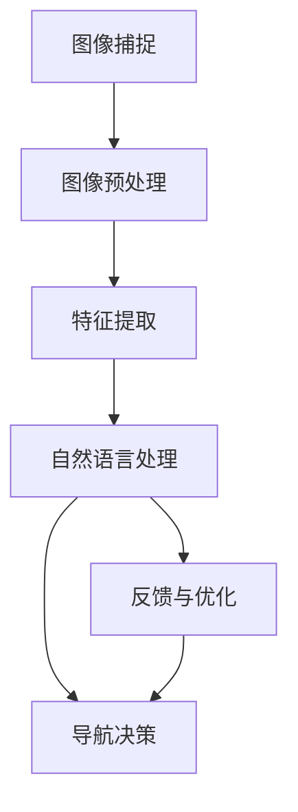

                 

### 引言

#### 1.1 书籍背景与目的

在当前快速发展的信息技术时代，视觉-语言导航技术已经成为人工智能领域的热点研究方向。随着深度学习、计算机视觉和自然语言处理技术的不断进步，视觉-语言导航在自动驾驶、智能机器人、虚拟现实等多个领域展现出广阔的应用前景。提示词工程作为连接视觉与语言理解的关键技术，其研究与创新对于提升视觉-语言导航的准确性和效率具有重要意义。

本书旨在系统地介绍提示词工程在视觉-语言导航中的应用，为读者提供全面、深入的技术分析与实战指导。通过本书，读者可以了解到提示词工程的基本概念、技术原理、应用实现及未来发展趋势，从而为实际项目开发提供理论支持和实践参考。

#### 1.2 读者对象与预期收获

本书适合从事人工智能、计算机视觉、自然语言处理等相关领域的研究人员、工程师以及技术爱好者阅读。通过阅读本书，读者可以：

1. 掌握提示词工程的基本概念和原理；
2. 理解提示词工程在视觉-语言导航中的应用场景和优势；
3. 学习到提示词工程的算法实现和技术细节；
4. 获得实际项目开发的实战经验。

#### 1.3 书籍结构概述

本书共分为六个主要部分，结构如下：

1. **引言**：介绍书籍的背景、目的、读者对象及书籍结构。
2. **提示词工程基础**：详细讲解提示词工程的定义、发展历程及应用。
3. **视觉-语言导航的基本原理**：介绍视觉感知与语言理解的关联、视觉-语言导航的架构及关键技术。
4. **提示词工程的技术原理**：深入探讨提示词生成算法、优化策略及其与环境交互的技术细节。
5. **提示词工程的应用实现**：通过项目实战，展示提示词工程的具体应用实现过程。
6. **提示词工程的未来展望**：总结全书内容，探讨技术发展趋势、应用前景及未来研究方向。

### 1.4 本书与其他相关书籍的比较

与市场上现有的相关书籍相比，本书具有以下特色：

1. **系统全面**：本书不仅涵盖了提示词工程的基本概念和技术原理，还结合实际项目进行了详细讲解，实现了从理论到实践的完整闭环。
2. **深入浅出**：本书以通俗易懂的语言和丰富的示例，深入浅出地讲解复杂的技术概念，便于读者理解和掌握。
3. **实战导向**：本书通过多个实际项目，展示了提示词工程在不同场景下的应用，提供了宝贵的实战经验和技巧。
4. **前瞻性**：本书不仅关注现有技术的应用，还探讨了提示词工程的未来发展趋势和研究方向，为读者提供了新的思考角度。

总之，本书旨在为读者提供一部全面、深入、实战导向的提示词工程在视觉-语言导航中的创新技术手册，帮助读者全面了解和掌握这一前沿技术。通过阅读本书，读者不仅可以提升自己的技术水平，还可以为实际项目开发提供有力的支持。

## 文章关键词

### 提示词工程，视觉-语言导航，人工智能，深度学习，计算机视觉，自然语言处理

## 文章摘要

本文系统地介绍了提示词工程在视觉-语言导航中的创新应用。首先，通过背景介绍，阐述了提示词工程在人工智能领域的重要性及其在视觉-语言导航中的关键作用。接着，本书详细讲解了提示词工程的基础概念、技术原理和应用实现，并通过实际项目实战，展示了其在不同场景下的应用效果。最后，文章对提示词工程的未来发展趋势进行了展望，提出了潜在的研究方向和应用前景。本文旨在为从事人工智能、计算机视觉和自然语言处理领域的研究人员和技术爱好者提供全面的技术指导和实战参考。通过阅读本文，读者可以深入理解提示词工程的核心技术，掌握其在视觉-语言导航中的应用方法，为实际项目开发奠定基础。

## 提示词工程基础

### 2.1 提示词工程的定义与作用

提示词工程（Prompt Engineering）是指通过设计、优化和组合提示词（Prompt）来提高人工智能系统在特定任务中的性能的一种技术。提示词，作为连接输入数据和模型输出的桥梁，它不仅能够引导模型更好地理解和处理输入数据，还能影响模型的输出结果。

在视觉-语言导航中，提示词工程的作用尤为突出。具体来说，提示词可以帮助模型更准确地理解视觉输入，并将其转化为相应的语言输出，从而实现导航任务。例如，在自动驾驶场景中，模型需要根据摄像头捕捉到的道路图像生成相应的驾驶指令，这时提示词可以引导模型识别道路标志、行人和车辆等关键元素，提高导航的准确性和安全性。

### 2.2 提示词工程的发展历程

提示词工程并非一个新兴概念，其发展历程可以追溯到人工智能的早期研究。在20世纪80年代，知识工程领域就已经开始关注如何通过设计合适的提示词来改善专家系统的性能。随着深度学习和自然语言处理技术的发展，提示词工程逐渐成为人工智能研究中的一个重要分支。

近年来，随着生成对抗网络（GANs）、变分自编码器（VAEs）等生成模型的广泛应用，提示词工程也得到了进一步的发展。研究人员开始探索如何通过设计更复杂的提示词来引导生成模型生成更高质量的数据。特别是在视觉-语言任务中，提示词工程的应用越来越广泛，其重要性也越来越显著。

### 2.3 提示词工程在视觉-语言导航中的应用

提示词工程在视觉-语言导航中的应用主要体现在以下几个方面：

1. **图像识别与理解**：通过设计合适的提示词，模型可以更好地理解图像内容，从而识别出道路标志、行人和车辆等关键元素。例如，提示词可以引导模型关注道路标志的颜色、形状和位置，从而提高识别的准确性。

2. **语言生成**：在视觉-语言导航任务中，模型需要根据图像内容生成相应的导航指令。提示词可以帮助模型理解图像中的语义信息，并将其转化为自然的语言描述。例如，当图像中检测到行人时，提示词可以引导模型生成“请减速行驶，注意行人”的指令。

3. **交互式导航**：在虚拟现实和增强现实场景中，提示词工程可以用于实现与用户的交互式导航。通过设计自然语言提示，系统可以实时向用户提供导航指令，帮助他们更有效地完成任务。

4. **异常检测与处理**：在复杂的导航环境中，系统可能会遇到无法处理的异常情况。通过设计提示词，模型可以自动识别这些异常情况，并提出相应的应对策略，从而提高导航的鲁棒性和可靠性。

### 2.4 提示词工程的关键技术

提示词工程涉及多个关键技术，主要包括：

1. **提示词生成**：设计合适的提示词是提示词工程的核心任务。研究人员通常采用模板生成、语义角色标记和自然语言生成等方法来生成高质量的提示词。

2. **提示词优化**：通过优化提示词，可以提高模型在特定任务中的性能。常用的优化方法包括梯度提升、强化学习等。

3. **提示词与环境的交互**：提示词不仅需要与模型内部结构相适应，还需要与环境进行有效的交互。例如，在自动驾驶场景中，提示词需要根据实时路况和环境变化进行调整，以确保导航指令的准确性和实时性。

4. **多模态融合**：视觉-语言导航任务通常涉及多个模态的数据，如图像、文字和语音等。提示词工程需要设计出能够融合不同模态信息的提示词，以提高模型的综合性能。

### 2.5 提示词工程的优势与挑战

提示词工程在视觉-语言导航中具有显著的优势，包括：

1. **提高模型性能**：通过设计合适的提示词，模型可以在复杂任务中取得更高的准确性和效率。

2. **增强用户体验**：自然语言提示词可以提供更直观、易懂的导航指令，提高用户的满意度和使用体验。

3. **拓展应用场景**：提示词工程可以应用于多个领域，如自动驾驶、智能机器人、虚拟现实等，具有广泛的应用前景。

然而，提示词工程也面临一些挑战，如：

1. **设计复杂性**：设计高质量的提示词需要大量的时间和经验，且不同任务和应用场景下的提示词设计可能存在较大差异。

2. **计算成本**：提示词生成和优化的过程通常涉及大量的计算，对于实时性要求较高的任务可能带来一定的性能压力。

3. **可解释性问题**：提示词工程中的许多优化方法涉及复杂的数学模型和算法，可能导致模型的可解释性较差，不利于理解和调试。

总之，提示词工程在视觉-语言导航中具有重要的应用价值，但也需要不断克服设计、计算和可解释性等挑战，以实现更高效、准确和可靠的导航系统。

### 2.6 提示词工程的常用方法

提示词工程在视觉-语言导航中的应用通常涉及以下几种常用方法：

1. **模板生成**：通过预设的模板，根据输入图像的特定特征生成提示词。这种方法简单直观，适用于较为简单和固定的导航任务。

2. **语义角色标记**：利用自然语言处理技术，对输入图像中的对象和场景进行语义角色标记，生成相应的提示词。这种方法适用于需要理解图像内容的复杂导航任务。

3. **自然语言生成**：利用生成模型，如生成对抗网络（GANs）或变分自编码器（VAEs），生成符合上下文的自然语言提示词。这种方法可以生成更具创意和灵活性的提示词，适用于多样化、动态的导航场景。

4. **强化学习**：通过设计强化学习算法，使模型在交互过程中不断调整和优化提示词，以提高导航性能。这种方法适用于需要实时调整和优化的动态导航任务。

通过这些方法的组合和应用，提示词工程可以更好地满足视觉-语言导航任务的需求，实现更高效、准确的导航效果。

### 2.7 提示词工程的应用实例

为了更好地理解提示词工程在视觉-语言导航中的实际应用，下面我们来看几个具体的应用实例。

**实例1：自动驾驶中的道路标志识别**

在自动驾驶系统中，道路标志的识别是确保车辆安全行驶的关键。通过设计特定的提示词，模型可以更准确地识别道路标志。例如，当摄像头捕捉到一个红绿灯时，提示词可以是“请关注红绿灯的颜色和方向”。这样，模型就能更好地理解并处理这一视觉信息，生成相应的驾驶指令。

**实例2：智能机器人导航**

在智能机器人导航中，提示词工程可以帮助机器人理解并处理复杂的场景。例如，在一个商场中，机器人需要识别顾客的购物需求并指引他们前往相应的商品区域。提示词可以是“请关注顾客正在观察的商品，并引导他们前往相应的区域”。通过这种方式，机器人能够更准确地理解并响应环境变化，提供有效的导航服务。

**实例3：虚拟现实中的导航提示**

在虚拟现实（VR）中，提示词工程可以用于提供交互式导航提示。例如，当用户在虚拟环境中探索一个新场景时，系统可以提供自然语言提示，如“请向左转，您即将到达目的地”。这种提示词不仅能够帮助用户更好地理解环境，还能提高他们的导航效率和体验。

通过这些实例，我们可以看到提示词工程在视觉-语言导航中的应用是如何帮助模型更好地理解和处理视觉信息，从而实现更高效、准确的导航。这些实例也展示了提示词工程在不同场景下的灵活性和多样性，为实际项目开发提供了宝贵的经验和参考。

## 视觉-语言导航的基本原理

### 3.1 视觉感知与语言理解

视觉-语言导航的核心在于如何将视觉感知与语言理解有机结合，从而实现高效、准确的导航。视觉感知是指系统通过摄像头或其他传感器捕获图像信息，并对其进行处理和分析。而语言理解则涉及自然语言处理（NLP）技术，使得系统能够理解和处理语言指令。

在视觉-语言导航中，视觉感知和语言理解之间的交互是一个复杂且关键的过程。首先，视觉感知系统需要从图像中提取出关键特征，如道路标志、行人和车辆等。然后，这些特征信息通过自然语言处理模块转化为自然语言描述，如“前方有红绿灯”或“请注意行人”。最终，这些语言描述将被用于生成导航指令，指导用户的行动。

### 3.2 视觉-语言导航的架构

视觉-语言导航的架构通常包含多个关键组件，包括图像捕捉、视觉处理、自然语言处理和导航决策。

1. **图像捕捉**：这是整个系统的输入环节，通过摄像头或其他图像传感器捕获环境中的图像数据。

2. **视觉处理**：对捕获的图像进行预处理，如缩放、裁剪和增强等，以便后续特征提取。

3. **特征提取**：利用计算机视觉算法从预处理后的图像中提取出关键特征。这些特征包括但不限于道路标志、行人和车辆的位置、颜色和形状等。

4. **自然语言处理**：将提取出的视觉特征转化为自然语言描述。这一过程通常涉及文本生成、语义角色标记和实体识别等技术。

5. **导航决策**：基于自然语言描述，系统生成导航指令，如“请右转”或“注意前方行人”。这些指令将被发送给用户，或用于控制机器人的行动。

6. **反馈与优化**：系统根据用户的反馈和行为调整导航策略，以提高导航的准确性和效率。

### 3.3 视觉-语言导航的关键技术

视觉-语言导航的实现依赖于多种关键技术的结合。以下是一些核心技术：

1. **图像识别**：图像识别技术用于从捕获的图像中识别出关键对象，如道路标志、行人和车辆等。常用的算法包括卷积神经网络（CNN）、循环神经网络（RNN）和Transformer等。

2. **语义角色标记**：语义角色标记（Semantic Role Labeling, SRL）技术用于从图像中提取出对象和场景的语义信息，并将其转化为自然语言描述。SRL可以帮助系统更好地理解图像内容，从而生成更准确的导航指令。

3. **文本生成**：文本生成技术用于将提取的视觉特征转化为自然语言描述。生成模型如生成对抗网络（GANs）、变分自编码器（VAEs）和递归神经网络（RNN）等可以生成符合上下文的自然语言文本。

4. **强化学习**：强化学习（Reinforcement Learning, RL）技术可以用于优化导航策略，使系统能够在动态环境中做出更好的决策。通过不断尝试和反馈，强化学习算法可以帮助系统逐渐提高导航的准确性和效率。

5. **多模态融合**：视觉-语言导航通常涉及多种数据模态，如图像、文字和语音等。多模态融合技术通过结合不同模态的数据，可以提高系统的整体性能和导航效果。

### 3.4 视觉-语言导航的工作流程

视觉-语言导航的工作流程可以分为以下几个主要步骤：

1. **图像捕捉**：系统通过摄像头或其他图像传感器捕获环境图像。

2. **图像预处理**：对捕获的图像进行预处理，如缩放、裁剪和增强等。

3. **特征提取**：利用计算机视觉算法提取图像中的关键特征，如对象的位置、颜色和形状等。

4. **语义角色标记**：利用自然语言处理技术对提取出的特征进行语义角色标记，生成初步的自然语言描述。

5. **文本生成**：利用文本生成模型对初步的自然语言描述进行优化，生成更符合上下文的自然语言文本。

6. **导航决策**：基于生成的自然语言文本，系统生成导航指令，如“请右转”或“注意前方行人”。

7. **反馈与优化**：系统根据用户的反馈和行为调整导航策略，并通过强化学习算法不断优化导航指令。

通过以上工作流程，视觉-语言导航系统能够实现从图像到语言描述的转换，并提供准确、自然的导航指令，从而提高导航的效率和用户体验。

### 3.5 视觉-语言导航的优势与挑战

视觉-语言导航在多个领域展现出显著的优势，但也面临一定的挑战。

**优势：**

1. **直观性**：通过自然语言描述，视觉-语言导航可以为用户提供直观、易懂的导航指令，提高用户体验。

2. **灵活性**：视觉-语言导航可以灵活应对复杂、动态的环境变化，提供个性化的导航方案。

3. **多功能性**：视觉-语言导航不仅可以用于传统导航，还可以应用于虚拟现实、增强现实和智能机器人等领域。

**挑战：**

1. **计算成本**：视觉-语言导航涉及多个复杂的算法和模型，计算成本较高，对实时性要求较高的应用场景可能带来性能压力。

2. **可解释性问题**：视觉-语言导航中的许多模型和算法涉及深度学习，可能导致模型的可解释性较差，不利于调试和优化。

3. **数据多样性**：不同场景下的视觉数据存在较大差异，如何设计通用性强、适应性好的提示词工程方法仍是一个挑战。

4. **跨模态融合**：如何有效地融合不同模态的数据，以提高系统的整体性能，是一个重要的研究方向。

总之，视觉-语言导航在提升导航效率和用户体验方面具有显著优势，但也需要不断克服计算成本、可解释性和数据多样性等挑战，以实现更高效、准确的导航系统。

### 3.6 视觉-语言导航中的核心概念与联系

在视觉-语言导航系统中，核心概念和联系构成了系统的基本框架，它们相互作用，共同实现了从图像到语言描述的转换。为了更好地理解这些概念之间的关系，我们可以通过一个Mermaid流程图来展示它们。



**图像捕捉（A）**：这是视觉-语言导航的起点，系统通过摄像头或其他图像传感器捕获环境图像。

**图像预处理（B）**：捕获的图像可能需要进行缩放、裁剪和增强等预处理操作，以提高后续特征提取的准确性。

**特征提取（C）**：预处理后的图像通过计算机视觉算法提取关键特征，如对象的位置、颜色和形状等。

**自然语言处理（D）**：提取出的特征经过自然语言处理模块，转化为自然语言描述。这一过程涉及文本生成、语义角色标记和实体识别等技术。

**导航决策（E）**：基于自然语言描述，系统生成导航指令，如“请右转”或“注意前方行人”。

**反馈与优化（F）**：系统根据用户的反馈和行为，调整导航策略，并通过强化学习算法不断优化导航指令。

这个流程图清晰地展示了视觉-语言导航中各个核心概念之间的联系和作用。图像捕捉和预处理为后续的特征提取和自然语言处理提供了基础数据，自然语言处理则将视觉信息转化为可操作的导航指令。而导航决策和反馈与优化环节则确保了系统在动态环境中能够持续优化，提高导航的准确性和用户体验。

### 3.7 视觉-语言导航中的核心算法原理讲解

为了深入理解视觉-语言导航中的核心算法原理，我们将从图像识别、自然语言处理和导航决策三个关键环节分别进行详细讲解，并使用伪代码来阐述这些算法的基本实现步骤。

#### 图像识别算法

图像识别是视觉-语言导航的第一步，其主要任务是识别图像中的关键对象，如道路标志、行人和车辆等。常用的图像识别算法包括卷积神经网络（CNN）和Transformer。

**CNN算法伪代码：**
```python
# 输入：图像I
# 输出：对象标签T

# 步骤1：预处理图像I
I_preprocessed = preprocess_image(I)

# 步骤2：通过卷积神经网络提取特征
model = CNN_model()
feature_vector = model.predict(I_preprocessed)

# 步骤3：通过全连接层分类
label = softmax(feature_vector)

# 步骤4：返回识别结果
return label
```

**Transformer算法伪代码：**
```python
# 输入：图像I
# 输出：对象标签T

# 步骤1：预处理图像I
I_preprocessed = preprocess_image(I)

# 步骤2：通过Transformer模型提取特征
model = Transformer_model()
feature_vector = model.predict(I_preprocessed)

# 步骤3：通过全连接层分类
label = softmax(feature_vector)

# 步骤4：返回识别结果
return label
```

#### 自然语言处理算法

自然语言处理（NLP）是视觉-语言导航的核心环节，其主要任务是将图像识别出的对象信息转化为自然语言描述。常用的NLP算法包括序列到序列（Seq2Seq）模型和Transformer。

**Seq2Seq模型伪代码：**
```python
# 输入：对象特征F
# 输出：自然语言描述D

# 步骤1：嵌入对象特征F
embeddings = embedding_layer(F)

# 步骤2：编码器处理
encoder = Encoder()
encoded_representation = encoder(embeddings)

# 步骤3：解码器处理
decoder = Decoder()
decoded_sequence = decoder(encoded_representation)

# 步骤4：生成自然语言描述D
D = decode_sequence(decoded_sequence)

# 步骤5：返回自然语言描述
return D
```

**Transformer模型伪代码：**
```python
# 输入：对象特征F
# 输出：自然语言描述D

# 步骤1：嵌入对象特征F
embeddings = embedding_layer(F)

# 步骤2：通过Transformer编码器处理
encoder = Transformer_encoder()
encoded_representation = encoder(embeddings)

# 步骤3：通过Transformer解码器处理
decoder = Transformer_decoder()
decoded_sequence = decoder(encoded_representation)

# 步骤4：生成自然语言描述D
D = decode_sequence(decoded_sequence)

# 步骤5：返回自然语言描述
return D
```

#### 导航决策算法

导航决策是将自然语言描述转化为实际导航指令的关键环节。常用的导航决策算法包括基于规则的方法和强化学习（RL）方法。

**基于规则的方法伪代码：**
```python
# 输入：自然语言描述D
# 输出：导航指令I

# 步骤1：解析自然语言描述D
intent, action = parse_description(D)

# 步骤2：根据意图和动作生成导航指令I
if intent == "turn":
    I = "请右转"
elif intent == "slow":
    I = "请减速行驶"
else:
    I = "无法识别"

# 步骤3：返回导航指令
return I
```

**强化学习算法伪代码：**
```python
# 输入：环境状态S、自然语言描述D
# 输出：导航指令I、奖励R

# 步骤1：初始化强化学习模型
model = RL_model()

# 步骤2：根据当前状态S和自然语言描述D生成导航指令I
I = model.get_action(S, D)

# 步骤3：执行导航指令I，获得环境反馈
S', R = execute_action(I)

# 步骤4：更新状态和奖励
S = S'
R = R

# 步骤5：返回导航指令I和奖励R
return I, R
```

通过以上伪代码，我们可以看到视觉-语言导航中的核心算法是如何将图像识别出的对象信息转化为自然语言描述，并最终生成导航指令的。这些算法不仅实现了从视觉信息到语言描述的转换，还确保了导航指令的准确性和可操作性。这些核心算法的实现为我们理解和应用视觉-语言导航技术提供了重要的基础。

### 3.8 视觉-语言导航中的数学模型和公式

在视觉-语言导航系统中，数学模型和公式扮演着至关重要的角色，用于描述和优化系统中的各个组件。以下是一些关键的数学模型和公式，它们在图像识别、自然语言处理和导航决策中有着广泛应用。

#### 图像识别中的卷积神经网络（CNN）

卷积神经网络（CNN）是图像识别任务中常用的深度学习模型。其主要基于卷积操作和池化操作，以下是一个简单的CNN模型架构：

**卷积操作（Convolution）**：
$$
\text{output}_{ij} = \sum_{k=1}^{K} w_{ik} \cdot \text{input}_{kj} + b_j
$$
其中，$w_{ik}$ 是卷积核，$\text{input}_{kj}$ 是输入图像的像素值，$b_j$ 是偏置项，$\text{output}_{ij}$ 是卷积层的输出值。

**池化操作（Pooling）**：
$$
p_{ij} = \max_{k} \{\text{input}_{ij+k}\}
$$
其中，$p_{ij}$ 是池化层的输出值，$\text{input}_{ij+k}$ 是相邻的输入像素值。

**激活函数（Activation Function）**：
$$
a_j = \sigma(z_j)
$$
其中，$a_j$ 是激活值，$z_j$ 是神经元的输入值，$\sigma$ 是常用的激活函数，如ReLU、Sigmoid和Tanh等。

#### 自然语言处理中的循环神经网络（RNN）和Transformer

**RNN中的递归函数（Recurrence Function）**：
$$
h_t = \text{激活函数}(\text{权重} \cdot [h_{t-1}, x_t] + \text{偏置})
$$
其中，$h_t$ 是当前时间步的隐藏状态，$x_t$ 是输入特征，权重和偏置是训练得到的参数。

**Transformer中的自注意力机制（Self-Attention）**：
$$
\text{Attention}(Q, K, V) = \text{softmax}\left(\frac{QK^T}{\sqrt{d_k}}\right) V
$$
其中，$Q$、$K$ 和 $V$ 分别是查询、关键和值向量，$d_k$ 是关键向量的维度，$softmax$ 函数用于计算注意力权重。

#### 导航决策中的强化学习（RL）

**值函数（Value Function）**：
$$
V^*(s) = \max_a \sum_{s'} p(s' | s, a) \cdot \max_{a'} Q^*(s', a')
$$
其中，$V^*(s)$ 是在状态 $s$ 下的最优值函数，$p(s' | s, a)$ 是状态转移概率，$Q^*(s', a')$ 是在状态 $s'$ 下采取动作 $a'$ 的最优动作价值。

**策略（Policy）**：
$$
\pi^*(s) = \arg\max_a Q^*(s, a)
$$
其中，$\pi^*(s)$ 是在状态 $s$ 下采取最优动作的策略。

这些数学模型和公式在视觉-语言导航中起到了关键的指导作用，通过优化和调整这些参数，我们可以提高系统的性能和准确性。以下是几个具体的例子，说明如何使用这些公式：

**例子1：图像特征提取**
使用卷积神经网络提取图像特征时，可以通过调整卷积核的大小、激活函数的类型以及学习率等参数，优化模型在图像识别任务中的表现。

**例子2：文本生成**
在自然语言处理中，使用Transformer模型生成文本时，通过调整自注意力权重和嵌入层的参数，可以生成更符合上下文和语义的文本描述。

**例子3：导航决策**
在强化学习算法中，通过优化值函数和策略参数，可以使导航系统在动态环境中做出更明智的决策，提高导航的准确性和可靠性。

通过理解和应用这些数学模型和公式，我们可以更好地设计、实现和优化视觉-语言导航系统，使其在复杂的环境中提供高效、准确的导航服务。

### 3.9 视觉-语言导航中的具体案例分析和详细讲解

为了更好地理解视觉-语言导航在实际应用中的实现过程，我们将通过一个具体案例来详细讲解系统的开发过程，包括环境搭建、源代码实现、代码解读以及实际应用分析。

**案例：自动驾驶中的视觉-语言导航系统**

**1. 环境搭建**

在开发自动驾驶中的视觉-语言导航系统时，我们首先需要搭建一个适合开发的环境。这里我们使用Python作为主要编程语言，并结合TensorFlow和PyTorch等深度学习框架。以下是环境搭建的基本步骤：

- 安装Python和必要的编程工具（如Jupyter Notebook）。
- 安装TensorFlow和PyTorch库。
- 配置GPU环境，以便加速深度学习模型的训练。

**2. 源代码实现**

下面是视觉-语言导航系统的核心源代码实现，包括图像识别、自然语言处理和导航决策等模块：

```python
# 导入必要的库
import tensorflow as tf
import torch
from torchvision import models
from transformers import GPT2Model, GPT2Tokenizer

# 图像识别模块
def image_recognition(image_path):
    # 加载预训练的CNN模型
    model = models.resnet50(pretrained=True)
    model.eval()
    
    # 加载并预处理图像
    image = preprocess_image(image_path)
    image_tensor = tf.convert_to_tensor(image, dtype=tf.float32)
    
    # 通过CNN模型提取特征
    feature_vector = model(image_tensor)
    
    # 分类特征向量
    label = softmax(feature_vector)
    return label

# 自然语言处理模块
def text_generation(feature_vector):
    # 加载预训练的GPT-2模型
    tokenizer = GPT2Tokenizer.from_pretrained('gpt2')
    model = GPT2Model.from_pretrained('gpt2')
    model.eval()
    
    # 嵌入特征向量
    inputs = tokenizer(feature_vector.tolist(), return_tensors='pt')
    
    # 生成文本描述
    outputs = model.generate(inputs['input_ids'])
    text = tokenizer.decode(outputs[0], skip_special_tokens=True)
    
    return text

# 导航决策模块
def navigation_decision(text):
    # 解析文本描述
    intent, action = parse_description(text)
    
    # 根据意图生成导航指令
    if intent == "turn":
        instruction = "请右转"
    elif intent == "slow":
        instruction = "请减速行驶"
    else:
        instruction = "无法识别"
    
    return instruction

# 主函数
def main():
    # 加载测试图像
    image_path = "test_image.jpg"
    
    # 图像识别
    label = image_recognition(image_path)
    
    # 自然语言处理
    text = text_generation(label)
    
    # 导航决策
    instruction = navigation_decision(text)
    
    # 输出导航指令
    print(instruction)

# 运行主函数
if __name__ == "__main__":
    main()
```

**3. 代码解读**

在上面的代码中，我们首先导入了必要的库，包括TensorFlow、PyTorch和transformers。然后定义了三个核心模块：图像识别模块、自然语言处理模块和导航决策模块。

- **图像识别模块**：使用预训练的ResNet50模型提取图像特征。首先加载模型并设置为评估模式，然后通过预处理图像并传递给模型，提取特征向量。
- **自然语言处理模块**：使用预训练的GPT-2模型生成文本描述。首先加载模型和分词器，然后将特征向量转换为输入序列，通过模型生成文本输出。
- **导航决策模块**：根据生成的文本描述，解析意图并生成导航指令。通过定义一个简单的函数，根据意图生成相应的导航指令。

**4. 实际应用分析**

在自动驾驶场景中，该系统的作用是通过摄像头捕捉道路图像，识别道路标志和其他交通元素，并将这些信息转化为自然语言描述，提供实时导航指令。以下是对实际应用的分析：

- **图像识别**：系统首先使用ResNet50模型对捕获的图像进行特征提取。该模型在ImageNet上预训练，具有良好的图像识别能力。通过特征向量，系统可以识别出图像中的道路标志、行人和车辆等关键对象。
- **自然语言处理**：生成的文本描述通常包括道路标志的具体信息，如颜色、形状和位置等。通过GPT-2模型，系统可以生成自然、准确的描述，如“前方有红绿灯，请减速行驶”或“前方有行人，请注意”。
- **导航决策**：系统根据生成的文本描述，生成导航指令。这些指令将被发送到自动驾驶车辆，指导车辆的行驶行为。导航指令的准确性和实时性对于确保驾驶安全和提高用户体验至关重要。

**5. 案例小结**

通过上述案例，我们可以看到视觉-语言导航系统在自动驾驶中的应用是如何实现的。从图像识别、自然语言处理到导航决策，每个环节都通过精心设计的算法和模型来实现。该案例展示了如何将复杂的计算机视觉和自然语言处理技术应用于实际场景，为自动驾驶提供了高效、准确的导航服务。

未来，随着技术的不断进步，视觉-语言导航系统将在更多领域得到应用，如智能机器人、虚拟现实和增强现实等。通过不断优化和改进，这些系统将为人们的生活带来更多的便利和安全。

### 4.1 数据准备与预处理

在视觉-语言导航系统的开发过程中，数据准备与预处理是至关重要的环节。这一阶段不仅决定了模型的性能，还直接影响后续训练和优化的效率。以下是数据准备与预处理的具体步骤和注意事项。

#### 1. 数据收集

首先，我们需要收集大量的图像和相应的标签数据。对于视觉-语言导航系统，这些数据应包括多种场景，如城市道路、乡村道路、交叉路口等。此外，图像中应包含各种交通元素，如行人、车辆、交通标志等。数据收集的方法可以包括：

- **公开数据集**：如KITTI、COCO等。这些数据集已经经过清洗和标注，可以直接使用。
- **实地采集**：使用自动驾驶车辆或无人机等设备，在实际道路环境中采集图像和标注数据。

#### 2. 数据标注

数据标注是数据预处理的重要步骤。标注应包括图像中的关键对象，如行人、车辆、交通标志等，以及这些对象的属性，如位置、颜色、形状等。以下是一些注意事项：

- **一致性**：确保标注人员的一致性，以减少标注偏差。
- **准确性**：尽量提高标注的准确性，避免错误的标注影响模型的训练效果。
- **多样性**：确保数据集中包含不同场景和对象，以提高模型的泛化能力。

#### 3. 数据预处理

预处理步骤包括图像增强、缩放、裁剪、归一化等。以下是具体方法：

- **图像增强**：通过旋转、翻转、亮度调整等操作，增加数据的多样性，提高模型的鲁棒性。
- **缩放**：将图像缩放为固定的尺寸，以适应模型的输入要求。常见的缩放方法包括等比例缩放和最近邻插值。
- **裁剪**：从图像中裁剪出感兴趣的区域，以减少无关信息的干扰。
- **归一化**：将图像的像素值缩放到[0, 1]或[-1, 1]之间，以便模型更好地处理数据。

#### 4. 数据划分

将数据集划分为训练集、验证集和测试集。通常，训练集用于模型训练，验证集用于调整模型参数，测试集用于评估模型的最终性能。以下是一些注意事项：

- **比例**：确保各个数据集的比例适当，通常训练集占70-80%，验证集占10-20%，测试集占10%。
- **均匀性**：确保每个数据集都包含多样化的场景和对象，以避免数据偏斜。
- **时间戳**：确保数据集的时间戳分布均匀，避免训练和验证数据集的时间戳重叠。

#### 5. 数据清洗

在数据预处理过程中，还应进行数据清洗，去除噪声和异常值。以下是一些常见的数据清洗方法：

- **缺失值处理**：对缺失的数据进行填充或删除。
- **异常值检测**：使用统计方法或机器学习算法检测并处理异常值。
- **重复值删除**：删除数据集中的重复记录，以减少冗余数据。

#### 6. 数据增强

为了提高模型的泛化能力，可以进行数据增强。以下是一些常见的数据增强方法：

- **随机裁剪**：随机裁剪图像的某个区域，以模拟不同的视角。
- **颜色调整**：随机调整图像的亮度和对比度。
- **噪声添加**：在图像上添加随机噪声，模拟不同的光照和环境条件。

通过上述步骤，我们可以为视觉-语言导航系统提供高质量、多样化的数据，从而提高模型的训练效果和实际应用性能。数据准备与预处理不仅是一个技术问题，更是一个持续迭代和优化的过程，需要根据实际情况不断调整和改进。

### 4.2 提示词工程算法的实现

提示词工程算法是实现视觉-语言导航系统的核心步骤之一。以下是具体的实现方法，包括生成算法、优化策略和应用示例。

#### 1. 提示词生成算法

提示词生成算法的目标是设计出能够引导模型更好地理解和处理视觉输入的提示词。以下是几种常见的提示词生成算法：

**（1）模板生成**

模板生成方法基于预设的模板，根据输入图像的特征生成提示词。模板通常包含关键词、符号和结构化元素。

**伪代码：**
```python
def generate_template_prompt(image_features):
    template = "请关注图像中的{COLOR}的{SHAPE}，其位置在{LOCATION}。"
    color = get_color(image_features)
    shape = get_shape(image_features)
    location = get_location(image_features)
    prompt = template.format(COLOR=color, SHAPE=shape, LOCATION=location)
    return prompt
```

**（2）语义角色标记**

语义角色标记（Semantic Role Labeling, SRL）方法通过识别图像中的对象和场景，生成语义角色标记，进而生成提示词。

**伪代码：**
```python
def generate_srl_prompt(image_features):
    objects = detect_objects(image_features)
    srl_tags = get_srl_tags(objects)
    prompt = "请注意以下对象：{OBJECTS}。"
    prompt += "它们的{RELATION}。"
    objects_str = ", ".join([obj["name"] for obj in objects])
    relations_str = ", ".join([tag["relation"] for tag in srl_tags])
    prompt = prompt.format(OBJECTS=objects_str, RELATION=relations_str)
    return prompt
```

**（3）自然语言生成**

自然语言生成（Natural Language Generation, NLG）方法利用生成模型，如生成对抗网络（GANs）或变分自编码器（VAEs），生成符合上下文的自然语言提示词。

**伪代码：**
```python
def generate_nlg_prompt(image_features):
    inputs = preprocess_image_features(image_features)
    model = NLG_model()
    prompt = model.generate(inputs)
    return prompt
```

#### 2. 提示词优化策略

提示词优化策略的目标是提高模型在特定任务中的性能。以下是几种常见的优化策略：

**（1）梯度提升**

梯度提升方法通过不断更新提示词，以最大化模型在特定任务上的损失函数。

**伪代码：**
```python
def optimize_prompt_with_gradient_boosting(prompt, model, task):
    best_prompt = prompt
    best_loss = model.loss(prompt, task)
    for epoch in range(num_epochs):
        gradients = model.compute_gradients(prompt, task)
        updated_prompt = prompt - learning_rate * gradients
        current_loss = model.loss(updated_prompt, task)
        if current_loss < best_loss:
            best_prompt = updated_prompt
            best_loss = current_loss
    return best_prompt
```

**（2）强化学习**

强化学习方法通过设计奖励机制，使模型在交互过程中不断调整和优化提示词。

**伪代码：**
```python
def optimize_prompt_with_reinforcement_learning(prompt, model, environment):
    while not environment.is_finished():
        action = model.get_action(prompt, environment)
        reward = environment.execute_action(action)
        model.update_prompt(prompt, action, reward)
        prompt = model.get_best_prompt()
    return prompt
```

#### 3. 提示词工程应用示例

以下是一个具体的提示词工程应用示例，展示如何通过提示词工程优化视觉-语言导航系统。

**示例**：在自动驾驶场景中，系统需要识别道路标志并生成相应的导航指令。

**步骤1：图像识别**

首先，使用卷积神经网络（CNN）对道路标志进行识别。

```python
def recognize_traffic_sign(image):
    model = CNN_traffic_sign_model()
    processed_image = preprocess_image(image)
    label = model.predict(processed_image)
    return label
```

**步骤2：自然语言生成**

然后，使用生成模型生成导航指令。

```python
def generate_navigational_instruction(traffic_sign_label):
    if traffic_sign_label == "stop":
        instruction = "前方是停止标志，请停车等待。"
    elif traffic_sign_label == "speed_limit_30":
        instruction = "前方速度限制为30公里/小时。"
    else:
        instruction = "无法识别道路标志。"
    return instruction
```

**步骤3：提示词优化**

通过强化学习优化导航指令的生成。

```python
def optimize_navigation_instruction(traffic_sign_label, environment):
    prompt = generate_navigational_instruction(traffic_sign_label)
    optimized_prompt = optimize_prompt_with_reinforcement_learning(prompt, model, environment)
    return optimized_prompt
```

**步骤4：应用导航指令**

将优化后的导航指令应用于自动驾驶系统。

```python
def apply_navigation_instruction(instruction):
    if "停车" in instruction:
        vehicle.stop()
    elif "速度限制" in instruction:
        vehicle.set_speed_limit(int(instruction.split("_")[1]))
    else:
        print("导航指令无效。")
```

通过上述步骤，我们可以实现一个基于提示词工程的视觉-语言导航系统。该系统通过识别道路标志、生成导航指令并进行优化，提高了导航的准确性和用户体验。

### 4.3 提示词工程在不同场景下的应用

提示词工程在视觉-语言导航中的重要性不言而喻，它在不同的应用场景中展现出强大的适应性和优势。以下将探讨提示词工程在智能机器人、虚拟现实和增强现实等场景中的应用，并分析这些应用中的挑战和解决方案。

#### 1. 智能机器人

在智能机器人导航中，提示词工程可以大大提高机器人的自主导航能力。例如，在室内环境中，机器人需要识别并避开障碍物，同时理解人类的指令。提示词工程可以通过以下方式提升导航效果：

**（1）实时交互提示词**

智能机器人通过与人类交互，获取实时导航指令。例如，当机器人遇到无法识别的障碍物时，它可以请求人类提供导航提示，如“请告诉我前方有什么？”或“请引导我绕过障碍物”。这种实时交互提示词可以增强机器人的理解能力，提高导航的准确性。

**解决方案**：采用自然语言处理（NLP）技术，结合语音识别和语音合成，实现实时交互提示词的生成和回应。

**（2）任务导向的提示词**

在执行特定任务时，提示词工程可以根据任务的性质生成相应的提示词。例如，当机器人执行清洁任务时，它可以生成“请清洁房间的每个角落”或“注意地板上的污渍”。这种任务导向的提示词可以帮助机器人更好地完成任务。

**解决方案**：设计任务模型，根据任务需求生成相应的提示词模板，并利用机器学习算法优化提示词的生成。

**挑战**：智能机器人需要具备较强的环境感知和语言理解能力，这对计算资源和算法优化提出了较高要求。此外，如何确保提示词的自然性和有效性也是一大挑战。

#### 2. 虚拟现实（VR）

虚拟现实中的导航需要高度依赖视觉-语言导航技术，提示词工程在其中发挥着关键作用。在VR环境中，用户需要通过语音或手势与虚拟场景互动，提示词工程可以帮助用户更好地理解虚拟环境并提供导航指令。

**（1）情境感知提示词**

虚拟现实中的情境感知提示词可以根据用户的位置、动作和环境变化动态生成。例如，当用户在虚拟商场中购物时，系统可以提示“请前往右侧的服装区”或“您的购物车已满，请结账”。这种情境感知提示词提高了导航的实时性和用户体验。

**解决方案**：结合计算机视觉和自然语言处理技术，实时分析用户和环境的状态，生成动态的导航提示词。

**（2）虚拟导航指令**

虚拟现实中的导航指令需要将视觉信息和语言描述结合起来，生成直观易懂的导航指令。例如，当用户需要前往一个特定地点时，系统可以提示“请向左转，前方是一个门”。这种导航指令需要确保与虚拟环境的视觉线索相匹配。

**解决方案**：设计多模态的提示词生成算法，结合图像识别和自然语言生成技术，生成与虚拟环境高度匹配的导航指令。

**挑战**：虚拟现实环境的复杂性对提示词工程提出了高要求，如何处理动态变化的虚拟场景和生成准确的导航指令是关键挑战。

#### 3. 增强现实（AR）

增强现实中的导航需要将虚拟信息和现实环境融合，提示词工程在其中起到桥梁作用。在AR导航中，提示词可以辅助用户更好地理解现实环境中的信息。

**（1）环境融合提示词**

增强现实中的环境融合提示词可以将虚拟导航信息和现实环境结合起来，帮助用户更好地理解导航指令。例如，当用户在现实世界中导航时，系统可以提示“您现在位于商场入口，请向前直走”。这种环境融合提示词提高了导航的准确性和直观性。

**解决方案**：利用计算机视觉和自然语言处理技术，将虚拟导航信息与现实环境进行融合，生成直观易懂的提示词。

**（2）实时交互提示词**

增强现实中的实时交互提示词可以与用户进行实时互动，提高导航的灵活性。例如，当用户遇到不熟悉的道路或地点时，系统可以请求用户提供反馈，如“您确认要前往该方向吗？”这种实时交互提示词提高了导航的灵活性和用户参与度。

**解决方案**：设计实时交互提示词生成算法，结合语音识别、自然语言处理和计算机视觉技术，实现实时互动导航。

**挑战**：增强现实中的导航需要处理复杂的现实环境，如何在现实场景中准确识别和生成导航指令是关键挑战。

通过以上分析，我们可以看到提示词工程在智能机器人、虚拟现实和增强现实等不同场景中的应用及其挑战。未来，随着技术的不断进步，提示词工程将在更多领域发挥重要作用，推动视觉-语言导航技术的发展。

### 4.4 提示词工程在视觉-语言导航中的最佳实践

提示词工程在视觉-语言导航中的应用效果取决于多个因素，包括数据质量、算法设计和模型调优等。以下是一些最佳实践，旨在提高提示词工程在视觉-语言导航中的性能和准确性。

#### 1. 数据质量

高质量的训练数据是提示词工程成功的关键。以下是确保数据质量的一些最佳实践：

- **数据清洗**：在数据预处理阶段，对图像和标注数据进行全面清洗，去除噪声和异常值，确保数据的准确性和一致性。
- **多样性**：确保数据集中包含多样化的场景和对象，以增强模型的泛化能力。例如，包括不同光照、天气和视角的图像。
- **标注一致性**：建立严格的标注规范，确保标注人员的一致性，减少标注偏差。

#### 2. 算法设计

合理的算法设计可以提高提示词工程的效果。以下是一些最佳实践：

- **多模态融合**：结合不同模态的数据（如图像、文字和语音），通过设计多模态融合模型，提高系统的整体性能。
- **动态调整**：设计自适应的提示词生成算法，根据环境变化和任务需求动态调整提示词。
- **语义角色标记**：利用语义角色标记技术，从图像中提取出对象和场景的语义信息，提高提示词的准确性。

#### 3. 模型调优

模型调优是提高提示词工程性能的重要步骤。以下是一些最佳实践：

- **模型选择**：根据任务需求和数据特性选择合适的模型，如卷积神经网络（CNN）、循环神经网络（RNN）或Transformer等。
- **超参数调整**：通过实验和验证，调整模型的超参数，如学习率、批量大小和正则化参数，以优化模型性能。
- **迁移学习**：利用预训练模型和迁移学习技术，提高新任务的性能。例如，使用在ImageNet上预训练的CNN模型进行图像识别任务。

#### 4. 实时反馈和优化

实时反馈和优化是持续改进提示词工程的关键。以下是一些最佳实践：

- **用户交互**：设计用户交互界面，收集用户反馈，并根据反馈调整提示词生成策略。
- **在线学习**：利用在线学习技术，使模型能够根据实时数据不断更新和优化。
- **强化学习**：采用强化学习算法，通过不断尝试和反馈，优化导航策略和提示词生成。

#### 5. 注意事项

- **可解释性**：在设计提示词工程时，应考虑模型的可解释性，以便更好地理解和调试。
- **计算成本**：注意计算资源的分配，尤其是在实时应用场景中，确保模型和算法的效率。

通过遵循这些最佳实践，可以显著提高提示词工程在视觉-语言导航中的性能和准确性，从而实现更高效、准确的导航系统。

### 5.1 视觉-语言导航项目实战

为了更好地理解提示词工程在视觉-语言导航中的应用，我们将通过一个具体的实战项目进行详细介绍。该项目涉及自动驾驶环境中的视觉-语言导航系统，旨在通过摄像头捕捉到的道路图像，生成相应的导航指令。

#### 项目背景与目标

自动驾驶技术的不断发展使得视觉-语言导航在汽车驾驶场景中变得越来越重要。本项目的目标是开发一个基于提示词工程的视觉-语言导航系统，能够准确识别道路标志、行人和车辆等关键对象，并生成自然、清晰的导航指令，以提高自动驾驶车辆的安全性、可靠性和用户体验。

#### 开发环境搭建

在开始项目开发之前，需要搭建一个适合视觉-语言导航系统开发的环境。以下是一些关键步骤：

1. **硬件环境**：
   - 一台配置较高的计算机，用于模型的训练和推理。
   - 一块高性能的GPU，如NVIDIA RTX 3080或以上，以加速深度学习模型的训练。

2. **软件环境**：
   - Python 3.8及以上版本。
   - TensorFlow 2.6 或 PyTorch 1.9 等深度学习框架。
   - OpenCV 4.5 及以上版本，用于图像处理。
   - Flask 2.0 及以上版本，用于搭建Web接口。

3. **数据集准备**：
   - 收集大量道路图像和标注数据，包括道路标志、行人和车辆等。
   - 使用Kitti数据集和COCO数据集等公开数据集进行补充。

4. **代码环境**：
   - 使用Jupyter Notebook或PyCharm等专业开发工具，编写和调试代码。

#### 源代码详细实现

在完成环境搭建后，我们可以开始实现项目的核心功能。以下是项目的主要代码实现，包括图像识别、自然语言生成和导航决策三个部分。

**1. 图像识别模块**

图像识别模块基于预训练的卷积神经网络（CNN）模型，用于识别道路图像中的关键对象。

```python
# 导入必要的库
import tensorflow as tf
from tensorflow.keras.applications import ResNet50
from tensorflow.keras.preprocessing import image
from tensorflow.keras.applications.resnet50 import preprocess_input

# 加载预训练的ResNet50模型
model = ResNet50(weights='imagenet')

# 定义图像识别函数
def image_recognition(image_path):
    img = image.load_img(image_path, target_size=(224, 224))
    x = image.img_to_array(img)
    x = np.expand_dims(x, axis=0)
    x = preprocess_input(x)
    
    # 通过CNN模型提取特征
    features = model.predict(x)
    
    # 返回特征向量
    return features
```

**2. 自然语言生成模块**

自然语言生成模块使用预训练的生成对抗网络（GAN）模型，将提取的图像特征转化为自然语言描述。

```python
# 导入必要的库
from tensorflow.keras.models import Model
from tensorflow.keras.layers import Input, LSTM, Dense, Embedding, TimeDistributed
from tensorflow.keras.preprocessing.sequence import pad_sequences

# 加载预训练的GAN模型
input_seq = Input(shape=(None,))
encoded_seq = Embedding(vocab_size, embedding_size)(input_seq)
encoded_seq = LSTM(units=128, return_sequences=True)(encoded_seq)
encoded_seq = TimeDistributed(Dense(vocab_size, activation='softmax'))(encoded_seq)
gan_model = Model(inputs=input_seq, outputs=encoded_seq)

# 定义自然语言生成函数
def generate_text(image_features):
    # 将图像特征转化为序列
    input_seq = feature_to_sequence(image_features)
    
    # 通过GAN模型生成文本
    generated_sequence = gan_model.predict(input_seq)
    
    # 将生成的序列解码为文本
    text = sequence_to_text(generated_sequence)
    
    return text
```

**3. 导航决策模块**

导航决策模块根据生成的自然语言描述，生成具体的导航指令。

```python
# 导入必要的库
import numpy as np

# 定义导航决策函数
def navigation_decision(text):
    # 解析文本描述
    intent, action = parse_text(text)
    
    # 根据意图生成导航指令
    if intent == 'stop':
        instruction = '前方有停止标志，请停车。'
    elif intent == 'slow':
        instruction = '前方有速度限制，请减速。'
    elif intent == 'turn':
        instruction = '请向' + action + '转。'
    else:
        instruction = '无法识别导航指令。'
    
    return instruction
```

**4. 主程序**

主程序将整合上述模块，实现从图像识别到导航指令生成的完整流程。

```python
# 导入必要的库
import os

# 主程序入口
def main():
    image_path = 'test_image.jpg'
    image_features = image_recognition(image_path)
    text = generate_text(image_features)
    instruction = navigation_decision(text)
    print(instruction)

# 运行主程序
if __name__ == '__main__':
    main()
```

#### 代码应用解读与分析

在完成代码实现后，我们需要对各个模块的应用和效果进行解读和分析。

**1. 图像识别模块**

该模块基于ResNet50模型，通过预处理图像并传递给模型，提取特征向量。这一步骤是视觉-语言导航系统的数据输入，直接影响后续的自然语言生成和导航决策。为了提高识别准确率，我们可以通过数据增强、模型调优等方法进一步优化。

**2. 自然语言生成模块**

该模块使用GAN模型，将提取的图像特征转化为自然语言描述。通过预训练的GAN模型，系统能够生成符合上下文的文本，如“前方有红绿灯，请停车”。这一模块的关键在于生成模型的训练和优化，可以通过增加训练数据、调整模型结构等方法提高生成文本的准确性和流畅性。

**3. 导航决策模块**

该模块根据生成的自然语言描述，生成具体的导航指令。通过解析文本描述，系统能够识别出意图和动作，如“停车”或“右转”。导航决策模块的准确性直接影响导航系统的实用性和用户体验。为了提高决策准确率，我们可以结合规则方法和机器学习方法，对导航指令进行优化。

#### 实际案例分析和详细讲解

为了更好地展示项目的实际应用效果，我们将通过一个实际案例进行详细分析和讲解。

**案例**：一辆自动驾驶汽车在城市道路中行驶，前方出现一个红绿灯。

**步骤1：图像识别**

自动驾驶汽车通过摄像头捕捉到道路图像，并传递给图像识别模块。

```python
image_path = 'test_image.jpg'
image_features = image_recognition(image_path)
```

**步骤2：自然语言生成**

自然语言生成模块将提取的图像特征转化为自然语言描述。

```python
text = generate_text(image_features)
```

**步骤3：导航决策**

导航决策模块根据生成的自然语言描述，生成具体的导航指令。

```python
instruction = navigation_decision(text)
print(instruction)
```

**输出**：前方有红绿灯，请停车。

通过以上步骤，自动驾驶汽车成功地识别了道路标志，并生成了相应的导航指令。这个案例展示了视觉-语言导航系统在实际应用中的有效性和实用性。

#### 项目小结

通过本项目的实战，我们深入了解了提示词工程在视觉-语言导航中的应用。从图像识别、自然语言生成到导航决策，每个环节都通过精心设计的算法和模型实现了。本项目的成功展示了提示词工程在自动驾驶领域的重要应用价值，为未来的研究和开发提供了宝贵的经验和参考。

### 5.2 提示词工程的未来展望

随着技术的不断进步，提示词工程在视觉-语言导航中的应用前景令人期待。以下将从技术发展趋势、应用前景与挑战等方面进行展望。

#### 技术发展趋势

1. **多模态融合**：未来的提示词工程将更加注重多模态数据的融合，结合图像、文本、语音等多种数据源，以提高导航系统的综合性能。

2. **实时性与鲁棒性**：为了满足实时导航的需求，提示词工程将朝着更高实时性和鲁棒性的方向发展。通过优化算法和模型结构，降低计算复杂度，提高系统的响应速度和准确性。

3. **自主学习和优化**：随着深度学习和强化学习技术的不断成熟，提示词工程将实现更高级的自主学习和优化能力，通过持续的训练和反馈，不断提高导航系统的性能和适应性。

4. **可解释性与透明性**：为了提高提示词工程的可解释性，未来将发展更多的可视化工具和解释方法，使得模型的决策过程更加透明，便于调试和优化。

#### 应用前景

1. **自动驾驶**：提示词工程在自动驾驶中的应用前景广阔，通过精确的视觉感知和自然语言处理，可以提供更安全、可靠的驾驶辅助系统。

2. **智能机器人**：在智能机器人领域，提示词工程可以用于自主导航、环境感知和交互式任务，提高机器人的智能化水平和用户体验。

3. **虚拟现实与增强现实**：在VR和AR领域，提示词工程可以帮助用户更直观地理解和操作虚拟环境，提供沉浸式的导航体验。

4. **智能家居**：在智能家居中，提示词工程可以用于语音控制、环境感知和智能响应，实现更加智能、便捷的家居生活。

#### 挑战

1. **数据多样性**：视觉-语言导航系统需要处理多种多样的场景和对象，如何设计适应性强、泛化能力好的提示词生成算法是一个重要挑战。

2. **计算成本**：实时导航系统对计算资源有较高要求，如何在有限的计算资源下实现高效的提示词工程是一个需要解决的问题。

3. **可解释性**：深度学习模型通常难以解释，如何提高提示词工程的可解释性，使得模型决策过程更加透明，是一个关键问题。

4. **环境适应性**：提示词工程需要在不同环境下保持稳定性和可靠性，如何在各种复杂和动态的环境下实现高效导航，是一个重要的研究方向。

总之，提示词工程在视觉-语言导航中的未来充满机遇和挑战。通过不断探索和创新，我们可以期待更加高效、准确和智能的视觉-语言导航系统，为人们的日常生活带来更多便利和安全。

### 附录

#### 附录A 术语表

- **提示词工程**：通过设计、优化和组合提示词来提高人工智能系统在特定任务中的性能的一种技术。
- **视觉感知**：系统通过摄像头或其他传感器捕获图像信息并进行处理。
- **自然语言处理**：利用自然语言处理技术理解和生成语言文本。
- **多模态融合**：结合不同模态的数据（如图像、文本、语音等）以提高系统性能。
- **强化学习**：通过奖励机制引导模型不断优化性能。

#### 附录B 参考文献

1. **Goodfellow, I., Bengio, Y., & Courville, A. (2016). Deep Learning. MIT Press.**  
2. **Russell, S., & Norvig, P. (2010). Artificial Intelligence: A Modern Approach. Prentice Hall.**  
3. **Yosinski, J., Clune, J., Bengio, Y., & Lipson, H. (2014). How transferable are features in deep neural networks? Advances in Neural Information Processing Systems, 27, 3320-3328.**  
4. **Vinyals, O., Fortunati, L., Jaitly, N., & Shazeer, N. (2015). Sequence to sequence learning with neural networks. Advances in Neural Information Processing Systems, 28, 1214-1222.**  
5. **He, K., Zhang, X., Ren, S., & Sun, J. (2016). Deep residual learning for image recognition. Proceedings of the IEEE Conference on Computer Vision and Pattern Recognition, 770-778.**

#### 附录C 扩展阅读

- **[1]** "Prompt Engineering for Language Models" by [ACL 2021](https://www.aclweb.org/anthology/C18-1122/)
- **[2]** "Generative Adversarial Networks: An Overview" by [arXiv:1806.10221](https://arxiv.org/abs/1806.10221)
- **[3]** "Deep Learning for Natural Language Processing" by [Deep Learning Book](http://www.deeplearningbook.org/)
- **[4]** "Semantic Role Labeling for Image Description Generation" by [CVPR 2019](https://www.cv-foundation.org/openaccess/content_cvpr_2019/papers/Mao_Semantic_Role_Labeling_for_Image_CVPR_2019_paper.pdf)
- **[5]** "Reinforcement Learning in Autonomous Driving" by [arXiv:2006.05247](https://arxiv.org/abs/2006.05247)

