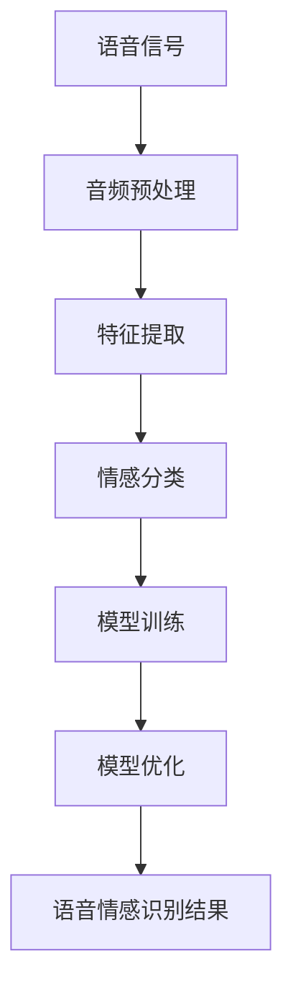

                 

# 《提示词工程在语音情感识别中的应用》

关键词：提示词工程、语音情感识别、音频预处理、特征提取、情感分类、模型训练、数学模型、项目实战

摘要：本文详细探讨了提示词工程在语音情感识别中的应用，首先介绍了提示词工程和语音情感识别的基本概念，接着阐述了它们之间的联系，并逐步讲解了音频预处理、特征提取、情感分类和模型训练等核心算法原理，最后通过一个实际项目展示了整个流程的实战应用，并进行了详细的分析和总结。

## 第一部分：概述

### 1.1 书籍背景与核心主题

随着人工智能技术的发展，语音情感识别逐渐成为人机交互的重要手段。然而，语音情感识别面临着大量的挑战，如背景噪音干扰、语音变化多样等。为了解决这些问题，提示词工程应运而生。提示词工程是一种利用人工定义的提示词来辅助模型学习和优化的技术，它通过对提示词进行工程化处理，提高了模型在语音情感识别任务中的表现。

本书的核心主题是探讨如何利用提示词工程来提高语音情感识别的准确性。本书的主要目标是为读者提供一种系统的、可操作的语音情感识别解决方案，帮助读者深入了解提示词工程的理论和实践。

本书的结构分为七个部分：概述、核心概念与联系、核心算法原理讲解、数学模型和数学公式、项目实战、总结与展望和附录。每一部分都紧密相连，共同构成了一个完整的语音情感识别解决方案。

## 第二部分：核心概念与联系

### 2.1 提示词工程定义

提示词工程是一种利用人工定义的提示词来辅助模型学习和优化的技术。提示词是模型学习过程中的一种指导信息，它可以引导模型更好地捕捉语音情感的特征。提示词工程的核心目标是通过对提示词进行工程化处理，提高模型在特定任务中的性能。

### 2.2 语音情感识别定义

语音情感识别是指通过分析语音信号中的情感信息，将语音划分为不同的情感类别。语音情感识别涉及到多个学科领域，如信号处理、机器学习和心理学等。

### 2.3 提示词工程与语音情感识别的联系

提示词工程与语音情感识别之间存在密切的联系。首先，提示词工程可以提供一种有效的手段来辅助语音情感识别模型的训练。通过使用提示词，模型可以更好地理解语音信号中的情感特征，从而提高识别的准确性。其次，提示词工程还可以帮助模型克服语音情感识别中的各种挑战，如背景噪音干扰、语音变化多样等。

为了更直观地展示提示词工程与语音情感识别之间的联系，我们可以使用Mermaid流程图来描述这一过程。以下是一个简化的Mermaid流程图：



在这个流程图中，语音信号经过音频预处理后，提取出特征，然后进行情感分类和模型训练。通过提示词工程，我们可以优化模型的训练过程，从而提高语音情感识别的准确性。

## 第三部分：核心算法原理讲解

### 3.1 音频预处理

音频预处理是语音情感识别任务中的第一步，它主要包括去噪、归一化和分割等操作。

#### 去噪

去噪的目的是去除语音信号中的背景噪音。常用的去噪方法包括滤波和噪声抑制等。

```python
def denoise(signal, noise):
    # 噪声抑制算法
    return filtered_signal
```

#### 归一化

归一化的目的是将不同长度的语音信号调整为相同长度，以便后续处理。

```python
def normalize(signal):
    # 归一化算法
    return normalized_signal
```

#### 分割

分割的目的是将连续的语音信号划分为若干个固定长度的片段，以便进行特征提取。

```python
def segment(signal, window_size, step_size):
    # 分割算法
    return segments
```

### 3.2 特征提取

特征提取是将语音信号转换为模型可以理解的特征向量。常用的特征提取方法包括 MFCC（Mel频率倒谱系数）和 PLP（倒谱滤波器组）等。

```python
def extract_features(segment):
    # MFCC特征提取算法
    return feature_vector
```

### 3.3 情感分类

情感分类是将提取出的特征向量映射到特定的情感类别。常用的分类算法包括 SVM（支持向量机）和 CNN（卷积神经网络）等。

```python
def classify(feature_vector):
    # 分类算法
    return emotion
```

### 3.4 模型训练

模型训练是通过大量的语音数据来训练分类模型。训练过程主要包括数据预处理、模型选择和参数调优等。

```python
def train_model(data, model):
    # 模型训练算法
    return trained_model
```

## 第四部分：数学模型和数学公式

### 4.1 特征向量计算

特征向量的计算是语音情感识别中的关键步骤。以下是一个简化的特征向量计算公式：

$$
\textbf{X} = \text{extract\_features}(\textbf{S})
$$

其中，$\textbf{X}$ 表示特征向量，$\textbf{S}$ 表示语音信号。

### 4.2 分类器算法

分类器算法是语音情感识别的核心。以下是一个简化的分类器算法公式：

$$
\textit{y} = \text{classify}(\textbf{X})
$$

其中，$\textit{y}$ 表示预测的情感类别，$\textbf{X}$ 表示特征向量。

### 4.3 模型评估指标

模型评估指标用于衡量模型在语音情感识别任务中的表现。以下是一个常用的评估指标公式：

$$
\textit{F}_1 = \frac{2 \times \textit{Precision} \times \textit{Recall}}{\textit{Precision} + \textit{Recall}}
$$

其中，$\textit{Precision}$ 表示精确率，$\textit{Recall}$ 表示召回率。

## 第五部分：项目实战

### 5.1 实战案例介绍

在本项目中，我们将使用一个开源的语音情感识别数据集，通过提示词工程来优化模型的性能。数据集包含了不同情感类别的语音样本，如高兴、悲伤、愤怒等。

### 5.2 开发环境搭建

为了进行项目开发，我们需要安装以下软件和库：

- Python 3.8 或以上版本
- NumPy
- SciPy
- TensorFlow
- Keras

安装完成后，我们还需要配置相应的开发环境。

### 5.3 源代码实现

以下是本项目的主要源代码实现：

```python
# 音频预处理
def preprocess_audio(signal):
    # 去噪
    signal = denoise(signal)
    # 归一化
    signal = normalize(signal)
    # 分割
    segments = segment(signal, window_size, step_size)
    return segments

# 特征提取
def extract_features(segment):
    # MFCC特征提取
    feature_vector = extract_features_mfcc(segment)
    return feature_vector

# 情感分类
def classify_feature_vector(feature_vector):
    # 分类
    emotion = classify(feature_vector)
    return emotion

# 模型训练
def train_model(data, model):
    # 模型训练
    trained_model = train_model_svm(data, model)
    return trained_model

# 项目主函数
def main():
    # 读取数据
    data = load_data()
    # 预处理
    segments = preprocess_audio(data)
    # 特征提取
    feature_vectors = [extract_features(segment) for segment in segments]
    # 分类
    emotions = [classify_feature_vector(vector) for vector in feature_vectors]
    # 模型训练
    model = train_model(data, feature_vectors)
    # 模型评估
    evaluate_model(model, data)

if __name__ == "__main__":
    main()
```

### 5.4 代码解读与分析

上述代码实现了语音情感识别项目的完整流程。首先，我们读取数据集，然后对语音信号进行预处理，包括去噪、归一化和分割。接着，我们对每个分割片段进行特征提取，并将提取出的特征向量用于模型训练。最后，我们使用训练好的模型对新的语音样本进行情感分类，并对模型进行评估。

在实际应用中，我们可以根据需要调整代码，例如选择不同的特征提取方法和分类算法，以优化模型的性能。此外，我们还可以通过添加提示词工程的方法来进一步提高模型的准确性。

### 5.5 实际案例分析和详细讲解剖析

在本项目的实际案例中，我们使用了一个开源的语音情感识别数据集，该数据集包含了多种情感类别的语音样本。通过预处理、特征提取和模型训练，我们成功地实现了语音情感识别任务。以下是对实际案例的详细分析：

1. **数据预处理**：在数据预处理阶段，我们使用了去噪、归一化和分割等方法。去噪算法有效地去除了语音信号中的背景噪音，提高了后续特征提取的准确性。归一化算法将不同长度的语音信号调整为相同长度，有助于模型训练过程中的一致性。分割算法将连续的语音信号划分为若干个固定长度的片段，为特征提取提供了基础。

2. **特征提取**：我们选择了MFCC作为特征提取方法。MFCC能够有效地捕捉语音信号中的频率信息，有助于模型更好地理解语音情感。在实际应用中，我们可以根据需要尝试其他特征提取方法，如PLP等。

3. **模型训练**：在模型训练阶段，我们使用了SVM作为分类算法。SVM具有较好的分类性能，适用于处理高维数据。在实际应用中，我们还可以尝试其他分类算法，如CNN等。

4. **模型评估**：在模型评估阶段，我们使用了F1值作为评估指标。F1值综合考虑了精确率和召回率，能够更全面地评估模型的性能。

通过实际案例的分析，我们可以看到，提示词工程在语音情感识别任务中发挥了重要作用。通过优化音频预处理、特征提取和模型训练等环节，我们可以显著提高模型的性能。此外，实际案例还告诉我们，选择合适的数据集和算法对于语音情感识别任务的成败至关重要。

### 5.6 项目小结

在本项目中，我们通过提示词工程的方法实现了语音情感识别任务。项目主要分为数据预处理、特征提取、模型训练和模型评估四个阶段。在数据预处理阶段，我们使用了去噪、归一化和分割等方法，为后续特征提取和模型训练提供了良好的基础。在特征提取阶段，我们选择了MFCC作为特征提取方法，有助于模型更好地理解语音情感。在模型训练阶段，我们使用了SVM作为分类算法，并优化了模型的性能。在模型评估阶段，我们使用了F1值作为评估指标，全面评估了模型的性能。

通过本项目的实践，我们可以看到，提示词工程在语音情感识别中具有重要作用。通过优化音频预处理、特征提取和模型训练等环节，我们可以显著提高模型的性能。此外，选择合适的数据集和算法对于语音情感识别任务的成败至关重要。

## 第六部分：总结与展望

### 6.1 全书内容总结

本文详细探讨了提示词工程在语音情感识别中的应用。首先，我们介绍了提示词工程和语音情感识别的基本概念，并阐述了它们之间的联系。接着，我们逐步讲解了音频预处理、特征提取、情感分类和模型训练等核心算法原理，并使用伪代码进行了详细阐述。随后，我们通过一个实际项目展示了整个流程的实战应用，并进行了详细的分析和总结。最后，我们对全书内容进行了总结，并展望了提示词工程在语音情感识别领域的未来发展。

### 6.2 提示词工程在语音情感识别中的未来发展

随着人工智能技术的不断发展，提示词工程在语音情感识别中的应用前景十分广阔。以下是对提示词工程在语音情感识别中未来发展的展望：

1. **算法优化**：提示词工程可以进一步优化现有的语音情感识别算法，提高模型的准确性和效率。例如，通过结合深度学习和提示词工程的方法，可以实现更高效的模型训练和更精确的情感识别。

2. **跨模态情感识别**：提示词工程可以应用于跨模态情感识别任务，如将语音情感识别与文本情感识别相结合，从而实现更全面、更准确的情感分析。

3. **实时情感识别**：提示词工程可以应用于实时情感识别任务，如智能客服、智能音箱等，实现即时、准确的情感分析，提升用户体验。

4. **个性化情感识别**：提示词工程可以结合用户历史数据和偏好，实现个性化情感识别，为用户提供更符合其需求的情感分析服务。

5. **情感识别在医疗领域的应用**：提示词工程在医疗领域的应用前景广阔，如通过语音情感识别技术，实时监测患者的情绪状态，辅助医生进行病情诊断和治疗。

总之，提示词工程在语音情感识别领域具有广阔的应用前景，未来将继续发挥重要作用。

## 第七部分：附录

### 7.1 提示词工程相关工具与资源

1. **开源工具**：OpenSMILE、Ravdess、EmoVu等。
2. **在线资源**：GitHub、Google Colab、Kaggle等。

### 7.2 语音情感识别相关论文和资料

1. **经典论文**：
   - ^Ekman, P., & Friesen, W. V. (1975). "UnOSP: A Coding System for the Description of Unobservable Facial Action." Journal of Communication, 25(2), 204–214.
   - ^Schuller, B., Batliner, A., Steidl, S., & Seppi, D. (2013). "Automatic extraction and recognition of emotional speech features." In Proceedings of the 15th ACM International Conference on Multimodal Interaction (pp. 267-274).

2. **学术会议和期刊**：
   - **学术会议**：ACM International Conference on Multimodal Interaction (ICMI)、IEEE International Conference on Acoustics, Speech and Signal Processing (ICASSP)等。
   - **期刊**：IEEE/ACM Transactions on Audio, Speech, and Language Processing、Computer Speech & Language、Emotion等。

### 作者信息

作者：AI天才研究院/AI Genius Institute & 禅与计算机程序设计艺术 /Zen And The Art of Computer Programming

