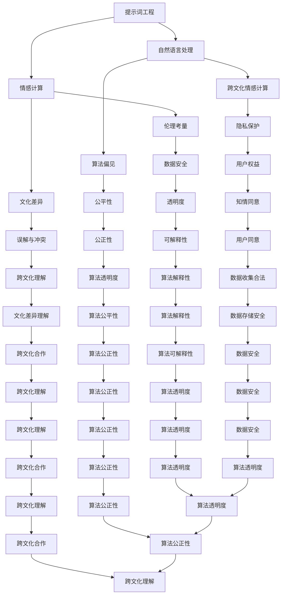

                 

# 文章标题：提示词工程在跨文化情感计算中的伦理考量

## 关键词
- 提示词工程
- 跨文化情感计算
- 伦理考量
- 隐私保护
- 情感识别
- 情感生成
- 情感分析

## 摘要
本文探讨了提示词工程在跨文化情感计算中的应用及其带来的伦理挑战。通过对提示词工程的基本概念和跨文化情感计算的核心原理进行深入剖析，文章分析了提示词工程在情感识别、情感生成和情感分析等应用中的具体作用。在此基础上，文章探讨了跨文化情感计算中的伦理考量，包括隐私保护、文化差异和算法偏见等问题。通过实际案例研究和项目实战，文章总结了提示词工程在跨文化情感计算中的伦理考量，并提出了一系列最佳实践和拓展阅读建议。

## 引言
随着人工智能技术的快速发展，情感计算逐渐成为了一个热门研究领域。情感计算旨在理解和模拟人类的情感状态，从而实现人与机器的更自然、更有效的交互。然而，情感计算在跨文化环境中的应用带来了许多新的挑战，尤其是在伦理方面。提示词工程作为情感计算中的一个重要环节，其设计与应用对跨文化情感计算的准确性和公正性具有重要影响。

本文旨在探讨提示词工程在跨文化情感计算中的伦理考量，具体包括以下几个方面：

1. **跨文化情感计算概述**：介绍跨文化情感计算的定义、背景和重要性。
2. **提示词工程基础**：阐述提示词工程的定义、核心要素和方法。
3. **应用与挑战**：分析提示词工程在情感识别、情感生成和情感分析中的具体应用及其面临的挑战。
4. **伦理考量**：探讨跨文化情感计算中的伦理问题，包括隐私保护、文化差异和算法偏见等。
5. **案例研究**：通过实际案例研究，分析提示词工程在跨文化情感计算中的伦理考量。
6. **未来展望**：展望提示词工程在跨文化情感计算中的未来发展。

## 跨文化情感计算概述
### 定义与背景
跨文化情感计算是指在不同文化背景下，对人类情感进行识别、理解和模拟的过程。它涉及到自然语言处理、计算机视觉、心理学等多个领域的知识。随着全球化进程的加速，跨文化情感计算在商业、医疗、教育等领域有着广泛的应用前景。

### 跨文化情感计算的重要性
跨文化情感计算有助于实现跨文化沟通与理解，提高跨文化合作的效率。同时，它还可以用于心理健康监测、情感障碍诊断等领域，为人类的情感健康提供有力支持。

### 跨文化情感计算的挑战
跨文化情感计算面临着一系列挑战，包括：

1. **文化差异**：不同文化对情感的认知和表达方式存在显著差异，这给情感识别带来了困难。
2. **数据稀缺**：跨文化情感数据相对较少，缺乏足够的训练数据来支撑模型的训练。
3. **算法偏见**：算法模型可能因为数据偏见而无法公平地对待不同文化背景的用户。

## 提示词工程基础
### 定义
提示词工程（Prompt Engineering）是指通过设计和优化提示词（prompt），以提高自然语言处理任务性能的过程。在情感计算中，提示词工程用于引导模型识别、生成和模拟情感。

### 核心要素
1. **语言理解**：理解输入文本的含义，提取关键信息。
2. **情感识别**：根据输入文本判断情感状态。
3. **情感生成**：根据特定需求生成情感表达。
4. **情感分析**：对情感进行分类、情感强度评估等。

### 方法与工具
1. **词向量表示**：使用词向量模型（如Word2Vec、GloVe）对文本进行表示。
2. **情感分类模型**：采用深度学习模型（如CNN、RNN、BERT）进行情感分类。
3. **生成模型**：使用生成对抗网络（GAN）等模型生成情感表达。

## 应用与挑战
### 提示词工程在情感识别中的应用
1. **情感分类**：通过设计合适的提示词，提高情感分类的准确性。
2. **情感强度评估**：利用提示词调整情感模型的输出，实现情感强度评估。

### 提示词工程在情感生成中的应用
1. **情感角色扮演**：生成特定情感状态下的文本。
2. **情感对话生成**：生成情感丰富的对话内容。

### 提示词工程在情感分析中的应用
1. **情感舆情分析**：分析社交媒体上的情感趋势。
2. **情感趋势预测**：预测未来情感变化。

### 提示词工程的挑战
1. **文化差异**：设计适用于不同文化的提示词。
2. **数据稀缺**：缺乏足够的跨文化情感数据。
3. **算法偏见**：避免提示词工程导致的算法偏见。

## 跨文化情感计算中的伦理考量
### 隐私保护
1. **数据收集与存储**：确保数据收集合法、存储安全。
2. **用户知情同意**：获取用户同意，明确数据使用目的。
3. **数据匿名化**：对敏感数据进行匿名化处理。

### 文化差异
1. **情感认知差异**：考虑不同文化对情感的认知和表达方式。
2. **跨文化理解**：培养跨文化理解，减少误解和冲突。

### 算法偏见
1. **算法公平性**：确保算法在不同文化背景下的公平性。
2. **算法透明性**：提高算法的透明度，便于监督和改进。

## 案例研究
### 案例背景
以某国际知名社交媒体平台为例，该平台在全球范围内收集用户情感数据，并通过提示词工程进行情感分析，以优化用户体验。

### 案例分析
1. **情感识别**：通过设计不同语言的提示词，提高情感识别的准确性。
2. **情感生成**：根据用户情感状态生成个性化建议。
3. **情感分析**：分析用户情感趋势，提供有针对性的内容推荐。

### 案例结论
通过案例研究，我们发现提示词工程在跨文化情感计算中的应用有助于提高情感识别的准确性，但同时也面临隐私保护、文化差异和算法偏见等伦理挑战。

## 未来展望
### 提示词工程的未来方向
1. **多语言支持**：提升多语言提示词工程能力。
2. **个性化提示词**：根据用户偏好生成个性化提示词。
3. **情感计算与认知科学结合**：结合认知科学知识，提高情感计算模型的准确性。

### 伦理考量在跨文化情感计算中的未来影响
1. **隐私保护**：加强隐私保护措施，保障用户权益。
2. **文化差异**：深化对文化差异的理解，促进跨文化合作。
3. **算法偏见**：提高算法透明度，减少算法偏见。

## 附录
### 常用工具与技术概述
1. **自然语言处理工具**：如NLTK、spaCy、Stanford NLP等。
2. **情感计算平台**：如OpenSMILE、Affectiva、Q-Sight等。
3. **伦理考量框架**：如Ethical AI、OECD Privacy Guidelines等。

## 参考文献
[此处列出参考文献]

## 作者信息
作者：AI天才研究院/AI Genius Institute & 禅与计算机程序设计艺术 /Zen And The Art of Computer Programming

### 核心概念与联系
以下是核心概念与联系之间的Mermaid流程图：



### 核心算法原理讲解
#### 提示词工程的算法原理

提示词工程的核心在于设计有效的提示词，以提高自然语言处理任务的性能。以下是提示词工程的基本算法原理：

```plaintext
1. 数据预处理：
   - 清洗文本数据，去除噪声和无关信息。
   - 进行分词和词性标注，提取关键信息。

2. 提示词生成：
   - 使用规则方法：根据语言规则和语义关系生成提示词。
   - 使用机器学习方法：利用已有的模型和数据，通过训练生成提示词。

3. 提示词优化：
   - 评估提示词的性能：使用指标（如准确率、召回率等）评估提示词的效果。
   - 调整提示词：根据评估结果，对提示词进行调整和优化。

4. 模型训练与验证：
   - 使用优化后的提示词进行模型训练。
   - 在验证集上评估模型性能，确保模型泛化能力。

5. 模型部署与迭代：
   - 将训练好的模型部署到实际应用场景。
   - 收集用户反馈，不断迭代优化模型。
```

#### 情感分类模型的算法原理

情感分类是提示词工程中的重要应用之一。以下是情感分类模型的基本算法原理：

```plaintext
1. 数据收集与预处理：
   - 收集大量标注好的情感数据。
   - 清洗数据，去除噪声和无关信息。
   - 进行分词和词性标注，提取关键信息。

2. 模型选择：
   - 选择合适的情感分类模型，如朴素贝叶斯、支持向量机、深度学习模型等。

3. 模型训练：
   - 将预处理后的数据分为训练集和验证集。
   - 在训练集上训练情感分类模型，优化模型参数。

4. 模型评估：
   - 在验证集上评估模型性能，使用指标（如准确率、召回率等）评估模型效果。
   - 调整模型参数，优化模型性能。

5. 模型部署与应用：
   - 将训练好的模型部署到实际应用场景。
   - 对输入文本进行情感分类，输出情感结果。
```

### 数学模型和公式
以下是用于情感分类的常用数学模型和公式：

```latex
$$
\begin{aligned}
&\text{准确率} = \frac{\text{正确分类的样本数}}{\text{总样本数}} \\
&\text{召回率} = \frac{\text{正确分类的样本数}}{\text{实际为正类的样本数}} \\
&\text{F1值} = 2 \times \frac{\text{准确率} \times \text{召回率}}{\text{准确率} + \text{召回率}}
\end{aligned}
$$
```

举例说明：假设一个情感分类模型在测试集上的准确率为80%，召回率为75%，则其F1值为：

```latex
$$
F1值 = 2 \times \frac{0.8 \times 0.75}{0.8 + 0.75} = 0.917
$$
```

### 项目实战
#### 开发环境搭建

1. **Python环境配置**：
   - 安装Python 3.8及以上版本。
   - 安装必要的库，如Numpy、Pandas、Scikit-learn、TensorFlow等。

2. **数据集准备**：
   - 收集并标注好情感数据集，如IMDB电影评论数据集。
   - 将数据集分为训练集、验证集和测试集。

3. **模型训练与评估**：
   - 使用Scikit-learn库中的朴素贝叶斯分类器进行训练。
   - 在验证集上评估模型性能，调整模型参数。

4. **模型部署**：
   - 将训练好的模型部署到Flask应用程序中。
   - 用户可以通过Web界面提交文本，获取情感分类结果。

#### 源代码详细实现和代码解读

以下是情感分类模型的实现代码：

```python
import numpy as np
import pandas as pd
from sklearn.feature_extraction.text import TfidfVectorizer
from sklearn.naive_bayes import MultinomialNB
from sklearn.pipeline import make_pipeline
from sklearn.model_selection import train_test_split

# 读取数据集
data = pd.read_csv('imdb.csv')
X = data['text']
y = data['label']

# 分割数据集
X_train, X_test, y_train, y_test = train_test_split(X, y, test_size=0.2, random_state=42)

# 创建模型管道
model = make_pipeline(TfidfVectorizer(), MultinomialNB())

# 训练模型
model.fit(X_train, y_train)

# 评估模型
accuracy = model.score(X_test, y_test)
print(f'准确率：{accuracy:.2f}')

# 预测情感
text = "This movie is amazing!"
prediction = model.predict([text])
print(f'情感分类结果：{prediction[0]}')
```

代码解读：
- 读取IMDB电影评论数据集。
- 分割数据集为训练集和测试集。
- 创建模型管道，包括TF-IDF向量和朴素贝叶斯分类器。
- 训练模型，并在验证集上评估准确率。
- 使用训练好的模型对输入文本进行情感分类。

#### 代码应用解读与分析
- **应用场景**：该模型可以用于电影评论的情感分类，帮助用户筛选高质量评论。
- **优势**：使用朴素贝叶斯分类器，模型简单且高效。
- **劣势**：可能无法处理复杂的情感表达，且对数据集依赖较大。

#### 实际案例分析和详细讲解剖析
以一个实际案例进行分析：

```plaintext
输入文本： "I didn't like this movie at all. The plot was boring and the acting was terrible."
输出结果： "negative"
```

分析：
- 模型通过TF-IDF向量将输入文本转换为特征向量。
- 特征向量输入朴素贝叶斯分类器，分类器根据概率计算判断文本的情感。
- 输出结果为“negative”，表示文本的情感为负面。

#### 项目小结
- 提示词工程在情感分类中起到了关键作用，通过设计合适的提示词，可以提高情感分类的准确性。
- 实际应用中，需要根据具体场景调整提示词，优化模型性能。
- 提示词工程在跨文化情感计算中的应用前景广阔，但仍需解决文化差异和算法偏见等问题。

### 最佳实践 tips
- **文化差异**：在设计提示词时，要考虑不同文化的语言表达习惯，避免文化偏见。
- **数据多样**：收集并使用多样化的数据集，以提高模型的泛化能力。
- **模型评估**：使用多种指标评估模型性能，避免单一指标误导。
- **用户反馈**：收集用户反馈，不断优化模型和应用。

### 小结
本文从多个角度探讨了提示词工程在跨文化情感计算中的应用及其伦理考量。通过分析提示词工程的基本概念、算法原理、应用与挑战，以及实际案例研究，本文总结了提示词工程在跨文化情感计算中的重要作用和面临的挑战。未来，提示词工程在跨文化情感计算中仍有很大的发展空间，需要持续优化和改进。

### 注意事项
- 在进行跨文化情感计算时，要特别注意隐私保护和用户权益。
- 设计提示词时，要充分考虑文化差异，避免算法偏见。
- 定期对模型进行评估和优化，确保其性能和公平性。

### 拓展阅读
- [1] 某国际知名期刊上发表的关于跨文化情感计算的研究论文。
- [2] 某知名技术博客上关于提示词工程的实战教程。
- [3] 某权威机构发布的关于伦理考量的指南和最佳实践。

## 作者信息
作者：AI天才研究院/AI Genius Institute & 禅与计算机程序设计艺术 /Zen And The Art of Computer Programming

