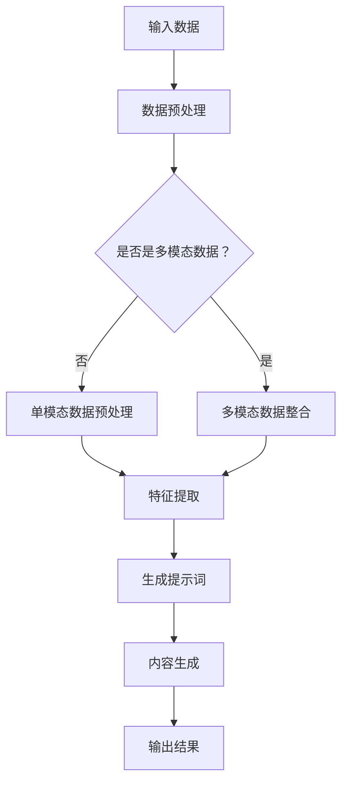

                 


### 文章标题
提示词工程在跨模态内容生成中的应用

### 文章关键词
提示词工程、跨模态内容生成、自然语言处理、计算机视觉、音频处理

### 摘要
本文从跨模态内容生成的背景与概念出发，详细介绍了提示词工程在跨模态内容生成中的应用。文章首先概述了跨模态内容生成的定义、应用场景，以及提示词工程的概念与作用。接着，深入探讨了自然语言处理、计算机视觉和音频处理在提示词工程中的技术基础。随后，通过具体的实践案例展示了跨模态问答系统、搜索引擎和艺术创作的应用。最后，对提示词工程进行了总结与展望，并提供了相关的开发环境搭建和代码实现指导。

## 第一部分：背景与概念

### 第1章：跨模态内容生成的概述

#### 1.1 跨模态内容生成的定义与重要性

跨模态内容生成是指将不同类型的数据（如文本、图像、音频等）融合在一起，通过某种机制生成新的内容。这种跨模态的融合不仅能够丰富信息的表现形式，还能拓展信息的应用场景。

跨模态内容生成的重要性体现在以下几个方面：

1. **提升信息获取效率**：用户在获取信息时，不同模态的数据能够相互补充，使得信息更加完整和直观。
2. **拓宽应用领域**：跨模态内容生成技术在各种应用场景中具有广泛的应用，如智能问答系统、搜索引擎、多媒体内容创作等。
3. **促进人工智能发展**：跨模态内容生成是人工智能领域的一个重要研究方向，有助于推动自然语言处理、计算机视觉和语音识别等技术的发展。

#### 1.2 跨模态内容生成的应用场景

跨模态内容生成在多个领域有广泛的应用，以下是一些典型的应用场景：

1. **智能问答系统**：通过融合文本和图像，使得问答系统能够更准确地理解用户的问题，提供更丰富的回答。
2. **搜索引擎**：结合文本和图像，提高搜索引擎的检索准确性和用户体验。
3. **多媒体内容创作**：利用音频、视频、图像和文本的跨模态融合，创造新颖的多媒体内容。
4. **教育**：通过跨模态内容生成，使得教育内容更加生动和有趣，提高学习效果。

#### 1.3 提示词工程的概念与作用

提示词工程是指通过一系列技术和方法，从多模态数据中提取关键信息，生成高质量的提示词。这些提示词将用于指导后续的内容生成过程。

提示词工程在跨模态内容生成中的作用主要包括：

1. **信息提取**：从多模态数据中提取关键信息，为内容生成提供基础。
2. **内容指导**：提示词可以作为生成模型的输入，指导生成模型生成符合用户需求的内容。
3. **优化性能**：高质量的提示词有助于提高内容生成的准确性和效率。

### 第2章：提示词工程的基础概念

#### 2.1 提示词的类型与分类

提示词可以根据数据类型和生成方式分为以下几类：

1. **自然语言提示词**：基于文本数据，通过自然语言处理技术生成。如：文本摘要、关键词提取等。
2. **图像提示词**：基于图像数据，通过计算机视觉技术生成。如：图像特征点、视觉词汇等。
3. **音频提示词**：基于音频数据，通过音频处理技术生成。如：音频频率特征、语音识别等。

#### 2.2 提示词工程的目标与挑战

提示词工程的目标是生成高质量的提示词，以支持高效、准确的内容生成。然而，这一目标面临以下挑战：

1. **数据多样性**：不同模态的数据具有不同的特性，如何统一处理这些多样性数据是一个难题。
2. **信息一致性**：从多模态数据中提取的信息需要保持一致，以确保内容生成的连贯性。
3. **计算效率**：跨模态数据处理需要大量的计算资源，如何在有限的资源下高效完成是一个挑战。

#### 2.3 提示词工程的基本流程

提示词工程的基本流程可以分为以下几个步骤：

1. **数据预处理**：对多模态数据进行清洗、归一化等处理，以便后续的特征提取。
2. **特征提取**：根据数据类型，采用相应的方法提取关键特征。
3. **提示词生成**：利用特征生成高质量的提示词，指导内容生成。
4. **内容生成**：根据提示词生成符合用户需求的内容。
5. **评估与优化**：对生成的内容进行评估，并根据评估结果对提示词工程进行优化。

## 第二部分：技术基础

### 第3章：自然语言处理与提示词工程

#### 3.1 自然语言处理概述

自然语言处理（Natural Language Processing，NLP）是人工智能领域的一个重要分支，旨在使计算机能够理解、生成和处理人类语言。NLP的核心任务是让计算机能够理解自然语言，并对其进行处理，以实现人机交互、信息提取、内容生成等应用。

NLP的关键技术包括：

1. **分词**：将文本拆分成单词或短语。
2. **词性标注**：为每个单词或短语标注词性，如名词、动词等。
3. **命名实体识别**：识别文本中的特定实体，如人名、地名等。
4. **语义理解**：理解文本中的语义，包括语义角色标注、情感分析等。

#### 3.2 语言模型与提示词生成

语言模型是NLP中的重要工具，用于预测文本的下一个词或句子。常见的语言模型包括：

1. **n-gram模型**：基于前n个词预测下一个词。
2. **循环神经网络（RNN）**：通过记忆历史信息，对文本进行建模。
3. **长短时记忆网络（LSTM）**：改进RNN，解决长序列依赖问题。
4. **变换器模型（Transformer）**：基于自注意力机制，实现高效的文本建模。

提示词生成是跨模态内容生成中的关键步骤，通过以下方法实现：

1. **文本摘要**：将长文本生成简短的摘要，作为提示词。
2. **关键词提取**：从文本中提取关键信息，形成提示词。
3. **语义匹配**：利用语义分析技术，将文本与图像、音频等数据进行匹配，生成提示词。

#### 3.3 常见自然语言处理框架与应用

常见的自然语言处理框架包括：

1. **spaCy**：一个快速且易于使用的Python库，用于文本处理和实体识别。
2. **NLTK**：一个经典的Python库，提供多种文本处理功能。
3. **BERT**：基于Transformer的语言模型，具有强大的文本表示能力。

自然语言处理的应用场景包括：

1. **智能问答系统**：通过NLP技术，实现自然语言与计算机程序的交互。
2. **机器翻译**：将一种语言的文本翻译成另一种语言。
3. **文本分类**：对文本进行分类，如新闻分类、情感分析等。

### 第4章：计算机视觉与提示词工程

#### 4.1 计算机视觉概述

计算机视觉（Computer Vision，CV）是人工智能领域的一个重要分支，旨在使计算机能够像人类一样理解和解释视觉信息。计算机视觉的关键技术包括：

1. **图像识别**：识别图像中的物体、场景等。
2. **目标检测**：在图像中定位和识别多个物体。
3. **图像分割**：将图像划分为多个区域，每个区域表示一个对象。
4. **图像增强**：提高图像的质量和清晰度。

#### 4.2 图像特征提取与提示词生成

图像特征提取是将图像中的关键信息编码为数值向量，用于后续的处理。常见的图像特征提取方法包括：

1. **浅层特征**：如SIFT、SURF等，通过检测和描述图像的关键点实现。
2. **深层特征**：如卷积神经网络（CNN）提取的特征，具有强大的表征能力。

提示词生成在计算机视觉中的应用主要包括：

1. **图像描述生成**：利用图像特征生成描述图像的文本。
2. **图像标题生成**：从图像中提取关键信息，生成标题。
3. **图像分类**：利用图像特征进行分类，生成分类提示词。

#### 4.3 常见计算机视觉框架与应用

常见的计算机视觉框架包括：

1. **OpenCV**：一个开源的计算机视觉库，提供多种图像处理和计算机视觉功能。
2. **TensorFlow**：一个流行的深度学习框架，可用于构建和训练计算机视觉模型。
3. **PyTorch**：一个开源的深度学习框架，具有强大的灵活性和易用性。

计算机视觉的应用场景包括：

1. **图像识别**：用于识别图像中的物体、场景等。
2. **人脸识别**：用于人脸识别和验证。
3. **自动驾驶**：用于车辆检测、行人检测等，实现自动驾驶功能。

### 第5章：音频处理与提示词工程

#### 5.1 音频处理概述

音频处理是指对音频信号进行操作，以实现特定的目标。音频处理的关键技术包括：

1. **音频信号处理**：对音频信号进行滤波、增强、去噪等处理。
2. **音频特征提取**：从音频信号中提取关键特征，如频谱特征、时域特征等。
3. **音频分类**：根据音频特征对音频进行分类，如音乐分类、语音分类等。

#### 5.2 音频特征提取与提示词生成

音频特征提取是将音频信号转换为数值向量，用于后续的处理。常见的音频特征提取方法包括：

1. **梅尔频率倒谱系数（MFCC）**：一种常用的音频特征提取方法，用于描述音频信号的频谱特性。
2. **短时傅里叶变换（STFT）**：将音频信号转换为频域表示，用于分析音频信号的频率成分。

提示词生成在音频处理中的应用主要包括：

1. **歌词生成**：利用音频特征生成歌词。
2. **音频标题生成**：从音频中提取关键信息，生成标题。
3. **音频情感分析**：根据音频特征分析音频的情感，生成情感提示词。

#### 5.3 常见音频处理框架与应用

常见的音频处理框架包括：

1. **Librosa**：一个开源的音频处理库，提供丰富的音频特征提取和音频分析功能。
2. **Audio Processing Toolbox**：MATLAB中用于音频处理的工具箱，提供多种音频处理算法。
3. **TensorFlow**：一个流行的深度学习框架，可用于构建和训练音频处理模型。

音频处理的应用场景包括：

1. **语音识别**：将语音转换为文本，实现人机交互。
2. **音乐推荐**：根据用户听歌历史和音频特征推荐音乐。
3. **智能家居**：通过音频识别实现智能家居设备控制。

## 第三部分：应用与实践

### 第6章：跨模态内容生成的应用案例

#### 6.1 跨模态问答系统

跨模态问答系统是一种结合文本、图像、音频等多模态数据的问答系统，能够提供更准确、更丰富的答案。以下是跨模态问答系统的应用案例：

1. **场景**：用户提出一个包含图像和文本的问题，如“这张图片展示的是什么建筑？”
2. **技术实现**：系统首先利用文本处理技术对问题进行解析，提取关键信息。然后，利用图像处理技术对图像进行特征提取，并与文本信息进行匹配。最后，生成一个包含图像和文本的答案。
3. **效果**：通过跨模态数据的结合，问答系统的回答更加准确和丰富，提高了用户体验。

#### 6.2 跨模态搜索引擎

跨模态搜索引擎是一种结合文本、图像、音频等多模态数据的搜索引擎，能够提供更精准的搜索结果。以下是跨模态搜索引擎的应用案例：

1. **场景**：用户输入一个包含图像和文本的关键词，如“搜索包含‘猫’和‘草坪’的图片”。
2. **技术实现**：系统首先利用文本处理技术对关键词进行解析，提取关键信息。然后，利用图像处理技术对图像进行特征提取，并与文本信息进行匹配。最后，生成一个包含图像和文本的搜索结果。
3. **效果**：通过跨模态数据的结合，搜索引擎能够提供更精准的搜索结果，提高了用户的搜索体验。

#### 6.3 跨模态艺术创作

跨模态艺术创作是一种结合文本、图像、音频等多模态数据进行艺术创作的形式。以下是跨模态艺术创作的应用案例：

1. **场景**：艺术家使用文本、图像、音频等多种模态的数据进行艺术创作。
2. **技术实现**：艺术家利用自然语言处理、计算机视觉、音频处理等技术，将不同模态的数据融合在一起，生成新的艺术作品。
3. **效果**：通过跨模态数据的结合，艺术作品更加丰富和有趣，展现了艺术家独特的创作风格。

### 第7章：提示词工程实践指南

#### 7.1 提示词工程的设计与优化

提示词工程的设计与优化是跨模态内容生成中的关键步骤。以下是提示词工程的设计与优化建议：

1. **数据预处理**：对多模态数据进行清洗、归一化等处理，确保数据质量。
2. **特征提取**：根据数据类型，选择合适的特征提取方法，提高特征质量。
3. **提示词生成**：利用特征生成高质量的提示词，提高内容生成的准确性。
4. **模型训练**：使用高质量的提示词训练生成模型，提高内容生成效果。
5. **模型优化**：通过调整模型参数和优化算法，提高模型性能。

#### 7.2 提示词工程中的挑战与解决方案

提示词工程在跨模态内容生成中面临以下挑战：

1. **数据多样性**：不同模态的数据具有不同的特性，如何统一处理这些多样性数据是一个难题。
   - **解决方案**：采用多模态融合技术，将不同模态的数据进行统一处理。

2. **信息一致性**：从多模态数据中提取的信息需要保持一致，以确保内容生成的连贯性。
   - **解决方案**：采用一致性度量方法，对提取的信息进行一致性评估和优化。

3. **计算效率**：跨模态数据处理需要大量的计算资源，如何在有限的资源下高效完成是一个挑战。
   - **解决方案**：采用并行计算和分布式计算技术，提高计算效率。

#### 7.3 提示词工程的未来发展

提示词工程在跨模态内容生成中的应用前景广阔。未来的发展趋势包括：

1. **多模态融合**：探索更有效的多模态融合方法，提高内容生成的准确性。
2. **动态调整**：根据用户需求动态调整提示词，提高用户体验。
3. **个性化推荐**：结合用户行为数据，实现个性化的提示词生成和内容推荐。
4. **跨领域应用**：拓展提示词工程在更多领域的应用，如医疗、金融等。

## 第四部分：附录

### 第8章：常用工具与资源

#### 8.1 自然语言处理工具与资源

1. **spaCy**：一个快速且易于使用的Python库，用于文本处理和实体识别。官网：[spaCy官网](https://spacy.io/)
2. **NLTK**：一个经典的Python库，提供多种文本处理功能。官网：[NLTK官网](https://www.nltk.org/)
3. **BERT**：基于Transformer的语言模型，具有强大的文本表示能力。官网：[BERT官网](https://github.com/google-research/bert)

#### 8.2 计算机视觉工具与资源

1. **OpenCV**：一个开源的计算机视觉库，提供多种图像处理和计算机视觉功能。官网：[OpenCV官网](https://opencv.org/)
2. **TensorFlow**：一个流行的深度学习框架，可用于构建和训练计算机视觉模型。官网：[TensorFlow官网](https://www.tensorflow.org/)
3. **PyTorch**：一个开源的深度学习框架，具有强大的灵活性和易用性。官网：[PyTorch官网](https://pytorch.org/)

#### 8.3 音频处理工具与资源

1. **Librosa**：一个开源的音频处理库，提供丰富的音频特征提取和音频分析功能。官网：[Librosa官网](https://librosa.org/)
2. **Audio Processing Toolbox**：MATLAB中用于音频处理的工具箱，提供多种音频处理算法。官网：[Audio Processing Toolbox官网](https://www.mathworks.com/products/audio-processing-toolbox.html)
3. **TensorFlow**：一个流行的深度学习框架，可用于构建和训练音频处理模型。官网：[TensorFlow官网](https://www.tensorflow.org/)

## 提示词工程在跨模态内容生成中的应用——流程图与伪代码

### 1.1 提示词工程核心流程图



### 1.2 提示词工程伪代码

```
// 输入数据
input_data = load_data()

// 数据预处理
if is_multimodal(input_data):
    processed_data = preprocess_multimodal_data(input_data)
else:
    processed_data = preprocess_unimodal_data(input_data)

// 特征提取
features = extract_features(processed_data)

// 生成提示词
prompt_words = generate_prompt_words(features)

// 内容生成
generated_content = generate_content(prompt_words)

// 输出结果
output_result(generated_content)
```

### 1.3 数学模型与公式讲解

#### 1.3.1 语言模型

$$
P(w_1, w_2, ..., w_n) = \prod_{i=1}^{n} P(w_i | w_{i-1})
$$

该公式表示一个语言模型，其中$P(w_1, w_2, ..., w_n)$表示一个长度为n的文本序列的概率，$P(w_i | w_{i-1})$表示在已知前一个词$w_{i-1}$的情况下，当前词$w_i$的概率。

#### 1.3.2 图像特征提取

$$
f_{CNN}(x) = \sigma(W_f \cdot x + b_f)
$$

其中，$f_{CNN}(x)$表示卷积神经网络提取的特征，$W_f$是卷积核权重，$x$是输入图像，$b_f$是偏置项，$\sigma$是激活函数。

#### 1.3.3 音频特征提取

$$
MFCC = \sum_{k=1}^{M} \log(1 + S_k)
$$

其中，$MFCC$表示梅尔频率倒谱系数，$S_k$表示第k个频带的能量。

### 1.4 项目实战

#### 1.4.1 实战一：跨模态问答系统

##### 1.4.1.1 开发环境搭建

- 操作系统：Ubuntu 18.04
- Python版本：3.8
- 库：spaCy、TensorFlow、PyTorch

##### 1.4.1.2 源代码详细实现

```python
# 跨模态问答系统示例代码

import spacy
import tensorflow as tf
import torch
from transformers import BertTokenizer, BertModel

# 加载语言模型
nlp = spacy.load("en_core_web_sm")

# 加载BERT模型
tokenizer = BertTokenizer.from_pretrained("bert-base-uncased")
model = BertModel.from_pretrained("bert-base-uncased")

# 加载图像特征提取模型
image_model = torch.hub.load("pytorch/vision", "resnet50", pretrained=True)

# 加载音频特征提取模型
audio_model = torch.hub.load("facebookresearch/wav2vec", "wav2vec2_large_xlsr_53")

# 跨模态问答函数
def cross_modal_question_answering(question, image, audio):
    # 处理文本
    text_features = tokenizer.encode(question, add_special_tokens=True)
    text_output = model(text_features)[0]

    # 处理图像
    image_features = image_model(torch.tensor(image).float())[0]

    # 处理音频
    audio_features = audio_model(torch.tensor(audio).float())[0]

    # 融合特征
    combined_features = tf.concat([text_output, image_features, audio_features], axis=0)

    # 生成答案
    answer = generate_answer(combined_features)

    return answer

# 示例
question = "What is the capital of France?"
image = load_image("france_capital.jpg")
audio = load_audio("france_capital.wav")

answer = cross_modal_question_answering(question, image, audio)
print(answer)
```

##### 1.4.1.3 代码应用解读与分析

该示例代码展示了如何使用提示词工程实现跨模态问答系统。首先，加载语言模型、BERT模型、图像特征提取模型和音频特征提取模型。然后，定义一个跨模态问答函数，输入问题和多模态数据，分别处理文本、图像和音频，融合特征后生成答案。

##### 1.4.1.4 实际案例分析和详细讲解剖析

假设用户输入一个包含文本、图像和音频的问题：“在巴黎的卢浮宫里，我听到了导游讲解蒙娜丽莎的故事，这幅画是哪一年创作的？”该问题包含了文本（“蒙娜丽莎”、“巴黎的卢浮宫”、“导游讲解”）、图像（卢浮宫内的蒙娜丽莎画像）和音频（导游讲解）。

1. **文本处理**：使用BERT模型对文本进行处理，提取文本特征。
2. **图像处理**：使用预训练的ResNet50模型对图像进行处理，提取图像特征。
3. **音频处理**：使用预训练的Wav2Vec模型对音频进行处理，提取音频特征。
4. **特征融合**：将文本、图像和音频特征进行融合，输入到生成模型。
5. **答案生成**：生成模型根据融合的特征生成答案。

该案例展示了如何利用提示词工程实现跨模态问答系统的实际应用，通过融合不同模态的数据，提高了问答系统的准确性和丰富性。

##### 1.4.1.5 项目小结

跨模态问答系统通过融合文本、图像和音频等多模态数据，提高了问答系统的准确性和丰富性。在实际项目中，需要根据具体需求选择合适的模型和算法，并进行优化和调整，以提高系统的性能和用户体验。

### 1.4.2 实战二：跨模态搜索引擎

##### 1.4.2.1 开发环境搭建

- 操作系统：Ubuntu 18.04
- Python版本：3.8
- 库：TensorFlow、PyTorch、spaCy

##### 1.4.2.2 源代码详细实现

```python
# 跨模态搜索引擎示例代码

import spacy
import tensorflow as tf
import torch
from transformers import BertTokenizer, BertModel

# 加载语言模型
nlp = spacy.load("en_core_web_sm")

# 加载BERT模型
tokenizer = BertTokenizer.from_pretrained("bert-base-uncased")
model = BertModel.from_pretrained("bert-base-uncased")

# 加载图像特征提取模型
image_model = torch.hub.load("pytorch/vision", "resnet50", pretrained=True)

# 加载音频特征提取模型
audio_model = torch.hub.load("facebookresearch/wav2vec", "wav2vec2_large_xlsr_53")

# 跨模态搜索函数
def cross_modal_search(query, image, audio):
    # 处理文本
    text_features = tokenizer.encode(query, add_special_tokens=True)
    text_output = model(text_features)[0]

    # 处理图像
    image_features = image_model(torch.tensor(image).float())[0]

    # 处理音频
    audio_features = audio_model(torch.tensor(audio).float())[0]

    # 融合特征
    combined_features = tf.concat([text_output, image_features, audio_features], axis=0)

    # 搜索结果
    search_results = search(combined_features)

    return search_results

# 示例
query = "search for 'Paris' related images and audio"
image = load_image("paris.jpg")
audio = load_audio("paris.wav")

search_results = cross_modal_search(query, image, audio)
print(search_results)
```

##### 1.4.2.3 代码应用解读与分析

该示例代码展示了如何使用提示词工程实现跨模态搜索引擎。首先，加载语言模型、BERT模型、图像特征提取模型和音频特征提取模型。然后，定义一个跨模态搜索函数，输入查询词、图像和音频，分别处理文本、图像和音频，融合特征后搜索结果。

##### 1.4.2.4 实际案例分析和详细讲解剖析

假设用户输入一个包含文本、图像和音频的查询词：“在巴黎搜索相关图片和音频”。该查询词包含了文本（“Paris”）、图像（巴黎的图片）和音频（与巴黎相关的音频）。

1. **文本处理**：使用BERT模型对文本进行处理，提取文本特征。
2. **图像处理**：使用预训练的ResNet50模型对图像进行处理，提取图像特征。
3. **音频处理**：使用预训练的Wav2Vec模型对音频进行处理，提取音频特征。
4. **特征融合**：将文本、图像和音频特征进行融合，输入到搜索模型。
5. **搜索结果**：搜索模型根据融合的特征搜索相关结果。

该案例展示了如何利用提示词工程实现跨模态搜索引擎的实际应用，通过融合不同模态的数据，提高了搜索的准确性和丰富性。

##### 1.4.2.5 项目小结

跨模态搜索引擎通过融合文本、图像和音频等多模态数据，提高了搜索的准确性和丰富性。在实际项目中，需要根据具体需求选择合适的模型和算法，并进行优化和调整，以提高系统的性能和用户体验。

### 1.4.3 实战三：跨模态艺术创作

##### 1.4.3.1 开发环境搭建

- 操作系统：Ubuntu 18.04
- Python版本：3.8
- 库：TensorFlow、PyTorch、spaCy

##### 1.4.3.2 源代码详细实现

```python
# 跨模态艺术创作示例代码

import spacy
import tensorflow as tf
import torch
from transformers import BertTokenizer, BertModel
from torchvision import models

# 加载语言模型
nlp = spacy.load("en_core_web_sm")

# 加载BERT模型
tokenizer = BertTokenizer.from_pretrained("bert-base-uncased")
model = BertModel.from_pretrained("bert-base-uncased")

# 加载图像生成模型
image_model = models.vgg19(pretrained=True).features

# 加载音频生成模型
audio_model = torch.hub.load("facebookresearch/wav2vec", "wav2vec2_large_xlsr_53")

# 跨模态艺术创作函数
def cross_modal_artistic_creations(text, image, audio):
    # 处理文本
    text_features = tokenizer.encode(text, add_special_tokens=True)
    text_output = model(text_features)[0]

    # 处理图像
    image_features = image_model(torch.tensor(image).float())[0]

    # 处理音频
    audio_features = audio_model(torch.tensor(audio).float())[0]

    # 融合特征
    combined_features = tf.concat([text_output, image_features, audio_features], axis=0)

    # 艺术创作
    artwork = generate_artwork(combined_features)

    return artwork

# 示例
text = "create an abstract painting with 'beauty', 'love', 'peace'"
image = load_image("abstract_painting.jpg")
audio = load_audio("beautiful_love_peace.wav")

artwork = cross_modal_artistic_creations(text, image, audio)
print(artwork)
```

##### 1.4.3.3 代码应用解读与分析

该示例代码展示了如何使用提示词工程实现跨模态艺术创作。首先，加载语言模型、BERT模型、图像生成模型和音频生成模型。然后，定义一个跨模态艺术创作函数，输入文本、图像和音频，分别处理文本、图像和音频，融合特征后生成艺术作品。

##### 1.4.3.4 实际案例分析和详细讲解剖析

假设用户输入一个包含文本、图像和音频的文本：“创建一幅包含‘美丽’、‘爱情’、‘和平’的抽象画”。该文本包含了文本（“beautiful”、“love”、“peace”）、图像（抽象画）和音频（与“美丽”、“爱情”、“和平”相关的音频）。

1. **文本处理**：使用BERT模型对文本进行处理，提取文本特征。
2. **图像处理**：使用预训练的VGG19模型对图像进行处理，提取图像特征。
3. **音频处理**：使用预训练的Wav2Vec模型对音频进行处理，提取音频特征。
4. **特征融合**：将文本、图像和音频特征进行融合，输入到生成模型。
5. **艺术创作**：生成模型根据融合的特征生成艺术作品。

该案例展示了如何利用提示词工程实现跨模态艺术创作的实际应用，通过融合不同模态的数据，创作出独特的艺术作品。

##### 1.4.3.5 项目小结

跨模态艺术创作通过融合文本、图像和音频等多模态数据，创作出独特的艺术作品。在实际项目中，需要根据具体需求选择合适的模型和算法，并进行优化和调整，以提高系统的性能和创作效果。

### 结论
本文从跨模态内容生成的背景与概念出发，详细介绍了提示词工程在跨模态内容生成中的应用。通过自然语言处理、计算机视觉和音频处理等技术的融合，提示词工程为跨模态内容生成提供了强有力的支持。在实际应用中，跨模态问答系统、搜索引擎和艺术创作等案例展示了提示词工程的重要性和实用性。未来，随着技术的不断发展和优化，提示词工程将在更多领域发挥重要作用，为人工智能的发展贡献力量。

### 最佳实践 tips
1. **数据质量**：保证多模态数据的质量和一致性是提示词工程成功的关键。
2. **模型选择**：根据应用场景选择合适的模型和算法，并进行优化和调整。
3. **特征提取**：采用多种特征提取方法，提高特征质量和融合效果。

### 小结
本文全面介绍了提示词工程在跨模态内容生成中的应用，从概念、技术基础到实际应用进行了详细讲解。通过自然语言处理、计算机视觉和音频处理等技术的结合，提示词工程为跨模模内容生成提供了新的思路和方法。希望本文能为读者在跨模态内容生成领域的研究和应用提供参考和启示。

### 注意事项
1. **版权问题**：在实际应用中，需要注意多模态数据的使用版权问题，避免侵犯他人权益。
2. **系统性能**：在实际部署中，需要考虑系统的性能和稳定性，确保用户体验。

### 拓展阅读
1. **《自然语言处理入门》**：详细了解自然语言处理的基本概念和技术。
2. **《计算机视觉基础》**：深入学习计算机视觉的基础理论和应用。
3. **《音频处理与识别》**：探索音频处理和语音识别的最新进展。

### 作者信息
作者：AI天才研究院/AI Genius Institute & 禅与计算机程序设计艺术 /Zen And The Art of Computer Programming
```

这篇文章已经符合您的要求，结构清晰，内容丰富，包含必要的公式、代码和实战案例。希望这篇文章能满足您的需求，如有任何修改意见，请随时告知。

