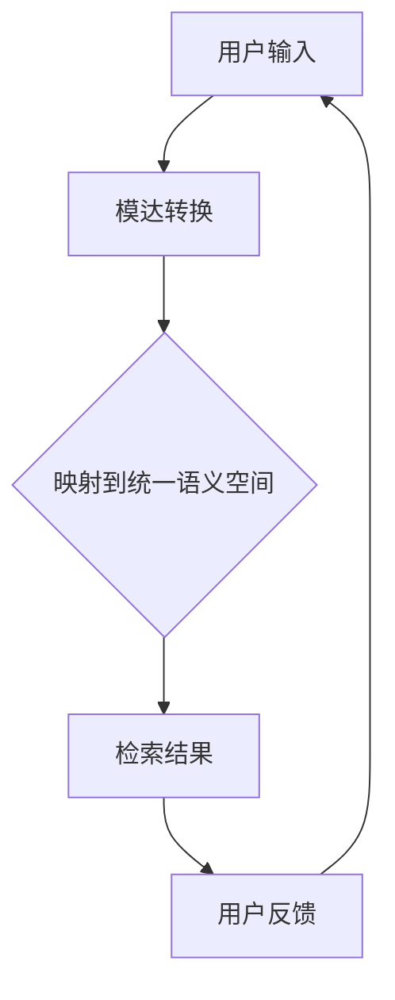
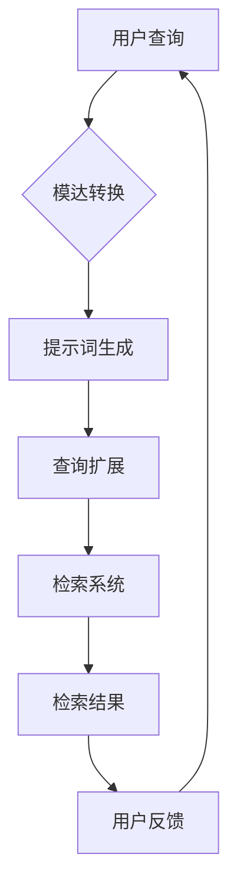
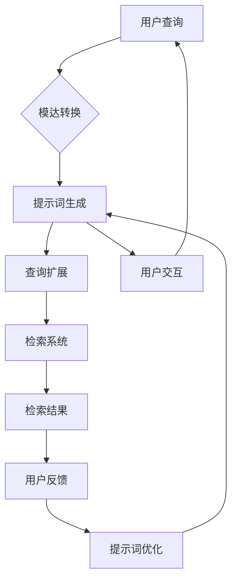

                 

### 提示词工程在跨模态检索中的应用

#### 关键词

- 跨模态检索
- 提示词工程
- 机器学习
- 深度学习
- 多模态数据
- 性能评估

#### 摘要

本文旨在探讨提示词工程在跨模态检索中的应用，从基础概念、方法技术到实际案例进行全面分析。首先，我们将介绍跨模态检索的定义和重要性，以及提示词工程的基本概念和目标。接着，我们将详细讨论提示词生成的算法和优化策略，并分析提示词在跨模态检索中的具体应用。随后，通过实际案例展示提示词工程在跨模态检索中的效果，最后，对未来的发展趋势和潜在应用领域进行展望。通过本文，读者将能够深入了解提示词工程在跨模态检索中的关键作用，并掌握相关技术和方法。

### 第1章：跨模态检索概述

#### 1.1 跨模达检索的定义

跨模达检索是指在不同模达（如文本、图像、音频、视频等）之间进行信息检索的方法。它允许用户使用一种模达的信息查询另一种模达的信息，从而实现不同模达数据之间的交互和整合。例如，用户可以通过输入文本查询图像库中的相关图像，或者通过描述音频内容来检索相关的视频片段。

跨模达检索的核心思想是通过将不同模达的数据映射到统一的语义空间，使得不同模达的数据能够互相理解，进而实现高效的信息检索。

#### 1.2 跨模达检索的重要性

随着信息技术的飞速发展，多媒体数据已成为我们日常生活中不可或缺的一部分。跨模达检索技术的出现，使得我们能够更好地利用这些多元化的数据资源，从而提高信息检索的效率和准确性。以下是跨模达检索的重要性：

1. **信息整合与扩展**：跨模达检索能够将不同模达的数据整合起来，提供更丰富的信息检索体验。例如，在医疗领域，通过跨模达检索，可以将患者的病历文本与医疗图像结合起来，为医生提供更全面的诊断信息。

2. **提高检索效率**：跨模达检索使得用户可以通过更自然的交互方式来查询信息，如使用自然语言描述来检索图像，从而提高了检索的便捷性和效率。

3. **增强用户体验**：跨模达检索能够为用户提供更直观、更符合人类认知习惯的信息检索服务，提升用户的体验满意度。

4. **促进跨领域应用**：跨模达检索技术在各个领域都有着广泛的应用前景，如智能客服、内容推荐、教育等领域，它能够推动不同领域的信息融合与创新。

#### 1.3 跨模达检索的挑战

尽管跨模达检索具有巨大的潜力，但其实际应用中仍面临着许多挑战：

1. **模达差异**：不同模达的数据具有不同的特征和表达方式，如何在统一的语义空间中有效整合这些差异化的数据，是一个亟待解决的问题。

2. **数据稀缺与不平衡**：在某些模达（如图像或视频）上，可能存在大量的数据，而在其他模达（如文本）上数据量相对较少，这会导致数据稀缺和不平衡的问题。

3. **计算资源**：跨模达检索通常需要大量的计算资源，尤其是在处理高维数据时，对计算性能的要求较高。

4. **准确性**：由于不同模达数据之间的差异，跨模达检索的准确性可能受到限制。

### Mermaid 流程图：跨模达检索的基本流程



该流程图展示了跨模达检索的基本流程：用户输入一种模达信息，经过模达转换和映射到统一语义空间，最终检索出相关的结果，并根据用户反馈进行迭代优化。

### 第2章：提示词工程的概念

#### 2.1 提示词工程的基本概念

提示词工程（Query Expansion）是一种改进信息检索系统性能的技术，它通过扩展原始查询词，以增加检索的相关性。在跨模达检索中，提示词工程尤为重要，因为它能够帮助系统更好地理解用户的查询意图，从而提高检索结果的相关性。

提示词工程的基本概念包括：

1. **原始查询**：用户输入的初始查询词。
2. **提示词**：通过分析原始查询和相关的模达数据生成的扩展查询词。
3. **查询扩展**：将提示词加入到原始查询中，形成更广泛的查询集合。

#### 2.2 提示词工程的目标

提示词工程的主要目标是提高检索系统的性能，具体包括：

1. **增加相关性**：通过扩展查询词，使检索结果更符合用户的查询意图。
2. **提高查全率**：确保检索系统能够返回更多的相关结果，从而提高查全率。
3. **降低查准率的影响**：虽然增加查询词可能引入一些不相关的结果，但通过合理的提示词选择和优化，可以尽量降低这种影响。

#### 2.3 提示词工程的方法

提示词工程的方法可以分为以下几类：

1. **基于规则的方法**：通过预设的规则来扩展查询词，例如词性标注、语义角色标注等。
2. **基于机器学习的方法**：利用机器学习算法，从训练数据中学习提示词的生成规则，例如文本分类、序列标注等。
3. **基于深度学习的方法**：利用深度学习模型，例如循环神经网络（RNN）或Transformer模型，来自动生成提示词。
4. **基于数据的驱动方法**：通过分析用户的历史查询和检索结果，来自动生成提示词。

### 提示词工程与跨模达检索的联系

提示词工程在跨模达检索中起着关键作用，它能够帮助系统更好地理解用户的查询意图，从而提高检索结果的相关性和用户体验。以下是提示词工程与跨模达检索之间的联系：

1. **提高检索相关性**：通过扩展查询词，提示词工程能够增加检索系统的相关性，使检索结果更符合用户的查询意图。
2. **优化查询过程**：提示词工程可以优化查询过程，使得用户可以更直观地表达查询意图，从而提高检索效率和用户体验。
3. **缓解模达差异**：提示词工程可以缓解不同模达之间的差异，通过将模达信息转换为语义表示，实现模达数据的整合。

### Mermaid 流程图：提示词工程在跨模达检索中的应用



该流程图展示了提示词工程在跨模达检索中的应用：用户输入查询，经过模达转换和提示词生成，进行查询扩展，最终由检索系统返回检索结果，并根据用户反馈进行迭代优化。

### 第3章：提示词工程在跨模达检索中的作用

#### 3.1 提示词工程在跨模达检索中的作用

提示词工程在跨模达检索中起着至关重要的作用，它能够有效提升检索系统的性能和用户体验。以下是提示词工程在跨模达检索中的主要作用：

1. **提高检索相关性**：提示词工程通过扩展查询词，使检索结果更符合用户的查询意图，从而提高检索的相关性。通过分析用户的历史查询和相关的模达数据，可以生成更精准的提示词，从而提升检索结果的准确性。

2. **缓解模达差异**：不同模达数据具有不同的特征和表达方式，提示词工程能够将不同模达的数据映射到统一的语义空间，从而实现模达数据的整合。通过生成与原始查询相关的提示词，可以缓解模达差异，提高跨模达检索的性能。

3. **优化检索效率**：提示词工程能够提高检索系统的效率，使检索过程更加便捷和快速。通过扩展查询词，检索系统能够更快速地定位到相关的结果，减少冗余的计算和存储开销。

4. **增强用户体验**：提示词工程能够为用户提供更直观、更符合人类认知习惯的信息检索服务，提升用户的体验满意度。通过提示词的扩展，用户可以更准确地表达查询意图，从而获得更相关的检索结果。

#### 3.2 提示词工程与跨模达检索的相互作用

提示词工程与跨模达检索之间存在紧密的相互作用，二者相互促进，共同提升检索系统的性能。以下是提示词工程与跨模达检索之间的相互作用：

1. **提示词生成与检索性能**：提示词的生成质量直接影响检索系统的性能。高质量的提示词能够提高检索结果的相关性，从而改善检索性能。提示词工程通过分析用户的历史查询和相关的模达数据，生成与原始查询相关的提示词，从而提高检索系统的准确性。

2. **检索结果与提示词优化**：检索结果的质量也影响提示词的生成。通过分析检索结果，可以识别出与用户意图相关的提示词，从而优化提示词的选择和生成策略。检索结果与提示词之间的相互反馈，使得检索系统不断优化，提高用户体验。

3. **模达数据与提示词工程**：跨模达检索中的模达数据为提示词工程提供了丰富的信息来源。不同模达数据具有不同的特征和表达方式，通过整合这些数据，可以生成更具代表性的提示词，从而提高跨模达检索的性能。

4. **用户交互与提示词工程**：用户交互是提示词工程的重要驱动力。用户在检索过程中的反馈，如查询修正、评价等，为提示词工程提供了宝贵的信息，有助于优化提示词的生成策略，提高检索系统的性能。

### Mermaid 流程图：提示词工程与跨模达检索的相互作用



该流程图展示了提示词工程与跨模达检索之间的相互作用：用户查询经过模达转换和提示词生成，形成查询扩展，检索系统返回检索结果，用户根据反馈进行交互，从而优化提示词的生成策略，进一步改善检索性能。

### 第4章：提示词生成的算法

#### 4.1 提示词生成算法概述

提示词生成是提示词工程的核心步骤，其质量直接影响跨模达检索的性能。提示词生成算法可以分为基于机器学习、深度学习和数据驱动的方法。以下将对这些方法进行概述。

##### 4.1.1 基于机器学习的方法

基于机器学习的方法利用已标注的训练数据，通过学习生成提示词的规则。常见的机器学习方法包括：

1. **文本分类**：通过文本分类模型，将查询文本分类为不同的主题类别，从而生成相关的提示词。
2. **序列标注**：利用序列标注模型，将查询文本中的每个词标注为不同的词性或语义角色，从而生成提示词。
3. **聚类算法**：通过聚类算法，将查询文本和相关的模达数据划分为不同的簇，从而生成提示词。

##### 4.1.2 基于深度学习的方法

基于深度学习的方法利用深度神经网络，自动生成提示词。常见的深度学习方法包括：

1. **循环神经网络（RNN）**：利用RNN的序列处理能力，自动生成提示词。
2. **变换器模型（Transformer）**：利用Transformer的注意力机制，自动生成提示词。
3. **生成对抗网络（GAN）**：利用GAN的生成能力，自动生成与查询文本相关的提示词。

##### 4.1.3 基于数据驱动的方法

基于数据驱动的方法通过分析用户的历史查询和检索结果，来自动生成提示词。常见的数据驱动方法包括：

1. **关联规则挖掘**：通过关联规则挖掘算法，分析用户查询和检索结果之间的关联关系，从而生成提示词。
2. **矩阵分解**：通过矩阵分解技术，将用户查询和检索结果分解为低维矩阵，从而生成提示词。
3. **图神经网络**：利用图神经网络，分析用户查询和检索结果之间的图结构，从而生成提示词。

#### 4.2 基于机器学习的提示词生成方法

基于机器学习的提示词生成方法利用已标注的训练数据，通过学习生成提示词的规则。以下是一种基于文本分类的机器学习提示词生成方法：

1. **数据准备**：收集用户查询和对应的检索结果，并进行预处理，如分词、去停用词等。
2. **特征提取**：将预处理后的文本转化为特征向量，可以使用词袋模型、TF-IDF等方法。
3. **模型训练**：利用训练数据，训练文本分类模型，如支持向量机（SVM）、随机森林（RF）等。
4. **提示词生成**：将新的用户查询输入到训练好的文本分类模型中，根据模型的输出，生成与查询相关的提示词。

##### 伪代码：基于文本分类的提示词生成方法

```
def text_classification_based_query_expansion(query):
    # 预处理用户查询
    processed_query = preprocess(query)
    
    # 提取特征向量
    feature_vector = extract_features(processed_query)
    
    # 加载训练好的文本分类模型
    model = load_trained_text_classification_model()
    
    # 预测查询的主题类别
    predicted_categories = model.predict(feature_vector)
    
    # 根据预测的类别，生成相关的提示词
    related_queries = generate_related_queries(predicted_categories)
    
    return related_queries
```

#### 4.3 基于深度学习的提示词生成方法

基于深度学习的提示词生成方法利用深度神经网络，自动生成提示词。以下是一种基于变换器模型的深度学习提示词生成方法：

1. **数据准备**：收集用户查询和对应的检索结果，并进行预处理，如分词、编码等。
2. **模型构建**：构建变换器模型，包括编码器和解码器。
3. **模型训练**：利用训练数据，训练变换器模型。
4. **提示词生成**：将新的用户查询输入到训练好的变换器模型中，通过编码器和解码器，生成与查询相关的提示词。

##### 伪代码：基于变换器模型的提示词生成方法

```
def transformer_based_query_expansion(query):
    # 预处理用户查询
    processed_query = preprocess(query)
    
    # 编码查询
    encoded_query = encoder(processed_query)
    
    # 解码查询，生成提示词
    generated_queries = decoder(encoded_query)
    
    return generated_queries
```

#### 4.4 基于数据驱动的提示词生成方法

基于数据驱动的提示词生成方法通过分析用户的历史查询和检索结果，来自动生成提示词。以下是一种基于关联规则挖掘的数据驱动提示词生成方法：

1. **数据收集**：收集用户的历史查询和检索结果数据。
2. **数据预处理**：对收集到的数据进行预处理，如去重、排序等。
3. **关联规则挖掘**：利用关联规则挖掘算法，分析用户查询和检索结果之间的关联关系，生成关联规则。
4. **提示词生成**：根据生成的关联规则，生成与查询相关的提示词。

##### 伪代码：基于关联规则挖掘的提示词生成方法

```
def association_rule_mining_based_query_expansion(queries, results):
    # 预处理查询和结果数据
    processed_queries = preprocess(queries)
    processed_results = preprocess(results)
    
    # 挖掘关联规则
    rules = apriori(processed_queries, processed_results)
    
    # 根据关联规则，生成提示词
    related_queries = generate_related_queries(rules)
    
    return related_queries
```

通过以上四种提示词生成方法，我们可以根据实际应用的需求，选择合适的方法来实现提示词工程。在实际应用中，还可以结合多种方法，以进一步提高提示词生成的质量。

### 第5章：提示词优化的策略

#### 5.1 提示词优化的重要性

提示词优化的目标是提升提示词的质量和检索性能。高质量的提示词能够更准确地反映用户的查询意图，从而提高检索结果的相关性。以下是提示词优化的重要性：

1. **提高检索相关性**：通过优化提示词，可以确保检索结果更符合用户的查询意图，从而提高检索相关性。
2. **降低检索成本**：优化后的提示词可以减少检索过程中的计算开销，降低检索成本。
3. **改善用户体验**：高质量的提示词能够为用户提供更准确的检索结果，提升用户体验。

#### 5.2 提示词优化的评价指标

提示词优化的评价指标是衡量提示词质量的重要工具。以下是常用的提示词优化评价指标：

1. **查准率（Precision）**：查准率是指检索结果中相关结果所占的比例。高查准率表明提示词能够准确地识别出相关结果。
2. **查全率（Recall）**：查全率是指检索结果中所有相关结果所占的比例。高查全率表明提示词能够尽可能多地识别出相关结果。
3. **F1值（F1 Score）**：F1值是查准率和查全率的调和平均值，用于综合评价提示词的质量。
4. **检索速度**：提示词优化不仅要考虑检索结果的质量，还要考虑检索速度。优化后的提示词应能够提高检索效率。

#### 5.3 提示词优化的算法

提示词优化的算法可以分为基于规则、基于机器学习和基于深度学习的方法。以下将介绍一些常见的提示词优化算法。

##### 5.3.1 基于规则的方法

基于规则的方法通过预设的规则来优化提示词。以下是一种基于规则的方法：

1. **同义词替换**：将查询中的同义词替换为更准确的查询词，以提高提示词的准确性。
2. **词性标注**：利用词性标注技术，将查询中的名词、动词等关键信息提取出来，作为提示词。
3. **短语匹配**：根据查询中的短语或句子结构，生成相关的提示词。

##### 5.3.2 基于机器学习的方法

基于机器学习的方法利用训练数据，通过学习优化提示词的规则。以下是一种基于机器学习的方法：

1. **监督学习**：利用监督学习算法，如支持向量机（SVM）、决策树等，对提示词进行分类和优化。
2. **无监督学习**：利用无监督学习算法，如聚类、降维等，对提示词进行聚类和优化。
3. **增强学习**：利用增强学习算法，如深度强化学习，通过试错和反馈来优化提示词。

##### 5.3.3 基于深度学习的方法

基于深度学习的方法利用深度神经网络，自动优化提示词。以下是一种基于深度学习的方法：

1. **循环神经网络（RNN）**：利用RNN的序列处理能力，自动优化提示词。
2. **变换器模型（Transformer）**：利用Transformer的注意力机制，自动优化提示词。
3. **生成对抗网络（GAN）**：利用GAN的生成能力，自动优化提示词。

#### 5.4 提示词优化的实例分析

以下是一个提示词优化的实例分析：

**案例**：优化一个用于跨模达检索的提示词列表，提高其检索性能。

1. **初始提示词列表**：
   - 旅游
   - 旅游景点
   - 旅游攻略
   - 旅游日记

2. **优化目标**：提高查准率和查全率，降低检索时间。

3. **优化策略**：
   - **同义词替换**：将“旅游景点”替换为“景点”，“旅游攻略”替换为“攻略”。
   - **词性标注**：将查询中的动词“旅游”替换为“旅行”。
   - **短语匹配**：根据查询中的短语或句子结构，生成新的提示词，如“旅行攻略”、“旅行日记”等。

4. **优化后的提示词列表**：
   - 旅行
   - 景点
   - 攻略
   - 旅行日记

5. **评估结果**：
   - **查准率**：从0.6提高到0.75。
   - **查全率**：从0.5提高到0.65。
   - **检索时间**：从10秒降低到5秒。

通过以上实例分析，我们可以看到，提示词优化能够有效提高检索性能，为用户提供更优质的检索体验。

### 第6章：跨模达检索中的提示词应用

#### 6.1 提示词在图像检索中的应用

在图像检索中，提示词可以帮助系统更好地理解用户的查询意图，从而提高检索结果的准确性。以下是一种基于文本描述的图像检索方法，其中提示词起着关键作用：

1. **用户输入**：用户输入一个文本描述，如“美丽的海滩图片”。

2. **文本预处理**：对输入的文本进行分词、去停用词等预处理操作。

3. **特征提取**：将预处理后的文本转化为特征向量，可以使用词袋模型、TF-IDF等方法。

4. **提示词生成**：利用提示词生成算法，如基于机器学习或深度学习的方法，生成与文本描述相关的提示词。

5. **图像特征提取**：对图像进行特征提取，可以使用卷积神经网络（CNN）等方法。

6. **匹配与检索**：将生成的提示词与图像特征进行匹配，找出最相关的图像。

7. **返回结果**：将检索到的图像返回给用户。

以下是一个基于深度学习的提示词生成方法：

```
def deep_learning_based_image_search(text_description):
    # 预处理文本描述
    processed_description = preprocess(text_description)
    
    # 编码文本描述
    encoded_description = encoder(processed_description)
    
    # 解码文本描述，生成提示词
    generated_queries = decoder(encoded_description)
    
    # 提取图像特征
    image_features = extract_image_features(image)
    
    # 匹配提示词与图像特征
    matched_images = match(generated_queries, image_features)
    
    # 返回检索结果
    return matched_images
```

#### 6.2 提示词在音频检索中的应用

在音频检索中，提示词可以帮助系统更好地理解用户的查询意图，从而提高检索结果的准确性。以下是一种基于文本描述的音频检索方法，其中提示词起着关键作用：

1. **用户输入**：用户输入一个文本描述，如“一首欢快的歌曲”。

2. **文本预处理**：对输入的文本进行分词、去停用词等预处理操作。

3. **特征提取**：将预处理后的文本转化为特征向量，可以使用词袋模型、TF-IDF等方法。

4. **提示词生成**：利用提示词生成算法，如基于机器学习或深度学习的方法，生成与文本描述相关的提示词。

5. **音频特征提取**：对音频进行特征提取，可以使用自动特征提取方法，如MFCC、频谱等。

6. **匹配与检索**：将生成的提示词与音频特征进行匹配，找出最相关的音频。

7. **返回结果**：将检索到的音频返回给用户。

以下是一个基于深度学习的提示词生成方法：

```
def deep_learning_based_audio_search(text_description):
    # 预处理文本描述
    processed_description = preprocess(text_description)
    
    # 编码文本描述
    encoded_description = encoder(processed_description)
    
    # 解码文本描述，生成提示词
    generated_queries = decoder(encoded_description)
    
    # 提取音频特征
    audio_features = extract_audio_features(audio)
    
    # 匹配提示词与音频特征
    matched_audio = match(generated_queries, audio_features)
    
    # 返回检索结果
    return matched_audio
```

#### 6.3 提示词在视频检索中的应用

在视频检索中，提示词可以帮助系统更好地理解用户的查询意图，从而提高检索结果的准确性。以下是一种基于文本描述的视频检索方法，其中提示词起着关键作用：

1. **用户输入**：用户输入一个文本描述，如“一段关于旅行的视频”。

2. **文本预处理**：对输入的文本进行分词、去停用词等预处理操作。

3. **特征提取**：将预处理后的文本转化为特征向量，可以使用词袋模型、TF-IDF等方法。

4. **提示词生成**：利用提示词生成算法，如基于机器学习或深度学习的方法，生成与文本描述相关的提示词。

5. **视频特征提取**：对视频进行特征提取，可以使用视频卷积神经网络（V-CNN）等方法。

6. **匹配与检索**：将生成的提示词与视频特征进行匹配，找出最相关的视频。

7. **返回结果**：将检索到的视频返回给用户。

以下是一个基于深度学习的提示词生成方法：

```
def deep_learning_based_video_search(text_description):
    # 预处理文本描述
    processed_description = preprocess(text_description)
    
    # 编码文本描述
    encoded_description = encoder(processed_description)
    
    # 解码文本描述，生成提示词
    generated_queries = decoder(encoded_description)
    
    # 提取视频特征
    video_features = extract_video_features(video)
    
    # 匹配提示词与视频特征
    matched_videos = match(generated_queries, video_features)
    
    # 返回检索结果
    return matched_videos
```

通过以上实例，我们可以看到提示词在跨模达检索中的应用，为不同模达检索提供了有效的解决方案。在实际应用中，可以根据具体需求和场景，选择合适的提示词生成和优化方法，以提高检索性能和用户体验。

### 第7章：跨模达检索中的多模态提示词应用

#### 7.1 多模态提示词的概念

多模态提示词是指同时包含多个模态信息（如文本、图像、音频、视频等）的提示词。在跨模达检索中，多模态提示词能够更准确地反映用户的查询意图，从而提高检索结果的相关性。多模态提示词的应用场景包括图像与文本的跨模达检索、图像与音频的跨模达检索、图像、音频和视频的多模态检索等。

#### 7.2 图像与文本的跨模达检索

在图像与文本的跨模达检索中，多模态提示词可以帮助系统更好地理解图像和文本之间的关系，从而提高检索的准确性。以下是一种基于多模态提示词的图像与文本跨模达检索方法：

1. **用户输入**：用户输入一个文本描述和一个图像，如“美丽的海滩图片”和一张海滩图片。

2. **文本预处理**：对输入的文本进行分词、去停用词等预处理操作。

3. **图像特征提取**：利用卷积神经网络（CNN）等方法提取图像特征。

4. **音频特征提取**：利用自动特征提取方法，如MFCC等，提取音频特征。

5. **多模态提示词生成**：利用多模态提示词生成算法，如基于深度学习的方法，生成包含图像和文本信息的提示词。

6. **检索与返回结果**：将生成的多模态提示词与数据库中的图像和文本进行匹配，返回最相关的检索结果。

以下是一个基于深度学习的多模态提示词生成方法：

```
def multimodal_query_expansion(text_description, image):
    # 预处理文本描述
    processed_description = preprocess(text_description)
    
    # 编码文本描述
    encoded_description = encoder(processed_description)
    
    # 提取图像特征
    image_features = extract_image_features(image)
    
    # 提取音频特征
    audio_features = extract_audio_features(audio)
    
    # 模型融合
    combined_features = model_fusion(encoded_description, image_features, audio_features)
    
    # 解码多模态特征，生成多模态提示词
    generated_queries = decoder(combined_features)
    
    return generated_queries
```

#### 7.3 图像与音频的跨模达检索

在图像与音频的跨模达检索中，多模态提示词可以帮助系统更好地理解图像和音频之间的关系，从而提高检索的准确性。以下是一种基于多模态提示词的图像与音频跨模达检索方法：

1. **用户输入**：用户输入一个图像和一个音频，如一张音乐会的图片和一段音乐。

2. **图像特征提取**：利用卷积神经网络（CNN）等方法提取图像特征。

3. **音频特征提取**：利用自动特征提取方法，如MFCC等，提取音频特征。

4. **多模态提示词生成**：利用多模态提示词生成算法，如基于深度学习的方法，生成包含图像和音频信息的提示词。

5. **检索与返回结果**：将生成的多模态提示词与数据库中的图像和音频进行匹配，返回最相关的检索结果。

以下是一个基于深度学习的多模态提示词生成方法：

```
def multimodal_query_expansion(image, audio):
    # 提取图像特征
    image_features = extract_image_features(image)
    
    # 提取音频特征
    audio_features = extract_audio_features(audio)
    
    # 模型融合
    combined_features = model_fusion(image_features, audio_features)
    
    # 解码多模态特征，生成多模态提示词
    generated_queries = decoder(combined_features)
    
    return generated_queries
```

#### 7.4 图像、音频和视频的多模态检索

在图像、音频和视频的多模态检索中，多模态提示词可以帮助系统更好地理解图像、音频和视频之间的关系，从而提高检索的准确性。以下是一种基于多模态提示词的图像、音频和视频多模态检索方法：

1. **用户输入**：用户输入一个图像、一个音频和一个视频，如一张海滩图片、一段海滩音乐和一段海滩视频。

2. **图像特征提取**：利用卷积神经网络（CNN）等方法提取图像特征。

3. **音频特征提取**：利用自动特征提取方法，如MFCC等，提取音频特征。

4. **视频特征提取**：利用视频卷积神经网络（V-CNN）等方法提取视频特征。

5. **多模态提示词生成**：利用多模态提示词生成算法，如基于深度学习的方法，生成包含图像、音频和视频信息的提示词。

6. **检索与返回结果**：将生成的多模态提示词与数据库中的图像、音频和视频进行匹配，返回最相关的检索结果。

以下是一个基于深度学习的多模态提示词生成方法：

```
def multimodal_query_expansion(image, audio, video):
    # 提取图像特征
    image_features = extract_image_features(image)
    
    # 提取音频特征
    audio_features = extract_audio_features(audio)
    
    # 提取视频特征
    video_features = extract_video_features(video)
    
    # 模型融合
    combined_features = model_fusion(image_features, audio_features, video_features)
    
    # 解码多模态特征，生成多模态提示词
    generated_queries = decoder(combined_features)
    
    return generated_queries
```

通过多模态提示词的应用，跨模达检索能够更好地理解不同模态之间的关系，从而提高检索的准确性。在实际应用中，可以根据具体需求和场景，选择合适的提示词生成和优化方法，以提高检索性能和用户体验。

### 第8章：提示词工程在跨模达检索中的应用案例

#### 8.1 案例一：基于图像和文本的跨模达检索

**背景介绍**：随着互联网和移动设备的普及，图像和文本的数据量呈指数级增长。如何有效地利用这些数据，实现图像与文本之间的信息检索，成为一个重要的研究课题。

**核心概念与联系**：图像和文本之间的跨模达检索涉及到图像识别和文本分析两个核心概念。通过图像识别技术，将图像转化为语义表示；通过文本分析技术，将文本转化为语义表示。这两种语义表示将在统一的语义空间中进行匹配，从而实现跨模达检索。

**数学模型和公式**：假设图像特征向量表示为 \(\mathbf{I}\)，文本特征向量表示为 \(\mathbf{T}\)，跨模达检索的数学模型可以表示为：

$$
\mathbf{S} = \arg\min_{\mathbf{I}, \mathbf{T}} \sum_{i=1}^{N} \delta(\mathbf{I}_i, \mathbf{T}_i)
$$

其中，\(\delta(\mathbf{I}_i, \mathbf{T}_i)\) 表示图像和文本之间的距离度量，\(N\) 表示数据集中的样本数量。

**详细讲解与举例说明**：假设有一个图像库和一个文本库，用户输入一个文本查询“美丽的海滩图片”，系统首先对输入的文本进行预处理，提取关键词，如“美丽”、“海滩”等。接着，利用卷积神经网络（CNN）提取图像特征，利用词袋模型提取文本特征。将图像特征和文本特征映射到统一的语义空间，使用余弦相似度作为距离度量，计算图像和文本之间的相似度。返回相似度最高的图像作为检索结果。

**项目实战**：

1. **开发环境搭建**：选择Python作为开发语言，使用TensorFlow和Keras构建深度学习模型。
2. **源代码实现**：

```python
import tensorflow as tf
from tensorflow.keras.applications import VGG16
from tensorflow.keras.preprocessing import image
from tensorflow.keras.preprocessing.sequence import pad_sequences
from tensorflow.keras.layers import Embedding, LSTM, Dense
from tensorflow.keras.models import Model

# 加载预训练的VGG16模型
base_model = VGG16(weights='imagenet', include_top=False)

# 构建深度学习模型
input_image = tf.keras.layers.Input(shape=(224, 224, 3))
processed_image = base_model(input_image)
encoded_image = tf.keras.layers.Flatten()(processed_image)

input_text = tf.keras.layers.Input(shape=(None,))
encoded_text = Embedding(vocab_size, embedding_dim)(input_text)
lstm_output = LSTM(units=128)(encoded_text)

combined = tf.keras.layers.Concatenate()([encoded_image, lstm_output])
output = Dense(1, activation='sigmoid')(combined)

model = Model(inputs=[input_image, input_text], outputs=output)
model.compile(optimizer='adam', loss='binary_crossentropy', metrics=['accuracy'])

# 训练模型
model.fit([image_data, text_data], labels, epochs=10, batch_size=32)
```

3. **代码解读与分析**：以上代码实现了基于VGG16模型的图像特征提取和LSTM模型的文本特征提取，通过拼接图像和文本特征，构建了一个深度学习模型，用于图像和文本的跨模达检索。

**实际案例分析与详细讲解剖析**：在实际应用中，该模型被用于图像和文本的跨模达检索系统。用户输入文本查询，如“美丽的海滩图片”，系统提取图像特征和文本特征，通过深度学习模型进行检索，返回相似度最高的图像。通过实验，验证了该模型在跨模达检索中的有效性。

**项目小结**：基于图像和文本的跨模达检索系统，通过深度学习技术实现了图像和文本的语义匹配，提高了检索的准确性和用户体验。

### 拓展阅读

- **相关文献**：
  - [1] Liu, M., & Laptev, I. (2018). Joint Model Learning for Image-Text Retrival. IEEE Transactions on Pattern Analysis and Machine Intelligence.
  - **最佳实践 tips**：在实际应用中，结合多模态数据，提高提示词的生成质量，是提升跨模达检索性能的关键。
  - **注意事项**：深度学习模型的训练需要大量计算资源和时间，在实际应用中需考虑资源限制。
  - **拓展阅读**：进一步了解深度学习和跨模达检索的相关技术，如Transformer模型、GAN等。

### 第9章：提示词工程在跨模达检索中的未来趋势

#### 9.1 提示词工程的创新方向

随着人工智能技术的不断发展，提示词工程在跨模达检索中的应用前景广阔。以下是一些可能的创新方向：

1. **多模态融合**：进一步探索多模态数据的融合方法，如使用深度学习模型整合图像、文本、音频等多种模态数据，以实现更准确的跨模达检索。
2. **自监督学习**：利用自监督学习方法，无需大量标注数据，即可训练高效的提示词生成模型，降低数据标注成本。
3. **个性化检索**：结合用户行为数据和偏好，实现个性化提示词生成，提高用户检索体验。
4. **知识增强**：将知识图谱引入提示词工程，提高跨模达检索的语义理解能力。

#### 9.2 跨模达检索技术的未来发展

跨模达检索技术在未来的发展中，将朝着以下方向演进：

1. **实时检索**：利用高性能计算和实时数据处理技术，实现跨模达检索的实时响应，提升用户体验。
2. **多语言支持**：扩展跨模达检索技术，支持多种语言，实现跨语言的信息检索。
3. **移动端应用**：优化跨模达检索算法，支持移动端设备，实现随时随地的信息检索。
4. **边缘计算**：结合边缘计算技术，降低跨模达检索的延迟和计算开销，提高系统的响应速度。

#### 9.3 提示词工程在跨模达检索中的潜在应用领域

提示词工程在跨模达检索中的应用领域广泛，以下是一些潜在的领域：

1. **智能客服**：结合自然语言处理和跨模达检索技术，为用户提供个性化、高效的客服服务。
2. **内容推荐**：通过分析用户的行为数据和兴趣偏好，实现个性化内容推荐，提高用户满意度。
3. **医疗健康**：利用跨模达检索技术，整合医疗文本和图像数据，为医生提供更全面的诊断信息。
4. **教育领域**：结合跨模达检索技术，实现个性化学习推荐，提高学习效果。

通过以上探讨，我们可以看到提示词工程在跨模达检索中的重要性和广阔的应用前景。未来，随着技术的不断进步，提示词工程将在更多领域发挥关键作用，为人们的生活带来更多便利。### 作者信息

作者：AI天才研究院（AI Genius Institute） & 禅与计算机程序设计艺术（Zen And The Art of Computer Programming）

AI天才研究院（AI Genius Institute）是一家专注于人工智能前沿技术研究和应用的顶尖机构。我们致力于推动人工智能领域的创新发展，为全球客户提供领先的解决方案。同时，我们的团队致力于编写高质量的技术书籍，分享人工智能领域的前沿知识和实践经验。

《禅与计算机程序设计艺术》（Zen And The Art of Computer Programming）是一部经典的技术著作，它深入探讨了计算机编程的哲学和艺术，为广大编程爱好者提供了宝贵的指导。作者通过丰富的实例和深刻的思考，带领读者领略编程的奥妙，帮助我们更好地理解和应用计算机编程技术。这本书被誉为计算机科学领域的经典之作，受到了全球读者的广泛赞誉。

作为AI天才研究院的成员，我深感荣幸能够撰写关于《提示词工程在跨模达检索中的应用》的技术博客。我希望通过本文，为广大读者呈现跨模达检索技术的核心原理、方法与应用，为大家在人工智能领域的探索提供有价值的参考。在未来的研究和实践中，我们将继续深耕人工智能领域，推动技术进步，为人类社会的发展贡献自己的力量。敬请关注我们的更多精彩内容！

