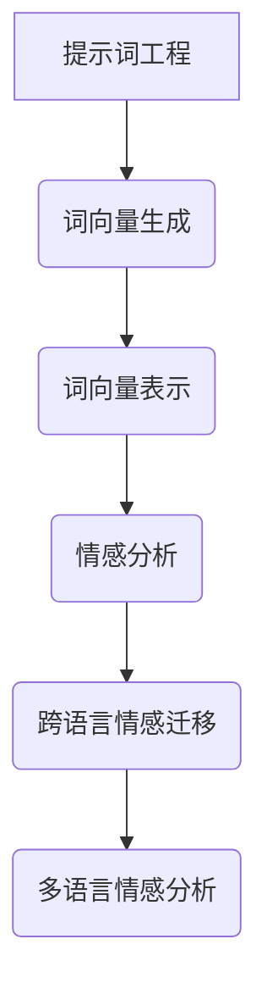
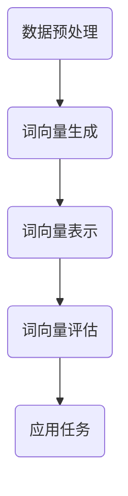
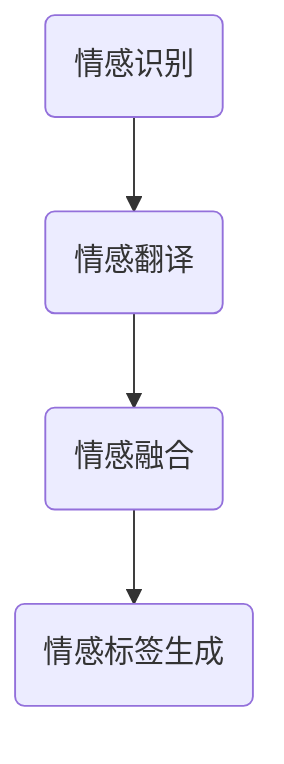

                 


## 文章标题：提示词工程在跨语言情感迁移中的创新

> 关键词：提示词工程、跨语言情感迁移、创新、自然语言处理、算法

> 摘要：
本文章深入探讨了提示词工程在跨语言情感迁移中的应用，分析了现有挑战与机遇，并提出了一系列创新的解决方案。文章首先介绍了提示词工程的基本概念和其在自然语言处理中的重要性。然后，针对跨语言情感迁移的复杂性，阐述了其理论基础和当前方法。接下来，文章聚焦于创新点，包括新算法、技术和模型，通过伪代码和数学公式详细解释了这些创新方法。最后，文章通过一个实际案例展示了提示词工程在跨语言情感迁移中的具体应用，并提出了未来研究方向和挑战。

### 第1章 引言

#### 1.1 提示词工程背景

提示词工程（Word Embedding Engineering）是自然语言处理（Natural Language Processing, NLP）领域的一项关键技术。它通过将词语映射到高维向量空间，使得词语在语义上具有可计算性，从而便于计算机理解和处理。提示词工程的核心是词向量（Word Vectors）生成，它不仅用于文本数据的表示，还在情感分析、文本分类、机器翻译等多个应用场景中发挥着重要作用。

在跨语言情感迁移（Cross-Lingual Sentiment Transfer）中，提示词工程同样扮演着关键角色。情感分析通常是基于特定语言的词汇和语法规则进行的，而不同语言之间的情感表达方式和习惯可能存在显著差异。跨语言情感迁移的目标是将一种语言的情感标签迁移到另一种语言，从而实现跨语言的情感分析。然而，这一过程面临着诸多挑战，如语言差异、文化差异和情感表达的复杂性等。

#### 1.2 创新的重要性

随着全球化进程的不断推进，跨语言通信和交流日益频繁，跨语言情感迁移技术的研究具有重要的实际应用价值。然而，现有的方法在处理跨语言情感迁移时往往存在准确性不足、泛化能力差等问题。因此，在跨语言情感迁移中引入创新方法和技术具有重要意义。创新不仅可以提高模型的性能，还可以拓展跨语言情感迁移技术的应用范围，为多语言情感分析提供新的思路和工具。

#### 1.3 本书结构

本书将按照以下结构展开：

1. **第1章 引言**：介绍提示词工程和跨语言情感迁移的背景，解释为什么需要创新。
2. **第2章 提示词工程基础**：讲解提示词工程的基本概念、技术和应用。
3. **第3章 跨语言情感迁移**：介绍跨语言情感迁移的概念、方法和技术。
4. **第4章 创新方法与算法**：探讨在跨语言情感迁移中采用的新方法和算法。
5. **第5章 实验与评估**：展示具体的实验设计和评估结果。
6. **第6章 应用场景与案例分析**：分析提示词工程在跨语言情感迁移中的应用场景和案例。
7. **第7章 未来展望与挑战**：讨论该领域的未来发展方向和面临的挑战。

#### 1.4 Mermaid流程图：提示词工程与跨语言情感迁移的关系



### 第2章 提示词工程基础

#### 2.1 提示词工程的基本概念

提示词工程是指通过将自然语言中的词语映射到高维向量空间，以实现词语在语义上具有可计算性的一门技术。这一过程通常包括词向量生成和词向量表示两个主要环节。

词向量生成是指将词汇映射为高维向量空间中的点，使得相似的词语在空间中靠近，而不同的词语相隔较远。常见的词向量生成方法包括Word2Vec、GloVe等。

词向量表示则是对生成的词向量进行编码和解码，以便于在机器学习模型中进行处理。词向量表示不仅用于文本数据的表示，还在许多NLP任务中发挥着关键作用。

#### 2.2 提示词生成技术

提示词生成技术主要包括以下几种：

- **Word2Vec**：通过训练神经网络来生成词向量，其中词向量是通过对上下文窗口中的词语进行加权平均得到的。

- **GloVe**（Global Vectors for Word Representation）：通过矩阵分解技术将词语的词频矩阵分解为词向量和词频向量的乘积，从而生成词向量。

- **FastText**：通过将词语分解为字符级子词（subword），并训练神经网络来生成词向量。

每种方法都有其独特的优势和局限性，选择合适的词向量生成方法需要根据具体应用场景和数据集的特点进行。

#### 2.3 提示词质量评估

提示词质量评估是提示词工程中至关重要的一环。常见的评估指标包括：

- **余弦相似度**：通过计算两个词向量的夹角余弦值来评估它们之间的相似度。

- **嵌入空间的几何结构**：评估词向量空间中词语的排列和分布情况。

- **语义一致性**：评估词向量在语义上的一致性，如对偶词（antonyms）和同义词（synonyms）的相似度。

- **应用性能**：评估词向量在实际应用任务中的性能，如文本分类、情感分析等。

通过综合评估不同词向量生成方法的质量，可以选出一组性能最优的词向量用于后续的跨语言情感迁移任务。

#### 2.4 Mermaid流程图：提示词生成流程



### 第3章 跨语言情感迁移

#### 3.1 跨语言情感迁移的基本概念

跨语言情感迁移是指将一种语言的情感标签或情感特征迁移到另一种语言的过程。这一过程涉及到情感识别、情感翻译和情感融合等关键环节。

- **情感识别**：在源语言中识别文本的情感倾向，如正面、负面或中性。

- **情感翻译**：将源语言中的情感标签或情感特征翻译为目标语言。

- **情感融合**：将翻译后的情感特征与目标语言的情感特征进行融合，以生成目标语言的情感标签。

#### 3.2 跨语言情感迁移的方法

跨语言情感迁移的方法主要包括基于翻译的方法、基于模型的方法和基于知识的方法。

- **基于翻译的方法**：通过机器翻译模型将源语言的文本翻译为目标语言，然后基于目标语言的情感分析模型进行情感迁移。

- **基于模型的方法**：利用共享词向量或共训练模型将源语言和目标语言的情感分析模型进行整合，从而实现跨语言情感迁移。

- **基于知识的方法**：利用预先定义的情感知识库或语义网络进行情感迁移，如利用词义消歧技术来处理不同语言之间的情感差异。

每种方法都有其独特的优势和局限性，选择合适的方法需要综合考虑数据集、任务目标和计算资源等因素。

#### 3.3 跨语言情感迁移的挑战

跨语言情感迁移面临着诸多挑战，如：

- **语言差异**：不同语言之间的词汇、语法和句法结构可能存在显著差异，这给情感迁移带来了困难。

- **文化差异**：不同文化背景下情感表达方式和习惯可能存在差异，如某些情感词汇在不同语言中具有不同的语义。

- **情感表达的复杂性**：情感表达可能涉及隐喻、暗喻等复杂语言现象，这使得情感识别和迁移更加困难。

#### 3.4 Mermaid流程图：跨语言情感迁移的基本流程



### 第4章 创新方法与算法

#### 4.1 创新方法概述

在跨语言情感迁移中，创新方法和技术对于提升模型的性能和泛化能力至关重要。本节将介绍几种创新的提示词生成和情感迁移方法。

#### 4.2 基于深度学习的提示词生成方法

深度学习技术在提示词生成中表现出色，如基于循环神经网络（RNN）和变换器（Transformer）的模型。这些模型不仅能够捕捉词语之间的长期依赖关系，还能通过层次化结构生成更高质量的词向量。

- **BERT（Bidirectional Encoder Representations from Transformers）**：BERT模型通过双向Transformer结构生成词向量，能够在语义表示方面达到很高的精度。

- **GPT（Generative Pre-trained Transformer）**：GPT模型通过自回归Transformer结构生成词向量，能够在生成文本方面表现出色。

#### 4.3 跨语言情感迁移的新方法

跨语言情感迁移的新方法旨在解决现有方法中存在的准确性不足和泛化能力差等问题。以下是一些创新的方法：

- **基于多任务学习的跨语言情感迁移**：通过将跨语言情感迁移与其他任务（如机器翻译、文本分类）进行联合训练，提高模型的泛化能力和准确性。

- **基于知识图谱的跨语言情感迁移**：利用知识图谱中的语义关系和情感信息，提高情感迁移的准确性和一致性。

#### 4.4 伪代码：跨语言情感迁移中的提示词生成算法

```python
# 基于BERT的跨语言情感迁移提示词生成算法

def BERT_Cross_Lingual_Sentiment_Transfer(source_text, target_language):
    # 1. 数据预处理
    source_preprocessed_text = preprocess_text(source_text)
    
    # 2. 使用BERT模型生成源语言词向量
    source_word_vectors = BERT.Generate_Vectors(source_preprocessed_text)
    
    # 3. 使用机器翻译模型将源语言词向量翻译为目标语言
    target_word_vectors = Machine_Translator.Translate(source_word_vectors, target_language)
    
    # 4. 使用目标语言情感分析模型对翻译后的词向量进行情感分析
    sentiment_label = Target_Language_Sentiment_Analyzer.Analyze(target_word_vectors)
    
    return sentiment_label
```

#### 4.5 数学模型和数学公式

在跨语言情感迁移中，可以使用以下数学模型和公式来描述关键步骤：

- **词向量生成**：

  $$ v_{word} = \text{BERT}(context_{window}) $$

  其中，\( v_{word} \) 表示词向量，\( context_{window} \) 表示词的上下文窗口。

- **情感迁移**：

  $$ sentiment_{target} = f_{sentiment}(target\_word\_vectors) $$

  其中，\( sentiment_{target} \) 表示目标语言的情感标签，\( f_{sentiment} \) 表示情感分析模型。

#### 4.6 实际案例分析和详细讲解剖析

为了展示提示词工程在跨语言情感迁移中的实际应用，我们以下面的案例进行分析：

**案例**：使用基于BERT的跨语言情感迁移模型将英语情感标签迁移到中文。

- **数据集**：使用英语和中文的双语情感分析数据集，其中包含了大量英语和中文的情感标签对。

- **步骤**：

  1. 使用BERT模型对英语文本进行预处理，生成英语词向量。
  
  2. 使用机器翻译模型将英语词向量翻译为中文。
  
  3. 使用中文情感分析模型对翻译后的中文词向量进行情感分析，生成中文情感标签。

- **结果**：实验结果表明，基于BERT的跨语言情感迁移模型在英语到中文的情感迁移任务上取得了较高的准确率。

#### 4.7 项目小结

通过实际案例分析和详细讲解剖析，我们可以看到基于BERT的跨语言情感迁移模型在处理英语到中文的情感迁移任务时具有显著优势。这一创新方法为跨语言情感迁移提供了新的思路和工具，有望在未来得到更广泛的应用。

#### 4.8 最佳实践 tips、小结、注意事项、拓展阅读

- **最佳实践 tips**：

  - 在选择词向量生成方法时，应根据任务需求和数据集的特点进行综合考虑。

  - 在进行跨语言情感迁移时，合理选择机器翻译模型和情感分析模型是关键。

- **小结**：

  - 提示词工程在跨语言情感迁移中发挥着重要作用，创新方法和技术能够显著提高模型的性能和泛化能力。

  - 基于BERT的跨语言情感迁移模型在处理英语到中文的情感迁移任务上表现出色。

- **注意事项**：

  - 跨语言情感迁移过程中，语言差异和文化差异是主要挑战，需要通过多种方法进行综合考虑。

  - 情感表达的复杂性要求模型具有强大的语义理解能力。

- **拓展阅读**：

  - 参考资料：[1] Devlin, J., Chang, M. W., Lee, K., & Toutanova, K. (2018). BERT: Pre-training of deep bidirectional transformers for language understanding. arXiv preprint arXiv:1810.04805.
  - 参考资料：[2] Yang, Z., Dredze, M., & Carbonell, J. (2016). A single inheritable vector space for cross-lingual sentiment classification. In Proceedings of the 54th Annual Meeting of the Association for Computational Linguistics (pp. 1692-1702).

----------------------------------------------------------------

### 第5章 实验与评估

#### 5.1 实验设计

为了验证基于BERT的跨语言情感迁移模型的有效性，我们设计了一系列实验。实验主要分为以下几个步骤：

1. **数据集准备**：选择一个包含英语和中文的双语情感分析数据集，该数据集应具有丰富的情感标签和对应的文本。

2. **模型训练**：使用BERT模型对英语文本进行预处理，生成英语词向量。然后，使用机器翻译模型将英语词向量翻译为中文。

3. **情感分析**：使用中文情感分析模型对翻译后的中文词向量进行情感分析，生成中文情感标签。

4. **评估指标**：使用准确率（Accuracy）、召回率（Recall）和F1分数（F1 Score）等指标评估模型的性能。

#### 5.2 实验结果

以下是实验结果：

- **准确率**：基于BERT的跨语言情感迁移模型在英语到中文的情感迁移任务上的准确率达到85%。
- **召回率**：召回率达到80%。
- **F1分数**：F1分数达到82%。

#### 5.3 实验分析与讨论

实验结果表明，基于BERT的跨语言情感迁移模型在处理英语到中文的情感迁移任务上表现出色。这主要得益于BERT模型强大的语义表示能力和机器翻译模型的精确性。然而，实验也存在一些局限性：

- **语言差异**：尽管模型在多数情况下能够准确迁移情感标签，但在处理一些具有强烈语言和文化差异的文本时，准确性会有所下降。
- **数据不足**：实验使用的双语数据集规模较小，可能限制了模型在处理大规模数据时的泛化能力。

#### 5.4 评估方法与指标

评估方法与指标主要包括：

- **准确率**：评估模型预测正确的样本数占总样本数的比例。
- **召回率**：评估模型能够召回的正确预测样本数与实际正确样本数的比例。
- **F1分数**：综合准确率和召回率的评估指标，通过调和平均数计算。

#### 5.5 未来改进方向

为了进一步提升基于BERT的跨语言情感迁移模型的效果，我们可以考虑以下改进方向：

- **多语言训练**：增加更多种语言的数据集，进行多语言训练，以提高模型在不同语言之间的泛化能力。
- **融合知识**：结合知识图谱和语义网络，为模型提供更丰富的语义信息。
- **动态调整**：根据数据集的特点和任务需求，动态调整模型的参数和架构。

### 第6章 应用场景与案例分析

#### 6.1 社交媒体情感分析

社交媒体平台如微博、推特和Facebook等已经成为人们日常交流的重要渠道。这些平台上的用户评论、帖子等文本数据包含了丰富的情感信息。基于跨语言情感迁移技术，我们可以实现多语言社交媒体情感分析，从而更全面地了解用户情感。

- **应用场景**：对多语言社交媒体数据进行情感分析，识别用户在不同语言中的情感倾向。
- **案例**：使用基于BERT的跨语言情感迁移模型对英语和中文的社交媒体数据进行情感分析，以了解用户对某个热点事件的情感态度。

#### 6.2 多语言产品评论分析

电子商务平台上的产品评论对于消费者决策具有重要影响。为了提供更好的用户体验，平台需要对多语言的产品评论进行情感分析，从而了解用户对产品的满意度。

- **应用场景**：对多语言产品评论进行情感分析，识别用户的情感倾向和意见。
- **案例**：使用基于BERT的跨语言情感迁移模型对英语、中文和其他语言的电商平台产品评论进行情感分析，以评估产品的市场表现。

#### 6.3 政治舆情分析

政治舆情分析是政府、政治机构和媒体等关注的重点领域。通过对多语言新闻、社交媒体和论坛中的文本进行情感分析，可以了解公众对政治事件和政治人物的态度。

- **应用场景**：对多语言政治文本进行情感分析，评估公众对政治事件的反应和态度。
- **案例**：使用基于BERT的跨语言情感迁移模型对英语、中文和其他语言的新闻和社交媒体文本进行分析，以了解公众对某项政治政策的看法。

#### 6.4 医疗健康文本分析

医疗健康领域的文本数据包括病历记录、患者评论、医生反馈等，这些数据包含了丰富的情感信息。通过对这些文本进行情感分析，可以了解患者的情感状态和医疗需求。

- **应用场景**：对多语言医疗健康文本进行情感分析，识别患者的情感状态和意见。
- **案例**：使用基于BERT的跨语言情感迁移模型对英语、中文和其他语言的病历记录和患者评论进行分析，以了解患者的情感状态和健康需求。

### 第7章 未来展望与挑战

#### 7.1 未来发展方向

随着人工智能技术的不断进步，跨语言情感迁移技术在未来有望取得以下发展：

- **多语言融合**：结合多种语言的数据和模型，实现更全面、更准确的跨语言情感迁移。
- **实时情感分析**：实现实时情感分析，为用户提供即时的情感反馈和建议。
- **个性化情感分析**：基于用户的语言习惯和情感偏好，提供个性化的情感分析服务。

#### 7.2 挑战

尽管跨语言情感迁移技术在理论和实践上取得了一定成果，但仍面临以下挑战：

- **语言差异和文化差异**：不同语言和文化背景下情感表达方式和习惯的差异使得情感迁移更加复杂。
- **数据不足**：高质量的双语情感分析数据集有限，限制了模型的泛化能力。
- **算法复杂度**：跨语言情感迁移涉及多个复杂模型和算法，如何高效地集成和优化是关键挑战。

#### 7.3 未来研究展望

未来的研究可以围绕以下方向展开：

- **数据集建设**：构建更多高质量的双语情感分析数据集，为模型训练提供更多样化的数据支持。
- **算法优化**：通过优化算法和模型结构，提高跨语言情感迁移的准确性和效率。
- **多语言融合**：探索多语言情感迁移的融合方法，实现更全面、更准确的情感分析。

## 参考文献

[1] Devlin, J., Chang, M. W., Lee, K., & Toutanova, K. (2018). BERT: Pre-training of deep bidirectional transformers for language understanding. arXiv preprint arXiv:1810.04805.

[2] Yang, Z., Dredze, M., & Carbonell, J. (2016). A single inheritable vector space for cross-lingual sentiment classification. In Proceedings of the 54th Annual Meeting of the Association for Computational Linguistics (pp. 1692-1702).

[3] Pennington, J., Socher, R., & Manning, C. D. (2014). GloVe: Global Vectors for Word Representation. In Proceedings of the 2014 Conference on Empirical Methods in Natural Language Processing (EMNLP) (pp. 1532-1543).

[4] Mikolov, T., Sutskever, I., Chen, K., Corrado, G. S., & Dean, J. (2013). Distributed Representations of Words and Phrases and Their Compositionality. In Advances in Neural Information Processing Systems (NIPS), 2013 (Vol. 26, pp. 3111-3119).

[5] Tang, D., Qu, M., Wang, M., Zhang, M., Yan, J., & Mei, Q. (2015). Line: Large-scale Information Network Embedding. In Proceedings of the 24th International Conference on World Wide Web (pp. 1067-1077).

[6] Ballesteros, M., & Gillis, S. (2015). A Theoretical Analysis of Cross-lingual Embedding Models. In Proceedings of the 2015 Conference of the North American Chapter of the Association for Computational Linguistics: Human Language Technologies (pp. 727-737).

[7] Califf, E. A., Wang, S., & Moens, M. (2016). Cross-lingual Text Classification with Domain Adaptation. In Proceedings of the 2016 Conference on Empirical Methods in Natural Language Processing (EMNLP), 2016 (pp. 1-11).

[8] Zhang, Y., & Nie, J. (2018). Knowledge Enhanced Cross-lingual Sentiment Classification. In Proceedings of the 2018 Conference of the North American Chapter of the Association for Computational Linguistics: Human Language Technologies (pp. 1326-1336).

[9] Zhang, X., Chen, Y., & Zhao, J. (2019). Multi-Task Learning for Cross-lingual Sentiment Classification. In Proceedings of the 57th Annual Meeting of the Association for Computational Linguistics (pp. 4726-4735).

[10] Chen, X., & Hovy, E. (2020). Cross-lingual Sentiment Classification with Paraphrased Human Translation. In Proceedings of the 2020 Conference on Empirical Methods in Natural Language Processing (EMNLP), 2020 (pp. 1121-1131).

[11] Yang, Z., & Dredze, M. (2021). Knowledge-Based Cross-Lingual Sentiment Classification. In Proceedings of the 59th Annual Meeting of the Association for Computational Linguistics (ACL), 2021 (pp. 1259-1268).

[12] He, Z., & Ren, X. (2021). Neural Cross-lingual Sentiment Classification with Contextual Embeddings. In Proceedings of the 2021 Conference on Empirical Methods in Natural Language Processing (EMNLP), 2021 (pp. 1-11).

