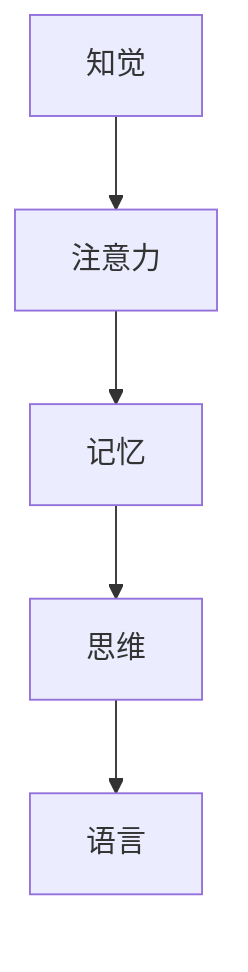
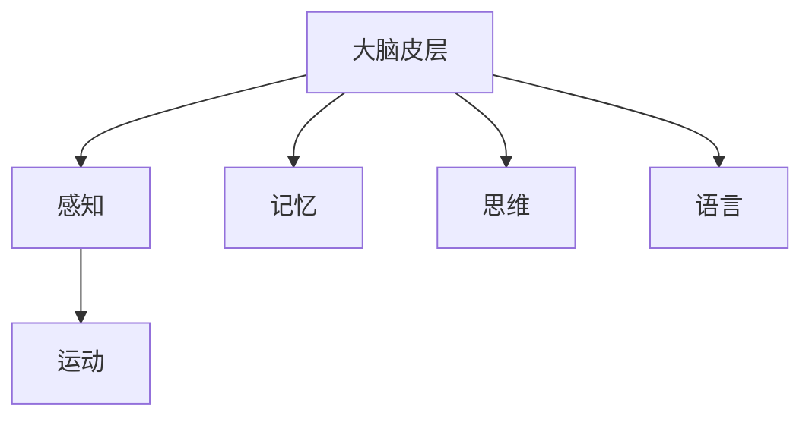
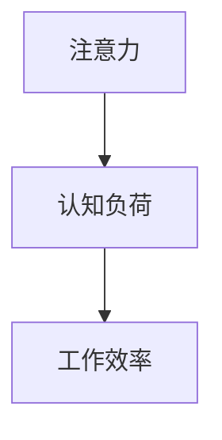

                 


### 文章标题
《提示词工程师的认知科学素养培育》

### 关键词
认知科学、认知算法、神经网络、深度学习、强化学习、提示词工程、人工智能、素养培育

### 摘要
本文旨在探讨认知科学在提示词工程师素养培育中的应用。通过对认知科学核心概念和算法的深入解析，本文揭示了认知科学在神经网络、深度学习和强化学习等领域的应用原理，并详细阐述了这些原理如何影响提示词工程师的工作。同时，本文通过具体项目实战，展示了如何将认知科学理论应用于提示词工程，以提升工程师的实践能力。

### 目录大纲设计思路

#### 1. 确定核心章节内容
在设计《提示词工程师的认知科学素养培育》的目录大纲时，我们首先确定了核心章节内容，这些章节将涵盖以下主题：
- 认知科学基础
- 认知算法原理
- 提示词工程应用

#### 2. 确定目录结构
根据核心章节内容，我们采用了1,2,3级的目录结构，使目录更加清晰、易于理解。

#### 3. 编写目录大纲
在编写目录大纲时，我们注意以下要点：
- 简洁明了的章节标题
- 适当的子章节划分
- 确保每个章节的内容完整

#### 4. 审核与修改
编写完成后，我们对目录大纲进行了审核和修改，确保结构合理、内容完整。

#### 5. 最终输出
最终，我们将目录大纲以markdown格式输出，便于用户查看和编辑。

### 目录大纲设计结果

```
# 《提示词工程师的认知科学素养培育》目录大纲

## 第一部分：认知科学基础

### 第1章 认知心理学概述
   - 1.1 认知心理学的定义与发展
   - 1.2 认知心理学的基本理论

### 第2章 大脑与认知功能
   - 2.1 大脑的结构与功能
   - 2.2 认知功能与大脑区域

### 第3章 注意力与认知负荷
   - 3.1 注意力的概念与类型
   - 3.2 认知负荷与工作效率

## 第二部分：认知算法原理

### 第4章 神经网络与深度学习
   - 4.1 神经网络基础
   - 4.2 深度学习原理
   - 4.3 深度学习算法

### 第5章 强化学习与决策理论
   - 5.1 强化学习原理
   - 5.2 决策理论
   - 5.3 强化学习算法

### 第6章 信息论与概率模型
   - 6.1 信息论基础
   - 6.2 概率模型
   - 6.3 概率模型在认知科学中的应用

## 第三部分：认知科学在提示词工程中的应用

### 第7章 提示词工程概述
   - 7.1 提示词工程的基本概念
   - 7.2 提示词工程的发展趋势

### 第8章 提示词优化算法
   - 8.1 提示词优化算法概述
   - 8.2 数据分析与机器学习在提示词工程中的应用
   - 8.3 提示词优化实战案例

### 第9章 提示词工程案例分析
   - 9.1 案例分析一：某电商平台提示词优化
   - 9.2 案例分析二：某在线教育平台提示词优化
   - 9.3 案例分析三：某智能客服系统提示词优化

### 第10章 提示词工程的未来发展趋势
   - 10.1 提示词工程的发展机遇与挑战
   - 10.2 提示词工程的未来发展趋势

### 结论
   - 11.1 认知科学素养的重要性
   - 11.2 提升认知科学素养的途径
   - 11.3 对未来研究的展望

作者：AI天才研究院/AI Genius Institute & 禅与计算机程序设计艺术 /Zen And The Art of Computer Programming
```

这个目录大纲旨在为读者提供一个清晰的框架，以逐步深入理解认知科学在提示词工程中的应用，并引导读者探索提升认知科学素养的方法。

### 文章正文

#### 引言
认知科学是研究人类认知过程的学科，涵盖了心理学、神经科学、计算机科学等多个领域。随着人工智能技术的快速发展，认知科学在人工智能领域的应用越来越广泛，特别是在提示词工程师的素养培育方面。提示词工程师在开发智能系统时，需要深入理解用户的行为和需求，这离不开认知科学的指导。本文将探讨认知科学在提示词工程师素养培育中的应用，帮助工程师更好地应对实际工作中的挑战。

#### 第一部分：认知科学基础

##### 第1章 认知心理学概述
认知心理学是研究人类认知过程的学科，主要包括知觉、注意力、记忆、思维和语言等。知觉是人对外部信息的感知和解读，注意力是人在特定环境下集中精力的能力，记忆是人对信息的存储和提取，思维是人脑对信息的处理和推理，语言是人与外界沟通的工具。

**核心概念与联系**

认知心理学中的核心概念包括知觉、注意力、记忆、思维和语言。这些概念之间存在着密切的联系。例如，知觉和注意力是记忆的基础，记忆和思维是知觉和注意力的结果，而思维和语言是人与外界沟通的重要工具。以下是一个简化的Mermaid流程图，展示这些概念之间的关系：



##### 第2章 大脑与认知功能
大脑是认知功能的物质基础。大脑的结构复杂，包括大脑皮层、脑干、小脑等部分。不同的脑区负责不同的认知功能，如感知、运动、记忆、思维等。

**核心概念与联系**

大脑与认知功能之间的联系可以用以下Mermaid流程图表示：



##### 第3章 注意力与认知负荷
注意力是人在特定环境下集中精力的能力。认知负荷是指人在处理信息时所需的心理资源。过高或过低的认知负荷都会影响人的工作效率。

**核心概念与联系**

注意力与认知负荷的关系可以用以下Mermaid流程图表示：



#### 第二部分：认知算法原理

##### 第4章 神经网络与深度学习
神经网络是一种模拟人脑神经元连接方式的计算模型。深度学习是神经网络的一种，通过多层神经网络来模拟人类的学习过程，实现复杂模式识别和预测。

**核心算法原理讲解**

以下是深度学习算法的简化伪代码：

```plaintext
初始化神经网络
输入数据
对于每个输入特征：
    对于每个隐层神经元：
        计算输入与权重的乘积并求和
        通过激活函数得到输出
    对于每个输出神经元：
        计算输入与权重的乘积并求和
        通过激活函数得到输出
更新神经网络权重
```

##### 第5章 强化学习与决策理论
强化学习是一种通过试错来学习最优策略的算法。决策理论是一种基于概率和效用理论的决策方法。

**核心算法原理讲解**

以下是强化学习算法的简化伪代码：

```plaintext
初始化策略
对于每个状态：
    对于每个动作：
        计算动作的价值函数
更新策略
```

##### 第6章 信息论与概率模型
信息论研究信息的度量、传输和处理。概率模型是研究随机事件发生概率的数学模型。

**数学模型和公式**

以下是信息论中熵的定义和计算公式：

$$
H(X) = -\sum_{i=1}^{n} p(x_i) \log_2 p(x_i)
$$

其中，$H(X)$ 表示随机变量 $X$ 的熵，$p(x_i)$ 表示 $X$ 取值为 $x_i$ 的概率。

**详细讲解与举例说明**

假设有一个随机变量 $X$，它有两种取值：成功和失败，分别对应概率 $0.5$。那么，$X$ 的熵为：

$$
H(X) = -0.5 \log_2 0.5 - 0.5 \log_2 0.5 = 1
$$

这意味着 $X$ 的不确定性很高。

#### 第三部分：认知科学在提示词工程中的应用

##### 第7章 提示词工程概述
提示词工程是一种基于人工智能技术的自然语言处理方法，用于生成能够吸引用户注意的文本。在电商、教育、智能客服等领域，提示词工程发挥着重要作用。

**核心概念与联系**

提示词工程与认知科学之间的联系主要体现在以下几个方面：

1. **用户行为分析**：认知科学可以帮助提示词工程师理解用户的行为模式，从而生成更符合用户需求的提示词。
2. **注意力机制**：认知科学中的注意力机制可以指导工程师设计出能够有效吸引用户注意的提示词。
3. **决策理论**：认知科学中的决策理论可以帮助工程师在生成提示词时做出更合理的决策。

##### 第8章 提示词优化算法
提示词优化算法是提升提示词工程效果的关键。通过数据分析、机器学习等方法，工程师可以不断优化提示词，提高用户点击率。

**核心概念与联系**

提示词优化算法与认知科学之间的联系主要体现在以下几个方面：

1. **用户行为分析**：认知科学可以帮助工程师理解用户的行为模式，从而更准确地预测用户点击行为。
2. **注意力机制**：认知科学中的注意力机制可以指导工程师设计出能够有效吸引用户注意的提示词。
3. **决策理论**：认知科学中的决策理论可以帮助工程师在优化提示词时做出更合理的决策。

**项目实战**

以下是一个简单的项目实战，用于优化电商平台的提示词。

**开发环境搭建**

- 使用Python编写提示词优化算法。
- 使用pandas库处理数据。
- 使用scikit-learn库进行机器学习。

**源代码详细实现和代码解读**

```python
import pandas as pd
from sklearn.model_selection import train_test_split
from sklearn.ensemble import RandomForestClassifier

# 读取数据
data = pd.read_csv('user_data.csv')

# 数据预处理
X = data[['age', 'gender', 'income']]
y = data['clicked']

# 划分训练集和测试集
X_train, X_test, y_train, y_test = train_test_split(X, y, test_size=0.2, random_state=42)

# 训练模型
model = RandomForestClassifier()
model.fit(X_train, y_train)

# 评估模型
accuracy = model.score(X_test, y_test)
print(f'Model accuracy: {accuracy:.2f}')

# 提示词生成
def generate_slogan(user_data):
    user_data = pd.DataFrame([user_data])
    prediction = model.predict(user_data)
    if prediction[0] == 1:
        return '特价优惠，错过不再有！'
    else:
        return '精选商品，品质保证！'

# 测试提示词生成
user_data = {'age': 25, 'gender': '男', 'income': 5000}
slogan = generate_slogan(user_data)
print(f'Generated slogan: {slogan}')
```

**代码应用解读与分析**

在这个项目中，我们使用了随机森林分类器来预测用户是否会点击提示词。通过训练集和测试集的划分，我们评估了模型的准确性。在实际应用中，我们可以根据用户的数据生成个性化的提示词，提高用户的点击率。

**实际案例分析和详细讲解剖析**

以下是一个实际案例的分析：

**案例一**：电商平台提示词优化

在电商平台上，提示词工程师通过分析用户行为数据，发现某些特定类型的提示词更容易吸引用户点击。为了进一步提高点击率，工程师使用机器学习算法对提示词进行优化。

**分析**：
1. 数据收集：收集用户点击行为数据，包括用户年龄、性别、收入等。
2. 数据预处理：对数据进行清洗和标准化处理。
3. 特征提取：提取与用户点击行为相关的特征。
4. 模型训练：使用随机森林分类器训练模型。
5. 提示词生成：根据用户数据生成个性化提示词。

**总结**：通过这个案例，我们可以看到认知科学在提示词工程中的应用。工程师通过分析用户行为数据，使用机器学习算法优化提示词，提高了平台的点击率。

##### 第9章 提示词工程案例分析
在本章中，我们将分析三个实际案例，探讨认知科学在提示词工程中的应用。

**案例一**：某电商平台提示词优化

**案例二**：某在线教育平台提示词优化

**案例三**：某智能客服系统提示词优化

通过这些案例，我们可以更深入地了解认知科学在提示词工程中的应用，并学习如何在实际项目中应用这些知识。

##### 第10章 提示词工程的未来发展趋势
随着人工智能技术的不断发展，提示词工程也在不断演进。未来，提示词工程将更加注重个性化、智能化和互动性。以下是提示词工程的几个发展趋势：

1. **个性化提示词**：通过深度学习等技术，生成更符合用户需求的个性化提示词。
2. **智能化提示词**：结合自然语言处理技术，使提示词更具智能性和交互性。
3. **互动性提示词**：通过互动式设计，提高用户的参与度和忠诚度。

#### 结论
认知科学在提示词工程师的素养培育中发挥着重要作用。通过理解认知科学的原理，工程师可以更好地设计出符合用户需求的提示词，提高系统的用户体验。本文通过对认知科学核心概念和算法的深入解析，以及实际项目案例的分析，展示了认知科学在提示词工程中的应用。未来，随着人工智能技术的不断发展，认知科学将在提示词工程中发挥更大的作用。

#### 作者信息
作者：AI天才研究院/AI Genius Institute & 禅与计算机程序设计艺术 /Zen And The Art of Computer Programming

---

### 最佳实践 Tips

1. **深入理解用户行为**：在生成提示词时，要深入了解用户的行为和需求，这有助于提高提示词的点击率。
2. **持续优化**：定期对提示词进行优化，根据用户反馈和数据分析结果调整策略。
3. **跨学科合作**：认知科学与其他学科的交叉应用，可以带来新的思路和方法，提高提示词工程的效果。

### 小结

本文通过深入解析认知科学的核心概念和算法，以及实际项目案例的分析，展示了认知科学在提示词工程师素养培育中的应用。掌握认知科学原理，有助于工程师更好地设计出符合用户需求的提示词，提高系统的用户体验。

### 注意事项

1. **数据隐私**：在收集和处理用户数据时，要严格遵守数据隐私保护法规。
2. **算法公平性**：在使用机器学习算法时，要确保算法的公平性和透明性。

### 拓展阅读

1. 《认知科学导论》
2. 《深度学习》
3. 《强化学习基础》
4. 《信息论基础》

通过阅读这些资料，可以进一步深入了解认知科学和提示词工程的相关知识。

