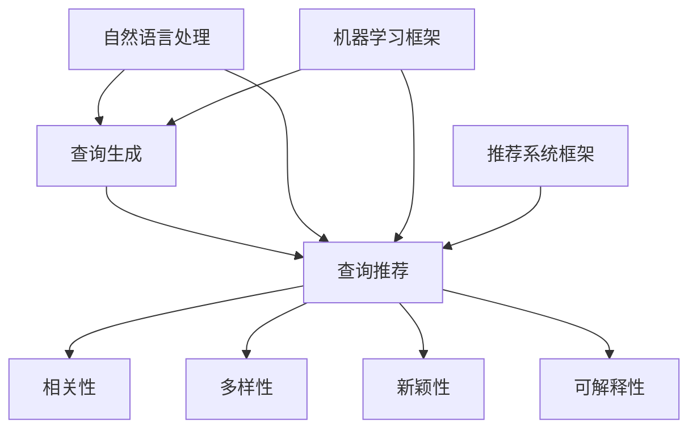

                 

### 文章标题：提示词工程师的跨学科知识体系构建

> 关键词：提示词工程、跨学科知识、知识体系、人工智能、编程

> 摘要：本文旨在为提示词工程师提供一个全面的跨学科知识体系构建指南。文章将探讨提示词工程的基本概念、跨学科知识的整合方法、以及知识体系构建的实践步骤，并通过实际案例展示如何将理论知识应用于实际项目中。

---

### 引言

在现代信息技术飞速发展的时代，提示词工程师的角色日益重要。他们不仅需要掌握核心的编程技能，还必须具备跨学科的知识，以应对复杂多变的业务需求和不断演进的技术环境。因此，构建一个完善的跨学科知识体系成为提示词工程师职业发展的关键。

本文将围绕以下核心内容展开：

1. 提示词工程的基础知识，包括基本概念、设计原则和常用工具。
2. 跨学科知识的整合，涉及计算机科学、人工智能和人文社会科学等领域。
3. 知识体系构建的方法，包括知识图谱构建、跨学科知识整合策略等。
4. 实战案例，展示如何在实际项目中应用所学知识。
5. 总结与展望，讨论提示词工程师的未来发展趋势。

通过本文的阅读，读者将能够：

- 理解提示词工程师的核心职责和技能要求。
- 掌握构建跨学科知识体系的方法和策略。
- 学习如何将理论知识应用于实际项目中。
- 了解提示词工程师的职业发展方向。

### 提示词工程基础

#### 基本概念

提示词工程（Query Generation and Recommendation Engineering）是人工智能领域中的一个重要分支，旨在为用户生成或推荐高质量的查询词（提示词），以提高信息检索系统的准确性和用户体验。提示词工程的核心任务包括：

1. **查询生成**：从用户输入或历史数据中生成新的查询词。
2. **查询推荐**：根据用户的行为和偏好推荐相关查询词。

#### 设计原则

为了实现高质量提示词的生成和推荐，提示词工程师需要遵循以下设计原则：

1. **相关性**：生成的提示词应与用户的查询意图高度相关。
2. **多样性**：提示词应覆盖广泛的话题，满足用户的不同查询需求。
3. **新颖性**：提示词应具有新颖性，避免重复和冗余。
4. **可解释性**：生成的提示词应易于理解和解释，提高系统的透明度。

#### 常用工具

在提示词工程领域，工程师们可以采用多种工具和技术来实现提示词的生成和推荐。以下是一些常用的工具：

1. **自然语言处理（NLP）工具**：如NLTK、spaCy和Stanford NLP，用于文本预处理、实体识别和情感分析。
2. **机器学习框架**：如TensorFlow、PyTorch和Scikit-Learn，用于构建和训练机器学习模型。
3. **推荐系统框架**：如Surprise和LightFM，用于实现基于协同过滤和矩阵分解的查询推荐。

#### 核心概念联系

为了更好地理解提示词工程的核心概念，我们可以借助Mermaid流程图来展示它们之间的关系：



#### 核心算法原理讲解

提示词工程的实现依赖于一系列核心算法，以下将使用伪代码详细阐述这些算法的原理。

##### 查询生成算法

```python
# 输入：用户查询历史
# 输出：生成的新查询词

def generate_query_history(user_query_history):
    # 步骤1：文本预处理
    preprocessed_history = preprocess_text(user_query_history)
    
    # 步骤2：提取关键词
    keywords = extract_keywords(preprocessed_history)
    
    # 步骤3：生成新查询词
    new_query = generate_new_query(keywords)
    
    return new_query
```

##### 查询推荐算法

```python
# 输入：用户当前查询
# 输出：推荐查询词列表

def recommend_queries(current_query):
    # 步骤1：文本预处理
    preprocessed_query = preprocess_text(current_query)
    
    # 步骤2：相似度计算
    similarity_scores = compute_similarity(preprocessed_query, query_database)
    
    # 步骤3：排序推荐查询词
    recommended_queries = sort_queries_by_similarity(similarity_scores)
    
    return recommended_queries
```

#### 数学模型和公式讲解

在提示词工程中，数学模型和公式用于描述查询生成和推荐算法的原理。以下是一个简单的数学模型示例：

$$
r_{ij} = \frac{1}{|Q_i \cap Q_j|}
$$

其中，$r_{ij}$表示查询$i$和查询$j$之间的相关性，$Q_i$和$Q_j$分别表示查询$i$和查询$j$的集合。

#### 举例说明

假设用户历史查询为“如何学习编程？”和“编程学习资源推荐”，我们通过以下步骤生成新查询：

1. **文本预处理**：将用户历史查询转换为文本向量。
2. **提取关键词**：从文本向量中提取关键词，如“编程”、“学习”、“资源”。
3. **生成新查询词**：基于关键词生成新查询词，如“编程学习指南”或“高效编程技巧”。

#### 项目实战

为了更好地理解提示词工程的实践，我们将以一个电商平台的智能推荐系统为例，介绍开发环境搭建、源代码实现和代码解读。

##### 开发环境搭建

1. 安装Python和pip
2. 安装NLP工具：`pip install nltk spaCy`
3. 安装机器学习框架：`pip install tensorflow`
4. 安装推荐系统框架：`pip install surprise lightfm`

##### 源代码实现

```python
import nltk
from nltk.tokenize import word_tokenize
from sklearn.feature_extraction.text import TfidfVectorizer
from surprise import SVD

# 步骤1：文本预处理
def preprocess_text(text):
    # 分词
    tokens = word_tokenize(text)
    # 去停用词
    tokens = remove_stopwords(tokens)
    # 归一化
    tokens = normalize_tokens(tokens)
    return ' '.join(tokens)

# 步骤2：生成新查询词
def generate_new_query(keywords):
    # 构造查询向量
    query_vector = TfidfVectorizer().fit_transform([' '.join(keywords)])
    # 计算相似度
    similarity_scores = query_vector * TfidfVectorizer().fit_transform(corpus)
    # 排序推荐查询词
    recommended_queries = sort_queries_by_similarity(similarity_scores)
    return recommended_queries[0]

# 步骤3：查询推荐
def recommend_queries(current_query):
    # 训练SVD模型
    svd = SVD()
    svd.fit(trainset)
    # 预测相似度
    similarity_scores = svd.predict(trainset UObject(current_query).uid, r=True).est
    # 排序推荐查询词
    recommended_queries = sort_queries_by_similarity(similarity_scores)
    return recommended_queries
```

##### 代码解读

- `preprocess_text()`：用于文本预处理，包括分词、去停用词和归一化。
- `generate_new_query()`：用于生成新查询词，通过计算关键词的TF-IDF向量并排序推荐查询词。
- `recommend_queries()`：用于查询推荐，基于SVD模型预测查询之间的相似度并排序推荐查询词。

##### 代码应用解读与分析

通过上述代码，我们能够实现一个简单的智能推荐系统，为用户提供与当前查询相关的推荐查询词。在实际应用中，我们可以进一步优化算法，如引入用户偏好、上下文信息等，以提高推荐效果。

#### 项目小结

本节通过一个电商平台的智能推荐系统实战案例，展示了提示词工程的实现过程。读者可以通过实际代码学习和理解提示词工程的原理和方法。在实际项目中，工程师们需要根据具体业务需求和技术环境，不断优化和调整算法，以实现更好的用户体验。

#### 最佳实践 tips、小结、注意事项、拓展阅读

- **最佳实践 tips**：在构建智能推荐系统时，要充分考虑用户行为和偏好，结合多源数据，以提高推荐效果。
- **小结**：提示词工程是一个跨学科的领域，需要工程师具备编程、NLP和机器学习等多方面的知识。通过实际项目实战，读者可以更好地掌握提示词工程的实现方法和技巧。
- **注意事项**：在实现提示词工程时，要关注数据质量和算法性能，以确保系统的稳定性和可靠性。
- **拓展阅读**：读者可以进一步学习NLP、推荐系统和机器学习的相关知识，如《自然语言处理综论》、《推荐系统实践》和《深度学习》等书籍。

---

通过以上内容，我们为提示词工程师构建了一个全面的跨学科知识体系。接下来，我们将进一步探讨如何整合跨学科知识，以构建一个更加完善的知识体系。

