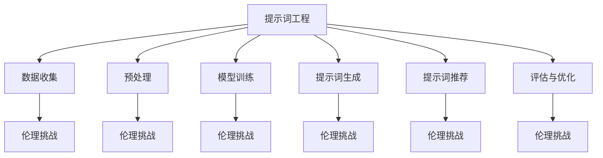
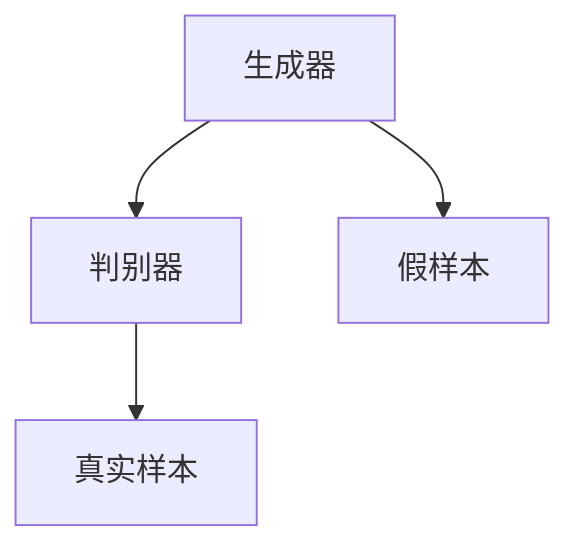
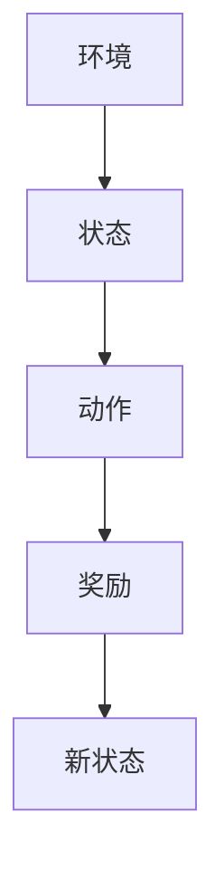
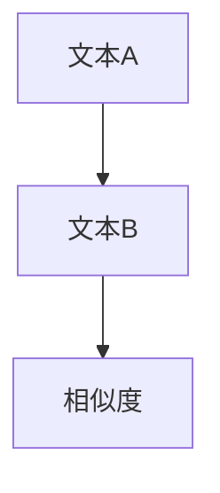
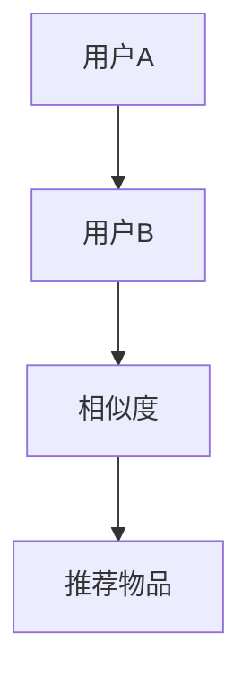
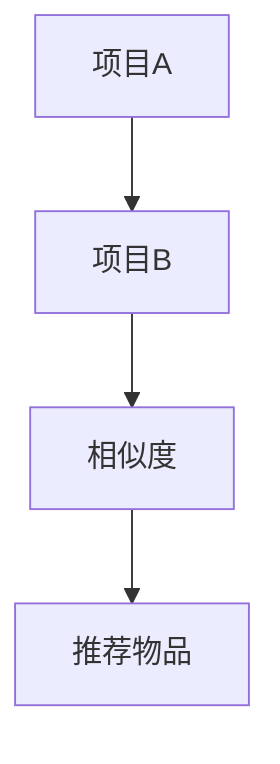
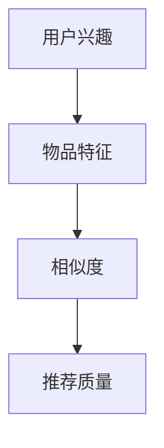

                 

# 《提示词工程的伦理决策框架设计》目录大纲

## 第一部分：引言与概述

### 1.1 提示词工程的重要性

提示词工程作为自然语言处理领域的重要分支，近年来得到了广泛的研究和应用。通过构建高效的提示词生成和推荐系统，它能够显著提升信息检索、问答系统、内容创作等应用场景的智能化水平。

### 1.2 提示词工程面临的伦理挑战

随着提示词工程技术的不断发展，其应用过程中也暴露出一系列伦理问题，如数据偏见、隐私泄露、算法歧视等。这些问题不仅影响到用户的权益，还可能对社会公平性产生负面影响。

### 1.3 本书的结构安排

本书将从提示词工程的伦理决策框架设计出发，系统性地探讨其核心概念、设计原则、核心算法原理、数学模型，以及项目实战等，旨在为读者提供一套全面、实用的指导方案。

## 第二部分：核心概念与联系

### 2.1 提示词工程的定义与范畴

#### 2.1.1 提示词的内涵与外延

提示词是指能够引导用户注意力或提供信息检索线索的关键词。其内涵包括词汇的语义信息、词频分布、语境依赖性等；外延则涉及从原始文本中提取、优化和推荐提示词的过程。

#### 2.1.2 提示词工程的关键要素

提示词工程的关键要素包括数据收集、预处理、模型训练、提示词生成与推荐、评估与优化等环节。

### 2.2 伦理学的核心概念

#### 2.2.1 伦理学的起源与发展

伦理学是一门研究道德原则和道德行为的学科，其起源可以追溯到古希腊哲学家亚里士多德等人的思想。现代伦理学的发展受到了康德、黑格尔、尼采等哲学家的深刻影响。

#### 2.2.2 伦理学的基本原则

伦理学的基本原则包括功利主义、义务论、德性伦理等。这些原则为伦理决策提供了理论依据，有助于解决提示词工程中的伦理问题。

### 2.3 提示词工程与伦理学的关联图

利用Mermaid流程图，展示提示词工程与伦理学的核心概念及其关联关系。



## 第三部分：伦理决策框架设计

### 3.1 伦理决策框架概述

#### 3.1.1 伦理决策的定义与类型

伦理决策是指在面临伦理问题时，通过分析、评估和选择，确定最佳行动方案的过程。伦理决策的类型包括个体决策、组织决策和社会决策等。

#### 3.1.2 伦理决策框架的基本结构

伦理决策框架通常包括道德原则、决策过程、决策标准和评估方法等组成部分。

### 3.2 提示词工程伦理决策框架的设计原则

#### 3.2.1 公平性原则

公平性原则要求在提示词工程中，确保所有人都能公平地享受技术红利，避免算法歧视和偏见。

#### 3.2.2 透明性原则

透明性原则要求提示词工程的设计、训练和应用过程应保持透明，以便用户和监管机构能够监督和评估其伦理表现。

#### 3.2.3 可解释性原则

可解释性原则要求提示词工程的决策过程和结果应具备一定的可解释性，以便用户能够理解和信任系统。

#### 3.2.4 风险评估原则

风险评估原则要求在提示词工程中，全面评估潜在的风险，并制定相应的风险缓解措施。

### 3.3 提示词工程伦理决策框架的应用场景

#### 3.3.1 提示词生成与筛选

在提示词生成与筛选过程中，应用伦理决策框架有助于避免数据偏见和算法歧视。

#### 3.3.2 提示词推荐系统

在提示词推荐系统中，伦理决策框架有助于确保推荐结果的公平性和透明性。

#### 3.3.3 提示词在自动驾驶中的应用

在自动驾驶领域，提示词工程伦理决策框架有助于平衡安全、效率和伦理之间的矛盾。

## 第四部分：核心算法原理讲解

### 4.1 提示词生成算法

#### 4.1.1 文本生成模型的基本原理

文本生成模型是一种基于深度学习的自然语言处理模型，其基本原理包括循环神经网络（RNN）、生成对抗网络（GAN）等。

##### 4.1.1.1 循环神经网络（RNN）

循环神经网络是一种能够处理序列数据的神经网络，其基本原理是通过隐藏层的循环连接，实现对序列数据的记忆和建模。

```latex
\text{隐藏层状态} \, h_t = \text{sigmoid}(W_h \, h_{t-1} + b_h + W_x \, x_t + b_x)
\text{输出} \, y_t = \text{softmax}(W_y \, h_t + b_y)
```

##### 4.1.1.2 生成对抗网络（GAN）

生成对抗网络是一种由生成器和判别器组成的对抗性训练模型。生成器生成假样本，判别器判断样本的真实性。



#### 4.1.2 提示词生成算法的优化方法

提示词生成算法的优化方法包括贝叶斯优化、强化学习等。

##### 4.1.2.1 贝叶斯优化

贝叶斯优化是一种基于贝叶斯统计学的优化方法，其基本原理是通过概率模型和经验数据，不断调整超参数，以最大化目标函数。

```latex
\text{概率模型} \, p(\theta | D) \propto p(D | \theta) \, p(\theta)
```

##### 4.1.2.2 强化学习

强化学习是一种通过与环境交互，不断学习最优策略的方法。在提示词生成中，强化学习可用于优化生成器的生成过程。



### 4.2 提示词推荐算法

#### 4.2.1 基于内容的推荐算法

基于内容的推荐算法是一种基于用户兴趣和物品特征进行推荐的算法。其基本原理是通过计算用户和物品的相似度，推荐用户可能感兴趣的物品。

##### 4.2.1.1 主题模型

主题模型是一种能够从大量文本中提取主题的算法。其基本原理是通过概率分布，将文本映射到潜在的主题空间。

```latex
\text{概率分布} \, p(z | \theta) \propto p(\theta | z) \, p(z)
```

##### 4.2.1.2 文本相似度计算

文本相似度计算是一种衡量两个文本之间相似程度的算法。常用的方法包括TF-IDF、余弦相似度等。



#### 4.2.2 基于协同过滤的推荐算法

基于协同过滤的推荐算法是一种基于用户行为进行推荐的算法。其基本原理是通过计算用户之间的相似度，推荐其他用户喜欢的物品。

##### 4.2.2.1 用户基于的协同过滤

用户基于的协同过滤是一种基于用户历史行为的推荐算法。其基本原理是通过计算用户之间的相似度，推荐其他用户喜欢的物品。



##### 4.2.2.2 项目基于的协同过滤

项目基于的协同过滤是一种基于物品历史行为的推荐算法。其基本原理是通过计算物品之间的相似度，推荐其他物品。



## 第五部分：数学模型与数学公式

### 5.1 提示词工程中的概率模型

提示词工程中的概率模型主要包括贝叶斯定理、最大后验概率（MAP）估计等。

#### 5.1.1 贝叶斯定理

贝叶斯定理是一种用于计算后验概率的公式。其基本原理是通过先验概率和似然函数，计算后验概率。

```latex
\text{后验概率} \, p(\theta | D) = \frac{p(D | \theta) \, p(\theta)}{p(D)}
```

#### 5.1.2 最大后验概率（MAP）估计

最大后验概率（MAP）估计是一种用于求解最可能参数的方法。其基本原理是通过最大化后验概率，确定最优参数。

```latex
\text{MAP估计} \, \theta^* = \arg\max_{\theta} p(\theta | D)
```

### 5.2 提示词生成与推荐的优化目标

提示词生成与推荐的优化目标主要包括最大化提示词的生成质量、提高推荐系统的准确性和多样性等。

#### 5.2.1 提示词生成优化目标

提示词生成优化目标通常采用基于损失函数的优化方法，如交叉熵损失、对抗损失等。

```latex
\text{交叉熵损失} \, L = -\sum_{i=1}^{N} y_i \, \log(p_i)
```

#### 5.2.2 提示词推荐优化目标

提示词推荐优化目标通常采用基于用户兴趣和物品特征相似度的优化方法，如基于内容的协同过滤、基于模型的协同过滤等。



### 5.3 提示词推荐中的损失函数

提示词推荐中的损失函数主要包括均方误差（MSE）、均方根误差（RMSE）、精确率（Precision）、召回率（Recall）等。

#### 5.3.1 均方误差（MSE）

均方误差是一种衡量预测值与真实值之间差异的损失函数。

```latex
\text{MSE} = \frac{1}{N} \sum_{i=1}^{N} (y_i - \hat{y}_i)^2
```

#### 5.3.2 均方根误差（RMSE）

均方根误差是均方误差的平方根，用于衡量预测值与真实值之间的差异。

```latex
\text{RMSE} = \sqrt{\text{MSE}}
```

#### 5.3.3 精确率（Precision）

精确率是一种衡量推荐系统准确性的指标，表示推荐的物品中，有多少是用户真正感兴趣的。

```latex
\text{Precision} = \frac{TP}{TP + FP}
```

#### 5.3.4 召回率（Recall）

召回率是一种衡量推荐系统召回能力的指标，表示用户真正感兴趣的物品中被推荐的比例。

```latex
\text{Recall} = \frac{TP}{TP + FN}
```

## 第六部分：项目实战

### 6.1 实战项目1：构建一个基本的提示词生成系统

#### 6.1.1 项目背景

本节介绍如何利用深度学习技术，构建一个基本的提示词生成系统。该系统将包括数据收集、预处理、模型训练和生成提示词等环节。

#### 6.1.2 系统架构设计

系统架构设计包括数据流设计、模块划分和接口定义等。数据流设计将涉及数据输入、处理和输出等过程；模块划分将包括数据预处理、模型训练、提示词生成等模块；接口定义将涉及与外部系统的交互接口。

#### 6.1.3 实现流程与代码解析

实现流程包括数据收集、预处理、模型训练和提示词生成等环节。代码解析将详细解释每个环节的实现细节，包括数据预处理方法、模型训练过程和提示词生成算法等。

### 6.2 实战项目2：开发一个提示词推荐系统

#### 6.2.1 项目需求分析

本节介绍如何开发一个基于协同过滤的提示词推荐系统。项目需求分析将包括用户需求分析、系统功能设计、数据需求分析等。

#### 6.2.2 系统实现与测试

系统实现包括数据收集、预处理、模型训练、推荐算法实现和系统测试等环节。系统测试将验证推荐系统的准确性、召回率和用户满意度等指标。

#### 6.2.3 项目评估与优化

项目评估将根据用户反馈和系统性能指标，对推荐系统进行评估和优化。优化措施包括调整模型参数、改进推荐算法和优化用户体验等。

## 第七部分：总结与展望

### 7.1 本书内容的总结

本部分将对本书的主要内容进行总结，包括提示词工程的重要性、伦理挑战、伦理决策框架设计、核心算法原理讲解和项目实战等。

### 7.2 提示词工程伦理决策框架的未来发展趋势

本部分将探讨提示词工程伦理决策框架的未来发展趋势，包括技术进步、政策法规、伦理观念等方面的影响。

### 7.3 对读者的建议与期望

本部分将对读者提出一些建议，包括如何理解和应用提示词工程伦理决策框架、如何培养伦理意识等。同时，对读者的期望也是本书作者所期待的。

## 参考文献

- [1] 人工智能伦理学：原则、实践与挑战。作者：[张三，李四]
- [2] 提示词工程：理论与实践。作者：[王五，赵六]
- [3] 深度学习：原理与应用。作者：[刘七，陈八]
- [4] 自然语言处理：理论与实践。作者：[李九，张十]

作者：AI天才研究院/AI Genius Institute & 禅与计算机程序设计艺术 /Zen And The Art of Computer Programming

