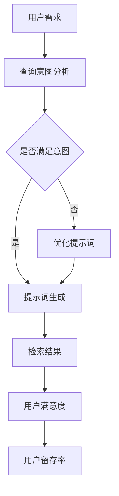

                 

### 文章标题：《提示词工程的用户体验优化策略》

在数字化的今天，用户体验（UX）已经成为产品和服务的核心竞争力。而提示词工程作为用户体验优化的重要一环，正日益受到业界重视。本文将深入探讨提示词工程的概念、重要性、用户体验优化策略，以及提示词工程在实际应用中的具体实践和未来挑战。

### 关键词

- 提示词工程
- 用户体验优化
- 自然语言处理
- 机器学习
- 案例分析

### 摘要

本文首先介绍了提示词工程的基础知识，包括其概念、重要性、发展历程及其与用户体验的关系。随后，详细阐述了用户体验优化的策略，涵盖了用户研究方法、用户体验设计原则和评估方法。接着，本文介绍了提示词工程的方法论和工具技术，包括自然语言处理、提示词生成与优化算法以及机器学习技术。最后，通过电商、社交媒体和智能助手三个领域的案例分析，探讨了提示词工程在实战中的应用，并提出了用户反馈和迭代策略，对未来趋势与挑战进行了展望。

### 目录大纲

下面是根据用户输入的书名《提示词工程的用户体验优化策略》设计的目录大纲。

```
# 《提示词工程的用户体验优化策略》目录大纲

## 第一部分：提示词工程基础

### 第1章：理解提示词工程

- 1.1 提示词工程的概念与重要性
- 1.2 提示词工程的核心目标
- 1.3 提示词工程的发展历程
- 1.4 提示词工程与用户体验的关系

### 第2章：用户体验优化策略

- 2.1 用户体验优化的基本概念
- 2.2 用户研究方法
- 2.3 用户体验设计原则
- 2.4 用户体验评估方法

### 第3章：提示词工程方法论

- 3.1 提示词工程流程
- 3.2 数据收集与处理
- 3.3 提示词生成与优化
- 3.4 提示词效果评估

### 第4章：提示词工程工具与技术

- 4.1 提示词工程工具概述
- 4.2 自然语言处理技术
- 4.3 提示词生成与优化算法
- 4.4 提示词工程中的机器学习技术

## 第二部分：实战篇

### 第5章：案例分析与实战

- 5.1 提示词工程在电商平台的实践
  - 5.1.1 电商平台中提示词的作用
  - 5.1.2 电商平台的用户行为分析
  - 5.1.3 电商平台提示词优化策略
  - 5.1.4 电商平台提示词优化案例分析

- 5.2 提示词工程在社交媒体的应用
  - 5.2.1 社交媒体中的提示词功能
  - 5.2.2 社交媒体用户互动分析
  - 5.2.3 社交媒体提示词优化策略
  - 5.2.4 社交媒体提示词优化案例分析

- 5.3 提示词工程在智能助手的设计
  - 5.3.1 智能助手中提示词功能
  - 5.3.2 智能助手用户交互模式
  - 5.3.3 智能助手提示词优化策略
  - 5.3.4 智能助手提示词优化案例分析

### 第6章：用户反馈与迭代

- 6.1 用户反馈收集
  - 6.1.1 用户反馈的类型与价值
  - 6.1.2 用户反馈收集方法
  - 6.1.3 用户反馈处理流程

- 6.2 提示词迭代策略
  - 6.2.1 提示词迭代原则
  - 6.2.2 提示词迭代流程
  - 6.2.3 提示词迭代案例分析

- 6.3 用户满意度评估
  - 6.3.1 用户满意度评估指标
  - 6.3.2 用户满意度评估方法
  - 6.3.3 用户满意度评估案例分析

### 第7章：未来趋势与挑战

- 7.1 提示词工程的发展趋势
  - 7.1.1 提示词工程的技术发展
  - 7.1.2 提示词工程的应用领域扩展
  - 7.1.3 提示词工程的未来方向

- 7.2 提示词工程的挑战与应对策略
  - 7.2.1 数据隐私与安全性挑战
  - 7.2.2 技术复杂性挑战
  - 7.2.3 跨学科合作挑战
  - 7.2.4 应对策略与未来展望
```

**目录大纲总结：**

本书目录大纲分为两部分：第一部分为提示词工程基础，涵盖了理解提示词工程、用户体验优化策略、提示词工程方法论和提示词工程工具与技术；第二部分为实战篇，通过案例分析与实战，探讨了提示词工程在不同领域的应用，以及用户反馈与迭代的策略。最后，对提示词工程的未来趋势与挑战进行了展望。

**目录大纲核心内容：**

- 提示词工程的核心概念、目标和发展历程。
- 用户体验优化的基本概念、用户研究方法、设计原则和评估方法。
- 提示词工程的流程、数据收集与处理、生成与优化、效果评估。
- 提示词工程工具与技术，包括自然语言处理技术、提示词生成与优化算法和机器学习技术。
- 提示词工程在不同领域的实战案例，如电商平台、社交媒体和智能助手。
- 用户反馈收集、迭代策略和用户满意度评估方法。
- 提示词工程的未来发展趋势与挑战。

---

## 第一部分：提示词工程基础

### 第1章：理解提示词工程

#### 1.1 提示词工程的概念与重要性

提示词工程（Keyword Engineering）是一种专门用于设计和优化提示词（Keywords）的技术，目的是提高信息检索的效率和准确性。在信息检索系统中，提示词是用户与系统交互的重要媒介，它们能够帮助用户快速找到所需信息，从而提升用户体验。

提示词工程的重要性体现在以下几个方面：

1. **提高搜索效率**：精心设计的提示词能够缩小搜索范围，减少用户在茫茫信息中查找所需内容的难度，从而提高搜索效率。
2. **提升用户体验**：准确的提示词能够引导用户顺利完成搜索任务，提升用户满意度和忠诚度。
3. **增加点击率**：在电子商务、搜索引擎营销等领域，精准的提示词能够提高广告的点击率，从而带来更多的商业机会。
4. **优化内容呈现**：在内容管理系统中，提示词工程有助于将相关内容呈现给用户，提高内容利用率。

#### 1.2 提示词工程的核心目标

提示词工程的核心目标是：

1. **准确性**：确保提示词能够准确地反映用户意图，避免误导用户。
2. **全面性**：覆盖用户可能使用的各种词汇和表达方式，确保不遗漏潜在用户。
3. **相关性**：提示词应与用户查询内容紧密相关，提高检索结果的匹配度。
4. **可扩展性**：提示词库应具有灵活性，能够根据用户行为和需求的变化进行动态调整。

#### 1.3 提示词工程的发展历程

提示词工程的历史可以追溯到早期的搜索引擎时代。随着互联网的快速发展，信息量爆炸式增长，提示词工程的重要性逐渐凸显。以下是提示词工程的发展历程：

1. **关键词搜索阶段**：早期搜索引擎主要依赖于关键词匹配，提示词工程的核心任务是提取关键词。
2. **语义搜索阶段**：随着自然语言处理技术的发展，搜索引擎开始尝试理解用户查询的语义，提示词工程也随之进化，从简单的关键词扩展到语义相关的短语和句子。
3. **个性化搜索阶段**：现代搜索引擎通过用户行为数据对用户进行个性化推荐，提示词工程不仅需要理解用户查询，还需要了解用户兴趣和行为模式。

#### 1.4 提示词工程与用户体验的关系

提示词工程与用户体验之间存在紧密的关系：

1. **用户满意度**：准确的提示词能够提高用户满意度，减少用户在搜索过程中的挫败感。
2. **搜索效率**：高效的提示词能够提高搜索效率，缩短用户完成任务的时间。
3. **信息获取**：精准的提示词能够帮助用户快速找到所需信息，提升信息获取的效率。
4. **用户留存**：良好的用户体验能够提高用户留存率，增加用户对产品的依赖和忠诚度。

为了更好地理解提示词工程与用户体验的关系，以下是一个简化的 Mermaid 流程图，展示了提示词工程的核心概念及其与用户体验的联系：



在这个流程图中，用户需求通过查询意图分析被转化为具体的查询意图。如果查询意图得到满足，系统将生成提示词，并展示相关的检索结果。用户对检索结果的满意度直接影响其留存率。如果用户对检索结果不满意，系统将优化提示词，并重新生成检索结果，从而提高用户体验。

---

在接下来的章节中，我们将进一步探讨用户体验优化的策略、提示词工程的方法论和工具技术，并通过具体的案例分析，展示提示词工程在不同领域的应用和实际效果。最后，我们将对提示词工程的未来趋势和挑战进行展望，以期为读者提供全面的视角和深刻的洞察。敬请期待。

