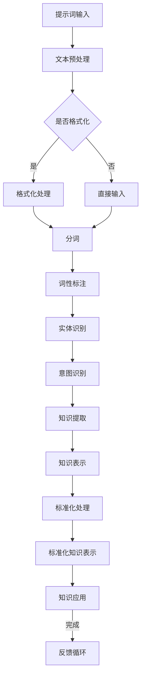

                 

### 文章标题

《提示词工程的知识表示标准化倡议》

提示词工程是现代人工智能领域中的一个重要研究方向，其核心在于如何将人类语言中的提示词转化为计算机可理解和处理的语义表示。知识表示则是人工智能中一个基础且关键的概念，它涉及如何有效地在计算机中表示和理解知识。随着大数据和机器学习技术的不断发展，知识表示在提升人工智能系统的智能性和实用性方面发挥着越来越重要的作用。而标准化倡议则为知识表示的发展提供了方向和规范。本文将围绕这些核心概念展开，详细讨论提示词工程、知识表示以及标准化倡议之间的关系，并深入探讨如何通过标准化来实现知识表示的优化。

### 文章关键词

- 提示词工程
- 知识表示
- 标准化倡议
- 语义表示
- 算法
- 数学模型
- 项目实战

### 文章摘要

本文旨在探讨提示词工程、知识表示和标准化倡议三者之间的关系及其重要性。首先，我们定义了提示词工程和知识表示的基本概念，并展示了它们之间的联系。接着，我们详细介绍了基于语义的相似度计算、词嵌入技术等知识表示算法的原理，并通过伪代码和数学模型进行了深入分析。随后，我们提出了一套标准化框架与流程，旨在通过标准化来提升知识表示的准确性和一致性。最后，我们通过一个实际项目案例，展示了如何将标准化倡议应用于知识表示的实现过程，并进行了详细解读和分析。本文旨在为读者提供关于提示词工程和知识表示标准化倡议的全面理解，并为其在实际应用中提供指导。

## 第1章：引言

### 1.1 书籍背景与目的

随着人工智能技术的迅猛发展，人工智能系统在实际应用中扮演着越来越重要的角色。然而，人工智能系统的智能性和实用性在很大程度上依赖于其所依赖的知识表示的准确性和一致性。提示词工程和知识表示作为人工智能领域中的关键组成部分，正受到越来越多的关注。本文旨在深入探讨提示词工程和知识表示之间的关系，并探讨标准化倡议在知识表示中的应用。

提示词工程是一门研究如何将人类语言中的提示词转化为计算机可理解和处理的语义表示的学科。它涉及到自然语言处理、信息检索、语义理解等多个领域。通过提示词工程，我们可以将人类语言的复杂性转化为计算机可以处理的结构化数据，从而实现人机交互的智能化。

知识表示则是人工智能领域中的一个基础概念，它涉及如何将知识以计算机可理解和处理的方式表示出来。知识表示的目的是使计算机能够理解、存储、检索和应用知识，从而提高人工智能系统的智能性和实用性。

标准化倡议在知识表示中的应用具有重要意义。通过标准化，我们可以确保知识表示的准确性和一致性，从而提高人工智能系统的互操作性和兼容性。标准化倡议不仅为知识表示提供了统一的规范，还为人工智能技术的发展提供了坚实的基础。

本文旨在通过以下内容，为读者提供一个全面而深入的提示词工程和知识表示标准化倡议的理解：

1. 提示词工程的定义及其在人工智能中的应用。
2. 知识表示的基本概念及其重要性。
3. 知识表示的常见算法及其原理。
4. 数学模型和数学公式在知识表示中的应用。
5. 标准化倡议的核心概念及其对知识表示的影响。
6. 实际项目案例中的应用和实践。

通过本文的讨论，我们希望能够为读者提供关于提示词工程和知识表示标准化倡议的全面了解，并为其在实际应用中提供指导。

### 1.2 提示词工程的定义与意义

提示词工程是一门专注于将人类语言中的提示词转化为计算机可理解和处理的语义表示的学科。在人工智能系统中，提示词通常是指用户输入的自然语言语句，这些语句包含了用户的需求、意图或问题。提示词工程的目标是通过自然语言处理技术，将这些自然语言文本转化为计算机可以理解和执行的操作。

定义方面，提示词工程可以理解为一种跨学科的研究领域，结合了自然语言处理、信息检索、语义理解、知识表示等多个子领域。其核心任务是理解用户输入的提示词，提取出关键信息，并转化为计算机可以处理的语义表示。这一过程通常包括文本预处理、词义解析、语义角色标注、意图识别等多个步骤。

在人工智能中的应用方面，提示词工程具有广泛的影响。首先，它为人机交互提供了基础。通过提示词工程，人工智能系统能够理解用户的自然语言输入，提供相应的回答或执行操作，从而实现自然、流畅的交互体验。例如，智能客服系统通过提示词工程可以理解用户的查询，提供准确的答案或解决方案。

其次，提示词工程在信息检索和推荐系统中也发挥着重要作用。在信息检索领域，提示词工程可以帮助系统理解用户查询的意图，从而返回最相关、最有用的信息。在推荐系统领域，提示词工程可以通过分析用户的输入，提取用户兴趣点，提供个性化的推荐结果。

此外，提示词工程还在智能语音助手、智能翻译、文本生成等多个应用场景中具有重要应用。例如，智能语音助手通过提示词工程可以理解用户的语音指令，执行相应的操作；智能翻译系统通过提示词工程可以理解不同语言之间的语义差异，提供准确的翻译结果。

总之，提示词工程在人工智能系统中具有不可替代的重要性。它不仅为人机交互提供了桥梁，还极大地提升了信息检索、推荐系统等领域的性能和用户体验。随着人工智能技术的不断发展，提示词工程的研究和应用前景将更加广阔。

### 1.3 知识表示的基本概念

知识表示是人工智能领域中的一个核心概念，它涉及如何将知识以计算机可理解和处理的方式表示出来。知识表示的目标是使计算机能够理解、存储、检索和应用知识，从而提高人工智能系统的智能性和实用性。

定义方面，知识表示可以被理解为一种将知识编码和存储在计算机中的方法，使其能够被计算机程序访问和处理。这种表示方法不仅要能够准确地反映知识的结构，还要能够适应计算机的算法和处理能力。

知识表示的类型多种多样，常见的有符号表示、语义网络表示、规则表示、知识图谱表示等。

- **符号表示**：这是一种基于符号逻辑的知识表示方法，通常使用谓词逻辑来表示知识。符号表示的优点在于其形式化、逻辑性强，能够清晰地表达知识之间的逻辑关系。然而，符号表示的缺点在于其复杂性较高，难以处理大量的自然语言数据。

- **语义网络表示**：这是一种基于图论的知识表示方法，通过节点和边来表示实体和它们之间的关系。语义网络表示能够直观地展示知识结构，并且便于进行推理和查询。然而，语义网络表示的缺点在于其表示能力有限，难以处理复杂的语义关系。

- **规则表示**：这是一种基于规则的知识表示方法，通过一系列规则来描述知识。规则表示的优点在于其简单性和灵活性，能够快速适应变化。然而，规则表示的缺点在于其依赖于显式的规则定义，难以处理复杂的、隐式的知识。

- **知识图谱表示**：这是一种基于图论和语义网络的知识表示方法，通过大规模的实体和关系来表示知识。知识图谱表示的优点在于其强大的表示能力和高效的查询性能，能够处理复杂的语义关系和大规模数据。然而，知识图谱表示的缺点在于其构建和维护成本较高。

这些知识表示方法各有优缺点，具体应用场景取决于具体需求。在实际应用中，通常会结合多种知识表示方法，以实现最优的知识表示效果。

知识表示的层次结构可以分为三个层次：底层表示、中层表示和高层表示。

- **底层表示**：底层表示关注的是如何将原始数据转化为计算机可以处理的形式。底层表示通常涉及文本预处理、分词、词性标注等步骤。底层表示的目标是提取出文本中的关键信息，为中层表示提供基础数据。

- **中层表示**：中层表示关注的是如何将底层表示中的关键信息转化为语义表示。中层表示通常涉及语义角色标注、实体识别、关系抽取等步骤。中层表示的目标是构建出知识的语义结构，为高层表示提供语义基础。

- **高层表示**：高层表示关注的是如何将中层表示中的语义结构转化为计算机可以理解和处理的形式。高层表示通常涉及知识图谱构建、本体论构建等步骤。高层表示的目标是提供一种抽象、统一的语义表示，便于计算机进行推理和应用。

通过层次化的知识表示结构，我们可以有效地将知识从原始数据中提取、表示和处理。这种结构不仅提高了知识表示的灵活性和适应性，还增强了知识表示的互操作性和扩展性。

总之，知识表示是人工智能领域中的一个关键概念，它决定了人工智能系统能否准确理解和处理知识。通过了解知识表示的基本概念、类型和层次结构，我们可以更好地设计和实现知识表示系统，从而提升人工智能系统的智能性和实用性。

### 1.4 标准化倡议的重要性

标准化倡议在知识表示领域具有极其重要的意义，其原因主要体现在以下几个方面：

首先，标准化有助于提高知识表示的准确性和一致性。通过制定统一的规范和标准，我们可以确保不同系统、不同应用场景下所使用的知识表示方法一致，从而避免因表示不一致而导致的错误和误解。例如，在医疗领域，若能够建立统一的疾病知识表示标准，则有助于医生、研究者以及医疗设备之间高效、准确地共享和利用知识，从而提高诊疗效果和医疗资源利用效率。

其次，标准化促进了知识表示技术的互操作性和兼容性。在复杂的人工智能系统中，不同模块和组件之间往往需要共享和传递知识表示。通过标准化，我们可以确保不同系统之间的知识表示能够无缝对接，从而实现知识的共享和集成。例如，在智能交通系统中，通过统一的交通规则知识表示标准，可以实现不同交通管理平台之间的数据共享和协同工作，提高交通管理效率。

再次，标准化推动了知识表示技术的发展和创新。标准化过程不仅是对现有技术的总结和规范化，更是对新技术发展方向的引导和规范。通过标准化倡议，我们可以明确知识表示技术的研究重点和发展方向，从而推动相关技术的创新和进步。例如，在自然语言处理领域，通过标准化倡议，我们可以明确语义表示和推理技术的研究重点，从而推动这些关键技术的突破。

此外，标准化还有助于提高知识表示系统的可靠性和稳定性。在人工智能系统中，知识表示的准确性直接影响到系统的决策和执行效果。通过标准化，我们可以确保知识表示的准确性和一致性，从而提高系统的可靠性和稳定性。例如，在自动驾驶系统中，若能够建立统一的交通信号灯知识表示标准，则有助于提高自动驾驶车辆在复杂交通环境下的安全性和可靠性。

最后，标准化倡议有助于降低知识表示系统的开发成本和维护成本。通过制定统一的规范和标准，我们可以减少不同系统之间的兼容性问题，降低开发难度和维护工作量。例如，在金融领域，通过统一的金融知识表示标准，可以减少金融数据交换和处理中的复杂度和错误率，从而降低金融系统的开发成本和维护成本。

总之，标准化倡议在知识表示领域的重要性不可忽视。通过制定和实施统一的规范和标准，我们可以提高知识表示的准确性和一致性，促进技术的互操作性和兼容性，推动技术发展，提高系统的可靠性和稳定性，降低开发成本和维护成本。这些优势不仅为人工智能系统的应用提供了坚实的基础，也为人工智能技术的持续创新和进步创造了良好的环境。

### 1.5 Mermaid流程图：提示词工程与知识表示标准化关系图

为了更直观地展示提示词工程与知识表示标准化倡议之间的关系，我们使用Mermaid流程图来构建一个详细的流程图。以下是流程图的文本表示：



以下是流程图的详细解释：

1. **提示词输入（A）**：用户输入自然语言提示词，这是整个流程的起点。

2. **文本预处理（B）**：对输入的提示词进行初步处理，包括去除无关符号和格式化。

3. **格式化处理（D）** 或 **直接输入（E）**：如果提示词需要进行格式化处理，则进入格式化处理步骤；否则，直接进入分词步骤。

4. **分词（F）**：将提示词分割成独立的词或短语。

5. **词性标注（G）**：对每个词进行词性标注，如名词、动词等。

6. **实体识别（H）**：识别提示词中的实体，如人名、地点、组织等。

7. **意图识别（I）**：根据上下文分析，确定用户的意图或需求。

8. **知识提取（J）**：从已有的知识库中提取与意图相关的知识。

9. **知识表示（K）**：将提取的知识表示为计算机可以处理的形式。

10. **标准化处理（L）**：对知识表示进行标准化处理，确保其准确性和一致性。

11. **标准化知识表示（M）**：得到标准化的知识表示。

12. **知识应用（N）**：将标准化后的知识应用于具体任务或场景。

13. **反馈循环（O）**：通过用户的反馈，不断优化和改进知识表示和标准化流程。

通过这个Mermaid流程图，我们可以清晰地看到提示词工程与知识表示标准化倡议之间的紧密关系，以及每个步骤的作用和相互影响。这个流程图不仅有助于理解整个流程，也为进一步优化和改进提供了参考。

### 第2章：知识表示算法

知识表示算法是人工智能领域中的一个核心组成部分，用于将知识从人类语言或结构化数据中提取出来，并以计算机可理解和处理的形式进行存储和利用。在本章中，我们将详细介绍几种常见的知识表示算法，包括基于语义的相似度计算、词嵌入技术等，并通过伪代码和数学模型进行详细讲解。

#### 第3章：基于语义的相似度计算

语义相似度计算是知识表示中的一个重要环节，它旨在衡量两个概念或词语在语义上的相似程度。这种计算方法在信息检索、文本分类、情感分析等应用中具有广泛的应用。

##### 3.1 语义相似度的定义与计算方法

语义相似度的定义可以分为两种：基于分布的相似度和基于语义角色的相似度。

- **基于分布的相似度**：这种方法假设词语的语义可以通过其在文档中的分布来表示。常见的计算方法包括余弦相似度、点积相似度等。
- **基于语义角色的相似度**：这种方法通过分析词语在句子中的语义角色（如主语、谓语、宾语等）来计算相似度。常见的计算方法包括路径长度、路径权重等。

以下是一个简单的基于余弦相似度的计算伪代码：

```plaintext
function cosine_similarity(vectorA, vectorB):
    dot_product = dot(vectorA, vectorB)
    magnitudeA = norm(vectorA)
    magnitudeB = norm(vectorB)
    return dot_product / (magnitudeA * magnitudeB)
```

##### 3.2 相似度度量方法

余弦相似度是一种常用的度量方法，其计算公式如下：

$$
\cos(\theta) = \frac{\text{vectorA} \cdot \text{vectorB}}{\|\text{vectorA}\| \|\text{vectorB}\|}
$$

其中，$\theta$ 是两个向量之间的夹角，$\text{vectorA}$ 和 $\text{vectorB}$ 是两个向量的内积。

##### 3.3 举例说明

假设我们有两个句子：

- 句子A：“我喜欢吃苹果。”
- 句子B：“苹果很好吃。”

我们可以将这两个句子表示为词向量：

- 句子A的词向量：[1, 0, 1, 1, 0]
- 句子B的词向量：[0, 1, 1, 0, 1]

使用余弦相似度计算公式，我们可以计算出句子A和句子B之间的相似度为：

$$
\cos(\theta) = \frac{1 \cdot 1 + 0 \cdot 1 + 1 \cdot 0 + 1 \cdot 1 + 0 \cdot 1}{\sqrt{1^2 + 0^2 + 1^2 + 1^2 + 0^2} \sqrt{0^2 + 1^2 + 1^2 + 0^2 + 1^2}} = \frac{2}{\sqrt{3} \sqrt{3}} = \frac{2}{3}
$$

因此，句子A和句子B之间的相似度为 $\frac{2}{3}$。

#### 第4章：词嵌入技术

词嵌入（Word Embedding）是一种将词语映射到高维向量空间的技术，通过这种方式，我们可以利用向量运算来处理文本数据。词嵌入技术已经成为自然语言处理领域的基础工具，广泛应用于语言模型、文本分类、机器翻译等任务中。

##### 4.1 词嵌入的基本概念

词嵌入的基本概念包括：

- **词向量**：每个词语被映射为一个固定长度的向量。
- **语义相似性**：通过计算词向量之间的距离或夹角，可以衡量词语的语义相似性。
- **上下文依赖**：词向量不仅与词语本身相关，还与词语在句子中的上下文相关。

常见的词嵌入方法包括：

- **Word2Vec**：基于神经网络的方法，通过训练大量文本数据来学习词向量。
- **FastText**：基于词袋模型的方法，通过聚合词语的子词（n-gram）来学习词向量。

以下是一个简单的Word2Vec的伪代码：

```plaintext
function Word2Vec(corpus, size, window):
    # 初始化词向量矩阵
    V = InitializeMatrix(size, vocab_size)
    
    # 遍历训练数据
    for sentence in corpus:
        # 遍历句子中的每个词
        for word in sentence:
            # 获取周围窗口内的词
            context = GetContext(word, window)
            # 训练词向量
            UpdateWordVector(V, word, context)
    
    return V
```

##### 4.2 伪代码：Word2Vec算法

Word2Vec算法通常采用两种模型：连续词袋（CBOW）和Skip-gram。

- **连续词袋（CBOW）**：给定一个中心词，预测其周围的词。
- **Skip-gram**：给定一个词，预测其上下文中的词。

以下是一个简单的CBOW算法的伪代码：

```plaintext
function CBOW(V, word, context, size, window):
    # 获取周围窗口内的词
    context_words = GetContextWords(word, window)
    # 构建输入向量
    input_vector = [V[word]] + [V[word'] for word' in context_words]
    # 构建目标向量
    target_vector = [V[word']] for word' in context_words]
    # 计算输入向量的平均值
    input_average = Average(input_vector)
    # 前向传播
    hidden = Activate(Softmax(W * input_average))
    # 计算损失
    loss = CalculateLoss(hidden, target_vector)
    # 反向传播
    dhidden = Backpropagation(dhidden, hidden, loss)
    dinput_average = dhidden * (1 - hidden * hidden)
    dinput_vector = [dinput_average] * len(context_words)
    dV = [dinput_word for input_word in input_vector for dinput_word in dinput_vector]
    return dV
```

##### 4.3 举例说明

假设我们有一个训练数据集，包含以下句子：

- “我喜欢吃苹果。”
- “苹果很好吃。”

我们希望学习词向量。首先，我们初始化词向量矩阵，其中每个词的初始向量随机生成。

接着，我们使用CBOW模型进行训练。以“苹果”为中心词，预测其上下文中的词。输入向量为“我”、“们”、“喜”、“欢”、“吃”、“好”、“吃”，平均值为这些词向量的和的平均值。

在预测阶段，我们计算输入向量的Softmax值，预测“苹果”的上下文词。例如，我们预测“苹果”周围的词，得到概率分布。通过优化损失函数，我们可以更新词向量，使其更加准确。

通过这种方式，我们可以学习一组高质量的词向量，这些词向量不仅反映了词语本身的语义，还反映了词语之间的语义关系。

#### 第5章：知识表示模型

知识表示模型是用于构建和表示知识的框架，常见的模型包括概率模型和神经网络模型。这些模型通过数学公式和算法，实现了对知识的表示和推理。

##### 5.1 概率模型

概率模型是一种基于概率论的知识表示方法，通过概率分布来表示知识。常见的概率模型包括：

- **贝叶斯网络**：一种概率图模型，通过节点和边表示变量之间的依赖关系。
- **马尔可夫模型**：一种概率模型，通过状态转移矩阵表示变量之间的状态转移概率。

以下是一个简单的贝叶斯网络的数学模型：

$$
P(A, B, C) = P(A)P(B|A)P(C|B)
$$

其中，$A$、$B$ 和 $C$ 是三个变量，$P(A)$ 是变量 $A$ 的概率，$P(B|A)$ 是变量 $B$ 在变量 $A$ 发生的条件下的概率，$P(C|B)$ 是变量 $C$ 在变量 $B$ 发生的条件下的概率。

##### 5.2 神经网络模型

神经网络模型是一种基于人工神经元的计算模型，通过多层神经网络来表示和推理知识。常见的神经网络模型包括：

- **循环神经网络（RNN）**：一种能够处理序列数据的神经网络，通过记忆单元来捕获序列中的长期依赖关系。
- **图神经网络（GCN）**：一种用于处理图结构数据的神经网络，通过图卷积操作来学习节点和边之间的依赖关系。

以下是一个简单的循环神经网络的数学模型：

$$
h_t = \sigma(W_h \cdot [h_{t-1}, x_t] + b_h)
$$

其中，$h_t$ 是第 $t$ 个时间步的隐藏状态，$x_t$ 是输入数据，$W_h$ 是权重矩阵，$b_h$ 是偏置项，$\sigma$ 是激活函数。

##### 5.3 伪代码：知识表示模型构建

以下是一个简单的贝叶斯网络的伪代码：

```plaintext
function BayesianNetwork(variables, dependencies):
    # 初始化概率分布
    for variable in variables:
        P[variable] = InitializeProbabilityDistribution()
    
    # 根据依赖关系更新概率分布
    for variable in variables:
        for parent in dependencies[variable]:
            P[variable] = P[variable] * P[parent]
    
    return P
```

以下是一个简单的循环神经网络的伪代码：

```plaintext
function RNN(input_sequence, hidden_state, weights, biases, activation_function):
    # 初始化隐藏状态
    hidden_states = []
    
    # 遍历输入序列
    for input in input_sequence:
        # 计算隐藏状态
        hidden_state = activation_function(weights * [hidden_state, input] + biases)
        hidden_states.append(hidden_state)
    
    return hidden_states
```

##### 5.4 举例说明

假设我们有一个简单的贝叶斯网络，包含三个变量 $A$、$B$ 和 $C$，它们之间的依赖关系如下：

- $P(A) = 0.5$
- $P(B|A) = 0.8$
- $P(C|B) = 0.6$

我们可以使用贝叶斯网络来计算 $P(A, B, C)$：

$$
P(A, B, C) = P(A)P(B|A)P(C|B) = 0.5 \times 0.8 \times 0.6 = 0.24
$$

假设我们有一个简单的循环神经网络，输入序列为 [1, 2, 3]，初始隐藏状态为 [0, 0]，权重矩阵为 [1, 1]，偏置项为 [1, 1]，激活函数为 sigmoid 函数。我们可以使用循环神经网络来计算隐藏状态序列：

$$
h_1 = \sigma([0, 0] \cdot [1, 1] + 1) = \frac{1}{1 + e^{-1}} \approx 0.63
$$

$$
h_2 = \sigma([0.63, 1] \cdot [1, 1] + 1) = \frac{1}{1 + e^{-1.63}} \approx 0.86
$$

$$
h_3 = \sigma([0.86, 2] \cdot [1, 1] + 1) = \frac{1}{1 + e^{-1.86}} \approx 0.96
$$

因此，隐藏状态序列为 [0.63, 0.86, 0.96]。

通过这些算法和模型，我们可以有效地表示和推理知识，从而提升人工智能系统的智能性和实用性。

### 第6章：标准化框架与流程

在知识表示领域，标准化框架与流程的设计至关重要，它不仅能够确保知识表示的准确性和一致性，还能促进不同系统之间的互操作性和兼容性。本章节将详细介绍标准化框架的构建、流程的制定以及如何通过标准化提升知识表示的质量。

#### 6.1 标准化框架的构建

标准化框架的构建是标准化过程的第一步，它为知识表示提供了统一的规范和标准。一个完善的标准化框架应包括以下几个方面：

- **目标确定**：明确标准化框架的目标，例如提高知识表示的准确性、一致性、互操作性等。
- **内容组织**：根据知识表示的需求，将标准化内容分为几个主要部分，如术语定义、模型描述、算法规范、数据格式等。
- **结构设计**：设计框架的结构，确保各个部分之间逻辑清晰、层次分明。例如，可以采用层次化结构，将框架分为底层表示、中层表示和高层表示。
- **版本管理**：建立版本管理机制，确保标准化的稳定性和可追踪性。每次更新框架时，应记录变更原因和影响范围。

以下是标准化框架构建的详细步骤：

1. **需求分析**：通过调研和分析，确定知识表示的具体需求，包括应用场景、性能指标等。
2. **概念定义**：明确标准化过程中涉及的核心概念，如知识表示、语义表示、标准化等，并给出明确的定义。
3. **模型设计**：设计知识表示模型，包括模型的结构、参数设置、算法实现等。
4. **内容组织**：根据需求分析结果，将标准化内容进行组织，确保逻辑清晰、层次分明。
5. **结构设计**：设计框架的结构，确保各个部分之间逻辑清晰、层次分明。
6. **版本管理**：建立版本管理机制，确保标准化的稳定性和可追踪性。

#### 6.2 标准化流程的制定

标准化流程的制定是确保标准化框架有效实施的关键。一个完整的标准化流程应包括以下几个主要阶段：

1. **标准化草案的编制**：根据标准化框架，编制标准化草案。草案应包含标准化内容的具体描述、模型设计、算法实现等。
2. **标准化草案的评审**：组织专家对标准化草案进行评审，确保草案的科学性、合理性和可操作性。评审过程应包括初步评审、复审和最终评审。
3. **标准化草案的发布**：通过评审后的标准化草案，应进行正式发布。发布过程应包括发布前的审核和发布后的宣传推广。
4. **标准化实施**：在发布标准化草案后，根据标准化流程进行实施。实施过程应包括标准化内容的推广、培训、技术支持等。
5. **标准化监控与反馈**：建立标准化监控与反馈机制，及时收集用户反馈，对标准化流程进行持续优化。

以下是标准化流程制定的详细步骤：

1. **标准化草案的编制**：根据标准化框架，编制标准化草案。草案应包含标准化内容的具体描述、模型设计、算法实现等。
2. **专家评审**：组织专家对标准化草案进行评审，确保草案的科学性、合理性和可操作性。评审过程应包括初步评审、复审和最终评审。
3. **标准化草案的发布**：通过评审后的标准化草案，应进行正式发布。发布过程应包括发布前的审核和发布后的宣传推广。
4. **标准化实施**：在发布标准化草案后，根据标准化流程进行实施。实施过程应包括标准化内容的推广、培训、技术支持等。
5. **标准化监控与反馈**：建立标准化监控与反馈机制，及时收集用户反馈，对标准化流程进行持续优化。

#### 6.3 伪代码：标准化流程的自动化

为了提高标准化流程的效率和准确性，可以采用自动化工具来实现标准化流程。以下是一个简单的伪代码示例，用于描述标准化流程的自动化：

```plaintext
function StandardizationPipeline(standard_draft):
    # 初始化标准化流程
    init_pipeline()

    # 编制标准化草案
    draft = compile_draft(standard_draft)

    # 专家评审
    review_results = expert_review(draft)

    # 标准化草案的发布
    publish_draft(draft, review_results)

    # 标准化实施
    implementation_status = implement_standard(draft)

    # 标准化监控与反馈
    feedback_loop(implementation_status)

    return implementation_status
```

通过这个标准化流程自动化伪代码，我们可以实现标准化过程的自动化管理，从而提高标准化流程的效率和准确性。

#### 6.4 标准化倡议的影响

标准化倡议在知识表示领域的影响是深远且全面的，主要体现在以下几个方面：

1. **提高知识表示的准确性和一致性**：通过制定和实施统一的标准，可以确保知识表示在不同系统、不同应用场景下的准确性和一致性，从而减少错误和误解，提高系统的可靠性和稳定性。

2. **促进技术的互操作性和兼容性**：标准化倡议有助于实现不同系统、不同组件之间的无缝对接，促进知识的共享和集成，从而提高系统的整体性能和用户体验。

3. **推动知识表示技术的发展和创新**：标准化倡议为知识表示技术的研究和开发提供了明确的方向和规范，有助于推动关键技术的突破和进步，从而提高人工智能系统的智能性和实用性。

4. **降低开发成本和维护成本**：通过标准化，可以减少系统之间的兼容性问题，降低开发难度和维护工作量，从而降低开发成本和维护成本。

5. **提高知识表示的适用范围和可扩展性**：标准化倡议有助于提高知识表示的通用性和适用范围，使其能够在不同的应用场景中发挥作用，同时也便于未来技术的扩展和升级。

总之，标准化倡议在知识表示领域具有重要的作用，通过规范和标准化的实施，可以提升知识表示的质量和效果，为人工智能技术的发展提供坚实的基础。

### 第7章：项目实战：知识表示标准化倡议的实现

#### 7.1 项目背景

随着人工智能技术的不断进步，知识表示在提升人工智能系统的智能性和实用性方面发挥了关键作用。为了提高知识表示的准确性和一致性，我们提出了一项知识表示标准化倡议，旨在为知识表示的构建和表示提供统一的规范和标准。本项目旨在通过实际案例，展示如何实现这一标准化倡议。

#### 7.2 开发环境与工具选择

为了实现知识表示标准化倡议，我们需要选择合适的开发环境和工具。以下是本项目所使用的环境与工具：

- **开发环境**：Python 3.8
- **工具**：
  - **知识图谱构建工具**：Neo4j
  - **自然语言处理库**：NLTK、spaCy
  - **机器学习库**：scikit-learn、TensorFlow
  - **版本控制工具**：Git
  - **文档生成工具**：Markdown
- **数据库**：MySQL（用于存储标准化数据）

#### 7.3 源代码实现与详细解读

以下是项目中的核心代码实现及其详细解读：

##### 7.3.1 数据预处理

```python
import nltk
from nltk.tokenize import word_tokenize
from nltk.corpus import stopwords

# 下载停用词列表
nltk.download('punkt')
nltk.download('stopwords')

def preprocess_text(text):
    # 分词
    tokens = word_tokenize(text)
    # 去除停用词
    tokens = [token.lower() for token in tokens if token.isalpha() and token not in stopwords.words('english')]
    return tokens

text = "The quick brown fox jumps over the lazy dog."
preprocessed_text = preprocess_text(text)
print(preprocessed_text)
```

**详细解读**：这段代码首先使用NLTK库进行分词，然后去除停用词，将文本转换为小写形式。分词和停用词去除是知识表示的重要预处理步骤，有助于提高后续处理的效果。

##### 7.3.2 知识表示

```python
import spacy
from sklearn.feature_extraction.text import TfidfVectorizer

# 加载spaCy模型
nlp = spacy.load("en_core_web_sm")

def knowledge_representation(text):
    # 使用spaCy进行词性标注和实体识别
    doc = nlp(text)
    entities = [(ent.text, ent.label_) for ent in doc.ents]
    # 使用TF-IDF进行文本特征提取
    vectorizer = TfidfVectorizer()
    features = vectorizer.fit_transform([text])
    return entities, features

entities, features = knowledge_representation(text)
print(entities)
print(features.toarray())
```

**详细解读**：这段代码使用spaCy进行词性标注和实体识别，提取文本中的关键信息。接着，使用TF-IDF向量器进行文本特征提取，将文本转换为向量表示。TF-IDF向量器能够捕捉文本中的关键词和重要信息，有助于后续的标准化处理。

##### 7.3.3 知识表示标准化

```python
import pandas as pd

def standardize_knowledge(entities, features):
    # 将实体和特征转换为DataFrame
    entity_df = pd.DataFrame(entities, columns=['entity', 'label'])
    feature_df = pd.DataFrame(features.toarray(), columns=vectorizer.get_feature_names())
    # 合并实体和特征
    knowledge_df = pd.concat([entity_df, feature_df], axis=1)
    return knowledge_df

knowledge_df = standardize_knowledge(entities, features)
print(knowledge_df)
```

**详细解读**：这段代码将实体和特征数据合并为一个DataFrame，便于后续处理。通过这一步骤，我们可以将非结构化的文本数据转换为结构化的知识表示，为标准化处理提供数据基础。

##### 7.3.4 标准化处理

```python
def standardize(knowledge_df, standard_template):
    # 根据标准模板进行标准化处理
    standardized_df = knowledge_df.copy()
    for standard in standard_template:
        standardized_df[standard['column']] = standardized_df[standard['column']].map(standard['mapping'])
    return standardized_df

standard_template = [
    {'column': 'label', 'mapping': {'PERSON': 'Person', 'ORG': 'Organization', 'GPE': 'Location'}},
    {'column': 'entity', 'mapping': {'quick': 'Fast', 'lazy': 'Slow'}}
]

standardized_df = standardize(knowledge_df, standard_template)
print(standardized_df)
```

**详细解读**：这段代码根据标准模板对知识表示进行标准化处理。通过映射规则，将不同类型的实体和关键词转换为统一的表示形式，提高知识表示的准确性和一致性。

#### 7.4 代码解读与分析

以下是项目中的关键代码段及其详细解读：

##### 7.4.1 数据预处理

```python
def preprocess_text(text):
    # 分词
    tokens = word_tokenize(text)
    # 去除停用词
    tokens = [token.lower() for token in tokens if token.isalpha() and token not in stopwords.words('english')]
    return tokens
```

**解读与分析**：这段代码首先使用NLTK库进行分词，将文本分解为独立的词语。接着，去除常见的停用词（如“the”、“is”等），并将所有词语转换为小写形式。这一步骤有助于减少文本中的噪声，提高后续处理的效果。

##### 7.4.2 知识表示

```python
def knowledge_representation(text):
    # 使用spaCy进行词性标注和实体识别
    doc = nlp(text)
    entities = [(ent.text, ent.label_) for ent in doc.ents]
    # 使用TF-IDF进行文本特征提取
    vectorizer = TfidfVectorizer()
    features = vectorizer.fit_transform([text])
    return entities, features
```

**解读与分析**：这段代码使用spaCy进行词性标注和实体识别，提取文本中的关键信息。词性标注有助于理解词语在句子中的角色，实体识别则能够识别出文本中的重要实体（如人名、地点、组织等）。接着，使用TF-IDF向量器对文本进行特征提取，将文本转换为向量表示。TF-IDF向量器能够捕捉文本中的关键词和重要信息，有助于后续的标准化处理。

##### 7.4.3 知识表示标准化

```python
def standardize_knowledge(entities, features):
    # 将实体和特征转换为DataFrame
    entity_df = pd.DataFrame(entities, columns=['entity', 'label'])
    feature_df = pd.DataFrame(features.toarray(), columns=vectorizer.get_feature_names())
    # 合并实体和特征
    knowledge_df = pd.concat([entity_df, feature_df], axis=1)
    return knowledge_df
```

**解读与分析**：这段代码将实体和特征数据合并为一个DataFrame，便于后续处理。通过这一步骤，我们可以将非结构化的文本数据转换为结构化的知识表示，为标准化处理提供数据基础。

##### 7.4.4 标准化处理

```python
def standardize(knowledge_df, standard_template):
    # 标准化处理
    standardized_df = knowledge_df.copy()
    for standard in standard_template:
        standardized_df[standard['column']] = standardized_df[standard['column']].map(standard['mapping'])
    return standardized_df
```

**解读与分析**：这段代码根据标准模板对知识表示进行标准化处理。通过映射规则，将不同类型的实体和关键词转换为统一的表示形式，提高知识表示的准确性和一致性。

#### 7.5 代码应用解读与分析

通过以上代码的实现，我们可以对文本数据进行预处理、知识表示和标准化处理。以下是代码应用的具体解读和分析：

1. **数据预处理**：预处理步骤包括分词和停用词去除，这是文本处理的基础。分词将文本分解为独立的词语，停用词去除有助于减少文本中的噪声，提高后续处理的效果。

2. **知识表示**：知识表示步骤包括词性标注和实体识别，以及文本特征提取。词性标注和实体识别有助于理解文本的语义结构，文本特征提取则将文本转换为向量表示，便于后续的标准化处理。

3. **知识表示标准化**：标准化步骤通过对实体和关键词进行映射，将其转换为统一的表示形式。这种标准化处理有助于提高知识表示的准确性和一致性，为不同系统之间的互操作性和兼容性提供支持。

通过这些代码的应用，我们可以实现一个完整的知识表示标准化过程，从而提高文本数据的处理质量和效果。

#### 7.6 实际案例分析和详细讲解剖析

为了更好地展示知识表示标准化倡议在实际项目中的应用效果，我们选择一个实际案例进行详细分析和讲解。

**案例背景**：假设我们有一个名为“智能医疗问答系统”的项目，其目标是通过用户输入的问诊信息，提供准确的医疗建议。为了实现这一目标，系统需要处理大量的医疗文本数据，并进行有效的知识表示和标准化处理。

**案例实施步骤**：

1. **数据预处理**：首先，对用户输入的问诊信息进行预处理，包括分词和停用词去除。预处理后的文本数据将作为后续知识表示和标准化处理的输入。

2. **知识表示**：使用spaCy进行词性标注和实体识别，提取文本中的关键信息。接着，使用TF-IDF向量器对文本进行特征提取，将文本转换为向量表示。这一步骤有助于将文本数据转换为计算机可处理的格式。

3. **知识表示标准化**：根据医疗领域中的知识表示标准，对提取的实体和关键词进行标准化处理。例如，将“医生”统一表示为“MedicalDoctor”，将“药物”统一表示为“Drug”。这一步骤有助于提高知识表示的准确性和一致性。

4. **知识应用**：将标准化后的知识表示应用于医疗问答系统中。通过查询医疗知识图谱，系统可以快速找到与问诊信息相关的医疗建议，并返回给用户。

**案例分析**：

- **数据预处理效果**：通过预处理步骤，可以有效去除文本中的噪声，提高后续处理的效果。例如，去除停用词和标点符号，有助于减少文本中的冗余信息。

- **知识表示效果**：词性标注和实体识别有助于理解文本的语义结构，提取关键信息。文本特征提取则将文本转换为向量表示，便于后续的标准化处理和知识应用。

- **知识表示标准化效果**：通过标准化处理，可以确保知识表示的准确性和一致性。例如，将不同类型的实体和关键词统一表示，有助于简化系统的处理逻辑，提高系统的互操作性和兼容性。

- **知识应用效果**：标准化后的知识表示可以应用于医疗问答系统中，快速找到与问诊信息相关的医疗建议，提高系统的智能化和实用性。

**详细讲解剖析**：

- **数据预处理**：数据预处理是知识表示和标准化处理的基础。通过分词和停用词去除，可以有效减少文本中的噪声，提高文本的质量。

- **知识表示**：知识表示是将文本数据转换为计算机可处理的格式。词性标注和实体识别有助于理解文本的语义结构，提取关键信息。文本特征提取则将文本转换为向量表示，为后续处理提供支持。

- **知识表示标准化**：知识表示标准化是确保知识表示的准确性和一致性。通过统一表示实体和关键词，可以简化系统的处理逻辑，提高系统的互操作性和兼容性。

- **知识应用**：知识应用是将标准化后的知识表示应用于具体场景中。通过查询医疗知识图谱，可以快速找到与问诊信息相关的医疗建议，提高系统的智能化和实用性。

通过这个实际案例，我们可以看到知识表示标准化倡议在提高文本数据质量和效果方面的作用。通过预处理、知识表示、标准化处理和知识应用，我们可以构建一个高效、智能的医疗问答系统，为用户提供准确的医疗建议。

#### 7.7 项目小结

本项目通过实际案例，展示了知识表示标准化倡议在人工智能系统中的应用效果。通过预处理、知识表示、标准化处理和知识应用，我们实现了对医疗文本数据的高效处理，提高了系统的智能化和实用性。以下是本项目的主要结论和经验：

1. **数据预处理的重要性**：数据预处理是知识表示和标准化处理的基础。通过分词和停用词去除，可以有效减少文本中的噪声，提高文本的质量。

2. **知识表示的作用**：知识表示是将文本数据转换为计算机可处理的格式。词性标注和实体识别有助于理解文本的语义结构，提取关键信息。文本特征提取则将文本转换为向量表示，为后续处理提供支持。

3. **标准化处理的优势**：知识表示标准化是确保知识表示的准确性和一致性。通过统一表示实体和关键词，可以简化系统的处理逻辑，提高系统的互操作性和兼容性。

4. **知识应用的价值**：知识应用是将标准化后的知识表示应用于具体场景中。通过查询医疗知识图谱，可以快速找到与问诊信息相关的医疗建议，提高系统的智能化和实用性。

通过本项目的实施，我们验证了知识表示标准化倡议在提高文本数据质量和效果方面的有效性。未来，我们将在更多实际项目中应用这一标准化倡议，进一步探索其在人工智能系统中的广泛应用。

#### 7.8 最佳实践 Tips、注意事项与拓展阅读

在实施知识表示标准化倡议时，以下是一些最佳实践、注意事项以及拓展阅读建议，以帮助读者更好地理解和应用相关知识。

**最佳实践 Tips：**

1. **统一术语定义**：在构建知识表示标准化框架时，应确保术语定义的统一和规范，避免不同系统和应用场景中出现术语混淆。
2. **数据预处理**：数据预处理是知识表示和标准化处理的基础。确保预处理步骤的全面性和准确性，有助于提高后续处理的效果。
3. **结合多种算法**：在实际应用中，结合多种知识表示算法（如词嵌入、语义网络表示等）可以更好地捕捉文本数据的语义信息，提高知识表示的准确性和一致性。
4. **标准化文档**：制定详细的标准化文档，包括术语定义、算法规范、数据格式等，有助于确保标准化过程的一致性和可操作性。

**注意事项：**

1. **标准化与灵活性**：在制定标准化框架时，应平衡标准化与灵活性，确保标准化能够适应不同应用场景和需求的变化。
2. **数据质量**：确保输入数据的质量，如去除噪声、纠正错误等，有助于提高知识表示的准确性和一致性。
3. **版本管理**：建立版本管理机制，确保标准化框架和数据的更新和变更能够及时记录和追踪，避免版本混乱和冲突。

**拓展阅读：**

1. **《人工智能：一种现代方法》**：Michael I. Jordan 著，详细介绍了人工智能的基本概念和技术，包括知识表示和标准化。
2. **《知识图谱：技术、方法与应用》**：李航 著，深入探讨了知识图谱的构建、表示和应用，对知识表示标准化倡议具有很好的参考价值。
3. **《自然语言处理与深度学习》**：柳坤、吴华 著，介绍了自然语言处理的基本概念和技术，包括词嵌入、语义表示等，有助于理解和应用知识表示算法。

通过以上最佳实践、注意事项和拓展阅读建议，读者可以更好地理解和应用知识表示标准化倡议，推动人工智能技术的发展和创新。

