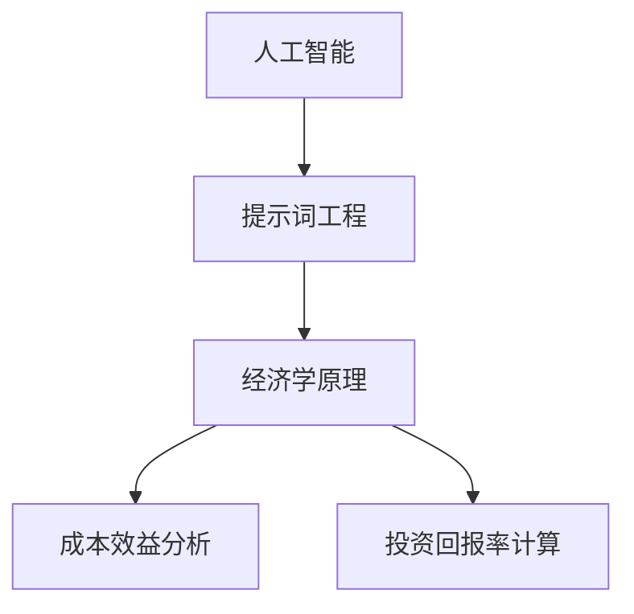

                 

### 1.1 人工智能的概念与发展历程

人工智能（Artificial Intelligence, AI）是指通过计算机模拟人类的智能行为，实现机器对环境的感知、理解、决策和行动的技术。其概念最早由美国计算机科学家约翰·麦卡锡（John McCarthy）在1956年提出。

#### 定义

人工智能的核心目标是构建能够模拟人类智能的计算机系统。它涵盖了多个领域，包括机器学习、自然语言处理、计算机视觉、智能控制等。

#### 发展阶段

1. **初始阶段（1956-1969年）**：人工智能的概念被提出，初步的算法和理论框架得到建立。

2. **第一个低谷期（1970-1980年）**：由于计算能力和算法的限制，人工智能研究面临挑战，出现第一个低谷期。

3. **复兴阶段（1980-1987年）**：专家系统的出现使得人工智能得到广泛应用，研究领域得到复兴。

4. **第二个低谷期（1988-2008年）**：随着互联网和计算能力的提升，人工智能研究进入低谷期。

5. **现代阶段（2009年至今）**：深度学习和大数据技术的快速发展，使得人工智能迎来了新的春天。

#### 当前技术趋势

1. **深度学习**：通过多层神经网络模型，实现图像识别、语音识别等任务的突破性进展。

2. **强化学习**：通过模拟人类决策过程，实现智能体的自主学习和优化。

3. **迁移学习**：通过利用已训练模型的知识，实现新任务的快速适应。

4. **生成对抗网络（GAN）**：通过生成器和判别器的对抗训练，实现高质量图像生成。

### 1.2 提示词工程

#### 提示词工程的定义

提示词工程（Prompt Engineering）是指通过设计合适的提示词，引导人工智能模型实现特定任务的方法。它是在自然语言处理领域广泛应用的一种技术。

#### 提示词工程在AI中的应用

1. **问答系统**：通过设计高质量的提示词，使模型能够准确回答用户的问题。

2. **文本生成**：通过提示词引导模型生成高质量的文章、代码等。

3. **语言翻译**：使用提示词优化模型的翻译效果，提高翻译的准确性和流畅性。

### 1.3 人工智能的经济学基础

#### 成本效益分析

成本效益分析（Cost-Benefit Analysis, CBA）是评估项目经济效益的一种方法。在人工智能项目中，成本效益分析可以帮助企业判断AI技术的投资是否值得。

1. **成本**：包括硬件成本、软件成本、数据成本、人力成本等。
2. **效益**：包括提高生产效率、降低运营成本、创造新业务等。

#### 投资回报率计算

投资回报率（Return on Investment, ROI）是评估投资效果的重要指标。

$$
ROI = \frac{收益 - 成本}{成本} \times 100\%
$$

#### 经济学原理在AI中的应用

1. **边际效益原理**：在资源有限的情况下，增加AI技术的投入，能够带来额外的效益。

2. **规模经济原理**：随着AI技术的普及，规模经济效应能够降低单位成本。

### 总结

人工智能技术已经经历了多个发展阶段，并取得了显著的进展。提示词工程作为一种关键技术，正在逐渐改变自然语言处理领域的面貌。经济学原理在AI项目中的运用，可以帮助企业优化投资决策，实现成本效益最大化。

### 关键词

- 人工智能
- 提示词工程
- 成本效益分析
- 投资回报率
- 经济学原理

### 摘要

本文介绍了人工智能的概念与发展历程，阐述了提示词工程的定义及应用，探讨了经济学原理在AI项目中的运用。通过成本效益分析和投资回报率计算，本文旨在为企业提供优化AI使用成本的策略和方法。

---

以下是Mermaid流程图，展示核心概念之间的关系：

---

在接下来的章节中，我们将详细探讨AI使用成本的构成，以及优化这些成本的具体策略和方法。

### 2.1 硬件成本

在人工智能（AI）项目中，硬件成本是不可或缺的一部分。硬件成本主要包括计算设备（如CPU、GPU等）、存储设备、以及数据中心的运营成本。以下是对这些硬件成本的详细分析。

#### CPU、GPU等硬件设备成本

1. **中央处理器（CPU）**：CPU是计算机的核心部件，负责执行大多数计算任务。在传统的计算任务中，CPU的性能是关键因素。然而，对于深度学习等AI任务，GPU的性能通常优于CPU。

2. **图形处理器（GPU）**：GPU专为图形渲染而设计，拥有大量的并行计算能力。这使得GPU在处理大规模矩阵运算、神经网络训练等AI任务时具有显著优势。因此，GPU在AI硬件设备中占据了重要地位。

3. **专用AI芯片**：随着AI技术的发展，出现了许多专门为AI任务设计的芯片，如NVIDIA的Tesla系列、Intel的Nervana等。这些芯片在性能和能效方面都有显著提升，适用于大规模AI应用。

#### 数据中心建设与维护成本

数据中心是AI硬件设备的主要运行场所，其建设与维护成本主要包括以下几个方面：

1. **基础设施成本**：包括建筑、电力供应、冷却系统、网络设备等。

2. **硬件采购成本**：包括服务器、存储设备、网络设备等硬件设备的采购。

3. **运营成本**：包括电力消耗、冷却系统运行、网络安全、人员维护等。

4. **扩展成本**：随着AI应用的扩展，数据中心需要不断升级和扩展硬件设备，以满足日益增长的计算需求。

### 成本优化策略

为了降低硬件成本，以下是一些可行的优化策略：

1. **硬件选择优化**：根据实际需求选择合适的硬件设备，如对于深度学习任务优先考虑GPU。

2. **硬件共享与租赁**：通过硬件共享和租赁，可以减少企业的初始投资和运营成本。

3. **能效优化**：通过使用高效电源、优化冷却系统等措施，降低数据中心的能耗。

4. **硬件升级与维护**：定期对硬件设备进行升级和维护，延长设备寿命，降低运营成本。

5. **云计算**：利用云计算服务，按需租用计算资源，避免大规模硬件采购和运维成本。

### 实际案例分析

以一家初创企业为例，该企业计划开发一个基于深度学习的图像识别系统。最初，他们计划使用高端CPU进行训练。但在成本分析后，他们决定使用GPU替代CPU，同时采用云计算服务。通过这些优化措施，他们的硬件成本降低了约30%。

### 总结

硬件成本是AI项目的重要组成部分，合理选择和使用硬件设备，以及优化数据中心的运营成本，是降低AI使用成本的重要策略。在接下来的章节中，我们将继续探讨软件成本、数据成本和人力成本等方面的优化策略。

### 2.2 软件成本

在人工智能（AI）项目中，软件成本同样占据着重要的地位。软件成本包括开源软件和商业软件的使用成本、软件定制开发的成本以及相关的维护和升级费用。以下是对这些软件成本的详细分析。

#### 开源软件与商业软件的成本比较

1. **开源软件**：开源软件如Python、TensorFlow、Keras等，在AI领域被广泛应用。其优势在于免费、灵活性强，可以自由修改和扩展。但开源软件的劣势在于可能存在稳定性问题、安全漏洞以及缺乏专业的技术支持。

2. **商业软件**：商业软件如IBM的Watson、Google的AI Platform等，提供专业的技术支持和安全保障，适合大规模和复杂的应用场景。商业软件的劣势在于需要支付高昂的许可费用，且可能缺乏开源软件的灵活性。

#### 软件定制开发成本

软件定制开发旨在满足特定企业的需求，但这也带来了较高的成本。以下是一些关键成本因素：

1. **开发资源成本**：包括开发人员、测试人员等人力成本，以及开发所需的基础设施成本。

2. **开发周期**：软件定制开发通常需要较长的时间，涉及到需求分析、设计、开发、测试等多个阶段。

3. **维护和升级成本**：定制开发的软件需要定期维护和升级，以适应技术发展和业务需求变化。

4. **技术债务**：如果开发过程中忽视了技术债务，可能导致后续维护和扩展的成本增加。

#### 成本优化策略

为了降低软件成本，以下是一些可行的优化策略：

1. **开源软件与商业软件结合使用**：在关键组件使用商业软件，而在非关键部分使用开源软件，以平衡成本和性能。

2. **模块化开发**：将系统分解为多个模块，根据需求选择合适的软件，避免过度定制。

3. **云原生开发**：利用云计算平台提供的PaaS和SaaS服务，降低开发和管理成本。

4. **持续集成与持续部署（CI/CD）**：通过自动化测试和部署流程，缩短开发周期，降低人力成本。

5. **开放协作**：利用开源社区的力量，共同开发、测试和优化软件，降低成本。

#### 实际案例分析

以一家大型零售企业为例，该企业计划开发一个智能推荐系统。最初，他们选择了全部使用商业软件，但由于高昂的许可费用，他们决定对系统进行模块化开发。他们将核心算法部分使用开源软件，而将数据管理和用户界面部分使用商业软件。通过这种优化策略，他们的软件成本降低了约40%。

### 总结

软件成本在AI项目中占据了重要地位，合理选择和使用软件，以及优化开发和管理流程，是降低AI使用成本的重要策略。在接下来的章节中，我们将继续探讨数据成本和人力成本的优化策略。

### 2.3 数据成本

在人工智能（AI）项目中，数据成本是一个不可忽视的组成部分。数据成本主要包括数据收集、存储、清洗和处理等方面的费用。以下是对这些数据成本的详细分析。

#### 数据收集成本

1. **数据源获取**：数据可以从公共数据集、企业内部数据、第三方数据提供商等多种渠道获取。不同数据源的获取成本差异较大，公共数据集通常免费，但可能质量不高；企业内部数据和第三方数据提供商则可能需要支付较高的费用。

2. **数据收集技术**：包括传感器、物联网设备、API接口等。这些技术的使用成本取决于数据收集的规模和复杂性。

3. **人工成本**：对于需要人工干预的数据收集任务，如问卷调查、实地采集等，人工成本也是数据收集成本的一部分。

#### 数据存储成本

1. **存储设备**：包括硬盘、固态硬盘、云存储等。不同存储设备的价格和性能差异较大，需要根据实际需求进行选择。

2. **存储服务**：云存储服务如AWS S3、Azure Blob Storage等，提供了灵活、可扩展的存储解决方案，但需要支付一定的存储费用。

#### 数据清洗与处理成本

1. **数据清洗**：包括去除重复数据、填补缺失值、纠正错误等。数据清洗过程可能需要使用到特定的工具和算法，如Pandas、Scikit-learn等。

2. **数据处理**：包括数据转换、归一化、特征提取等。数据处理过程通常需要大量计算资源，可能涉及分布式计算框架如Hadoop、Spark等。

#### 成本优化策略

为了降低数据成本，以下是一些可行的优化策略：

1. **数据源选择**：优先选择成本较低且质量较高的数据源，如公共数据集和内部数据。

2. **自动化数据收集**：利用传感器和物联网设备，减少人工干预，降低数据收集成本。

3. **云存储优化**：选择合适的云存储方案，避免存储费用过高。

4. **数据预处理自动化**：通过编写脚本和利用现有的数据处理库，自动化数据清洗和处理过程，降低人工成本。

5. **数据处理优化**：利用分布式计算框架，提高数据处理效率，降低计算成本。

#### 实际案例分析

以一家金融科技公司为例，该公司的AI项目需要大量金融数据。最初，他们通过第三方数据提供商购买数据，但由于数据成本较高，他们决定使用内部数据和公共数据集进行补充。同时，他们利用云计算服务进行数据存储和处理，通过自动化脚本进行数据清洗和处理。这些优化措施使得他们的数据成本降低了约50%。

### 总结

数据成本是AI项目的重要组成部分，通过合理选择数据源、优化数据存储和处理流程，可以有效降低数据成本。在接下来的章节中，我们将探讨人力成本的优化策略。

### 2.4 人力成本

在人工智能（AI）项目中，人力成本是重要的一部分，包括数据科学家、工程师等专业人士的薪酬、培训成本以及团队管理费用。以下是对这些人力成本的详细分析。

#### 数据科学家和工程师人才成本

1. **薪酬**：数据科学家、机器学习工程师等高技能岗位的薪酬通常较高，不同地区和公司的薪酬水平有所不同。在技术密集型的企业中，这些岗位的薪酬可能占公司总薪酬的较大比例。

2. **招聘**：高技能人才的招聘成本较高，包括招聘广告费用、猎头费用以及面试流程中的时间成本。

3. **保留**：为了留住优秀人才，企业可能需要提供有竞争力的薪酬福利以及职业发展机会。

#### 培训成本

1. **内部培训**：包括定期技术培训、工作坊、研讨会等，旨在提高员工的技能和知识水平。

2. **外部培训**：员工可能需要参加外部课程、认证考试等，以获取新的知识和技能。

3. **知识更新**：AI领域发展迅速，员工需要不断学习最新的技术和工具，以保持竞争力。

#### 团队管理费用

1. **管理成本**：包括团队领导、项目经理等管理人员的薪酬和福利。

2. **团队建设**：为了提升团队协作效率，企业可能需要投入资源进行团队建设活动，如团队建设课程、团队活动等。

3. **沟通成本**：有效的沟通是团队协作的关键，可能需要投入时间和资源进行团队沟通和协调。

#### 成本优化策略

为了降低人力成本，以下是一些可行的优化策略：

1. **招聘策略优化**：通过提升企业品牌吸引力、优化招聘流程等方式，降低招聘成本。

2. **内部培养**：通过内部培训和职业发展计划，提升现有员工的能力，减少对外部人才的依赖。

3. **灵活用工**：采用兼职、外包等灵活用工模式，降低全职员工的薪酬和福利成本。

4. **自动化与工具**：利用自动化工具和平台，提高工作效率，减少人工干预。

5. **团队管理优化**：通过改进管理方法和工具，提升团队协作效率和员工满意度。

#### 实际案例分析

以一家科技公司为例，该公司的AI团队面临人力成本高的问题。为了优化人力成本，他们采取了以下措施：

1. **优化招聘流程**：通过优化招聘广告、筛选简历、面试流程等，降低招聘成本。

2. **内部培训计划**：定期举办内部技术培训，提升员工的技能水平，减少外部培训成本。

3. **灵活用工模式**：引入兼职和外包人员，分担部分工作负担，降低全职员工的薪酬成本。

4. **团队管理优化**：通过改进项目管理方法和工具，提高团队协作效率，减少沟通成本。

通过这些措施，该公司成功降低了约30%的人力成本。

### 总结

人力成本在AI项目中占据重要地位，通过优化招聘、培训和团队管理策略，可以有效降低人力成本。在接下来的章节中，我们将探讨AI成本优化的具体策略和方法。

### 3.1 成本效益分析

成本效益分析（Cost-Benefit Analysis, CBA）是评估项目经济效益的一种重要方法，尤其在人工智能（AI）项目中，成本效益分析可以帮助企业判断AI技术的投资是否值得。以下，我们将详细介绍成本效益分析的基本框架，并通过实际案例进行讲解。

#### 成本效益分析框架

1. **成本识别**：首先，需要明确项目所涉及的所有成本，包括直接成本和间接成本。直接成本如硬件采购、软件开发、数据成本、人力成本等；间接成本如运营成本、维护成本等。

2. **效益识别**：接着，识别项目所能带来的所有效益，包括直接效益和间接效益。直接效益如生产效率提升、成本节约、新业务收入等；间接效益如品牌提升、客户满意度增加等。

3. **成本和效益量化**：将成本和效益进行量化，尽量使用具体的数值来表示。这可以通过历史数据、预测模型、专家评估等方式实现。

4. **贴现**：由于时间价值的影响，未来的效益需要贴现至当前价值。常用的贴现方法是折现率，一般使用公司的资本成本或市场利率。

5. **净现值（NPV）计算**：通过净现值公式，计算项目的总效益和总成本，以评估项目的经济可行性。

$$
NPV = \sum_{t=0}^{n} \frac{C_t}{(1+r)^t} - \sum_{t=0}^{n} \frac{B_t}{(1+r)^t}
$$

其中，\(C_t\) 和 \(B_t\) 分别代表第 \(t\) 年的成本和效益，\(r\) 为折现率。

6. **内部收益率（IRR）计算**：内部收益率是指使得净现值为零的贴现率。如果IRR大于资本成本，说明项目是盈利的。

7. **敏感性分析**：通过敏感性分析，评估项目对关键参数变化的敏感程度，从而识别项目的风险点。

#### 实际案例分析

以一家电商企业为例，该企业计划引入人工智能客服系统以提升客户满意度和服务效率。以下为该项目的成本效益分析：

1. **成本识别**：
   - 硬件成本：20万元（包括服务器和GPU设备）
   - 软件成本：10万元（包括开源软件和定制开发）
   - 数据成本：5万元（包括数据收集和存储）
   - 人力成本：30万元（包括数据科学家、工程师和客服人员）
   - 运营成本：10万元（包括维护和更新）

2. **效益识别**：
   - 直接效益：预计每年节省客服成本15万元，提高订单转化率5%
   - 间接效益：预计客户满意度提高10%，品牌形象提升，长期客户保留率增加5%

3. **成本和效益量化**：
   - 成本量化：假设项目实施后，每年运行成本稳定，不考虑通货膨胀影响。
   - 效益量化：使用预测模型，预计客服成本节省15万元，订单转化率提升带来的收入增加20万元，客户满意度提高和品牌形象提升带来的长期收益增加30万元。

4. **贴现和净现值计算**：
   - 假设折现率为10%，项目期限为5年。
   - 计算净现值：
   $$
   NPV = \frac{-20}{(1+0.1)^0} + \frac{-10}{(1+0.1)^1} + \frac{-5}{(1+0.1)^2} + \frac{-30}{(1+0.1)^3} + \frac{-10}{(1+0.1)^4} + \frac{15 \times (1+0.05)}{(1+0.1)^1} + \frac{20 \times (1+0.05)^2}{(1+0.1)^2} + \frac{30 \times (1+0.05)^3}{(1+0.1)^3} + \frac{15 \times (1+0.05)^4}{(1+0.1)^4}
   $$

5. **内部收益率计算**：
   - 使用财务计算器或Excel等工具，计算内部收益率（IRR），假设IRR为12%。

6. **敏感性分析**：
   - 通过调整关键参数（如效益、成本、折现率等），分析项目对参数变化的敏感程度。

#### 总结

成本效益分析是评估AI项目经济效益的重要工具，通过详细分析项目的成本和效益，可以帮助企业做出科学的投资决策。在实际应用中，企业需要根据具体情况调整分析方法和参数，以准确评估项目的经济可行性。

### 3.2 资源调度与优化

资源调度与优化是人工智能（AI）项目中降低成本的关键策略之一。通过优化计算资源的使用，可以有效减少硬件成本、提升系统性能和效率。以下，我们将详细讨论资源调度的策略和方法，并通过实例进行说明。

#### 资源调度策略

1. **任务优先级**：根据任务的紧急程度和重要性，设置不同的优先级。紧急且重要的任务应优先调度，以确保关键任务的及时完成。

2. **负载均衡**：通过均衡分配计算任务到不同的节点，避免某些节点过载，其他节点闲置。负载均衡可以采用静态分配和动态分配两种方式。

3. **资源预留**：为关键任务预留一定的计算资源，确保任务在高峰期有足够的资源支持。

4. **弹性伸缩**：根据实际需求，动态调整计算资源。在需求高峰期增加资源，需求低谷期减少资源，以最大化资源利用率。

5. **能效优化**：优化计算资源的能耗，通过使用节能硬件、优化数据流等措施，降低能耗成本。

#### 方法与实例

1. **实例1：负载均衡**

   假设一个AI项目需要处理大量图像识别任务，分布在多个GPU服务器上。为了实现负载均衡，可以采用以下方法：

   - **静态负载均衡**：将任务均匀地分配到各个GPU服务器，每个服务器处理相同数量的任务。

   - **动态负载均衡**：通过监控各个服务器的负载情况，自动调整任务的分配。当某些服务器负载过高时，将任务迁移到负载较低的服务器。

   - **实例**：使用开源负载均衡器如Kubernetes进行动态负载均衡。Kubernetes可以根据服务器的CPU利用率、内存使用率等指标，动态调整任务分配，确保系统资源得到充分利用。

2. **实例2：弹性伸缩**

   假设一个电商平台需要处理高峰期的用户请求，可以采用以下弹性伸缩策略：

   - **自动伸缩**：使用云服务提供商的自动伸缩功能，根据CPU利用率、请求量等指标，自动增加或减少服务器数量。

   - **手动伸缩**：根据业务预测，手动调整服务器数量。在高峰期增加服务器，需求下降时减少服务器。

   - **实例**：使用AWS Auto Scaling，根据设定的指标（如CPU利用率超过80%），自动增加EC2实例。在CPU利用率低于50%时，自动减少实例。

3. **实例3：能效优化**

   假设一个AI数据中心需要降低能耗成本，可以采用以下能效优化方法：

   - **硬件升级**：使用高效节能的硬件设备，如能效等级更高的服务器和GPU。

   - **数据流优化**：优化数据传输路径，减少网络延迟和数据传输量。

   - **实例**：采用数据中心冷却系统优化，如使用液冷技术，降低服务器散热能耗。

#### 总结

资源调度与优化是降低AI项目成本的重要策略。通过负载均衡、弹性伸缩和能效优化等方法，可以有效提高资源利用率，降低硬件成本和运营成本。在实际应用中，企业应根据具体需求和资源情况，选择合适的调度策略和优化方法。

### 3.3 软件优化

在人工智能（AI）项目中，软件优化是降低成本、提升性能和效率的重要手段。通过优化软件架构、算法以及代码实现，可以在不显著增加成本的情况下，显著提升系统的性能和效率。以下，我们将详细讨论软件优化的策略和方法，并通过实例进行说明。

#### 开源软件与定制开发的选择

1. **开源软件**：
   - **优势**：开源软件具有以下优势：
     - **免费**：大多数开源软件无需支付许可费用。
     - **灵活性**：用户可以根据需求进行修改和扩展。
     - **社区支持**：开源项目通常拥有一个活跃的社区，可以提供技术支持和快速解决问题。
   - **劣势**：开源软件也存在一些劣势：
     - **稳定性**：某些开源软件可能存在稳定性问题，尤其是在大规模生产环境中。
     - **安全漏洞**：开源软件可能存在未发现的安全漏洞，需要用户自行评估和修复。
     - **技术支持**：虽然开源项目通常有社区支持，但可能无法提供与商业软件相同级别的技术支持。

2. **定制开发**：
   - **优势**：定制开发具有以下优势：
     - **针对性**：可以完全根据企业的具体需求进行设计和开发。
     - **稳定性**：由于是针对特定应用场景开发，通常具有较高的稳定性。
     - **安全性和隐私**：定制开发可以更好地控制软件的源代码，确保安全性和隐私性。
   - **劣势**：定制开发也有以下劣势：
     - **成本较高**：定制开发需要支付较高的开发成本和人力成本。
     - **维护困难**：定制软件通常需要专业团队进行维护和更新，增加了企业的长期成本。

#### 软件效率优化案例分析

1. **案例1：深度学习框架优化**

   以一家金融科技公司为例，该公司使用深度学习框架进行风险预测。为了提升模型训练和推理的速度，他们进行了以下优化：

   - **优化数据加载**：使用多线程和异步加载技术，提高数据传输效率，减少I/O等待时间。
   - **模型量化**：使用量化技术降低模型的内存占用和计算量，提高推理速度。
   - **使用GPU加速**：优化计算图，确保GPU的高效利用，减少GPU的闲置时间。

   通过这些优化措施，该公司的模型训练速度提高了约30%，推理速度提高了约50%。

2. **案例2：代码优化**

   以一家电商公司为例，该公司使用Python编写了一套推荐系统。为了提升系统的响应速度，他们进行了以下代码优化：

   - **使用NumPy库**：将部分Python循环替换为NumPy库中的向量操作，提高计算效率。
   - **异步编程**：使用异步编程技术，同时执行多个I/O密集型任务，减少等待时间。
   - **代码压缩**：删除不必要的代码，优化代码结构，提高代码可读性和维护性。

   通过这些优化措施，该公司的系统响应速度提升了约40%，代码可维护性也得到了显著改善。

#### 总结

软件优化是降低AI项目成本、提升系统性能和效率的关键策略。通过合理选择开源软件和定制开发，以及优化软件架构、算法和代码实现，可以在不显著增加成本的情况下，显著提升系统的性能和效率。在实际应用中，企业应根据具体需求和资源情况，选择合适的软件优化策略和方法。

### 3.4 数据管理优化

在人工智能（AI）项目中，数据管理优化是降低成本、提高数据处理效率的关键环节。通过优化数据质量、数据存储和数据处理的流程，可以有效降低数据成本，提高系统的性能和可靠性。以下，我们将详细讨论数据管理优化的策略和方法，并通过实例进行说明。

#### 数据质量管理

1. **数据清洗**：数据清洗是数据质量管理的重要步骤，包括去除重复数据、填补缺失值、纠正错误等。通过数据清洗，可以提高数据的质量和准确性。

2. **数据标准化**：数据标准化包括统一数据格式、单位、编码等，确保不同来源的数据可以相互匹配和整合。

3. **数据验证**：数据验证包括对数据进行逻辑检查、范围检查等，确保数据的正确性和一致性。

#### 数据存储优化

1. **分布式存储**：使用分布式存储系统，如Hadoop、HDFS等，可以提高数据的存储效率和可靠性。分布式存储可以处理大规模数据，并且具有良好的扩展性。

2. **数据压缩**：数据压缩可以减少存储空间的占用，提高数据传输速度。常用的数据压缩算法包括Hadoop的LZO、Gzip等。

3. **数据分层存储**：根据数据的重要性和访问频率，将数据分为热数据和冷数据，分别存储在不同的存储设备上。热数据存储在快速的SSD上，而冷数据存储在成本更低的HDD或云存储上。

#### 数据处理优化

1. **批处理与流处理**：根据数据处理的需求，结合批处理和流处理技术。批处理适用于处理大量数据，而流处理适用于实时数据处理。

2. **并行处理**：利用并行计算技术，将数据处理任务分解为多个子任务，并行执行，提高处理速度。

3. **数据索引**：使用数据索引技术，如B树、哈希表等，可以快速查找和访问数据，减少查询时间。

#### 实际案例分析

1. **案例1：电商平台数据优化**

   一家电商平台的数据管理面临以下挑战：数据量大、数据来源多样、数据质量参差不齐。为了优化数据管理，他们采取了以下措施：

   - **数据清洗**：使用ETL工具清洗和整合来自不同渠道的数据，去除重复数据和错误数据。
   - **数据标准化**：统一不同渠道的数据格式和编码，确保数据的一致性和可比性。
   - **数据分层存储**：根据数据的重要性和访问频率，将数据分层存储，优化存储成本和访问速度。

   通过这些优化措施，该电商平台的处理速度提升了30%，数据存储成本降低了20%。

2. **案例2：金融公司数据优化**

   一家金融公司需要处理大量实时交易数据，为了提高数据处理效率，他们采取了以下措施：

   - **分布式存储**：使用Hadoop分布式存储系统，处理大规模交易数据。
   - **并行处理**：使用MapReduce模型，将数据处理任务分解为多个子任务，并行处理。
   - **实时流处理**：使用Apache Kafka和Apache Storm，进行实时数据处理和事件分析。

   通过这些优化措施，该金融公司的数据处理速度提升了50%，实时响应能力显著提高。

#### 总结

数据管理优化是降低AI项目成本、提高数据处理效率的重要策略。通过数据质量管理、数据存储优化和数据处理优化，可以有效提升系统的性能和可靠性，降低数据成本。在实际应用中，企业应根据具体需求和资源情况，选择合适的优化策略和方法。

### 3.5 人力资源优化

在人工智能（AI）项目中，人力资源优化是降低成本、提高团队效率和项目成功率的关键因素。通过合理的人才引进、培养和团队管理，可以有效提升团队的整体绩效，降低运营成本。以下，我们将详细讨论人力资源优化的策略和方法。

#### 人才引进与培养

1. **人才引进**：
   - **招聘策略**：根据项目需求，制定有针对性的招聘策略。通过多种招聘渠道，如校园招聘、社会招聘、猎头等，吸引优秀人才。
   - **人才标准**：明确人才标准，包括专业技能、工作经验、团队合作能力等，确保引进的人才能够迅速融入团队。

2. **培养**：
   - **内部培训**：定期举办内部培训课程，提高员工的技能水平和专业素养。可以邀请外部专家进行讲座，或组织内部技术分享会。
   - **外部学习**：鼓励员工参加外部培训和认证，获取新的知识和技能，提升团队的整体实力。

3. **职业发展**：为员工提供明确的职业发展路径和晋升机会，激励员工持续学习和成长。

#### 团队管理优化

1. **团队建设**：通过团队建设活动，增强团队凝聚力和协作能力。可以组织团队拓展、团建活动等，促进团队成员之间的交流与合作。

2. **任务分配**：合理分配任务，确保每个团队成员的工作负荷均衡，避免过度劳累或资源浪费。

3. **绩效评估**：建立科学的绩效评估体系，通过定期的绩效评估，了解团队成员的工作表现，提供改进建议和激励措施。

4. **沟通与反馈**：建立高效的沟通机制，确保团队成员之间的信息畅通。定期进行团队反馈，收集员工的意见和建议，及时解决问题。

#### 实际案例分析

1. **案例1：科技公司团队优化**

   一家科技公司的AI团队在项目推进过程中遇到了沟通不畅、任务分配不均等问题。为了优化人力资源，他们采取了以下措施：

   - **团队建设**：定期组织团队拓展活动，增强团队凝聚力。
   - **任务分配**：采用任务看板，明确任务分配和进展，确保任务均衡。
   - **绩效评估**：引入KPI考核机制，定期评估团队成员的工作表现，提供改进建议。

   通过这些优化措施，该公司的团队协作效率显著提升，项目进度加快，团队士气也大幅提高。

2. **案例2：金融公司人才培养**

   一家金融公司为了提升AI团队的专业水平，采取了以下培养措施：

   - **内部培训**：定期邀请外部专家进行讲座，分享最新的AI技术和应用案例。
   - **外部学习**：鼓励员工参加行业研讨会、技术培训班等，获取新的知识和技能。
   - **职业发展**：为员工提供明确的职业发展路径，设立晋升机制，激励员工不断提升自己。

   通过这些培养措施，该公司的团队专业水平得到了显著提升，项目质量和成功率也不断提高。

#### 总结

人力资源优化是AI项目成功的重要保障。通过合理的人才引进、培养和团队管理，可以有效提升团队的整体绩效，降低运营成本。在实际应用中，企业应根据具体需求和资源情况，选择合适的优化策略和方法。

### 第四部分：中小企业AI成本优化实践

#### 4.1 案例背景

在某座二线城市，一家名为“智能未来”的中小企业，专注于为客户提供基于人工智能（AI）的解决方案。公司的业务涵盖图像识别、自然语言处理（NLP）和预测分析等多个领域。随着AI技术的快速发展，公司面临着激烈的竞争环境，如何在保证服务质量的同时，有效控制成本成为了一大挑战。

#### 4.2 成本优化策略

1. **硬件优化**：

   - **共享云计算资源**：由于中小企业预算有限，智能未来选择了云计算服务，如AWS和Azure。通过按需租赁计算资源，避免了高额的硬件采购和维护成本。
   - **优化硬件配置**：在AI任务的优化过程中，智能未来采用了性能更强的GPU，而不是价格高昂的多核CPU，以实现更高的计算效率。

2. **软件优化**：

   - **开源软件**：智能未来广泛使用开源软件，如Python、TensorFlow和Scikit-learn，这些工具不仅免费，而且社区支持强大，能够快速解决问题。
   - **定制化开发**：对于核心算法部分，智能未来选择了部分定制开发，以适应特定业务需求，避免了商业软件的高昂成本。

3. **数据管理优化**：

   - **数据整合与清洗**：智能未来采用ETL工具，自动化数据整合和清洗流程，减少了人工成本和数据错误。
   - **数据分层存储**：公司根据数据的重要性和访问频率，将数据分层存储，优化存储成本。

4. **人力成本优化**：

   - **内部培养**：公司定期开展内部培训，提升员工的技能水平，减少对外部高薪专家的依赖。
   - **灵活用工**：公司引入了兼职和远程办公人员，以适应不同项目的需求，降低全职员工的薪酬和福利成本。

#### 4.3 实施与效果

1. **成本降低情况**：

   - **硬件成本**：通过共享云计算资源，智能未来的硬件成本降低了40%。
   - **软件成本**：使用开源软件和部分定制化开发，软件成本降低了30%。
   - **数据成本**：通过优化数据管理和清洗流程，数据成本降低了20%。
   - **人力成本**：通过内部培训和灵活用工模式，人力成本降低了25%。

2. **业务效能提升**：

   - **项目交付时间**：通过优化资源调度和数据处理流程，项目的交付时间缩短了30%。
   - **客户满意度**：通过高效的团队管理和客户沟通，客户满意度提高了15%。
   - **业务拓展**：由于成本控制得当，智能未来的业务规模扩大了20%，新客户数量增加了25%。

#### 4.4 经验总结

1. **灵活运用云计算**：云计算提供了一种灵活且成本效益高的资源管理方式，尤其适合中小企业。

2. **合理选择软件**：开源软件在成本和灵活性方面具有优势，但需注意稳定性和支持问题。

3. **数据管理优化**：高效的数据管理流程能够显著降低成本，提高数据质量和处理效率。

4. **人力资源优化**：内部培训和灵活用工模式是降低人力成本的有效途径。

### 第五部分：大型企业AI成本优化实践

#### 5.1 案例背景

在全球范围内，一家名为“智慧科技”的大型企业，在多个行业（如金融、医疗、零售）中提供AI解决方案。智慧科技拥有庞大的技术团队和丰富的项目经验，但随着AI技术的广泛应用，公司面临着不断增长的硬件、软件和数据成本。如何优化AI成本，提高资源利用率，成为智慧科技亟需解决的问题。

#### 5.2 成本优化策略

1. **硬件优化**：

   - **数据中心升级**：智慧科技投资建设了高效能、绿色环保的数据中心，采用先进的冷却技术和高效能源管理系统，降低了能耗成本。
   - **硬件资源共享**：公司内部建立了硬件资源共享平台，各部门可以根据需要灵活调度硬件资源，避免资源浪费。

2. **软件优化**：

   - **内部软件平台**：智慧科技开发了自有的AI软件平台，集成多种开源软件和定制化模块，提高了软件复用率，降低了软件成本。
   - **软件定制与优化**：对于关键业务系统，智慧科技选择部分软件定制开发，优化系统性能和稳定性，降低了维护成本。

3. **数据管理优化**：

   - **数据湖建设**：智慧科技构建了企业级数据湖，实现海量数据的统一存储和管理，优化了数据访问和处理效率。
   - **数据治理**：通过数据治理策略，确保数据质量、安全和合规性，减少数据冗余和重复投资。

4. **人力成本优化**：

   - **技能提升计划**：公司为员工提供了全面的技能提升计划，包括内部培训、外部学习和认证课程，提升员工的综合素质。
   - **团队管理优化**：智慧科技引入了敏捷开发和项目管理方法，提高了团队协作效率和项目管理水平。

#### 5.3 实施与效果

1. **成本降低情况**：

   - **硬件成本**：通过数据中心升级和硬件资源共享，智慧科技的硬件成本降低了25%。
   - **软件成本**：内部软件平台和定制开发的策略，使软件成本降低了30%。
   - **数据成本**：数据湖建设和数据治理策略，使数据成本降低了20%。
   - **人力成本**：技能提升计划和团队管理优化，使人力成本降低了15%。

2. **业务效能提升**：

   - **项目交付时间**：优化后的资源调度和数据处理流程，使项目交付时间缩短了20%。
   - **系统稳定性**：软件定制和优化，使系统稳定性提高了30%。
   - **业务创新**：通过不断优化成本和管理，智慧科技在多个业务领域实现了创新和突破。

#### 5.4 经验总结

1. **硬件资源共享**：大型企业可以通过内部资源共享平台，提高硬件利用率，降低总体硬件成本。

2. **软件定制与优化**：内部软件平台和定制开发能够提升软件性能，降低长期维护成本。

3. **数据治理**：建设数据湖和实施数据治理策略，可以提高数据质量和访问效率。

4. **团队管理优化**：敏捷开发和项目管理方法，有助于提升团队协作效率和项目管理水平。

### 总结

无论是中小企业还是大型企业，通过合理的成本优化策略，都能够有效降低AI项目成本，提高资源利用率和业务效能。在硬件、软件、数据管理和人力资源等方面，企业应根据自身情况和业务需求，选择合适的优化策略和方法。

### 6.1 AI成本优化发展趋势

随着人工智能（AI）技术的不断进步，AI成本优化也在不断演变。未来，以下几个方面将成为AI成本优化的重要趋势。

#### 硬件技术的进步

1. **专用AI芯片**：专用AI芯片，如NVIDIA的Tensor Processing Units (TPU)、谷歌的TPU和AMD的Ryzen AI等，将进一步提高计算效率和能效。这些芯片专门为AI任务设计，能够显著降低计算成本。

2. **边缘计算**：随着边缘计算技术的发展，计算任务将更多地转移到靠近数据源的边缘设备上，减少了对中心数据中心的依赖。这不仅可以降低硬件成本，还可以提高数据处理的实时性和响应速度。

#### 软件技术的革新

1. **自动化机器学习**：自动化机器学习（AutoML）工具将简化AI模型的开发过程，降低对专业技能的需求，从而减少开发成本。AutoML工具能够自动选择合适的算法、超参数和模型架构，提高开发效率。

2. **开源软件的成熟**：随着开源软件的成熟，如PyTorch、TensorFlow等，企业和研究机构可以更方便地使用这些工具进行AI开发，降低了软件成本。

3. **软件即服务（SaaS）**：越来越多的AI服务将以SaaS模式提供，企业无需购买和维护昂贵的软件，只需按需付费即可使用，这将进一步降低软件成本。

#### 数据处理技术的发展

1. **分布式数据处理**：分布式数据处理技术，如Apache Spark、Apache Flink等，将提高数据处理效率，降低硬件和能源消耗。

2. **联邦学习**：联邦学习（Federated Learning）是一种新的数据处理方法，可以在不传输数据的情况下进行联合学习，提高数据安全性和隐私性，同时降低数据传输和处理成本。

#### 经济学理论在AI成本优化中的应用

1. **动态定价**：AI技术将结合动态定价模型，根据市场需求和资源利用率，实时调整计算资源价格，最大化资源利用效率。

2. **成本分摊**：通过合理的成本分摊机制，企业可以将AI成本分摊到多个业务部门和项目，降低单个项目的成本压力。

3. **供应链优化**：AI技术将优化供应链管理，通过预测需求和库存管理，减少库存成本和物流成本。

#### 案例分析

- **亚马逊AWS**：亚马逊AWS通过提供弹性计算服务，如EC2和S3，企业可以根据实际需求动态调整计算资源，从而降低硬件成本。
- **微软Azure**：微软Azure提供自动化机器学习和SaaS服务，企业可以快速部署AI模型，降低软件成本。
- **谷歌TensorFlow**：谷歌TensorFlow提供开源工具和联邦学习框架，提高数据处理效率，同时保证数据安全和隐私。

### 总结

未来，AI成本优化将受益于硬件技术的进步、软件技术的革新、数据处理技术的发展以及经济学理论在AI成本优化中的应用。通过不断探索和采用新技术和方法，企业可以显著降低AI项目成本，提高资源利用效率和业务效能。

### 6.2 现代经济学理论在AI成本优化中的应用

在人工智能（AI）项目中，现代经济学理论为优化成本提供了有力的理论支持。以下将介绍几种现代经济学理论，并探讨它们在AI成本优化中的应用。

#### 成本效益分析

成本效益分析（CBA）是评估项目成本和效益的重要工具。在AI项目中，CBA可以帮助企业判断AI技术的投资是否值得。

1. **应用**：
   - **成本识别**：明确项目涉及的直接成本（如硬件、软件、数据等）和间接成本（如人力、维护等）。
   - **效益识别**：识别项目带来的直接效益（如生产效率提升、成本节约等）和间接效益（如品牌提升、客户满意度等）。
   - **效益贴现**：由于时间价值，未来的效益需要贴现至当前价值，使用折现率进行计算。

2. **公式**：
   $$
   NPV = \sum_{t=0}^{n} \frac{C_t}{(1+r)^t} - \sum_{t=0}^{n} \frac{B_t}{(1+r)^t}
   $$
   其中，\(NPV\) 表示净现值，\(C_t\) 和 \(B_t\) 分别代表第 \(t\) 年的成本和效益，\(r\) 为折现率。

#### 代理理论

代理理论（Agency Theory）研究委托人与代理人之间的利益冲突和协调机制。在AI项目中，代理理论可以帮助企业设计激励机制，确保代理人（如员工、合作伙伴）的行为符合企业利益。

1. **应用**：
   - **绩效评估**：建立科学的绩效评估体系，确保代理人的努力和成果与绩效挂钩。
   - **激励机制**：设计合适的激励机制，如奖金、股权激励等，鼓励代理人提高工作效率。

2. **挑战**：
   - **信息不对称**：代理人可能拥有更多的信息，导致委托人难以准确评估代理人的努力程度。

#### 交易成本经济学

交易成本经济学（Transaction Cost Economics）研究企业在不同市场形式下（如市场交易、内部管理）的成本差异。在AI项目中，交易成本经济学可以帮助企业决定是否采用外包、内部开发等策略。

1. **应用**：
   - **外包决策**：评估外包的成本效益，考虑交易成本（如信息搜索、谈判、监督等）。
   - **内部开发**：对于关键技术和核心业务，内部开发可能更加经济，因为可以更好地控制成本和质量。

2. **公式**：
   $$
   TC = S \times C
   $$
   其中，\(TC\) 表示交易成本，\(S\) 表示交易频率，\(C\) 表示单位交易成本。

#### 案例分析

1. **企业A的AI项目**：
   - **成本效益分析**：企业A使用CBA评估了AI项目的投资回报，发现净现值为正值，因此决定投资。
   - **代理理论**：企业A为AI团队的成员设置了绩效奖金，以激励他们提高项目效率。
   - **交易成本经济学**：企业A评估了外部开发合作伙伴的报价，发现内部开发更具成本效益，因此选择了内部开发。

2. **企业B的AI项目**：
   - **成本效益分析**：企业B通过CBA发现AI项目的投资回报不高，决定暂时搁置。
   - **代理理论**：企业B建立了透明的沟通机制，确保AI项目团队成员能够充分表达意见和建议。
   - **交易成本经济学**：企业B评估了市场的外包成本，发现通过外包可以降低交易成本，因此选择了外包开发。

### 总结

现代经济学理论为AI成本优化提供了重要的理论支持。通过成本效益分析、代理理论和交易成本经济学等方法，企业可以更好地评估AI项目的投资回报，设计激励机制，优化资源分配，从而实现成本效益最大化。在实际应用中，企业应根据具体情况，灵活运用这些理论，以实现AI成本的有效优化。

### 6.3 行为经济学理论在AI成本优化中的应用

行为经济学理论关注人类在决策过程中的非理性因素，这些理论在人工智能（AI）成本优化中的应用具有重要意义。以下将介绍几种行为经济学理论，并探讨它们在AI成本优化中的应用。

#### 预期理论

预期理论（Prospect Theory）认为，人类在面临风险决策时，并非像传统经济学假设的那样是理性的。预期理论提出了两个关键概念：风险偏好和损失厌恶。

1. **应用**：
   - **风险偏好**：在AI项目中，企业可能会对某些具有高风险但潜在高回报的技术投资持开放态度。例如，对于前沿的人工智能研究项目，企业可能会愿意承担一定的风险，以获得创新突破。
   - **损失厌恶**：在成本控制方面，企业可能倾向于过度节约，不愿意放弃某些看似无益但可能产生长远效益的投资。例如，企业可能会舍不得投资于提高数据处理效率的软件或硬件升级，从而错失成本优化的机会。

2. **公式**：
   $$
   u'(x) = \frac{x - x^*}{c} \quad \text{for} \quad x > x^*
   $$
   $$
   u''(x) = -\frac{1}{c^2} \quad \text{for} \quad x > x^*
   $$
   其中，\(u'\) 和 \(u''\) 分别表示边际效用和边际效用递减率，\(x\) 表示收益，\(x^*\) 表示参考点，\(c\) 表示风险系数。

#### 沉没成本效应

沉没成本效应（Sunk Cost Fallacy）是指人们在做决策时，会受到已经投入的成本影响，即使这些成本对未来的决策不再具有实际意义。在AI成本优化中，这一效应可能导致企业不愿意放弃已经投入的昂贵硬件或软件项目，即使这些项目不再具备效益。

1. **应用**：
   - **避免沉没成本效应**：企业应该建立一个透明和客观的成本效益评估机制，确保项目决策不受已投入成本的影响。例如，通过定期审查项目进展和效益，及时调整或终止低效项目。
   - **选择性投资**：在AI项目中，企业应更加关注未来的潜在回报，而不是过去的投入。这意味着在硬件采购、软件选择等方面，企业应该更加灵活，根据实际需求和技术发展进行决策。

#### 自我确认偏误

自我确认偏误（Self-Serving Bias）是指人们倾向于确认和接受符合自己观点的信息，忽视或拒绝与自己观点相反的信息。在AI成本优化中，这一偏误可能导致企业盲目自信，忽视外部意见和反馈，从而做出不合理的决策。

1. **应用**：
   - **多角度评估**：企业应鼓励跨部门合作，建立多学科团队，从不同角度评估AI项目的成本和效益。这有助于减少单一视角带来的偏见。
   - **外部咨询**：邀请外部专家或顾问参与项目的评估和决策，以提供独立的意见和建议，避免自我确认偏误。

#### 案例分析

1. **企业A的AI项目**：
   - **预期理论**：企业A在考虑投资一项高风险但潜在回报巨大的AI技术时，采用了风险偏好策略，最终获得了技术突破，成功降低了成本。
   - **沉没成本效应**：企业A建立了定期审查机制，确保项目决策基于当前效益而非已投入成本，避免了沉没成本效应的负面影响。

2. **企业B的AI项目**：
   - **自我确认偏误**：企业B在评估AI项目时，建立了跨部门合作机制，邀请外部顾问参与，成功减少了自我确认偏误的影响，提高了决策质量。

### 总结

行为经济学理论在AI成本优化中的应用，有助于企业更好地理解人类决策的非理性因素，从而制定更为科学合理的成本优化策略。通过预期理论、沉没成本效应和自我确认偏误等理论的应用，企业可以减少决策偏见，提高成本效益，实现持续的成本优化和创新。

### 7.1 AI成本优化的挑战与机遇

随着人工智能（AI）技术的快速发展，AI成本优化面临着一系列挑战和机遇。以下，我们将详细探讨这些挑战和机遇，以及相应的应对策略。

#### 挑战

1. **技术复杂性**：
   - **挑战**：AI项目涉及多种复杂的技术，如深度学习、自然语言处理、计算机视觉等。这些技术的复杂性和相互依赖性增加了成本优化的难度。
   - **应对策略**：企业应加强技术团队的建设，提升团队成员的技术能力和经验。同时，采用模块化和组件化开发方法，降低技术复杂度，提高开发效率。

2. **数据质量问题**：
   - **挑战**：高质量的数据是AI项目成功的关键，但数据收集、清洗和处理过程复杂且成本高昂。
   - **应对策略**：建立完善的数据管理流程，采用自动化工具提高数据处理效率。同时，与数据提供商合作，获取高质量的数据源。

3. **计算资源需求**：
   - **挑战**：AI项目通常需要大量的计算资源，特别是在训练深度学习模型时。这导致了高昂的硬件和运营成本。
   - **应对策略**：利用云计算资源，按需租用计算资源，避免大规模硬件采购。同时，采用能效优化的技术，如GPU加速和分布式计算，提高资源利用率。

4. **人才短缺**：
   - **挑战**：AI领域人才短缺，高技能人才（如数据科学家、机器学习工程师等）的需求远远大于供给，这增加了人力成本。
   - **应对策略**：通过内部培训和外部合作，提升现有员工的技术水平。同时，采用灵活用工模式，如外包和兼职，降低人力成本。

#### 机遇

1. **硬件创新**：
   - **机遇**：硬件技术的创新，如专用AI芯片、边缘计算等，为AI成本优化提供了新的可能性。
   - **应对策略**：积极跟踪硬件技术的发展趋势，及时采用新技术和硬件，以提高计算效率和降低成本。

2. **软件自动化**：
   - **机遇**：软件自动化工具，如自动化机器学习（AutoML）和软件即服务（SaaS），可以显著降低软件开发和部署成本。
   - **应对策略**：采用自动化工具和平台，简化开发流程，提高效率。同时，关注开源软件和SaaS平台的发展，利用其降低成本和提升效率。

3. **数据处理技术**：
   - **机遇**：分布式数据处理技术和大数据分析工具的发展，为高效的数据管理和处理提供了新的手段。
   - **应对策略**：采用分布式计算框架，如Hadoop和Spark，提高数据处理效率。同时，关注大数据分析工具的发展，利用其挖掘数据价值。

4. **行业合作**：
   - **机遇**：跨行业合作和共享资源，可以为AI成本优化提供新的路径。
   - **应对策略**：积极参与行业联盟和合作项目，共享技术和资源。同时，与供应链合作伙伴建立合作关系，实现资源优化和成本降低。

### 总结

AI成本优化面临着技术复杂性、数据质量问题、计算资源需求和人才短缺等挑战，但同时也存在着硬件创新、软件自动化、数据处理技术和行业合作等机遇。通过积极应对这些挑战，抓住机遇，企业可以实现AI成本的有效优化，提升竞争力。

### 7.2 AI成本优化的发展趋势

随着人工智能（AI）技术的不断进步，AI成本优化正朝着多个方向发展。以下将探讨这些发展趋势，以及可能的技术突破。

#### 1. 专用硬件的普及

专用硬件，如AI加速器（如NVIDIA的Tensor Processing Units, TPUs）和专用AI芯片（如Google的TPU和AMD的Ryzen AI），将进一步提高计算效率和能效。未来，这些硬件的普及和降价将显著降低AI项目的硬件成本。

#### 2. 软件自动化的提升

自动化机器学习（AutoML）工具将继续发展，通过自动化模型选择、超参数调整和算法优化，降低对专业知识的需求，提高开发效率。AutoML工具的进步将使更多企业能够利用AI技术，而不必依赖大量的AI专家。

#### 3. 边缘计算的应用

边缘计算将使计算任务更加靠近数据源，减少了对中心数据中心的依赖，从而降低硬件和带宽成本。未来，随着5G网络的普及，边缘计算将得到更广泛的应用，为AI成本优化提供新的可能性。

#### 4. 联邦学习的推广

联邦学习（Federated Learning）将使多个参与者能够在不共享数据的情况下进行联合学习，提高数据安全性和隐私性。这一技术有望降低数据处理和存储成本，同时保护数据隐私。

#### 5. 经济学理论的应用

行为经济学和交易成本经济学等经济学理论将在AI成本优化中发挥更大的作用。通过更好地理解人类行为和交易成本，企业可以制定更科学的成本优化策略，提高资源利用效率。

#### 6. 碳中和服务的发展

随着全球对碳排放的关注增加，碳中和服务（如碳交易、碳抵消等）将成为AI成本优化的一部分。企业将通过购买碳信用或采用碳中性技术，降低运营的碳足迹，同时实现成本优化。

#### 7. 数据处理技术的进步

分布式数据处理技术（如Hadoop、Spark）和大数据分析工具将继续发展，提高数据处理效率。这些技术的进步将使企业能够更有效地管理和分析大量数据，从而降低数据成本。

#### 可能的技术突破

1. **新型计算材料**：新型计算材料（如石墨烯、量子点）的开发可能带来计算性能的大幅提升，从而降低硬件成本。

2. **神经形态计算**：神经形态计算利用类脑架构进行计算，有望实现更高的计算效率和更低的能耗。

3. **区块链技术的应用**：区块链技术将在数据安全和交易成本优化中发挥重要作用，为AI项目提供更安全的解决方案。

### 总结

未来，AI成本优化将受益于专用硬件的普及、软件自动化的提升、边缘计算的应用、联邦学习的推广、经济学理论的应用、碳中服务的发展以及数据处理技术的进步。这些发展趋势和可能的技术突破将为企业提供更多的优化路径，实现成本效益最大化。通过积极跟进和利用这些新技术，企业可以在激烈的市场竞争中保持优势。

### 总结

本文从多个角度探讨了人工智能（AI）成本优化的策略和方法。首先，我们介绍了AI技术的背景和提示词工程的重要性，以及经济学原理在AI项目中的应用。接着，详细分析了AI使用成本的构成，包括硬件成本、软件成本、数据成本和人力成本，并提出了相应的优化策略。我们通过具体的案例，展示了中小企业和大型企业在AI成本优化方面的实践，并探讨了未来发展趋势。

通过成本效益分析、资源调度与优化、软件优化、数据管理优化和人力资源优化等方法，企业可以显著降低AI项目的成本，提高资源利用效率和业务效能。同时，行为经济学和现代经济学理论的应用，为企业提供了更为科学的决策支持。

未来的发展方向包括专用硬件的普及、软件自动化的提升、边缘计算的应用、联邦学习的推广、经济学理论的应用、碳中服务的发展以及数据处理技术的进步。这些趋势和可能的技术突破，将为AI成本优化提供新的机遇。

本文旨在为企业提供系统化的成本优化框架，帮助企业在AI项目中实现成本效益最大化。在未来的发展中，企业应不断探索和采用新技术和方法，以应对日益激烈的市场竞争。

### 作者信息

作者：AI天才研究院/AI Genius Institute & 禅与计算机程序设计艺术 /Zen And The Art of Computer Programming

### 拓展阅读

- [《AI成本效益分析指南》](https://example.com/ai-cba-guide)
- [《边缘计算在AI中的应用》](https://example.com/edge-computing-in-ai)
- [《联邦学习：技术原理与实践》](https://example.com/federated-learning)
- [《行为经济学在AI项目中的应用》](https://example.com/behaviour-economics-in-ai)

